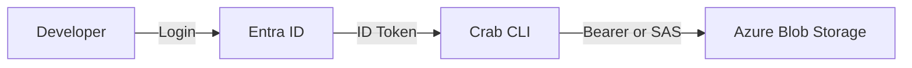

## How Crab Authenticates with Azure

Crab integrates with Entra ID (formerly Azure AD) to provide keyless authentication to Azure Blob Storage. Developers authenticate with their corporate identity and receive scoped tokens — no storage account keys or SAS tokens need to be managed manually.



## Two Authentication Modes

Crab supports two paths to Azure Blob Storage, depending on your organization's setup:

| Mode | How it works | When to use |
|------|-------------|-------------|
| **Direct bearer** | ID token used directly as a bearer token for storage operations | Simpler setup; requires Storage scope on the app registration |
| **Crab Auth endpoint** | ID token exchanged at a Crab Auth endpoint for a scoped SAS or bearer token | More flexible; supports fine-grained per-bucket authorization |

The mode is determined by whether `auth_endpoint` is configured. Without it, Crab uses direct bearer. With it, Crab calls the Crab Auth endpoint.

## Developer Configuration

```toml
# ~/.config/crab/config.toml
[auth]
provider = "azure-entra"
issuer_url = "https://login.microsoftonline.com/<tenant-id>/v2.0"
client_id = "<application-client-id>"

[auth.azure]
tenant_id = "<directory-tenant-id>"
storage_account = "mlmodels"
```

For organizations using a Crab Auth endpoint:

```toml
[auth]
auth_endpoint = "https://crab-auth.corp.example.com/v1/azure"
```

Then authenticate:

```bash
crab login
# Authenticated as alice@corp.example.com (azure-entra)
```

## Configuration Reference

| Key | Type | Required | Description |
|-----|------|----------|-------------|
| `tenant_id` | string | Yes | Entra ID tenant (directory) ID |
| `subscription_id` | string | No | Azure subscription ID for SAS scoping |
| `storage_account` | string | No | Storage account name for SAS scoping |

### Token Resolution

When both `sas_token` and `bearer_token` are present in a Crab Auth response, the SAS token takes precedence. On 401 responses from Blob Storage, Crab automatically refreshes the token via the refresh token grant and retries once.

## Platform Admin Setup

### 1. Register the CLI app in Entra ID

In Azure Portal → Entra ID → App registrations:
- Name: `crab-cli`
- Supported account types: Single tenant
- Redirect URI: Public client, `http://127.0.0.1/callback`
- Enable "Allow public client flows" under Authentication → Advanced settings

### 2. Configure API permissions

Add the "Azure Storage" → `user_impersonation` delegated permission, then grant admin consent for your organization.

### 3. Assign storage roles

```bash
az role assignment create \
  --role "Storage Blob Data Contributor" \
  --assignee-object-id <user-or-group-object-id> \
  --scope /subscriptions/<sub-id>/resourceGroups/<rg>/providers/Microsoft.Storage/storageAccounts/<account>
```

## Troubleshooting

| Error | Cause | Fix |
|-------|-------|-----|
| `AADSTS700016: Application not found` | Wrong `client_id` for the tenant | Verify Application (client) ID in Azure Portal |
| `AADSTS65001: User has not consented` | Admin consent not granted for Storage API | Ask Entra ID admin to grant consent |
| `403 Forbidden` on blob operations | Missing Storage Blob Data Contributor role | Check role assignments on the storage account |

## CLI Reference

For complete command syntax and all available flags, see the [crab login reference](/docs/cli/reference/crab-login).
