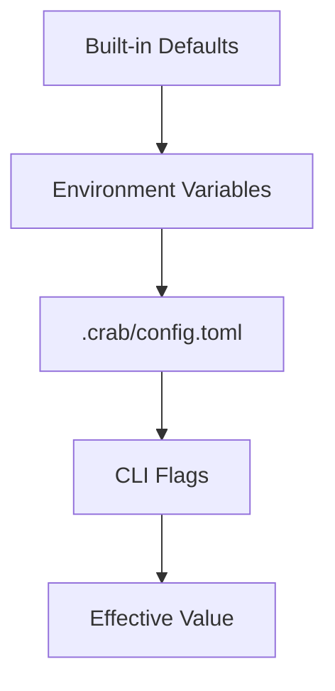

## Crab's Configuration System

Every Crab repository has a local configuration file at `.crab/config.toml` that controls behavior like lazy checkout, hydration patterns, download concurrency, and storage tier policies. This file is separate from git's own config and manages Crab-specific settings.



## Settings Hierarchy

When Crab resolves a configuration value, it checks sources in priority order. Higher-priority sources override lower ones:

| Priority | Source | Example |
|----------|--------|---------|
| Highest | CLI flags | `--log-level debug` |
| | Local config | `.crab/config.toml` |
| | Environment variables | `CRAB_LOG=debug` |
| Lowest | Built-in defaults | Sensible out-of-the-box values |

## Reading and Writing Config

Use `crab config get` and `crab config set` to interact with the local config file:

```bash
# Read a value
crab config get checkout.lazy
# true

# Write a value
crab config set checkout.lazy true

# Array values are appended (not replaced)
crab config set hydrate.include '*.safetensors'
crab config set hydrate.include '*.bin'
```

Keys use dotted notation: `<section>.<key>`. Missing keys return no output (exit code 0).

## Config File Format

The file uses TOML and lives at `.crab/config.toml` in your repository root:

```toml
[checkout]
lazy = true

[hydrate]
include = ["*.safetensors", "*.bin"]
exclude = ["archive/*"]

[tier]
enabled = true
to_ia_days = 30
to_deep_days = 180
```

You can edit this file directly with any text editor — the CLI commands are a convenience wrapper.

## Available Settings

### Core Settings

| Key | Type | Default | Description |
|-----|------|---------|-------------|
| `checkout.lazy` | bool | `false` | Leave files as pointers on checkout |
| `download_concurrency` | int | — | Number of concurrent downloads |
| `max_retries` | int | — | Maximum retry attempts for transient errors |
| `operation_timeout` | string | — | Timeout for remote operations |

### Hydration Settings

| Key | Type | Default | Description |
|-----|------|---------|-------------|
| `hydrate.include` | array | `[]` | Default include patterns for `crab hydrate` |
| `hydrate.exclude` | array | `[]` | Default exclude patterns for `crab hydrate` |
| `hydrate.auto_restore` | bool | `true` | Automatically restore archived xorbs during hydrate |

### Storage Settings

| Key | Type | Default | Description |
|-----|------|---------|-------------|
| `repack_auto_threshold` | int | — | Pack count that triggers auto-repack |
| `tier.enabled` | bool | `false` | Enable storage tier lifecycle rules |
| `tier.to_ia_days` | int | `30` | Days before transition to warm storage |
| `tier.to_deep_days` | int | `180` | Days before transition to cold storage |

## Value Types

| Type | Examples | Notes |
|------|----------|-------|
| Boolean | `true`, `false`, `yes`, `no` | Case-insensitive |
| String | `us-east-1`, `standard` | Stored as-is |
| Integer | `30`, `16` | Numeric values |
| Array | `*.bin` | `set` appends to existing array for `include`/`exclude` keys |

## JSON Output

The `--json` flag on `crab config get` returns structured output including where the value came from:

```bash
crab config get checkout.lazy --json
```

```json
{
  "schema": "config.get",
  "version": "1.0",
  "data": {
    "key": "checkout.lazy",
    "value": "true",
    "source": "local"
  }
}
```

The `source` field indicates the origin: `"default"`, `"env"`, `"local"`, or `"remote"`.

## CLI Reference

For complete command syntax and all available flags, see the [crab config reference](/docs/cli/reference/crab-config).
