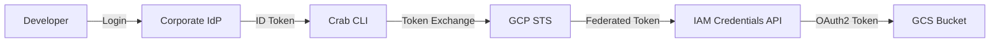

## How Crab Authenticates with GCP

Crab uses GCP Workload Identity Federation to exchange your corporate OIDC token for short-lived GCS credentials. No service account keys live on developer machines — authentication flows through your existing corporate IdP and lands on a scoped service account via federation.



## The Credential Flow

The GCP flow has one extra hop compared to AWS — a federated token is exchanged for a service account OAuth2 token:

1. You authenticate with your corporate IdP (browser or device code flow).
2. Crab sends the ID token to GCP's Security Token Service for a federated access token.
3. The federated token is used to impersonate a service account via the IAM Credentials API.
4. The resulting OAuth2 token grants access to GCS operations.

Credentials are short-lived and automatically refreshed. You typically run `crab login` once per device.

## Developer Configuration

```toml
# ~/.config/crab/config.toml
[auth]
provider = "gcp-workload-identity"
issuer_url = "https://login.corp.example.com"
client_id = "crab-cli-prod"

[auth.gcp]
workload_identity_pool = "projects/123456/locations/global/workloadIdentityPools/crab-pool/providers/corp-idp"
service_account = "crab-dev@my-project.iam.gserviceaccount.com"
project_id = "my-project"
```

Then authenticate:

```bash
crab login
# Authenticated as alice@corp.example.com (gcp-workload-identity)
```

Verify the setup:

```bash
crab auth status
```

```
Provider:     gcp-workload-identity
Identity:     alice@corp.example.com
Token expiry: 2026-04-24T18:30:00Z (52 minutes remaining)
Refresh:      yes
WI pool:      projects/123456/.../crab-pool/providers/corp-idp
Service acct: crab-dev@my-project.iam.gserviceaccount.com
```

## Configuration Reference

| Key | Type | Required | Description |
|-----|------|----------|-------------|
| `workload_identity_pool` | string | Yes | Full resource name of the WIF pool provider |
| `service_account` | string | Yes | Service account email to impersonate |
| `project_id` | string | No | GCP project ID (informational) |

### Audience Derivation

The WIF audience is derived automatically from the pool resource name. If it doesn't start with `//iam.googleapis.com/`, Crab prepends it:

```
Input:  projects/123456/locations/global/workloadIdentityPools/pool/providers/idp
Output: //iam.googleapis.com/projects/123456/locations/global/workloadIdentityPools/pool/providers/idp
```

## Platform Admin Setup

### 1. Create a Workload Identity Pool

```bash
gcloud iam workload-identity-pools create crab-pool \
  --project=my-project \
  --location=global \
  --display-name="Crab Developer Pool"
```

### 2. Add an OIDC provider

```bash
gcloud iam workload-identity-pools providers create-oidc corp-idp \
  --project=my-project \
  --location=global \
  --workload-identity-pool=crab-pool \
  --issuer-uri=https://login.corp.example.com \
  --allowed-audiences=crab-cli-prod \
  --attribute-mapping="google.subject=assertion.sub,attribute.email=assertion.email"
```

### 3. Create and configure a service account

```bash
gcloud iam service-accounts create crab-dev \
  --project=my-project \
  --display-name="Crab Developer SA"

gsutil iam ch \
  serviceAccount:crab-dev@my-project.iam.gserviceaccount.com:objectAdmin \
  gs://ml-models
```

### 4. Allow the pool to impersonate the service account

```bash
gcloud iam service-accounts add-iam-policy-binding \
  crab-dev@my-project.iam.gserviceaccount.com \
  --project=my-project \
  --role=roles/iam.workloadIdentityUser \
  --member="principalSet://iam.googleapis.com/projects/123456/locations/global/workloadIdentityPools/crab-pool/*"
```

## Troubleshooting

| Error | Cause | Fix |
|-------|-------|-----|
| `GCP STS token exchange forbidden` | Pool doesn't accept tokens from your IdP | Verify `issuer-uri` and `allowed-audiences` in the pool provider config |
| `GCP service account impersonation forbidden` | Pool lacks `workloadIdentityUser` role on the SA | Check IAM policy binding on the service account |

## CLI Reference

For complete command syntax and all available flags, see the [crab login reference](/docs/cli/reference/crab-login).
