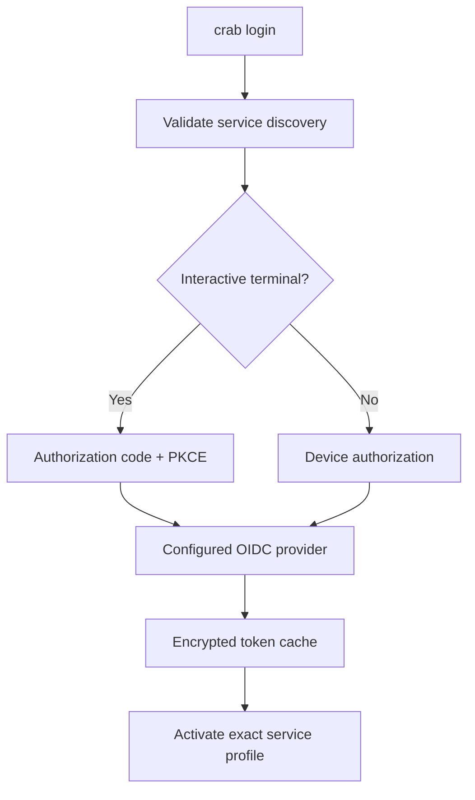

# Logging In

`crab login` is managed-service-first. Without arguments it discovers and
authenticates to `https://crab.build`, stores refreshable tokens in the
encrypted token cache, installs the exact service profile, and makes it active.



## Hosted login

```bash
crab login https://crab.build
```

In an interactive terminal Crab opens the advertised identity-provider login in a
browser, validates callback state, and exchanges the authorization code with a
fresh PKCE verifier. No client secret is embedded in the CLI.

## Headless login

```bash
crab login https://crab.build --headless
```

Crab uses the advertised device authorization endpoint, respects its polling
interval, slowdown responses, expiration, and denial, and stores tokens only
after successful approval. A non-interactive terminal selects this flow
automatically when the service supports it.

## Self-hosted login

Use the administrator-provided external HTTPS origin:

```bash
crab login https://code.corp.example
```

For a private PKI, install the exact PEM trust bundle for this profile:

```bash
crab login https://code.corp.example \
  --enterprise-ca /etc/company/ca.pem \
  --private-ca-only
```

The discovery document's authority, API origin, issuer, supported API version,
and minimum CLI version must validate before Crab stores the profile. A failed
managed login never falls back to direct object-storage authentication.

## Direct-provider login

Existing BYOC OIDC workflows remain available behind explicit provider
selection:

```bash
crab login --provider aws-oidc
```

The provider's issuer, client ID, scopes, and backend remain configured under
`[auth]`. `static` and `none` providers do not support interactive login.

## Token and profile storage

Managed profiles contain non-secret authority, discovery, retrieval time, and
trust metadata. Tokens are stored separately in Crab's encrypted token cache.
Physical repository placement and temporary transfer grants are not persisted
to either location.

Tokens refresh automatically when possible. If refresh is rejected, the
operation returns `login_required`; sign in again rather than retrying the same
token.

## Next steps

- [Managed Service Quickstart](/docs/cli/managed-service)
- [Managed Service Diagnostics](/docs/cli/managed-service/diagnostics)
- [`crab login` reference](/docs/cli/reference/crab-login)
- [Direct-provider configuration](/docs/cli/authentication/configuration)
