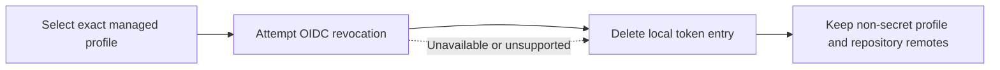

# Logging Out

`crab logout` removes credentials from the local encrypted token cache. For a
managed profile it also attempts best-effort revocation at the profile's OIDC
provider.



## Active managed profile

```bash
crab logout
```

When a managed profile is active, this removes only its token entry. Other
managed authorities and direct providers remain authenticated.

## Specific managed authority

```bash
crab logout crab.build
crab logout https://code.corp.example
```

The selector must resolve to an installed exact-authority profile. Crab does
not probe arbitrary authorities during logout.

## Every cached identity

```bash
crab logout --all
```

This removes every managed and direct-provider token entry. It is useful for
machine decommissioning, but it is broader than switching accounts for one
service.

## Failure behavior

Revocation is best-effort because local cleanup must still succeed when the IdP
is unavailable or omits a revocation endpoint. Crab prefers the refresh token
for revocation and falls back to the ID token. It deletes the local token entry
after the attempt and never logs the token value.

Logout does not delete:

- installed non-secret service profiles;
- `.git/config` or `.crab/remote`;
- managed repositories or memberships;
- object-store data;
- unrelated provider tokens unless `--all` is used.

## Related

- [`crab logout` reference](/docs/cli/reference/crab-logout)
- [Logging In](/docs/cli/authentication/logging-in)
- [Managed Service Diagnostics](/docs/cli/managed-service/diagnostics)
