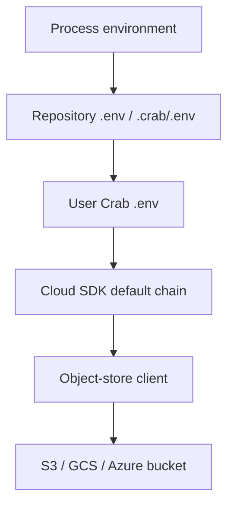

## Static Credential Mode

`static` is Crab's default auth provider. In this mode, Crab does not run
`crab login` and does not store long-lived cloud access keys in Crab config.
It builds an object-store client from environment variables or the cloud SDK
default credential chain.

Use static credentials for local development, CI, S3-compatible stores, and
small-team deployments where cloud IAM already controls bucket access.



## CLI Credential Order

When you run `crab` directly in a terminal or from Git, Crab resolves static
credentials in this order:

1. Existing process environment variables.
2. `.env` in the Git repository root.
3. `.env` or `.crab/.env` while walking up from the current directory.
4. `~/.config/crab/.env`.
5. The cloud SDK default credential chain used by the object-store provider.

Earlier sources win. Crab only fills in missing variables from later `.env`
files, so an explicit shell export overrides project and user-global files.

## Common AWS/S3 Variables

For AWS S3 or an S3-compatible service, the usual static setup is:

```bash
export AWS_ACCESS_KEY_ID=...
export AWS_SECRET_ACCESS_KEY=...
export AWS_REGION=us-west-2
```

For temporary credentials, also set:

```bash
export AWS_SESSION_TOKEN=...
```

For S3-compatible endpoints such as MinIO, R2, or RustFS, set:

```bash
export AWS_ENDPOINT_URL=http://localhost:9000
export AWS_ALLOW_HTTP=true
```

You can also use AWS profiles instead of explicit keys:

```bash
export AWS_PROFILE=ml-team
```

## GCS and Azure Variables

For Google Cloud Storage, use Application Default Credentials or a service
account JSON file:

```bash
gcloud auth application-default login
export GOOGLE_APPLICATION_CREDENTIALS=/path/to/service-account.json
```

For Azure Blob Storage, use one of the supported Azure SDK environment shapes:

```bash
export AZURE_STORAGE_ACCOUNT_NAME=myaccount
export AZURE_STORAGE_ACCOUNT_KEY=...
```

or:

```bash
export AZURE_STORAGE_CONNECTION_STRING="DefaultEndpointsProtocol=https;..."
```

## Selecting the Storage Provider

`crab://` remotes default to S3-compatible storage. To force a provider, set
`auth.storage_provider` or `CRAB_STORAGE_PROVIDER`:

```bash
crab config set auth.storage_provider s3
crab config set auth.storage_provider gcs
crab config set auth.storage_provider azure
```

or:

```bash
export CRAB_STORAGE_PROVIDER=s3
```

Use `auto` when the same config should run in different environments and the
provider is supplied by environment.

## What Crab Stores

Crab repository config stores the remote URL and auth mode, not secret values.
Do not put cloud access keys in `.crab/config.toml`, `.crab.toml`, Git config,
or committed docs.

For static mode, any long-lived secret storage is owned by your shell,
`.env` files, cloud SDK config, CI secret store, or OS credential store. Crab
only reads the resolved values at runtime to build the cloud client.

For federated providers such as `aws-oidc`, `gcp-workload-identity`,
`azure-entra`, and `crab-auth`, Crab stores encrypted login tokens under the
configured token cache path. Those tokens are separate from static cloud access
keys.

## Verifying Credential Resolution

Run:

```bash
crab doctor
```

For static mode, a healthy credential check looks like:

```text
✓ auth                     static (no crab-managed auth)
✓ credentials              bucket 'my-bucket' reachable
✓ credential discovery     AWS_ACCESS_KEY_ID=****
```

Use `crab env` to inspect which relevant environment variables are set in the
current shell. Avoid pasting raw `AWS_SECRET_ACCESS_KEY`,
`AWS_SESSION_TOKEN`, service account JSON, SAS tokens, or connection strings
into logs or bug reports.

## Troubleshooting

| Symptom | What to check |
|---------|---------------|
| `crab doctor` says no remote is configured | Run from a Crab repository or initialize one with `crab init` |
| `credentials` is skipped | The current directory has no `.crab/remote` or `.crab/config.toml` |
| Bucket is not reachable | Check bucket name, region, endpoint URL, and IAM permissions |
| Credentials work in one shell but not another | Compare exported variables and the `.env` files loaded from each working directory |

## Related

- [Environment Info](environment-info)
- [Enterprise Authentication](enterprise-auth)
- [AWS OIDC](aws-credentials)
- [Self-Hosted Auth Server](self-hosted-auth-server)
