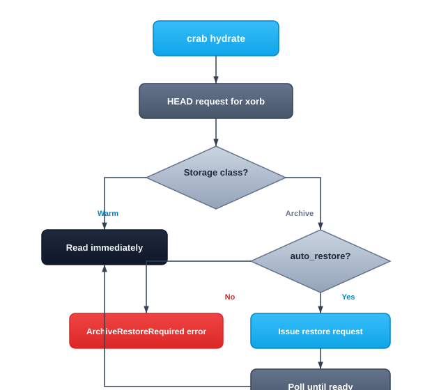

## Recovering Files from Cold Storage

When files are stored in archive storage classes (S3 Glacier, Deep Archive, Azure Archive), they can't be read immediately. Crab's hydrate-restore subsystem detects archived xorbs during hydration and either automatically initiates a restore or fails with a clear error explaining what needs to happen.



## How It Works

During hydration, each xorb is probed with a HEAD request that includes storage-class metadata:

1. **Warm classes** (Standard, Standard-IA, Glacier Instant Retrieval) — hydration proceeds immediately.
2. **Archive classes** (Glacier Flexible, Deep Archive, Azure Archive) — the RestoreOrchestrator issues a restore request and polls until the object becomes readable.

### Polling Behavior

Restore polling uses exponential back-off: 30-second initial interval, 1.5× multiplier, 10-minute cap, with full jitter. If the restore doesn't complete within `tier.restore_timeout_secs` (default 6 hours), Crab emits `ArchiveRestoreTimeout [CRAB-E0211]`. The provider-side restore continues — retry later.

Batch restores are capped at `tier.restore_max_concurrency` (default 16) concurrent requests.

## Controlling Restore Behavior

### Enable automatic restore (default)

```bash
crab hydrate --all
```

Uses the configured restore tier. Blocks until all restores complete.

### Use expedited restore for urgent access

```bash
crab hydrate --all --restore-tier=expedited
```

Fastest (1–5 minutes on S3 Glacier Flexible), most expensive.

### Use bulk restore for cost-sensitive batch jobs

```bash
crab hydrate --all --restore-tier=bulk --restore-duration-days=14
```

Cheapest tier, suitable for overnight jobs where latency is acceptable.

### Disable restore (fail on archived objects)

```bash
crab hydrate --all --no-restore
```

Fails immediately with `ArchiveRestoreRequired [CRAB-E0210]` if any required xorb is archived.

## Priority Resolution

The effective auto-restore setting is resolved in priority order:

| Priority | Source | Effect |
|----------|--------|--------|
| Highest | `--no-restore` flag | Always disables |
| | `--restore` flag | Always enables |
| Lowest | `hydrate.auto_restore` config | Used when no flag is set |

## Available Restore Tiers

| Provider | Tier | Speed |
|----------|------|-------|
| AWS S3 | `expedited` | 1–5 minutes |
| AWS S3 | `standard` | 3–5 hours |
| AWS S3 | `bulk` | 5–12 hours |
| Azure Blob | `high` | &lt;1 hour |
| Azure Blob | `standard` | ≤15 hours |

Invalid combinations (e.g., `expedited` on Deep Archive) produce `RestoreTierUnsupported [CRAB-E0212]`.

## Configuration

```toml
# .crab/config.toml
[hydrate]
auto_restore = true

[tier]
restore_tier = "standard"
restore_duration_days = 7
restore_max_concurrency = 16
restore_timeout_secs = 21600  # 6 hours
```

## CLI Reference

For complete command syntax and all available flags, see the [crab hydrate reference](/docs/cli/reference/crab-hydrate).
