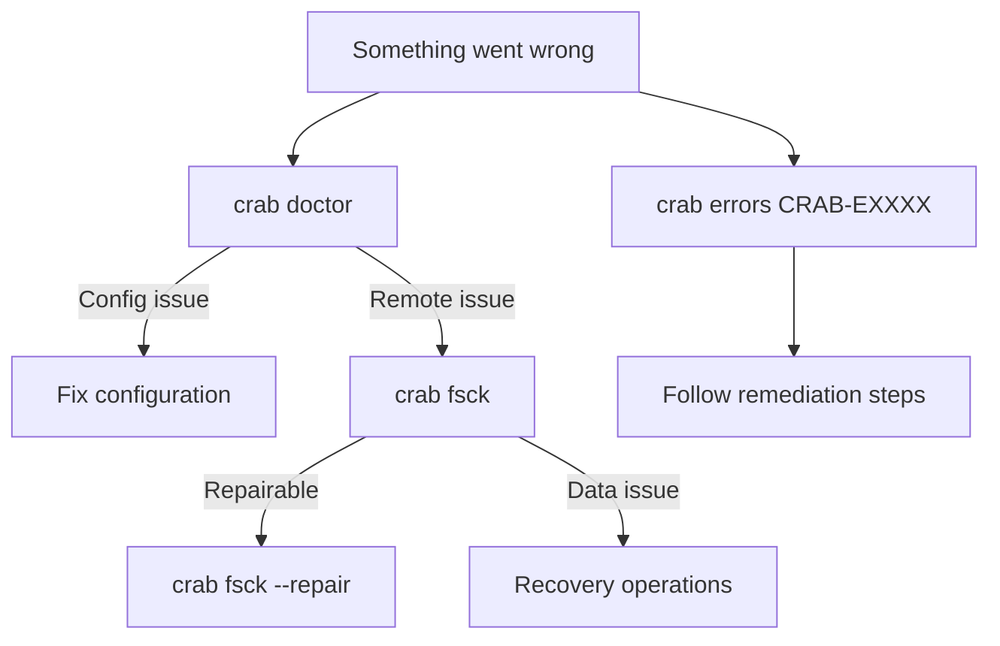

## Keeping Your Repository Healthy

Crab provides a suite of diagnostic tools that help you verify repository integrity, understand errors when they occur, and recover from interrupted operations. Whether you're troubleshooting a failed push or running periodic maintenance, these tools give you visibility into both local and remote state.



## Quick Diagnostics

```bash
# Run all health checks
crab doctor

# Verify remote store integrity
crab fsck

# Look up a specific error code
crab errors CRAB-E0017

# Check recent logs for details
crab logs last
```

## Tools at a Glance

| Tool | Purpose | When to use |
|------|---------|-------------|
| [Health Check](/docs/cli/diagnostics/health-check) | Verify configuration and connectivity | First thing when something isn't working |
| [Error Codes](/docs/cli/diagnostics/error-codes) | Look up error explanations and fixes | After encountering a `CRAB-EXXXX` error |
| [Log Management](/docs/cli/diagnostics/log-management) | Inspect diagnostic logs | Debugging failures, filing bug reports |
| [Integrity Check](/docs/cli/diagnostics/integrity-check) | Verify remote objects and references | Before GC, after crashes, periodic maintenance |
| [Store Verification](/docs/cli/diagnostics/store-verification) | Validate remote store consistency | Deep investigation of remote state |
| [Recovery Operations](/docs/cli/diagnostics/recovery-operations) | Recover from interrupted pushes | After crashes or network failures |
| [Hydrate Restore](/docs/cli/diagnostics/hydrate-restore) | Handle archived storage classes | When hydrating files in cold storage |
| [Metadata Database](/docs/cli/diagnostics/metadata-database) | Inspect and repair metadata DBs | When push/hydrate reports DB errors |
| [Version Info](/docs/cli/diagnostics/version-info) | Check installed version | Bug reports, compatibility checks |
