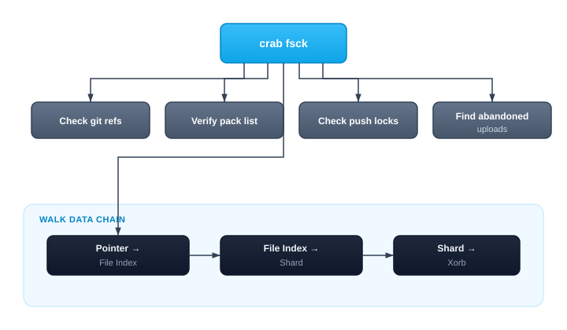

## Verifying Repository Integrity

`crab fsck` performs a comprehensive integrity check on your repository, examining both local and remote state for inconsistencies. It detects dangling refs, missing blobs, orphan shards, expired push locks, abandoned multipart uploads, and manifest divergence.

Think of it as `git fsck` extended to cover Crab's object store layer.



## Running an Integrity Check

```bash
crab fsck
```

```
  ✓ Git objects          all refs resolve
  ✓ Data chain           all file indices and xorbs present
  ✓ Pack list            consistent
  ⚠ Push locks           1 expired lock (3 days old)
  ✓ Multipart uploads    none abandoned
  ✓ Shard list           consistent

1 issue found:
  ⚠ Expired push lock: refs/push-locks/abc123 (age: 3d 2h)
    Repairable: yes (run with --repair)
```

## Issue Categories

### Critical (data integrity)

| Issue | Description | Auto-repairable |
|-------|-------------|:---:|
| Dangling ref | Ref points to a non-existent commit | ✗ |
| Missing tree | Commit references a missing tree object | ✗ |
| Missing blob | Tree references a missing blob | ✗ |
| Missing file index | Pointer references a missing file index | ✗ |
| Missing xorb | File index references a non-existent xorb | ✗ |

### Warnings (operational)

| Issue | Description | Auto-repairable |
|-------|-------------|:---:|
| Expired push lock | Lock from a crashed process | ✓ |
| Abandoned multipart upload | Upload never completed | ✓ |
| Pack list divergence | Manifest doesn't match actual packs | ✓ |
| Orphan shard | Shard not referenced by any file index | ✗ |
| Shard list divergence | Shard list doesn't match actual shards | ✗ |

## Automatic Repair

```bash
crab fsck --repair
```

Repair is conservative:
- Expired locks are deleted
- Abandoned uploads are aborted
- Missing manifest entries are re-added

No data is ever deleted by `--repair` — only metadata cleanup. Critical issues (missing blobs, trees, xorbs) require manual intervention.

## When to Run

| Scenario | Why |
|----------|-----|
| After a push failure or crash | Check for leftover locks |
| Before running `crab gc` | Ensure reference graph is consistent |
| Periodic maintenance (CI) | Catch drift early |
| When `crab doctor` reports remote issues | Deep investigation |

## Prerequisites

- Repository must be initialized (`crab init` or `crab clone`)
- Valid cloud credentials for the remote bucket
- `--repair` requires write permissions

## CLI Reference

For complete command syntax and all available flags, see the [crab fsck reference](/docs/cli/reference/crab-fsck).
