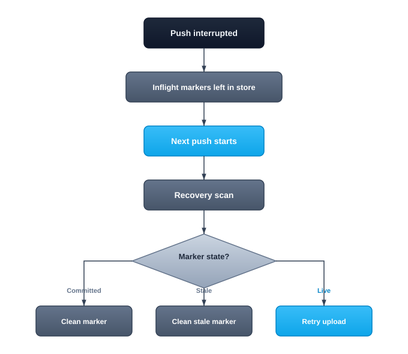

## Recovering from Failures

Pushes and uploads can be interrupted by crashes, network failures, or process kills. When this happens, Crab leaves markers in the remote store to track the incomplete operation. The recovery system detects these markers and either retries the operation or cleans up stale state.



## How Recovery Works

The recovery module runs automatically — you don't invoke it directly. It activates:

- **Before every push** — scans for inflight markers from previous interrupted operations
- **During `crab fsck --repair`** — detects and cleans stale markers as part of integrity repair

### The Recovery Process

1. Lists all inflight markers in the remote store.
2. For each marker, determines its state:
   - **Committed** — the upload actually completed despite the marker (clean the marker)
   - **Stale** — from a dead process that won't resume (clean the marker)
   - **Live** — from a running process (retry the upload)
3. After recovery, runs post-ref cleanup:
   - Moves staging data to the cache
   - Installs shard metadata
   - Clears completed file-DB rows
   - Removes the inflight marker

## When You Might See Recovery

Recovery is transparent in normal operation. You'll notice it in logs when:

- A push was killed mid-flight (Ctrl+C, OOM, network drop)
- A machine crashed during an upload
- A CI job timed out during push

The next operation on that repository will detect the incomplete state and handle it automatically.

## Manual Intervention

In rare cases where automatic recovery isn't sufficient:

```bash
# Detect stale markers and repair
crab fsck --repair

# Clean local staging state
crab staging clean

# Check logs for recovery details
crab logs last
```

## CLI Reference

For complete command syntax and all available flags, see the [crab fsck reference](/docs/cli/reference/crab-fsck).
