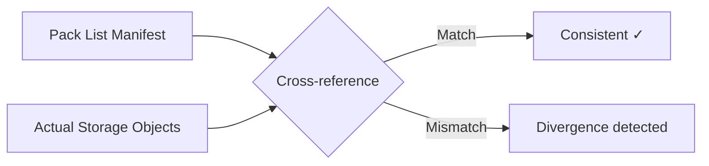

## Verifying Remote Store Consistency

The store verification layer within `crab fsck` queries your remote object storage directly to detect inconsistencies between manifests and actual stored objects. While the broader integrity check covers the full data chain, store verification focuses specifically on what's physically present in S3, GCS, or Azure versus what the manifests claim should be there.



## What Gets Verified

### Pack-list vs. storage

The verifier loads `pack-list.json` and cross-references it against actual pack objects:

- **Listed but missing** — a pack ID is in the manifest but the object doesn't exist in storage
- **Present but unlisted** — a pack object exists but isn't in the manifest

The "present but unlisted" direction is repairable — `--repair` re-adds the manifest entry after confirming the pack exists.

### Shard-list vs. storage

Same cross-reference for shard objects under `.crab/shards/`. Divergence is reported but not automatically repairable.

### Data chain integrity

For each file-index entry, the verifier confirms the referenced shard exists either in the shard-list or directly in storage. Missing shards are reported as `MissingFileIndex` issues.

### Push lock expiry

Push locks under `<prefix>/locks/` are checked against current time. Expired locks indicate a previous push that crashed without cleanup — safely deletable with `--repair`.

## Usage

### Verify remote store

```bash
crab fsck
```

When healthy:

```
crab fsck: repository is clean
```

### Repair detected issues

```bash
crab fsck --repair
```

```
crab fsck: 2 error(s), 0 info, 2 repaired, 0 repair failure(s)
```

### Stream events for monitoring

```bash
crab fsck --jsonl
```

Each issue is emitted as a warning event, followed by a terminal result — useful for piping into monitoring systems.

## Repair Safety

Only specific issue types are auto-repaired:

| Issue | Repair action |
|-------|--------------|
| Missing pack-list entry (pack exists in storage) | Re-add manifest entry |
| Expired push lock | Delete the lock |
| Abandoned multipart upload | Abort the upload |

Repairs are reversible and conservative. No data is deleted.

## Exit Codes

| Code | Meaning |
|------|---------|
| `0` | All checks passed or all errors were repaired |
| `1` | Unrepaired errors remain |

## CLI Reference

For complete command syntax and all available flags, see the [crab fsck reference](/docs/cli/reference/crab-fsck).
