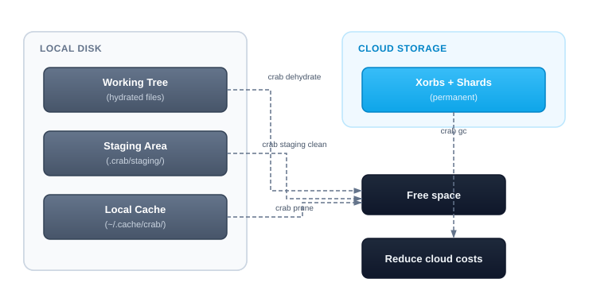

# Disk Usage

Crab stores data in several places: hydrated files in your working tree, chunks in the staging area, downloaded data in the local cache, and permanent storage in the cloud. Understanding this breakdown helps you decide when to dehydrate, prune, or clean.

## Storage Layers



## Checking Disk Usage

```bash
crab du
```

```
Working tree:
  Tracked files:     42
  Hydrated:          12 files (3.2 GB)
  Pointers:          30 files (4.5 KB)

Staging:             45.2 MB

Local cache:         1.8 GB

Total local:         5.0 GB
```

### Include remote storage

```bash
crab du --remote
```

Adds the cloud storage size (requires network access):

```
Remote:              8.4 GB (crab://my-bucket/my-repo)
```

## Understanding the Numbers

| Layer | What's stored | How to reduce |
|-------|--------------|---------------|
| **Working tree (hydrated)** | Full file content on disk | `crab dehydrate` |
| **Working tree (pointers)** | Tiny pointer stubs (~128 B each) | Nothing needed |
| **Staging** | Chunks waiting to be pushed | `crab staging clean` after push |
| **Local cache** | Previously downloaded chunks | `crab prune` or `crab cache clean` |
| **Remote** | All pushed xorbs and metadata | `crab gc` for unreachable objects |

## Reclaiming Space

### Quick wins

```bash
# Free the most space: dehydrate files you're not using
crab dehydrate --all

# Clean staging after a successful push
crab staging clean

# Remove unreferenced cache entries
crab prune
```

### Check what you'd save

```bash
# See how much hydrated content you have
crab du

# See what GC would reclaim remotely
crab gc --dry-run
```

## CLI Reference

For complete command syntax and JSON output format, see the [crab du reference](/docs/cli/reference/crab-du).
