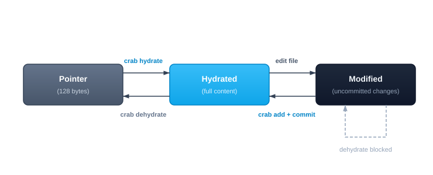

# File Status

Every Crab-tracked file in your working tree is in one of three states: **hydrated** (full content on disk), **pointer** (dehydrated, content in cloud), or **modified** (hydrated with uncommitted changes). Understanding these states is key to working effectively with Crab.

## File States



| State | Symbol | Meaning |
|-------|--------|---------|
| **Pointer** | `P` | File is a lightweight stub. Content is in cloud storage. |
| **Hydrated** | `H` | Full content is on disk, matching the committed version. |
| **Modified** | `M` | Full content on disk, but differs from the committed pointer. |

## Checking Status

```bash
crab status
```

```
Tracked files (42 total):
  H  models/weights.bin       1.2 GB  (hydrated)
  H  models/embeddings.bin    800 MB  (hydrated)
  P  data/eval.safetensors    300 MB  (pointer)
  P  data/test.safetensors    150 MB  (pointer)
  M  config/vocab.bin         2.1 MB  (modified)
```

## Why "Hydrated Files Show as Modified"

This is the most common source of confusion for new Crab users. Here's what happens:

1. Git's index stores the **pointer blob** (what was committed)
2. Your working tree has the **full content** (after hydration)
3. `git status` compares them and sees a difference → "modified"

This is expected behavior, not a bug. The file content is correct — it's just different from the pointer in git's index.

**To make git status clean:** dehydrate before committing or pulling:

```bash
crab dehydrate --all
git status              # clean
git pull origin main    # fast, pointer-only diffs
crab hydrate --all      # restore content
```

## Filtering by Pattern

```bash
# Check only model files
crab status '*.safetensors'

# Machine-readable output for scripting
crab status --porcelain
```

Porcelain output (one line per file):

```
p models/weights.bin
h models/embeddings.bin
m data/train.safetensors
```

## Common Workflows

### "Which files can I work with right now?"

```bash
crab status | grep "hydrated"
```

### "What do I need to hydrate?"

```bash
crab status | grep "pointer"
```

### "Do I have uncommitted changes in tracked files?"

```bash
crab status | grep "modified"
```

## CLI Reference

For complete command syntax, porcelain format, and JSON output, see the [crab status reference](/docs/cli/reference/crab-status).
