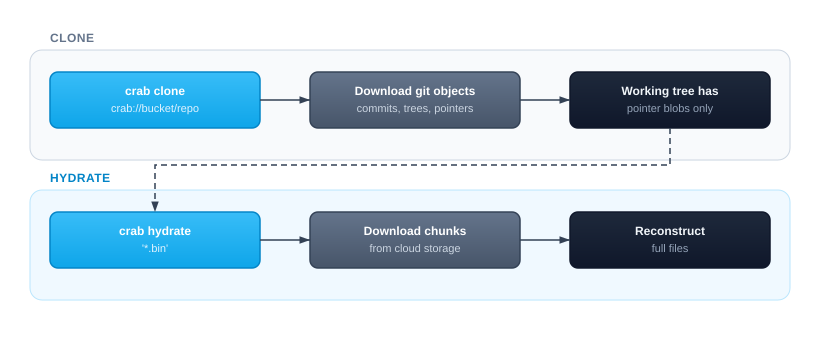

# Cloning a Repository

Cloning a Crab repository is nearly instant regardless of how much data it contains. Unlike traditional git (or Git LFS) where cloning downloads all file content, Crab clones only download git metadata and lightweight pointer blobs. The actual file content stays in cloud storage until you explicitly hydrate it.

## How Lazy Cloning Works



A 500 GB repository clones in seconds because git only transfers pointer blobs (~128 bytes each) and commit metadata. You then choose which files to materialize based on what you actually need.

## Basic Clone

```bash
crab clone crab://my-bucket/my-repo
cd my-repo
```

After cloning, your working tree contains pointer files. Check what's available:

```bash
crab status
```

Then hydrate what you need:

```bash
crab hydrate '*.safetensors'    # just model files
crab hydrate --all              # everything
```

## Clone with Immediate Hydration

If you know which files you need upfront, hydrate them during clone:

```bash
# Hydrate specific patterns after clone
crab clone --include '*.safetensors' --include 'config/**' crab://my-bucket/my-repo

# Hydrate everything (like a traditional clone)
crab clone --no-lazy crab://my-bucket/my-repo
```

## Clone Options

| Scenario | Command |
|----------|---------|
| Fastest possible clone | `crab clone crab://bucket/repo` |
| Clone + hydrate models | `crab clone --include '*.bin' crab://bucket/repo` |
| Clone specific branch | `crab clone --branch feature/v2 crab://bucket/repo` |
| Shallow clone (CI) | `crab clone --depth 1 crab://bucket/repo` |
| Full clone (all content) | `crab clone --no-lazy crab://bucket/repo` |

## What Happens Under the Hood

1. **Git clone** — Crab runs `git clone` with the filter driver pre-configured via `--config` flags.
2. **Lazy checkout** — Files are checked out as pointer stubs (not full content).
3. **Crab setup** — Creates `.crab/` directory, writes remote URL, registers filter driver.
4. **Optional hydration** — If `--include` patterns are specified, matching files are hydrated immediately.

The result is a fully functional git repository where large files are represented by pointers until you need them.

## Performance Comparison

| Repository Size | Traditional Clone | Crab Clone (lazy) | Crab Clone + Hydrate All |
|----------------|-------------------|-------------------|--------------------------|
| 1 GB | ~30s | ~2s | ~35s |
| 10 GB | ~5 min | ~3s | ~6 min |
| 100 GB | ~50 min | ~5s | ~55 min |
| 500 GB | ~4 hours | ~8s | ~4.5 hours |

The lazy clone time is nearly constant regardless of repository size — it only depends on the number of git objects (commits + trees), not file content.

## CI Pipeline Pattern

For CI, combine shallow clone with selective hydration for maximum speed:

```bash
# Clone with minimal history
crab clone --depth 1 crab://team-bucket/ml-repo
cd ml-repo

# Hydrate only what this job needs
crab hydrate --manifest .crab/manifests/test-job.txt

# Run tests
pytest tests/
```

## After Cloning

Once cloned, you have a standard Crab repository. Common next steps:

- `crab hydrate '*.bin'` — Materialize files you need to work with
- `crab status` — See which files are pointers vs. hydrated
- `git pull` + `crab hydrate` — Get updates and hydrate new files

## Next Steps

- [Hydrating Files](/docs/cli/daily-workflow/hydrating-files) — Understand selective hydration
- [Tracking Files](/docs/cli/getting-started/tracking-files) — Add new file patterns
- [Working with Files](/docs/cli/daily-workflow) — The full add → commit → push → hydrate cycle
