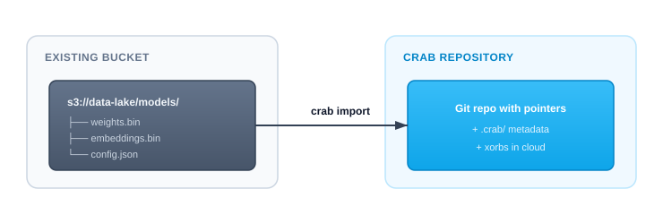
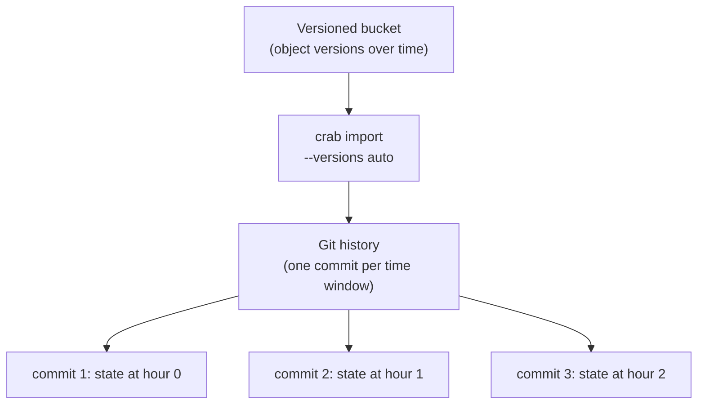

# Importing Existing Buckets

If you already have files in cloud storage — datasets, models, media assets — you don't need to download them locally and re-upload through Crab. The import command reads objects directly from your bucket and creates a Crab-managed git repository in place.

## What Import Does



Import reads your existing files, chunks them, builds the Crab metadata (xorbs, shards, file indices), and creates a git repository with pointer blobs. The source files stay untouched — they're read, not moved.

After import, you have a fully functional Crab repository that you can clone, hydrate, push to, and collaborate on.

## Same-Bucket Import

The most common case: your files are already in S3 and you want to add Crab management without moving data:

```bash
crab import \
  --from s3://my-bucket/datasets/v2/ \
  --to   s3://my-bucket/repos/v2
```

When source and target are in the same bucket, Crab avoids re-uploading bytes — it creates the metadata layout alongside your existing objects.

For quick imports, you can let Crab build the target `crab://` URL from a bucket and repo name:

```bash
crab import s3://my-bucket/datasets/v2/ \
  --bucket my-bucket \
  --name repos/v2
```

Local directories work too; plain paths are normalized to `file://` internally:

```bash
crab import ./large-files \
  --bucket crab \
  --name import-demo
```

Use `--dest-prefix` when imported files should live under a specific directory inside the new Git repository:

```bash
crab import s3://crab/crab/large-files \
  --bucket crab \
  --name import-demo \
  --dest-prefix crab/large-files
```

## Cross-Bucket Import

Move data management from one bucket to another:

```bash
crab import \
  --from s3://data-lake-prod/models/ \
  --to   s3://crab-repos/models-v1
```

## Versioned Bucket History

If your source bucket has S3 versioning enabled, Crab can reconstruct git history from object versions:



Each time window (default: 1 hour) becomes one git commit. Delete markers surface as git deletions.

```bash
# Auto-detect versioning, one commit per hour
crab import \
  --from s3://versioned-bucket/prod/ \
  --to   s3://versioned-bucket/repos/prod

# Coarser commits — one per day
crab import \
  --from s3://versioned-bucket/prod/ \
  --to   s3://versioned-bucket/repos/prod \
  --window 24h
```

## Filtering What Gets Imported

You don't have to import everything:

```bash
# Only model files
crab import \
  --from s3://my-bucket/data/ \
  --to   s3://my-bucket/repos/models \
  --include '*.safetensors' --include '*.bin'

# Everything except logs
crab import \
  --from s3://my-bucket/data/ \
  --to   s3://my-bucket/repos/data \
  --exclude 'logs/**'
```

## Preview Before Importing

See what would be imported without actually doing it:

```bash
crab import \
  --from s3://my-bucket/datasets/ \
  --to   s3://my-bucket/repos/datasets \
  --dry-run
```

Shows file count, total bytes, extension breakdown, and planned commit count.

## Resumable Imports

Large imports (millions of files, terabytes of data) can take hours. If interrupted, resume from where you left off:

```bash
# First run (interrupted)
crab import --from s3://bucket/data/ --to s3://bucket/repos/data --into ./data

# Resume after interruption
crab import --into ./data --resume
```

The import journal (`.crab/import-journal.db`) tracks progress per-object. Only pending and failed objects are retried on resume.

## After Import

Once import completes, you have a standard Crab repository:

```bash
cd imported-repo
crab status              # see tracked files
crab hydrate --all       # materialize content
git remote -v            # origin points to your target URL
```

Collaborators can clone it:

```bash
crab clone crab://my-bucket/repos/data
```

## Supported Sources

| Provider | URL Format |
|----------|-----------|
| AWS S3 | `s3://bucket/prefix/` |
| Google Cloud Storage | `gs://bucket/prefix/` |
| Azure Blob Storage | `az://container/prefix/` |
| Local filesystem | `./path/to/dir/` or `file:///path/to/dir/` |

## CLI Reference

For complete command syntax, all options (versioning, time ranges, author templates, error codes), and JSON output format, see the [crab import reference](/docs/cli/reference/crab-import).
