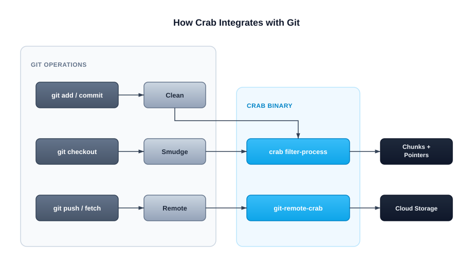

# Installation & Setup

Crab is a single binary that acts as both a git remote helper and a large-file filter driver. Once installed, it integrates transparently with git — no plugins, no extensions, no separate daemon to manage.

## Install Crab

### macOS or Linux with Homebrew

```bash
brew install crabbuild/tap/crab
```

Homebrew installs `crab`, the `git-remote-crab` helper that Git uses for
`crab://` remotes, `crab-nfs-mount` for the default NFS mount backend, and
`crab-fuse-mount` for explicit FUSE mounts on macOS and Linux. macFUSE is not
required to install or use normal Crab commands; it is only needed when you run
`crab mount --backend=fuse` on macOS.

### macOS or Linux one-line installer

```bash
curl -fsSL https://crab.build/install.sh | bash
```

This downloads the latest release binary for your platform, verifies the
matching `SHA256SUMS.txt` entry, installs to `~/.crab/bin`, and creates the
`git-remote-crab` symlink. Unix archives also install `crab-nfs-mount` and
`crab-fuse-mount`; macFUSE is optional until you run
`crab mount --backend=fuse` on macOS.

### Windows PowerShell

```powershell
irm https://crab.build/install.ps1 | iex
```

The Windows installer verifies the release checksum, installs to `~\.crab\bin`,
adds that directory to your user `PATH`, and writes `crab.exe`,
`crab-nfs-mount.exe`, and `git-remote-crab.exe`.

### Verify installation

```bash
crab version
command -v git-remote-crab
```

You should see output similar to:

```
crab 1.0.14 (build metadata varies by release)
```

## How Crab Integrates with Git

Crab works through two git extension points:



1. **Filter driver** — Routes tracked files through Crab's clean/smudge pipeline during checkout and commit. The clean filter replaces file content with pointer blobs; the smudge filter can reconstruct content or pass pointers through (lazy mode).

2. **Remote helper** — Handles `crab://` URLs during push and fetch. Uploads xorbs to cloud storage on push, downloads them on fetch.

Both are registered automatically when you run `crab init` or `crab clone`. You rarely need to install them manually.

## What Gets Configured

When Crab initializes a repository, it sets up:

| Component | Location | Purpose |
|-----------|----------|---------|
| Filter driver | `.git/config` | Routes tracked files through Crab |
| Remote URL | `.crab/remote` | Points to your cloud bucket |
| Config | `.crab/config.toml` | Local Crab settings |
| Staging area | `.crab/staging/` | Temporary chunk storage |

The filter driver entry in `.git/config` looks like:

```ini
[filter "crab"]
    process = crab filter-process
    required = true
```

## Installation Scopes

You can install the filter driver at different scopes:

| Scope | Applies to | Use when |
|-------|-----------|----------|
| Local (default) | Current repository only | Most common — per-repo setup |
| Global | All repos for your user | You use Crab in every project |
| System | All users on the machine | Shared CI runners |

### Global install (recommended for teams)

If you work with multiple Crab repositories, install the filter driver globally once:

```bash
crab install --global
```

After this, any repository with `.gitattributes` containing `filter=crab` rules will work automatically — even repos cloned with plain `git clone` (no `crab clone` needed). This is the simplest setup for collaborators joining an existing project:

```bash
# One-time setup:
crab install --global

# Then just clone normally:
git clone git@github.com:team/ml-models.git
# Filter driver is already registered globally — crab tracking just works
```

For most individual users, the local scope (set automatically by `crab init`) is sufficient.

## CI / Server Setup

For CI environments where you want fast checkouts without hydrating files:

```bash
crab install --skip-smudge
```

This configures the smudge filter to pass pointers through unchanged, so `git checkout` is instant. Files remain as pointers until you explicitly hydrate them:

```bash
crab hydrate --manifest .crab/manifests/ci.txt
```

## Verifying Your Setup

Run the health check to confirm everything is configured correctly:

```bash
crab doctor
```

This checks:
- Binary is on PATH and accessible
- Filter driver is registered in git config
- Cloud credentials are valid
- Remote bucket is accessible
- Staging area is healthy

## Next Steps

- [Create a new repository](/docs/cli/getting-started/first-repository) — Set up Crab with your cloud bucket
- [Clone an existing repository](/docs/cli/getting-started/cloning-a-repository) — Get started with a team's repo
- [Track file patterns](/docs/cli/getting-started/tracking-files) — Tell Crab which files to manage

## CLI Reference

For complete `crab install` / `crab uninstall` command syntax and options, run
`crab install --help` or `crab uninstall --help`.
