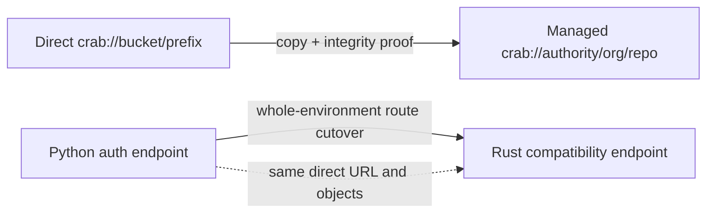

# Migrate to the Managed Service

Managed service support is additive. A direct repository and a managed
repository can exist at the same time, and moving one does not reinterpret or
delete the other.

Two independent migrations are easy to confuse:

| Migration | What changes | What does not change |
|-----------|--------------|----------------------|
| Direct storage to managed storage | Repository identity, catalog ownership, object placement, grants, and canonical URL | Source objects remain until the operator removes them after the rollback window |
| Python `crab-auth` to Rust compatibility service | The service image and route serving legacy auth contracts | Direct `crab://bucket/prefix` URLs and repository objects remain unchanged |



Changing a URL performs neither migration. Do not use `git remote set-url`,
edit `.crab/remote`, or install a managed profile as a substitute for copying
and verifying data.

## Direct storage to managed storage

A direct URL identifies physical storage:

```text
crab://team-bucket/ml/models
```

A managed URL identifies a logical organization and repository:

```text
crab://crab.build/acme/models
```

Creating `acme/models` does not adopt the direct prefix. The service allocates
its own placement and owns future authorization, protected pushes, audit, and
lifecycle operations for that logical repository.

### 1. Inventory and validate the source

Record the exact source URL, provider and region, active refs, repository
manifest generation, object versioning state, credential model, Python auth
endpoint if present, CLI versions, and every CI or interactive consumer. Run the
source repository's normal integrity and byte checks before copying:

```bash
crab fsck
crab clone --no-lazy crab://team-bucket/ml/models direct-proof
git -C direct-proof fsck --strict --full
```

Hash representative hydrated files and retain the results as migration
evidence. Resolve source corruption before creating a managed target.

### 2. Create the managed target

Create and wait for a new repository through the managed API:

```bash
crab login https://crab.build
crab organization create acme
crab repo create acme/models
crab repo info acme/models --json | jq '.data | {canonical_url, state, revision}'
```

If the organization already exists, omit its creation. Do not change any
source remote while provisioning is incomplete.

### 3. Copy through a service-owned migration

The supported physical migration must copy the complete repository object set,
including refs, Git packs, xorbs, shards, file indexes, LFS objects, and the
canonical manifest. It must be resumable, preserve exact object identity, and
publish the managed manifest only after verification. A final delta pass or a
short source write freeze closes the race with concurrent pushes.

The current release does not expose a general direct-to-managed copy command.
Until a service-owned migration job with resumable copy and integrity proof is
available, keep using the direct URL. Do not use `aws s3 sync`, `gsutil rsync`,
`azcopy`, or a bucket console: raw copying bypasses the catalog, placement
generation, manifest CAS, audit, tenant isolation, and protected-push boundary.

### 4. Prove the managed copy before cutover

The migration is complete only when all of these pass against the managed URL:

- ref names and object IDs match the frozen source;
- Git pack, xorb, shard, file-index, LFS, and manifest checks pass;
- a fresh clone and hydrate reproduce the recorded representative hashes;
- a protected push succeeds and its retry returns the same terminal result;
- a denied principal cannot obtain a grant or read repository bytes;
- staging credentials cannot write canonical objects;
- audit, usage, and repository state identify the managed repository;
- backup restore can resolve and read a representative repository.

### 5. Cut over by re-cloning

After the final source delta is frozen and verified, update CI and developer
instructions to the canonical managed URL and create fresh clones:

```bash
crab clone crab://crab.build/acme/models models-managed
git -C models-managed remote get-url origin
cat models-managed/.crab/remote
```

Both identities must be `crab://crab.build/acme/models`. Re-cloning avoids a
mixed worktree whose Git remote, `.crab/remote`, project configuration, and
cached physical state disagree. Keep old direct clones read-only during the
rollback window.

### 6. Roll back or retire the source

Application rollback means directing users back to their unchanged direct
clones and direct URL. It does not copy managed writes back. If writes occurred
after managed cutover, stop mutations and perform an audited reverse delta with
the same object and byte-integrity proof before reopening the direct target.

Delete no direct objects, roles, auth configuration, or backups until the
declared rollback window closes and the managed restore test passes. Source
retirement is a separate approved destructive change.

## Python crab-auth to Rust compatibility service

The Python FastAPI endpoint under `crab/deploy/auth` serves existing enterprise
direct repositories through `/v1/credentials`, `/v1/push/prepare`, and
`/v1/push/finalize`. Replacing that endpoint does not create managed logical
repositories and does not move data.

New hosted repositories use managed repository-ID routes and a logical
`crab://authority/organization/repository` URL. They are never routed to the
Python endpoint. If an enterprise wants both modes, use separate explicit
authorities and profiles; there is no per-request fallback between them.

### Cutover gates

Keep Python authoritative until the target Rust release has all of the
following proof:

1. Disabled-by-default compatibility routes for all three released endpoints.
2. An explicit registration allowlist for every direct repository; unknown
   physical URLs fail closed.
3. Matching request, response, expiry, authorization, path ACL, error, retry,
   cancellation, malformed-input, and protected-push fixtures.
4. A real S3-compatible push, fetch, clone, and hydrate parity run.
5. Security review of Python body-token and Rust bearer-header behavior.
6. A signed rollback image and a documented compatibility window.

If any gate differs, do not change production routing. The current Rust
managed service must not be treated as a drop-in Python endpoint until those
compatibility routes and parity gates ship.

### Whole-environment cutover

When the gates pass, inventory registered direct URLs and active push sessions,
retain the current Python image digest and configuration, then canary the Rust
compatibility image for one complete legacy environment. Switch the load
balancer or DNS route for the whole endpoint. Do not try Rust first and fall
back to Python per request: that would split policy, retry, and push-session
ownership.

Keep direct client configuration unchanged during this cutover:

```toml
[auth]
provider = "crab-auth"
issuer_url = "https://login.corp.example.com"
client_id = "crab-cli-prod"
auth_endpoint = "https://crab-auth.corp.example.com/v1/credentials"
```

Validate registered reads and protected pushes, one unregistered-repository
denial, path ACLs, retries, audit, and logs. Rollback routes the entire legacy
environment to the recorded Python image. Because the repository URLs and
objects never changed, rollback is data-independent; preserve in-flight
session evidence and do not add runtime fallback.

After the published rollback window, migrate remaining tagged clients to the
documented bearer-header contract. Remove the Python production path only
after inventory proves no supported client depends on its body-token behavior.

## Avoid authority collisions

Installing a service profile intentionally makes its exact authority managed.
If an existing direct bucket is named `code.corp.example`, do not install the
managed service at that same authority. Choose a distinct service authority,
such as `crab.code.corp.example`. `crab.build` is permanently reserved for the
hosted service and is never interpreted as a direct bucket.

For classification details, see
[Managed and Direct Storage](/docs/cli/managed-service/direct-storage). For
deployment rollback procedures, use the operator guide linked from the Crab
service deployment profile.
