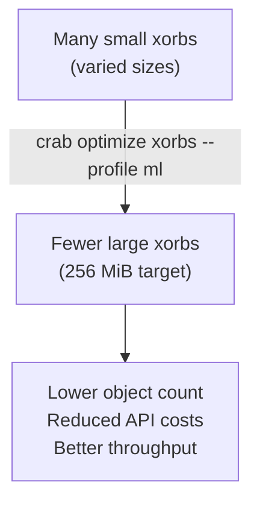

## Optimizing Xorb Layout

Crab stores file content as content-addressed xorbs. Xorb size and grouping affect storage cost, object count, and access performance. `crab optimize xorbs` rewrites xorbs to match a target profile: larger xorbs for ML models, medium xorbs for datasets, and smaller xorbs for code or random-access workloads.

This is different from `crab optimize packs`, which consolidates Git pack files. Xorb optimization operates on the content-addressed data layer.



## Built-in Profiles

| Profile | Target xorb size | Max xorbs/file | Group by | Best for |
|---------|:----------------:|:--------------:|----------|----------|
| `ml` | 256 MiB | 4 | File | Large model weights, safetensors |
| `dataset` | 64 MiB | unlimited | Directory | Training datasets, parquet files |
| `code` | 16 MiB | unlimited | Hash | Source code, configs, small assets |

When you omit `--profile`, Crab scans the file index and selects based on median file size:

- p50 > 100 MiB: `ml`
- p50 >= 1 MiB: `dataset`
- otherwise: `code`

## Usage

Dry-run first:

```bash
crab optimize xorbs --profile ml --dry-run
```

Dry-run is the supported optimization path today. It lists live source xorbs,
reads their sizes and storage classes, and performs no writes.

Apply the rewrite:

```bash
crab optimize xorbs --profile ml --apply
```

Apply currently fails closed. The executor can create destination xorbs, but
the file-index/shard manifest reconciliation required for readers to resolve
them is not implemented yet.

Resume or abort an interrupted run:

```bash
crab optimize xorbs --resume
crab optimize xorbs --abort
```

## Custom Profiles

Define profiles in `.crab/config.toml`:

```toml
[restripe.profiles.my-profile]
target_xorb_bytes = 134217728   # 128 MiB
max_xorbs_per_file = 8
group_by = "file"
compression = "zstd:5"
```

The config section still uses `[restripe.profiles]` because it describes the xorb rewrite engine’s stored profile configuration.

## Tier-Aware Optimization

If source xorbs are in archive storage classes, Crab can restore them before processing:

```bash
crab optimize xorbs --profile ml --apply --include-cold=false
crab optimize xorbs --profile ml --apply --restore-tier=bulk
crab optimize xorbs --profile ml --apply --output-class=STANDARD_IA
```

## Concurrency

| Combination | Result |
|-------------|--------|
| Two `crab optimize xorbs` runs | Second fails with `CRAB-E0332` |
| `crab gc` + `crab optimize xorbs` | Fails with `ConcurrentMaintenance [E0333]` |
| `crab push` + `crab optimize xorbs --dry-run` | Safe; dry-run performs no writes |

Old source xorbs become orphans and are reclaimed by the next `crab gc`.

## CLI Reference

For complete command syntax and all available flags, see [`crab optimize`](/docs/cli/reference/crab-optimize).
