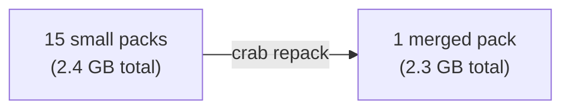

## Optimizing Remote Storage Layout

Every push creates a new pack file in the remote store. Over time, dozens or hundreds of small packs accumulate. This increases S3 listing latency, adds per-object overhead costs, and slows down clone and fetch operations.

Repacking merges these small packs into fewer, larger ones — reducing object count while preserving all data.



## How Repacking Works

1. Reads the pack list manifest from the remote store.
2. Downloads all existing pack files.
3. Merges contents into a single new pack with a fresh index.
4. Merges pack metadata (ref tips) from sidecar files and inline entries.
5. Uploads the merged pack to the remote.
6. Atomically updates the pack list manifest using compare-and-swap (CAS).
7. Cleans up old pack files after the manifest update succeeds.

### Atomicity and Safety

The manifest update uses CAS to prevent concurrent repacks from corrupting state. If another process modifies the manifest between read and write, the repack retries automatically. This means repacking is safe to run alongside normal push operations.

## Usage

### Preview pack statistics

```bash
crab repack --dry-run
```

```
repack (dry run):
  Current packs: 15
  Total size: 2.4 GB
  Estimated merged size: 2.3 GB
```

### Run the repack

```bash
crab repack
```

```
repack complete: 15 → 1 packs, 2400000000 → 2300000000 bytes, 4.2s
```

## When to Repack

| Signal | Action |
|--------|--------|
| Many small pushes accumulated | Repack to consolidate |
| `crab du --remote` shows high object count | Repack to reduce listing overhead |
| Clone/fetch feels slow | Fewer packs = fewer round-trips |
| Periodic maintenance | Run weekly in CI for active repos |

The `repack_auto_threshold` config option can trigger automatic repacking when the pack count exceeds a threshold:

```toml
# .crab/config.toml
repack_auto_threshold = 20
```

## Repack vs. Xorb Optimization

These optimize different things:

| | `crab optimize packs` | `crab optimize xorbs` |
|---|---|---|
| **Operates on** | Git pack files | Content-addressed xorbs |
| **Goal** | Reduce pack count and listing overhead | Optimize xorb size for access patterns |
| **When** | After many pushes | When xorb sizes don't match your workload |

## CLI Reference

For complete command syntax and all available flags, see the [crab repack reference](/docs/cli/reference/crab-repack).
