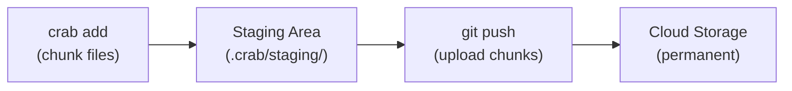
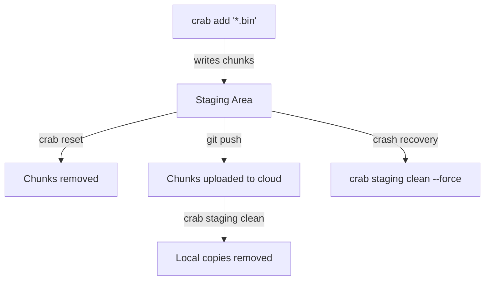

# Staging Area

The staging area is Crab's local buffer for chunk data. When you run `crab add`, file chunks are written here. When you `git push`, chunks are uploaded from here to cloud storage. It's the bridge between your local working tree and the remote.

## Why a Staging Area?



The staging area exists because adding and pushing are separate operations:

- **Add** is fast and local — chunks are written to disk without network I/O.
- **Push** is network-bound — chunks are uploaded to cloud storage.

This separation means you can add files throughout the day (fast, offline-capable) and push once when you're ready (batched, efficient).

## What's Inside

The staging area lives at `.crab/staging/` and contains:

- **Segment files** — Append-only files containing raw chunk data
- **SQLite index** — Maps file hashes to their chunks and segment locations
- **Inflight markers** — Track in-progress operations for crash recovery

## Inspecting the Staging Area

```bash
crab staging stats
```

```
Staging area: .crab/staging
  Sealed segments:       3
  Current segment bytes: 1.2 MB
  Total staged bytes:    45.6 MB
  Live bytes:            40.0 MB
  Dead bytes:            5.6 MB
  Dead ratio:            12.4%
  Chunk count:           847
  File count:            12
  Inflight markers:      0
```

Key metrics:
- **Live bytes** — Data referenced by current pointer files (will be uploaded on push)
- **Dead bytes** — Data no longer referenced (from reset files or re-added files)
- **Dead ratio** — When this gets high, `staging clean` will reclaim significant space
- **Inflight markers** — Should be 0 when no operations are running; non-zero indicates a crash

## Cleaning the Staging Area

After a successful push, staged chunks that have been uploaded are no longer needed locally. Clean them up:

```bash
crab staging clean
```

This removes:
- Stale inflight markers from crashed processes
- Orphan segments no longer referenced
- Compacts remaining segments

### After a crash

If a `crab add` or `git push` was interrupted, the staging area may have stale locks:

```bash
crab staging clean --force
```

The `--force` flag breaks stale locks from dead processes. It's safe because it checks PID liveness before breaking.

## Staging Lifecycle



1. **Add** — Chunks written to staging
2. **Push** — Chunks uploaded to cloud (staging data still exists locally)
3. **Clean** — Remove local copies after successful push
4. **Reset** — Remove staging data for unstaged files

## When to Clean

| Situation | Action |
|-----------|--------|
| After a successful push | `crab staging clean` (optional, saves disk) |
| After `crab reset` | `crab staging clean` (removes orphans) |
| Disk space is low | `crab staging clean` |
| After a crash | `crab staging clean --force` |
| High dead ratio in stats | `crab staging clean` |

## CLI Reference

For complete command syntax and options, see the [crab staging reference](/docs/cli/reference/crab-staging).
