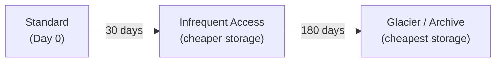

## Cost Optimization with Storage Tiers

Most Crab repositories follow a heavy-tail access pattern: a small hot set of files is read continuously while a long cold tail is rarely touched. Without lifecycle rules, every byte pays the Standard-tier rate regardless of access frequency.

Crab's tiering system generates provider-specific lifecycle rules that automatically transition cold xorbs through cheaper storage classes on a configurable schedule.



## How It Works

`crab tier plan` generates lifecycle rules scoped to the `.crab/xorbs/` prefix only. Metadata (shards, file-index, refs, manifests) is never tiered — it must stay warm for fast access.

| Prefix | Tier-eligible | Reason |
|--------|:---:|--------|
| `.crab/xorbs/` | ✓ | Content-addressed blob store |
| `.crab/shards/` | ✗ | Metadata — must stay warm |
| `.crab/file-index/` | ✗ | Metadata — must stay warm |
| `<repo>/refs/` | ✗ | Mutable refs |
| `<repo>/packs/` | ✗ | Git packs |

## Quick Start

### 1. Preview the lifecycle plan

```bash
crab tier plan
```

Read-only — probes the bucket and prints what Crab would apply. No write credentials needed.

### 2. Apply the plan

```bash
crab tier plan --apply
```

Crab writes a backup of the current lifecycle configuration, then submits the new rules via CAS to prevent races.

### 3. Roll back if needed

```bash
crab tier rollback .crab/tier/backups/2026-04-27T20:00:00Z-pre-apply.json
```

Restores the previous lifecycle configuration.

## Configuration

All tiering settings live under `[tier]` in `.crab/config.toml`:

```toml
[tier]
enabled = true
to_ia_days = 30          # Days before warm transition
to_deep_days = 180       # Days before cold transition
noncurrent_days = 30     # Noncurrent version expiration
restore_tier = "standard"
restore_duration_days = 7
```

| Setting | Default | Description |
|---------|---------|-------------|
| `enabled` | `false` | Opt-in; no behavior change until `true` |
| `to_ia_days` | `30` | Days before transition to warm class |
| `to_deep_days` | `180` | Days before transition to deep-cold class |
| `restore_tier` | `standard` | Default restore speed: `expedited`, `standard`, `bulk` |
| `restore_duration_days` | `7` | How long restored copies stay readable |
| `restore_max_concurrency` | `16` | Max parallel restore requests |

## Restore-Aware Hydration

When `crab hydrate` encounters an archived xorb, it automatically initiates a restore and polls until the object is readable:

```bash
# Hydrate with default restore tier
crab hydrate --all

# Use expedited restore for urgent access
crab hydrate --all --restore-tier=expedited

# Fail immediately on archived objects (no restore)
crab hydrate --all --no-restore
```

### Restore Availability by Storage Class

| Class | Direct read | Restore needed | Fastest restore |
|-------|:-----------:|:--------------:|-----------------|
| Standard / Standard-IA | ✓ | — | — |
| Glacier Instant Retrieval | ✓ | — | — |
| Glacier Flexible Retrieval | ✗ | ✓ | Expedited (1–5 min) |
| Glacier Deep Archive | ✗ | ✓ | Standard (12 h) |
| Azure Archive | ✗ | ✓ | High priority (&lt; 1 h) |

## Merge Mode

If your bucket has existing lifecycle rules (from Terraform, CloudFormation, etc.), use `--merge` to preserve them:

```bash
crab tier plan --apply --merge
```

With `--merge`, Crab replaces only rules with `crab-` prefixed IDs and leaves all other rules untouched.

## Minimum Retention Periods

Deleting an object before its minimum retention period incurs an early-deletion penalty. `crab gc` blocks early deletes by default and reports the estimated cost.

| Class | Minimum retention |
|-------|:-----------------:|
| Standard-IA / One-Zone-IA | 30 days |
| Glacier Instant Retrieval | 90 days |
| Glacier Flexible Retrieval | 90 days |
| Glacier Deep Archive | 180 days |
| GCS Nearline | 30 days |
| GCS Coldline | 90 days |
| GCS Archive | 365 days |
| Azure Cool | 30 days |
| Azure Archive | 180 days |

## Rollback and Safety

Every `tier plan --apply` writes a backup before modifying the bucket:

```
.crab/tier/backups/<RFC3339-ts>-pre-apply.json
```

If the bucket's lifecycle has been modified since the backup was taken, the CAS guard detects the conflict and the rollback fails safely.

## Common Workflow

```bash
# 1. Baseline cost snapshot
crab doctor --cost --json > before.json

# 2. Review the plan
crab tier plan

# 3. Apply
crab tier plan --apply

# 4. Wait for provider evaluation (S3 ~24h, GCS ~24h, Azure up to 7d)

# 5. Compare costs
crab doctor --cost --json > after.json
```

## CLI Reference

For complete command syntax and all available flags, see the [crab tier reference](/docs/cli/reference/crab-tier).
