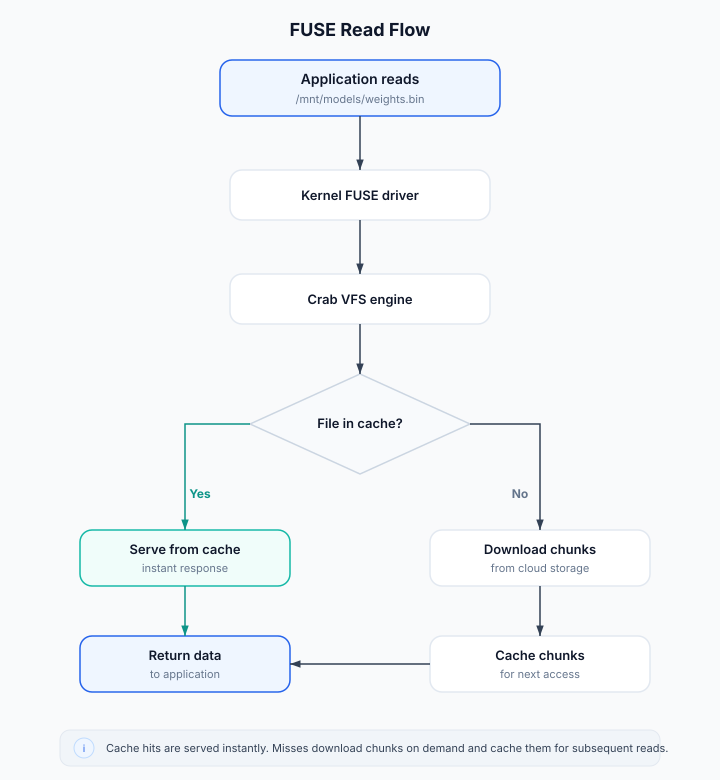

# Virtual Filesystem Mount

The virtual filesystem mount gives you instant access to every file in a Crab repository without downloading anything upfront. Files appear at their full size in directory listings, but content is fetched from cloud storage only when you actually read them. It's like having the entire repository on disk, but only paying for what you touch.

Crab uses NFS by default when available. The NFS backend starts a local loopback NFSv3 server and mounts it through your operating system's NFS client. FUSE is still available with `--backend=fuse` when you want tighter kernel integration and have fuse3 or macFUSE installed.

## Why Use a Virtual Filesystem?

Hydration works well when you know which files you need ahead of time. But sometimes you want to:

- **Browse a large repository** without deciding what to hydrate first
- **Run tools that scan directories** (IDEs, search, build systems) without hydrating everything
- **View another branch** without switching your working tree
- **Access a remote repository** without cloning it at all

The mount handles all of these by presenting files on-demand.

## How It Works



When you mount a repository:

1. **Directory structure is instant** — Crab builds a snapshot from git's tree objects (lightweight metadata). `ls` and `find` work immediately.
2. **File reads are on-demand** — The first read of a file triggers chunk downloads. Subsequent reads are served from cache.
3. **Writes go to an overlay** — Modified files are stored locally in an overlay layer until you explicitly commit or discard them.
4. **Backend selection is explicit when needed** — `crab mount` defaults to `--backend=auto`, which prefers NFS. Use `--backend=fuse` for FUSE.

## Quick Start

### Mount a remote repository

No prior clone needed — mount directly from cloud storage:

```bash
crab mount --repo crab://bucket/ml-models --mountpoint /mnt/models
```

Select a backend explicitly:

```bash
crab mount --repo crab://bucket/ml-models --mountpoint /mnt/models --backend=nfs
crab mount --repo crab://bucket/ml-models --mountpoint /mnt/models --backend=fuse
```

Files are immediately accessible:

```bash
ls /mnt/models/
cat /mnt/models/config.json
python -c "import torch; m = torch.load('/mnt/models/weights.bin')"
```

### Mount a local branch

View another branch without switching your working tree:

```bash
crab mount --repo . --mountpoint /tmp/feature-view --ref=feature-branch
```

### Unmount

```bash
crab unmount --mountpoint /mnt/models
```

## Runtime Behavior

Multiple mounts can share local cache resources, so reading a file through one
mount can make the same content faster to read elsewhere. Crab also prioritizes
interactive reads over background prefetching, which keeps browsing responsive
while larger files are loading.

You do not need to manage a background service manually. `crab mount` starts
what it needs, and unmounting the last active mount releases those resources.

NFS background mounts run in a `crab-nfs-mount` helper process. FUSE
background mounts use the coordinator-style mount mode. Crab also has
DaemonService mode for persistent named multi-repo mounts. See
[Mount Modes](mount-modes) when you need to decide between them.

## Multiple Mounts

You can have multiple mounts active simultaneously:

```bash
crab mount --repo crab://bucket/repo-a --mountpoint /mnt/a
crab mount --repo crab://bucket/repo-b --mountpoint /mnt/b
crab mount --repo /srv/git/local-repo --mountpoint /tmp/main-view --ref=main
```

All use the same Crab mount cache layout. NFS starts one helper process per
mount; FUSE background mounts share the coordinator. Crab permits one active
mount for a given repo cache at a time; use `crab mount switch` or unmount
before opening another view of the same repo.

## Managing Mounts

### List active mounts

```bash
crab mount list
```

### Check mount health

```bash
crab mount status --mountpoint /mnt/models
crab mount status --mountpoint /mnt/models --live-only --json
```

Use `--live-only` for scripts that must prove the NFS helper or FUSE
coordinator is answering now. Without it, status can fall back to persisted
metadata so you can inspect stale mounts.

### Switch branch without unmounting

```bash
crab mount switch --mountpoint /mnt/models --ref=experiment-v3
```

### Force refresh from remote

```bash
crab mount refresh --mountpoint /mnt/models
```

## Read-Only vs. Read-Write

By default, mounts support writes through an overlay layer. Written files stay
local until you publish them with `crab mount commit` or discard them with
`crab mount reset --overlay --yes`. This keeps application writes isolated
from repository refs until you choose to create a commit.
Only one mount can use a repo cache at once, which keeps the cached Git
checkout, snapshot database, and overlay state unambiguous.

```bash
crab mount diff --mountpoint /mnt/view
crab mount commit --mountpoint /mnt/view -m "Update generated artifacts"
crab mount commit --mountpoint /mnt/view -m "Update generated artifacts" --push
```

For a strict read-only mount:

```bash
crab mount --repo crab://bucket/repo --mountpoint /mnt/view --read-only
```

## Performance Characteristics

| Operation | Latency | Notes |
|-----------|---------|-------|
| `ls` / directory listing | Instant | Served from in-memory snapshot |
| First read of a file | Network-dependent | Downloads chunks from cloud |
| Subsequent reads | Local disk speed | Served from chunk cache |
| Small files (< 1 MB) | ~50-200ms first read | Single chunk fetch |
| Large files (> 1 GB) | Streaming | Chunks fetched as read progresses |

## Prerequisites

### NFS backend (default)

macOS includes an NFS client. Linux needs the NFS client utilities:

```bash
# Ubuntu/Debian
sudo apt-get install nfs-common

# Fedora/RHEL
sudo dnf install nfs-utils
```

Linux host policy still controls the kernel mount syscall. On normal hosts
that may mean root or passwordless sudo; in containers it may mean
`CAP_SYS_ADMIN`.

Windows needs Client for NFS installed and mounts to a drive target:

```powershell
crab mount --repo crab://bucket/repo --mountpoint Z:
```

### FUSE backend

### macOS

```bash
brew install --cask macfuse
```

Approve macFUSE in System Settings and reboot if prompted.

The rest of the Crab CLI works without macFUSE installed. The default NFS
backend also does not require macFUSE. Only `crab mount --backend=fuse` needs
macFUSE.

### Linux FUSE (Ubuntu/Debian)

```bash
sudo apt-get install fuse3 libfuse3-dev
```

### Linux FUSE (Fedora/RHEL)

```bash
sudo dnf install fuse3 fuse3-devel
```

### Verify FUSE is available

```bash
ls /dev/fuse
```

## Limitations

- **Network required for uncached reads** — First access to a file needs cloud connectivity. Cached files work offline.
- **Writes require explicit publish** — The overlay is not transparent write-through. Use `crab mount commit` or `crab daemon commit` to create a commit from overlay changes.
- **First-access latency** — The first read of a large file has download latency. Use `crab fetch` to pre-warm if needed.
- **Backend-specific OS policy** — NFS depends on the native NFS client and mount permissions. FUSE depends on fuse3 or macFUSE. Windows uses NFS drive targets such as `Z:`.

## Mount vs. Hydrate: When to Use Which

| Use Case | Recommendation |
|----------|---------------|
| Working on specific files (editing, training) | Hydrate — full local copy, no latency |
| Browsing / exploring a large repo | Mount — instant access, no upfront download |
| CI pipeline with known file list | Hydrate with manifest — predictable, cacheable |
| Viewing another branch | Mount — no working tree changes |
| IDE / editor access | Mount for browsing, hydrate for editing |

## Troubleshooting

### Stale mount (Transport endpoint not connected)

If the coordinator crashed:

```bash
crab unmount --all

# If that fails, use OS tools:
# Linux: fusermount3 -u /mnt/stale-mount
# macOS: umount -f /mnt/stale-mount
```

### Permission denied on mountpoint

```bash
sudo mkdir -p /mnt/models && sudo chown $USER /mnt/models
```

### Slow first access

Pre-warm the cache for files you'll need:

```bash
crab fetch --include 'models/**'
```

## CLI Reference

For complete command syntax, all subcommands, and options, see the [crab mount reference](/docs/cli/reference/crab-mount).
