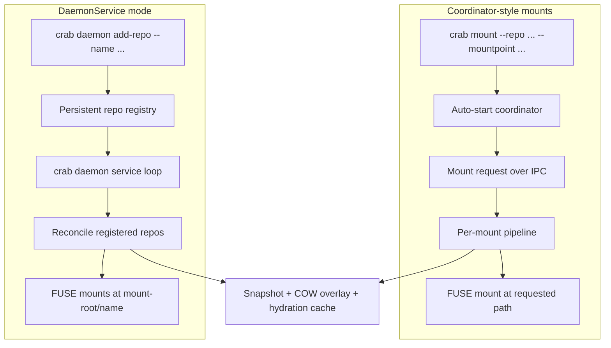

# Mount Modes

Crab has two supported ways to run virtual filesystem mounts:

- **Coordinator-style mounts**: the default `crab mount` workflow. Use this
  when you want to mount a repository at a path now, with no repo registration
  step.
- **DaemonService mode**: the `crab daemon` workflow. Use this when you want a
  long-running service to manage a named set of repositories.

Both modes expose repositories through FUSE, fetch file content on demand, and
use a local copy-on-write overlay for writes. The difference is ownership:
coordinator-style mounts are mountpoint-oriented and ephemeral; DaemonService is
repo-name-oriented and persistent.

## Quick Recommendation

| Need | Use |
| --- | --- |
| Mount one repo for exploration, review, notebooks, or local development | Coordinator-style `crab mount` |
| Mount several repos temporarily | Coordinator-style `crab mount` |
| View another local branch without changing your working tree | Coordinator-style `crab mount --repo . --ref <branch>` |
| Keep a stable fleet of repos mounted on a workstation or shared host | DaemonService mode |
| Manage repos by name with `list`, `status`, `fetch`, `enable`, `disable`, and `remount` | DaemonService mode |
| Integrate Crab mounts into an agent environment or service supervisor | DaemonService mode |

If you are unsure, start with coordinator-style mounts. Move to DaemonService
when the mount set itself becomes something you want to manage.

## Architecture at a Glance



## Coordinator-Style Mounts

Coordinator-style mounts are the default behavior for `crab mount` on Unix when
you do not pass `--foreground`.

```bash
crab mount --repo crab://bucket/ml-models --mountpoint /mnt/models
```

The CLI validates the request, creates the mountpoint if needed, then sends the
mount request to a local coordinator process. If the coordinator is not running,
Crab starts it automatically. The coordinator owns active FUSE sessions, shared
chunk cache access, hydration workers, and runtime mount state.

### State and Paths

| State | Default location |
| --- | --- |
| Coordinator socket | `~/.crab/mounts/daemon.sock` |
| Coordinator lock and PID | `~/.crab/mounts/daemon.lock`, `~/.crab/mounts/daemon.pid` |
| Per-repo mount state | `~/.crab/mounts/repos/<hash>/` |
| Blobless clone | `~/.crab/mounts/repos/<hash>/.git` |
| Snapshot database | `~/.crab/mounts/repos/<hash>/snapshot.sqlite` |
| Overlay database and files | `~/.crab/mounts/repos/<hash>/overlay.db`, `~/.crab/mounts/repos/<hash>/overlay/upper/` |

The hash is derived from the source, so repeated mounts of the same remote or
local path can reuse local state.

### Lifecycle

1. User runs `crab mount`.
2. The CLI sends an IPC request to the coordinator.
3. The coordinator runs the mount pipeline: clone or open git metadata, build a
   snapshot, open the overlay, create the resolver, start hydration workers, and
   mount FUSE.
4. The CLI returns after the mount is ready.
5. `crab unmount --mountpoint <path>` removes the mount.
6. When the last mount is removed, the coordinator shuts down.

Use `--foreground` when you want the CLI process itself to own the mount:

```bash
crab mount --repo crab://bucket/repo --mountpoint /mnt/view --foreground
```

Foreground mode is useful for debugging, but it does not share runtime resources
with other coordinator mounts.

### Operations

| Goal | Command |
| --- | --- |
| List active mounts | `crab mount list` |
| Check one mount | `crab mount status --mountpoint /mnt/models` |
| Refresh now | `crab mount refresh --mountpoint /mnt/models` |
| Switch branch or ref | `crab mount switch --mountpoint /mnt/models --ref experiment-v3` |
| Show overlay changes | `crab mount diff --mountpoint /mnt/models` |
| Export overlay files | `crab mount export --mountpoint /mnt/models --to /tmp/models-overlay` |
| Commit overlay changes | `crab mount commit --mountpoint /mnt/models -m "Update artifacts"` |
| Commit and push | `crab mount commit --mountpoint /mnt/models -m "Update artifacts" --push` |
| Discard overlay changes | `crab mount reset --mountpoint /mnt/models --overlay --yes` |
| Unmount | `crab unmount --mountpoint /mnt/models` |

### Pros

- No registration step.
- Best default path for one-off and interactive use.
- Easy to switch a mount between branches.
- Multiple active mounts share one coordinator, cache, and hydration pool.
- One active mount is allowed per repo cache, so each cached checkout and
  snapshot database has a single owner.
- Overlay inspection is mountpoint-oriented and direct: `diff`, `export`,
  `commit`, and `reset`.
- Minimal persistent configuration.

### Cons

- Active intent is tied to mountpoints, not stable repo names.
- Less convenient for "these repos should always be mounted" environments.
- Less suitable for boot-time or supervisor-managed workflows.
- If the coordinator exits unexpectedly, active mounts must be cleaned up and
  recreated.

## DaemonService Mode

DaemonService mode is the `crab daemon` command family. It is not legacy code.
It is a different operating model for persistent multi-repo mounts.

Register repos by name:

```bash
crab daemon add-repo \
  --name ml-models \
  --remote crab://bucket/ml-models \
  --branch main \
  --mount-root /mnt/repos
```

Start the service:

```bash
crab daemon
```

The repo is mounted at:

```text
/mnt/repos/ml-models
```

The daemon stores a registry, periodically reconciles it, and mounts every
enabled repo. If you add or remove repos while the daemon is running, the
service loop picks up the registry change on its next sync.

### State and Paths

| State | Default location |
| --- | --- |
| Daemon root | `~/.crab/daemon/` |
| Repo registry | `~/.crab/daemon/config/repos.sqlite` |
| Per-repo state | `~/.crab/daemon/repos/<name>/` |
| Blobless clone | `~/.crab/daemon/repos/<name>/.git` |
| Snapshot database | `~/.crab/daemon/repos/<name>/snapshot.sqlite` |
| Overlay database and files | `~/.crab/daemon/repos/<name>/overlay.db`, `~/.crab/daemon/repos/<name>/overlay/upper/` |
| Shared chunk cache | `~/.crab/daemon/cache/chunks/` |
| Mount path | `<mount-root>/<name>` |

Use `--root <path>` when you want the daemon state somewhere else:

```bash
crab daemon --root /srv/crab-daemon
crab daemon --root /srv/crab-daemon list
```

### Lifecycle

1. User registers repos with `crab daemon add-repo`.
2. `crab daemon` starts the service and reads the registry.
3. The service reconciles registered repos every few seconds.
4. Enabled repos are mounted at `<mount-root>/<name>`.
5. Removed or disabled repos are unmounted.
6. On shutdown, the daemon tears down all managed mounts.

This is a service model. In production or shared environments, run it under a
supervisor such as systemd, launchd, or the process manager used by your
agent runtime.

### Operations

| Goal | Command |
| --- | --- |
| Register a repo | `crab daemon add-repo --name ml-models --remote crab://bucket/ml-models --branch main --mount-root /mnt/repos` |
| Start the service | `crab daemon` |
| List registered repos | `crab daemon list` |
| Get JSON status | `crab daemon status --name ml-models --json` |
| Force fetch | `crab daemon fetch --name ml-models` |
| Remount | `crab daemon remount --name ml-models` |
| Remount and discard overlay | `crab daemon remount --name ml-models --clean-overlay` |
| Disable without deleting registration | `crab daemon disable --name ml-models` |
| Enable again | `crab daemon enable --name ml-models` |
| Commit overlay changes | `crab daemon commit --name ml-models -m "Update artifacts"` |
| Commit and push | `crab daemon commit --name ml-models -m "Update artifacts" --push` |
| Remove registration | `crab daemon remove-repo --name ml-models` |

### Pros

- Repos are named and persistent.
- Better fit for machines that should keep a stable set of repos mounted.
- Easier to integrate with agents and supervised services.
- Registry-backed `list`, `status`, `enable`, `disable`, `fetch`, and
  `remount` commands are easier to automate than mountpoint discovery.
- Stable per-repo state paths make operational debugging predictable.

### Cons

- Requires repo registration before use.
- More persistent state to manage.
- Less convenient for quick branch views or one-off browsing.
- Overlay inspection is currently less rich than coordinator-style mounts:
  status reports dirty counts, and commit/remount workflows are repo-name
  based.
- Service lifecycle matters. If the daemon is not running, registered repos are
  not actively mounted.

## Copy-on-Write and Commit-Back

Both modes use the same write model:

1. Reads check the overlay first.
2. If a path is not in the overlay, reads fall back to the mounted snapshot and
   on-demand hydration.
3. The first write to a base file promotes that file into the overlay.
4. New files, deletions, renames, symlinks, and directory changes are recorded
   in overlay state.
5. Nothing is pushed automatically.

To publish coordinator-style overlay changes:

```bash
crab mount diff --mountpoint /mnt/models
crab mount commit --mountpoint /mnt/models -m "Update generated artifacts"
crab mount commit --mountpoint /mnt/models -m "Update generated artifacts" --push
```

To publish DaemonService overlay changes:

```bash
crab daemon status --name ml-models
crab daemon commit --name ml-models -m "Update generated artifacts"
crab daemon commit --name ml-models -m "Update generated artifacts" --push
```

During commit, Crab freezes overlay writes, checks that the tracked base ref has
not moved, creates a Git commit from the overlay contents, refreshes the
snapshot, and clears the overlay after a successful local commit. If the push
step fails, the local commit is recorded and the overlay remains available for
recovery.

Use read-only mode when applications must not write:

```bash
crab mount --repo crab://bucket/repo --mountpoint /mnt/browse --read-only
```

Unmount or run `crab mount switch` before opening another view of the same repo.
Crab intentionally keeps each repo cache owned by one active mountpoint at a
time.

## Choosing a Mode

| Factor | Coordinator-style mounts | DaemonService mode |
| --- | --- | --- |
| Primary identity | Mountpoint | Repo name |
| Setup | One command | Register repos, then run service |
| Default user experience | Interactive CLI | Persistent service |
| Best for | Exploration, reviews, local branch views, temporary multi-repo work | Always-on repo fleets, agents, shared workstations |
| State lifetime | Reused cache, active mounts are runtime state | Registry and repo state persist under daemon root |
| Overlay commands | `crab mount diff/export/commit/reset` | `crab daemon status/commit/remount --clean-overlay` |
| Startup | Auto-started coordinator | Explicit service process |
| Shutdown | Last unmount shuts down coordinator | Service shutdown tears down managed mounts |
| Automation shape | Scripts that know mountpoints | Scripts that know repo names |

## Common Patterns

### Temporary multi-repo workspace

```bash
crab mount --repo crab://bucket/repo-a --mountpoint /mnt/a
crab mount --repo crab://bucket/repo-b --mountpoint /mnt/b
crab mount --repo . --mountpoint /mnt/current-main --ref main
```

Use this when the set of repos changes often or is specific to one task.

### Persistent workstation setup

```bash
crab daemon add-repo --name repo-a --remote crab://bucket/repo-a --branch main --mount-root /mnt/repos
crab daemon add-repo --name repo-b --remote crab://bucket/repo-b --branch main --mount-root /mnt/repos
crab daemon
```

Use this when users or tools expect the same mount paths to exist every day.

### Agent integration

Use DaemonService when a higher-level app needs stable repo names, status
polling, and service lifecycle control. Use coordinator-style mounts when the
app is simply invoking `crab mount` for a user-selected path.

## Troubleshooting by Mode

| Symptom | Coordinator-style mounts | DaemonService mode |
| --- | --- | --- |
| Need to see what is active | `crab mount list` | `crab daemon list` |
| Need one mount's health | `crab mount status --mountpoint <path>` | `crab daemon status --name <name>` |
| Need to refresh content | `crab mount refresh --mountpoint <path>` | `crab daemon fetch --name <name>` or `crab daemon remount --name <name>` |
| Need to discard local overlay changes | `crab mount reset --mountpoint <path> --overlay --yes` | `crab daemon remount --name <name> --clean-overlay` |
| Mountpoint is stale | `crab unmount --mountpoint <path>` or OS unmount tools | Stop the service, clean stale mountpoints, then restart `crab daemon` |
| Need machine-readable status | `crab mount list --json`, `crab mount status --json`, `crab mount status --live-only --json` | `crab daemon list --json`, `crab daemon status --json` |

## Related Reference

- [crab mount](/docs/cli/reference/crab-mount) - coordinator-style mount command.
- [crab daemon](/docs/cli/reference/crab-daemon) - DaemonService command family.
- [Mount Management](mount-management) - day-to-day coordinator mount operations.
