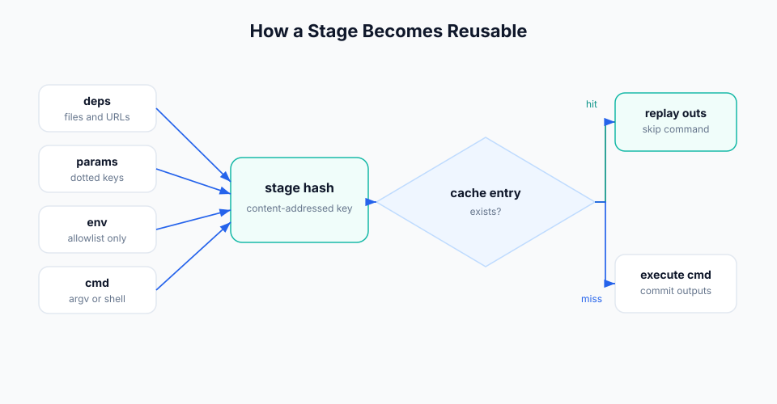

# Workflow Concepts

Workflow is built around one rule: a stage result can be reused when the stage
inputs are identical. Crab turns each stage into a content-addressed function.



## Stage

A stage is a named command with declared inputs and outputs:

```yaml
stages:
  train:
    cmd: python src/train.py
    deps:
      - src/train.py
      - data/features.parquet
    params:
      - train.lr
      - train.epochs
    outs:
      - models/model.pkl
    metrics:
      - metrics/train.json
```

Think of a stage as:

```text
(cmd, deps, params, selected env, workflow metadata) -> outs, metrics, plots
```

If the left side is unchanged and a matching cache entry exists, Crab restores
the outputs instead of running the command.

## Dependencies

`deps` are files, directories, URLs, remote references, or upstream stage
outputs that must exist before a stage runs. Crab hashes dependency content and
uses those hashes in the stage hash.

Declare every file that can change the result. Missing deps fail early unless a
lockfile proves the dep is unchanged and the run uses `--allow-missing`.

## Outputs

`outs` are files or directories the stage produces. On a fresh run, Crab records
their hashes and stores them in the stage cache. On a cache hit, Crab restores
them into the workspace.

Use `--no-overwrite` when you want cache replay to fail instead of replacing a
different existing file.

## Parameters

`params` are scalar values loaded from params files such as `params.yaml`. They
let you change model settings, feature choices, or thresholds without changing
stage command strings.

```yaml
params:
  - params.yaml

stages:
  train:
    params:
      - train.lr
      - train.epochs
```

Inspect and compare them with `crab params show` and `crab params diff`.

## Metrics and Plots

Metrics are structured output files, usually JSON, YAML, CSV, or TSV. Plots are
metric-like files that can render as Vega-Lite or HTML.

```yaml
metrics:
  - metrics/train.json

plots:
  - metrics/loss.csv:
      x: epoch
      y: val_loss
```

Use `crab metrics show`, `crab metrics diff`, `crab plots show`, and
`crab plots diff` to inspect results.

## Lockfile

`crab.lock` records the last successful materialized state of the workflow:
stage hashes, dependency hashes, output hashes, metrics, and plots.

Commit the lockfile with the workflow definition. It lets reviewers and CI see
what changed, and it lets Crab decide which stages are stale.

Large monorepos can use split lockfiles. See [Split Workflows and Lockfiles](./split-workflows-lockfiles).

## Stage Cache

The stage cache stores successful stage manifests and output references. Local
cache entries live under `.crab/cache/stages/`. Remote cache entries are pushed
to the configured Crab remote with `crab run --cache-push` or
`crab workflow push-cache --all`.

The cache is stage-complete: a cache hit restores the declared outputs for the
whole stage. If only one output should be regenerated independently, split the
stage.

## Journal

Each run writes a journal under `.crab/workflow/runs/`. The journal records
stage start, cache checks, produced outputs, commits, failures, and aborts.

Journals make interrupted runs recoverable. Use `crab workflow journal` to
inspect history and `crab run --abandon <run-id>` when a stuck run should be
marked abandoned.

## Experiments

Experiments run the DAG in a temporary worktree with parameter overrides. The
workspace stays clean while Crab records metadata, metrics, stage hashes, and
the base commit.

Use experiments for model sweeps, report variants, and any run where you want
to compare results before applying them to the current workspace.
