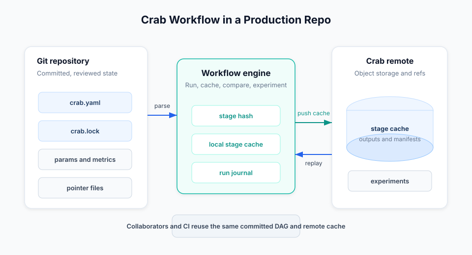

# Crab Workflow

Crab Workflow is the production pipeline layer for repositories that already
use Crab for large files. It lets you define stages, track dependencies and
outputs, cache stage results, compare metrics, and run experiments without
adding a separate data server.

Use Workflow when a repository has commands that should be reproducible:
data preparation, model training, evaluation, report generation, asset builds,
or any expensive step where "same inputs, same outputs" should be reusable.

## What Workflow Adds

Crab's file layer handles large content in git by storing pointers in commits
and bytes in object storage. Workflow sits above that layer:

| Layer | What it does | Typical commands |
|-------|--------------|------------------|
| Git | Tracks source, workflow files, params, lockfiles, and pointer blobs | `git commit`, `git diff` |
| Crab file storage | Chunks, deduplicates, hydrates, dehydrates, pushes, and pulls large files | `crab add`, `crab push`, `crab hydrate` |
| Crab Workflow | Runs reproducible stages, caches outputs, compares params and metrics, and manages experiments | `crab run`, `crab exp`, `crab metrics`, `crab plots` |

The workflow layer is additive. A repo can use Crab for large files without
Workflow, and a Workflow repo still uses normal git commits and branches.

## Production Model

A workflow repo usually commits these files:

- `crab.yaml` and optional `*.workflow.yaml` files declare stages.
- `params.yaml` or other params files hold values used by stages.
- `crab.lock` and optional `*.workflow.lock` files record the exact state that
  ran successfully.
- Source files, scripts, configs, and small metrics live in git.
- Large stage outputs can be Crab-managed files backed by object storage.

Local runtime state stays out of git:

- `.crab/cache/stages/` stores local stage cache entries.
- `.crab/workflow/runs/` stores run journals for crash recovery and audit.
- `.crab/workflow/exp/` stores local experiment metadata.
- Queued experiment logs and temporary worktrees are local until pushed.

## DVC-Style, Crab-Native

Workflow is inspired by DVC's pipeline and experiment model, but it is designed
to live inside Crab's serverless git remote:

- Stages use familiar `deps`, `outs`, `params`, `metrics`, and `plots`.
- `crab repro` is an alias for `crab run`.
- `crab stage add` authors DVC-style stage definitions.
- `crab exp` runs experiments in temporary worktrees.
- `crab queue` and `crab exp queue` run batches of experiment overrides.
- `crab workflow push-cache --all` shares stage cache through the configured Crab
  remote.

If you are moving from DVC, start with [Migrating from DVC](/docs/cli/workflow/migration-from-dvc).

## Recommended Learning Path

1. [Quickstart](/docs/cli/workflow/quickstart) - run a small pipeline with Workflow.
2. [Concepts](/docs/cli/workflow/concepts) - understand stages, cache, lockfiles, journals, and experiments.
3. [Authoring Stages](/docs/cli/workflow/authoring-stages) - write production `crab.yaml` files.
4. [Running Pipelines](/docs/cli/workflow/running-pipelines) - use target modes, cache controls, and JSON output.
5. [Experiments](/docs/cli/workflow/experiments) and [Hydra](/docs/cli/workflow/hydra) - compare parameterized runs.
6. [Remote Cache and CI](/docs/cli/workflow/remote-cache-ci) - make cache reuse work for teams and automation.
7. [Operations and Troubleshooting](/docs/cli/workflow/operations-troubleshooting) - recover from common failures.

Command-level details remain in [Automation & Pipelines](/docs/cli/automation)
and [CLI Reference](/docs/cli/reference).
