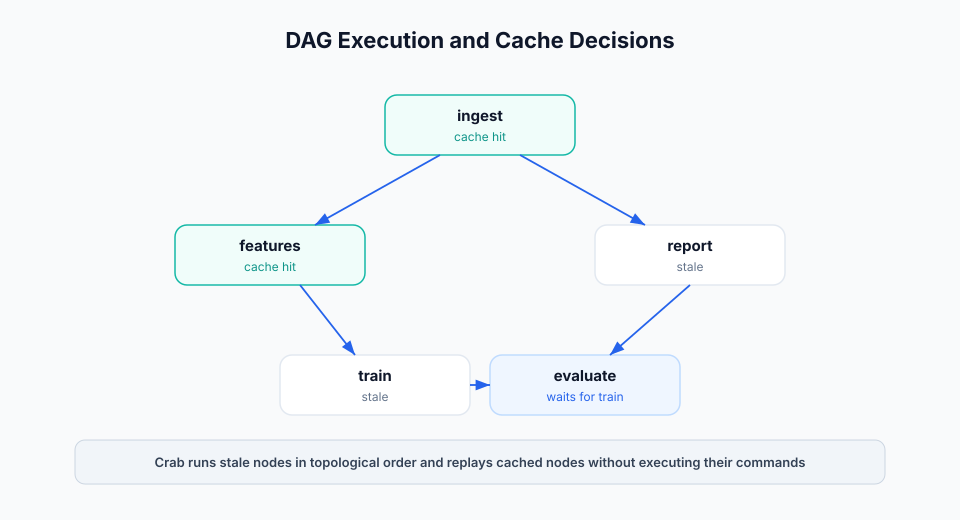

# Running Pipelines

`crab run` is the primary workflow executor. `crab repro` is the DVC-compatible
spelling for the same command.



## Enable and Validate

```bash
# Fresh configs are enabled; set workflow.enabled false only to opt out.
crab run --validate
```

`--validate` parses workflow files and checks semantic errors without running
commands. Use it in pre-commit hooks and CI before expensive jobs.

## Run the Full DAG

```bash
crab run
```

Crab discovers workflow files, builds the DAG, checks each stage against
`crab.lock` and the stage cache, and runs stale stages in topological order.

Preview the plan:

```bash
crab run --dry
crab run --dry --explain-miss
```

## Target Specific Stages

```bash
crab run train
crab repro train
```

By default, target runs include upstream dependencies needed by the selected
stage. DVC-compatible target controls are available:

| Mode | Command | Behavior |
|------|---------|----------|
| Single item | `crab repro --single-item train` | Run only the named stage target. |
| Downstream | `crab repro --downstream prepare` | Run the target and downstream consumers. |
| Pipeline | `crab repro --pipeline train` | Run the pipeline component containing the target. |
| All pipelines | `crab repro --all-pipelines` | Discover and run every pipeline. |
| Glob | `crab repro --glob "train*"` | Match target names with glob patterns. |

Use `--stages <glob>` for Crab-native glob selection:

```bash
crab run --stages "train*"
```

## Cache Controls

| Option | Use when |
|--------|----------|
| `--force` | You want selected stages to re-execute even on cache hits. |
| `--force-downstream` | A stage re-ran and every descendant should re-run too. |
| `--no-run-cache` | You want to execute commands but still write fresh cache entries. |
| `--cache-only` | CI should restore outputs from cache and fail if anything is missing. |
| `--no-commit` | You want to test execution without writing cache entries or output xorbs. |
| `--no-overwrite` | Existing output files should not be replaced by cache replay. |

Use `--explain-miss` whenever a cache miss is surprising. It prints the input
hash breakdown used to compute the stage hash.

## Remote Data Controls

```bash
crab run --pull --allow-missing
```

`--pull` downloads missing dependency files for stages that need to execute.
`--allow-missing` lets stages remain skipped when missing workspace deps match
the lockfile. Together they make CI jobs hydrate only what changed.

## Concurrency and Locks

```bash
crab run --parallelism 4
crab run --no-wait
crab run --lock-timeout 30
```

Crab holds a scheduler lock while running a workflow. Use `--no-wait` for CI
jobs that should fail fast if another run is active. Configure the default with:

```bash
crab config set workflow.parallelism 4
crab config set workflow.lock_timeout_secs 600
```

## Failure Modes

By default, a failed stage stops dependent work. Use partial-success modes for
large DAGs:

```bash
crab run --keep-going
crab run --ignore-errors
```

`--keep-going` skips downstream consumers of failed stages but continues
unrelated branches. `--ignore-errors` is more aggressive and attempts remaining
work even when producers failed.

## Structured Output

Use `--json` for one final envelope:

```bash
crab run --json
```

Use `--jsonl` for streaming automation:

```bash
crab run --jsonl | tee workflow-events.jsonl
```

JSONL events are best for CI logs, dashboards, and long-running jobs because
they report stage start, cache checks, produced outputs, failures, and commits
as they happen.

## Watch Mode

```bash
crab run --watch
```

Watch mode executes once, then watches declared deps for changes and reruns
affected stages. Use it for local development, not unattended production jobs.

## Recursive Workflows

```bash
crab run --recursive
crab config set workflow.discover recursive
```

Recursive discovery merges nested `crab.yaml` files and `*.workflow.yaml`
files. For monorepos, pair it with split lockfiles so teams can own smaller
workflow surfaces.
