# Crab S3 gateway: executable design and phased implementation plan

Status: gateway implemented in `crates/crab-s3-gateway`, including object
attributes/tagging, conditional writes, persisted checksums, and optional
virtual-host routing; broader
cross-client, cross-provider, failure-injection, and deployment qualification
remains a release gate. The frozen delivered surface and deliberate limits are
recorded in `s3-gateway-contract.md`.
Depends on the [SDK delivery plan](crab-sdk.md), especially remote writes,
publication recovery and backend qualification. This document does not mark any
SDK capability delivered beyond the shared contracts used by the gateway.
Where this phased plan retains proposed or future work, the frozen contract is
the authority for the currently delivered behavior.

## Outcome and ownership

Create `crates/crab-s3-gateway` as a separate server composition boundary,
parallel to `crab-http-server`. Existing S3 clients connect over HTTPS using
Crab-issued access credentials. The gateway translates S3 operations into SDK
repository operations. Backend bucket names and storage placement stay private
to the repository catalog; clients address logical repository names.

`crab-http-server/src/lib.rs` exposes server configuration, initialization and
serving; its private authentication and receive handlers are not a reusable S3
service. Its `src/server.rs` composes storage and remote reads, while
`src/receive/publish.rs` integrates repository policy and publication. Reuse
shared owners beneath these handlers, not the handlers themselves. The gateway
must not depend on the UI server or reproduce journal publication, hydration,
locks or GC fencing. Shared authorization policy needs one owner before both
servers can write the same protected repositories.

The gateway owns S3 signing verification, HTTP/XML translation, logical URI
routing, credential-to-principal mapping and protocol-specific durable state.
The SDK owns application-facing repository operations; shared crates retain
storage, reconstruction, staging and publication mechanics.

## Logical addresses and S3 routing

The requested URI forms are:

| URI | Meaning |
| --- | --- |
| `crabfs://my-repo` | Repository identity |
| `crabfs://my-repo/main` | Repository at a ref expression |
| `crabfs://my-repo/main/` | Root prefix at that ref |
| `crabfs://my-repo/main/data/file.parquet` | Object path |
| `crabfs://my-repo/main/data/` | Object prefix |

These are logical identifiers, not storage locators or HTTP endpoints. Do not
reinterpret `crab://bucket/repo` or replace existing storage locator contracts.
An S3 library does not acquire `crabfs` scheme support from an endpoint override;
filesystem libraries need a scheme adapter if they accept these URIs directly.

Proposed canonical wire mapping: `Bucket = REPO`, `Key = REF/KEY`.
For example, `GetObject(Bucket="my-repo", Key="main/data/file.parquet")`.
List requests use `Prefix="main/data/"`; returned keys retain `main/` so they
can be passed directly into subsequent S3 calls. Support path-style requests
first; qualify virtual-hosted addressing separately, including DNS/TLS. This
preserves S3 method calls but requires ref-aware keys or configured prefixes.
It does not promise unchanged key values for existing applications.

Proposed ref grammar: short names select branches; fully qualified
`refs/heads/...` and `refs/tags/...` disambiguate names; full commit IDs select
immutable snapshots. Branch/tag name collisions must not silently choose a tag.
The current SDK supports typed branches, tags and full commit IDs, not arbitrary
Git revision expressions. Ancestry expressions need a bounded resolver and tests
before they become part of this grammar. Writes target branches only.

Encode REF as one URI segment. Proposed example: branch `feature/data` uses
`crabfs://my-repo/feature%2Fdata/file.parquet`. Its logical S3 key is
`feature%2Fdata/file.parquet`; the HTTP client escapes the literal percent sign
when constructing the signed request. Verify the signature over the original
wire request, decode HTTP encoding once, split the logical key, then decode the
ref segment once. Never normalize paths before signing or repeatedly decode
object keys. Literal percent signs, encoded slashes, Unicode and copy-source
headers need end-to-end vectors. Finalize this grammar before implementing it.

Repository-only listings need a defined ref namespace: proposed root listings
expose authorized branch prefixes, and object traversal requires a ref prefix.
Do not scan every commit when listing a repository. Tags and commit selectors
are addressed explicitly; they are not an infinite synthetic directory tree.

S3 keys are not Git paths. Current `crab-sdk/src/value.rs::GitPath` rejects empty
and parent components; Git trees also cannot contain both file `a` and file
`a/b`. A release must specify either a restricted repository-path profile or a
lossless object-key representation, including folder markers and Git-client
round trips. No silent normalization, dropped markers or false full-key parity.

## Versioning and write visibility

Selected initial model: each successful object mutation publishes a commit;
multipart parts remain invisible until completion. Reads pin a commit per
request. Writable branches advance through expected-OID publication, while tags
and commit snapshots are read-only. Unrelated concurrent file writes must not
overwrite each other; bounded re-preparation must preserve object preconditions.
Reauthorize and recheck conditions at publication, not just upload admission.

The rejected initial alternative is durable uncommitted branch state plus explicit commit.
That requires shared overlay/read/commit semantics beyond the current SDK plan;
it must not be introduced as an invisible gateway-only second repository state.

Repository versioning and AWS object versioning are separate contracts. Full S3
versioning additionally needs `GetBucketVersioning`, `PutBucketVersioning`,
`ListObjectVersions`, version-specific GET/HEAD/COPY/DELETE, delete markers,
retention and interaction with branch movement. These were not in the requested
operation list. Do not advertise S3 bucket versioning or return invented
`x-amz-version-id` values until that contract is chosen and implemented.

Branches, tags, commits, diffs and merges have no standard S3 API methods. A
separate authenticated repository API/SDK must expose supported repository
actions. Ordinary S3 clients can address refs through keys, but cannot acquire
new branch/merge methods without extensions. Merge support is not implied by
the SDK's planned remote file-edit and ref-update APIs.

## Requested protocol surface

All rows are requirements, not current support. Each row requires positive,
error, authorization and real-client evidence before advertising it.

| Surface | Required behavior |
| --- | --- |
| SigV2, SigV4 | S3-specific header and presigned-query verification; canonicalization vectors, expiry/skew, credential revocation, payload integrity, supported streaming/checksum forms |
| ListBuckets, HeadBucket | Authorized logical repository catalog; pagination and visibility policy; no exposure of backing buckets |
| GetObject, HeadObject | Logical reconstructed content; metadata and caching headers; correct conditional-header precedence, ETags, single ranges, suffix/open ranges, empty objects and HEAD responses |
| PutObject | Bounded streaming, checksums, user metadata and standard content headers; atomic publication with conditional writes |
| DeleteObject, DeleteObjects | Missing-key semantics; per-key authorization/results, quiet mode and request integrity; no claim that S3 multi-delete is an atomic transaction |
| CopyObject | Authorize source and destination separately; pin source version, apply copy conditions and metadata directive; cross-ref/repository data dependencies remain valid after source GC |
| ListObjects, ListObjectsV2 | Prefix, delimiter `/`, ordering, markers/tokens, truncation, URL encoding and CommonPrefixes; returned keys remain usable by S3 clients |
| CreateMultipartUpload, UploadPart, UploadPartCopy | Durable upload identity and part catalog, replacement of a part number, checksums, source ranges and isolated uncommitted content |
| CompleteMultipartUpload | Validate selected ordered parts and ETags/checksums; publish once for that upload identity; durable recovery of uncertain completion |
| AbortMultipartUpload | Fence racing uploads/completion, release staged data safely and prevent aborted state from becoming visible |
| ListParts, ListMultipartUploads | Paginated durable gateway records on every qualified backend, including restart and concurrent gateway instances |

SSE request features, SelectObjectContent, storage-class selection and object
tagging are excluded as requested. Unsupported features need documented S3
errors; do not accept headers while ignoring their requested behavior. Backend
encryption at rest is a separate storage deployment concern. Bucket creation and
deletion are not implied by ListBuckets/HeadBucket. Browser POST uploads and AWS
IAM administration are not implied by signature verification.

Use S3-specific SigV2 documentation: the supplied general SigV2 URL now redirects
to SigV4 documentation. Crab access keys identify Crab principals; they are not
backend AWS credentials. Signature validity does not grant repository access.
Enforce repo/ref/path permissions, branch protection and historical-read policy;
copy requires both source read and destination write permission. Reject direct
writes to protected branches unless the canonical policy permits them.

User metadata, content headers, ETags and object modification times need durable
version-bound storage published atomically with content. Git blobs alone do not
contain them. Define behavior after ordinary Git/CLI edits, copies, renames and
merges before choosing the representation. This is an SDK/shared metadata gap,
not a reason to put a mutable sidecar beside each object in the gateway.

V2 continuation tokens should bind repo, ref snapshot, query and authorization
context and be tamper-resistant; reauthorize each page. V1 markers cannot carry
the same snapshot binding without a separate contract, so multi-page snapshot
consistency cannot be promised identically for both protocols.

## Durability and performance gates

Persist upload state independently of the provider's native multipart API;
gateway part numbering and listings cannot depend on S3-only backend features.
Specify a versioned schema, conditional state transitions, upload ownership,
restart recovery, quota enforcement and GC roots before accepting parts.
Do not reuse backend upload IDs as authorization or recovery tokens.

Successful writes must be durable and visible to subsequent reads across gateway
instances. The UI server's short-lived ref cache is not sufficient proof of this
contract. Preserve known committed outcomes through cancellation and readiness
failures; use SDK receipts for reconciliation. A retried ordinary PutObject has
no universal S3 idempotency token, so do not claim exactly-once commit history
across ambiguous client retries. Multipart completion has an upload identity
that can bind its recovered outcome.

Stream content with bounded memory, backpressure and explicit spool limits.
HEAD/LIST must not hydrate payloads. Range reads should reconstruct only needed
data while preserving the underlying integrity contract. Qualification must
measure same-branch small-write contention, large multipart transfers, large
prefix listings, concurrent copies, cold/warm reads, metadata growth and GC.
Do not assume one commit per PUT meets throughput goals without measurements;
do not silently batch acknowledged writes into a later commit.

## Multipart implementation design

Start with immutable temporary part objects and a shared durable catalog. Native
provider multipart may transport an individual large part, but is not the
client-visible session. Existing `crab-storage/src/multipart.rs` describes an
outbound upload with known total size and fixed part sizing;
`crab-staging/src/multipart_resume.rs` supplies its local SQLite journal. Neither
is the incoming S3 session catalog. Do not stretch those contracts to pretend
client-selected, replaceable parts are a fixed outbound plan.

The following are logical records, not approved storage key/schema definitions:

| Record | Required fields and ownership |
| --- | --- |
| Upload | Random ID; immutable repo identity and placement binding; target branch/key; initiating principal; metadata/checksum algorithm; creation time; state and revision; completion binding |
| Part | Upload ID and part number; immutable object identity; size; ETag/checksums; registration revision |
| Completion | Exact selected part identities and ordered request digest; prepared SDK recovery token persisted before execute; durable outcome and response fields |
| Terminal record | Completed/aborted outcome, retention boundary and cleanup progress; retained long enough for the documented recovery contract |

State transitions:

```text
Open -> Completing -> Completed
  |          |
  v          +-> reconcile after interruption; never blindly reopen
Aborted
```

Before freeze, an invalid completion leaves Open unchanged. After freeze, a
proven rejected completion becomes terminal only after execution is fenced; it
does not reopen underneath an old worker. An uncertain outcome stays Completing. An abort which loses to Completing cannot erase its recovery proof;
reconcile first and return the documented S3 outcome. The state transition is
conditional on the current revision, never a read followed by an unconditional
write.

For UploadPart, stream bytes to a unique immutable object, check integrity, then
register it under the upload's current Open state. A short upload-scoped lease
or transactional equivalent serializes registration against freeze/abort;
network transfer holds no branch lease. A losing registration leaves an orphan
for cleanup. Replacement swaps the registered object identity, preserving any
older object still referenced by an in-flight completion. A part is acknowledged
only after its bytes and registration are durable.

Complete validates the submitted ascending part list and exact ETags/checksums,
freezes those immutable identities, and reads only those parts as a continuous
stream. Use the canonical SDK chunker across part boundaries; validate total
content integrity and preserve byte order. Do not sort an invalid request into
validity, assume every uploaded part was selected, or use a whole-file buffer.
The publication binds the frozen request and the SDK recovery token. Retried
completion with a different part list must not execute the original upload as a
new mutation. Successful publication exposes the whole file atomically.

ListParts and ListMultipartUploads use ordered, paginated catalog records.
Their retention and authorization policy must survive restart and multiple
instances. Storage-key placement and indexes belong to their designated shared
owners, with one canonical serializer and provider-qualified conditional
updates. Object-store listings alone are not proof of an atomic upload state.

Cleanup scans terminal/expired sessions in bounded pages. GC protects live parts,
frozen completion inputs, prepared artifacts and unresolved receipts. In-flight
writers need fencing or a grace-and-recheck protocol so cleanup cannot delete a
part immediately before registration. Fault tests must prove both eventual
reclamation and preservation of every reachable object.

This design adds temporary storage and a full selected-part read during
completion. Record those bytes explicitly in benchmarks. A future zero-copy
recipe path requires equivalent chunking, checksum, reconstruction and GC proof;
it is not a shortcut in the initial implementation.

## Execution rules and evidence

Each phase below is a bounded implementation unit. Read its context, prerequisites
and source map before editing; deliver code, tests and documentation together.
A phase is complete only when every acceptance criterion has evidence at the
same commit. Compilation and mocked unit tests alone cannot close a phase that
introduces an externally visible operation.

Planned artifacts (create them in the indicated phases; they do not exist yet):

- Phase 0: `crab/docs/architecture/s3-gateway-contract.md`, the exact protocol,
  semantic decisions, supported feature cells and error mapping.
- Phase 2: `crates/crab-s3-gateway/`, with integration tests under `tests/`,
  plus `crab/scripts/e2e/qualify_s3_gateway.py`.
- Phase 8: `.github/workflows/s3-gateway.yml`, client/backend test jobs and
  validation of qualification reports.
- Phase 9: crate README, deployment assets and product documentation.

Proposed runner interface, to implement in phase 2 and extend per phase:

```text
python3 -B crab/scripts/e2e/qualify_s3_gateway.py \
  --endpoint <gateway-https-url> --repository <isolated-test-repo> \
  --suite <catalog|read|list|write|multipart|repository|recovery|performance|deployment> \
  --report <external-workspace>/gateway-report.json
```

Use credentials through the test environment's secret injection; never command
arguments, report contents or logs. No default production endpoint or repository.
The runner must refuse destructive tests without an isolated fixture identity,
return nonzero for failures/timeouts, and record unsupported/skipped cells as
incomplete. Reports include source SHA, dirty state/diff digest, backend/client
versions, fixture hash, suite, assertion counts, request/byte counts, latency,
RSS, disk usage and terminal state. Run independent Git/SDK reads to verify
visible results, not only gateway responses.

Use per-checkout external Cargo artifacts following root AGENTS.md. Once the
crate exists, narrow commands are `cargo test -p crab-s3-gateway --locked --test
<target>` and `cargo clippy -p crab-s3-gateway --all-targets --locked -- -D warnings`,
with CARGO_TARGET_DIR explicitly set. Test targets below are planned names.
Run broad/live/process-kill and performance suites in CI or a dedicated test
environment. Pin the client toolchain and check applicable MSRV rather than
assuming the gateway can use a newer toolchain than its dependencies permit.

## Phase 0 — Freeze namespace and compatibility contracts

**Context.** The requested protocol subset is clear; write visibility and the
meaning of versioning remain unanswered. URI parsing also affects signing,
authorization and permanent key identity. Inconsistent choices here cannot be
fixed safely in individual handlers later.

**Prerequisites.** None. Read this plan, SDK value/revision types, the existing
HTTP repository configuration and the linked AWS specifications.

**Implementation.** Write `s3-gateway-contract.md` with explicit decisions:

- Choose immediate commits or a shared staged-branch model. Recommended first
  release: immediate publication, one commit per successful state-changing
  request; no-op delete need not manufacture a commit. Multi-delete follows its
  per-key result contract, not a universal transaction promise.
- Choose repository history or full AWS object versioning. Recommended initial
  scope: branch/tag/commit addressing. If full object versioning is selected,
  add a separately estimated phase before release for the APIs and semantics
  listed above; do not silently reduce the user's choice.
- Fix repository naming/case, ref grammar, object-versus-prefix parsing,
  encoded slashes and percent signs, empty root behavior, key limits, root
  listing semantics and unsupported ancestry expressions. Specify bare names
  resembling commit hashes and branch/tag collisions unambiguously.
- Choose restricted Git paths or a lossless key representation. Include `a`
  versus `a/b`, empty folder markers, dot components, Unicode, repeated slashes,
  symlinks, executable files and submodules. Reject unsupported writes before
  mutation; define read behavior for pre-existing Git entries.
- Enumerate operation/header/query/checksum/addressing cells, response status,
  XML error codes, limits and scope exclusions. Decide ETag and Last-Modified
  semantics and their compatibility with metadata-only changes.
- Define repository extension actions and routes without repurposing S3 APIs.
  List refs/history/diff and expected-OID branch/tag updates are the baseline;
  merges and explicit staged commits require separately specified shared APIs.

**Acceptance criteria.** Decision record contains no unresolved choice affecting
phase-1 persistence. Every requested operation maps to a later phase; every
excluded feature has an explicit rejection contract. Human-readable vectors
show logical URI, S3 Bucket/Key, raw signed path, decoded ref and key, and expected
result, including adversarial encoding. The selected release scope has a fixed
client/backend matrix. Missing product decisions block dependent writes, not
specification work or independent read qualification.

## Phase 1 — Complete SDK and shared persistence prerequisites

**Context.** The SDK currently exposes reads; internal publication preparation
and leases do not constitute a complete public file-write/recovery API. Git
content has no native S3 user-metadata fields. Existing HTTP protection policy
must remain authoritative when another server writes the same repository.

**Prerequisites.** Phase 0's persistent semantic decisions. SDK publication and
remote-write gates from `crab-sdk.md`; do not duplicate their implementation.

**Implementation.** Complete streamed file edits, prepared recovery tokens,
execute/reconcile and read-ready committed outcomes. Implement one shared,
versioned object-attribute representation bound to immutable content and commit
identity; its publication must be coupled to the canonical journal outcome.
Define projection of ordinary Git commits with no S3 attributes, metadata-only
commits, rename/copy/merge behavior, attribute retention and reconstruction of
historical metadata. Do not synthesize Last-Modified from request time.

Trace protection and authorization through CLI, HTTP and managed publication;
extract shared policy only where multiple actual consumers require it. Add
object-precondition evaluation at the serialized publication boundary. Ordinary
unconditional S3 overwrites and expected-branch-OID changes need a bounded
re-preparation policy that preserves unrelated file edits and conditions.

**Source map.** `crates/crab-sdk/src/client.rs`, `crates/crab-remote/src/prepare.rs`,
`publication.rs`, `crates/crab-write/src/journal.rs`, metadata receipts,
`crates/crab-http-server/src/receive/publish.rs` and repository settings.

**Acceptance criteria.** Real SDK create/update/delete/copy-equivalent edits are
visible through independent Git and SDK reads. Metadata and content never expose
mismatched versions. Lost commit replies reconcile after restart and compaction;
known commits are not relabeled rejected by cleanup errors. Concurrent unrelated
writes both survive; failed conditions and revoked/protected writes publish
nothing. Git-originated edits exercise the specified metadata projection. GC
preserves every content and attribute dependency. SDK phase-2/3 proof is linked,
not assumed from gateway tests.

## Phase 2 — Server, identity and bucket discovery

**Context.** S3 signing authenticates exact wire requests; browser sessions and
Git HTTP authentication are different contracts. Repository names presented as
buckets must resolve to authorized logical repositories without exposing storage
placement. The first executable slice is a signed catalog request over HTTPS.

**Prerequisites.** Phase-0 wire/auth contract and qualified SDK read access.
This phase can proceed while phase-1 write implementation is underway. Confirm
the selected signature library's actual canonicalization and streaming support
before choosing it; a compatible type name is not protocol evidence.

**Implementation.** Create the server crate, typed request admission, signing
verification, principal resolution, catalog handlers and bounded runtime below.
Proposed components are ownership boundaries, not requirements for one new file
per box. Keep small related handlers together until splitting improves clarity.

### 2.1 Server boundary and request admission

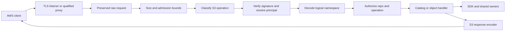

Preserve raw path, raw query and signed headers before URI decoding. Request
classification may inspect method/subresources but must not mutate the bytes
used by signing. Reject ambiguous/conflicting operation selectors and malformed
HTTP framing. Apply independent limits for headers, XML bodies, streamed payloads,
active requests and queued work; a valid signature does not remove those bounds.

A validated request carries only operation, resolved logical target, principal,
authorization context, cancellation/budget and a body-verification stream where
needed. Do not hand every handler unvalidated strings or backend credentials.
Translate domain failures once at the wire boundary; preserve source errors
internally while returning safe S3 codes, request IDs and XML. HEAD responses have
no XML body. Unsupported operations cannot fall through into another handler.

### 2.2 Identity and payload verification

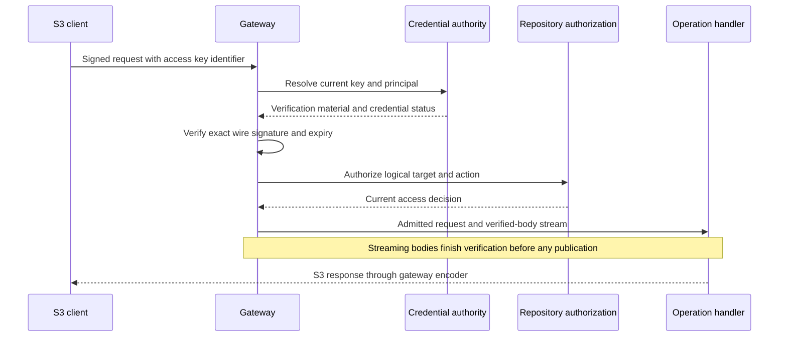

Keep incoming Crab signing keys separate from the identity used to access backend
storage. Credential lookup needs protected verification material for HMAC;
password-style one-way hashing alone cannot verify arbitrary S3 signatures.
Specify encryption/access controls, rotation overlap, revocation checks and
bounded caching at the existing credential authority. Never persist this
material in upload records, recovery tokens, telemetry or image configuration.

Implement S3 SigV2 and SigV4 as explicit algorithms, including header and
presigned-query forms. Do not reinterpret a failed SigV4 request as SigV2.
Validate credential scope, signing time/expiry, signed headers and payload mode.
Canonicalization must preserve repeated query values, percent escapes, plus
characters and exact key bytes according to each signature contract. Proxy Host
rewriting and path normalization belong in end-to-end rejection tests.

A streaming signature is not fully verified at header admission. Verify selected
chunk/trailer/checksum modes as bytes arrive and require successful termination
before acknowledging an uploaded part or publishing a file. Failures may leave
unreferenced temporary bytes, never registered parts or visible content. Unsigned
payload modes require the explicitly selected transport and integrity contract;
they must not accidentally bypass required request checksums.

### 2.3 Logical bucket catalog

| Operation | Data and visibility contract |
| --- | --- |
| ListBuckets | Enumerate permitted logical repository identities and defined owner/creation fields from the authoritative catalog; never list physical provider buckets |
| HeadBucket | Resolve one logical name and apply the selected existence/access policy; response metadata comes from gateway configuration, not arbitrary backend redirects |
| Catalog continuation | Bind filter/order/catalog traversal position and authorization context; reauthorize each page and reject malformed or tampered tokens |
| Repository placement | Resolve server-side to a stable repository identity and qualified SDK options; catalog rename or relocation cannot silently retarget a durable operation |

The phase-0 contract specifies which AWS optional catalog fields are supported.
Do not invent AWS account IDs, regions or ownership claims from the physical
bucket merely to populate optional fields. Disallow arbitrary client-selected
storage endpoints. Backend credential refresh must go through the shared owner.

### 2.4 Runtime lifecycle and implementation order

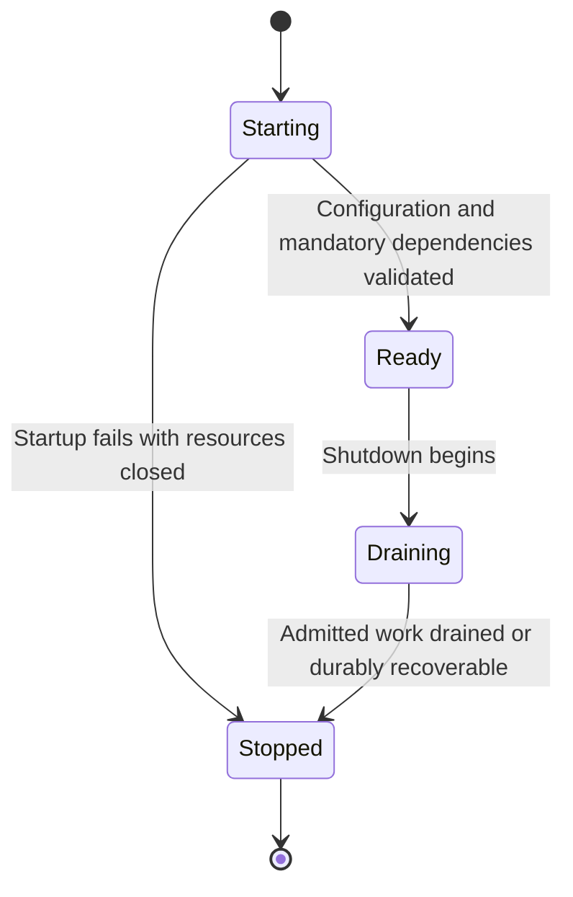

Initialize configuration, identity/catalog access, SDK runtime and listeners with
owned cleanup on every failure path. Readiness is distinct from liveness. Stop
new admission before draining active owners; client cancellation cannot detach
untracked workers. Later mutation phases extend the same shutdown path with
recovery ownership rather than spawning a second server lifecycle.

Implement in order: request/error types and raw-wire vectors -> authentication
and body verification -> authorized catalog -> actual listener/shutdown -> real
client runner. Add `tests/identity.rs`, `tests/catalog.rs` and lifecycle tests.
Register Cargo/architecture surfaces using the repository's review process;
never edit an inventory solely to suppress a failing gate.

**Acceptance criteria.** All cells below have retained evidence:

| Group | Required proof |
| --- | --- |
| Client interoperability | AWS CLI and two selected language clients execute ListBuckets/HeadBucket against the actual listener; report signing and addressing modes |
| Signature vectors | Valid SigV2/SigV4 header/query requests pass; changed method, Host, path, query, signed header or body fails; no cross-algorithm fallback |
| Streaming identity | Corrupt chunks, missing trailers, truncation and required-checksum failure prevent registration/publication; bounded consumption under slow clients |
| Authorization | Wrong/revoked/expired credentials and denied repositories follow the visibility contract without leaking placement or secrets |
| Routing and bounds | Ambiguous subresources, unsupported operations and exhausted admission never enter mutation code; error XML and HEAD framing match the contract |
| Lifecycle | Startup fault and repeated graceful shutdown close SDK owners/workers; timeouts and disconnects release request resources |
| Catalog paging | Filtering, rename between pages, zero results, token tampering and access revocation have specified outcomes without unauthorized entries |

## Phase 3 — File reads and object listings

**Context.** S3 reads expose logical file bytes and version-bound attributes.
Git tree pages are immediate entries, not recursively sorted S3 listings, and
raw Git pointer bytes are not the requested file. A pinned immutable read view
must coexist with fresh branch resolution and permission checks.

**Prerequisites.** Phase 2, phase-0 ref/key contract, SDK content reads and
phase-1 attributes for all advertised metadata cases. Add missing shared stat or
ordered traversal support where required; do not hydrate every file to implement
HEAD or LIST. Current `Snapshot::tree`/`TreeEntry` alone does not supply complete
S3 size/ETag/Last-Modified metadata.

**Implementation.** Build one snapshot/attribute resolution path used by
GetObject, HeadObject and listing. Add separate HTTP condition/range translation
and S3 listing projection without creating another hydration implementation.

### 3.1 Snapshot and read pipeline

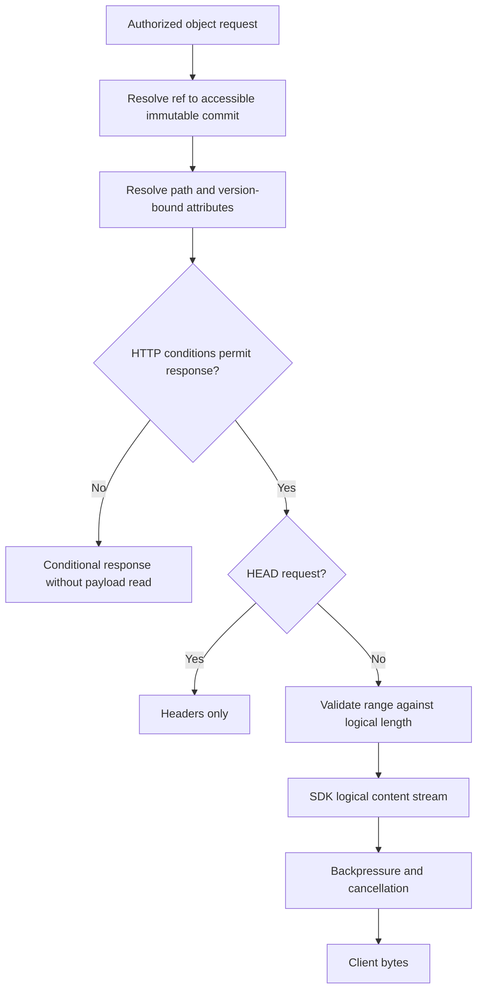

Resolve a mutable branch freshly enough to satisfy the selected post-write
contract, then pin the commit for the request. Never obtain attributes from one
commit and bytes from a newer branch tip. Immutable content caching may reuse
verified data; authorization and mutable ref resolution are not permanently
cached along with it. Missing path visibility follows the selected permission
contract, including distinctions between access denial and absence.

The implemented repository read view is keyed by both compacted generation and
the validated committed-journal digest. Concurrent refreshes and branch-tip
snapshot resolution use singleflight cells; Git trees reuse the generation-bound
remote-read cache, and attributes are cached per immutable commit. The gateway
invalidates its mutable-ref view after publication. HEAD and attributed LIST
resolve size and ETag from committed attributes without opening blob payloads.
Committed journal packs remain readable through this path before locator/catalog
publication completes.

GET uses logical content opening for Git, Crab and LFS content. Raw `read_blob`
is not a substitute. Read symlinks/submodules only according to phase 0; never
follow paths into the gateway host filesystem. Version-specific AWS parameters
remain unsupported unless full S3 versioning was selected and qualified.

### 3.2 Headers, conditions and ranges

| Concern | Required implementation rule |
| --- | --- |
| Attributes | Version-bound logical length, ETag, Last-Modified, user metadata and supported content/cache headers; no request-time modification timestamps |
| Conditions | Implement S3 precedence for combined ETag/date conditions as a tested decision table, not independent early-return checks |
| Range | Convert supported closed/open/suffix ranges with checked arithmetic against logical size; handle empty objects, clipping and unsatisfiable requests explicitly |
| HEAD | Emit contractually correct headers/status without opening a payload stream; qualify conditional and range-related HEAD differences separately |
| Response overrides | Apply only supported signed query overrides after authorization; they do not mutate stored metadata |
| Streaming failure | Before headers, return a typed S3 error; after bytes start, terminate the stream rather than append XML to object bytes |

A completed full read verifies the full integrity contract. A range read provides
the SDK's range integrity guarantees; do not claim it verified unread bytes.
Do not attach a full-object checksum to a partial response without the matching
S3 checksum/range contract. Bound stream buffers and release the stream owner on
EOF, disconnect, timeout and backend failure.

### 3.3 Listing projection and pagination

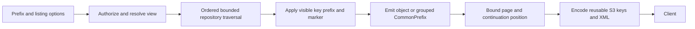

Use the full visible S3 key, including encoded ref prefix, as the ordering and
marker domain. Git tree order or naive recursive depth-first traversal is not
proof of S3 lexical order. Establish a bounded traversal/seek algorithm with
ordering tests for names such as `a-1`, directory `a/`, and `a0`; do not load and
sort the entire repository for every page.

For delimiter `/`, emit one CommonPrefix for the grouped subtree and advance
past the group. Page accounting includes emitted groups as specified by S3.
Uncommitted multipart parts never enter this object listing. Root repository
listings use the phase-0 ref namespace; do not recursively enumerate all history.
[S3 listing contract](https://docs.aws.amazon.com/AmazonS3/latest/API/API_ListObjectsV2.html)

| Cursor field | Purpose |
| --- | --- |
| Version and key ID | Defined encoding and rotation of cursor authentication keys across gateway replicas |
| Repo identity and view | Bind repository plus pinned commit; root-ref enumeration needs its own catalog view binding |
| Query | Bind prefix, delimiter, encoding and other traversal-affecting options; enforce the chosen page-size-change policy |
| Position | Last emitted key/group plus bounded traversal continuation sufficient to avoid re-emitting a group |
| Authorization and lifetime | Bind principal/context, expiry and integrity protection; reauthorize the resumed view rather than treating the token as access |

V2 tokens cannot be raw SDK cursors exposed without these bindings. They must
resume on a different node; no local iterator handle may be required. Keep pinned
views available within token lifetime through a qualified retention mechanism,
or return the documented expired/unavailable-view error. Never silently continue
against a new commit if the pinned one was reclaimed or access revoked.

V1's marker is a client-visible key and cannot carry equivalent snapshot proof.
Resolve each request according to its contract; describe mutation between pages
without claiming a global snapshot. Preserve correct NextMarker behavior with
and without delimiter. Validate URL encoding, XML escaping and UTF-8 handling
without converting distinct keys into the same identifier.

### 3.4 Implementation slices and acceptance evidence

Implement shared snapshot/stat access -> condition/range decisions -> GET/HEAD
streams -> bounded listing/seek -> V1/V2 wire cursors -> real-client evidence.
Add `tests/read.rs`, `tests/list.rs` and runner read/list suites.

**Acceptance criteria.** All groups pass against supported content kinds:

| Group | Required proof |
| --- | --- |
| Byte identity | Full reads match independently hashed originals for Git, Crab and LFS fixtures; range boundaries return the exact requested slice |
| Attributes and conditions | GET/HEAD share one version; metadata, caching, conditional combinations, empty files and response overrides match the contract |
| Payload avoidance | Instrument backend content access: HEAD/LIST and conditional no-body responses hydrate zero payload bytes |
| Sorted pages | At least 10,000 mixed keys, directory/file ordering traps, prefix boundaries and grouped pages yield reusable ordered keys without duplicates in a pinned view |
| Cursor isolation | Different repo/query/principal, corrupted/expired token, signing-key rotation and node replacement have explicit tested outcomes |
| Concurrent changes | Branch advancement, ref deletion, revoked historical access and retention expiry cannot silently retarget a V2 continuation |
| Resource lifecycle | Slow receiver, backend mid-stream error and disconnect preserve byte framing and bound buffers; stream owners close |
| Unsupported forms | Multi-range, delimiter/path/entry forms and version parameters outside the selected profile reject explicitly without invented support |

## Phase 4 — Atomic object mutations and copy

**Context.** Incoming bytes and repository visibility have different lifetimes.
PUT and COPY must publish complete content and attributes together. DELETE must
preserve history and referenced data. Multi-delete exposes per-key outcomes;
ordinary S3 retries do not carry a universal durable operation identity.

**Prerequisites.** Phases 1–3 and shared execution fencing from phase 6's
prerequisite contract. That mechanism is implemented in phase 1, not a circular
dependency on the phase-6 handler. A staged-write choice requires its qualified
shared visibility path before this phase begins.

**Implementation.** Build one mutation owner for request validation, content
preparation, durable token selection, execute/reconcile and response translation.
PUT, COPY and DELETE supply different validated edits to that owner. Keep
publication mechanics and object preconditions in SDK/shared code.

### 4.1 Mutation lifecycle

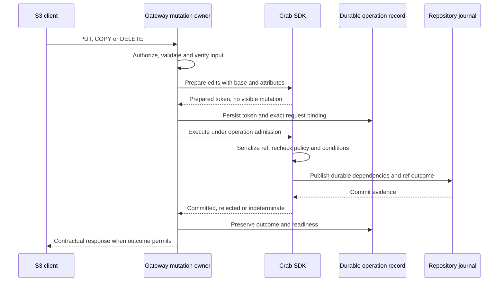

Persist server-side operation evidence before execute so restart recovery does
not depend on a live request handler. Request IDs used for diagnostics are not
client idempotency tokens. A new ordinary PUT request after a lost response may
be another valid write; do not deduplicate all equal payloads or promise one
commit across independent client retries.

A known committed result survives readiness/response failures. Unknown outcomes
stay recoverable and are never automatically re-prepared under a new token.
Shared admission must retire an old token before any replacement can execute.
Re-preparation is bounded and allowed only for a proven pre-publication conflict;
recheck object conditions on the new destination view. Never resolve contention
with a blind forced branch update or replacement of an entire stale tree.

The implemented mutation owner admits same-ref requests through a bounded FIFO
queue. It resolves only the target's ancestor trees, writes one path-local
attribute delta, prepares the pack, and uploads the pack sidecars, visibility
evidence, and attribute delta concurrently before acquiring the ref lease. Under
the lease it captures a new repository snapshot, revalidates the parent, and
either publishes the journal edit or releases and reprepares. Journal success is
the acknowledgement point; catalog compaction and commit-graph maintenance run
asynchronously because the repository read view consumes committed journal
transactions directly. The gateway coalesces that maintenance until its local
repository write burst is idle, preventing overlapping compaction waves from
advancing ahead of visibility proof publication.

### 4.2 PUT and DELETE execution rules

| Operation step | Rule and observable consequence |
| --- | --- |
| Upload admission | Authorize destination branch/path and enforce body/metadata/checksum limits before allocating unbounded work |
| Input transfer | Stream verified bytes with bounded scratch; final signature/checksum verification precedes publication |
| File construction | Reuse canonical Git/Crab content policy and builders; mode and entry replacement follow phase 0 |
| Attributes | Persist content and attributes in the same committed version; PUT does not accidentally inherit metadata from the overwritten object |
| Publication | Recheck policy, object preconditions and expected branch state under shared serialization; unrelated edits survive |
| Delete | Publish the path removal under the selected unversioned/repository-history contract; do not synchronously delete historical blobs/xorbs |
| Missing object | Return the selected S3 delete outcome without manufacturing a commit if no state changes |

Reject unsupported SSE, tagging and storage-class behavior before mutation. A
metadata-only change still follows the canonical version-bound attribute path.
Do not acknowledge success while content remains visible only in local scratch.

### 4.3 COPY source ownership and destination publication

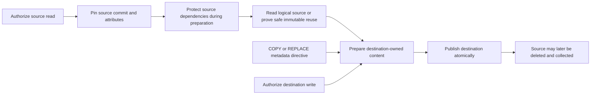

Parse copy-source encoding separately from the destination key using the pinned
wire contract. Authorize both sides and apply source conditions against the pinned
source version. A mutable source ref moving later cannot change which bytes are
copied. Retain source dependencies through preparation, not merely the source OID.

The initial generic path streams logical source content through the destination
SDK preparation. Reuse immutable content only when shared storage owners prove
destination reachability, integrity and independent retention; a pointer into a
source repository's collectible namespace is not a completed copy. Apply COPY
or REPLACE metadata semantics, self-copy restrictions and supported header
behavior from the exact operation contract. Long-copy response framing must
handle embedded errors where applicable, as completion does.
[AWS CopyObject contract](https://docs.aws.amazon.com/AmazonS3/latest/API/API_CopyObject.html)

### 4.4 Multi-delete result ownership

Validate the entire XML envelope, request integrity and request limits before
processing entries. Preserve per-entry result association, including duplicate
keys and quiet-mode behavior specified by the protocol. Authorize each target;
an authorized sibling must not grant access to another key/ref.

Use bounded canonical per-key mutations initially. Each admitted deletion owns
its durable outcome; aggregate only proven successes/errors into the XML result.
A later optimization may batch compatible authorized edits, but must preserve
the same per-key contract and map publication rejection accurately. Do not promise
cross-ref atomicity. If the response is lost after partial progress, a client
retry re-evaluates missing-key semantics; it does not reverse prior deletions.
Unknown per-key publication outcomes must not be labeled definite rejection.
[S3 multi-delete contract](https://docs.aws.amazon.com/AmazonS3/latest/API/API_DeleteObjects.html)

### 4.5 Failure and acceptance matrix

Implement the mutation owner -> verified PUT -> DELETE -> pinned COPY -> bounded
multi-delete -> crash/retry proof. Add `tests/write.rs`, `tests/copy.rs` and the
runner write suite; shared token tests stay with their SDK owner too.

**Acceptance criteria.** Retain these observations, not only HTTP statuses:

| Group | Required proof |
| --- | --- |
| Round trip | PUT/COPY attributes and bytes match independent Git/SDK reads and another gateway; DELETE removes current visibility while historical reads remain valid |
| Atomicity | Truncation, checksum/signature failure and disk exhaustion expose no partial file or mismatched attributes |
| Concurrent edits | Different keys survive concurrent writes; same-key/conditional races have outcomes consistent with serialized conditions; no blind tree overwrite |
| Policy | Revoke access/change protection between preparation and execute; no disallowed publication; copy requires both permissions |
| Copy retention | Same/cross-ref and cross-repository copies survive source deletion and scoped GC; source movement during transfer cannot mix versions |
| Multi-delete | Mixed permission, missing/duplicate keys, quiet mode, invalid envelope/checksum and partial interruption preserve correct per-key outcomes |
| Recovery | Drop journal and HTTP replies separately; restart, reconcile and preserve known commits; prove retired tokens cannot execute late |
| Performance | Bounded memory, scratch, retries and fan-out; instrument copy transfer costs and same-branch lease wait against phase-8 budgets |

## Phase 5 — Durable multipart sessions and parts

**Context.** Incoming S3 multipart parts are client-sized, replaceable and often
uploaded out of order by several connections. An acknowledged part must survive
node loss and be listable from another instance. Provider multipart transport
and local SQLite journals do not implement that incoming session contract.

**Prerequisites.** Phases 2–4 and the shared multipart record design above. Freeze
schema/namespace, quota/expiry policy and conditional storage guarantees before
accepting parts. Phase 6 consumes this state model; do not implement a competing
completion transition in this phase.

**Implementation.** Add CreateMultipartUpload, UploadPart, UploadPartCopy,
ListParts, ListMultipartUploads and AbortMultipartUpload around one shared
catalog. Implement immutable part storage, fenced registration and bounded
cleanup. Protocol upload IDs and backend transport IDs remain distinct.

### 5.1 Session and part ownership

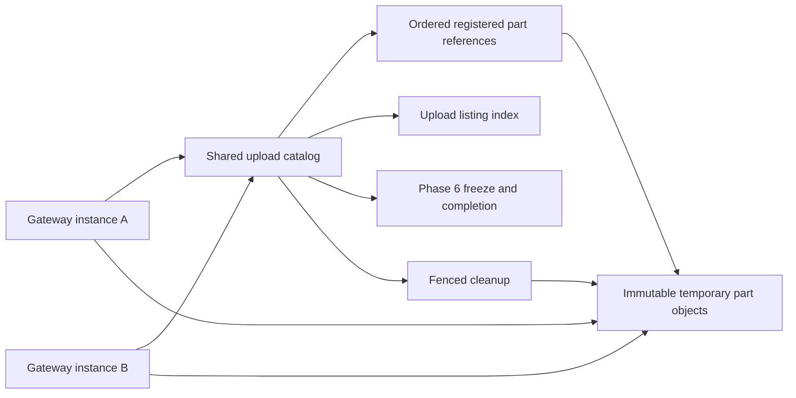

| Record | Required consistency contract |
| --- | --- |
| Upload | Unique opaque ID, repo/placement, branch/key, initiator and access policy, object attributes/checksum mode, timestamps, state/revision and quota reservation |
| Registered part | Upload ID/part number -> immutable object identity, size, ETag/checksums and revision; replacement changes the mapping, never overwrites frozen bytes |
| Active transfer | Protected immutable destination and bounded capacity ownership before bytes become collectible; recoverable expiry/fencing for crashed writers |
| Listing index | Ordered repo/upload or upload/part entries tied to authoritative record revisions; repairable without presenting nonexistent registrations as successful |
| Terminal/cleanup | Abort/completion outcome and retention/progress; separates logical removal from physical deletion |

Specify how record/index updates remain consistent on the selected shared store.
If indexes cannot update atomically with records, acknowledgments require the
chosen discoverability guarantee and readers must verify authoritative state;
repair work has bounded retries and restart evidence. Do not claim that eventual
background indexing alone guarantees immediate ListParts visibility after success.

CreateMultipartUpload validates target and metadata, reserves session capacity
and persists Open before returning its ID. It creates no repository file and
holds no branch lease for the upload's lifetime. Validate write permission again
on each subsequent request and at final publication. A lost create response may
leave an unused Open session; expiry handles it without deduplicating unrelated
requests by key.

### 5.2 Part transfer and registration sequence

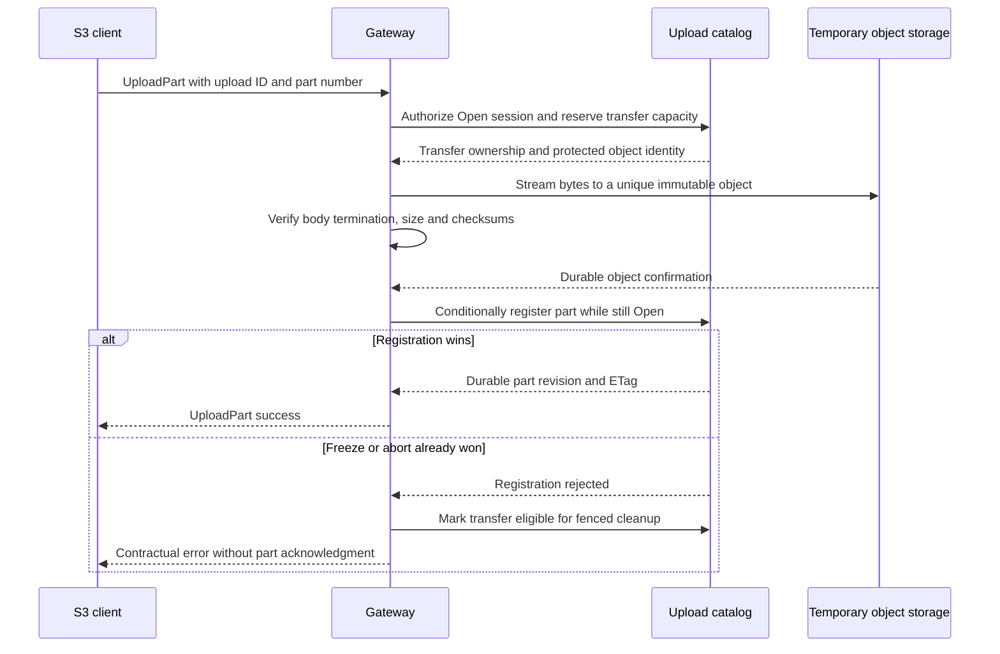

Transfer bodies without holding the short catalog mutation critical section.
Registration and freeze/abort share that section or an equivalent conditional
transaction. Persist payload before registration, and registration before the
success response. If acknowledgment of registration is lost, inspect its exact
immutable identity/revision before deciding whether it failed. A missing reply
alone is not proof that a part is absent.

A client retry of the same part number is a replacement request; use a new
immutable payload identity and atomically swap the registered mapping. Concurrent
replacements are serialized by registration, not by starting order. A response
can describe a part version that a later concurrent request has already replaced;
completion validates the currently frozen mapping. Preserve this distinction in
tests rather than promising permanent ETag stability under concurrent replacement.
[S3 UploadPart contract](https://docs.aws.amazon.com/AmazonS3/latest/API/API_UploadPart.html)

UploadPartCopy pins/authorizes the source and validates the supported source range
and conditions, then uses the same transfer/verification/registration path. Reuse
phase-4 source-retention mechanics; do not fetch from an arbitrary URL supplied
in a copy header. The part becomes durable under destination upload ownership.

### 5.3 Part lifecycle, abort and cleanup

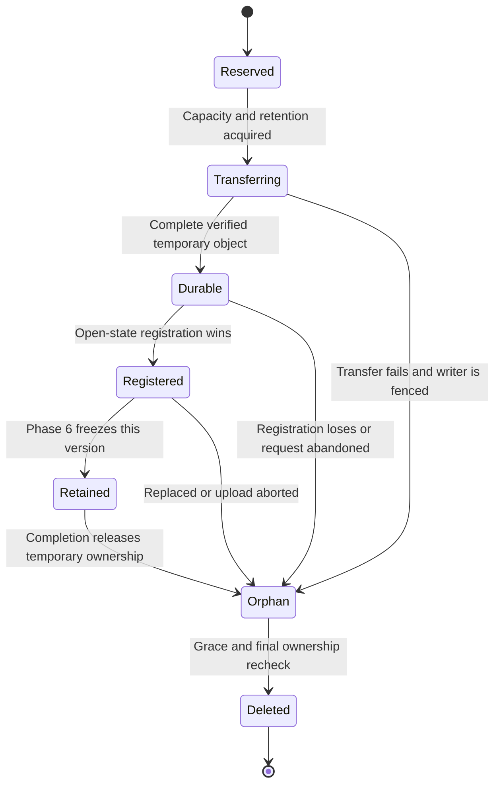

An Orphan label means eligible for evaluation, not unconditional deletion.
Account for active readers and any frozen references before reclaiming an old
part. Failed provider-native transfer sessions require their own transport
cleanup under existing shared ownership rules.

Abort conditionally changes Open to Aborted before starting deletion. Registrations
arriving afterward fail; in-flight transfers may finish physically but cannot
become registered. Fencing and transfer records allow their bytes to be reclaimed
later. Aborting Completing uses phase 6's arbitration and cannot erase a frozen
selection or execute token. Do not wait for deletion of every byte to invent a
synchronous atomic abort across workers; return the selected logical outcome and
track cleanup completion separately.

### 5.4 Listing, capacity and restart behavior

ListParts orders registered parts by protocol part number and applies its marker
and page limits. Exclude incomplete transfers and replaced versions. ListMultipartUploads
orders active sessions using the operation's key/upload-ID marker contract,
including delimiter grouping where selected. Do not reuse a V2 object-list token
for these distinct APIs or expose backend multipart listings as gateway state.

Every page reauthorizes repo/key/session access. Cross-node pages and restart
must work without local iterator state. Define behavior under concurrent
registration/replacement/abort; do not advertise a multi-page snapshot without
retention/binding sufficient to implement one. Opaque upload IDs convey no right
to list/read/delete another principal's upload.

Reserve bounded transfer capacity before reading request bytes, including active
upload count, temporary bytes, concurrent requests and local scratch. Reconcile
reservations after crash against active ownership and durable records. Unknown
content lengths need streaming enforcement; a declared Content-Length is not a
substitute for counting actual bytes. Persist expiry policy with the session or
a versioned policy binding so a configuration change cannot unexpectedly collect
active work. Progress/renewal is meaningful activity, not just a client keeping
a connection open indefinitely.

Restart recovery scans bounded pages for expired transfers, incomplete index
updates and aborted cleanup; it never republishes a file. Phase 6 owns recovery
of Completing sessions. No successful part or acknowledged session may depend
on the original node's local scratch disk.

### 5.5 Implementation slices and acceptance evidence

Implement records/conditional transitions -> create and capacity ownership ->
streamed part registration -> replacement and copy -> both listings -> abort and
cleanup -> restart/two-instance proof. Add `tests/multipart_parts.rs` and the
multipart runner subset. Test the actual provider contract for shared catalog
updates before advertising that backend.

**Acceptance criteria.** All cases below pass with real shared storage:

| Group | Required proof |
| --- | --- |
| Cross-instance durability | Create on A, upload/list on B, destroy both processes, restart C and recover every acknowledged session/registered part |
| Replacement | Out-of-order parts, repeated numbers, concurrent replacements and lost registration replies preserve one authoritative mapping and correct ETags |
| Integrity | Corrupt signatures/checksums, truncated input, excessive bytes and unsupported part numbers never produce a successful registration |
| Isolation | Wrong repo/key/principal and revoked access fail; temporary parts remain absent from GET and object listings |
| Copy | Pinned source ranges match exact independent bytes; source GC after successful registration cannot invalidate the part |
| Listing | Part-number and upload key/ID pagination, filtered/grouped pages, concurrent changes and node replacement follow the distinct API contracts |
| Abort races | Pause before transfer, durability and registration; abort or freeze on another node, then resume; late registration cannot win |
| Cleanup | Kill between object creation, verification, registration and index update; reclaim eligible orphans without deleting live/frozen parts |
| Capacity | Slow/unknown-length streams, exhausted quotas, canceled requests and crashes preserve bounded memory/scratch and recover reservations |
| Backend parity | ListParts/ListMultipartUploads and lifecycle scenarios pass on every selected backend; no AWS-only fallback implementation |

## Phase 6 — Multipart completion and recovery

**Context.** Completion joins HTTP request state, immutable temporary parts and
repository publication. Those stores do not share one transaction. Correctness
comes from ordered durable evidence and fenced execution, not from the final
HTTP response or the current branch value. This design assumes phase 0 selects
immediate commits; a staged-write choice must substitute its qualified shared
visibility boundary before implementing this phase.

**Prerequisites.** Phase 5 and SDK durable reconciliation from phase 1. The SDK
must also provide a proven execution-admission/retirement boundary: a stale
worker cannot execute a prepared token after that token has been retired. An
expiring gateway lease alone cannot provide this guarantee. Add the missing
shared mechanism in phase 1 if existing operation leases cannot enforce it.

**Implementation.** Deliver the protocol handler, completion owner, continuous
part reader, durable response binding and restart reconciler described below.
Keep storage codecs and publication mechanics in their shared owners. All types,
state fields and test targets below are design requirements, not existing APIs.

### 6.1 Boundaries and data flow

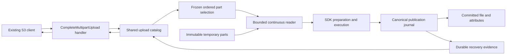

The handler verifies signatures, authorizes, bounds/parses XML and translates
outcomes to S3. The catalog arbitrates upload state. The reader verifies and
streams exactly the selected bytes. The SDK owns content preparation, ref
serialization, GC fences, publication and reconciliation. No handler writes a
ref directly. An upload ID identifies work; it is not authorization.

There are two distinct atomic decisions: freezing the upload selection in the
catalog and publishing the repository mutation in the journal. Persisted binding
between them makes a crash recoverable; it does not make them one transaction.

### 6.2 Durable completion record

| Field group | Binding and validation |
| --- | --- |
| Identity | Upload ID, stable repository identity, placement binding, branch/key, initiating principal and schema version |
| Request | Canonical semantic digest of ordered part numbers, ETags/checksums, completion conditions and requested integrity mode; equivalent XML formatting has the same digest |
| Frozen inputs | Ordered immutable part identities, sizes and recorded integrity values, plus initiation-time object attributes; computed total size with checked arithmetic |
| Ownership | Catalog revision, worker generation/lease and durable state; expired ownership permits takeover, not replay |
| Preparation | One selected prepared SDK token and exact request/content binding, persisted before execute; scratch paths and credentials are not portable recovery evidence |
| Outcome | Committed receipt or proven rejection; readiness tracked separately; original ETag/checksum and response fields; cleanup/retention state |

Use separate domains for the client request digest and the SDK mutation digest.
The latter includes the actual prepared commit, expected old OID and placement.
A retry must match the former and recover the selected latter. Never derive a
new operation nonce merely because a request reached a different gateway node.
A stored token must reference durable artifacts or permit safe reconstruction
from frozen inputs; it cannot depend on the previous node's spool directory.

Same-request completion may resume or return its retained committed result after
reauthorization. A different request against a frozen/completed upload cannot
replace its selection or create another mutation. Exact error codes and terminal
retention behavior belong in the phase-0 compatibility contract. Replaying a
retained successful response is a Crab contract to qualify with clients, not a
claim that AWS retains completed uploads indefinitely.

### 6.3 State machine and irrevocable boundaries

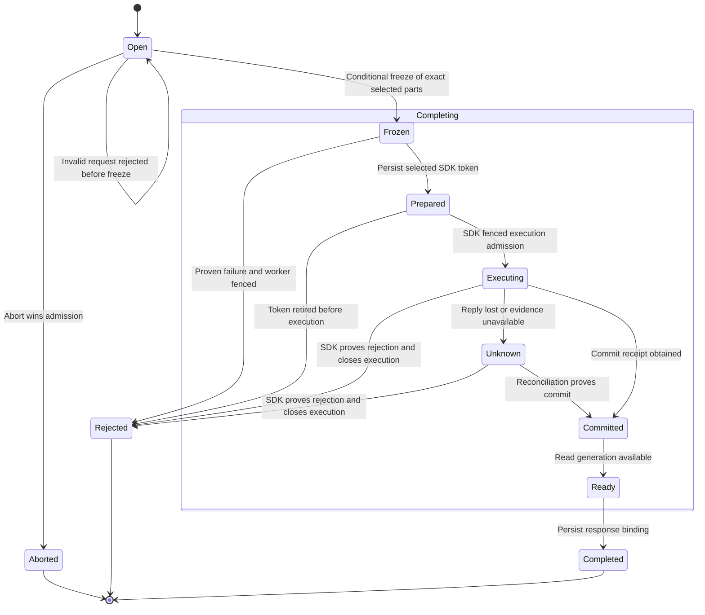

Completing is the durable parent state; its substates record progress. Committed
is irreversible even while readiness is pending. Rejected is terminal for that
frozen completion; a corrected upload starts a new session. This deliberately
avoids reopening a prepared upload underneath a stale executor. Before freeze,
malformed or invalid requests leave Open unchanged. Do not infer rejection from
an absent receipt, an expired lease or a branch that now points elsewhere.

Abort can transition Open to Aborted. If freeze already won, abort cannot delete
its inputs or invent a rejected outcome: resolve through the completion owner
and the documented conflict/terminal response. A stale abort worker cannot
remove the GC roots of a Completing upload.

### 6.4 Ordered completion algorithm

1. **Validate admission.** Verify signature and current repo/ref/path permission;
   validate upload binding, bounded XML, supported fields and checksum mode.
   Reject malformed/duplicate/out-of-order part entries according to the S3
   contract. Validate required consecutiveness for the selected checksum mode;
   do not universally require it for every legacy part-list mode.
2. **Freeze inputs.** Read the registered immutable identities and compare every
   submitted ETag/checksum. Validate part sizes, object limits and total length.
   Acquire the short upload-state critical section; recheck the state/revision
   and selected identities, then atomically publish their frozen selection and
   retention roots. Release this section before reading large bodies.
3. **Claim preparation.** Acquire renewable completion ownership. Read selected
   parts with bounded prefetch, verify their recorded sizes/digests and stream
   them as one file into SDK preparation. A preparation failure cannot publish.
   If ownership is lost, cancel/drain the worker and prevent its catalog update.
4. **Persist the token.** Conditionally record the single selected prepared token
   and its content/request binding under the current generation. A worker whose
   token loses this selection may clean its unreferenced preparation only; it
   must never call execute. Persist before attempting any publication.
5. **Execute once through the shared boundary.** Enter SDK operation admission
   with the selected token, revalidate its execution eligibility and authorization,
   then let the SDK acquire/refine ref and GC ownership in canonical order.
   Recheck destination preconditions and expected state at publication. Do not
   hold the short catalog critical section while waiting for SDK/ref locks.
6. **Resolve the outcome.** Persist a known commit binding immediately, track
   readiness separately and make/reopen the read generation through the shared
   writer path. For an unknown result, retain inputs/token and reconcile. For
   proven rejection, close execution eligibility before terminalizing the upload.
7. **Finish the response.** Persist the stable response fields, then emit success
   XML only when the committed/read-visible contract holds. Cleanup and response
   transport errors cannot reverse the persisted outcome. Reclaim temporary data
   only after durable destination ownership and retention checks are satisfied.

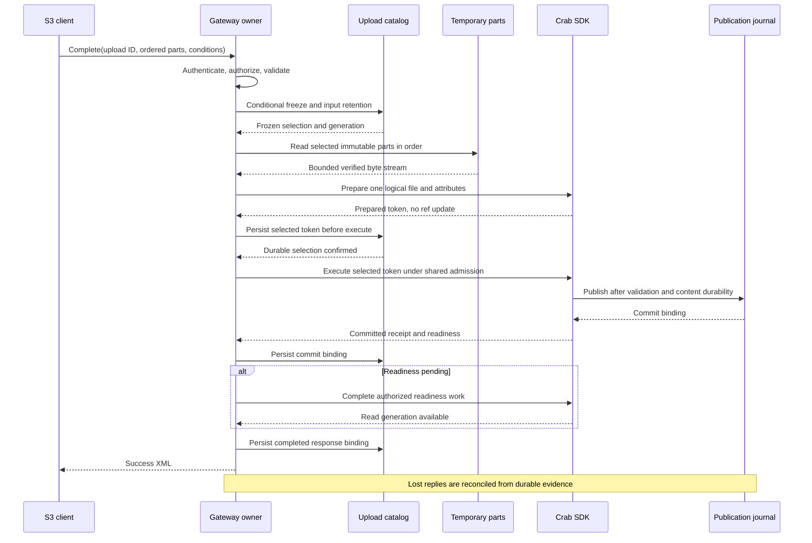

Once selected, a prepared token is not silently replaced following a ref conflict.
The initial implementation terminalizes a proven rejected completion and returns
the documented error; a new upload may be required. Any later bounded
re-preparation design must prove retirement of the old token before installing a
new one. Otherwise an old and new executor could both publish.

### 6.5 Streaming and integrity

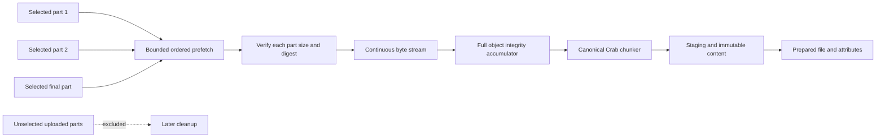

Chunker state survives part boundaries. Ordering is by the accepted selection,
not storage listing order or completion time. Prefetch must bound both active
requests and buffered bytes; a slow first part cannot allow later parts to buffer
the whole object. Full-object integrity is checked before publication. An EOF,
size mismatch, corrupt part or failed checksum produces no visible partial file.

S3 ETags, S3 full/composite checksums, Crab content hashes and Git OIDs are separate
contracts. Compute/persist each required value with its specified algorithm and
encoding; never return a Git OID as an assumed S3 checksum. Composite checksums
are not generally the checksum of concatenated bytes. Supported algorithm/mode
combinations and part-number rules must follow the pinned
[AWS integrity contract](https://docs.aws.amazon.com/AmazonS3/latest/userguide/checking-object-integrity-upload.html).

### 6.6 Concurrency, fencing and garbage collection

| Race | Required arbitration and losing behavior |
| --- | --- |
| Part replacement versus freeze | One conditional registration/freeze boundary chooses the immutable version; late registration fails and leaves only a reclaimable orphan |
| Two equal completion requests | One token is selected; another worker joins/reconciles or waits within its budget; it does not create a second SDK operation |
| Two different completion requests | First successful freeze binds the selection; the other returns the contract's conflict/error |
| Completion versus abort | Open-state admission chooses the winner; abort cannot delete a frozen selection |
| Expired worker versus takeover | Generation checks fence catalog writes; SDK operation admission fences execution; expiry alone is not proof the old process stopped |
| Rejection/retirement versus execute | Token eligibility is checked/closed under the same shared operation admission boundary; a delayed executor cannot enter after retirement |
| GC versus freeze/registration | Shared roots plus fencing protect the winning selection; collectors revalidate before deletion |
| Cleanup versus committed response loss | Durable commit/response records survive cleanup; temporary bytes are not the only recovery proof |

Keep the short upload-state critical section separate from long preparation and
publication ownership. Freeze, part registration and Open-state abort never wait
for a branch lease while holding that critical section. Execution admission
rechecks token eligibility while holding the SDK operation lease; retirement
uses the same order. The SDK then owns sorted ref leases, GC fences and namespace
publication. Document and test this lock order across all actual call paths.

A terminal status update is not by itself permission to delete data. For Completed,
prove destination content/metadata dependencies are durable and rooted, and no
preparation worker still needs the temporary objects. For Aborted/Rejected, fence
late writers/executors and observe the cleanup grace/recheck rules. Unknown and
Committed-with-pending-readiness retain recovery roots. Limit cleanup to the
upload's objects; source-copy content may still have other owners.

### 6.7 Crash recovery decision table

| Last durable evidence | Recovery action | Forbidden shortcut |
| --- | --- | --- |
| Open; validation never froze | Accept a fresh valid completion or abort | Assume an earlier HTTP request published |
| Frozen; no selected token | Take fenced ownership and re-prepare exact frozen inputs | Accept a changed manifest |
| Prepared token; execute status unknown | Enter shared operation admission and reconcile attempt evidence; execute only if proven eligible and unattempted | Treat missing terminal receipt as permission to execute |
| Journal outcome unavailable | Retain Completing and retry bounded read-only reconciliation | Reopen the session, swap token or delete inputs |
| Commit proven; catalog response missing | Persist original commit binding, finish readiness and reconstruct its response | Publish another commit because catalog is stale |
| Commit proven; branch subsequently advanced | Recover the original receipt; current reads may show the later write | Require current ref equality as proof of completion |
| Proven rejection; token retired | Persist Rejected and reclaim eligible artifacts | Permit a stale token to publish later |
| Completed response retained | Reauthorize and return the bound outcome for a matching retry | Derive response metadata from today's branch tip |
| Terminal retention expired | Apply documented expired-upload behavior | Recreate an old upload ID as new work |

### 6.8 HTTP response and cancellation contract

Choose response framing before writing headers. Early validation errors use the
normal S3 error status/body. For a long accepted completion, the handler may send
S3's initial 200 header and whitespace while work continues; once headers are
sent, a later error is encoded in the terminal XML body. The selected framing and
proxy timeouts must be tested with AWS clients; HTTP 200 alone is not completion
proof. [AWS completion response contract](https://docs.aws.amazon.com/AmazonS3/latest/API/API_CompleteMultipartUpload.html)

Do not send success XML while readiness is pending. If the connection or budget
ends, retain the committed/unknown distinction and the resumable work; a retry
resolves that same upload. A retryable wire error does not assert that the
repository mutation was rejected. Persist errors internally without leaking
storage credentials or provider response bodies.

Client disconnect stops response writing, not durable recovery obligations.
Cancellation during preparation may leave frozen resumable inputs. After execute
admission, drain or record the SDK outcome under its cancellation contract. Stop
heartbeats only after workers have released ownership or been safely fenced.
Graceful shutdown, hard process termination and lost network responses each need
a separate test: they exercise different paths.

### 6.9 Implementation slices and acceptance evidence

Implement in order: completion record/transitions -> frozen reader/integrity ->
prepared-token binding and execution fencing -> outcome/readiness/response ->
reconciler/cleanup -> process-kill and real-client qualification. Add
`tests/multipart_complete.rs`; keep shared token-retirement tests with the SDK
owner as well as exercising them through the gateway. Extend the existing
planned multipart/recovery runner suites rather than creating a second runner.

**Acceptance criteria.** Every row below passes at the same source commit, with
exact client/backend versions and retained reports:

| Evidence group | Required cases and observable proof |
| --- | --- |
| Selection and validation | Selected subset, omitted uploaded parts, invalid/duplicate order, missing parts, wrong ETag, mode-specific numbering, size overflow and limit violations; failures produce no file |
| Byte/integrity equivalence | Empty/minimum-boundary cases where permitted; varied part boundaries including inside a Crab chunk; identical reconstruction and canonical ingestion hashes; corrupt/truncated parts reject before publication |
| Conditional publication | Changed object ETag, branch advancement and revoked permission/protection between freeze and execution; unrelated committed files remain intact |
| Concurrent requests | Equal/different completion manifests, replacement/freeze and abort/complete races; at most one journal commit attributable to the frozen upload |
| Stale executor | Pause a worker before execute, retire or transfer ownership, then resume it; prove no execution after retirement and no second commit on takeover |
| Crash matrix | Hard-kill after freeze, preparation, token persistence, execution admission, journal write, commit-record persistence, readiness and response persistence; recover on another node |
| Ambiguous responses | Drop publication reply and HTTP success reply independently; advance the branch before retry; recover the original outcome without another mutation |
| Read visibility | After success, GET/HEAD/LIST through another gateway plus independent Git/SDK reads show the committed version or a valid later concurrent version; historical read proves the original bytes |
| Retention and GC | Run compaction and scoped GC during Frozen/Prepared/Unknown/Committed states; all required bytes/proof survive; eligible orphans are later reclaimed |
| HTTP and cancellation | Early S3 errors, late embedded XML errors, whitespace keepalive, disconnect, deadline, graceful stop and forced stop through the actual proxy/TLS path |
| Resources | Single and concurrent large completions satisfy phase-8 RSS/scratch budgets; report temporary write/read bytes, part-fetch requests, checksum/chunking time, preparation time, lease wait and publication/readiness latency |

A counted commit means journal/receipt evidence bound to this upload's selected
operation, not counting all branch history entries. Tests must verify both that
one successful completion remains recoverable and that invalid or rejected work
never publishes. Phase 6 stays incomplete if execution retirement, durable token
portability, metadata binding or any process-kill cell lacks proof.

## Phase 7 — Repository operations and URI consumers

**Context.** S3 covers object operations; branch/tag/history operations need an
explicit repository surface. A `crabfs` URI parser alone does not integrate a
filesystem framework or create a FUSE filesystem.

**Prerequisites.** Phase-0 repository action contract and phases 1–6.

**Implementation.** Expose the selected authenticated repository endpoints using
SDK refs/history/diff and expected-OID ref updates. Implement one canonical URI
parser/formatter shared by actual consumers. Add `tests/repository.rs` and
client examples translating crabfs addresses to S3 Bucket/Key. If a specific
filesystem library integration is selected, implement that adapter and its
native filesystem contract in this phase; do not invent an unsolicited language
package. Keep branch/tag protection and immutable snapshot reads consistent with
Git HTTP and CLI. Explicit commits/merges require their separately qualified
shared APIs if selected in phase 0.

**Acceptance criteria.** Create a branch through the repository API, upload using
an unchanged S3 client's methods, read both branches and an earlier commit,
inspect history/diff, and perform a guarded ref update/delete. Stale OIDs and
protected updates reject without mutation. Branch/tag ambiguity and encoded
slash refs round-trip through real clients and copy headers. Git observes the
same refs and content. Documentation distinguishes working S3 calls, repository
extension calls and any selected filesystem integration; unsupported merge or
S3-version APIs are not presented as shipped features.

## Phase 8 — Fault, compatibility and performance qualification

**Context.** Local tests cannot establish cross-provider conditional semantics,
multi-process recovery or sustained performance. All prior phases are candidates
until the supported matrix has end-to-end evidence.

**Prerequisites.** Phases 0–7; selected optional versioning/overlay extensions must
also be complete if they belong to the release scope.

**Implementation.** Add CI and dedicated live-backend suites with fault injection,
client-default checksums/streaming, process termination and repository-scoped GC.
Use AWS CLI, Boto3 and one additional chosen language SDK at pinned versions;
legacy SigV2 gets separate protocol-vector/compatible-client evidence. Qualify
S3/RustFS, GCS and Azure only where selected and actually tested. Define server
OS/architecture separately from client OS support. Exercise reverse proxy/TLS
path preservation and virtual hosting if advertised.

Implement five cold and five warm trials against a frozen direct-SDK baseline
on the same runner/backend/fixtures. Proposed release budgets, to freeze before
measurement: 1 GiB GET peak server RSS <= 512 MiB; a single 1 GiB multipart
completion <= 512 MiB; median large-read time <= 110% of direct SDK time.
Track backend bytes/requests separately; multipart's staging write and read-back
are expected costs, not hidden in the baseline. Phase 0 freezes the runner size,
network placement and these proposed additional workload budgets before testing:

| Workload | Proposed acceptance budget |
| --- | --- |
| 4 KiB PUT, 16 writers, one branch, 5 minutes | At least 90% of equivalent direct-SDK committed-write throughput; p95 <= 125% of that baseline; zero lost acknowledged writes |
| 10,000-key listing, 1,000-key pages | Full traversal time <= 125% of equivalent SDK traversal; zero payload bytes hydrated |
| Four simultaneous 1 GiB multipart completions | Peak total server RSS <= 2 GiB; total local scratch <= 8 GiB; admitted work stays within both bounds |
| Upload part registration | Control metadata does not scale with part byte length; measure 8 MiB and 64 MiB parts with the same upload/part count |
| Terminal upload cleanup | Eligible synthetic orphan parts reclaimed within two completed cleanup scans; zero live/frozen part deletions |

Also report absolute p50/p95 latency and throughput; relative gates do not make
an arbitrarily slow SDK acceptable. The SDK must independently pass its own
performance gates. Missing baselines or resource measurements cannot pass by
reporting numbers without the corresponding comparison.

**Acceptance criteria.** Every operation/header cell passes its selected client
and backend matrix with retained source/fixture/version evidence. Timeout,
skipped and missing cells fail advertised support. Large listings include at
least 10,000 files and mixed prefixes; mutations include sustained same-branch
contention and independent branches. Verify memory/spool bounds under concurrent
uploads, cancellation cleanup, denied cross-repo/path access, restart, lost
replies, compaction and GC during active/completing uploads. GC removes known
orphans while retaining historical/copied/current data and recovery records.
Five-trial performance reports pass frozen budgets; failures require an
implementation fix or an explicit contract decision, never a silent threshold
edit. CI and affected sibling gates pass at the exact candidate commit.

## Phase 9 — Docker, EKS, ECS deployment and operations

**Context.** A qualified gateway needs reproducible installation and safe daily
operation. Upload sessions, completion receipts and repository state must survive
replacement of a container, Kubernetes pod or ECS task. Deployment instructions
are part of the product, not a follow-up to packaging.

**Prerequisites.** Phase 8 and all selected scope gates. Freeze supported image
architectures, cluster/platform versions and deployment tool versions. Qualify
backend credential discovery and automatic refresh through Crab's actual storage
adapter before claiming EKS Pod Identity or ECS task-role support; a platform
providing credentials is not proof the current SDK consumes them. Complete this
shared credential capability first if it is missing. Production infrastructure
and release actions require user authorization; writing and validating the
assets in an isolated test environment is part of this phase.

**Implementation.** Deliver the following assets and runbooks. The paths below
are planned outputs, not files or deployable commands that already exist.

### 9.1 Image and shared deployment contract

Create `crates/crab-s3-gateway/deploy/` with:

- `Dockerfile`, `compose.yaml`, `gateway.example.toml` and `README.md` for the
  standalone image, local smoke environment and common configuration.
- `helm/crab-s3-gateway/` with a chart, values schema and tested EKS values.
  Use this as the canonical Kubernetes deployment; avoid a second independently
  maintained set of raw manifests.
- `ecs/` with one reproducible infrastructure template and parameter examples
  for ECR, IAM, task definition, service, load balancer, logs and secrets
  references. Use CloudFormation for the initial template; parameters select
  an existing VPC/subnets and repository storage rather than silently creating
  a second data store.
- `operations.md` covering monitoring, scaling, rotation, cleanup, incident
  response, backup/restore and upgrade/rollback for all three environments.

Build a locked, multi-stage image with the executable as PID 1, non-root user,
read-only root filesystem, explicit writable scratch/cache directories and
SIGTERM handling. Publish only architectures proven in phase 8. Record source
SHA, image digest, dependency inventory and scan results; deployment references
an immutable digest, not `latest`. Verify image contents and runtime behavior
in CI using the existing HTTP server image workflow as a repository precedent.

Keep the repository catalog, credential authority, upload/part catalog and
completion proof in the selected durable shared services. Local disks hold only
bounded scratch and disposable caches; no acknowledged upload may depend on a
part or record existing only on one node. Document mounts, ownership, capacity
limits and recovery behavior. No shared writable SQLite journal across replicas.

Define separate liveness, readiness and startup checks. Liveness measures process
health; transient backend failure must not trigger an endless restart cycle.
Readiness gates admission when initialization/recovery or mandatory dependencies
prevent safe service. Expose probes/metrics on an internal management listener;
S3 requests retain their original signed Host, path, query and headers. Choose
and test one TLS/load-balancer mode per deployment, including large streamed
bodies, idle timeouts and S3 completion framing. Do not promise arbitrary proxy
configurations will preserve signing.

### 9.2 Docker and Docker Compose procedure

1. Build the image from the repository root using the gateway Dockerfile and
   record the digest. Render the example configuration with an isolated logical
   repository, backend placement, durable upload catalog and credential source.
2. Create bounded writable scratch/cache mounts with the image user's ownership;
   mount configuration read-only and inject secrets through protected files or
   the selected secret provider. Never bake them into the image or examples.
3. Run the Compose smoke stack with the gateway and an isolated test backend.
   Provide explicit `docker build`, `docker compose config`, startup, log,
   health-check and shutdown commands with paths verified by CI. The backend's
   test credentials must be clearly synthetic and not production defaults.
4. Point an unchanged AWS CLI/client at the configured HTTPS endpoint. Execute
   signed bucket discovery, PUT/GET and multipart upload/completion; verify
   bytes and repository history independently.
5. Replace the gateway container during an upload, resume from its shared state,
   then test graceful stop and restart. Document single-host availability limits.
6. Provide teardown commands that remove only the isolated smoke resources.
   Production stop/upgrade instructions preserve backing repository and upload
   state; volume deletion must never be the default shutdown procedure.

### 9.3 Amazon EKS procedure

Initial qualified profile: Linux EC2 worker nodes, at least two gateway replicas
spread across failure domains, a digest-pinned image in ECR, and a shared durable
catalog/backend. Other EKS compute profiles require separate evidence.

1. Verify the cluster, node architecture, network egress/private endpoints,
   selected load-balancer controller and certificate/DNS prerequisites. Push
   the verified image to ECR and capture its digest.
2. Create a namespace, Kubernetes service account and least-privilege backend
   IAM role. Configure the EKS Pod Identity Agent/association for that service
   account; test actual backend access and credential renewal through Crab.
   [AWS Pod Identity setup](https://docs.aws.amazon.com/eks/latest/userguide/pod-identities.html)
3. Configure repository mappings, shared upload state and the gateway credential
   authority. Keep incoming Crab access keys separate from backend IAM identity;
   supply secret references through the selected, documented integration.
4. Render and validate the Helm chart, then install it with the qualified values.
   The chart includes resource requests/limits, bounded ephemeral storage,
   startup/readiness/liveness probes, service account, service, selected ingress
   or load balancer, topology spreading and a disruption budget. Define rolling
   update settings, termination grace and request draining together.
5. Wait for rollout/readiness, configure DNS/TLS, and run the signed compatibility
   and multipart smoke through the external endpoint, including encoded ref
   paths and presigned URLs. Internal pod probes alone do not qualify ingress.
6. Delete a pod during part upload and completion; resume through another replica.
   Perform a rolling image upgrade with active traffic, exercise safe scale-in,
   and verify no acknowledged part or committed file disappears.
7. Document chart upgrade and rollback commands, the schema-compatibility check
   before either action, and uninstall behavior. Uninstall preserves external
   repository/catalog data and does not run repository or bucket-wide GC.

The runbook must include tested `helm lint`, render, install/upgrade, rollout,
logs/events and rollback commands with named inputs, not console-only steps.
EKS Pod Identity's supported compute and SDK requirements are checked against
this profile; do not imply the same configuration works on EKS Fargate.

### 9.4 Amazon ECS procedure

Initial qualified profile: Linux ECS Fargate service with at least two tasks
across selected subnets, digest-pinned ECR image, shared durable state and an
explicit load-balancer/TLS configuration.

1. Verify VPC/subnet routing, security groups, certificate/DNS, ECR connectivity
   and backend/catalog access. Size task CPU, memory and ephemeral storage from
   phase-8 measurements, including simultaneous uploads and completion scratch.
2. Create the application task role for repository/backend access and a separate
   execution role for image pull, logging and configured secret injection.
   Test backend credential discovery and refresh in the running task.
   [Task role](https://docs.aws.amazon.com/AmazonECS/latest/developerguide/task-iam-roles.html),
   [execution role](https://docs.aws.amazon.com/AmazonECS/latest/developerguide/task_execution_IAM_role.html)
3. Render/validate the CloudFormation template and deploy the isolated test
   stack with explicit inputs. Register a task definition using the image
   digest, non-root user, read-only root, writable scratch, container health
   check, logging, secret references and a qualified stop timeout.
4. Create/update the service and target group. Configure readiness/health checks,
   deployment capacity, connection draining, rollback detection and TLS/DNS.
   Reconcile target deregistration and container stop deadlines with gateway
   recovery; Fargate scratch is disposable and must not hold sole durable state.
5. Wait for service stability and run the same signed external-endpoint smoke
   used for Docker/EKS. Stop a task during an upload and completion, then recover
   through a replacement task without affinity to the original process.
6. Deploy a new task revision with active transfers and test rollback to a
   schema-compatible revision. Verify scale-out/in, credential rotation and
   resource-exhaustion alarms. Deployment success requires application evidence,
   not just a healthy task count.
7. Supply tested template validation/deploy, service inspection, log retrieval,
   update/rollback and isolated-stack teardown commands. Retain production data
   stores and recovery records when deleting compute resources.

Use the ECS rolling deployment contract when setting healthy capacity and
rollback behavior; validate the selected settings under active transfers.
[AWS ECS deployment behavior](https://docs.aws.amazon.com/AmazonECS/latest/developerguide/deployment-type-ecs.html)

### 9.5 Operations and incident runbooks

Specify each routine as trigger -> diagnostic commands -> safe action -> proof
of recovery, with environment-specific command examples:

- Monitor request rate/latency/errors, admission queues, backend failures,
  credential refresh failures, active upload bytes, oldest Completing session,
  reconciliation failures, cleanup backlog, RSS and scratch pressure. Use bounded
  metric labels; never put keys, upload IDs or credentials into metric labels.
  Set alert thresholds from phase-8 budgets and test delivery to the selected
  monitoring system. Logs may carry safe correlation IDs for diagnosis.
- Scale from measured saturation and admission pressure. Bound concurrency per
  instance and globally where required. Scaling a pod/task must not invalidate
  sessions; sticky sessions cannot substitute for shared durable state.
- Rotate/revoke client credentials separately from backend IAM credentials.
  State whether secret/config changes reload or require rollout. Reauthorize
  resumed operations and validate service-account/task-role renewal without
  embedding temporary credentials in persisted recovery records.
- Handle stalled Completing sessions by receipt reconciliation, not deleting
  state or retrying publication blindly. Define bounded operator commands and
  their authorization; preserve evidence when an outcome remains unknown.
- Recover from backend outage, exhausted scratch, node/task loss and expired
  credentials. Stop unsafe admission while retaining the information needed to
  reconcile already-admitted work. Never turn known commits into rejections.
- Run bounded expired-upload cleanup and repository-scoped GC with the phase-6
  fencing/retention rules. Test alerts for cleanup lag and never use bucket-wide
  GC. Document terminal-record retention and effects on retry/recovery windows.
- Back up and restore the repository plus required catalogs, object attributes,
  upload records and receipts consistently. Specify RPO/RTO from the selected
  storage topology, credential-authority recovery and a disaster-recovery drill.
  Restoring metadata without its referenced objects is not successful recovery.
- Upgrade/rollback with schema compatibility preflight, mixed-version behavior,
  canary checks and image digest recording. Stop incompatible rollback before
  data mutation. Document maintenance ownership so two replicas do not perform
  conflicting migrations or cleanup.

### 9.6 Acceptance criteria and evidence

**Acceptance criteria.** All three profiles have checked-in assets and commands
executed from a clean checkout against the packaged image. CI validates image,
Compose, Helm and CloudFormation artifacts; dedicated AWS qualification records
EKS/ECS deployment results with exact image digest, template/chart revision,
platform versions and sanitized configuration. Static template validation alone
cannot mark a cloud deployment supported.

Extend the qualification runner with `--suite deployment` and a required
`--deployment-profile docker|eks|ecs`; attach platform rollout/replacement
evidence to its report. The suite does not create or delete production resources.

For Docker, EKS and ECS independently, retain evidence of signed discovery,
PUT/GET, multipart create/upload/list/complete/read, independent byte/history
verification, process replacement, active-transfer rolling upgrade, compatible
rollback, credential rotation/revocation and safe teardown. Multi-replica profiles
prove recovery on a different replica and read visibility after successful
completion. Test both graceful shutdown and forced termination; configured
platform deadlines must either allow draining or leave durable recovery state.

Exercise actual TLS/load-balancer paths with SigV2/SigV4, presigned requests,
encoded refs/keys and large streaming bodies. Prove secrets are absent from
images/logs/reports, resource limits hold, monitoring detects an injected failure,
and a backup/restore drill meets the declared RPO/RTO without missing data.
Rejected requests must not mutate state; cleanup must not remove live parts.
README and operations examples run successfully, all advertised compatibility
cells link to exact evidence, and operational limits are documented. No EKS/ECS
cell passes as skipped because credentials or a cluster were unavailable.

Package publication, production deployment and merging remain separate user-
authorized actions. This phase delivers tested deployment assets and operational
proof; the plan itself does not create production infrastructure.

## Phase handoff checklist

For each phase, report changed files, caller/owner/callee and sibling invariant
coverage; exact tests and E2E command/report paths; source SHA; current behavior
versus the chosen contract; resource measurements where relevant; remaining
blocked criteria and the next phase's prerequisites. Keep this plan and the
compatibility contract synchronized with implementation. No phase closes solely
because its code exists, and no later phase waives an earlier missing proof.

## Contract sources

- [S3 operation inventory](https://docs.aws.amazon.com/AmazonS3/latest/API/API_Operations_Amazon_Simple_Storage_Service.html)
- [S3 object keys](https://docs.aws.amazon.com/AmazonS3/latest/userguide/object-keys.html)
- [S3 SigV2](https://docs.aws.amazon.com/AmazonS3/latest/developerguide/RESTAuthentication.html)
- [S3 SigV4](https://docs.aws.amazon.com/AmazonS3/latest/developerguide/sig-v4-header-based-auth.html)
- [GET conditions and ranges](https://docs.aws.amazon.com/AmazonS3/latest/API/API_GetObject.html)
- [PUT metadata and preconditions](https://docs.aws.amazon.com/AmazonS3/latest/API/API_PutObject.html)
- [Multi-delete results](https://docs.aws.amazon.com/AmazonS3/latest/API/API_DeleteObjects.html)
- [Multipart completion and embedded errors](https://docs.aws.amazon.com/AmazonS3/latest/API/API_CompleteMultipartUpload.html)
