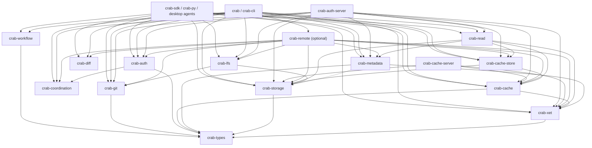

# Multi-Crate Transition Plan

This plan splits the current `crab` crate into deep Rust Modules with small
Interfaces and one clear Implementation owner per domain. The transition should
move ownership gradually while keeping existing user commands stable.

> Status: `crab-sdk` and `crab-py` are retired workspace packages. References to
> them below are retained as historical audit entries; current product paths use
> the Crab CLI or shared domain crates.

## Plan Of Record

This section is the authoritative version of the split. Later sections keep
the audit trail and detailed phase notes, but future work should use this
section as the review checklist.

### Hard Decisions

- Do not create `crab-error`. The correct foundation Module is `crab-types`.
  It owns stable, non-secret shared contracts only: IDs, wire DTOs, pointer and
  storage identity, timestamp helpers, small shared categories, and workflow
  identities such as `StageHash`. Rich domain errors stay with the owner crate:
  `AuthError`, `AuthServerError`, `CacheError`, `CacheServiceError`,
  `StorageError`, `MetadataError`, `ReadError`, `XetError`, and CLI
  `CrabError` at command/output Adapters. Every new public `crab-types` item
  must update `crates/crab-types/ADMISSION.md` with its contract kind and why
  it cannot stay in the owning domain crate.
- Do not create `crab-xorb`. The correct data-plane Module is `crab-xet`
  because xorbs, shards, Merkle hashes, reconstruction terms, compression
  compatibility, and CDC chunking are coupled through upstream Xet contracts.
  This is a crate-name decision only. Shipped `xorb` vocabulary in object
  paths, URL schemes, lifecycle rule IDs, structs, and protocol strings stays
  stable unless a separate migration is designed.
- `crab-auth` is client/shared auth, not the auth server. Its base Interface
  owns provider identity, token-cache identity, static credential resolution,
  Crab Auth credential-response extraction, ordinary `/v1/credentials`
  response-envelope parsing and `storage_scope` validation, signing/
  verification, protected-push shared wire DTO validation, and the
  `CredentialProvider` / provider client config DTO domain contracts needed by
  CLI, SDK, Python, and desktop. Optional client features may own the HTTP/OIDC
  credential-provider Implementations, retry windows, token refresh, and
  cached credential reuse, because those are client auth behavior. It must not
  own auth-server binaries, receive/view orchestration, server persistence,
  protected-view materialization, coordinator construction, route handlers, CLI
  config parsing, or server output/error policy. Those belong in
  `crab-auth-server` or caller Adapters.
- Name precision matters here: the current Rust `crab-auth-server` package is
  the server-side receive/view helper package that ships
  `crab-auth-receive` and `crab-auth-view`. The actual Crab Auth HTTP
  endpoint remains the Python FastAPI deployment under `crab/deploy/auth-service`,
  which owns JWT verification, rate limiting, policy evaluation, provider
  credential vending, endpoint routing, and the subprocess protocol to the
  Rust helpers. Do not move that endpoint behavior into `crab-auth`. A future
  Rust auth endpoint is valid only as a deliberate server-port slice that
  replaces or fully mirrors the `crab/deploy/auth-service` contract with endpoint
  tests, helper packaging proof, and wire-schema compatibility proof.
- `crab-auth-store` is the earned auth/storage Adapter. It composes
  `crab-auth::CloudCredentials` with `crab-storage` object-store construction,
  store identity, signer exposure, protected-push scoped Azure read/write store
  routing, and, if needed, the storage-level refresh-on-auth-failure wrapper
  over an already constructed `crab-auth::CredentialProvider`. It must not own
  auth-provider resolution, token caches, provider SDK defaults, CLI `Config`,
  read-store selection, server runtime, or auth-server receive/view behavior.
- `crab-cache` is client/shared cache. It may own local cache contracts,
  content-addressed cache keys, route taxonomy, prefetch profiles, active-probe
  contracts, remote-cache DTOs, and the remote HTTP client while that remains
  valuable. It may own client-side local persistence behind `local-cache`,
  including the SQLite xorb-placement index used by local cache lookup. It must
  not own cache-server route handlers, server-side persistence, origin-store
  policy, authz middleware, metrics exporters, preflight, evidence,
  onboarding, eviction runtime, or shipped server binary behavior. Those belong
  in `crab-cache-server`.
- Xet range-cache wiring is cache ownership, not CLI ownership, once the
  Interface is directory plus byte budget. The reusable
  `XetChunkCacheHandle::open(directory, size)` Module should live in
  `crab-cache` behind an explicit `xet-chunk-cache` feature; `crab` should keep
  only the config/output Adapter that resolves `Config::effective_chunk_cache_dir`,
  maps `CacheError` to `CrabError`, and prints command summaries.
- `crab-cache-store` is the earned cache/storage Adapter. It composes
  `crab-cache` contracts with `crab-storage` object-store handles for
  read-through caching and push warming. Its normal dependency on
  `object_store` is part of its Adapter Interface because it exposes an
  `ObjectStore` wrapper; that is not a server leak. That direct dependency
  must stay featureless because provider SDK selection and URL/env object-store
  construction belong to `crab-storage`. It must not absorb read-store
  selection, SDK hydrator behavior, auth/config resolution, cache-server
  persistence, or route handling.
- Do not create wire-only protocol crates as a shortcut. `crab-auth` already
  owns shared auth wire DTO parsing/validation, and `crab-cache` already owns
  shared cache route/DTO contracts. A future `crab-auth-protocol`,
  `crab-cache-protocol`, or similar crate is valid only after at least two
  production consumers need the same stable wire contract, feature gates cannot
  keep the current owner crate lean, and cross-language fixtures prove the new
  Interface has real locality instead of only renaming DTOs.
- `crab-coordination` owns active-active coordination contracts and
  feature-gated coordinator runtime Adapters. The default Interface may be
  consumed by auth and server crates only while provider SDKs, HTTP control
  planes, and cloud runtime clients remain behind explicit features such as
  `coordinator-dynamodb`, `coordinator-spanner`, and `coordinator-cosmosdb`.
- `crab-storage` owns provider-neutral object-store construction, including
  static-env S3/GCS/Azure stores, raw Azure account/container stores, URL-backed
  stores, normalized target selection over parsed URL parts, expected-provider
  validation for raw provider URLs, layout routing, and transport semantics.
  It requests `object_store` provider features explicitly: S3, GCS, Azure, and
  `fs` for the shipped `file://` URL-backed store contract.
  Auth resolves credentials above it; CLI, SDK, replication, and server crates
  compose auth plus storage. A direct `crab-storage -> crab-auth` edge is
  rejected unless a later review proves the Interface is deeper than a
  credential translation Adapter.
- Do not create `crab-config` as a wholesale copy of
  `crab::core::config::Config`. The current `Config` Module is a broad
  CLI/operator aggregate: local/user/repo/remote overlays, command policy,
  push/fetch guards, metadb shaping, workflow, tiering, cost, GC, cache auth
  validation, runtime-builder helpers, and CLI `CrabError` mapping live in one
  file today. A future `crab-config` is valid only when its Interface owns
  schema, layered source resolution, validation, and narrow resolved
  projections without depending on `crab`, command output, provider SDK
  runtimes, object-store construction, SlateDB, SQLite, or server packages.
  The SDK now keeps its local read-config projection private to `crab-sdk` and
  no longer has a `legacy-cli-selector` feature or normal `crab` dependency. A
  future `crab-config` is valid only if the same slice makes both `crab` and
  `crab-sdk` consume the shared projection and proves the schema-only
  dependency gate. A one-consumer config crate would be a shallow seam.
- `crab-git` stays low-dependency. URL parsing, raw Azure
  account/container/prefix shape helpers, pointer/LFS parsing, discovery/ref
  and worktree helpers, object walking and composite ODB access, filter
  attribute resolution, push-state persistence, fetch-reject protocol DTOs,
  annotated-tag discovery/peeling, and pack helpers belong there. Concrete
  static-env target selection, expected-provider validation, and provider-store
  construction belong in `crab-storage`. Remote-helper push/fetch
  orchestration should stay in `crab` until lower seams are stable, or move
  later into a separate orchestration crate if the Interface still needs
  storage, metadata, coordination, auth, cache, and Xet.
- `crab-read` owns shared reconstruction and read-side policy, including
  upload-pack fetch admission over manifest refs, optional commit-graph
  summaries, `transfer.hideRefs` patterns, and manifest ref advertisement.
  Its heavy `xet-client`/`xet-data` dependency is acceptable for hydration and
  protected-view materialization, but it must not leak into metadata-only,
  workflow-only, or cache-only paths. Its Interface takes storage-domain
  candidates and domain options; it must not take full CLI config, read process
  env itself, build credentials, construct object-store providers, or return
  CLI `CrabError`. Direct `object_store` use is limited to featureless
  Interface types and in-memory owner tests.

### Latest Hardening Delta

The latest review confirms that the crate names are now mostly right. The
remaining risk is drawing shallow seams that only rename existing modules, or
letting server/runtime behavior leak into client/shared crates through feature
or fixture drift.

| Decision | Hardened rule | Gap or opportunity |
|----------|---------------|--------------------|
| `crab-types`, not `crab-error` | Keep `crab-types` as the stable contract foundation. Shared error categories are allowed only when they are stable, non-secret, and used across owner Modules. Rich errors stay with owner crates and map to CLI `CrabError` at CLI/output Adapters. | Keep using `crates/crab-types/ADMISSION.md` as the admission ledger. The opportunity is to make every new shared type prove why it cannot stay in `crab-auth`, `crab-cache`, `crab-storage`, `crab-read`, or another owner crate. |
| `crab-xet`, not `crab-xorb` | Xorb, shard, Merkle hash, reconstruction term, compression, chunking, and Xet upload-control compatibility belong in one Xet data-plane Module. Keep shipped `xorb` object paths, protocol strings, lifecycle rule IDs, and data-format names stable. | Default `crab-xet` is chunker-light, not dependency-light: it avoids `xet-data` and `xet-client`, but still pays `xet-core-structures` and transitive `xet-runtime`. Measure compile/runtime pressure before creating any smaller hash/shard contract Module. |
| `crab-auth` is not the auth server | Default `crab-auth` is protocol/client/shared auth. Optional client features may own HTTP/OIDC provider clients, but receive/view helpers, materialization, route handlers, persistence, coordinator construction, and server output policy stay outside it. | If the Python FastAPI endpoint is ported to Rust, make that a deliberate server-port slice. Either expand the current `crab-auth-server` package into the endpoint owner with helper binaries still proven, or introduce a clearly named endpoint package; do not slide HTTP route/policy/provider behavior into `crab-auth`. |
| `crab-auth-server` is a helper/server package today | The current Rust package ships `crab-auth-receive` and `crab-auth-view`; it is not the Python HTTP endpoint. Its bins should stay thin Adapters over receive/view/output Modules. | The strongest next opportunity is internal depth: keep moving behavior tests from `src/bin/*` to `receive`, `receive::session`, `receive::git_workspace`, `receive::workflow`, `view`, and `output` Interfaces where the Module hides ordering, CAS, cleanup, materialization, or output policy. |
| Auth wire contracts cross language boundaries | Rust `crab-auth` parses shared credential/protected-push DTOs; Python `crab/deploy/auth-service` emits endpoint responses; Rust `crab-auth-server` emits helper JSON. | Add or keep golden schema/JSON fixtures exercised by both Python endpoint tests and Rust parser/helper-output tests before changing `/v1/credentials`, protected-push prepare/finalize, receive-helper, or view-helper shapes. |
| `crab-cache` is not the cache server | Default `crab-cache` owns client/shared cache contracts and route taxonomy. `local-cache`, `active-probe`, `remote-client`, and `xet-chunk-cache` are explicit feature costs. HTTP handlers, server SQLite state, authz, evidence, onboarding, metrics, and eviction stay in `crab-cache-server`. | Do not create a smaller `crab-cache-protocol` crate until a real consumer proves the current default `crab-cache` Interface is still too broad after feature gates. The current opportunity is stricter feature-budget proof, not another crate. |
| `crab-cache-store` remains an Adapter | Read-through caching, origin fallback, cache-service read/warm/capability checks, and the `ObjectStore` wrapper live in `crab-cache-store`; provider construction stays in `crab-storage`; server runtime stays in `crab-cache-server`. | Keep `crab-cache-server` as dev/test fixture support only. If production code wants server behavior, it should call cache-server routes over the public protocol or move a shared DTO into `crab-cache`, not depend on the server package. |
| Protocol-only crates are unearned by default | `crab-auth-protocol`, `crab-cache-protocol`, or similar crates must not be created just to make package names feel tidy. | First try owner-crate feature gates plus golden fixtures. Split protocol DTOs only when two production consumers need the same stable wire Interface and deleting the new crate would force duplicated validation across those consumers. |
| Remaining read/push orchestration is debt, not a naming problem | Direct `xet-client`/`xet-data` use in `crab-read` and remaining CLI read/push Adapters is allowed only as reconstruction/upload orchestration debt. | A future `crab-remote` or `crab-push` crate is valid only after storage, metadata, auth, cache, coordination, Git, and Xet Interfaces are direct enough that the new Module hides real orchestration behind a smaller Interface. |
| Config extraction is still not earned | `crab-config` must not be a copy of CLI `Config`. The SDK private projection remains the correct short-term shape. | Promote `crab-config` only when the same slice makes both CLI and SDK consume shared schema/resolved projections and proves no command-output, provider-builder, SlateDB, SQLite, or server dependency enters the crate. |
| Proof fixtures must honor owner contracts | Tests that cross split-crate seams must use the same contracts as production: metadata fixtures need valid content-addressed pack IDs, content hashes, HEAD-resolving manifests, and SHA-shaped ref tips; versioned import tests need a version-aware object-store Adapter rather than treating latest-object `InMemory` behavior as history. | The opportunity is to move repeated fixture Adapters into focused test-support Modules only after two or more owner tests need them. Until then, keep them close to the behavior test so they do not become a hidden compatibility layer. |
| Plan authority must stay readable | This top Plan Of Record is authoritative. Later sections are audit trail and historical proof. | Prefer updating this section and the automated gates over adding another historical addendum. A future cleanup can archive or condense old phase notes once the current multi-crate split stabilizes. |

### Dependency Budget Gates

Every slice must prove these gates from the workspace root. The canonical local
entry point is `cd crab && make architecture-check`, which runs the
`crab-types` admission check plus the currently automated architecture gates
for object-store feature ownership, server reverse dependencies, CLI reverse
dependencies, SDK downstream feature scope, SDK config projection privacy,
direct Xet source imports, `crab-xet` scope, cache-server origin construction,
cache-server runtime scope, `crab-auth-store` Adapter scope, `crab-auth`
client/shared scope,
auth-server runtime scope, `crab-read` scope, `crab-git` scope, `crab-diff`
scope, `crab-lfs` scope, `crab-storage` scope, `crab-metadata` scope,
`crab-coordination` scope, `crab-workflow` scope, `crab-cache` scope,
`crab-cache-store` scope,
default/feature dependency budgets for `crab-xet`, `crab-coordination`,
`crab-cache`, `crab-cache-store`, `crab-metadata`, and default plus
client-feature `crab-auth` seams, plus read-replica candidate derivation.

| Gate | Required proof |
|------|----------------|
| Foundation stays light | `cd crab && make crab-types-admission` must pass. It checks that top-level public `crab-types` items are listed in `crates/crab-types/ADMISSION.md`, that no CLI/output policy leaks into source, and that `cargo tree -p crab-types --edges normal --depth 1` stays limited to serde/schema support unless an admission entry proves the new dependency is worth it. |
| Xet feature cost is explicit | Default `cargo tree -p crab-xet --edges normal --depth 2` excludes `xet-data` and `xet-client`; `crab-xet/chunker` adds the CDC chunker stack, and `crab-xet/upload-concurrency` adds the Xet adaptive upload controller stack. |
| Xet compatibility tax is honest | Default `cargo tree -p crab-xet --edges normal --depth 2` must include `xet-core-structures` and its transitive `xet-runtime` tax while still excluding `xet-data` and `xet-client`. Do not describe it as dependency-light; describe it as chunker-light. |
| Xet source imports are precise | Source scans for `xet_core_structures` outside `crates/crab-xet` stay empty. Direct `xet-client`/`xet-data` use in `crab-read` and remaining CLI read/push Adapters is tracked separately as reconstruction/upload orchestration debt, not as an Xet-format contract leak. |
| Xet data-plane scope stays Xet-owned | `make architecture-check` must prove `crates/crab-xet` owns Xet compatibility contracts, Merkle hashes, xorb format/build/parse, shard build/parse/bloom helpers, reconstruction coverage checks, defrag and entropy helpers, optional CDC chunking, and optional upload-concurrency control without importing CLI errors/output, storage/cache/read/metadata/Git/LFS/auth/workflow/coordination/SDK/server domains, object-store/provider construction, local persistence, Git runtimes, command stdio/process/env ownership, or HTTP clients. `xet_data` imports may appear only in `chunker.rs`; `xet_client`, `xet_runtime`, and `tokio` imports may appear only in `upload_concurrency.rs`. |
| Server crates have no client consumers | `cargo tree -i crab-auth-server --edges normal` and `cargo tree -i crab-cache-server --edges normal` show only the server package itself. |
| Server crates do not own object-store provider features | `cargo metadata --format-version 1 --no-deps` must show `crab-auth-server` and `crab-cache-server` depend on `object_store` with `default-features = false` and no direct `aws`/`gcp`/`azure` features. Provider-feature selection belongs to `crab-storage`; server crates may use `object_store` traits, paths, errors, and in-memory fixtures. |
| Auth-server runtime stays server-owned | `make architecture-check` must prove `crates/crab-auth-server` does not import the CLI crate, `CrabError`, CLI auth config, token-cache ownership, credential-provider client Interfaces, direct provider SDK crates, S3/GCS/Azure object-store builders, or raw object-store URL/env parsing. `crab-auth-server` may compose `crab-auth`, `crab-storage`, `crab-read`, and owner crates for receive/view helper runtime, but provider-store construction remains storage-owned and client/provider behavior remains in `crab-auth` or caller Adapters. |
| Auth endpoint deployment stays explicit | Any change to the Python HTTP endpoint, helper subprocess schema, or auth policy/provider response shape must prove `cd crab/deploy/auth-service && python -m pytest tests` plus `cd crab && make auth-helper-packaging-check`. The endpoint keeps HTTP routing, JWT/policy/rate-limit/provider behavior in `crab/deploy/auth-service`; Rust helper packages keep receive/view materialization and helper JSON output; `crab-auth` keeps client/shared DTO parsing and validation. |
| Cache-server origin construction stays storage-owned | `make architecture-check` must prove `crates/crab-cache-server` does not import `object_store::parse_url`, `parse_url_opts`, object-store env option normalization, S3/GCS/Azure object-store builders, or direct provider SDK crates. `crab-cache-server` may call `crab-storage` URL/store construction and keep server config, authz, reachability, HTTP error mapping, evidence, onboarding, metrics, and eviction policy. |
| Cache-server runtime stays server-owned | `make architecture-check` must prove `crates/crab-cache-server` owns server config, authz, routes, TLS/listener setup, SQLite cache state, cache file/index management, origin fetch/error mapping through `crab-storage`, evidence/onboarding/preflight, metrics, and eviction policy without importing the CLI crate, auth client/server/store domains, cache-store Adapter, read/metadata/Git/LFS/workflow/coordination/SDK domains, direct upstream Xet crates, Gitoxide/libgit2, SlateDB, or provider construction. Among internal normal deps, only `crab-cache`, `crab-storage`, and `crab-xet` are admitted; `object_store` must stay featureless, `crab-cache` may expose only `active-probe` to production cache-server code, and `crab-xet` must not enable chunker/client features. Full `crab-cache/remote-client` is admitted only as a dev/test feature for cache-server integration tests that exercise the public client. |
| Object-store defaults are never implicit | `cargo metadata --format-version 1 --no-deps` must show every direct `object_store` dependency has `uses_default_features = false`. `crab-storage` and `crab` may request `aws`, `gcp`, `azure`, and `fs`; `crab-desktop-agent` may request `fs` for its local SlateDB indexer; Interface consumers and optional feature consumers must list no direct object-store features. |
| Storage construction and repo layout stay storage-owned, not domain-owned | `make architecture-check` must prove `crates/crab-storage` keeps the intentional `object_store` feature set (`aws`, `gcp`, `azure`, `fs`) while source and manifest scans keep auth, cache, read, metadata, Git, LFS, workflow, coordination, SDK, CLI error/output, server protocol, local DB, direct Xet ownership, and non-storage object-layout policy such as `lfs/objects` out of `crab-storage`. Storage may own provider URL/env construction, provider object-store builders, retry/range/multipart/CAS transport, signed URL helpers, storage-domain errors, and repo-local object layout helpers such as Git pack body/index/metadata paths. The check now proves migrated push, remote-helper fetch, CLI read install, GC, fsck, repack, `crab-read` replica-readiness, `crab` replication readiness fixtures, and auth-server receive/view paths delegate pack object layout to `crab-storage` instead of hand-building `packs/pack-{id}` keys. |
| Metadata stays schema/index-owned | `make architecture-check` must prove `crates/crab-metadata` keeps payload schemas, manifest payload validation, pack manifest entry validation, pack metadata sidecar parsing/validation, pack-list validation, segmented index parsing/shape/append-only validation, segment record-count, shard-entry, and pack-entry validation, key/value codecs, metadata-domain errors, read-only file-index lookup, optional storage helpers, optional remote-index SlateDB helpers, and optional local SQLite dedup index without importing CLI errors/config/output, auth/cache/read/Git/LFS/workflow/coordination/SDK/server domains, provider builders, HTTP clients, raw env/provider parsing, direct upstream Xet crates, or command/process ownership. `object_store`, `slatedb`, `tokio`, `rusqlite`, and `crab-storage` costs must remain feature-gated, and `object_store` must stay featureless. |
| Pure metadata re-export Adapters are deleted | `make architecture-check` must prove `crab/src/metadata/file_index_lookup.rs` stays absent, `crab/src/metadata/mod.rs` no longer exposes that old module, and source code does not reintroduce `crate::metadata::file_index_lookup` or `crab::metadata::file_index_lookup`. Callers should use `crab_metadata::file_index_lookup` directly or cross a deeper read Interface. |
| Workflow contracts stay runtime-free | `make architecture-check` must prove `crates/crab-workflow` owns workflow schema, YAML/params/template parsing, DAG planning, status classification, retry decisions, DVC migration, lockfile/cache-entry contracts, and filesystem-backed experiment queue records without importing CLI errors/output, storage/cache/read/metadata/Git/LFS/auth/coordination/server/SDK domains, object-store/provider SDKs, direct Xet crates, Tokio, process execution, command stdio, SlateDB, SQLite, HTTP clients, or server frameworks. Local document/lockfile/queue filesystem persistence, template env lookup, URL grammar parsing, UUIDs, and `petgraph` planning remain admitted workflow-contract costs. |
| Pure workflow re-export Adapters are deleted | `make architecture-check` must prove `crab/src/workflow/template/mod.rs`, `crab/src/workflow/graph.rs`, `crab/src/workflow/lockfile.rs`, `crab/src/workflow/retry.rs`, `crab/src/workflow/run_state.rs`, `crab/src/workflow/state.rs`, `crab/src/workflow/status.rs`, `crab/src/workflow/yaml.rs`, and `crab/src/workflow/migrate_dvc.rs` stay absent, `crab/src/workflow/mod.rs` no longer exposes those old modules or `pub use state::StageState`/`pub use yaml::*`, and workflow/cmd/test code does not reintroduce the old `crate::workflow::{template,graph,lockfile,retry,run_state,state,status,yaml,migrate_dvc}` paths or `crab::workflow::parse_yaml`. |
| Client/shared crates do not import server runtime | `crab-auth`, `crab-auth-store`, `crab-cache`, and `crab-cache-store` normal dependency trees exclude `crab-auth-server`, `crab-cache-server`, route handlers, SQLite/server persistence, and shipped server binaries. |
| Protocol splits must earn depth | A new `*-protocol` crate must prove at least two production consumers, stable wire compatibility, owner-crate feature-budget failure, and shared validation logic that would otherwise duplicate across clients/servers/languages. Until then, shared auth/cache DTOs stay in `crab-auth` or `crab-cache` with feature gates and cross-language fixtures. |
| Auth/storage composition stays narrow | `make architecture-check` must prove default `crab-auth-store` has only `crab-auth`, `crab-storage`, and error-derive as direct normal runtime cost; `crab-auth-store/refreshing-store` may add only async/object-store/HTTP/signing wrapper cost behind the explicit feature. Source and manifest scans must keep CLI config/errors, token-cache ownership, auth-server receive/view runtime, provider clients, and provider object-store builders out of `crab-auth-store`. `cargo tree -p crab-auth --edges normal --depth 1` must continue to show no `crab-storage` or object-store runtime. |
| Auth client/shared scope stays auth-owned | `make architecture-check` must prove `crates/crab-auth` owns credential/token/provider contracts, token-cache mechanics, static credential resolution, credential-response parsing, `storage_scope` validation, protected-push shared wire DTO validation, and optional OIDC/HTTP provider clients without importing auth-server receive/view runtime, cache-server runtime, storage/cache/read/metadata/Git/LFS/workflow/SDK domains, object-store provider construction, direct provider SDK crates, direct Xet crates, CLI config/errors/output, command stdio, server frameworks, SlateDB, or SQLite. Its normal `crab-coordination` edge must remain payload-only, and default `crab-auth` must remain storage-free, server-free, and HTTP-free. |
| Pure auth provider re-export Adapters are deleted | `make architecture-check` must prove `crab/src/auth/aws_oidc.rs`, `crab/src/auth/azure_entra.rs`, `crab/src/auth/crab_auth.rs`, and `crab/src/auth/gcp_federation.rs` stay absent, `crab/src/auth/mod.rs` no longer exposes those old modules, and auth/git/cmd/test code does not reintroduce the old `crate::auth::{aws_oidc,azure_entra,crab_auth,gcp_federation}` paths. Provider Implementations stay in `crab-auth`; CLI auth keeps only config projection, error mapping, credential refresh composition, and store construction. |
| Auth provider dispatch stays auth-owned | `make architecture-check` must prove `crab-auth` owns `CredentialProviderConfig` plus `create_credential_provider`, while `crab/src/auth/mod.rs` and `crab-sdk/src/repository.rs` project caller config into that Interface instead of directly constructing `AwsOidcProvider`, `GcpFederationProvider`, `AzureEntraProvider`, `CrabAuthProvider`, or `StaticProvider`. It must also prove `crab/src/git/protected_push.rs` uses `crab_auth::create_crab_auth_provider` instead of directly constructing the concrete protected-push client. CLI and SDK seams keep their own required-field messages and error mapping; provider dispatch and feature-disabled provider errors stay in `crab-auth`. |
| Shared read orchestration stays policy-free | `make architecture-check` must prove `crates/crab-read` does not import the CLI crate, `CrabError`, CLI config, auth/provider runtime, auth/cache server runtime, coordination runtime, `CRAB_REPLICA*` process-env policy, direct S3/GCS/Azure provider builders, raw object-store URL parsing, or direct `xet-core-structures`. Its direct `object_store` dependency must stay featureless because it is an Interface cost, not provider construction. The real `xet-client`/`xet-data`/`xet-runtime` reconstruction Adapter cost remains explicit read-orchestration debt. The check also proves CLI/SDK selector seams derive persisted replica candidates through `crab_read::ReadReplicaCandidate::from_replica_config` or `from_replica_config_ref` instead of reopening `ReplicaConfig.name`/`ReplicaConfig.read` policy, construct read probe results through `crab_read::ReadReplicaProbeResult` helpers instead of direct ready/fallback enum literals, keep remote-helper upload-pack fetch admission delegated to `crab_read::validate_fetch_wants_with_manifest` instead of re-owning tip/reachable-set policy in the CLI, and keep remote-helper manifest ref advertisement delegated to `crab_read::manifest_ref_advertisement` instead of re-owning hidden-ref/HEAD fallback policy in the CLI. |
| Git contracts stay low-dependency | `make architecture-check` must prove `crates/crab-git` does not import the CLI crate, `CrabError`, storage/auth/cache/read/metadata/coordination/server crates, object-store runtime, provider SDKs, Xet runtimes, SlateDB/SQLite, Tokio, or Crab product env/config policy. `crab-git` may own Git discovery, URL shape parsing, pointer/LFS parsing, ref lookup, local `HEAD` symbolic-ref resolution, annotated-tag discovery/peeling, pack verification, canonical pack-object filename validation, and pack installation helpers; provider-store construction and remote-helper orchestration stay above it until a deeper Interface is earned. The check also proves push delegates local `HEAD` symbolic-ref lookup to `crab_git::ref_resolve` and annotated-tag peeling to `crab_git::tag` instead of reopening ref-store/object parsing in the CLI. |
| Diff contracts stay pure comparison | `make architecture-check` must prove `crates/crab-diff` keeps only `crab-types`, `crab-xet`, serde, and tracing as normal dependencies; does not enable `crab-xet` chunker/client features; excludes the `xet-data`/`xet-client` runtime stacks; and does not import CLI errors/config/output, Git traversal, storage/auth/cache/read/metadata/coordination/server crates, object-store/provider SDKs, local persistence, async runtime, or direct upstream Xet crates. `crab-diff` may own chunk-diff DTOs, pointer-map pairing, reconstruction-term comparison, chunk-sequence comparison, changed-byte-range calculation, and bounded fallback algorithms. |
| LFS object storage stays an Adapter | `make architecture-check` must prove `crates/crab-lfs` keeps LFS object layout, prefix-scoped object-path construction, SHA-256 verification, primary-fallback reads, idempotent puts, and bounded streaming multipart uploads over `crab-storage`, while its direct `object_store` dependency remains featureless. Source and manifest scans must keep CLI config/errors/output, transfer-agent protocol, auth/cache/read/metadata/coordination/server crates, provider SDKs/builders, raw object-store URL/env parsing, local persistence, direct upstream Xet crates, and command-line/stdio protocol ownership out of `crab-lfs`. |
| Auth client feature cost is explicit | Default `crab-auth` stays server-free, storage-free, and HTTP-free. OIDC endpoint helpers and provider client stacks must sit behind explicit client features such as `oidc-client`, `crab-auth-client`, `aws-oidc-client`, `gcp-workload-identity-client`, and `azure-entra-client`, and `make architecture-check` must prove each enabled feature keeps server/storage/object-store runtime out while exposing only its named client cost. |
| Coordination contracts stay coordination-owned | `make architecture-check` must prove `crates/crab-coordination` keeps active-active config and payloads, write-coordinator contracts, in-memory and versioned-CAS coordinator behavior, push-lock payload/key layout, control-plane plan DTOs, and feature-gated provider coordinator Adapters without importing CLI errors/output, storage/cache/read/metadata/Git/LFS/auth/workflow/SDK/server domains, object-store provider construction, direct Xet crates, command stdio/process ownership, SlateDB, or SQLite. Default Tokio use must stay limited to `sync`, and provider runtimes may appear only as optional feature costs. |
| Coordination default stays payload-shaped | `cargo tree -p crab-coordination --edges normal --depth 1` must exclude `reqwest`, cloud SDKs, and provider runtimes. Provider-specific coordinator features are allowed only in crates that actually run those Adapters. |
| Cache client/shared scope stays cache-owned | `make architecture-check` must prove `crates/crab-cache` keeps client/shared cache contracts, route taxonomy, route-to-local-cache-key derivation, local cache contracts, active probe contracts, cache-service DTOs, and the optional cache-service HTTP client without importing CLI errors/config/output, auth/storage/read/metadata/Git/LFS/workflow/coordination/SDK/server crates, object-store/provider construction, provider SDKs, direct upstream `xet-data`/`xet-core-structures`, SlateDB, command stdio, or cache-server runtime. Direct `xet-client`/`xet-runtime` imports are allowed only in `xet_chunk_cache.rs` behind `xet-chunk-cache`; `CRAB_CACHE_DIR` and `HOME` remain the narrow cache-root env contract. |
| Cache feature costs are explicit | Default `cargo tree -p crab-cache --edges normal --depth 1` must exclude the direct `reqwest v0.12` cache-service HTTP client, `rusqlite`, `filetime`, `tokio`, `crab-cache-server`, `crab-storage`, `object_store`, and direct `xet-client`; enabling `crab-cache/local-cache` is the only accepted way to expose SQLite-backed `LocalCache` persistence, enabling `crab-cache/active-probe` is the only accepted way to expose the active cache-service probe helper without the full `CacheClient`, enabling `crab-cache/remote-client` is the only accepted way to expose the cache-service HTTP Adapter, and enabling `crab-cache/xet-chunk-cache` is the only accepted way to expose xet-core's range cache handle. |
| Cache/storage Adapter scope stays narrow | `make architecture-check` must prove production `crates/crab-cache-store` composes only `crab-cache/local-cache`, `crab-storage`, `crab-xet`, featureless `object_store`, and small async/error/schema helpers, while excluding CLI config/errors/output, auth, metadata, Git, LFS, workflow, coordination, SDK, read-store/read-routing selection, replica readiness/selection, hydrator/store-client/term-resolver behavior, cache-server runtime, provider builders, provider SDKs, raw object-store URL/env parsing, direct upstream Xet runtime/source crates, SlateDB/SQLite direct use, Tokio runtime ownership, command stdio/process ownership, direct HTTP client imports, and route-parser ownership such as `CacheObjectKind`, `parse_cache_object_path`, or private path-to-cache-key helpers. The scan is production-source aware: `crab-cache-server`, `axum`, `reqwest`, `serde_json`, `tempfile`, and `tokio` may remain dev/test fixtures only. |
| Cache/storage Adapter cost is honest | `cargo tree -p crab-cache-store --no-default-features --edges features --depth 2` must show `crab-cache/local-cache` but no `crab-cache/remote-client` or direct `object_store/default`; `cargo metadata --format-version 1 --no-deps` must show `crab-cache-store` depends on `object_store` with `default-features = false`. `cargo tree -p crab-cache-store --no-default-features --features crab-cache-store/remote-client --edges normal --depth 3` must show the cache-service HTTP client cost through `crab-cache`. Normal edges may include `crab-cache`, `crab-storage`, `crab-xet`, featureless `object_store`, `bytes`, async trait/future helpers, error derive, and tracing; they must exclude `crab-cache-server`. Dev-only cache-server fixtures must stay dev-only. |
| CLI-crate debt is named | `cargo tree -i crab --edges normal --depth 2` is the main scoreboard. Any remaining consumer edge to `crab` must be a named compatibility Adapter, not an accidental import. |
| SDK/Python/desktop consumers stay CLI-free | `make architecture-check` must prove SDK, Python, and desktop agent manifests/sources do not regain a direct `crab` dependency, old `legacy-cli-selector`, CLI `Config` bridge, `CrabError` bridge, or `crab::` imports for metadata, LFS, diff, replication, core, or Git URL types. This source scan complements the reverse-dependency tree because a stale compatibility string can reappear before Cargo sees a normal edge. |
| SDK downstream consumers keep SDK feature cost empty | `make architecture-check` must prove `crab-py` and `crab-desktop-agent` depend on `crab-sdk` as a required normal dependency with no selected SDK features, no default-feature override, no rename, and no package feature forwarding to `crab-sdk/*`. Python and desktop may call the SDK Interface, but they must not silently select `credentialed-auth` or future SDK feature costs without a named consumer-scope decision. |
| SDK config projection stays private and CLI-free | `make architecture-check` must prove `crab-sdk` has no normal `crab` dependency, keeps `crab-auth-store` optional behind `credentialed-auth`, keeps direct `object_store` featureless, avoids auth/cache server crates, direct provider SDKs, direct upstream Xet crates, CLI `Config`/`CrabError`/legacy selector imports, raw provider builders/parsers, SlateDB/SQLite, and keeps `crab-sdk::config` `pub(crate)`. The config projection may read only `HOME` plus cache-service env overrides; read-routing/AWS region policy stays in SDK caller Adapters, explicit SDK read routing stays exposed through `RepositoryBuilder::read_routing_policy`, and static-env store construction must go through `crab-storage` Interfaces. |
| Config extraction is schema-only | If `crab-config` exists, `cargo tree -p crab-config --edges normal --depth 1` must exclude `crab`, provider SDK runtimes, `object_store`, `slatedb`, `rusqlite`, server crates, and command-output crates. Source scans must show no `CrabError`, progress/output policy, runtime store builders, or command modules. Because the SDK currently keeps a private config source, focused parity tests must prove the SDK projection matches the CLI resolver for the fields it consumes whenever those fields change. |
| CLI StorageProvider identity stays helper-owned | `make architecture-check` must prove `crab/src/core/config.rs` owns the `StorageProvider` helper Interface for parsed config values, persisted TOML spelling, CLI labels, credential-discovery schemes, and conversion to/from `crab-types::StorageProviderKind`. Production auth/init/config/resolver/tier/SDK projection callers must not pattern-match concrete `StorageProvider::S3`, `StorageProvider::Gcs`, or `StorageProvider::Azure` directly. |
| Test fixtures do not mask production edges | Run normal-edge and dev-edge dependency checks separately. Dev-only `axum` or upstream Xet fixture dependencies are acceptable only when normal edges stay clean. |
| Internal crate identity is centralized | `[workspace.dependencies]` must own the path for every internal Crab crate dependency family entry: `crab-auth`, `crab-auth-server`, `crab-auth-store`, `crab-cache`, `crab-cache-server`, `crab-cache-store`, `crab-coordination`, `crab-diff`, `crab-git`, `crab-lfs`, `crab-metadata`, `crab-read`, `crab-sdk`, `crab-storage`, `crab-types`, `crab-workflow`, and `crab-xet`. Member manifests must use `workspace = true` for those deps and keep only local feature/optional choices. `make architecture-check` enforces this with a source-level TOML scan because Cargo metadata hides inherited dependency spelling. |
| Xet path identity is centralized | `[workspace.dependencies]` must own the upstream Xet path dependency family: `xet-client`, `xet-core-structures`, `xet-data`, and `xet-runtime`. Member manifests must use `workspace = true` and keep only local `optional` choices. This centralizes source paths only; it does not bless new direct upstream imports. `xet-core-structures` must still be named only by `crab-xet`, and direct `xet-client`/`xet-data` use outside `crab-xet` remains named reconstruction/upload orchestration debt. |
| Gitoxide dependency identity is centralized | `[workspace.dependencies]` must own every direct Gitoxide-family dependency currently used by Crab from crates.io. Member manifests must use `workspace = true` and keep only local feature choices such as `sha1`, `blocking-client`, `blocking-io`, `signals`, or `gix-diff`'s root-owned `default-features = false` contract. This is source/version identity only; adoption flags and call-site ownership still stay with the Module that uses each Git Adapter. |
| Cloud/provider SDK versions are centralized | `[workspace.dependencies]` must own the provider SDK version family used by optional live-provider Adapters: `aws-config`, `aws-sdk-dynamodb`, `aws-sdk-iam`, `aws-sdk-s3`, `aws-sdk-s3control`, `aws-sdk-sts`, `azure_core`, `azure_identity`, `azure_mgmt_storage`, `azure_storage`, `azure_storage_blobs`, `google-cloud-storage`, and `google-cloud-token`. Member manifests must use `workspace = true` and keep only local `optional = true` choices. This gate centralizes source/version and local default-feature spelling; it does not claim cloud SDK stacks are light or live-verified. |
| Settled utility/storage/runtime dependency versions are centralized | `[workspace.dependencies]` must own the selected low-risk third-party utility/schema/storage/transport/runtime family: `async-trait`, `blake3`, `bytes`, `futures-util`, `object_store`, `reqwest`, `rusqlite`, `schemars`, `serde`, `serde_json`, `serde_yaml`, `tempfile`, `thiserror`, `tokio`, `tokio-util`, `toml`, and `tracing`. For `object_store` and `reqwest`, the root must also own `default-features = false`; member manifests may add only local feature choices such as provider features, `blocking`, `rustls-tls`, `json`, runtime features, or `optional = true`. For `rusqlite`, the root owns the shared `bundled` feature because all current SQLite consumers already require the vendored SQLite contract. Member manifests must use `workspace = true` for those deps and keep only local `optional` or additive `features` choices. |
| Shipped binaries keep release contracts | `crab`, `git-remote-crab`, `crab-cache-server`, `crab-auth-receive`, and `crab-auth-view` keep binary names, product-version `--version` behavior, packaging evidence, env names, config keys, and object layout names stable. `make install-layout-check` proves the shared local installer used by `make install` for `crab`, `git-remote-crab`, and `crab-cache-server`; `make auth-helper-packaging-check` proves the auth-server deployment path builds and packages `crab-auth-receive` and `crab-auth-view`; `make release-archive-contents-check` proves hosted CLI archives stay CLI-only and Homebrew installs the Git remote-helper symlink. Internal split crates stay `0.1.0` only while they set `publish = false`; shipped binary packages must stay version-aligned with `crab`. |
| Final no-cloud integration stays covered | `cd crab && make final-integration-check` must pass. It runs selected user-flow probes across the new seams: CLI pointer clean round trip, SDK public read/stat/walk round trip, cache-server miss/hit flow through `CacheClient`, cache-server shard/xorb ingestion plus dedup query, auth receive staged-pack Git evidence, auth view Crab-content materialization, and both auth helper doctor JSON contracts. This is bounded PR proof; live/cloud provider smoke remains separate release proof. |

Current recheck from the workspace root on 2026-06-23:

- `cd crab && make architecture-check` passes. It proves 23 admitted
  `crab-types` public items, no CLI/output policy leaks in `crab-types`, the
  `crab-types` dependency budget, explicit direct `object_store` feature
  ownership across 11 manifests, zero production reverse consumers of `crab`,
  `crab-auth-server`, and `crab-cache-server`, and no direct
  `xet-core-structures` imports outside `crates/crab-xet`. It also proves
  `crab-xet` stays Xet data-plane owned without CLI/storage/cache/read/
  metadata/Git/LFS/auth/workflow/coordination/SDK/server policy, object-store
  provider construction, local persistence, command stdio/process/env
  ownership, HTTP clients, or Git runtimes while keeping `xet_data` confined to
  `chunker.rs` and `xet_client`/`xet_runtime`/Tokio confined to
  `upload_concurrency.rs`. It also proves
  SDK/Python/desktop consumer manifests and source trees stay independent from
  the CLI crate and the removed SDK compatibility bridge. It also proves
  downstream SDK consumers keep `crab-sdk` as a required normal dependency
  with no selected SDK features, no default-feature override, no rename, and
  no feature forwarding to `crab-sdk/*`. It also proves
  `crab-sdk` keeps its private config projection private and CLI-free,
  keeps `crab-auth-store` optional behind `credentialed-auth`, keeps direct
  `object_store` featureless, blocks server/provider/upstream-Xet/CLI-config
  drift, and confines `config.rs` env reads to `HOME` and cache-service
  overrides. It also proves cache-server origin construction stays behind
  `crab-storage` instead of
  importing object-store URL parsing, env normalization, provider builders, or
  direct provider SDK crates. It also proves `crab-cache-server` stays
  server-owned without CLI/auth/read/metadata/Git/LFS/workflow/coordination/SDK
  domains, cache-store Adapter drift, direct upstream Xet crates, SlateDB,
  Gitoxide/libgit2, or object-store provider features while admitting only
  `crab-cache`, `crab-storage`, and `crab-xet` as internal normal deps. It also
  proves default `crab-auth-store` stays a
  narrow auth/storage Adapter, `crab-auth-store/refreshing-store` exposes only
  refresh-wrapper cost, and source/manifest scans keep CLI config/errors,
  token-cache ownership, auth-server receive/view runtime, provider clients,
  and provider object-store builders out of `crab-auth-store`. It also proves
  auth-server runtime stays separate from CLI config/errors, token-cache
  ownership, client provider behavior, direct provider SDK crates, provider
  builders, and raw object-store URL/env parsing. It also proves `crab-auth`
  stays client/shared auth without auth-server receive/view runtime,
  cache-server runtime, storage/cache/read/metadata/Git/LFS/workflow/SDK
  domains, object-store provider construction, direct provider SDK crates,
  direct Xet crates, CLI config/errors/output, command stdio, server
  frameworks, SlateDB, or SQLite, while keeping the `crab-coordination` edge
  payload-only, and auth provider dispatch stays behind
  `CredentialProviderConfig` plus `create_credential_provider` in `crab-auth`
  instead of being reopened in CLI or SDK callers. It also proves `crab-read`
  stays shared read orchestration without CLI/auth/server policy,
  `CRAB_REPLICA*` process-env parsing, provider construction, direct
  `xet-core-structures` imports, or object-store provider features. It also
  proves `crab-git` stays low-dependency Git and URL shape logic without
  storage/auth/cache/read/metadata/coordination/server crates, object-store
  runtime, provider SDKs, Xet runtimes, SlateDB/SQLite, Tokio, or CLI error
  policy. It also proves `crab-diff` stays pure comparison without runtime or
  policy dependencies, keeps only `crab-types`, `crab-xet`, serde, and tracing
  as normal dependencies, does not enable `crab-xet` chunker/client features,
  and excludes the `xet-data`/`xet-client` runtime stacks. It also proves
  `crab-lfs` stays LFS object storage without CLI/provider/server policy and
  keeps its direct `object_store` dependency featureless while allowing
  storage-backed streaming behavior through `crab-storage`. It also proves
  `crab-storage` stays the provider/store construction owner without pulling in
  auth/cache/read/metadata/Git/LFS/workflow/coordination/SDK domains, CLI
  error/output policy, local DB runtimes, or direct Xet semantics. It also proves
  `crab-metadata` stays metadata-owned without CLI or side-domain policy while
  keeping storage, object-store, SlateDB, Tokio, and SQLite costs behind their
  named features. It also proves `crab-workflow` stays workflow-contract-owned
  without CLI errors/output, storage/cache/read/metadata/Git/LFS/auth/
  coordination/server/SDK domains, object-store/provider SDKs, direct Xet
  crates, Tokio, process execution, command stdio, SlateDB, SQLite, HTTP
  clients, or server frameworks while allowing local document/lockfile/queue
  persistence and pure planning/parser costs. It also proves
  `crab-coordination` stays coordination-owned without CLI or cross-domain
  policy, keeps default Tokio cost limited to `sync`, restricts normal deps to
  coordination contract support, and admits provider runtimes only as optional
  feature costs. It also proves `crab-cache` stays
  client/shared cache without server or storage policy while allowing only the
  intended client local-cache,
  remote-client, and Xet range-cache seams. It also proves `crab-cache-store`
  stays a cache/storage Adapter without server policy, provider construction,
  CLI config/errors, read-store/read-routing selection, replica readiness,
  hydrator/store-client/term-resolver behavior, or direct HTTP/client-runtime
  ownership in production source. It also proves
  `crab-xet` default/chunker/upload-concurrency feature cost, default
  `crab-coordination` provider-runtime exclusion, `crab-cache` default/
  local-cache/remote-client/xet-chunk-cache feature cost, `crab-cache-store`
  cache-server dev-only fixture separation, `crab-metadata` default/local-index
  runtime cost, default `crab-auth` storage/server/HTTP exclusion,
  `crab-auth` client feature cost for `oidc-client`, `crab-auth-client`,
  `aws-oidc-client`, `gcp-workload-identity-client`, and
  `azure-entra-client`, 14 private split crates explicitly marked
  unpublished, shipped binary package version alignment, and server-package
  production isolation with only two approved dev fixture edges:
  `crab -> crab-cache-server` and `crab-cache-store -> crab-cache-server`. It
  also proves 72 direct workspace dependency edges match the explicit
  production/dev dependency policy, proves 17 internal workspace dependency
  paths are centralized with 72 inherited member-manifest refs, proves 4 Xet
  path dependencies are centralized with 12 inherited member-manifest refs,
  proves 35 Gitoxide dependencies are centralized with 50 inherited
  member-manifest refs, proves 13 cloud/provider SDK dependency versions are
  centralized with 19 inherited member-manifest refs, and proves 17 shared
  third-party dependency versions are centralized with 183 inherited refs. A
  new workspace edge, a dev fixture promoted to a production edge, an inline
  internal/Xet/Gitoxide path dependency, or a local version/default-feature
  override for a centralized dependency family must be admitted deliberately.
- `.github/workflows/architecture.yml` now runs the same
  `make architecture-check` target, plus `make crate-interface-check` and
  `make crate-behavior-check`, `make split-crate-clippy-check`,
  `make split-crate-test-check`, `make shipped-binary-version-check`, and
  `make install-layout-check`, plus `make auth-helper-packaging-check`,
  `make release-archive-contents-check`, and `make final-integration-check`,
  on main pushes, pull requests, and manual dispatch for crate manifests,
  architecture scripts, auth deployment packaging, hosted release packaging,
  crate sources, and the transition plan.
- `cd crab && make crate-interface-check` passes. It runs 26 split-crate
  Interface compile checks across default owner crates, explicit Xet/Auth/
  Cache/Coordination/Metadata/Auth-store/Cache-store feature seams, server
  packages, and SDK default plus credentialed-auth consumer builds.
- `cd crab && make crate-behavior-check` passes. It runs 20 focused
  owner-crate behavior checks for shared type contracts, storage provider-store
  behavior, Xet chunker/upload-concurrency behavior, auth credential/provider
  behavior, auth-store refresh behavior, cache/local/remote/range-cache
  behavior, metadata index behavior, workflow YAML parsing, coordination
  contracts, auth/cache server package libraries, and SDK config/provider
  behavior.
- `cd crab && make split-crate-clippy-check` passes. It runs strict clippy on
  the split crates themselves through the centralized `SPLIT_CRATE_PACKAGES`
  package list in `crab/Makefile`.
- `cd crab && make split-crate-test-check` passes. It runs unit and doc tests
  for the same centralized `SPLIT_CRATE_PACKAGES` package list, so broader
  split-crate behavior does not depend on a hand-run package command.
- `cd crab && make clippy` is not a transition gate for this architecture
  split. The split-crate lint gate is `make split-crate-clippy-check`; legacy
  `crab` CLI/library strict-lint debt remains a separate cleanup track before
  any full-repo clippy-green handoff is claimed.
- `cd crab && make shipped-binary-version-check` passes. It proves the direct
  Cargo binary targets `crab`, `crab-auth-receive`, `crab-auth-view`, and
  `crab-cache-server` report the Crab product version through `--version`.
  It intentionally does not invoke `git-remote-crab --version`, because that
  executable name dispatches into Git remote-helper mode before normal CLI
  parsing.
- `cd crab && make install-layout-check` passes. It builds debug `crab` and
  `crab-cache-server` binaries, stages the same installer used by
  `make install` into a temporary prefix with the secondary `~/.cargo/bin`
  mirror disabled, then proves the staged executables run `--version` and
  `git-remote-crab` is a relative symlink to `crab`. This covers the local
  installer contract without paying release-LTO cost in architecture CI; the
  hosted release/Homebrew path currently packages only the CLI archive plus the
  Git remote-helper symlink, and the auth receive/view helpers are packaged
  through the separate auth-server deployment path.
- `cd crab && make auth-helper-packaging-check` passes. It proves the auth
  Docker, Cloud Run, Terraform, SAM, and helper-build-script paths build
  `crab-auth-receive` and `crab-auth-view` from `crab-auth-server`, copy those
  generated helpers into the runtime image or Lambda package path, wire
  `CRAB_AUTH_RECEIVE_HELPER` and `CRAB_AUTH_VIEW_HELPER`, require the Git layer
  for zip deployments, and keep generated helper binaries ignored.
- `cd crab && make release-archive-contents-check` passes. It proves local
  `release.sh`, hosted `.github/workflows/release.yml`, local release Docker
  builders, `update-homebrew.sh`, and `seed-homebrew-tap.sh` keep hosted CLI
  release archives limited to `crab`/`crab.exe`, publish only `crab-*`
  tarballs/zips plus `SHA256SUMS.txt`, and install `git-remote-crab` through
  the Homebrew symlink rather than adding a second binary to the archive.
- `cd crab && make final-integration-check` passes. It proves eight bounded
  no-cloud integration probes: the CLI pointer clean round trip, SDK public
  read/stat/walk round trip, cache-service miss/hit flow through
  `CacheClient`, cache-service shard/xorb ingestion plus dedup query, auth
  receive staged-pack Git evidence, auth view Crab-content materialization,
  and JSON doctor output from `crab-auth-receive` and `crab-auth-view`.
- `cd crab && make test` now passes the split-related failures found in the
  broad suite: auth env-region isolation, GC compacted pack-list validation,
  delete-ref manifest validation, active-active manifest projection
  validation, and versioned import history/resume. The current broad gate is
  still blocked by the pre-existing error-code golden drift for
  `CRAB-E0097`; updating that golden requires explicit approval because it is
  a baseline file.
- `crab-types` normal edges are `schemars` and `serde`.
- Default `crab-xet` normal edges exclude `xet-data` and `xet-client`, but
  deliberately include `xet-core-structures` and transitive `xet-runtime`;
  `make architecture-check` now fails if either side of that budget drifts.
- `crab-xet/chunker` adds `xet-data` and its transitive `xet-client` edge.
- `crab-xet/upload-concurrency` adds the direct `xet-client`/`xet-runtime`
  adaptive upload limiter edge used by push workers.
- Source scans for `xet_core_structures` outside `crates/crab-xet` are empty;
  remaining direct `xet-client`/`xet-data` hits are in `crab-read` plus CLI
  read/push Adapters.
- `crab-auth-server` and `crab-cache-server` have no production reverse
  consumers.
- `crab-auth-server` and `crab-cache-server` no longer request direct
  `object_store` provider features. Their manifests inherit
  `object_store = { version = "0.12", default-features = false }` from
  `[workspace.dependencies]` and add no local features.
  `crab-storage` uses `default-features = false` and explicitly requests
  `aws`, `gcp`, `azure`, and `fs`; S3/GCS/Azure provider construction,
  `file://` URL stores, and object-store URL parsing remain owned there.
- Every direct workspace `object_store` dependency now disables upstream
  defaults. `crab` and `crab-storage` request the shipped cloud plus `file://`
  feature set explicitly, `crab-desktop-agent` requests only `fs` for its local
  indexer, and shared Interface consumers request no object-store features.
- `crab-auth-store` normal edges are `crab-auth`, `crab-storage`, and
  `thiserror`; reverse consumers currently show only `crab`.
- `crab-auth` still has no normal `crab-storage` or object-store edge; auth
  resolves credentials, while `crab-auth-store` composes those credentials with
  storage handles.
- The `CredentialProvider` Interface, provider client config DTOs,
  `StaticProvider`, provider-neutral OIDC discovery/refresh/revocation helpers,
  and `CrabAuthProvider` Implementation now live in `crab-auth`. The OIDC HTTP
  helpers are behind `crab-auth/oidc-client`, the Crab Auth provider client is
  behind `crab-auth/crab-auth-client`, the AWS OIDC provider client is behind
  `crab-auth/aws-oidc-client`, the GCP Workload Identity provider client is
  behind `crab-auth/gcp-workload-identity-client`, and the Azure Entra provider
  client is behind `crab-auth/azure-entra-client`; default `crab-auth` remains
  HTTP-free.
  The CLI dispatch Adapter still resolves the user-facing `auto`
  storage-provider knob through `crab-storage`, adapts full CLI `AuthConfig`
  into auth DTOs, supplies the product client version, resolves AWS region
  precedence, and maps `AuthError` to `CrabError`. Provider-specific client
  Implementations no longer block SDK independence. The SDK now composes
  credentialed primary/replica stores from `crab-auth`, `crab-auth-store`,
  `crab-storage`, and `crab-read` without importing the CLI crate; only the
  private SDK read-config projection needs ongoing parity proof against the
  CLI resolver fields it consumes.
- `crab-coordination` default normal edges are `async-trait`, `blake3`,
  `schemars`, `serde`, `serde_json`, `thiserror`, and `tokio`; provider
  runtimes are feature-gated.
- `crab-auth::parse_credential_response` now owns ordinary
  `/v1/credentials` response-envelope parsing and `storage_scope` validation.
  `CrabAuthCredentialResponse::cloud_credentials` and
  `credentials_from_response` own provider credential JSON extraction for
  AWS/S3/GCP/Azure, including Azure `storage_account` enforcement. Crab Auth
  endpoint transport, retry, expiry fallback logging, protected-push
  prepare/finalize calls, and credential caching now live in
  `crab-auth/crab-auth-client`; CLI keeps config parsing, product-version
  injection, store composition, and `CrabError` mapping.
- Protected-push prepare and finalize DTO validation live in `crab-auth`.
  `PushPrepareResponse` owns permission validation, push-id/upload-prefix
  staging-scope validation, and provider credential JSON extraction through
  `cloud_credentials`; finalize/ref-update validation remains in the same
  Module. The CLI Adapter keeps protected-push endpoint transport, retry,
  expiry fallback logging, and `CrabError` mapping.
- `crab-cache` normal edges include route-taxonomy hashing and `crab-xet` for
  Merkle identity, but no `rusqlite`, `filetime`, `tokio`, direct
  `reqwest v0.12` cache-service client, `crab-cache-server`, `crab-storage`,
  `object_store`, or direct `xet-client` edge. SQLite-backed `LocalCache`
  persistence lives behind `crab-cache/local-cache`; the cache-service HTTP
  client lives behind `crab-cache/remote-client`; and the xet-core range-cache
  handle lives behind `crab-cache/xet-chunk-cache`. `make architecture-check`
  now also scans `crates/crab-cache/src` so CLI `Config`/`CrabError`, auth,
  storage, read, metadata, Git, LFS, workflow, coordination, SDK, server,
  object-store/provider construction, provider SDKs, direct upstream
  `xet-data`/`xet-core-structures`, SlateDB, and command stdio cannot leak into
  the cache Interface. Direct `xet-client`/`xet-runtime` source imports are
  confined to `xet_chunk_cache.rs`.
- `crab-cache-store` normal edges include `object_store` because it implements
  the read-through `ObjectStore` Adapter, but its direct manifest dependency is
  featureless. `crab-storage` remains the only crate in this cluster that
  requests S3/GCS/Azure provider features plus `fs` for `file://` URL stores.
  The cache-service HTTP Adapter is behind `crab-cache-store/remote-client`;
  default/no-feature builds keep local cache persistence but do not enable
  `crab-cache/remote-client`. `crab` and `crab-sdk` opt into the feature
  because `cache.service_url` is a user-facing contract there. `crab-read` and
  `crab-auth-server` opt out and compile the local cache/storage Adapter only.
  The production source gate also blocks read-routing policy, replica
  readiness, hydrator, store-client, and term-resolver vocabulary so this
  Adapter cannot absorb `crab-read` by accident. Its `crab-cache-server`
  dependency is dev-only fixture support.
- `crab-read` has a direct featureless `object_store` dependency for path
  types and in-memory owner tests. Provider features and URL-backed store
  construction remain in `crab-storage`; the real read-side heavy cost remains
  the intentional xet-core reconstruction Adapter edge.
- The reusable xet-core range-cache handle now lives in
  `crab-cache::XetChunkCacheHandle` behind `xet-chunk-cache`; `crab/src/cache`
  keeps only `xet_chunk_cache_from_config` as the CLI config/error Adapter.
- Default `cargo tree -i crab --edges normal --depth 2` returns only `crab`.
- `crab-sdk` default and `credentialed-auth` builds have no normal `crab`
  dependency; the old `legacy-cli-selector` feature has been deleted.
- `crab::core::config::Config` remains too broad to lift as-is: it currently
  owns read-side fields the SDK needs plus CLI/operator sections and runtime
  helpers the SDK must not inherit. The SDK edge should be deleted by a narrow
  resolved read-config projection, not by passing full CLI `Config` through
  `crab-read` or by creating a shallow `crab-config` crate with one consumer.
- CLI `StorageProvider` now owns only config-file serde, command presentation,
  and the user-facing `auto` knob. Shared provider identity lives in
  `StorageProviderKind`; static-env resolution, expected-provider validation,
  normalized target selection, and provider-store construction live in
  `crab-storage`; direct CLI mirror matches now route through
  `StorageProvider::storage_provider_kind` and
  `StorageProvider::from_storage_provider_kind`.
- Shipped binary packages `crab`, `crab-auth-server`, and `crab-cache-server`
  are currently versioned `1.0.2`; internal split crates are currently
  `0.1.0` and explicitly `publish = false`. Publishing/versioning those
  libraries remains a separate release decision, not an implicit part of this
  split.

### Completion Audit

Treat this as the current exit checklist for the active multi-crate
transition. The split is architecture-gated; broad full-repo landing gates
remain separate when claiming all repo checks green.

| Requirement | Current evidence | Status |
|-------------|------------------|--------|
| Plan is delivered and authoritative | The top Plan Of Record names the hard decisions, dependency budget gates, current recheck, and gap register. Later historical sections are audit trail only. | Proven |
| Workspace is organized as a multi-crate Rust repo | The root workspace includes 16 split crates under `crates/` plus `crab`, `crab-sdk`, `crab-py`, and `crab-desktop/agent`; `crab/Makefile` keeps the centralized `SPLIT_CRATE_PACKAGES` list for split-crate gates. | Proven |
| Foundation crate is `crab-types`, not `crab-error` | `make crab-types-admission` is part of `make architecture-check`; the admission ledger and source scans keep `crab-types` to stable shared contracts with serde/schema cost only. | Proven |
| Xet data-plane crate is `crab-xet`, not `crab-xorb` | `make architecture-check` proves direct `xet-core-structures` source imports stay inside `crab-xet`, Xet data-plane policy stays out of other domains, and `chunker`/`upload-concurrency` costs are feature-gated. Shipped `xorb` object/protocol names stay unchanged. | Proven |
| Auth client/shared and auth server are separate | `make architecture-check` proves `crab-auth` stays server/storage/CLI-free by default and that `crab-auth-server` has no production reverse consumers or CLI/provider-construction drift. The Python HTTP endpoint remains `crab/deploy/auth-service` and still needs Python endpoint tests for endpoint changes. | Proven for current Rust split; endpoint-port work is separate |
| Cache client/shared and cache server are separate | `make architecture-check` proves `crab-cache` owns client/shared route/cache contracts, `crab-cache-store` stays the cache/storage Adapter, and `crab-cache-server` keeps server runtime, authz, metrics, evidence, onboarding, preflight, and eviction policy. | Proven |
| Split-crate Interfaces and behavior are tested at owner seams | `make crate-interface-check`, `make crate-behavior-check`, `make split-crate-test-check`, and `make split-crate-clippy-check` pass for the split package list. | Proven |
| Shipped binary contracts survive the package split | `make shipped-binary-version-check`, `make install-layout-check`, `make auth-helper-packaging-check`, and `make release-archive-contents-check` pass. | Proven |
| User-flow integration still crosses the new seams | `make final-integration-check` passes the bounded no-cloud CLI, SDK, cache-service, auth-receive, and auth-view probes. | Proven |
| Full broad test target is green | `make test` passes the split-related unit/integration/E2E failures but still fails `tests/error_codes.rs` because the golden catalog lacks `CRAB-E0097: Push integration rebase failed`. Updating that baseline requires explicit approval. | Separate broad landing gate |
| Legacy CLI/library strict clippy is green | Not required for this architecture split. `make split-crate-clippy-check` covers the split packages; full `crab` CLI/library strict-lint cleanup remains a separate track before any full-repo clippy-green handoff is claimed. | Deferred non-goal |

### Sharpened Gap And Opportunity Register

| Gap | Risk if ignored | Opportunity |
|-----|-----------------|-------------|
| `crab-types` can become a dumping ground | Shared foundation becomes policy/config/runtime soup and creates cycles | Keep `make crab-types-admission` green for every new public item: persisted or public protocol, stable across releases, non-secret, and shared by at least two owner Modules without carrying policy |
| Default `crab-xet` is feature-light, not truly light | Cache, SDK, diff, or server crates may inherit upstream runtime cost while thinking they only imported hashes | Keep `chunker` and `upload-concurrency` gated, and keep the default tree budget enforcing `xet-core-structures` plus transitive `xet-runtime` as the known compatibility tax. Consider a smaller hash/shard compatibility Module only if measured compile cost or consumer pressure proves the current Interface too broad |
| `crab-xet` can become a hidden storage/read/cache Adapter | Xet format helpers sit on every hot path, so adding object-store fetches, read routing, cache policy, metadata persistence, CLI config/errors, or server behavior would spread domain policy through every hash/xorb/shard consumer | Keep `crab-xet` to Xet compatibility contracts, hashes, xorb/shard format helpers, reconstruction coverage, defrag/entropy helpers, optional CDC chunking, and optional upload-concurrency control; `make architecture-check` now blocks domain/runtime drift and proves optional upstream stacks stay in their owner files |
| `crab-auth -> crab-coordination` is currently payload-shaped | If coordination gains provider SDK clients or object-store lock runtimes in normal deps, auth clients inherit server/control-plane cost | Keep coordination provider runtimes feature-gated or split payload contracts before expanding the normal edge |
| `crab-coordination` can become a control-plane catch-all | Coordination sits next to storage locks, auth-server receive, repair, GC safety, provider SDK clients, and CLI failover commands; if it imports those domains directly, SDK/auth consumers inherit runtime policy and cycles reappear | Keep it to coordination payloads/contracts, in-memory and CAS coordinator behavior, feature-gated provider coordinator Adapters, and push-lock payload/key layout; `make architecture-check` now blocks CLI/storage/cache/read/metadata/Git/LFS/auth/workflow/SDK/server/Xet/object-store drift while feature budgets keep cloud runtimes optional |
| `crab-auth` can become a hidden auth server | Shared protected-push DTOs and provider clients are legitimate here, but receive/view orchestration, server persistence, provider-store construction, or CLI config/output would make every auth consumer inherit server/runtime policy | Keep `crab-auth` to credential/token/provider contracts, token cache, credential-response parsing, `storage_scope` validation, optional OIDC/HTTP provider clients, and protected-push wire DTO validation; `make architecture-check` now source-scans `crates/crab-auth` for server/storage/cache/read/metadata/Git/LFS/workflow/SDK/provider-builder drift while default and feature budgets keep storage/server/object-store costs out |
| `crab-auth-server` name can hide two runtimes | Reviewers may treat the Rust helper package and the Python FastAPI endpoint as one Module, which would blur JWT/policy/provider behavior with protected-push/view materialization | Keep `crates/crab-auth-server` as the Rust receive/view helper package today. Keep HTTP routing, JWT verification, policy evaluation, rate limiting, provider credential vending, and helper subprocess orchestration in `crab/deploy/auth-service` until a deliberate Rust endpoint port replaces that deployment contract. Any helper JSON or endpoint response-shape change needs both Rust helper proof and Python endpoint tests |
| Crab Auth response contracts cross language boundaries | The Python endpoint emits `/v1/credentials` and protected-push responses while Rust clients parse and validate them; either side can drift while its local tests still pass | Keep shared DTO parsing/validation in `crab-auth`, keep endpoint policy/provider generation in `crab/deploy/auth-service`, and add golden JSON or schema fixtures that are exercised by both Python endpoint tests and Rust `crab-auth` tests before changing response envelopes |
| Auth protocol extraction could become a shallow rename | A `crab-auth-protocol` crate would add another public surface while still leaving endpoint policy in Python, helper runtime in `crab-auth-server`, and client behavior in `crab-auth` | Keep protocol validation in `crab-auth` unless feature budgets prove it is too heavy for a real consumer. If extraction becomes necessary, require fixtures shared by `crab/deploy/auth-service`, `crab-auth`, and `crab-auth-server`, plus reverse-dependency proof that no client imports helper runtime |
| `crab-auth-store` can become a hidden auth runtime | If provider resolution, token cache access, CLI config, or server receive/view logic moves into the Adapter, the clean `auth -> adapter -> storage` composition turns into another shallow mini-CLI | Keep it to `CloudCredentials` to `crab-storage::Store`/`BuiltObjectStore` translation, protected-push scoped-store routing, and at most storage-level refresh over an already built credential provider; `make architecture-check` now enforces the default and `refreshing-store` dependency budget plus source/manifest scans, while provider dispatch and token/session ownership stay in `crab-auth` |
| Azure auth/store credential shape is now deeper but must stay enforced | If new Azure credential producers omit `storage_account`, the adapter regresses to late object-store config failures or starts reading caller config itself | Keep Azure account in `CloudCredentials::{Azure,AzureScoped}` and container at the storage-store call site; Crab Auth endpoint responses must include `storage_account`, and `crab-auth-store` tests should keep proving scoped Azure store construction |
| SDK credentialed store construction is CLI-free | Provider transport, storage-level refresh, primary credentialed store construction, replica static-env construction, readiness selection, config projection, and SDK error mapping now compose `crab-auth`, `crab-auth-store`, `crab-storage`, and `crab-read` without importing the CLI crate | Keep AWS region precedence, provider DTO construction, and token-cache path handling at the SDK/caller Adapter seam; `make architecture-check` now enforces the allowed SDK dependency set, optional `credentialed-auth` cost, featureless `object_store`, and config Module privacy; add parity tests whenever the CLI resolver changes fields consumed by the SDK |
| Downstream SDK consumers can hide heavy SDK feature cost | `crab-py` or `crab-desktop-agent` could keep a single `crab-sdk` dependency while silently selecting `credentialed-auth` or a future SDK feature, making Python/desktop inherit auth/provider runtime cost without a named consumer decision | Keep downstream `crab-sdk` dependencies required, unrenamed, normal, default-features-off through the workspace, and feature-empty. `make architecture-check` now also rejects package feature forwarding to `crab-sdk/*`; opt into SDK features only with an explicit consumer-scope proof |
| Config extraction could become the old CLI crate under a new name | Moving full `crab::core::config::Config` would make SDK, Python, desktop, and server crates learn push policy, workflow, tier/cost/GC, metadb helpers, cache auth validation, and CLI error contracts they do not need | Extract only schema/resolution/projection. The first accepted projection is SDK read config: remote URL, replication, cache-store client config, hydrate/read concurrency, auth provider DTO fields, token-cache path, and storage-provider identity. Runtime helpers stay with owner crates or caller Adapters |
| `crab-cache` local persistence is feature-gated but Xet identity still has a tax | Key/route-only consumers no longer inherit the direct `reqwest v0.12` cache-service HTTP client, SQLite local-cache index, file-mtime helper, or tokio filesystem stack, but they still inherit `crab-xet` for `CacheKey` and route identity | Keep `local-cache`, `remote-client`, and `xet-chunk-cache` explicit; `make architecture-check` now enforces the cache source-scope gate plus the default/feature budgets. Measure the remaining `crab-xet` tax before creating a smaller cache-key contract Module |
| Cache protocol extraction could hide server drift | A `crab-cache-protocol` crate could look clean while cache-server route policy, active probes, local cache keys, and remote-client behavior continue to evolve in separate places | Keep route taxonomy and shared DTOs in `crab-cache` until a second production runtime proves the default Interface is still too broad after feature gates. If extraction becomes earned, the new crate must carry validation tests for both `crab-cache-server` routes and `crab-cache` clients |
| Cache active probes look server-adjacent | Moving the active probe out of `crab-cache` would duplicate the client readiness contract, but letting it grow into route handlers or server eviction policy would make `crab-cache` a mini server | Keep `active_probe` as a client contract over typed requests and redacted errors behind `active-probe`. Server authz, evidence, eviction runtime, route handling, and metrics stay in `crab-cache-server`; the full `CacheClient` stays behind `remote-client` for callers that need read/warm/dedup methods |
| `crab-cache-server` now uses only `crab-cache/active-probe` in production | Re-enabling `remote-client` would make production server code inherit the full outbound `CacheClient` Module instead of the one probe Interface onboarding needs | Keep production cache-server on `active-probe`; keep `remote-client` dev-only for integration tests that intentionally exercise `CacheClient`; `make architecture-check` now rejects any production cache-server `crab-cache` feature beyond `active-probe` |
| Cache-server diagnostic HTTP can look like a cache client leak | `crab-cache-server onboarding probe` legitimately sends HTTP requests to a deployed cache service, but if that spreads into handlers or runtime fetch paths the server starts consuming its own client Interface | Keep direct diagnostic HTTP confined to onboarding/preflight/probe code. Production server handlers should use server state and origin `crab-storage` handles, not `crab-cache::CacheClient`; the server may depend on `crab-cache/active-probe` for the typed active probe but must keep `crab-cache/remote-client` out of production features |
| `crab-cache-server` can become a second CLI or read runtime | The server legitimately owns HTTP routing, authz, SQLite cache state, evidence, onboarding, and preflight, but importing CLI config/errors, cache-store read wrapping, read/metadata/Git/LFS/workflow/coordination domains, or upstream Xet runtimes would make the server package another orchestration aggregate | Keep it to server config/authz/routes/TLS, cache file/index state, origin fetch/error mapping through `crab-storage`, metrics, evidence/onboarding/preflight, and eviction policy; `make architecture-check` now admits only `crab-cache`, `crab-storage`, and `crab-xet` internal normal deps, keeps `object_store` featureless, and blocks CLI/domain/Xet/provider drift |
| Xet range-cache handle moved to `crab-cache` | Without feature-budget and source-location proof, cache-only consumers could inherit `xet-client` unintentionally or upstream Xet imports could spread across cache code | Keep `xet-chunk-cache` explicit, keep direct `xet-client`/`xet-runtime` imports confined to `xet_chunk_cache.rs`, keep `Config` resolution and command output in `crab`, and run default-vs-feature dependency gates before widening cache use |
| `crab-cache-store` depends on `crab-cache`, `crab-storage`, and featureless `object_store` | It can grow into a read orchestration crate by accident, re-own provider defaults, import cache-server runtime from tests, or make reviewers waste time trying to remove the legitimate `ObjectStore` Adapter cost | Keep it to cache-to-origin fallback, validation, feature-gated remote warming/capability checks, local cache composition, and the `ObjectStore` wrapper; provider builders stay in `crab-storage`, read-store selection belongs in caller-owned config/auth seams or a future read Module Interface, and `make architecture-check` now enforces production-source scope while allowing cache-server fixtures only under `#[cfg(test)]`/dev edges |
| Replication readiness fixtures can quietly reopen storage layout | Tests that hand-build `packs/pack-{id}` keys pass until a layout change or manifest validation change exposes the drift | Keep test fixture IDs valid under `crab-metadata` pack validation and route all test pack object/metadata paths through `StoreLayout::pack_path` and `StoreLayout::pack_metadata_path`; `make architecture-check` now scans `crab/src/replication/mod.rs` for this |
| CLI `StorageProvider` still exists beside `StorageProviderKind` | Moving `auto`, config serde, command labels, or credential-discovery URL spelling into `crab-types` would turn the foundation Module into CLI policy; leaving direct matches everywhere recreates an identity mirror | Keep `StorageProvider` in `crab` as the config Adapter, with parsed values, TOML spelling, labels, credential-discovery schemes, and concrete-kind conversion behind helper methods. `make architecture-check` now rejects production auth/init/config/resolver/tier/SDK projection callers that pattern-match S3/GCS/Azure directly |
| `crab-metadata` local-index cost is now explicit | Payload-only consumers no longer compile SQLite by default, but callers that need persistent dedup cache behavior must remember to enable `local-index` | Keep `PersistentChunkIndex` and `MetadataError::Sqlite` behind `local-index`; keep storage/SlateDB runtimes behind `storage`, `file-index-reader`, and `remote-index` |
| SDK private config projection can drift from CLI config behavior | The SDK no longer inherits CLI config code, so a future CLI config-field change could silently miss the SDK projection for local worktree opens | Keep `crab-sdk::config` private, test only consumed fields, and promote a real `crab-config` Module only when both `crab` and `crab-sdk` consume it in the same slice. `make architecture-check` now enforces config Module privacy, no CLI config/errors/imports, no direct server/provider/upstream-Xet dependencies, no raw object-store provider construction, featureless `object_store`, and allowed config env reads only |
| SDK static-env replica selection now bypasses the CLI | Correctness is shared, but CLI-only telemetry, fallback byte accounting, and readiness env parsing could drift if copied into shared Modules | Keep telemetry/event recording in `crab` for command behavior; SDK now exposes an explicit builder read-routing policy while preserving process-env lookup only as an SDK Adapter fallback |
| Local SDK opens now resolve only an SDK read-config projection | The SDK projection intentionally omits push/fetch guards, workflow, tier/cost/GC, metadb shaping, command output, and CLI error policy; adding those fields would recreate the broad CLI aggregate under an SDK name | Admit new fields only when a read-side SDK caller consumes them, prove the overlay precedence with focused SDK config tests, and keep provider construction delegated to `crab-storage` rather than adding raw object-store URL/env parsing to the SDK |
| `crab-auth-server` is independent from `crab` but still internally large | Server package becomes a monolith even after the crate split, or regresses into CLI/provider-construction code while adding receive/view behavior | Continue extracting receive/view Modules only where the Interface hides ordering, CAS, materialization, or output policy; keep `src/bin/*` as CLI arg/output Adapters; `make architecture-check` now scans auth-server sources and manifest so CLI config/errors, token-cache ownership, client provider behavior, provider SDK crates, provider builders, and raw object-store URL/env parsing stay out |
| Internal crate versions are still starter versions | A private implementation crate can be mistaken for a stable public contract even though accidental crates.io publication is blocked | Keep internal split crates `publish = false` until a crate is deliberately promoted to a public package; shipped binary crates keep product-version proof now |
| Provider SDK stacks are centralized by version, not minimized | AWS/GCS/Azure SDK versions can no longer drift independently, but this slice intentionally preserves the current default-feature behavior of those SDK crates | Treat any future SDK default-feature minimization as a separate provider-by-provider dependency contract change with compile proof, lockfile review, and live-provider smoke where feasible |
| Architecture CI now covers bounded no-cloud integration, but not live/cloud E2E | Server reverse-dependency, CLI reverse-dependency, object-store feature ownership, `crab-types`, direct Xet import regressions, the first default/feature budget set, auth client feature budgets, private split-crate publishing, shipped package version alignment, approved server-package dev fixtures, 72 direct workspace dependency edges by kind, 35 centralized Gitoxide dependencies, 13 centralized cloud/provider SDK versions, split-crate strict clippy, split-crate unit/doc tests, direct Cargo binary `--version` output, shared local installer layout for the CLI/cache-server package, auth receive/view helper deployment packaging, hosted CLI archive contents, 26 split-crate Interface compile slices, 20 owner-crate behavior slices, and 8 bounded integration probes are gated, but cloud-provider and release E2E behavior can still drift | Keep `.github/workflows/architecture.yml` green, keep live S3/GCS/Azure/cache-service/auth-helper release proof in dedicated E2E or evidence workflows, and do not treat bounded integration as release-grade cloud proof |

### Immediate Execution Order

1. Done: finish the ordinary Crab Auth response contract in `crab-auth`.
   `parse_credential_response` owns `CrabAuthCredentialResponse`,
   storage-scope wire parsing, scope-prefix validation, and malformed-response
   tests.
2. Done: move the protected-push prepare response contract into `crab-auth`.
   `PushPrepareResponse`, permission validation, push-id/upload-prefix
   staging-scope validation, and provider credential extraction now live at the
   auth Module Interface. Endpoint transport moved with the Crab Auth provider
   client; CLI keeps config parsing, store composition, and `CrabError`
   mapping.
3. Done: move provider-neutral OIDC endpoint helpers into `crab-auth` behind
   `oidc-client`. `crab-auth::oidc` owns discovery parsing/fetching,
   refresh-token grants, best-effort revocation, and auth-domain OIDC transport
   errors. `crab/src/auth/oidc.rs` keeps browser launch, local callback
   listener, device-code terminal UX, authorization-code exchange, and CLI
   `CrabError` mapping.
4. Done: move the Crab Auth provider client into `crab-auth` behind
   `crab-auth-client`. `crab-auth::CrabAuthProvider` owns `/v1/credentials`,
   `/v1/push/prepare`, `/v1/push/finalize`, retry, cached credential reuse,
   OIDC refresh retry, and protected-push response validation. Callers now use
   `crab_auth::create_credential_provider` for ordinary provider dispatch and
   `crab_auth::create_crab_auth_provider` for the concrete protected-push
   client; CLI config still supplies the product client version, composes
   protected-push stores, and maps auth-domain errors to `CrabError`.
5. Done: move the AWS OIDC provider client into `crab-auth` behind
   `aws-oidc-client`. `crab-auth::AwsOidcProvider` owns STS
   AssumeRoleWithWebIdentity transport, STS response/error parsing, session
   name hashing, cached STS credential reuse, expired-token refresh through the
   shared OIDC helper, and auth-domain STS errors. The CLI
   now consumes `crab_auth::AwsOidcProvider` directly; CLI config still owns
   `AuthConfig` parsing, `AWS_REGION`/default region precedence, and
   `CrabError` mapping.
6. Done: move the GCP Workload Identity provider client into `crab-auth`
   behind `gcp-workload-identity-client`. `crab-auth::GcpFederationProvider`
   owns GCP STS token exchange, IAM service-account impersonation, GCP response
   parsing, audience derivation, cached access-token reuse, expired-token
   refresh through the shared OIDC helper, and auth-domain GCP errors. The CLI
   now consumes `crab_auth::GcpFederationProvider` directly; CLI config still
   owns `AuthConfig` parsing and `CrabError` mapping.
7. Done: move the Azure Entra provider client into `crab-auth` behind
   `azure-entra-client`. `crab-auth::AzureEntraProvider` owns Crab Auth
   endpoint exchange, Azure SAS/bearer response parsing, direct bearer token
   construction, cached Azure credential reuse, expired-token refresh through
   the shared OIDC helper, and auth-domain Azure errors. The CLI
   now consumes `crab_auth::AzureEntraProvider` directly; CLI config still owns
   `AuthConfig` parsing and `CrabError` mapping.
8. Done: delete the remaining SDK consumer edge to `crab`, the
   `crab-sdk/legacy-cli-selector` path. Replica object-readiness proof has
   moved to `crab-read`, static-env store construction, expected-provider
   validation, and normalized target selection have moved to `crab-storage`,
   concrete CLI storage-provider mapping is centralized, and all auth provider
   client Implementations now live in `crab-auth` behind explicit features.
   Done: move the storage-level refresh-on-auth-failure wrapper into
   `crab-auth-store` behind the explicit `refreshing-store` feature. The CLI
   enables that feature because command reads need refresh/retry parity with
   existing behavior; default `crab-auth-store` remains auth/storage/error-only
   for SDK/server consumers. Done: SDK feature-built credentialed primary and
   replica read-store construction now composes `crab-auth`, `crab-auth-store`,
   `crab-storage`, and `crab-read` directly, with SDK-owned error mapping and
   no call to `crab::replication::select_read_store`. Done: replace the
   remaining CLI `Config` source with a private `crab-sdk::config` projection
   and delete `legacy-cli-selector` without publishing a one-consumer
   `crab-config` crate. Next: keep parity tests around only the SDK-consumed
   fields until a real shared config Module has at least two consumers.
9. Done: move auth/storage credential translation from `crab/src/auth` into
   `crab-auth-store`. Done: close the Azure explicit-credential account/context
   gap by carrying `storage_account` in Azure auth credentials while keeping
   container selection at the storage-store call site. Next: use this Adapter
   from SDK/server callers only after their caller-owned config/auth seams are
   named.
10. Done: move the xet-core range-cache handle out of `crab/src/cache` and into
   `crab-cache` behind `xet-chunk-cache`. The shared Interface is now
   `open(directory, size)` plus `stats()`, while `Config` and `CrabError`
   mapping stay in the CLI Adapter.
11. Done: keep `crab-cache-store` honest as an Adapter, not a read
   orchestrator. Normal `object_store` usage is expected because it exposes an
   `ObjectStore` wrapper, but the direct `object_store` dependency is
   featureless so provider selection remains in `crab-storage`.
   `crab-cache-server` remains dev-only fixture support, read-store/read-routing
   selection, replica readiness, hydrators, store clients, and term resolvers
   stay above this crate, and the cache-service HTTP Adapter is an explicit
   `remote-client` feature. CLI and SDK enable that feature for
   `cache.service_url`; `crab-read` and `crab-auth-server` compile the
   local-only cache/storage Adapter.
12. Continue `crab-auth-server` internal deepening inside the server package,
   not in `crab-auth`. Move receive verify/commit orchestration out of the
   binary only when the resulting Interface is smaller than the current call
   sequence and improves locality for CAS/materialization/cleanup ordering.
13. Keep `crab-cache-server` server-owned. Continue using `crab-storage` for
   provider-neutral origin construction, but keep authz, config, preflight,
   evidence, onboarding, metrics, persistence, and HTTP error mapping in the
   server crate.
14. Keep direct `xet-core-structures` imports outside `crab-xet` at zero.
   Track remaining `xet-client`/`xet-data` use separately as read/push
   orchestration debt. Native-push throughput tests now use a local
   weighted-rate helper instead of exporting an unrelated progress utility from
   `crab-xet`.
15. Done: automate the current feature budgets for `crab-metadata`,
   `crab-cache`, `crab-cache-store`, `crab-xet`, `crab-coordination`, and the
   default plus client-feature `crab-auth` seams in `make architecture-check`.
   Done: the default `crab-xet` budget now proves both sides of the Xet tax:
   hash/shard consumers still pay `xet-core-structures` plus transitive
   `xet-runtime`, but do not pay `xet-data` or `xet-client`. Future compile-time
   measurement is still required before creating any smaller hash/shard
   contract Module.
16. Done: `.github/workflows/architecture.yml` runs
    `cd crab && make architecture-check`, gating server reverse dependencies,
    CLI-crate consumer debt, object-store feature ownership, and absence of
    `xet-core-structures` imports outside `crab-xet`, plus the first feature
    budget, auth client feature checks, production-edge checks, private
    split-crate publishing policy, shipped binary package version alignment,
    and the approved server-package dev fixture allowlist. Done: the workflow
    path filters now include `crab-sdk/**`, `crab-py/**`, and
    `crab-desktop/agent/**`, so the SDK/Python/desktop consumer-independence
    source scan runs when the files it scans change. Done: the workflow
    also runs `cd crab && make
    crate-interface-check`, compiling 26 owner-crate Interface slices across
    default, feature, server, and SDK consumer seams. Done: the workflow also
    runs `cd crab && make crate-behavior-check`, proving 20 focused
    owner-crate behavior slices. Done: the workflow also runs `cd crab && make
    split-crate-clippy-check`, proving strict clippy over the split crates
    independently from the legacy CLI crate backlog. Done: the workflow also
    runs `cd crab && make split-crate-test-check`, proving unit/doc tests for
    the same split-crate package list. Done: the workflow also runs
    `cd crab && make shipped-binary-version-check`, proving direct Cargo binary `--version`
    output for `crab`, `crab-auth-receive`, `crab-auth-view`, and
    `crab-cache-server`. Done: the workflow also runs `cd crab && make
    install-layout-check`, staging the shared installer used by `make install`
    into a temporary prefix and proving the `crab`/`crab-cache-server`
    executable layout plus the `git-remote-crab -> crab` symlink. Done: the
    workflow also runs `cd crab && make auth-helper-packaging-check`, proving
    auth receive/view helper deployment packaging. Done: the workflow also runs
    `cd crab && make release-archive-contents-check`, proving hosted CLI
    archive contents and Homebrew symlink layout. Done: `cd crab && make
    architecture-check` also proves the direct workspace production/dev
    dependency policy. Done: the workflow also runs `cd crab && make
    final-integration-check`, proving the bounded no-cloud CLI, SDK,
    cache-service, auth-receive, and auth-view integration probes. Next: keep
    live/cloud E2E proof in the dedicated release/evidence workflows.

## Goals

- Make `crab` a thin CLI and orchestration crate, not the owner of every domain.
- Put Xet-backed chunk, shard, and xorb logic behind `crab-xet`.
- Put shared wire/data contracts behind `crab-types`, not a narrow
  `crab-error` crate.
- Split client libraries from server Implementations for auth and cache:
  `crab-auth` is not the auth server, and `crab-cache` is not the cache server.
- Keep every split verifiable through tests at the new Interface, not only
  through compatibility adapters in `crab`.
- Avoid compatibility shims unless they protect a shipped public contract.
- Preserve shipped binary names and product versions during package moves.

## Hardening Refinements

This review tightens the split around the risks that could otherwise turn the
workspace into many shallow crates:

- `crab-types` replaces the idea of `crab-error`. It owns stable shared
  contracts, including error categories, normalized bucket identity, and the
  RFC 3339 millisecond timestamp wire-format helper. It also owns cloud
  storage-provider alias parsing for the shared `StorageProviderKind` enum.
  It does not own the CLI `CrabError` taxonomy or command presentation policy.
- `crab-xet` replaces the idea of `crab-xorb`. Xorb code is inseparable from
  shard terms, Xet hashes, CDC chunking, compression compatibility, and
  reconstruction rules sourced from `xet-core`.
- This is a crate-name decision, not a data-format rename. Persisted paths,
  object layout names, lifecycle rule IDs, and adapter-private protocol strings
  that already say `xorb` remain shipped contracts unless a separate migration
  is designed. In particular, `.crab/xorbs/`, `crab-xorb://...`, and
  `crab-xorbs-*` cloud lifecycle rule IDs must not be renamed merely because
  the owning crate is `crab-xet`.
- `crab-xet` needs a dependency budget. The chunker Interface uses
  `xet-data`, which pulls broader upstream Xet runtime/client code
  transitively, so CDC chunking is behind the explicit `chunker` feature.
  Adaptive xorb upload limiting uses the Xet client/runtime controller and is
  behind the explicit `upload-concurrency` feature.
  The default `crab-xet` Interface covers hash, xorb, shard, parser, and
  reconstruction contracts without compiling `xet-data` or `xet-client`, but
  it still compiles `xet-core-structures` and therefore pays that upstream
  compatibility cost.
  Only callers that actually use `crab_xet::chunker` or
  `crab_xet::upload_concurrency` should enable those features; do not let
  cache, SDK, diff, or server consumers inherit chunker/client runtime stacks
  merely because they need Merkle hashes or shard DTOs.
- `crab-auth` and `crab-cache` are client/shared crates. Server binaries,
  server persistence, route handlers, preflight/evidence/onboarding, and
  protected-view materialization belong in `crab-auth-server` or
  `crab-cache-server`.
- `crab-cache` may depend on `crab-xet` for shared content-addressed cache keys
  because xorb, shard, and chunk cache entries are Merkle-hash keyed. It should
  not depend on `crab-storage` by default. The read-through `CachingStore`
  shape is now owned by `crab-cache-store`, a narrow Adapter over
  `crab-cache` plus `crab-storage`; keep that composition out of the default
  cache library rather than making every cache consumer compile storage
  transport.
- `crab-cache` owns cache-service contracts by default, SQLite-backed
  `LocalCache` persistence behind `local-cache`, and the remote HTTP client
  behind `remote-client`. Treat those features as deliberate client Adapters,
  not as permission to add server runtime. Do not move route handlers, SQLite
  server state, preflight, evidence, or server authz into `crab-cache`.
- `StageHash` can live in `crab-types` as a stable workflow identity used by
  cache keys and structured payloads. Workflow runtime scheduling, process
  launch, journals, and retry decisions stay out of `crab-types`.
- Storage/auth composition is the highest-risk cycle. The default seam is:
  auth resolves credentials, storage builds provider stores from storage-owned
  inputs, and CLI/server crates compose the two. Do not add a direct
  `crab-storage -> crab-auth` dependency unless a later review proves the
  Interface is deeper than a one-field translation Adapter.
- `crab-git` must stay a low-dependency Git contract crate for early slices.
  URL/LFS pointer parsing, Git discovery/worktree mechanics, ref resolution,
  object walking/ODB access, filter attributes, push-state persistence, and
  pure protocol DTOs are valid there now. Full remote-helper push/fetch
  orchestration depends on storage, metadata, coordination, cache, auth, and
  Xet; either keep that
  orchestration in `crab` until those seams are direct or move it later into a
  separate `crab-remote` crate. Do not let low-level Git contracts inherit the
  whole object-storage runtime; `make architecture-check` now enforces that
  low-dependency side of the split.
- Package moves for shipped binaries are release-contract moves, not just code
  moves. `crab-cache-server`, `crab-auth-receive`, and
  `crab-auth-view` packages must report the product version through
  `--version`, and tests/evidence fixtures must keep asserting that behavior.
- `crab-metadata` is currently a metadata-core crate plus explicit
  storage-feature and file-index-reader helpers, not yet the full SlateDB
  runtime owner. Its clean boundary is payload schemas, key codecs, local
  indexes, range-readable metadata helpers, read-only file-index lookup, and
  metadata-domain errors. The `file-index-reader` feature is allowed to open a
  read-only SlateDB `DbReader` over an object-store handle because it returns
  `MetadataError` and has owner-crate tests. The write-side `MetaDb` runtime
  still depends on `object_store`, `slatedb`, CLI metrics, and `CrabError`;
  move only helpers whose Interface can return `MetadataError` over
  storage-domain handles, then decide whether the write-capable SlateDB Adapter
  belongs in `crab-metadata` or an earned `crab-metadata-store` crate.
- A type does not belong in `crab-types` merely because two crates can import
  it. It belongs there only when it is stable, non-secret, and either persisted,
  public protocol, or genuinely shared identity. Secret-bearing credentials,
  runtime options, feature flags, and policy knobs stay with their owning
  Module or at the composition seam.
- Auth provider labels, token-cache keys, and "does this provider ever write a
  token?" semantics are auth-domain contracts, not CLI config contracts. They
  now live in `crab-auth::AuthProviderKind`; `crab::core::config::AuthProvider`
  is only a re-export of that owner type, not a second enum or translation
  Adapter. Do not pass `crab::core::config::AuthConfig` into `crab-auth`; CLI
  config parsing remains above the auth Module.
- Static environment-chain credential construction is auth-domain, but provider
  selection is not. `crab-auth::StaticProvider` and
  `StaticCredentialResolver` own the selected-provider to
  `CloudCredentials::StaticEnv` contract; `crab` still resolves the CLI
  `auto` knob through `crab-storage` before constructing the provider.
- The current `crab-auth -> crab-coordination` edge is acceptable only because
  it is a protected-push finalize payload edge. If `crab-coordination` gains
  provider SDK clients, object-store lock runtimes, or control-plane backends in
  normal dependencies, gate those behind features or split payload contracts so
  auth clients do not inherit coordination runtimes by accident.
- `crab-auth` must stay client/shared even while it carries protected-push
  shared DTOs. Normal dependency proof should show no `crab`, no
  `crab-auth-server`, no `crab-cache-server`, and no storage/server runtime.
  The only tolerated cross-domain normal edge today is the light
  `crab-coordination` payload edge above.
- Workspace hygiene is part of the split. Internal Crab crate path identity and
  the settled utility/schema/storage/transport/runtime dependency family now converge through
  `[workspace.dependencies]`; transport/runtime/provider versions should move
  there one dependency family at a time once their feature/default contracts
  are reviewed. Crate versions for shipped binaries must follow the product
  release version rather than defaulting to starter `0.1.0` package versions.

## Current Hardening Verdict

The current workspace already has the right top-level crate names. The
remaining risk is not naming; it is treating package seams as architecture
seams before the Interfaces are direct.

## User-Corrected Target Crate Map

This is the hardened target map. Use it as the review checklist for future
splitting work; if a change violates one of these rows, stop and justify the
new seam before moving code.

| Crate | Deep Interface | Must not own | Current hard proof or required gate |
|-------|----------------|--------------|-------------------------------------|
| `crab-types` | Stable, non-secret shared contracts: persisted DTOs, wire payloads, IDs, timestamp helpers, pointer/storage identity, storage-provider aliases, replication config, bidirectional replication/storage provider identity mapping, and small shared categories | CLI `CrabError`, rich domain errors, auth credentials, runtime options, feature flags, command output, server policy, provider SDK construction, or broad config structs | `cargo tree -p crab-types --edges normal --depth 1` should stay tiny: serde/schema support only unless an admission-ledger entry proves a new dependency pays for itself |
| `crab-xet` | Xet compatibility Module for Merkle hashes, xorb bytes, shard DTOs, reconstruction terms, compression compatibility, parser/builder helpers, CDC chunking behind `chunker`, and Xet adaptive xorb upload limiting behind `upload-concurrency` | Object-store routing, cache policy, metadata lookup, CLI errors, generic storage concurrency policy, or renaming shipped `xorb` object/layout/protocol names | Default dependency proof must exclude `xet-data` and `xet-client`; feature proof must show `chunker` and `upload-concurrency` are the only Crab-owned paths that add the relevant upstream Xet stacks |
| `crab-auth` | Client/shared auth contracts: provider kind/status, token cache identity, static credential provider/resolution for selected providers, `CredentialProvider`, provider-specific auth DTOs, provider-neutral OIDC endpoint helpers behind `oidc-client`, Crab Auth provider client behind `crab-auth-client`, AWS OIDC provider client behind `aws-oidc-client`, GCP Workload Identity provider client behind `gcp-workload-identity-client`, Azure Entra provider client behind `azure-entra-client`, Crab Auth credential-response extraction for AWS/S3/GCP/Azure, ordinary `/v1/credentials` response-envelope parsing and `storage_scope` validation, signing/verification, protected-push DTO validation | Auth server binaries, receive/view orchestration, server persistence, view materialization, coordinator construction, storage transport, storage env/provider-store policy, CLI `AuthConfig`, command output, browser/device-code UX, local callback listeners, or CLI `CrabError` | Default deps may include the light `crab-coordination` payload edge only; no `crab`, `crab-auth-server`, `crab-cache-server`, `crab-storage`, object-store runtime, or HTTP client. `oidc-client`, `crab-auth-client`, `aws-oidc-client`, `gcp-workload-identity-client`, and `azure-entra-client` must be feature-budgeted separately |
| `crab-auth-store` | Narrow Adapter from resolved `crab-auth::CloudCredentials` to `crab-storage::BuiltObjectStore`/`Store`, including signer propagation, protected-push scoped Azure read/write store routing, and optional storage-level refresh over an already built `CredentialProvider` | Auth-provider resolution, token caches, CLI config, server receive/view orchestration, read-store selection, or storage provider defaults beyond credential translation | `make architecture-check` proves default deps stay `crab-auth` + `crab-storage` + error derive, `refreshing-store` adds only async/object-store/HTTP/signing wrapper cost, direct `object_store` stays featureless, and source/manifest scans exclude CLI/server/provider-runtime ownership drift |
| `crab-auth-server` | Rust server-side helper package for protected push/view: `crab-auth-receive`, `crab-auth-view`, receive/view orchestration, server-side helper persistence, view materialization, coordinator construction, package errors, and binary output policy | Client token cache ownership, shared provider labels, provider object-store construction, CLI config/errors, direct provider SDKs, raw object-store URL/env parsing, general auth DTOs that belong in `crab-auth`, or the current Python FastAPI endpoint's JWT/policy/rate-limit/provider credential-vending behavior | `make architecture-check` proves no client/shared normal consumer, featureless direct `object_store`, no CLI/provider-construction source drift, and shipped binary package policy; binary `--version`, auth-helper packaging proof, and `crab/deploy/auth-service` endpoint tests are the release-contract gates when helper JSON or endpoint response shapes change |
| `crab-cache` | Client/shared cache contracts: cache keys, route taxonomy, pure remote-cache protocol DTOs, active cache-service probe helper behind `active-probe`, SQLite-backed `LocalCache` persistence behind `local-cache`, the remote HTTP client behind `remote-client`, and the xet-core range-cache handle behind `xet-chunk-cache` | HTTP handlers, SQLite/server persistence, origin-store policy, authz middleware, metrics exporters, preflight/evidence/onboarding, eviction runtime, storage read-through composition, or CLI `Config` | Normal deps may include `crab-xet` and route-taxonomy hashing, but must exclude `rusqlite`, `filetime`, `tokio`, direct `reqwest v0.12`, server frameworks, `object_store`, `crab-storage`, `crab-cache-server`, and direct `xet-client`; `active-probe`, `local-cache`, `remote-client`, and `xet-chunk-cache` are the only accepted direct feature costs for those stacks |
| `crab-cache-store` | Narrow Adapter that composes `crab-cache` contracts with `crab-storage` object-store handles for read-through caching, local cache persistence, and optional cache-service HTTP reads/warming behind `remote-client` | Read-store selection, auth/config resolution, hydrator behavior, cache-server routes, provider SDK feature selection, or server persistence | No-default proof must show local-cache only, no `crab-cache/remote-client`, and no direct `object_store/default`; metadata proof must show its direct `object_store` dependency uses `default-features = false`. `remote-client` proof must show the cache-service HTTP client cost. `crab`/`crab-sdk` enable it explicitly; `crab-read`/`crab-auth-server` opt out. Any `crab-cache-server` dependency must remain dev/test-only |
| `crab-cache-server` | Server Implementation for cache service: HTTP routes, SQLite state, authz, origin-store config, metrics, preflight, evidence, onboarding, eviction, and shipped binary ownership | Client/shared cache contracts, SDK-facing local cache APIs, provider object-store construction, or generic storage-provider defaults that belong in `crab-storage` | Reverse dependency proof must show no client/shared consumer of `crab-cache-server`; direct `object_store` dependency must stay featureless; origin URL/env object-store construction now goes through `crab-storage`, while cache-server keeps server config, authz, reachability, and HTTP error mapping |
| `crab-storage` | Provider-neutral object-store construction, normalized static-env target selection over parsed URL parts, expected-provider validation for raw provider URLs, static-env S3/GCS/Azure provider resolution, raw Azure account/container construction, URL-backed store construction including `file://`, store layout/routing, repo-local Git pack body/index/metadata path helpers, retry/range/multipart behavior, signed URL helpers, and storage-domain errors | Auth credential vending policy, auth server policy, CLI config structs, Git URL ownership, read-source policy, metadata schema, replication selection policy, cache behavior, LFS object layout, direct Xet semantics, or server protocol/output | `make architecture-check` proves its direct `object_store` dependency uses `default-features = false` with only the intentional `aws`/`gcp`/`azure`/`fs` features, scans out auth/cache/read/metadata/Git/LFS/workflow/coordination/SDK domains, non-storage object-layout policy such as `lfs/objects`, CLI error/output policy, local DB runtimes, and direct Xet imports, and proves migrated push/auth-server pack object paths use storage layout helpers. Adding `crab-auth` as a normal dependency requires a separate proof that the Interface is deeper than a credential translation Adapter |
| `crab-read` | Read-side reconstruction Interface: shard/xorb fetch, reconstruction, term resolution, read-source policy DTOs, readiness selection over already-built candidates, upload-pack fetch admission over manifest refs/commit-graph summaries/hidden-ref patterns, manifest ref advertisement, and read-domain errors | Process-env parsing, concrete credential resolution, CLI config, auth/server policy, coordination runtime, command output, provider SDK construction, raw object-store URL parsing, Git remote-helper protocol, or object-store provider feature selection | `make architecture-check` proves source/manifest scans exclude CLI/auth/server policy, `CRAB_REPLICA*` env parsing, provider construction, and direct `xet-core-structures`; metadata proof keeps direct `object_store` featureless while allowing the real xet-core reconstruction Adapter cost; remote-helper proof keeps fetch admission and manifest ref advertisement delegated to `crab-read` |
| `crab-metadata` | Metadata contracts, key/value codecs, payload schemas, manifest payload validation, pack manifest entry validation, pack metadata sidecar parsing/validation, pack-list validation, segmented index parsing/shape/append-only validation, segment record-count, shard-entry, and pack-entry validation, metadata-domain errors, read-only file-index lookup, optional storage helpers, optional remote-index SlateDB helpers, and optional local SQLite dedup index | CLI metrics/output, CLI config/errors, auth/cache/read/Git/LFS/workflow/coordination/SDK/server policy, provider construction, HTTP clients, raw env/provider parsing, direct upstream Xet imports, full write-session facade, or close-on-drop guard policy | `make architecture-check` proves source/manifest scans exclude CLI and side-domain policy, keeps `crab-storage`, `object_store`, `slatedb`, `tokio`, and `rusqlite` optional behind named features, keeps direct `object_store` featureless, and prevents `crab-xet` chunker/client feature activation |
| `crab-git` | Low-dependency Git contracts: URL and LFS pointer parsing, ref/discovery/worktree mechanics, object walking and composite ODB access, `.gitattributes` filter resolution, push-state persistence, pure reject protocol DTOs, pack validation, and pack installation helpers | Full remote-helper push/fetch/filter orchestration, object-store construction, concrete static-env target selection, provider expectation checks, storage/auth/cache/read/metadata/coordination/server runtime, Xet runtime, Crab env/config policy, or command output | `make architecture-check` proves `crab-git` stays low-dependency, prevents deleted CLI owners from returning, and has no CLI error, provider/runtime, or storage/read orchestration drift; move remote-helper orchestration only after downstream seams are direct |
| `crab-lfs` | Git LFS object-storage Adapter: object-store fan-out layout, prefix-scoped object path calculation, SHA-256 integrity checks, idempotent object writes, primary-fallback reads, direct object path calculation for resume/range callers, and bounded streaming multipart uploads over `crab-storage` | LFS pointer parsing, transfer-agent JSON protocol, CLI lifecycle/prune/fsck output, local Git LFS cache management, provider object-store construction/features, auth/cache/read/metadata/coordination/server runtime, direct upstream Xet imports, or command-line/stdio protocol ownership | `make architecture-check` proves `crab-lfs` keeps direct `object_store` featureless, scans out CLI/provider/server/protocol drift, and permits only the LFS object-byte Adapter surface over `crab-git` and `crab-storage` |
| `crab-diff` | Pure diff comparison Interface: chunk-diff DTOs, pointer-map pairing, reconstruction-term comparison over `crab-xet` shard DTOs, chunk-sequence comparison over `crab-xet` Merkle hashes, changed-byte-range calculation, and bounded fallback algorithms | Git ref extraction/traversal, term or chunk-sequence resolution through metadata/cache/storage, SDK public DTO ownership, CLI output/formatting, object-store/provider runtime, local persistence, async runtime, direct upstream Xet imports, or `crab-xet` chunker/client features | `make architecture-check` proves `crab-diff` keeps only `crab-types`, `crab-xet`, serde, and tracing as normal dependencies; scans out runtime/policy imports; and excludes `xet-data`/`xet-client` from its normal tree while acknowledging the current `crab-xet` compatibility tax |
| `crab-workflow` | Pure workflow contracts: stage DTOs, YAML/params/template parsing, retry/status classification, graph/lockfile/queue contracts, and migration planning | Execution, materialization, remote artifact storage, scheduler locks, watcher runtime, Git process orchestration, or command output | SDK/desktop can consume pure planning/status Interfaces without compiling the workflow runtime |

Validated on 2026-06-23 from the workspace root:

- `cd crab && make architecture-check` passes and is now the local and CI
  architecture-proof entry point.
- `cargo tree -i crab-auth-server --edges normal` returns only
  `crab-auth-server`.
- `cargo tree -i crab-cache-server --edges normal` returns only
  `crab-cache-server`.
- `cargo tree -p crab-auth-store --edges normal --depth 1` returns only
  `crab-auth`, `crab-storage`, and `thiserror`.
- `make architecture-check` now also proves `crab-auth-store/refreshing-store`
  adds only `async-trait`, `futures-util`, featureless `object_store`,
  `reqwest`, `tokio`, `tracing`, and `url` direct refresh-wrapper cost, and
  scans `crates/crab-auth-store` for CLI/server/provider-runtime ownership
  drift.
- `cargo tree -i crab-auth-store --edges normal --depth 2` returns only
  `crab` as the current production consumer.
- `cargo test -p crab-auth-store` covers credential-to-store identity,
  scoped Azure normal-store rejection, protected-push prefix validation, and
  successful scoped Azure store construction with account plus container
  context.
- `cargo tree -p crab-types --edges normal --depth 1` returns only
  `schemars` and `serde`.
- `cargo tree -p crab-xet --edges normal --depth 2` shows
  `xet-core-structures` and `xet-runtime`, but no `xet-data` or
  `xet-client`.
- `cargo tree -p crab-xet --features chunker --edges normal --depth 2`
  adds `xet-data` and its transitive `xet-client`, which is the intended
  explicit chunker cost.
- `cargo tree -p crab-xet --features upload-concurrency --edges normal --depth 2`
  adds the direct `xet-client`/`xet-runtime` adaptive upload controller cost.
- `cargo tree -i crab --edges normal --depth 2` returns only `crab`;
  `crab-sdk` default no longer leaks the CLI crate to Python or desktop.
- `cargo tree -p crab-sdk --features credentialed-auth --edges normal --depth 1`
  has no `crab` edge, so credentialed SDK local-worktree reads stay CLI-free.
- Source scans for `legacy-cli-selector`, `crab = {`, `use crab::core`,
  `CrabError`, `Config::resolve_local`, and `crab::replication::select_read_store`
  in SDK/Python/desktop consumer manifests and sources have no hits; this is now
  enforced by `make architecture-check`, so the old config-source bridge and
  direct CLI imports cannot quietly return.
- `cargo test -p crab-storage provider_store` covers storage-owned
  URL-backed object-store construction, URL-prefix joining, env option
  normalization, static-env provider resolution, expected-provider validation,
  static-env store construction, normalized static-env target selection, raw
  Azure account/container construction, invalid static-env target errors, and
  provider-store errors.
- `cargo test -p crab-storage layout` covers storage-owned global/repo routing
  plus repo-local Git pack body/index/metadata path helpers, and
  `make architecture-check` proves migrated push, remote-helper fetch, CLI
  read install, GC, fsck, repack, `crab-read` readiness, and auth-server
  receive/view paths delegate `packs/pack-{id}` layout to `crab-storage`.
- `cargo tree -p crab-storage --edges normal --depth 1` has no `crab-git`
  edge; URL parsing stays in `crab-git`, while `crab-storage` owns target
  selection over already parsed provider/form/bucket/prefix fields.
- Source scans for `AmazonS3Builder::from_env`,
  `GoogleCloudStorageBuilder::from_env`, and
  `MicrosoftAzureBuilder::from_env` in `crab/src/replication/mod.rs` and
  `crates/crab-storage/src/provider_store.rs` show direct replica/writer
  object-store provider builders isolated in `crab-storage`, with
  `crab::replication` only adapting CLI errors and store wrapper types.
- Source scans for `static_env_target_selection_for_provider` and
  `validate_static_env_url_provider` show both `crab-sdk/src/repository.rs`
  and `crab/src/replication/mod.rs` now call the storage Module instead of
  duplicating raw-provider expectation checks, raw Azure account/container
  normalization, and repo-prefix selection logic.
- `cargo test -p crab-cache-server --lib` passes with origin requests routed
  through `crab_storage::UrlObjectStore`.
- `make architecture-check` now scans `crates/crab-cache-server` sources and
  manifest for direct `parse_url_opts`, object-store env normalization,
  provider-builder, and provider-SDK ownership drift; those construction
  helpers stay in `crab-storage`.

## Current Hardening Addendum

This pass locks the crate-name corrections and turns the remaining work into a
measured convergence plan:

| Decision | Hard rule | Current proof or gap |
|----------|-----------|----------------------|
| `crab-types`, not `crab-error` | Shared foundation types are stable contracts only: wire DTOs, IDs, timestamp helpers, storage identity, replication config, small categories. Rich errors stay with owner Modules and map to CLI `CrabError` only at CLI Adapters. | `crates/crab-types/ADMISSION.md` now records the current public surface by contract kind. `make crab-types-admission` checks the ledger, rejects CLI/output policy leakage, and proves the normal dependency tree stays within the serde/schema budget. |
| `crab-xet`, not `crab-xorb` | Xorb, shard, Merkle hash, reconstruction term, compression compatibility, and CDC chunking are one Xet compatibility Module. Do not rename shipped `xorb` object paths, schemes, lifecycle rules, or protocol strings as part of this crate split. | Default `crab-xet` avoids `xet-data` and `xet-client`, but still compiles `xet-core-structures` and `xet-runtime`; that is an explicit compatibility tax, not a hidden success. |
| `crab-auth` is not the auth server | `crab-auth` may own credential/token/provider contracts and protected-push wire DTO validation. Receive/view orchestration, persistence, materialization, coordinator construction, package errors, and helper binaries belong in `crab-auth-server`. The current HTTP endpoint runtime belongs in `crab/deploy/auth-service`, not in `crab-auth`. | `cargo tree -i crab-auth-server --edges normal` has no client reverse consumers, and `cargo tree -p crab-auth-server --edges normal --depth 1` has no `crab` edge. The first internal receive Module now owns protected-push receive validation, protected-push plan DTO/shape validation, candidate-manifest shape validation, candidate metadata/reference validation, staged-object shape/content validation and promotion, active-active receive config/registration policy, prepare-record shape, prepared-view scope checks, source-ref replay policy, service metadata publication, and service candidate-manifest construction, with normal manifest CAS and active-active coordinator commit/projection isolated under `receive::finalize`, source repo session/store/prepare-record/staging cleanup isolated under `receive::session`, receive Git workspace orchestration, changed-path evidence, Git pack installation, source materialization, and auth-server error mapping for invalid pack filenames isolated under `receive::git_workspace`, and prepare/verify/commit sequencing isolated under `receive::workflow`. The canonical `pack-{id}.pack` filename rule is owned by `crab-git`. The view Module owns path-scoped protected-view materialization, view cache verification, LFS object copying, and view manifest/pack publication, with Git workspace orchestration isolated under `view::git_workspace`, view object publishing isolated under `view::objects`, and pointer repacking isolated under `view::repack`. The output Module now owns shipped helper JSON/error rendering, receive conflict/invalid prefixes, view error prefixes, and helper exit-code policy. The receive binary now owns CLI parsing, command JSON parsing, helper output, and best-effort cleanup warnings; this is not a reason to move runtime into `crab-auth`. Endpoint route/policy/provider changes still need `crab/deploy/auth-service` Python tests. |
| `crab-auth-store` is the auth/storage Adapter | `crab-auth` stays storage-free, `crab-storage` stays auth-free, and the translation from resolved auth credentials to storage stores lives in one narrow crate. | `cargo tree -p crab-auth-store --edges normal --depth 1` shows only auth/storage/error dependencies; tests prove scoped Azure store construction now receives account from credentials and container from the store call site. |
| `crab-cache` is not the cache server | `crab-cache` owns local/client/shared cache contracts, with the active probe behind `active-probe`, SQLite-backed `LocalCache` behind `local-cache`, and the full remote HTTP client behind `remote-client`. `crab-cache-store` owns the cache/storage Adapter and gates its use of the cache-service HTTP client behind its own `remote-client` feature. HTTP routes, SQLite server state, authz, metrics, preflight/evidence/onboarding, eviction, and the shipped binary belong in `crab-cache-server`. | `cargo tree -i crab-cache-server --edges normal` has no client reverse consumers. Default `cargo tree -p crab-cache --edges normal --depth 1` has no `rusqlite`, `filetime`, `tokio`, or direct `reqwest v0.12` cache-service client edge; `cargo tree -p crab-cache --features active-probe --edges normal --depth 1` adds only the active-probe HTTP cost; `cargo tree -p crab-cache --features local-cache --edges normal --depth 1` adds the local persistence stack explicitly; `cargo tree -p crab-cache --features remote-client --edges normal --depth 1` adds the full HTTP client explicitly; and `cargo test -p crab-cache-store --no-default-features` proves a configured service URL fails loudly when the Adapter feature is absent. |
| SDK local-worktree reads are CLI-free but projection-owned | A default SDK dependency on the CLI crate leaks to Python and desktop; a copied config projection can drift if CLI config fields evolve without SDK parity tests. | `cargo tree -i crab --edges normal --depth 2` now shows no SDK/Python/desktop consumers of `crab`. `cargo tree -p crab-sdk --edges normal --depth 1` and `cargo tree -p crab-sdk --features credentialed-auth --edges normal --depth 1` have no `crab` edge, and source scans show no `legacy-cli-selector` or CLI `Config` imports in SDK sources. |
| Test fixtures are not production seams | Source scans must classify normal deps, dev-deps, and `#[cfg(test)]` source hits separately. A raw text hit for an upstream crate is not enough to prove production coupling, but it is enough to keep fixture debt visible. | Cache/cache-store/cache-server fixture imports now route through `crab-xet`; normal dependency proof must keep them from becoming production edges. |

Immediate execution order from this point:

1. Done: finish the SDK local-worktree selector migration. Default and
   `credentialed-auth` SDK builds support static-env-compatible `crab.toml`
   values, credentialed primary stores, and credentialed/static read replicas
   through `crab-storage`, `crab-auth`, `crab-auth-store`, and `crab-read`
   without the CLI crate. The old `legacy-cli-selector` feature is deleted.
   Next: keep SDK config projection tests focused on remote URL, replication,
   cache, concurrency, auth provider DTO fields, token-cache path, and
   storage-provider identity whenever CLI config overlay behavior changes.
2. Continue extracting `crab-auth-server` receive/view internals so its
   binaries keep moving toward thin Adapters over server-owned Modules. Done: protected
   push-id/provider/ref/hash validation plus active-active receive JSON,
   writer matching, coordinator registration construction, protected-push plan
   DTO/shape validation, candidate-manifest shape validation, candidate
   metadata/reference validation, prepare-record shape, prepared-view scope
   checks, staged-object shape/content validation and promotion, source-ref
   replay policy, ref-update branch/no-op validation, service metadata
   publication, and service candidate-manifest construction now live in
   `crab_auth_server::receive`; normal manifest CAS
   and active-active coordinator commit/projection now live in
   `crab_auth_server::receive::finalize`; source repo URL validation/session/store setup,
   push-plan loading/size-limiting/digesting, prepare-record IO, staged-object validation, and
   staging cleanup now live in `crab_auth_server::receive::session`;
   receive Git workspace orchestration, changed-path evidence, Git pack
   installation, and source materialization now live in
   `crab_auth_server::receive::git_workspace`;
   prepare/verify/commit sequencing now lives in
   `crab_auth_server::receive::workflow`. Path-scoped
   protected-view materialization, view cache verification, LFS object copying,
   and view manifest/pack publication now live in `crab_auth_server::view`;
   Git workspace orchestration, pack/ref generation, and reachable-pointer
   scanning now live in `crab_auth_server::view::git_workspace`; view object
   publishing now lives in `crab_auth_server::view::objects`; pointer repacking
   now lives in `crab_auth_server::view::repack`. Shipped helper JSON/error
   rendering, receive conflict/invalid prefixes, view error prefixes, and helper
   exit-code policy now live in `crab_auth_server::output`. Next: keep
   cleanup-warning output in the binary Adapter while splitting more
   receive/view code only when a real owner boundary appears.
3. Done: reconcile `crab-cache-server` origin-provider construction with
   `crab-storage` without importing CLI config or auth-server policy. Next:
   keep the seam narrow by leaving origin URL parsing/env option normalization
   in `crab-storage`, and leaving server config, authz, preflight, evidence,
   onboarding, reachability probes, and HTTP error mapping in
   `crab-cache-server`.
4. Keep source and manifest scans for direct `xet-core-structures` hits outside
   `crab-xet` empty. Future Xet data-plane callers should import hash, xorb,
   shard, and reconstruction contracts through `crab-xet`.
5. Settle dependency budgets for `crab-metadata` and `crab-cache` only after a
   consumer proves the compile/runtime cost matters.

## Latest Hardening Corrections

This pass incorporates the naming and server/client corrections as hard rules,
then checks them against the current workspace:

- Do not create `crab-error`. `crab-types` is the foundation Module for stable
  shared contracts, while each owner crate keeps its own domain error enum.
  The CLI `CrabError` remains a command/output taxonomy and maps domain errors
  only at CLI Adapters.
- Do not create `crab-xorb`. `crab-xet` is the owner Module for xorb, shard,
  hash, compression, chunking, and reconstruction compatibility because those
  contracts are coupled through `xet-core`. Existing `xorb` persisted names and
  protocol strings remain data-format contracts, not crate names to rename.
- Treat `crab-auth` and `crab-auth-server` as separate Modules. `crab-auth`
  owns client/shared credential, token, provider, and protected-push protocol
  contracts. `crab-auth-server` owns receive/view helper binaries, server-side
  orchestration, persistence, materialization, coordinator construction, and
  package-owned errors.
- Treat `crab-cache`, `crab-cache-store`, and `crab-cache-server` as three
  distinct Modules. `crab-cache` owns local/client/shared cache contracts and
  the remote cache client behind a feature. `crab-cache-store` is the
  cache/storage Adapter and has its own `remote-client` feature for
  cache-service reads, dedup, capability checks, and warming. `crab-cache-server`
  owns HTTP routes, SQLite state, authz policy, metrics, preflight, evidence,
  onboarding, and the shipped server binary.
- The current dependency graph confirms the server/client split: reverse
  dependency checks for `crab-auth-server` and `crab-cache-server` show no
  production consumers beyond the packages themselves; `crab-auth-server` no
  longer depends on `crab`; and `crab-cache-server` also does not depend on
  `crab-auth`.
- The next risk is dependency budget, not names. `crab-xet` default builds do
  not enable `xet-data` or `xet-client`, but they still compile
  `xet-core-structures`, which currently brings `xet-runtime` and other
  upstream dependencies. Treat this as the Xet compatibility tax until an
  upstream feature split or a deliberately smaller Crab-owned compatibility
  Interface is proven worth it.

## Revalidated Hardening Pass

This pass sharpens the plan around the current dependency graph. The important
finding is that the crate names are mostly correct now; the remaining work is
to retire exact import families and prove the owner crates are not shallow
wrappers.

- `crab-error` should not exist as a standalone crate. The correct foundation
  crate is `crab-types`, and even there only stable shared contracts belong:
  error categories, storage identity, pointer wire contracts, timestamp helpers,
  and workflow identities such as `StageHash`. Each owner crate keeps its own
  error enum (`AuthError`, `AuthServerError`, `CacheError`,
  `CacheServiceError`, `StorageError`, `MetadataError`, `ReadError`,
  `XetError`) and maps to CLI `CrabError` only at the CLI Adapter.
- `crab-xorb` should not exist as a crate. `crab-xet` is the correct data-plane
  Module because xorb bytes, shard entries, Merkle hashes, reconstruction
  terms, bloom filters, compression compatibility, and CDC chunking are one Xet
  compatibility surface. Keep `xorb` in shipped object paths, URL schemes,
  lifecycle rule IDs, structs, and protocol strings where it is already a data
  format or product contract.
- `crab-auth` is a client/shared contract crate, not the auth server. It may
  own token cache, provider identity/status, credential helpers, and
  protected-push DTO validation. It must not own receive/view orchestration,
  route handlers, view materialization, persistence, coordinator construction,
  or server error/output policy. Those belong in `crab-auth-server`.
- `crab-cache` is a client/shared cache contract crate, not the cache server.
  It may own local cache primitives, cache keys, route contracts, active-probe
  requests, remote-client DTOs, and optionally the remote HTTP client. It must
  not own HTTP handlers, SQLite persistence, origin-store policy, auth
  middleware, metrics exporters, preflight/evidence/onboarding, or eviction
  runtime. Those belong in `crab-cache-server`. Read-through storage
  composition stays in `crab-cache-store`.
- `cargo tree -i crab --edges normal --depth 2` currently proves the auth
  helper package and SDK builds are no longer direct production consumers of
  the CLI crate. `cargo tree -p crab-sdk --features credentialed-auth --edges
  normal --depth 1` is the primary SDK dependency scoreboard. A slice that does
  not guard SDK config parity, finish consolidating a copied Adapter family, or
  reduce a measured heavy default dependency is probably organization churn.
- `cargo tree -i crab-auth-server --edges normal` and
  `cargo tree -i crab-cache-server --edges normal` currently prove no client
  crate consumes server packages. `cargo tree -p crab-auth-server --edges
  normal --depth 1` also proves the auth helper package no longer depends on
  the CLI crate; it now composes `crab-auth`, `crab-storage`,
  `crab-metadata`, `crab-coordination`, `crab-read`, `crab-cache-store`,
  `crab-git`, `crab-lfs`, `crab-types`, and `crab-xet` directly.
- `crab-auth-server` became independent from `crab` by retiring import
  families in this order:
  1. Done: replace `crab::metadata::{MetaDb, MetaDbConfig, MetaDbGuard}` in
     receive/view with `crab_metadata::remote_index` plus read-only
     `crab_metadata::file_index_lookup`, so auth-server metadata writes/reads
     own SlateDB open/read/write/close through `MetadataError`.
  2. Done: replace
     `crab::replication::active_active_write_coordinator_for_repo_from_coordination_config`
     with a coordination-domain live coordinator builder that accepts
     coordination-owned inputs and returns `CoordinationError`.
  3. Done: delete the remaining `CrabError` Adapter from `crab-auth-server` once no
     auth-server call returns CLI errors.
- Do not move the whole write-capable `MetaDb` runtime into `crab-metadata` in
  one step. The CLI `MetaDb` runtime still mixes session facade behavior,
  close-on-drop guard behavior, persistent local chunk index fallback, CLI
  metrics, and `CrabError` mapping. The earned auth-server Interface is now
  narrower and direct: `crab_metadata::remote_index` writes file-index and
  chunk-index batches, closes every opened SlateDB writer before returning, and
  reports `MetadataError`; protected-view reads use
  `crab_metadata::file_index_lookup`.
- `crab-metadata` default payload contracts are now SQLite-free. The explicit
  feature budget is: `local-index` for the SQLite-backed persistent chunk
  index, `storage` for object-store metadata helpers, `file-index-reader` for
  read-only SlateDB lookup, and `remote-index` for the narrow write-side
  SlateDB helper that already returns metadata-owned errors.
- `crab-cache-server` origin construction now delegates URL parsing,
  env-derived object-store options, and URL-prefix preservation to
  `crab-storage::build_url_object_store`. That removes the provider-default
  drift risk without pulling CLI auth/config policy into the cache server.
  The remaining boundary rule is narrow: cache-server owns server config,
  origin reachability, authz, preflight/evidence/onboarding, and HTTP error
  mapping; storage owns provider-neutral store construction and transport
  semantics.
- `crab-cache` and `crab-cache-store` have direct cache-service
  `reqwest v0.12`/TLS transport only when their `remote-client` features are
  enabled. That is not a server leak. `crab-read` and `crab-auth-server` now
  opt out of `crab-cache-store/remote-client`, while `crab` and `crab-sdk`
  opt in because `cache.service_url` is supported there. If route/key/
  prefetch-only consumers become real, measure the remaining feature costs or
  split a smaller contract Module; do not move server runtime into
  `crab-cache`.
- `crab-read` is a real read/hydration Module, but it intentionally compiles
  `xet-data`, `xet-client`, and `xet-runtime` today. That is fine for SDK read
  paths and auth protected-view materialization. Do not make workflow-only,
  metadata-only, or cache-only APIs depend on `crab-read` unless they actually
  need reconstruction.
- `crab-auth-server` binaries are still large Adapters, but the first internal
  receive Module now exists: `crab_auth_server::receive` owns push-id,
  provider, prepared-ref, SHA-1, hash-component, empty-hash, active-active JSON,
  writer matching, coordinator registration validation, protected-push plan
  DTO/shape validation, candidate-manifest shape validation, candidate
  metadata/reference validation, staged-object shape/content validation,
  prepare-record shape, prepared-view scope checks, source-ref replay,
  changed-path evidence, Git pack installation, source materialization, service
  metadata publication, and service candidate-manifest construction used by
  `crab-auth-receive`; `crab_auth_server::receive::finalize` now owns normal
  manifest CAS and active-active coordinator commit/projection;
  `crab_auth_server::receive::session` now owns source repo URL validation/session/store
  setup, push-plan loading/size-limiting/digesting, prepare-record IO, staged-object
  validation, and staging cleanup; `crab_auth_server::receive::workflow` now
  owns prepare/verify/commit sequencing.
  `crab_auth_server::view` now owns path-scoped
  protected-view materialization, view cache verification, LFS object copying,
  and view manifest/pack publication used by `crab-auth-view`; Git workspace
  orchestration, pack/ref generation, and reachable-pointer scanning live under
  `crab_auth_server::view::git_workspace`; view object publishing lives under
  `crab_auth_server::view::objects`, and pointer repacking lives under
  `crab_auth_server::view::repack`.
  `crab_auth_server::output` now owns helper JSON/error
  rendering and exit-code policy. Dependency independence from `crab` came
  first; `src/bin/crab_auth_receive.rs` now parses CLI args and command JSON,
  calls server Modules, maps final output/errors, and keeps the user-facing
  cleanup warnings after successful verify/commit. Split more view publication
  code only where a real owner boundary appears.
- Stale doc comments that mention old `crab::...` paths are not dependency
  edges, but they are migration debt because they teach future callers to reach
  through the CLI crate. Clean them as follow-up once the import family they
  describe has actually moved.
- Every new shared type needs an admission check before entering
  `crab-types`: persisted or public protocol, stable across releases,
  non-secret, and shared by at least two owner Modules without importing policy
  or runtime behavior. Everything else stays in the owner crate or at the
  composition seam.
- Workspace hygiene should become an explicit migration task after the high
  risk edges are gone: centralize settled dependency versions under
  `[workspace.dependencies]`, align shipped binary crate versions with the Crab
  product version, and keep internal library versions separate only when
  release tooling never exposes them as product versions.

- The transition is now a convergence plan, not a greenfield split plan. The
  workspace already contains `crab-types`, `crab-xet`, `crab-storage`,
  `crab-metadata`, `crab-cache`, `crab-cache-store`, `crab-cache-server`,
  `crab-auth`, `crab-auth-server`, `crab-coordination`, `crab-git`,
  `crab-lfs`, `crab-diff`, and `crab-workflow`. Follow-up work should remove
  the remaining `crab` edges and temporary Adapters; it should not create
  duplicate crates for concepts that already have owner Modules.
- `crab-types` and `crab-xet` are the right replacements for the proposed
  `crab-error` and `crab-xorb` names. Do not create either old name later.
  Do not treat that as permission to rename existing xorb wire/object/storage
  contracts; the codebase still intentionally uses `crab-xorb://` as an
  adapter-private reconstruction URL and `crab-xorbs-*` as provider lifecycle
  rule IDs.
- `crab-cache-server` is a real server Module now: server config, origin
  object-store access, SQLite persistence, HTTP handlers, auth middleware,
  metrics, preflight, evidence, onboarding, and the shipped binary live there.
  The client/shared `crab-cache` crate must stay free of those server
  Implementations.
- `crab-cache-store` is now the cache/storage Adapter Module. It owns
  `CachingStore`, the narrow cache-store config DTO, cache-to-origin fallback,
  content-addressed xorb validation before origin writes, push warming, and
  remote-cache health/capability gating over `crab-cache` and
  `crab-storage`. The old `crab/src/cache/caching_store.rs` compatibility path
  is deleted; CLI, SDK, tests, and auth-server consumers import
  `crab-cache-store` directly while CLI cache-config conversion lives at the
  config seam. Do not move this wrapper into `crab-cache`; that would
  reintroduce the storage transport edge the split is designed to avoid.
- Reverse-dependency proof currently supports the server/client split when run
  from the workspace root, not from `crab/`:
  - `cargo tree -i crab-cache-server --edges normal`
  - `cargo tree -i crab-auth-server --edges normal`
  These show no production consumers beyond the server package itself. In
  contrast, `cargo tree -i crab --edges normal --depth 2` now shows only
  `crab` itself under default features. The stale direct `crab-py -> crab`,
  default `crab-sdk -> crab`, and `crab-auth-server -> crab` edges have been
  removed. That makes SDK config-projection parity the remaining
  consumer-alignment guardrail rather than a CLI dependency edge.
- `crab-auth-server` is currently a package seam and dependency seam, but not
  yet an internally factored server Module. Static env store construction now uses
  `crab_storage::build_static_env_store`, and the helper binaries now carry
  `crab_storage::Store`/`StoreLayout` for default object I/O. Shared
  protected-push ref-update protocol uses
  `crab-auth::PushRefUpdate` plus `crab-auth` validation/normalization helpers,
  so receive/view helpers and the CLI no longer duplicate that wire DTO or its
  core branch-ref/OID/no-op/delete rules locally. The protected-push
  finalize/commit response now uses `crab-auth::PushFinalizeResponse`; the CLI
  and auth receive helper no longer maintain separate response DTOs, and
  `crab-auth` owns the helper constructor that maps an optional
  `CommitOutcome` into complete active-active finalize metadata. Timestamp
  formatting uses `crab-types`; xorb/shard construction and file
  reconstruction-term building use `crab-xet`, and receive/view helpers no
  longer name `xet-core-structures` directly; manifest/segmented metadata I/O,
  ref-registry payloads, active-active coordinator registration CAS, and
  active-active manifest projection CAS use `crab-metadata`; and Git
  repository URL parsing, prepared-view repo-prefix normalization,
  URL/pack/pointer checks use `crab-git`. Auth-server remote metadata writes now
  use `crab_metadata::remote_index`, and protected-view file-index reads use
  `crab_metadata::file_index_lookup`; the helper binaries no longer import
  `MetaDb`, `MetaDbConfig`, or `MetaDbGuard`. The helper binaries now return a
  package-owned `AuthServerError` without a CLI `CrabError` conversion, and
  live active-active write-coordinator construction goes through
  `crab-coordination`. That makes `crab-auth-server` independent from the CLI
  crate at the manifest and source level; every follow-up should now extract
  internal receive/view Modules rather than adding helper-only logic to
  `crab-auth`.
- `crab-auth-server` also needs internal Module extraction before it becomes a
  healthy long-lived server crate. Today the shipped helper binaries still own
  no longer carries helper orchestration inline, even though deeper receive
  factoring remains. Dependency independence from `crab` is paid down and
  receive validation, protected-push plan
  DTO/shape validation, candidate-manifest shape validation, active-active
  receive policy, prepare records, prepared-view scope validation,
  candidate metadata/reference validation, staged-object shape/content
  validation, source-ref replay, changed-path evidence, Git pack installation,
  source materialization, service metadata publication, and service
  candidate-manifest construction now have a library Module; normal manifest
  CAS and active-active coordinator commit/projection are isolated under
  `receive::finalize`. Path-scoped
  protected-view materialization, view cache verification, LFS object copying,
  and view manifest/pack publication also now have a library Module, with Git
  workspace orchestration isolated under `view::git_workspace`, view object
  publishing isolated under `view::objects`, and pointer repacking isolated
  under `view::repack`. Helper JSON/error rendering and exit-code mapping also
  now have a library Module. The next goal is moving receive session
  orchestration/context out of the binary, and splitting more view publication
  code only when a real owner boundary appears, so `src/bin/*` stays a thin
  binary Adapter. Do not
  solve future protected-view work by moving runtime into `crab-auth`.
- `crab-sdk` paid down the broad default consumer edge. It already imports
  URL/ref/discovery/LFS pointer contracts through `crab-git`, pointer contracts
  through `crab-types`, hash/shard contracts through `crab-xet`, cache identity
  through `crab-cache`, cache/storage read-through behavior through
  `crab-cache-store`, auth token cache through `crab-auth`, layout through
  `crab-storage`, manifest helpers, shard bloom pre-filter checks, and
  read-only file-index lookup through `crab-metadata`, pure chunk-diff
  comparison/report behavior through `crab-diff`, workflow
  queue/stage-name/stage-type/stage-cmd/stage-dep/
  stage-out/stage/document/stage-cache-entry/lockfile/param-ref/plot/condition/
  params-scalar/template/raw-YAML parser contracts through `crab-workflow`,
  and its public diff report/status/metric DTOs through SDK-owned value types.
  Its default feature set no longer depends on `crab`; `crab-py` and
  `crab-desktop-agent` now compile through the SDK without inheriting the CLI
  crate. URL-only raw cloud opens (`s3://`, `gs://`, `az://`, `azure://`) and
  URL-only `crab://` opens select the primary store through
  `crab-storage::build_static_env_store` and no longer enter
  `crab::replication::select_read_store` or retain a legacy CLI `Config`.
  `crab://` still uses the URL parser's current static-env provider contract:
  the backing provider comes from `CRAB_STORAGE_PROVIDER`, defaulting to S3.
  Local workspace `crab.toml` values that are raw cloud or `crab://` URLs now
  take the same storage-domain static-env path in SDK builds; static/no-auth
  configs, static-env replica configs, and credentialed primary/replica configs
  now resolve through SDK-owned config/auth/storage/read composition. A
  `cargo tree -p crab-sdk --features credentialed-auth --edges normal --depth 1`
  check proves the credentialed path has no CLI edge.
  Ordinary SDK read/auth/cache paths now consume an SDK-owned `SdkConfig`
  snapshot for remote URL fallback, cache-store config, hydrate/diff
  concurrency, auth-status inputs, provider DTOs, token-cache path, and storage
  provider identity. The production selector Adapter captures only this SDK
  snapshot; the SDK selector injection Interface no longer passes full CLI
  config to test/alternate selectors. The SDK no longer exposes a public
  `From<CrabError>` conversion, and the public SDK error Module no longer
  imports `CrabError`.
  File-index lookup, pointer reconstruction, and diff term/chunk-sequence
  resolution are paid down for SDK shard resolution, reads, and diffs: the SDK
  goes through `crab-read` for `ShardHydrator` and `TermResolver`. SDK
  construction now builds concrete stores through `crab-storage` and
  `crab-auth-store`, while read-store choice and selection DTOs come from
  `crab-read`. Read-source vocabulary, replica policy filtering,
  first-ready-or-primary-fallback selection, generic read-store choice, and the
  generic read-store selection DTO are no longer CLI-owned:
  `ReadRoutingPolicy`, `ReadSource`, `ReadReplicaCandidate`,
  `ReadStoreChoice`, `ReadStoreSelection`, `select_read_replicas`,
  `select_ready_read_replica`, and `select_read_store_choice` now come from
  `crab-read`, with compatible re-exports/type aliases in
  `crab::replication` for existing callers.
- The shared read/hydration seam now has a first deep Module. `crab-read` owns
  read-domain `StoreClient`, pointer/range/path reconstruction, shard-hint
  lookup carried through actual xet-core reconstruction, cache-store fetches,
  metadata-domain file-index lookup, diff
  term/chunk-sequence resolution, Xet reconstruction, `ReadRoutingPolicy`,
  `ReadSource`, `ReadReplicaCandidate`, `ReadStoreChoice`,
  `ReadStoreSelection`, `ReadinessCheckOptions`,
  `select_read_replicas`, `select_ready_read_replica`,
  `select_read_store_choice`, and `ReadError`. SDK reads and auth
  protected-view materialization no longer import
  `crab::cmd::hydrate`, and SDK diff no longer imports
  `crab::diff::term_resolver`. The remaining read gap is
  the selector Implementation around concrete stores: `crab::replication::StoreResolver`
  still composes full CLI `Config`, `auth::build_store`, replica config,
  readiness event logging, process-env readiness overrides, CLI `StoreLayout`,
  and `CrabError`. Move only store and layout selection that can accept
  already-built storage-domain primary/replica candidates; do not move
  credential resolution, process-env lookup, or server policy into `crab-read`.
- Source and manifest scans for `xet_core_structures` / `xet-core-structures`
  outside `crab-xet` are now empty. The CLI crate no longer carries the
  native-push test-only `ExpWeightedMovingAvg` dependency; those tests use a
  local weighted-rate helper because progress/metering is not part of the
  `crab-xet` Interface. Prefer imports through `crab-xet` re-exports for
  hashes, xorb refs, compression schemes, shard parsing, reconstruction terms,
  and helpers. Keep every future direct upstream Xet import intentional so
  `crab-xet` remains the data-plane owner rather than a parallel convenience
  wrapper. `crab-diff`, `crab-read`, `crab-auth-server`, `crab-sdk`, the CLI
  metadata shard/index Adapters, the add/staging stream and push-plan Modules,
  MerkleHash-only command/import Adapters including the import coordinator,
  read-side Git prefetch/store-client and hydrate-batch Adapters,
  clean/filter/remote-helper/adopt/clone/diff/vfs/config and diagnostic
  Adapters, the CLI hydrate command Adapter, the push pipeline and native-push
  data-plane test Adapters, the compact shard-file/set-operation Adapter,
  shard-sync and dedup shard-handle Adapters, shard-cache cleanup Adapter, and
  selected replication/push/integration fixtures have now moved their Merkle
  hash, reconstruction-term, shard DTO, shard-file helper, set-operation helper,
  chunk, compression-scheme, and serialized-xorb imports through `crab-xet`;
  `crab-xet::shard`,
  `crab-xet::hash`, and
  `crab-xet::xorb::format` re-export the Xet compatibility types that their
  public Interfaces already expose.
- `crab-cache-server` is independent from the cache client crate in production
  reverse edges, and origin-store construction now uses the storage-domain
  provider-construction Interface. Keep that Interface narrow: `crab-storage`
  owns provider-neutral URL/env/static-env construction and transport
  semantics, while `crab-cache-server` still owns server config, authz,
  reachability probes, evidence, onboarding, metrics, persistence, and HTTP
  error mapping.
- `crab-metadata` owns useful contract and local-index Interfaces now, and the
  persistent SQLite index is feature-gated behind `local-index`. If callers
  need only manifests, key/value codecs, segmented payloads, or bloom helpers,
  keep them on the default/storage features and do not move broader SlateDB
  runtime code until the same error/storage/metrics conditions are met.
- `crab-workflow` now exists as a narrow contract crate, not a mirror of
  `crab/src/workflow`: it owns `WorkflowError`, `ExperimentId`, `StageName`,
  `Cmd`, `Dep`, `Out`, `OutKind`, `EnvSpec`, `Resources`, `RetryPolicy`,
  `FailureKind`, `RetryDecision`, `should_retry`,
  `RunState`, `StageState`,
  `StageCacheEntry`, `CachedCmd`, `CachedOut`, `TreeManifestEntry`,
  `Lockfile`, `LockedStage`, `LockedDep`, `LockedOut`, `LockedMetric`,
  `ExplainMissDiff`, `ResolveStrategy`, `ResolveOutcome`, `ParamRef`,
  `PlotConfig`, `StageCondition`, params scalar contracts (`Scalar`,
  `ScalarMap`, `PythonLiteral`, `PythonParseError`, and the YAML/JSON/TOML/
  Python params parser Interface), template contracts, raw `crab.yaml` parser
  and semantic validation, `Graph`, pure status-planning DTOs
  (`PipelineStatus`, `PipelineSummary`, `StageStatus`, `StageStatusEntry`,
  `StatusChange`, `StageInputs`, `StageInputError`), `ExpQueue`,
  `ExpQueueEntry`, and `ExpStatus`.
  `crab` maps `WorkflowError` into `CrabError` at command/runtime seams and
  keeps executor, materialization, scheduler locks, experiment worktrees,
  journals, local/remote workflow cache I/O, split-lockfile partitioning, Git
  process orchestration, live URL dependency hashing/fetching, command output,
  and CLI error presentation.
- `crab-coordination` has earned a deep Interface for active-active payloads,
  replay helpers, `WriteCoordinator`, in-memory coordination, generic
  versioned state-store coordination, and the persisted push-lock payload/key
  contract. It also owns managed coordinator URL parsing through
  `active_active_coordinator_resource`, so provider/resource extraction is a
  coordination contract rather than auth-server or CLI string splitting.
  Optional provider SDK clients and live control-plane backends now exist in
  `crab-coordination` behind provider features for active-active write
  coordinator, repair, failover, and health runtimes, while the default
  Interface remains light. The remaining consolidation task is the older
  CLI-local provider Adapter family for active-active GC protection, which
  still carries bucket-registration policy and `CrabError` fail-closed
  presentation. Storage-backed push-lock leasing should not move until it can
  depend on domain errors and storage Interfaces instead of CLI types. The
  generic JSON object-store CAS loop now belongs to `crab-storage`.
- `crab-metadata` has earned ownership of payload schemas, segmented metadata
  JSONL/index contracts, key/value codecs, local indexes, operation
  descriptions, storage-feature range-readable metadata helpers such as the
  shard bloom pre-filter, and feature-gated read-only file-index lookup. The
  write-capable remote `MetaDb` runtime, chunk/file index stores, and
  shard-sync orchestration are not ready to move until they drop CLI
  `CrabError`, CLI metrics, and direct object-store ownership from their public
  Interfaces.
- The next order of work should keep SDK config parity guarded, then
  consolidate copied coordination provider Adapters and decide whether
  remaining object-store lock files and push-lock leasing belong in
  storage-backed coordination Adapters or a later remote orchestration Module.

## Current Dependency Scoreboard

Run these checks from the workspace root after every split. They are the
highest-signal proof that package seams are becoming architecture seams. When a
source scan finds upstream or server imports, classify the hit as normal code,
`#[cfg(test)]` code, dev-dependency fixture code, or stale documentation before
recording the result.

| Check | Current result | Meaning |
|-------|----------------|---------|
| `cargo tree -i crab --edges normal --depth 2` | Only `crab` | Default SDK, credentialed SDK, Python, desktop, and auth-server builds no longer inherit the CLI crate |
| `cargo tree -i crab-read --edges normal --depth 2` | Direct normal consumers: `crab`, `crab-auth-server`, `crab-sdk`; `crab-sdk` is then consumed by `crab-desktop-agent` and `crab-py` | CLI, SDK, and auth-view share the read/hydration Module instead of importing the CLI hydrator |
| `cargo tree -p crab-read --edges normal --depth 1` | Depends on `crab-cache`, `crab-cache-store`, `crab-diff`, `crab-metadata`, `crab-storage`, `crab-types`, `crab-xet`, featureless `object_store`, `xet-client`, `xet-data`, and `xet-runtime`; no direct `xet-core-structures`, `crab`, `crab-auth`, `crab-auth-server`, `crab-cache-server`, or `crab-coordination` dependency | `crab-read` is a xet-core reconstruction Adapter over owner crates, not a CLI Adapter, server-policy crate, provider-construction crate, or direct upstream structure consumer |
| Source and manifest scan for `xet_core_structures` or `xet-core-structures` in `crates/crab-read` | No source or manifest hits | `crab-read` now imports Merkle hashes, shard DTOs, reconstruction terms, xorb chunks, and serialized xorb objects through `crab-xet` while retaining only the real xet-core client/data/runtime Adapter edges |
| Source scan for `crab::cmd::hydrate::ShardHydrator` in SDK and auth-server sources | No source hits; both use `crab_read::ShardHydrator` | Pointer/range/path reconstruction moved out of the CLI crate |
| Source scan for `crab::diff::term_resolver` in SDK sources | No source hits; SDK uses `crab_read::TermResolver` | Diff term/chunk-sequence resolution moved behind the read-domain Module |
| Source scan for `crab::replication::ReadSource` and `crab::replication::ReadRoutingPolicy` in SDK/auth-server/Python/desktop read-side sources | No source hits; policy/source vocabulary is imported through `crab-read` or reached through existing CLI selection structs only at the compatibility seam | Read-source DTOs are no longer CLI-owned even though store selection still is |
| Source scan for `ReadRoutingPolicy::from_env`, `std::env`, and `CRAB_REPLICA_READ_POLICY` in `crates/crab-read/src/selection.rs` | No source hits; `crab-read` owns the pure parser and `crab::replication` reads the CLI env var at the Adapter seam | Read-routing policy is a read-domain contract, while process-env lookup stays above the shared library Module |
| Source scan for `pub struct ReplicationConfig`, `pub struct ReplicaConfig`, and `pub struct WriterConfig` in `crab/src/replication/mod.rs` and `crates/crab-types/src/replication.rs` | Definitions live in `crab-types`; `crab::replication` re-exports them for CLI compatibility, and `core/config.rs` plus `core/project_config.rs` import `crab-types` directly | Persisted replication config is now a shared contract Module, while provider control-plane, readiness telemetry, env policy, and store construction stay in the CLI/read/storage/adapters |
| Source scan for `pub struct ReadinessCheckOptions`, `ReadinessCheckOptions::from_env`, and `CRAB_REPLICA_READINESS_` in `crab/src/replication/mod.rs` and `crates/crab-read/src` | `ReadinessCheckOptions` and the default TTL live in `crab-read`; `crab::replication` only keeps `readiness_check_options_from_env` plus env-var constants | Replica readiness cache policy is a read-domain contract, while process-env lookup and CLI error mapping stay at the Adapter seam |
| Source scan for `select_read_replicas`, `select_ready_read_replica`, and `ReadReplicaSelection` in `crab/src/replication/mod.rs` | No source hits; the CLI Adapter imports `crab_read::select_read_store_choice` and adapts concrete readiness probes/events around it | Generic read-store choice moved from the CLI crate to the read-domain Module |
| Source scan for `crab::replication::ReadStoreSelection` in SDK sources | No source hits; SDK selector tests use `crab_read::ReadStoreSelection` through an SDK-local alias | The read-store selection result DTO is no longer CLI-owned in SDK code |
| Source scan for `crab::core::Result`, `FnOnce(Config, CrabUrl`, `crab::replication::ReadStoreSelection`, `crab::replication::select_read_store`, `map_cli_error`, and `CrabError` in SDK selector seams | No source hits; SDK selector injection returns SDK `Result<SdkReadStoreSelection>` and accepts only `crab_git::CrabUrl` plus a cancellation token. Production selection captures the SDK config snapshot and composes `crab-auth`, `crab-auth-store`, `crab-storage`, and `crab-read` directly | Selector tests no longer smuggle the CLI error type or full CLI config through a generic test seam |
| Focused SDK URL and config tests | Default `raw_cloud_url_open_uses_direct_storage_selection_path`, `crab_url_open_uses_direct_static_env_selection_path`, `local_workspace_crab_remote_uses_static_env_selection_path`, and `local_workspace_raw_cloud_remote_reaches_static_env_selector` cover raw cloud, URL-only `crab://`, and local-worktree static-env remotes. SDK config projection tests prove repo config preserves static provider identity, replication config, credentialed provider DTO inputs, project config supplies a missing remote, project replication shape parses, linked-worktree commondir resolution works, and default cache mode matches the CLI default. `sdk_create_provider_static_succeeds` and `sdk_create_provider_aws_missing_role_reports_configuration` prove SDK-owned provider construction and SDK-owned configuration errors without live credentials. Pure helper tests prove `crab://` provider selection through `crab-storage::static_env_target_selection`, raw Azure account/container repo-prefix normalization, and replica provider mismatch validation through `crab-storage::static_env_target_selection_for_provider`. | URL-opened and local-worktree raw cloud/`crab://` repos take the storage-domain static-env primary-store seam with no retained CLI config; credentialed workspace reads use SDK-owned provider construction, auth/storage composition, read replica selection, and SDK error mapping instead of `crab::replication::select_read_store` |
| `cargo tree -p crab-sdk --edges normal --depth 1` | Direct deps include `crab-auth`, `crab-cache`, `crab-cache-store`, `crab-diff`, `crab-git`, `crab-lfs`, `crab-metadata`, `crab-read`, `crab-storage`, `crab-types`, `crab-workflow`, and `crab-xet`; no `crab` edge | The SDK default build is now CLI-free, so Python and desktop no longer inherit the CLI crate through default SDK features |
| `cargo check -p crab-sdk --features credentialed-auth` and `cargo tree -p crab-sdk --features credentialed-auth --edges normal --depth 1` | Compiles SDK credentialed provider/store/config code with `crab-auth-store`, provider-client features, and no `crab` edge | Credentialed auth/store composition and local read-config resolution no longer depend on the CLI crate |
| Source scan for `legacy-cli-selector`, `dep:crab`, `crab = {`, `use crab::core`, `Config::resolve_local`, and `crab::replication::select_read_store` in SDK manifest and sources | No source hits, except `dep:crab-auth-store` in the credentialed-auth feature list | The old SDK CLI config-source feature is deleted, and the remaining `crab` text is an auth-store feature name rather than a CLI dependency |
| Source scan for `crab::storage` in SDK sources/tests | No source hits; SDK selector and tests use `crab_storage::Store` plus `crab_storage::StoreLayout` | SDK no longer names the CLI storage compatibility Adapter for read-store selection or test fixtures |
| Source scan for `cli_crab_url` and `crab::git::url::CrabUrl` in SDK sources/tests | No source hits; SDK selection uses the `crab-git` `CrabUrl` directly instead of constructing or retaining a CLI URL wrapper | URL parsing and URL type ownership stay in `crab-git` for SDK reads |
| Source scan for remaining `crab::` imports in SDK and auth-server sources | SDK: no CLI `crab::` source hits. Auth-server: no `crab::`, `CrabError`, `MetaDb`, `MetaDbConfig`, or `MetaDbGuard` source hits remain | Hidden broad hydrator/diff/storage/metadata-test dependencies are gone from SDK and auth-server read-side code |
| Source scan for `use crab::core::CrabError`, `Error::from_cli`, `impl From<CrabError>`, `map_cli_error`, and `CrabError` in SDK sources | No source hits | The SDK public error Module and repository selector no longer import the CLI crate or expose `CrabError` as an error contract |
| Source scan for stale SDK docs naming `crab::cmd`, `crab::coordination`, `crab::core::CrabError`, `CrabError source`, or `Error::from_cli` | No source hits in `crab-sdk/src` or `crab-sdk/tests` | SDK docs no longer teach callers that CLI internals or CLI errors are part of the SDK Interface |
| `make architecture-check` StorageProvider helper proof | `crab/src/core/config.rs` owns `parse_config_value`, `toml_value`, `label`, `credential_discovery_scheme`, `storage_provider_kind`, and `from_storage_provider_kind`; production auth/init/config/resolver/tier/SDK projection callers have no direct `StorageProvider::S3`, `StorageProvider::Gcs`, or `StorageProvider::Azure` matches | CLI-only provider spelling and `auto` policy stay in the CLI config Adapter, while shared `crab-types::StorageProviderKind` remains provider identity without command labels or config policy |
| Source scan for `crab::metadata::MetaDb` in SDK sources/tests | No source hits; replica reconstruction fixtures rely on pointer shard hints and `crab-read`, not a CLI metadata writer | SDK tests no longer need the write-capable CLI `MetaDb` runtime to prove read-side reconstruction |
| Source scan for `crab::metadata::file_index_lookup` in SDK sources/tests | No source hits | SDK shard resolution no longer imports the CLI crate for file-index lookup |
| `cargo test -p crab-metadata --features file-index-reader file_index_lookup` | 4 owner-crate tests pass | Read-only file-index lookup is now tested at the metadata-domain Interface |
| `make architecture-check` deleted metadata Adapter proof | `crab/src/metadata/file_index_lookup.rs` stays absent, `crab/src/metadata/mod.rs` does not expose `pub mod file_index_lookup`, and callers do not reintroduce `crate::metadata::file_index_lookup` or `crab::metadata::file_index_lookup` | The old CLI path is deleted; CLI call sites import `crab_metadata::file_index_lookup` directly and map `MetadataError` at their own command/read Adapter seams |
| `cargo tree -p crab-metadata --edges normal --depth 1` | Depends on `blake3`, `bytes`, `crab-xet`, serde/JSON, `thiserror`, and `tracing`; no `rusqlite`, `object_store`, `slatedb`, `crab`, or server crates | Metadata payload contracts no longer compile the local SQLite persistent index by default |
| `cargo tree -p crab-metadata --features local-index --edges normal --depth 1` | Adds `rusqlite` through the explicit `local-index` feature | `PersistentChunkIndex` is a named local-cache feature cost, not a payload-contract dependency |
| `cargo test -p crab-metadata --features local-index persistent_chunk_index` and `cargo test -p crab --test prop_persistent_chunk_index` | Owner-crate persistent index tests and CLI package property tests pass | The feature-gated SQLite dedup cache still preserves install/read/reopen/idempotency behavior for CLI push paths |
| Source scan for `crab::`, `extern crate crab`, and `use crab` in `crab-py/src` | No source hits, and `crab-py/Cargo.toml` no longer declares a direct `crab` dependency | Python now inherits CLI-crate debt only through SDK |
| `cargo tree -i crab-sdk --edges normal --depth 2` | `crab-desktop-agent` and `crab-py` depend on SDK | Any SDK dependency on `crab` leaks to Python and desktop |
| Source scan for `use crab::workflow`, `crab::workflow`, and `workflow::parse_yaml` in SDK/Python/desktop agents | No source hits | Workflow parse/status/template consumers now call `crab-workflow` directly instead of routing through the CLI crate |
| `cargo test -p crab-workflow yaml` | 89 parser/template/YAML tests pass at the owner Interface | Raw `crab.yaml` parsing is now a workflow-domain contract, not only a CLI adapter behavior |
| `make architecture-check` deleted workflow re-export Adapter proof | `crab/src/workflow/template/mod.rs`, `crab/src/workflow/graph.rs`, `crab/src/workflow/lockfile.rs`, `crab/src/workflow/retry.rs`, `crab/src/workflow/run_state.rs`, `crab/src/workflow/state.rs`, `crab/src/workflow/status.rs`, `crab/src/workflow/yaml.rs`, and `crab/src/workflow/migrate_dvc.rs` are absent; `crab/src/workflow/mod.rs` does not expose those old modules or `pub use state::StageState`/`pub use yaml::*`; workflow/cmd/test sources do not import the old `crate::workflow::{template,graph,lockfile,retry,run_state,state,status,yaml,migrate_dvc}` paths or `crab::workflow::parse_yaml` | Template substitution, YAML parsing/semantic validation, DVC migration conversion/report contracts, graph planning, lockfile contracts, retry decisioning, current-run accumulation, stage lifecycle state, and pure status planning stay owned by `crab-workflow`; the CLI keeps only Adapters that add CLI/runtime behavior |
| `make architecture-check` deleted auth provider re-export Adapter proof | `crab/src/auth/aws_oidc.rs`, `crab/src/auth/azure_entra.rs`, `crab/src/auth/crab_auth.rs`, and `crab/src/auth/gcp_federation.rs` are absent; `crab/src/auth/mod.rs` does not expose those old modules; auth/git/cmd/test sources do not import the old `crate::auth::{aws_oidc,azure_entra,crab_auth,gcp_federation}` paths | Provider Implementations stay owned by `crab-auth`; CLI auth keeps only config projection, `CrabError` mapping, credential refresh composition, and store construction |
| `cargo tree -p crab-cache-store --no-default-features --edges features --depth 2` | Enables `crab-cache/local-cache`, does not enable `crab-cache/remote-client`, and does not request direct `object_store/default`; normal code still depends on `crab-cache`, `crab-storage`, `crab-xet`, and featureless object-store traits | The local cache/storage Adapter can compile without the cache-service HTTP client or object-store provider defaults while still getting Merkle hash identity through `crab-xet` |
| `cargo tree -p crab-cache-store --no-default-features --features crab-cache-store/remote-client --edges normal --depth 3` | Adds `reqwest v0.12` through `crab-cache/remote-client` while keeping `crab-cache-server` out of normal dependencies | The cache-service HTTP Adapter is an explicit feature cost on the cache/storage Adapter, not a default cost for read/auth-server consumers |
| `cargo tree -p crab-cache-store --edges dev --depth 1` | Dev-dependencies include `crab-cache-server`, `axum`, `reqwest`, `serde_json`, `tempfile`, and `tokio`; no direct `xet-core-structures` edge | Cache-store test fixtures now consume chunk/xorb contracts through `crab-xet`; keep `crab-cache-server` dev-only and do not promote server helpers to normal dependencies |
| `cargo metadata --format-version 1 --no-deps` for all direct object-store dependencies | All listed packages use `uses_default_features = false`. `crab` and `crab-storage` list `aws`, `gcp`, `azure`, and `fs`; `crab-desktop-agent` lists only `fs`; `crab-auth-store`, `crab-auth-server`, `crab-cache-store`, `crab-cache-server`, `crab-lfs`, `crab-metadata`, `crab-read`, and `crab-sdk` list no direct features | Concrete object-store implementation features are deliberate owner choices; shared/client/server Interface consumers do not inherit upstream defaults by accident |
| `cargo tree -p crab-cache-server --edges normal --depth 1` | Depends on `crab-cache`, `crab-storage`, `crab-xet`, object-store/server runtime crates, and no direct `xet-core-structures` edge | Cache-server production hashing and Merkle identity go through the Crab data-plane Module, and origin URL/env object-store construction goes through the storage Module |
| `cargo tree -p crab-cache-server --edges dev --depth 1` | Dev-dependencies include `async-trait` and `crab-cache`; no direct `xet-core-structures` edge | Cache-server unit and integration fixtures now consume shard/xorb contracts through `crab-xet`; the `crab-cache` dev edge is admitted only for integration tests that exercise the public `CacheClient` |
| `cargo tree -p crab-cache --edges normal --depth 1` | Depends on `blake3`, `bytes`, `crab-types`, `crab-xet`, serde/JSON, `thiserror`, and `tracing`; no `rusqlite`, `filetime`, `tokio`, direct `reqwest v0.12`, `axum`, `object_store`, or `crab-cache-server` | Default `crab-cache` is a client/shared Module with cache keys, route taxonomy, and pure cache-service DTOs, not SQLite-backed local persistence, a cache-service HTTP Adapter, server runtime, or storage Adapter |
| `cargo tree -p crab-cache --features local-cache --edges normal --depth 1` | Adds `filetime`, `rusqlite`, and `tokio` through the explicit `local-cache` feature | `LocalCache` and its SQLite xorb index are a named local persistence feature cost, not a route/protocol dependency |
| `cargo tree -p crab-cache --features active-probe --edges normal --depth 1` | Adds `reqwest v0.12` through the explicit `active-probe` feature without enabling the full `CacheClient` | Cache-server onboarding can share the active write/read/range/cleanup probe contract without making production cache-server code depend on the full cache-service HTTP Adapter |
| `cargo tree -p crab-cache --features remote-client --edges normal --depth 1` | Adds `reqwest v0.12` and the Tokio client runtime through the explicit `remote-client` feature | The full cache-service HTTP Adapter is a named feature cost for CLI doctor, cache-store read-through callers, and cache-server integration tests that intentionally exercise the public `CacheClient` |
| `cargo tree -p crab-cache --edges dev --depth 1` | Dev-dependencies include `axum` and `tempfile`; no direct `xet-core-structures` edge | Cache-client/local-cache fixtures now consume chunk/xorb contracts through `crab-xet` |
| `cargo tree -p crab-auth --edges normal --depth 1` | Depends on `async-trait`, `crab-types`, `crab-coordination`, token/cache crypto utilities, serde/JSON, and validation helpers; no `crab`, `crab-auth-server`, `crab-cache-server`, `crab-storage`, or object-store dependency | `crab-auth` is a client/shared Module, with the shared credential-provider Interface and only the protected-push coordination payload edge allowed for now |
| `cargo tree -p crab-auth --features oidc-client --edges normal --depth 1` | Adds `reqwest` only through the explicit `oidc-client` feature, while still excluding `crab`, `crab-auth-server`, `crab-cache-server`, `crab-storage`, and object-store | Provider-neutral OIDC discovery, refresh-token grant, and best-effort revocation are client auth behavior, but their HTTP cost is explicit |
| `cargo test -p crab-auth --features oidc-client oidc` plus CLI `auth::oidc` tests | Owner-crate tests cover OIDC discovery/tokens DTO parsing; CLI tests keep PKCE, state, device-code response parsing, and login UX helpers beside browser/local-callback behavior | OIDC endpoint helpers moved to `crab-auth`; CLI still owns browser launch, device-code terminal UX, local callback listener, authorization-code exchange, and `CrabError` mapping |
| `cargo tree -p crab-auth --features crab-auth-client --edges normal --depth 1` | Adds `reqwest` and `tokio` only through the explicit `crab-auth-client` feature, while still excluding `crab`, `crab-auth-server`, `crab-cache-server`, `crab-storage`, and object-store | The Crab Auth provider client is auth-domain behavior, but its HTTP/runtime cost is explicit |
| `cargo test -p crab-auth --features crab-auth-client crab_auth_client` plus CLI `create_provider_crab_auth` tests | Owner-crate tests cover credential cache validity/reuse, scoped view cache rejection, ISO timestamp parsing, caller-version preservation, and push-operation rejection from `/v1/credentials`; CLI tests prove `AuthConfig` still adapts into the moved provider and maps errors through `CrabError` | Crab Auth provider transport, retry, cache reuse, OIDC refresh retry, and protected-push client calls moved to `crab-auth`; CLI keeps config parsing, product-version injection, store composition, and error adaptation |
| `cargo tree -p crab-auth --features aws-oidc-client --edges normal --depth 1` | Adds `reqwest`, `tokio`, `sha2`, and `url` only through the explicit `aws-oidc-client` feature, while still excluding `crab`, `crab-auth-server`, `crab-cache-server`, `crab-storage`, and object-store | The AWS OIDC provider client is auth-domain behavior, but its STS/OIDC HTTP/runtime/hash/encoding cost is explicit |
| `cargo test -p crab-auth --features aws-oidc-client aws_oidc` plus CLI `aws_oidc_config` and `create_provider_aws_oidc` tests | Owner-crate tests cover STS response/error parsing, session-name hashing, URL encoding, cached credential validity, token-cache path expansion, and provider config consumption; CLI tests prove `AuthConfig` still adapts into the moved provider, preserves AWS region precedence, and maps errors through `CrabError` | AWS OIDC STS transport, cache reuse, OIDC refresh retry, and auth-domain STS errors moved to `crab-auth`; CLI keeps config parsing, `AWS_REGION`/default region selection, store composition, and error adaptation |
| `cargo tree -p crab-auth --features gcp-workload-identity-client --edges normal --depth 1` | Adds `reqwest`, `tokio`, and `url` only through the explicit `gcp-workload-identity-client` feature, while still excluding `crab`, `crab-auth-server`, `crab-cache-server`, `crab-storage`, and object-store | The GCP Workload Identity provider client is auth-domain behavior, but its STS/OIDC HTTP/runtime/encoding cost is explicit |
| `cargo test -p crab-auth --features gcp-workload-identity-client gcp_federation` plus CLI `gcp_workload_identity_config` and `create_provider_gcp` tests | Owner-crate tests cover audience derivation, GCP STS and impersonation response parsing, GCP error classification, RFC3339 expiry parsing, cached credential validity, token-cache path expansion, and provider config consumption; CLI tests prove `AuthConfig` still adapts into the moved provider and maps errors through `CrabError` | GCP STS exchange, service-account impersonation, cache reuse, OIDC refresh retry, and auth-domain GCP errors moved to `crab-auth`; CLI keeps config parsing, store composition, and error adaptation |
| `cargo tree -p crab-auth --features azure-entra-client --edges normal --depth 1` | Adds `reqwest` and `tokio` only through the explicit `azure-entra-client` feature, while still excluding `crab`, `crab-auth-server`, `crab-cache-server`, `crab-storage`, and object-store | The Azure Entra provider client is auth-domain behavior, but its endpoint/OIDC HTTP/runtime cost is explicit |
| `cargo test -p crab-auth --features azure-entra-client azure_entra` plus CLI `azure_entra_config` and `create_provider_azure` tests | Owner-crate tests cover Azure Crab Auth SAS/bearer response parsing, storage-account enforcement, Azure error classification, ISO expiry parsing, cached credential validity, direct bearer token construction, token-cache path expansion, and provider config consumption; CLI tests prove `AuthConfig` still adapts into the moved provider and maps errors through `CrabError` | Azure endpoint exchange, direct bearer flow, cache reuse, OIDC refresh retry, and auth-domain Azure errors moved to `crab-auth`; CLI keeps config parsing, store composition, and error adaptation |
| `cargo test -p crab-auth credential_response` plus source scan for `build_aws_credentials`, `build_gcp_credentials`, `build_azure_credentials`, `CrabAuthResponse`, and `CrabAuthStorageScope` in `crab/src/auth` | Owner-crate tests cover `/v1/credentials` response-envelope parsing, `storage_scope` validation, AWS/S3/GCP/Azure credential extraction, Azure `storage_account` enforcement, and unsupported provider errors; no old CLI-local credential-builder or response-envelope names remain | Crab Auth credential response parsing is now an auth-domain Interface |
| `cargo tree -p crab-auth-store --edges normal --depth 1` | Depends on `crab-auth`, `crab-storage`, and `thiserror` only | Auth/storage credential-to-store translation is isolated in a narrow Adapter without pulling storage runtime into `crab-auth` or auth provider resolution into `crab-storage` |
| `cargo tree -p crab-auth-store --features refreshing-store --edges normal --depth 1` | Adds `async-trait`, `futures-util`, `object_store`, `reqwest`, `tokio`, `tracing`, and `url` only through the explicit refresh feature | Storage-level refresh-on-auth-failure is owned by the auth/storage Adapter, while the default crate remains light for consumers that only need credential translation |
| `cargo tree -i crab-auth-store --edges normal --depth 2` | Current reverse consumer is only `crab` | The Adapter is ready for SDK/server use once the consuming Interface names its caller-owned config/auth boundary; Azure account/container shape is no longer the blocker |
| `cargo test -p crab-auth-store --features refreshing-store` | Owner-crate tests cover AWS credential store identity, Azure scoped credential rejection for ordinary stores, protected-push write-prefix validation, successful scoped Azure store construction, pre-operation refresh, retry-on-unauthenticated, no retry for fresh permission-denied, and cloned handle refresh behavior | The new crate has behavior proof at its own Interface, including the Azure account/container contract and refresh wrapper behavior |
| `cargo test -q -p crab-auth static_provider` plus `cargo test -q -p crab auth::tests::static_provider --lib --features replication-azure-control-plane` | `crab-auth::StaticProvider` owns selected-provider to `CloudCredentials::StaticEnv`; the CLI Adapter still resolves `StorageProvider::Auto` through `crab-storage` before delegating and mapping `AuthError` into `CrabError` | Static credential construction is no longer CLI-owned, while storage env/provider-store policy does not move into `crab-auth` |
| Source scan for `pub enum AuthProvider`, `from_kind`, and auth-provider `.kind()` translations in CLI/SDK sources | No auth-provider mirror enum or conversion helpers remain; CLI config re-exports `crab_auth::AuthProviderKind` as `AuthProvider`, and the private SDK config projection copies that owner type directly | Provider labels, token-cache aliases, and static/none semantics have one owner in `crab-auth`; auth config no longer has a provider-identity mirror |
| Source scan for `ResolvedStorageProvider` plus tests for `resolve_static_env_provider_value` and `StorageProviderKind::parse_cloud_alias` | No `ResolvedStorageProvider` source hits remain; `CloudCredentials::StaticEnv` carries `StorageProviderKind`, `crab-storage` owns `CRAB_STORAGE_PROVIDER` static-env resolution, and `crab-types` owns the shared cloud alias parser including `google` | Static-env storage identity is no longer an auth-owned mirror; CLI config still owns the user-facing `auto` knob and command presentation |
| Source scan for `storage_provider_from_kind`, direct `StorageProvider` to `StorageProviderKind` matches, and direct `StorageProvider` to tier/SDK cloud matches in config consumers | No `storage_provider_from_kind` helper or scattered S3/GCS/Azure mirror matches remain in init, auth static provider, storage resolver, tier runtime, or SDK config/static-env selection code; consumers call `StorageProvider::storage_provider_kind` or `StorageProvider::from_storage_provider_kind`, and tier keeps only its domain Adapter from `StorageProviderKind` to tier `Provider` | CLI `StorageProvider` is now a config Adapter over shared storage identity instead of a second identity owner; `auto` selection stays in CLI/storage composition seams |
| `cargo tree -p crab-xet --edges normal --depth 2 \| rg 'xet-data\|xet-client'` | No matches | Hash/xorb/shard/reconstruction consumers do not compile the CDC chunker stack through default `crab-xet` |
| `cargo tree -p crab-xet --features chunker --edges normal --depth 2 \| rg 'xet-data\|xet-client'` | Shows `xet-data` and its `xet-client` transitive edge | The heavy upstream chunker stack is explicit and paid only by crates that enable `crab-xet/chunker` |
| `cargo tree -p crab-xet --features upload-concurrency --edges normal --depth 2 \| rg 'xet-client\|xet-runtime'` | Shows the Xet adaptive concurrency stack | Xorb upload workers opt into the controller without making default hash/shard consumers compile it |
| `cargo tree -p crab-diff --edges normal --depth 3 \| rg 'xet-data\|xet-client'` | No matches | Pure diff callers can use Xet hash/term compatibility types through `crab-xet` without compiling chunking/client runtime |
| Source scan for `xet_core_structures` or `xet-core-structures` in `crates/crab-diff` | No source or manifest hits | `crab-diff` no longer couples directly to the upstream Xet crate path |
| Source and manifest scan for `xet_core_structures` or `xet-core-structures` in `crab-sdk` | No source or manifest hits | SDK pointer-info, prefetch, and replica fixtures now consume shard DTOs and xorb chunks through `crab-xet`; SDK no longer names the upstream Xet structures crate |
| Manifest scan for direct Xet path deps outside `crab-xet` | No direct `xet-core-structures` manifest hits remain outside `crab-xet`; `crab-cache`, `crab-cache-store`, `crab-cache-server`, and `crab` no longer keep direct dependencies for fixture chunks or test utilities | Xet hash/shard/xorb compatibility is owned by `crab-xet`; future direct upstream imports need a named upstream-only reason |
| Source and manifest scan for `xet_core_structures` or `xet-core-structures` in `crates/crab-auth-server` | No source or manifest hits | Auth receive/view now consume Merkle hashes, `MDBShardInfo`, file/xorb shard DTOs, and xorb `Chunk` fixtures through `crab-xet` |
| Source scan for receive helpers in `crates/crab-auth-server/src/bin/crab_auth_receive.rs`, `crates/crab-auth-server/src/receive.rs`, `crates/crab-auth-server/src/receive/finalize.rs`, `crates/crab-auth-server/src/receive/git_workspace.rs`, `crates/crab-auth-server/src/receive/session.rs`, and `crates/crab-auth-server/src/receive/workflow.rs` | `ProtectedPushPlan`, `MaterializedSourcePush`, `commit_service_metadata`, `build_service_candidate_manifest`, `validate_push_plan_shape`, `validate_candidate_manifest_shape`, `validate_candidate_metadata`, `read_staged_segment_index`, `read_staged_object_bytes`, `read_optional_staged_object_bytes`, `strict_xorb_references_from_shard`, `validate_staged_xorb`, `validate_staged_object_shapes`, `validate_staged_object_bytes`, `read_verified_staged_object`, `promote_staged_objects`, `PushPrepareRecord`, `PreparedViewScope`, `build_prepare_record`, `validate_prepare_record_shape`, `validate_prepared_view_scope`, `source_ref_updates_for`, `source_ref_updates_from_prepare`, `validate_push_id`, `receive_provider`, `validate_prepared_ref_updates`, `validate_ref_update`, `validate_sha1`, `validate_hash_component`, `non_empty`, `parse_active_active_receive_config`, and `active_active_coordinator_registration` definitions live in `crab-auth-server/src/receive.rs`, while manifest payload validation delegates to `crab_metadata::manifests::validate_manifest_payload`, `PackManifestEntry` record validation delegates to `crab_metadata::manifests::validate_pack_manifest_entry` and pack metadata sidecar parse/compare delegates to `crab_metadata::pack_metadata`, and segmented index parse/shape/append-only validation and shard segment validation delegate to `crab_metadata::segmented`, while pack-list and pack segment validation delegate to `crab_metadata::manifests`; `ReceiveManifestCommit`, `commit_receive_manifest`, normal manifest CAS, active-active coordinator commit/projection, active-active uploaded-object collection, and active-active index-object collection live in `crab-auth-server/src/receive/finalize.rs`; receive Git workspace orchestration, changed-path evidence, source materialization, base/prepared/staged pack installation, Git command helpers, and Git path/pack filename validation live in `crab-auth-server/src/receive/git_workspace.rs`; `ReceiveContext`, `BaseState`, source repo URL validation/session/store setup, push-plan loading/size-limiting/digesting, prepare-record IO, staged-object validation, and staging cleanup live in `crab-auth-server/src/receive/session.rs`; `PreparedReceive`, `VerifiedReceive`, `prepare_receive`, `verify_receive`, and `commit_receive` live in `crab-auth-server/src/receive/workflow.rs`; the receive binary imports only workflow/session Interfaces in production and owns CLI parsing, command JSON parsing, helper output, and user-facing cleanup warnings | Auth-server is moving from a package seam toward real server Modules, with protected-push receive validation, ref-update branch/no-op validation, push-plan shape validation, candidate-manifest shape validation, candidate metadata/reference validation, staged-object shape/content validation and promotion, active-active receive policy, prepare-record shape, prepared-view scope checks, source-ref replay, changed-path evidence, Git pack installation, source materialization, service metadata publication, service candidate-manifest construction, normal manifest CAS, active-active coordinator commit/projection, receive session IO, receive Git workspace helpers, and receive command sequencing now tested at library Interfaces |
| Source scan for view helpers in `crates/crab-auth-server/src/bin/crab_auth_view.rs`, `crates/crab-auth-server/src/doctor.rs`, `crates/crab-auth-server/src/view.rs`, `crates/crab-auth-server/src/view/git_workspace.rs`, `crates/crab-auth-server/src/view/objects.rs`, and `crates/crab-auth-server/src/view/repack.rs` | `doctor::git_version` owns the shared helper dependency probe, while `ViewOutput` and `materialize_view` are the public view Interfaces; `build_filtered_view`, `verify_existing_view`, `verify_filtered_view_content`, `publish_filtered_view`, `upload_view_git_pack`, `write_view_manifest`, `copy_lfs_objects`, `normalize_pathspecs`, and `view_prefix` live in `crab-auth-server/src/view.rs`; `ViewGitWorkspace`, `clone_bare`, `generate_view_pack`, `list_view_refs`, `resolve_view_head`, `scan_reachable_pointers`, and Git command helpers live in `crab-auth-server/src/view/git_workspace.rs`; `upload_view_crab_objects`, `build_view_shards`, and `commit_view_metadb` live in `crab-auth-server/src/view/objects.rs`; `ViewCrabRepacker`, `ViewCrabObjects`, `RepackedFile`, and `materialize_crab_pointers_in_fast_export` live in `crab-auth-server/src/view/repack.rs`; the view binary imports only the public Interfaces | Auth-view is now a thin binary Adapter over package-owned doctor/view Modules; protected-view materialization, Git workspace orchestration, view object publishing, LFS object copying, view manifest/pack publication, pointer repacking, and helper dependency probing are tested at library Interfaces |
| Source scan for output helpers in `crates/crab-auth-server/src/bin/*.rs` and `crates/crab-auth-server/src/output.rs` | `HelperOutputPolicy`, `RenderedHelperOutput`, `render_json_result`, and `emit_json_result` live in `crab-auth-server/src/output.rs`; the receive and view binaries call `emit_json_result` and no longer define `write_json`, `print_error`, or direct `serde_json::to_string` output paths | Helper JSON rendering, receive conflict/invalid prefixes, view error prefixes, and exit-code mapping are package-owned and tested below the binary Adapter |
| Source scan for `cache::caching_store` and `caching_store::CachingStore` in `crab/src`, `crab/tests`, SDK, and auth-server sources | No source hits | All callers import `crab-cache-store` directly; the old CLI compatibility Module is gone |
| `cargo tree -i crab-cache-server --edges normal` | Only `crab-cache-server` | Cache server/client separation is currently clean in production edges |
| `cargo tree -i crab-auth-server --edges normal` | Only `crab-auth-server` | No client consumes the auth-server package |
| `cargo tree -p crab-auth-server --edges normal --depth 1` | Direct deps are domain/server-owner crates plus runtime libraries; no `crab` edge | Auth receive/view no longer compile the CLI crate to serve protected-push or protected-view helpers |

The scoreboard prevents two common false positives: a server crate can have no
reverse consumers while still depending on the CLI crate, and a binding crate
can appear clean in source while carrying a stale manifest dependency through
its SDK facade.

## Workflow Split Decision

Do not grow `crab-workflow` into a broad mirror of `crab/src/workflow`. The
current workflow tree mixes several different Modules:

- stable workflow contracts: stage-name grammar, command shape, pure stage
  contract types, stage dependency shape, parameter references, plot
  configuration, stage conditions, full stage DTO, YAML parse output, lockfile
  document/canonicalization, template context, DVC migration report, experiment
  IDs, and filesystem experiment queue records;
- pure planning helpers: graph construction, scheduler readiness, status
  classification, and retry decisions;
- runtime orchestration: process execution, materialization, cache pull/push,
  remote artifact stores, watcher loops, experiment worktrees, Git commands,
  journals, and `crab run` command output.

The first earned workflow slice is intentionally contract shaped, not runtime
shaped. It now owns:

- `WorkflowError`, mapped to `CrabError` and SDK errors at the seams;
- `ExperimentId`, preserving the UUIDv7 lowercase canonical-string contract;
- `StageName`, preserving the base, expanded, and dotted effective-name
  grammar used by YAML parsing, lockfiles, command targets, and SDK workflow
  views;
- `Cmd`, preserving the distinct argv, shell, and shell-list command forms used
  by stage hashing, executor adapters, status diffs, and SDK parse output;
- `OutKind`, `EnvSpec`, `Resources`, and `RetryPolicy`, preserving stable
  output-kind tags, environment policy, default resource reservations, and the
  no-retry/backoff contract shared by stage YAML and lockfile/status views;
- `Workflow` and `Defaults`, preserving the validated parsed document contract,
  stable stage ordering, top-level params/metrics/plot records, defaults, and
  named-workflow membership;
- `FailureKind`, `RetryDecision`, and `should_retry`, preserving pure retry
  decisioning over a `RetryPolicy` while keeping sleep timing, stage process
  retry loops, retry events, and CLI error classification in `crab`;
- `RunState`, preserving the current-run stage cache-entry accumulator used by
  dependency resolution while keeping stage execution, lockfile fallback, and
  working-tree fallback in `crab`;
- `StageState`, preserving the persisted journal state-machine tags,
  transition rules, and human-readable state serialization while keeping
  journal storage and resume orchestration in `crab`;
- `ParamRef`, preserving bare, file-scoped, and all-in-file parameter
  reference identities used by YAML parsing, stage hashing, lockfiles, status,
  and DVC migration;
- `Scalar`, `ScalarMap`, `PythonLiteral`, `PythonParseError`, and the
  YAML/JSON/TOML/Python params parser Interface, preserving flattened
  dotted-key scalar documents, finite-float rejection, safe Python literal
  parsing without code execution, and extension dispatch while keeping
  working-tree/Git-at-ref reads, diff rendering, and command output in `crab`;
- `TemplateContext`, `substitute`, `substitute_cmd`, `expand_foreach`, and
  `expand_matrix`, preserving vars/params/env template resolution, command
  dictionary unpacking, and foreach/matrix YAML-value expansion;
- raw `crab.yaml` parsing through `parse`, `parse_with_context`,
  `parse_with_base_dir`, `parse_at`, and `validate_semantics`, preserving
  strict unknown-key rejection, template expansion, relative path rebasing,
  stage-name/output/working-directory validation, and semantic validation at
  the `crab-workflow` Interface while keeping CLI error presentation in
  `crab`;
- `PlotConfig`, preserving the structured plot DTO shared by workflow YAML,
  metrics rendering, SDK parse output, and desktop-facing workflow views;
- `StageCondition`, preserving env/file/expr condition semantics shared by
  workflow YAML, SDK parse/status, and runtime skip decisions;
- `MigrationReport`, `MigrationWarning`, and `convert_dvc_to_crab`, preserving
  the pure DVC YAML to Crab YAML conversion contract, unsupported-feature
  warnings, live-output normalization, and stage-count report while keeping
  `dvc.yaml` discovery, `crab.yaml` writes, and report printing at the CLI
  Adapter;
- `Dep`, preserving local path, stage-output, Crab-ref, Git-ref, URL, and OCI
  dependency shapes plus accepted URL-dep scheme detection while keeping live
  URL hashing/fetching at the `crab` runtime seam;
- `Out`, preserving output path, kind, cache/push/persist/remote/max-size
  contracts plus external-output and `wdir` validation while keeping shipped
  CLI error mapping at the `crab` seam;
- `Stage`, preserving the full stage DTO and pure cache-policy predicates while
  keeping process execution, materialization, and live dependency hashing at the
  `crab` runtime seam;
- `StageCacheEntry`, `CachedCmd`, `CachedOut`, and `TreeManifestEntry`,
  preserving the durable cache-entry JSON contract while keeping local cache
  reads/writes, cache migrations, artifact bytes, and remote cache transfer in
  `crab`;
- `Lockfile`, `LockedStage`, `LockedDep`, `LockedOut`, `LockedMetric`,
  `ExplainMissDiff`, lockfile constants, `ResolveStrategy`, and
  `ResolveOutcome`, preserving durable lockfile rows plus canonical YAML
  parse/emit/load/save and conflict-resolution contracts while keeping CLI
  presentation and split-lockfile partitioning in `crab`;
- `PipelineStatus`, `PipelineSummary`, `StageStatus`, `StageStatusEntry`,
  `StatusChange`, `StageInputs`, and `StageInputError`, preserving pure
  workflow status classification over `Stage` and `Lockfile` while keeping
  discovery, dependency hashing, journal reads, target selection, and command
  output in `crab`;
- `Graph`, preserving deterministic workflow DAG construction, duplicate-output
  rejection, explicit `stage:out` dependency validation, path-based
  producer-to-consumer inference, and cycle rejection over the pure stage-map
  Interface while keeping the CLI YAML document wrapper in `crab`;
- `ExpQueue`, `ExpQueueEntry`, and `ExpStatus`, so queue JSON records and
  status transitions have one owner outside the CLI crate.

The next workflow slices should stop at remaining contract/planning code:
experiment facades, SDK status wiring that can stay pure, and any additional
document DTOs needed by desktop. Do not move runtime behavior merely because it
is under `crab/src/workflow`. Continue to:

- keep executor, materialization, workflow cache remote I/O, scheduler locks,
  watcher, experiment worktree, Git process orchestration, and command output
  in `crab` until a second non-CLI consumer needs those Interfaces.

This gives SDK workflow parse/status/template/experiment facades a path away
from `crab` without forcing every SDK/desktop consumer to compile the workflow
runtime and remote artifact stack.

## Gap And Opportunity Register

Use this register when choosing the next migration slice. Each item should
retire one real dependency edge or prove a boundary, not just move files.

| Gap | Risk if ignored | Next opportunity |
|-----|-----------------|------------------|
| SDK workspace remotes use a private config projection | Static-env `crab.toml` values, static/no-auth replica configs, and credentialed primary/replica reads now use direct SDK/domain-crate read/storage/auth selection with no CLI crate edge. The remaining risk is projection drift if CLI config overlay behavior changes for fields the SDK consumes. | Keep the SDK/config Module private and focused on remote URL, replication, cache, concurrency, auth DTO snapshots, token-cache path, and storage-provider identity; extract `crab-config` only when `crab` and `crab-sdk` share it in one schema-only slice |
| `crab-auth-server` has package-owned receive/view/output Modules, but still needs internal Module depth | `crab-auth-receive` is now a thinner Adapter, but the receive implementation can still hide too many responsibilities behind one file; view publication could regress if new responsibilities keep accumulating in `view.rs` | Build on `crab_auth_server::{receive,view,output}`: keep workflow sequencing in `receive::workflow`, cleanup warnings in the binary Adapter, and split view publication/manifest or LFS copying only when a second owner boundary appears; keep shared DTO validation in `crab-auth` and helper-only session state server-local |
| `crab-cache-server` origin construction is now consolidated and gated | A future change could reintroduce local object-store URL parsing/provider builders in cache-server or move server config/authz policy down into storage | Keep URL parsing, env option normalization, provider SDK construction, and URL-prefix preservation in `crab-storage`; keep authz, config parsing, route state, reachability probes, metrics, evidence, onboarding, and eviction policy in `crab-cache-server`; `make architecture-check` now scans cache-server sources and manifest for direct provider-construction drift |
| Server crates can accidentally re-own provider features through manifest defaults | Direct `object_store/aws`, `object_store/gcp`, or `object_store/azure` features in server manifests hide whether provider construction really belongs to `crab-storage` | Keep `crab-auth-server` and `crab-cache-server` direct `object_store` dependencies featureless; use `crab-storage` for URL/static-env/provider builders and storage-domain errors |
| Direct object-store edges can accidentally inherit upstream defaults | The storage owner, CLI, SDK, desktop sidecar, and Interface crates need different pieces of `object_store`; relying on defaults hides whether `fs` or provider features are deliberate product contracts or just Cargo drift | Keep `object_store` defaults off everywhere; list `aws`/`gcp`/`azure`/`fs` only in `crab` and `crab-storage`, list `fs` only in `crab-desktop-agent`, and keep Interface consumers featureless with metadata proof |
| `crab-storage` can become a domain catch-all | Store construction is adjacent to auth credentials, cache/read selection, metadata layout, Git URL parsing, LFS objects, and replication policy; if storage imports those domains directly, the provider Module becomes the new CLI core | Keep `crab-storage` to provider construction, store layout/routing, retry/range/multipart/CAS transport, signed URL helpers, and storage-domain errors over `crab-types`; keep auth credential vending in `crab-auth`/`crab-auth-store`, cache in `crab-cache-store`, reads in `crab-read`, Git URL shape in `crab-git`, metadata schemas in `crab-metadata`, and command policy in `crab`; `make architecture-check` now enforces the storage scope |
| `crab-metadata` can become a hidden metadata runtime | Metadata schemas sit next to SlateDB handles, local SQLite indexes, storage helpers, read-side lookup, server writes, and CLI repair/fsck output; if those collapse into one default path, payload-only consumers inherit runtime and policy cost | Keep payload schemas/codecs/default errors as the default Interface; keep local index, storage helpers, file-index reader, and remote-index writes behind named features; keep full session lifecycle, close-on-drop guard policy, command output, and repair/fsck behavior outside this crate until a deeper metadata runtime Interface is earned; `make architecture-check` now enforces the metadata scope |
| `crab-cache-store` can accidentally re-own object-store provider defaults | The Adapter legitimately names `ObjectStore`, so a default `object_store` feature can sneak in and make cache/read consumers inherit provider or filesystem implementation cost outside `crab-storage` | Keep the direct `object_store` dependency featureless; let `crab-storage` own provider features and store builders; keep metadata proof in the scoreboard beside the remote-client feature proof |
| `crab-types` admission is in architecture CI but must stay strict | A foundation crate can quietly become a dumping ground because every crate can import it and moving types there feels easy | Keep `make crab-types-admission` green through `make architecture-check` for every new public `crab-types` item; do not widen the admission ledger or dependency budget without proving the item is stable, non-secret, shared, and policy-free |
| The `crab-xet` default compatibility tax is enforced but not reduced | Hash/shard-only consumers avoid `xet-data` and `xet-client`, but still compile `xet-core-structures` and transitive `xet-runtime`; over time this can make `crab-xet` look deeper than it really is | Keep the current feature gate and default tree budget, measure compile impact before changing the Interface, then decide whether to pursue an upstream feature split or a smaller Crab-owned compatibility DTO layer; do not duplicate Xet semantics until the dependency saving is measured |
| SDK config projection is now the de-CLI guardrail | Static-env local workspace remotes and credentialed selection use `crab-auth` provider resolution, `crab-auth-store` credential-to-store composition, and `crab-read`/`crab-storage` store-router selection. The SDK produces its own `SdkConfig` snapshot instead of importing CLI config. | Keep SDK errors SDK-owned, keep the projection narrow, and add field-level parity tests before changing CLI overlay semantics that the SDK also consumes |
| CLI-local coordination provider Adapter copies remain beside the new `crab-coordination` runtime | Active-active write, repair, failover, and health runtime operations are shared now, but active-active GC protection still uses older CLI-local provider modules because it carries bucket-registration policy and specialized fail-closed CLI errors | Move the remaining GC protection runtime behind coordination-owned inputs only after bucket-scope registration policy has a domain Interface; keep CLI `CrabError` mapping at the command/orchestration seam |
| `crab-read` owns reconstruction, term resolution, read-source policy filtering, first-ready selection, generic read-store choice, source-neutral read-store targets, persisted-replica candidate derivation, the generic read-store selection DTO, replica object-readiness proof, upload-pack fetch admission, and manifest ref advertisement, but not config/auth store construction | SDK/auth-view no longer import the CLI hydrator, SDK diff no longer imports the CLI term resolver, read-source policy/selection helpers are no longer CLI-owned, `crab::replication` now adapts concrete storage-domain readiness proof into CLI cache/event reporting, SDK selector tests use storage-domain stores/layouts, static-env target selection is storage-owned, SDK credentialed reads no longer reach `crab::replication`, CLI/SDK no longer use primary-sourced selections as temporary replica candidates, CLI/SDK now derive read candidates from persisted `ReplicaConfig` through `crab-read`, and the remote helper adapts CLI config/fetch entries into `crab-read::FetchAdmissionPolicy`/`FetchWant` and manifest list output from `crab-read::ManifestRefAdvertisement` instead of owning tip/reachable-set/hidden-ref/HEAD fallback logic | Keep concrete store construction at caller-owned config/auth seams; keep CLI config parsing, credential resolution, process-env lookup, event logging, remote-helper protocol output, and server policy above `crab-read`; `make architecture-check` now keeps the direct `object_store` dependency featureless and scans out CLI/auth/server/provider policy drift plus fetch-admission and ref-advertisement backsliding |
| `crab-diff` can become a hidden read/Git/runtime crate | Diff features naturally want Git ref extraction, term resolution, cache lookups, command rendering, and SDK DTO conversion; if those move into `crab-diff`, the crate stops being a pure comparison Module and every consumer inherits unrelated runtime policy | Keep `crab-diff` to pair/compare/report algorithms over caller-provided pointers, terms, and chunk sequences; keep Git extraction in `crab-git`, term/chunk-sequence resolution in `crab-read`, SDK public DTOs in `crab-sdk`, and command output in `crab`; `make architecture-check` now enforces the dependency and source scope |
| `crab-lfs` can absorb transfer-agent and provider policy | LFS object bytes, transfer protocol, local Git LFS cache, lifecycle commands, and provider-store construction are adjacent in CLI flows; if they collapse into one crate, SDK/read consumers inherit command protocol and provider defaults | Keep `crab-lfs` to object layout, SHA-256 integrity, idempotent writes, primary-fallback reads, and streaming multipart over already-built `crab-storage` stores; keep pointer parsing in `crab-git`, transfer-agent JSON and lifecycle/prune/fsck output in `crab`, and provider construction in `crab-storage`; `make architecture-check` now enforces the LFS scope |
| Read-policy env parsing can creep into `crab-read` | A shared library would inherit process-env behavior, CLI error presentation, and test-order hazards | Keep `ReadRoutingPolicy` and `ReadinessCheckOptions` pure in `crab-read`; keep `CRAB_REPLICA_READ_POLICY` and `CRAB_REPLICA_READINESS_*` parsing in `crab::replication` until a non-CLI config Interface is earned; `make architecture-check` now scans `crates/crab-read` for `CRAB_REPLICA*` policy drift |
| SDK config source no longer depends on CLI `Config` | Removing the default feature, static-env local-worktree path, credentialed read-store selector call, retained `legacy_cli_config` field, and opt-in feature stopped the broad dependency leak, but SDK/CLI overlay behavior can still drift | Prefer provider-specific auth DTOs, read policy, cache config, and storage option DTOs at the owning seams; create a config crate only if the resolved-config Interface itself becomes a reusable deep Module |
| Workflow facades are SDK-visible but runtime-heavy paths remain CLI-owned | SDK and desktop workflow parse/template/status views should not inherit executor, materialization, remote artifact stores, provider transport, Git process orchestration, or `crab run` output | Keep raw YAML parser, template/params handling, lockfile/cache-entry contracts, status classification, experiment queue records, and pure planning in `crab-workflow`; move only remaining experiment/document DTO wiring that can stay runtime-free; leave execution, remote artifact orchestration, provider reads/writes, process spawning, and command output in `crab`; `make architecture-check` now enforces the workflow source and dependency scope |
| `crab-auth -> crab-coordination` is payload-only by default | Optional provider runtimes now live behind `crab-coordination` features; enabling those features by default in shared auth clients would make every auth consumer compile cloud SDKs | Keep default `crab-coordination` light; enable provider features only in CLI/server runtime crates that build live coordinators |
| `crab-coordination` can become a control-plane catch-all | Coordination is adjacent to storage locks, auth-server receive, repair, GC safety, cloud SDK clients, and failover commands, so shallow imports would re-create cycles under a neutral name | Keep it to stable coordination payloads/contracts, in-memory and versioned-CAS coordinator behavior, feature-gated provider coordinator Adapters, and push-lock payload/key layout. `make architecture-check` now blocks CLI/storage/cache/read/metadata/Git/LFS/auth/workflow/SDK/server/Xet/object-store drift while preserving provider runtimes as explicit features |
| `crab-auth` is a client/shared crate but carries protected-push DTOs | Shared DTO ownership could become a back door for server receive/view policy or live coordinator construction | Keep `crab-auth` to credential/token/provider contracts plus protected-push wire DTO validation; move server runtime, persistence, view materialization, and coordinator construction only to `crab-auth-server` or upper Adapters |
| `crab-cache-server` is server runtime, not cache client or read orchestration | Its evidence/onboarding/preflight surface needs HTTP clients, process-facing output, TLS, SQLite, and Axum, so it is tempting to reuse it from client/shared crates or let it call read/cache-store internals directly | Keep server runtime isolated: `crab-cache-server` may depend on `crab-cache`, `crab-storage`, and `crab-xet` only among internal crates, with provider construction delegated to storage and client cache contracts delegated to `crab-cache`; `make architecture-check` now enforces that source and dependency scope |
| `crab-cache-store` can be mistaken for the read-selector owner | The cache/storage wrapper sees stores, routers, cache config, and remote-client feature flags, so future callers could push replica selection, auth resolution, or SDK/CLI config policy into the Adapter | Keep `crab-cache-store` to read-through cache/storage behavior over already-built stores and layouts. Store candidate construction belongs at caller-owned config/auth seams or a future read Interface over normalized candidates; do not make `crab-cache-store` responsible for auth/config resolution |
| `crab-cache-store/remote-client` is now explicit but must stay aligned with product surfaces | A caller can accidentally opt out and then configure `CacheConfig.service_url`, or a local-only crate can accidentally re-enable the HTTP Adapter through a dependency default | Keep `CachingStore::new` failing loudly when `service_url` is set without the feature; keep `crab` and `crab-sdk` explicitly enabling `remote-client`; keep `crab-read` and `crab-auth-server` explicitly opting out; keep direct object-store defaults off in every mode |
| Direct upstream Xet imports can regress into the CLI crate | The data-plane owner can become a shallow wrapper if legacy CLI paths couple directly to `xet-core` type/layout details again | Keep the `crab-diff`/cache/auth-server/SDK/metadata-shard/index pattern: route hash/xorb/shard/reconstruction imports through `crab-xet`; source and manifest scans for `xet_core_structures` / `xet-core-structures` outside `crab-xet` should stay empty |
| Cache/cache-store/cache-server fixture code used to import upstream Xet directly | A future reviewer could mistake test-only coupling for production coupling, or promote fixture helpers into normal code and make cache crates depend directly on upstream Xet types | This is now paid down: source/manifest scans for `xet_core_structures` and `xet-core-structures` in those crates are empty, and their dev dependency trees no longer include `xet-core-structures`; keep it that way with the scoreboard scans |
| `crab-xet` default still pays the `xet-core-structures` compatibility tax | Even without `xet-data`/`xet-client`, hash/xorb/shard-only consumers compile upstream `xet-core-structures`, which currently brings `xet-runtime` and other broad upstream dependencies | Keep `xet-data` gated behind `crab-xet/chunker`, then measure whether a smaller upstream feature set or Crab-owned compatibility DTO layer is worth the extra Interface; do not create that layer until it demonstrably reduces compile/dependency cost without duplicating Xet semantics |
| Optional Xet runtimes can leak out of their owner files | A stray `xet_data`, `xet_client`, `xet_runtime`, or Tokio import in general xorb/shard code would silently widen the default Interface and make hash/shard consumers pay for chunking or upload-control behavior | Keep `xet_data` imports only in `chunker.rs`, and keep `xet_client`, `xet_runtime`, and Tokio imports only in `upload_concurrency.rs`; `make architecture-check` now enforces that source-location proof beside the feature budgets |
| Origin URL prefixes are a cache-service product contract | If `s3://bucket/prefix` is parsed but the prefix is discarded, the server fetches the wrong origin keys while config and CLI help look valid | Keep storage owner tests for `UrlObjectStore::path` and cache-server owner tests proving `OriginClient` applies the URL prefix before `head`/`get`/range requests |
| Cache-store tests use cache-server helpers through dev-dependencies | A future normal-edge promotion would make client cache/storage composition compile server routes and SQLite | Keep `crab-cache-store -> crab-cache-server` as dev-only test support; normal-edge proof must continue to show no server dependency from cache/client crates |
| `crab-metadata` default is SQLite-free but still carries the Xet compatibility tax | Payload-only consumers avoid SQLite now, but still compile `crab-xet` and its upstream compatibility stack for shared hash/xorb/shard payloads | Keep SQLite behind `local-index`; measure the remaining `crab-xet` tax before considering a smaller metadata-only hash contract |
| `crab-types` could attract convenient but unstable shared shapes | A foundational crate becomes a dumping ground and blocks independent evolution | Require the admission ledger and `make crab-types-admission` for every new public type; prefer auth/cache/storage-owned DTOs unless the contract is persisted, public protocol, or stable shared identity |
| Server packages have shipped binaries | Version/package drift can break release expectations even if code compiles | Keep `--version`, binary names, packaging paths, and reverse-dependency proof in every server-split slice |
| New owner crates still default to starter package versions | Release tooling and users can see inconsistent product versions after package moves | Before publishing/releasing, centralize workspace package versioning or explicitly align shipped-binary package versions; library crates may stay independently versioned only if release tooling never exposes them as product binaries |
| Metadata owns contracts and feature-gated read helpers but not all runtimes | Moving write-capable SlateDB stores too early would drag object-store, metrics, and CLI error policy into `crab-metadata` | Keep read-only file-index lookup behind `file-index-reader`; move remote write stores only after storage/error/metrics seams are direct |
| Dependency proof can lie when run from a package subdirectory | A slice can look isolated only because Cargo is inspecting the wrong package workspace | Run reverse-edge and heavy-dependency checks from repo root; use `cargo tree -i crab --edges normal --depth 2` as the consumer-alignment scoreboard |

Paid down in the latest slices: `crab/src/storage/xorb/{builder,parser}.rs`
are removed, and `crab/src/metadata/bloom_prefilter.rs` moved to
`crab-metadata` behind the explicit `storage` feature. Xorb parser/builder
callers import `crab_xet::xorb` directly; parser round-trip/corruption tests
run at the `crab-xet` Interface; the CLI compression metrics Adapter is the
local `impl crab_xet::xorb::builder::CompressionMetrics for Metrics`; and CLI
plus SDK shard-resolution callers use `crab_metadata::bloom_prefilter`
directly over storage-domain stores. Read-only file-index lookup moved to
`crab_metadata::file_index_lookup` behind the `file-index-reader` feature;
SDK, hydrate, fsck, clean, batch hydrate, and Git read-side callers import it
directly, and the old `crab/src/metadata/file_index_lookup.rs` Adapter is
deleted and guarded by `make architecture-check`. Raw workflow YAML parsing, template
expansion, semantic validation, and SDK/CLI workflow parse/status callers now
use `crab-workflow` directly; the old `crab/src/workflow/yaml.rs`
error-mapping Adapter is deleted, and CLI validation maps workflow-domain
errors at the output seam. `CachingStore` moved to `crab-cache-store`; the old
`crab/src/cache/caching_store.rs` path is deleted, and CLI, SDK, tests, and
auth-server code import the owner crate directly. `crab-read` now owns
`ShardHydrator`, read-domain `StoreClient`, cache-store-backed shard/xorb
fetch, metadata-domain file-index lookup, diff term/chunk-sequence resolution,
Xet reconstruction, `ReadRoutingPolicy`, `ReadSource`, `ReadReplicaCandidate`,
`ReadinessCheckOptions`, `select_read_replicas`, `select_ready_read_replica`,
and `ReadError`; SDK and
auth-view reconstruction no longer import the CLI hydrate command Module, and
SDK diff no longer imports the CLI term resolver. Read-routing env lookup for
`CRAB_REPLICA_READ_POLICY` and readiness env lookup for
`CRAB_REPLICA_READINESS_*` now live in the CLI replication Adapter;
`crab-read` owns only pure policy/default types and selection helpers.
`crab-cache-store` production and fixture code now imports Merkle hash and xorb
identity through `crab-xet`.
`crab-cache-server` production handlers now import `HashedWrite` and
`MerkleHash` through `crab_xet::hash`, and shard/xorb fixture types also route
through `crab-xet`. `crab-diff` now imports Merkle
hashes and reconstruction terms through `crab-xet`, and `crab-xet` gates CDC
chunking behind the explicit `chunker` feature so pure diff/hash/shard callers
do not compile `xet-data` or `xet-client` by default. `crab-read` now imports
Merkle hashes, shard DTOs, reconstruction terms, xorb chunks, and serialized
xorb objects through `crab-xet`; it keeps only the actual xet-core
client/data/runtime dependencies required to implement the read-side
reconstruction Adapter. SDK pointer-info, prefetch, and replica fixture paths
now import shard DTOs and xorb chunks through `crab-xet`, and `crab-py` checks
through that SDK edge without a direct upstream Xet structures dependency.
Auth receive/view helpers now import Merkle hashes, `MDBShardInfo`, file/xorb
shard DTOs, and xorb `Chunk` fixtures through `crab-xet`; `crab-auth-server`
has no source or manifest dependency on `xet-core-structures`.
SDK raw cloud URL opens, URL-only `crab://` opens, and local-worktree raw
cloud/`crab://` remotes now bypass the CLI read-store selector, build their
primary store through `crab-storage`, and keep no legacy CLI config. Static
auth configs, static-env replica configs, and credentialed/authenticated
workspace opens now use direct SDK selection through `crab-read`,
`crab-storage`, `crab-auth`, and `crab-auth-store`. `cargo check -p crab-sdk`,
`cargo check -p crab-sdk --features credentialed-auth`, `cargo check -p
crab-py`, and `cargo check -p crab-desktop-agent` prove the SDK, Python, and
desktop consumer builds compile without the CLI crate.

## Edge Removal Priority

Use this order when choosing follow-up slices. Each item removes a real Cargo
edge or deletes a compatibility Adapter; do not spend a slice merely renaming
imports.

| Priority | Target | Why now | First deletion-oriented slice |
|----------|--------|---------|------------------------------|
| 1 | Read-store candidate construction after SDK de-CLI | SDK, Python, and desktop builds are CLI-free; hydrator, term resolution, read-source policy filtering, first-ready selection, source-neutral read-store targets, persisted-replica candidate derivation, generic read-store selection DTO, SDK selector store/router types, explicit SDK read-routing policy override, URL-only raw cloud/`crab://`, local-worktree static-env selection, static-auth selection, and credentialed workspace selection now compose owner crates directly. The remaining risk is CLI-only read telemetry and process-env fallback shape drifting into shared Modules | Keep process-env lookup, telemetry/event recording, auth credential resolution, concrete store construction, and CLI error/output policy at caller Adapters; keep downstream Python/desktop SDK feature cost empty unless a consumer opts in deliberately |
| 2 | Coordination provider Adapter consolidation | Active-active write, repair, failover, and health runtime operations are shared through `crab-coordination`, but CLI GC protection still compiles older local provider Adapter copies | Move GC protection behind a coordination-owned Interface after bucket-registration policy is separated from CLI error presentation |
| 3 | Config de-CLI | Read seams will still leak the CLI crate if callers pass `crab::core::config::Config` through them | Replace full config structs with domain option DTOs at auth/storage/cache/read seams; do not create `crab-config` unless resolved config becomes a deep reusable Module |
| 4 | Workflow runtime/read split | SDK and desktop expose workflow features that do not always need runtime execution | Move only remaining pure experiment/document facades; leave executor/materialization/cache runtime code in `crab` until a workflow-runtime crate is earned |
| 5 | `crab-cache-store` adapter cleanup | The cache/storage/xet composition point is split and the old path is deleted, but nearby read selection still comes from `crab` | Keep the crate to read-through cache/storage only, and move read-store selection separately |
| 6 | `MetaDb` remote runtime | It is still the largest metadata runtime holdout | Move after it can accept storage-domain handles, return `MetadataError`, and expose metrics without CLI types |
| 7 | Dependency-budget cleanup | Some crates still pull upstream Xet, SQLite, or provider setup directly | Feature-gate heavy defaults or route through owner crates once the Interface is stable; prove normal-edge dependency shape with `cargo tree` |

## Remaining Adapter Ledger

Temporary Adapters are allowed only while they protect current callers. This
ledger says what each remaining old path is allowed to do and what must happen
before deletion.

| Old path | Current role | Delete when |
|----------|--------------|-------------|
| `crab/src/metadata/manifest.rs` | CLI `CrabError` Adapter over `crab-metadata` storage-backed manifest helpers | All callers can use `crab_metadata::manifest_store` plus domain errors directly |
| `crab/src/storage/store.rs` | CLI `Store` facade over `crab-storage::Store` | Read/write orchestration accepts storage-domain stores and maps errors only at CLI/server seams |
| `crab/src/git/url.rs` | CLI `CrabError` Adapter over `crab-git` URL parsing plus old return shapes | CLI callers import `crab-git` directly or the old return-shape requirements are removed |
| `crab/src/coordination/write_coordinator.rs` | CLI Adapter for live provider setup and `CrabError` mapping | Provider runtimes accept coordination-owned inputs and return `CoordinationError` |
| `crab/src/workflow/params.rs` | CLI/runtime Adapter over `crab-workflow` params scalar parsing plus working-tree/Git-at-ref reads, stage-param resolution, diff rendering, and command output helpers | Parser-only callers import `crab-workflow` directly; Git-at-ref reads and renderers either stay in a CLI/runtime Module or move behind an earned workflow-read Interface |

## Naming Decisions

These names are intentional. Do not introduce parallel crates that split the
same concept under a second name.

| Decision | Rationale |
|----------|-----------|
| Use `crab-types`, not `crab-error` | The shared foundational crate should hold small cross-crate contracts: pointer wire format, shared protocol DTOs, IDs, normalized bucket identity, and small enums such as `ErrorCategory`. A dedicated error crate would be shallow, and moving the full CLI `CrabError` down would leak command UX into every library crate. |
| Use `crab-xet`, not `crab-xorb` | Xorbs are only one part of the Xet-backed data plane. The same crate must own xorb format, shard terms, CDC chunking, hash/compression compatibility, and helper types sourced from `xet-core`. |
| Use `crab-auth` for clients/shared auth only | `crab-auth` should own credential discovery, token cache/session handling, and shared auth DTOs. Rust receive/view helper runtime belongs in `crab-auth-server`; the current HTTP endpoint route/policy/provider implementation remains under `crab/deploy/auth-service` until a deliberate Rust endpoint port is planned. |
| Use `crab-cache` for local/client/shared cache only | `crab-cache` should own local cache, remote cache client, route contracts, and shared cache DTOs. HTTP routes, server config, SQLite indexes, preflight, evidence, and onboarding belong in `crab-cache-server`. |
| Keep `crab` or rename to `crab-cli` only at the end | The shipped binary name and `git-remote-crab` symlink are product contracts. Renaming the package is optional; preserving binary behavior is mandatory. |

## `crab-types` Admission Ledger

This ledger is the guardrail against turning `crab-types` into a dumping
ground. Every new public type needs one admission reason: persisted format,
public wire protocol, or stable non-secret identity shared by at least two
domains.

| Type | Admission reason | Keep out |
|------|------------------|----------|
| `Pointer` and pointer parse/serialize helpers | Persisted pointer-file wire format used by CLI, SDK, walking, prefetch, and protected-view materialization | Hydration policy, cache lookup, object-store reads |
| `ErrorCategory` | Stable structured error-envelope category, not a rich error taxonomy | `CrabError`, domain error variants, exit-code policy |
| `StorageProviderKind` | Stable non-secret provider identity shared by URL/storage/auth-server parsing and storage layout checks | Provider SDK config, credentials, token refresh |
| `BucketIdentity` | Normalized physical bucket identity shared by storage, auth composition, import checks, and URL-derived store identity | Store construction, provider endpoints, auth policy |
| `StorageScope` | Auth-issued scoped object prefix contract consumed by storage layout and protected views | Credential material, authorization decisions, runtime routing |
| `ReplicationConfig`, `ReplicaConfig`, `WriterConfig`, and replication enum contracts | Persisted `crab.toml` replication contract shared by config parsing, read selection, active-active coordination conversion, CLI replica UX, and future SDK selector work. `ReplicationProviderKind::storage_provider_kind` and `ReplicationProviderKind::from_storage_provider_kind` belong here because S3/GCS/Azure replication providers are persisted identity aliases for the same shared storage-provider categories, not CLI/store-construction decisions. | Provider control-plane clients, readiness telemetry, process-env policy, store construction, CLI `CrabError` |
| RFC 3339 millisecond timestamp helper | Shared serialized timestamp convention for manifests, structured output, VFS/workflow/cache records | Time-source policy, clock access |
| `StageHash` | Stable workflow/cache identity used across workflow and cache keys | Workflow runtime scheduling, journals, retries |

Do not promote `AuthProviderKind`, `AuthConfig`, `ObjectStoreCredentials`,
`CloudCredentials`, cache server records, workflow config, or SDK public DTOs to
`crab-types` unless they pass this ledger. `AuthProviderKind` belongs in
`crab-auth`, because provider labels, token-cache keys, and no-token-provider
semantics carry auth behavior even though they are non-secret.

## Target Workspace Shape

| Crate | Owns | Does not own |
|-------|------|--------------|
| `crab-types` | Stable shared contracts: pointer wire format, IDs such as `StageHash`, normalized bucket identity, small enums such as error category, storage provider kind, and persisted replication config contracts, object references, and persisted/public protocol DTOs only when they are stable across domains | CLI `CrabError`, storage clients, provider control-plane runtimes, readiness telemetry, workflow execution, policy decisions |
| `crab-xet` | Xet-backed data plane: hash/compression compatibility, xorb format/parser/builder, shard reconstruction terms and DTO re-exports, entropy heuristics, defrag estimator, and CDC chunking behind the explicit `chunker` feature | Object-store transport, local SQLite indexes, CLI metrics, push orchestration, default `xet-data`/`xet-client` dependency for hash/shard-only consumers |
| `crab-storage` | Object-store layout, payload-opaque object transport, object-store error classification, retry/multipart/range-read helpers, storage provider construction after config/auth normalization, storage use of the shared bucket-identity contract | Xorb serialization/parsing, shard semantics, metadata schema, CLI command output, auth token discovery, auth credential vending |
| `crab-metadata` | Metadata schema/codecs, key/value codecs, local metadata indexes, metadata operation contracts, metadata migrations, reconstruction completeness checks, storage-feature manifest/segment/bloom helpers, and feature-gated read-only file-index lookup; write-capable remote SlateDB adapters only after their storage/error/metrics seams are clean | Cloud provider construction, command progress, git protocol, CLI `CrabError`; default ownership of object-store transport |
| `crab-coordination` | Active-active coordination contracts, the `WriteCoordinator` Interface, versioned repo-state records, completed-operation replay, coordination-domain errors, managed coordinator URL resource parsing, pure managed-coordinator control-plane plan/check DTOs, the in-memory coordinator runtime, the generic versioned CAS runtime over a state-store Interface, and optional provider-feature live coordinator/control-plane Adapters | Git protocol, object serialization, storage-backed CAS/lock Adapters, command UX, default provider SDK dependencies |
| `crab-cache` | Local cache library, feature-gated remote cache client, cache key/version contracts, route taxonomy, cache policy contracts, shared cache protocol types, and client-side active probes | Cache service listener, server admin Implementation, deployment preflight, SQLite server state, default storage-backed read-through wrapper |
| `crab-cache-store` | Read-through cache/storage Adapter: `CachingStore`, cache-to-origin fallback, feature-gated remote-cache health/capability checks, feature-gated push warming, local cache composition, and content-addressed object validation before origin writes | Cache server routes/persistence, CLI config parsing/output, provider credential resolution, read-store selection, hydration orchestration |
| `crab-cache-server` | Cache-server config, HTTP error semantics, origin object-store access, SQLite metadata opening, server object persistence, background eviction, chunk dedup indexing, HTTP server runtime, authz enforcement, preflight/evidence/onboarding commands, and the shipped `crab-cache-server` binary | Local cache library internals, CLI hydrate/push logic |
| `crab-auth` | Auth client contracts, credential DTOs, Crab Auth credential-response extraction, credential discovery, token validation helpers, provider-neutral OIDC endpoint helpers behind `oidc-client`, Crab Auth provider client behind `crab-auth-client`, AWS OIDC provider client behind `aws-oidc-client`, GCP Workload Identity provider client behind `gcp-workload-identity-client`, Azure Entra provider client behind `azure-entra-client`, signing/verification primitives, shared auth protocol types such as protected-push ref updates and finalize responses | Auth server process and its persistence/runtime, object-store construction, storage provider-store policy, CLI config parsing, command output, browser/device-code UX, local callback listeners, CLI `CrabError` |
| `crab-auth-store` | Auth/storage Adapter: translate resolved `CloudCredentials` into storage stores, propagate signer capability, construct protected-push scoped read/write stores over `crab-storage`, and optionally wrap a store with refresh-on-auth-failure behavior over an already built credential provider | Auth provider resolution, token caches, CLI config parsing, read-store selection, auth-server receive/view runtime |
| `crab-auth-server` | Protected-push receive/view helper binaries, path-scoped view materialization, helper-side persistence/runtime, and helper JSON/error output policy | CLI auth client helpers, CLI output/progress, client provider behavior, or the current Python FastAPI endpoint's JWT/policy/rate-limit/provider credential-vending runtime |
| `crab-git` | Low-dependency Git contracts: Git/object URL parsing, LFS pointer wire format, Git discovery/common-dir and worktree helpers, local ref/refname resolution, Crab pointer-map extraction, object walking and composite ODB access, filter-attribute resolution, push-state persistence, and pure protocol codecs | Command-line parsing, object-store transport, metadata stores, auth/cache clients, protected-push policy |
| `crab-lfs` | Git LFS object-store layout, prefix-scoped object path construction, SHA-256 object integrity checks, idempotent object puts, primary-fallback reads, and streaming multipart object uploads over `crab-storage` | LFS pointer parsing, transfer-agent JSON protocol, CLI lifecycle/prune/fsck output, local Git LFS cache management, or object-store provider feature selection |
| `crab-diff` | Chunk-diff report contracts, pointer-map pairing, reconstruction-term comparison over `crab-xet` shard DTOs, chunk-sequence comparison over `crab-xet` Merkle hashes, changed-byte-range calculation, and bounded fallback behavior for large/repetitive sequences | Git ref extraction, term resolution through cache/metadata/storage, direct upstream Xet imports, command formatting, SDK public DTO ownership |
| `crab-workflow` | Workflow contract/planning surfaces: `WorkflowError`, experiment IDs, experiment queue records, stage-name grammar, command shape, pure stage contracts (`Stage`, `Dep`, `Out`, `OutKind`, `EnvSpec`, `Resources`, `RetryPolicy`), parsed workflow document contracts (`Workflow`, `Defaults`), raw `crab.yaml` parser and semantic validation (`parse`, `parse_with_context`, `parse_with_base_dir`, `parse_at`, `validate_semantics`), params scalar parsing contracts (`Scalar`, `ScalarMap`, `PythonLiteral`, `PythonParseError`, YAML/JSON/TOML/Python parsers), template contracts (`TemplateContext`, `substitute`, `substitute_cmd`, `expand_foreach`, `expand_matrix`), current-run state (`RunState`), persisted stage lifecycle states (`StageState`), durable stage cache-entry records (`StageCacheEntry`, `CachedCmd`, `CachedOut`, `TreeManifestEntry`), durable lockfile document contracts (`Lockfile`, `LockedStage`, `LockedDep`, `LockedOut`, `LockedMetric`, `ExplainMissDiff`, `ResolveStrategy`, `ResolveOutcome`), pure graph planning (`Graph`), pure status-planning contracts (`PipelineStatus`, `PipelineSummary`, `StageStatus`, `StageStatusEntry`, `StatusChange`, `StageInputs`, `StageInputError`), pure retry planning (`FailureKind`, `RetryDecision`, `should_retry`), parameter references, plot configuration, stage conditions, and DVC migration conversion/report contracts (`MigrationReport`, `MigrationWarning`, `convert_dvc_to_crab`) | Process execution, local/remote workflow cache I/O, remote artifact cache push/pull, materialization, watcher loops, scheduler locks, experiment worktrees, journal storage, resume orchestration, Git process orchestration, split-lockfile partitioning, lockfile/working-tree resolver fallback policy, working-tree/Git-at-ref params reads, params/metrics command rendering, live URL dependency hashing/fetching, retry sleep/event loops, command output, DVC YAML file discovery, migrated YAML file writes, migration report printing, and CLI error presentation |
| `crab-read` | Shared non-CLI read and hydration orchestration: read-domain `StoreClient`, file-hash-to-shard lookup over metadata-domain handles, shard/xorb fetch through `crab-cache-store`, byte reconstruction through `crab-xet`, pointer/range/path reconstruction helpers, diff term/chunk-sequence resolution, read-source policy/source DTOs, replica readiness option DTOs/defaults, replica object-readiness proof over storage-domain stores/layouts, replica policy filtering, first-ready-or-primary-fallback selection, generic read-store choice, source-neutral `ReadStoreTarget`, persisted-replica candidate derivation, generic read-store selection DTO, upload-pack fetch admission, manifest ref advertisement, and a read-domain error Interface for SDK/auth-view/CLI adapters. Next: signed URL/object-read helpers if those still have shared non-CLI callers | CLI config parsing, process-env lookup and env fallback defaults, auth credential resolution, concrete store construction, progress/output, command UX, Git remote-helper protocol, FUSE mount policy, cache-server persistence, auth-server policy, broad workflow runtime |
| `crab-remote` if earned later | Remote-helper, push/fetch, filter-process, pack staging, and protected-push orchestration that composes Git, Xet, storage, metadata, coordination, cache, and auth Interfaces | CLI argument parsing/output, low-level storage/auth/cache Implementations, server runtimes |
| `crab-cli` or current `crab` | User commands, output, progress, config loading, top-level error mapping, binary entry points | Domain Implementations already owned by the crates above |
| `crab-sdk` | Public read-side facade that depends on domain crates directly | Long-term dependency on the CLI crate or CLI `CrabError` |

Existing `crab-sdk`, `crab-py`, desktop agents, and future consumers should
depend on the smaller library crates instead of importing through `crab`.

## Dependency DAG

Arrows mean "the source crate may depend on the target crate." This direction
matches Cargo dependencies.

Rules:

- Lower crates never depend on `crab`.
- `crab-types` stays small and mostly data-only.
- Server crates depend on client/shared crates, never the reverse.
- `crab-git` is a core Git contract crate by default. It should not gain
  storage, metadata, coordination, cache, auth, or server dependencies merely
  because push/fetch code uses Git. If remote-helper orchestration becomes
  reusable outside the CLI, create `crab-remote` or an equivalently narrow
  orchestration crate after the lower Interfaces exist.
- `crab-cache` may depend on `crab-xet` for `CacheKey` hash identity. It must
  not depend on storage transport or server persistence just to name cacheable
  xorb/shard/chunk objects.
- `crab-storage` should remain payload-opaque by default. It transports bytes,
  applies layout/range/multipart/CAS rules, and classifies storage failures;
  xorb/shard interpretation belongs in `crab-xet` or in a higher adapter that
  intentionally depends on both.
- `crab-lfs` is that higher adapter for Git LFS object bytes. It may depend on
  `crab-storage` for object transport and on `crab-git` for LFS pointer-adjacent
  OID formatting, but it must not own transfer-agent JSON protocol, lifecycle
  command output, or CLI error codes. `make architecture-check` now enforces
  that its direct `object_store` dependency stays featureless and scans out
  provider construction, CLI/server policy, and command-line/stdio protocol
  ownership.
- `crab-diff` owns only pure diff contracts and comparison algorithms. It may
  depend on `crab-xet` re-exported Xet compatibility types for reconstruction
  terms and Merkle hashes, but it must not import upstream Xet crates directly,
  open Git refs, metadata stores, object stores, local caches, or render
  command output. `make architecture-check` now enforces that scope and also
  blocks accidental `crab-xet` chunker/client feature activation.
- `crab-workflow` owns only workflow contracts and pure planning behavior that
  SDK/desktop consumers need without running commands, including graph/status
  planners over stage and lockfile contracts. It may depend on `crab-types` for
  `StageHash`, but it must not depend on storage, metadata, cache transport,
  Git process orchestration, command output, scheduler locks, or the CLI error
  taxonomy.
- `crab-read` is allowed to be an orchestration crate because the Interface can
  be deep: one read/hydration surface can hide metadata lookup, cache-store
  fetches, Xet reconstruction, read-source policy/filtering, first-ready
  selection, replica readiness option defaults, and domain error mapping for
  SDK, auth-view, and CLI adapters. Concrete store/router selection belongs
  there only after callers pass
  already-normalized storage-domain inputs, not full CLI `Config` or
  auth-server policy. It must not depend on the CLI crate, auth credential
  resolution, coordination/control-plane runtimes, server policy,
  command output/progress, process-env lookup, or `CrabError`. Caller-facing
  Interfaces should accept explicit policy/options, with env/config lookup in
  CLI, SDK, or server Adapters. If it only forwards to `ShardHydrator` or
  `select_read_store` without reducing caller knowledge, do not create or
  expand it.
- `crab-coordination` should remain storage- and metadata-independent by
  default. It may own coordination payloads, replay helpers, plan DTOs, and
  the `WriteCoordinator` Interface, but push-lock files, provider SDK clients,
  live control-plane backends, and manifest materialization stay in `crab`,
  `crab-remote`, or a narrow Adapter that intentionally depends on
  storage/metadata. Generic JSON object-store CAS belongs to `crab-storage`.
- The `crab-metadata -> crab-storage` edge is conditional. Pure metadata
  contracts, key codecs, value codecs, local indexes, and operation
  descriptions must not depend on storage. The explicit `storage` feature owns
  storage-backed manifest pointer I/O and segmented metadata read/upload helpers
  over `crab-storage`; the explicit `file-index-reader` feature owns read-only
  file-hash-to-shard lookups over object-store-backed SlateDB. Future
  write-capable SlateDB Adapter work must use the same feature-gated discipline
  or move to a separate metadata-store crate.
- `crab-cache-store` is the allowed cache/storage composition point.
  `CachingStore` is not proof that `crab-cache` should depend on
  `crab-storage`; the default cache crate stays transport-free while the
  adapter crate intentionally depends on both.
- `crab-sdk`, `crab-py`, and desktop agents must not depend on
  `crab-auth-server` or `crab-cache-server`.
- `crab-sdk`, `crab-py`, and desktop agents should not depend on the CLI crate
  after the owning domain crates expose the read-side Interfaces they need.
- `crab-auth` must not depend on `crab-storage` unless the dependency is proven
  necessary. Prefer: auth resolves credentials, storage builds stores, and the
  CLI/server composes them.
- `crab-auth` may depend on `crab-coordination` only for stable active-active
  protocol payloads such as `PushTransactionState` in the protected-push
  finalize response. It must not import coordinator runtimes, provider SDK
  clients, storage-backed CAS/lock Adapters, or control-plane backends.
- If `crab-coordination` later grows heavy Implementations, `crab-auth` must
  depend on a payload-only feature set or the payloads must be moved to a
  narrower contract seam. Do not make every auth client compile DynamoDB,
  Spanner, CosmosDB, object-store locks, or live control-plane code because one
  finalize response includes active-active metadata.
- `crab-storage` should not depend on `crab-auth` by default either. If storage
  needs provider credentials, define storage-owned provider inputs and translate
  from auth-owned credentials at the composition seam. Move a credential DTO to
  `crab-types` only if it becomes a stable persisted/protocol contract used by
  at least two domains.
- Metrics, progress, tracing policy, and user output stay above domain crates.
  Domain crates expose narrow Interfaces such as `CompressionMetrics` only when
  two real adapters exist or are immediately needed.

## Architecture Decision Gates

These gates keep the split from turning into many shallow crates:

- A crate must have one real owner Module, one immediate caller, and tests at
  the new Interface before it becomes a workspace member.
- `crab-types` admits only stable shared contracts: wire formats, persisted
  DTOs, object references, IDs, and small enums consumed by at least two
  crates or by a shipped data/protocol contract. It is not the place for
  helpers, CLI errors, config loading, storage clients, or policy.
- `crab-types` requires an explicit admission reason for every new public type:
  persisted format, public wire protocol, or two-domain non-secret contract.
  "Avoiding a dependency" is not sufficient. Secret-bearing credentials,
  runtime options, feature flags, and policy knobs stay in the owning domain or
  at the composition seam.
- `crab-xet` admits only Xet-backed data-plane logic: xorb/shard/chunk/hash
  compatibility and reconstruction rules. If code opens object stores,
  consults SlateDB, renders progress, or plans Git pushes, it is not yet
  `crab-xet`.
- `crab-xet` must keep the difference between crate ownership and data/protocol
  naming explicit. Existing `xorb` strings are data-plane contract names; do
  not rename them to `xet` without a migration plan, compatibility tests, and
  doctor guidance.
- `crab-xet` default dependencies must be reviewed separately from its logical
  boundary. The `xet-data` chunker edge is behind the `chunker` feature; keep
  default hash/xorb/shard/reconstruction consumers free of `xet-data` and
  `xet-client` unless they opt into CDC chunking.
- Direct `xet-core-structures` imports outside `crab-xet` should stay absent.
  If a future upstream-only utility truly needs one, the change needs a stated
  reason and a regression proof that it does not belong in the data-plane
  Interface. Prefer
  `crab_xet::hash::MerkleHash`, `crab_xet::xorb::format::XorbRef`,
  `crab_xet::shard` DTOs/readers/writers, streaming parsers, and
  reconstruction helpers when the caller is using Crab's data-plane Interface
  rather than an upstream API directly.
- `crab-workflow` admits only workflow contracts and planning pieces. If code
  spawns processes, shells out to Git, opens remote artifact stores, hydrates
  pointers, materializes outputs, watches the filesystem, owns scheduler locks,
  or formats command output, it stays in `crab` or a later orchestration crate.
- `crab-read` must keep passing the deletion test. Deleting it should force
  SDK, auth-view, and CLI callers to each know about metadata lookup,
  cache-store fetches, Xet reconstruction, replica readiness defaults, and
  read-error mapping. Extending it to read-store selection is allowed only if
  that deletes caller knowledge and avoids full CLI `Config`/`CrabError`
  leakage.
- Do not create `crab-config` as a convenience crate. First replace full
  `crab::core::config::Config` usage with domain option DTOs. A config crate is
  earned only if resolved config loading/normalization has a small reusable
  Interface with at least two non-CLI callers and no command-output policy.
- Client/shared crates (`crab-auth`, `crab-cache`) must pass a light-dependency
  check before each merge: no HTTP server framework, server persistence,
  deployment preflight, admin routes, or CLI output dependencies.
- Client/shared crates also need a transport-budget check. Adding `reqwest`,
  `object_store`, provider SDKs, SQLite, or upstream runtime crates to a normal
  dependency graph is allowed only when the crate's Interface directly exposes
  that client capability. If the dependency only supports one Adapter, put it
  behind a feature or in an Adapter crate.
- Server crates (`crab-auth-server`, `crab-cache-server`) preserve shipped
  binary names but own server runtime/config/persistence separately from
  client libraries.
- Server crates need reverse-dependency gates, not just clean forward
  dependencies: no SDK, Python binding, desktop agent, CLI client path, or
  client/shared crate may depend on `crab-auth-server` or `crab-cache-server`
  through normal edges. Integration tests may use server crates only through
  dev-dependencies or test packages.
- If a client/shared crate depends on a crate that may later gain heavy
  Implementations, the depended-on crate must keep a light default feature set.
  This applies immediately to `crab-auth -> crab-coordination`.
- Shipped binary packages preserve product version output. A server split is
  not complete until `cargo run -p <server-package> --bin <binary> -- --version`
  reports the same version users would have seen before the move.
- Server crates are quarantine zones for heavy runtime dependencies. If `axum`,
  Axum server setup, Tower server middleware, TLS listener setup, `rusqlite`
  server metadata, deployment evidence, onboarding, or preflight logic appears
  in a client/shared crate, the split has crossed the wrong seam. Client HTTP
  libraries such as `reqwest` may pull Tower internals transitively; that is
  acceptable only when no server routes/runtime/persistence are exposed.
- Shared names must not hide different Interfaces. `crab-cache::CacheKey`
  identifies client/local cache entries; `ServerObjectKey` identifies the
  cache server's bucket/repo/object/hash persistence records. Do not merge
  those Interfaces during `crab-cache-server` extraction.
- Default client/shared crates should be usable without server or object-store
  transport dependencies. Optional adapter crates are acceptable only when the
  caller set proves the extra edge is deeper than a convenience wrapper.
- `crab-sdk` may temporarily remain a facade over `crab`, but every split PR
  should reduce, not increase, SDK dependence on `crab::core::CrabError` and
  old `crab::*` domain paths.
- Provider credential DTOs are security-sensitive. Do not promote them to
  `crab-types` just to avoid a dependency; only stable non-secret contract
  shapes belong there.
- Temporary Adapters are allowed only for current callers. Each Adapter needs
  a deletion phase, expected remaining callers, and proof that the owning crate
  is independently testable.
- Consumer crates (`crab-sdk`, `crab-py`, desktop agents) must never use the
  CLI crate as the long-term way to reach data-plane, auth, cache, storage, or
  metadata contracts.
- Dependency checks must separate production and test edges. Use
  `cargo tree --edges normal` for production leak checks, then inspect
  `--edges dev` separately when test harnesses intentionally use server
  frameworks or integration fixtures.

## Current Slice

The first slice establishes the direction:

- `crab-types` now owns pointer wire parsing/serialization, shared
  `ErrorCategory`, `StorageProviderKind`, `BucketIdentity`, `StorageScope`, RFC
  3339 millisecond timestamp formatting, and `StageHash`. It preserves the
  current `https://crab.build/spec/v1` pointer header and accepts the shipped
  `https://crab.dev/spec/v1` header as a legacy persisted wire-format contract.
  The provider kind and normalized
  bucket identity are shared by URL parsing, storage identity, auth credential
  resolution, import same-bucket checks, and provider-specific storage
  construction. `StorageProviderKind::parse_cloud_alias` owns the shared
  user-facing cloud aliases (`aws`/`s3`, `gcp`/`gcs`/`gs`, `azure`/`az`/`abs`)
  while rejecting local/file aliases so server helpers cannot silently accept a
  test-only provider. The timestamp helper is shared by structured output,
  manifests, VFS serialization, and workflow/cache-entry records. `StageHash`
  is only a shared identity; workflow graph execution and stage lifecycle
  policy stay above this crate.
- `crab-xet` now owns chunking, entropy, defrag estimation, xorb format,
  xorb parser, xorb builder, shard writer/reader, shard bloom encoding, and
  streaming shard parsers, file reconstruction terms, term coverage validation,
  and Xet-backed hash helpers. The old
  `crab::engine::{chunker, entropy, defrag_prevention}` Adapter Modules,
  `crab::storage::xorb`, and
  `crab::metadata::{shard_bloom, shard_parse}` Adapter Modules are removed;
  production callers and integration tests use
  `crab_xet::{chunker, reconstruction, xorb, shard_bloom, shard_parse}`
  directly when they need CDC, reconstruction terms, xorb builder/parser/format
  types, shard bloom filters, or streaming shard parsers. `crab::git::push` now
  keeps only a compatibility Adapter for reconstruction terms so existing CLI
  callers still receive `CrabError::IncompleteShardReconstruction`.
- `crab-storage` now owns repository object path routing and scoped layout
  prefixes through a narrow generic `StoreLayout` Interface, plus the
  provider-neutral batched xorb HEAD/LIST resume checker and object-store
  error classification behind `StorageError`. It also owns the storage retry
  policy shape, storage-domain retry helper, and shared provider-construction
  options such as S3 endpoint overrides, default `ClientOptions`, and Azure SAS
  query parsing. It now owns raw S3/GCS/Azure `object_store` construction behind
  storage-owned `ObjectStoreCredentials`, including S3 signing exposure and
  provider-build error preservation. It also owns the CAS-aware `Store`
  Implementation: create/update semantics, routed reads, protected-push staged
  writes, range reads, signed URLs, multipart retry, read-byte accounting, and
  object integrity verification now sit behind a storage-domain `StorageError`
  Interface. The head-batch Interface accepts validated hash strings rather
  than Xet hash types so key-level storage checks do not pull in `crab-xet`.
- `crab-metadata` now owns the first pure metadata contracts:
  `commit_graph`, `manifests`, `pack_metadata`, `chunk_index`,
  `persistent_chunk_index`, `segmented`, `key_codec`, `value_codec`,
  `transaction`, `ref_registry`, storage-feature `bloom_prefilter`,
  file-index-reader `file_index_lookup`, and a metadata-domain
  `MetadataError`. These are persisted JSON/graph and
  range-readable metadata Interfaces: the unified manifest pointer, segmented metadata
  index objects, segmented JSONL records, CAS-versioned pack/shard lists,
  ref-registry payloads for GC roots and active-active coordinator safety,
  commit-graph summaries, pack metadata sidecars, shared SlateDB keyspace
  conventions, stored metadata value encodings, little-endian `sys:*` payload
  codecs, metadata write-operation descriptions, shard bloom pre-filter range
  reads over storage-domain stores, plus the local chunk-to-xorb indexes used
  by dedup and shard sync. The old
  `crab/src/metadata/{commit_graph,manifests,pack_metadata,chunk_index,
  persistent_chunk_index}.rs` owner files and
  `crab/src/metadata/metadb/key_codec.rs` are removed, and
  `crab/src/metadata/bloom_prefilter.rs` moved into `crab-metadata`; callers import
  `crab_metadata::{commit_graph, key_codec, manifests, pack_metadata,
  ref_registry, segmented, transaction, value_codec}` or
  `crab_metadata::{chunk_index::ChunkIndex,
  persistent_chunk_index::PersistentChunkIndex}` directly; storage-backed
  callers use the explicit `storage` feature for manifest/segment and bloom
  pre-filter helpers. `crab` re-exports `Manifest` and `PackManifestEntry` as a
  compatibility Adapter while auth-server imports the payload, segmented
  contracts, feature-gated storage-backed manifest/segment helpers,
  ref-registry contracts, active-active coordinator registration CAS, and
  active-active manifest projection CAS from `crab-metadata` directly.
  Read-only file-index lookup is now owned by `crab-metadata`; SDK shard
  resolution, auth protected-view verification, and CLI read-side callers call
  it directly, while the old `crab/src/metadata/file_index_lookup.rs` Adapter is
  deleted and guarded by the architecture check.
  The narrow `remote-index` feature now owns auth-server's remote file/chunk
  index batch writes. The broader `MetaDb` session facade, shard-sync
  orchestration, local chunk-index fallback, CLI metrics, and CLI `CrabError`
  mapping remain in `crab` until their storage and metadata seams are deep
  enough to move.
- `crab-cache` now owns the shared cache route taxonomy used by both
  client-side cache reads and the cache server router, plus `CacheKey` for
  local/client cache entries keyed by Xet Merkle hashes or workflow
  `StageHash`. It now also owns the hash-verified local cache Implementation,
  including chunk/shard/xorb/stage/manifest storage, LRU pruning, corruption
  eviction, xorb range reads, and cache statistics behind a cache-domain
  `CacheError`. It also owns the remote cache-service client protocol:
  capabilities, object HEAD/GET/range reads, push warming PUTs, dedup queries,
  cache-service auth header selection, cache/dedup mode policy, TLS client
  construction, PEM CA bundle validation, and the `crab.toml`
  profile contract: optional missing-file behavior, schema-version validation,
  glob compilation, profile lookup, and prefetch-profile errors. The
  storage-backed read-through wrapper is intentionally not in `crab-cache`.
- `crab-cache-store` now owns the storage-backed `CachingStore` Adapter over
  `crab-cache` and `crab-storage`: local-cache construction, optional remote
  cache-service use, cache-service health/capability gating, cache-to-origin
  fallback, push warming, dedup query fallback, and content-addressed xorb
  validation before origin writes. `crab/src/cache/caching_store.rs` is
  deleted; `crab::core::config::CacheConfig` converts into the narrower
  cache-store config at the CLI config seam, and `CacheStoreError` maps through
  the CLI taxonomy in `core/error`. CLI, SDK, tests, and auth-server consumers
  import `crab-cache-store` directly.
- `crab-auth` now owns encrypted auth token-cache storage, token-cache path
  expansion, JWT identity parsing behind a domain `AuthError`, auth-provider
  status contracts through `AuthProviderKind`, token-cache key aliases,
  no-token-provider semantics, OAuth scope splitting, provider-neutral
  credential contracts: `CloudCredentials`, `CredentialResolution`,
  `AzureToken`, and `AzureReadScope`, plus the shared protected-push
  `PushRefUpdate` protocol DTO plus its shared validation and optional old-OID
  normalization rules. Static-env credentials carry
  `crab-types::StorageProviderKind` directly rather than an auth-owned storage
  provider mirror. It also owns `PushFinalizeResponse`,
  finalize-response consistency validation, including active-active metadata
  completeness, and the `updated_with_commit_outcome` constructor that maps
  coordination commit outcomes into the protected-push finalize wire response.
  `PushRefUpdate` and `PushFinalizeResponse` are intentionally in `crab-auth`,
  not `crab-types`, because they are auth-specific wire contracts used by the
  client and auth helper binaries; they are not general storage, metadata, or
  Git identities.
- `crab-coordination` now owns the stable active-active coordination contract
  payloads: `PushTransactionState`, `CoordinatedRefUpdate`, `CommitRequest`,
  `CommitOutcome`, coordinator health/fence/GC/repair snapshots, versioned
  repo-state records, completed-operation replay records, and managed
  coordinator control-plane DTOs. It also owns `CoordinationError`, pure
  completed-operation replay helpers, the `WriteCoordinator` Interface,
  `commit_uploaded_push_refs`, `commit_uploaded_push`, the
  `InMemoryWriteCoordinator` runtime, and the generic
  `VersionedStateWriteCoordinator` runtime over
  `VersionedCoordinatorStateStore`: request fingerprinting, terminal-state
  validation, materialization-target validation, versioned repo-state CAS,
  pure managed coordinator plan construction, remove-plan construction, and
  unknown control-plane status/check construction all sit behind the
  coordination-domain Interface. It also owns provider-feature live runtime
  entry points for active-active write coordinator construction, repair
  snapshots, repair materialization acknowledgement, failover fence/resume, and
  coordinator health after control-plane admission proof. The CLI replication
  Module now delegates those operations through `crab-coordination`; it keeps
  regional manifest materialization and CLI error mapping at the Adapter seam.
  It also owns managed coordinator URL parsing
  through `active_active_coordinator_resource`, so auth-server registration
  and CLI replication paths share one provider/resource contract. It also owns
  the persisted push-lock
  `PushLockPayload` and stable lock key layout used by push, heartbeat, and
  fsck; the storage-backed lock lease runtime remains a `crab` Adapter. The
  current `crab` coordination module
  re-exports those contracts and helpers while it still owns the DynamoDB
  state-store Adapter, provider SDK clients, live apply/status/remove
  backends, push-lock leasing, and CLI error mapping. The generic JSON
  object-store CAS loop is owned by `crab-storage`.
- `crab-auth` must remain a client/shared auth Module. The protected-push and
  protected-view helper binaries are server-side Implementations and move only
  to `crab-auth-server`, after their storage, metadata, coordination, Git, and
  hydration dependencies no longer route through `crab`.
- `crab-cache` must remain a local/client/shared cache Module. Server HTTP
  routing, evidence/preflight/onboarding, admin policy, server persistence, and
  deployment runtime belong only in `crab-cache-server`.
- `crab-cache` also owns active probe request choreography behind
  `active-probe` because `crab doctor` and cache-server onboarding both need
  the same cache protocol readiness Interface without linking server-only
  dependencies into the CLI runtime or the full `CacheClient` into production
  cache-server code.
- `crab-cache-server` now owns the server-side config, HTTP error, origin
  object-store access, SQLite metadata, cache-store persistence, background
  eviction runtime, cache-service auth middleware and policy, HTTP handlers,
  router state, server bootstrap, optional TLS listener setup, Prometheus
  metrics rendering, preflight/evidence/onboarding commands, the shipped
  `crab-cache-server` binary target, and chunk-index Interfaces:
  `CacheServerConfig`, `AuthConfig`, `TlsConfig`, `DedupScope`,
  `MutablePathMode`, `CacheServiceError`, server `Result`, `OriginClient`,
  `ORIGIN_HEALTH_PROBE_PATH`, `origin_probe_reached_origin`, `CacheDb`,
  `CACHE_DB_FILE`, `CacheStore`, `ServerObjectKey`, `ObjectType`,
  `CacheStats`, `CacheRangeRead`, `EvictFilter`, `EvictStats`,
  `EvictorHandle`, `start_evictor_task`, `CacheMetrics`, `TrafficStats`,
  `ObjectTrafficStats`, `TrafficByObjectTypeStats`, `ChunkIndex`,
  `ChunkLocation`, `DedupResult`, `ClientIdentity`, `TlsClientIdentity`,
  `AuthPolicy`, `AuthPolicyDiagnostics`, `PolicyRule`, `auth_middleware`,
  `AppState`, `DedupIndexRebuildStats`, `DedupIndexIngestionError`,
  `MAX_CACHE_OBJECT_BYTES`, `build_router`, `ServerStartupOptions`,
  `PreparedServer`, `prepare_server`, `run_server`, `build_rustls_config`,
  `PreflightStatus`, `CacheServerPreflightReport`, `run_preflight`,
  `EvidenceVerificationReport`, `verify_evidence_report`,
  `OnboardingRenderOptions`, `render_onboarding_bundle`, and the public handler
  request and response DTOs. Its package version matches the shipped Crab
  product version so `crab-cache-server --version` remains a release contract,
  not an artifact of the new package's initial crate version.
- The old `crab/src/cache_service` Adapter Module is removed. Production
  `crab` depends on `crab-cache` for cache protocol Interfaces and no longer
  links `crab-cache-server`; `crab-cache-server` remains available to `crab`
  unit tests as a dev-dependency for integration-style cache behavior checks.
- `crab-git` now owns low-dependency Git contracts: Git/object URL parsing
  through `CrabUrl`, `ObjectUrl`, `RepositoryUrl`, `UrlForm`, `UrlError`,
  `normalize_repository_bucket`, and `normalize_repository_prefix`, plus the Git
  LFS pointer wire-format parser through `LfsPointer`, `LfsExtension`,
  `LfsPointerError`, and `MAX_LFS_POINTER_SIZE`. It also owns dual LFS/Crab
  pointer classification through `pointer_detect::{classify, PointerKind}` and
  Git pack trailer SHA-1 validation plus already-downloaded pack-file
  installation through `pack::{verify_pack_sha1, install_pack_file_from_path}`
  and `PackError`. It depends only on `crab-types`, Git
  parsing/discovery/pack libraries, and small byte/cache/serialization/error
  utilities for these slices, so the Git crate still does not pull in storage
  transport, auth, cache, metadata, server, or CLI error dependencies.
- `crab-git` now owns local Git ref resolution through `ref_resolve`:
  SHA passthrough, symbolic-ref traversal, typed-ref lookup, and a Git-domain
  `RefResolveError`.
- `crab-git` now owns pure Git discovery and common-dir handling through
  `discover`: `.git` discovery, linked-worktree `commondir`, main worktree
  root, and current worktree root. Crab-specific `.crab` path composition stays
  in `crab`.
- `crab-git` now also owns local worktree discovery and porcelain parsing,
  `.gitattributes` filter resolution, ref-name validation, reachable-object
  walking, the composite Git ODB adapter, repository facade helpers,
  persisted push-state mechanics, and fetch-reject protocol DTOs. The CLI
  keeps only error mapping and Crab-specific `.crab/worktrees` path composition.
- `crab-git` now owns Crab pointer-map extraction from Git refs through
  `pointer_ref`: `git rev-parse`, ODB/tree walking, pointer-blob filtering,
  path filtering, and `PointerRefError`. CLI and SDK diff paths import
  `crab_git::resolve_pointer_ref` directly; `crab` maps `PointerRefError` to
  `CrabError` only at command seams.
- `crab-lfs` now owns Git LFS object storage in cloud object storage:
  `{prefix}/lfs/objects/{aa}/{bb}/{oid}` path construction, SHA-256 integrity
  verification, idempotent puts, object HEAD/GET/delete helpers,
  primary-fallback reads for stale replicas, and bounded streaming multipart
  uploads. It exposes `LfsError::{ObjectMissing,ObjectCorrupt}` plus storage
  and local-I/O sources; `crab` maps those to the shipped
  `CRAB-E0101`/`CRAB-E0102` CLI variants at command seams. The old
  `crab/src/lfs/object_store.rs` owner file is removed; CLI, SDK, and
  auth-server callers import `crab_lfs::LfsObjectStore` directly.
- `crab-diff` now owns the pure chunk-diff Module: shared report contracts,
  pointer-map pairing, reconstruction-term comparison, chunk-sequence
  comparison, changed-byte-range calculation, and bounded fallbacks for large
  or highly repetitive sequences. The old
  `crab/src/diff/{types,chunk_comparator,chunk_sequence}.rs` owner files are
  removed. CLI diff commands, CLI diff formatting, the heavier term resolver
  Adapter, and SDK repository diff conversion now import `crab_diff` directly.
  Git ref extraction, metadata/cache/storage-backed term resolution, command
  output formatting, and SDK public DTO ownership remain outside `crab-diff`.
- `crab-workflow` now owns the first workflow contract slice:
  `WorkflowError`, `ExperimentId`, `StageName`, `Stage`, `Cmd`, `OutKind`,
  `EnvSpec`, `Resources`, `RetryPolicy`, `Workflow`, `Defaults`, `ParamRef`, `PlotConfig`, `StageCondition`,
  `Scalar`, `ScalarMap`, `PythonLiteral`, `PythonParseError`, and the
  YAML/JSON/TOML/Python params scalar parser Interface,
  `TemplateContext`, `substitute`, `substitute_cmd`, `expand_foreach`, `expand_matrix`,
  `MigrationReport`, `MigrationWarning`, `convert_dvc_to_crab`,
  `FailureKind`, `RetryDecision`, `should_retry`, `RunState`, `StageState`, `Dep`, `Out`, `StageCacheEntry`, `CachedCmd`, `CachedOut`, `TreeManifestEntry`,
  `Lockfile`, `LockedStage`, `LockedDep`, `LockedOut`, `LockedMetric`,
  `ExplainMissDiff`, `ResolveStrategy`, `ResolveOutcome`, `Graph`,
  `PipelineStatus`, `PipelineSummary`, `StageStatus`, `StageStatusEntry`, `StatusChange`,
  `StageInputs`, `StageInputError`, `ExpQueue`, `ExpQueueEntry`, and
  `ExpStatus`. The old queue owner file moved out of
  `crab/src/workflow`; `crab/src/workflow/mod.rs` keeps a temporary
  `exp_queue` re-export for old internal callers, and
  `crab/src/workflow/experiment.rs` re-exports `ExperimentId` while experiment
  metadata/runtime remain in `crab`. `crab/src/workflow/stage.rs` now
  re-exports the owning `crab-workflow` `StageName` and pure stage contract
  types while keeping live URL dependency hashing/fetching and execution policy
  in `crab`. CLI command code, SDK workflow parse/status conversions, and SDK
  workflow experiment code import the
  queue/ID/stage-name/stage-type/stage-cmd/stage-dep/stage-out/stage/document/stage-cache-entry/lockfile/param-ref/plot/condition/DVC-migration contracts
  through this owner; `crab/src/core/error.rs` maps `WorkflowError` into the
  CLI taxonomy at the boundary, including invalid param refs as configuration
  errors, output/wdir validation as the shipped output/config failures,
  lockfile canonicalization as `CRAB-E0220`, and lockfile merge conflicts as
  `CRAB-E0221`; graph cycle, undefined-output, and duplicate-output failures
  map back to the existing workflow CLI variants. `crab-sdk` maps `WorkflowError` directly at its SDK error seam
  instead of stringifying experiment queue failures. `crab/src/workflow/cache.rs` now
  re-exports the durable cache-entry records from `crab-workflow` while retaining
  local cache probing, JSON migration, artifact byte storage, overwrite policy,
  and remote cache transfer as `crab` runtime behavior.
  The old `crab/src/workflow/lockfile.rs` re-export Adapter is deleted.
  Runtime and command code now import the owning `crab-workflow` lockfile
  document, row records, canonical YAML parser/emitter, atomic write path, and
  merge resolver directly. CLI presentation, split-lockfile partitioning, and
  workflow runtime persistence remain in `crab`.
  The old `crab/src/workflow/graph.rs` wrapper Adapter is deleted. Runtime,
  command, and integration-test code now import `crab_workflow::Graph` and call
  `Graph::build(&workflow.stages)` directly. Graph construction, topological
  ordering, duplicate-output rejection, undefined-output validation,
  path-based edge inference, and cycle detection stay tested at the
  `crab-workflow` Interface.
  The old `crab/src/workflow/retry.rs`, `crab/src/workflow/run_state.rs`, and
  `crab/src/workflow/state.rs` re-export Adapters are deleted; the old
  `crab/src/workflow/status.rs` pure status-planner re-export Adapter is also
  deleted. Runtime code now imports retry decisioning, current-run
  accumulation, stage lifecycle state, and pure status planning from
  `crab-workflow` directly. Retry classification from CLI errors, sleep timing,
  retry events, process retry loops, `StageOutResolver` priority policy,
  journal storage, resume orchestration, and the runtime-heavy
  `crab workflow status` command remain runtime behavior in `crab`.
  `crab/src/workflow/params.rs` now re-exports the owning `crab-workflow`
  params scalar parser contracts and maps `WorkflowError::ParamsInvalid` into
  the existing CLI configuration error shape. Working-tree and Git-at-ref
  params reads, stage-param resolution, params/metrics diff rendering, and
  command output remain in `crab`.
  The old `crab/src/workflow/template/mod.rs` re-export Adapter is deleted.
  Vars/params/env resolution, command dictionary unpacking, and foreach/matrix
  expansion test at the `crab-workflow` Interface; `crab-sdk/src/workflow/template.rs`
  and CLI parse/validation callers import the owner crate directly. The old
  `crab/src/workflow/yaml.rs` error-mapping Adapter is deleted. Raw YAML
  parsing, template expansion, path-aware parse errors, and semantic validation
  test at the `crab-workflow` Interface; SDK parse/status code imports the
  owner crate directly, and CLI validation maps owner errors only at the output
  seam.
  The old `crab/src/workflow/migrate_dvc.rs` Adapter is deleted. `crab migrate
  from-dvc` imports the owning `crab-workflow` DVC migration conversion/report
  contracts directly while keeping `dvc.yaml` discovery, `crab.yaml` writes,
  and human-readable report printing in the command Module. `crab-sdk` imports
  `convert_dvc_to_crab` directly from `crab-workflow` for migration previews.
- Full remote-helper push/fetch orchestration has not moved to `crab-git`.
  That code still composes storage, metadata, coordination, auth, cache, and
  Xet behavior. Moving it into the same crate as URL/ref/LFS/pack-format
  validation would make `crab-git` the old monolith under a new name. Keep it in
  `crab` until lower seams are direct, then either move it behind a narrow
  orchestration Interface or create `crab-remote` if a second consumer needs
  that Interface.
- `crab/src/git/pack.rs` now keeps the async `install_pack_file_locally`
  compatibility Adapter, but the blocking Git pack-file install Interface and
  its pack-domain errors live in `crab-git`. Fetch/read orchestration can keep
  using the old `crab` Adapter while SDK and future consumers call
  `crab_git::pack::install_pack_file_from_path` directly.
- `crab-sdk` now consumes `crab-git` URL types directly for repository opening
  and SDK cache-layout calculation. It maps `UrlError` into SDK-owned
  `Error::InvalidUrl` instead of routing URL parse failures through CLI
  `CrabError`. SDK read selection now carries the `crab-git` `CrabUrl`
  directly, so SDK code no longer constructs or imports the CLI
  `crab::git::url::CrabUrl` wrapper.
- `crab-sdk` now uses `crab-git` ref resolution directly for local
  `resolve_rev` instead of routing pure Git ref lookup through the CLI crate.
  Missing refs map from `RefResolveError::NotFound` to SDK-owned
  `Error::RevNotFound`.
- `crab-sdk` now uses `crab-git` discovery directly for linked-worktree
  `commondir` resolution in local blob reads, tree walks, and commit-log
  reads. The SDK no longer carries local copies of that Git common-dir helper.
- `crab-sdk` now uses `crab-git` pack-file installation directly when
  URL-opened repositories hydrate remote pack caches from manifests. It no
  longer calls `crab::git::pack::install_pack_file_locally`, and `PackError`
  maps to SDK `Error::GitPack` without passing through CLI `CrabError`; only
  the remaining read/fetch orchestration in `crab` uses that compatibility
  Adapter.
- `crab-sdk` now consumes the `crab-git` LFS pointer parser directly for
  read/stat/pointer-info/prefetch/walk classification. LFS object reads now
  use `crab-lfs` directly; `LfsError` maps at the SDK error seam, so missing
  objects become SDK `Error::NotFound`, corrupt content becomes
  `Error::InvalidPointer`, and storage/I/O failures keep their domain source
  without passing through `crab::lfs::object_store` or CLI `CrabError`.
- `crab-sdk` now reads auth-status token cache data through `crab-auth`
  directly. The auth-status Module takes a narrow `AuthStatusInput`
  (`AuthProviderKind`, scopes, and token-cache path) instead of a CLI
  `Config`; `Repository` remains the temporary Adapter from the current CLI
  config shape. The SDK still derives expiry/identity locally for its public
  `AuthStatus`, but encrypted token-cache storage no longer routes through
  the CLI compatibility path.
- `crab-sdk` now uses `crab-types` directly for Crab pointer wire-format
  parsing and values in `walk`, `prefetch`, `snapshot`, and diff fallback
  reporting. CLI callers now also import `crab_types::pointer` directly for
  persisted pointer contracts (`Pointer`, `is_pointer`, `hex_encode`,
  `MAX_POINTER_SIZE`). `crab::engine::pointer` remains only for working-tree
  hydration helpers such as `HydrationState` and `is_working_tree_pointer`.
  Pointer wire-format tests now live at the `crab-types` Interface; the CLI
  helper tests cover only working-tree pointer detection and hydration state.
- `crab-sdk` now uses `crab-xet` directly for its public `Hash` alias,
  diff/prefetch/pointer-info Merkle hashes, shard parsing through
  `crab_xet::shard::ShardReader`, and SDK fixture xorb/shard construction.
  `XetError` now maps at the SDK seam: missing chunks keep the SDK
  `Error::NotFound` contract, while other data-plane failures surface as SDK
  `Error::Xet` instead of routing through CLI `CrabError`. Reconstruction and
  diff term/chunk-sequence resolution now route through `crab-read`;
  read-store selection remains the read-side CLI dependency.
- `crab-sdk` now loads `crab.toml` through `crab-cache` and resolves
  the shared main-worktree root through `crab-git`; profile-not-found and
  invalid-profile-config errors are SDK-owned variants rather than
  `Error::Internal(crab::core::CrabError)` wrappers. The CLI hydrate profile
  module is now only a path-resolution and `CrabError` Adapter.
- `crab-sdk` now uses `crab-storage` directly for object path routing at
  storage-domain metadata seams and `crab-cache-store` directly for
  `CachingStore`. `crab-read::ShardHydrator` uses
  `ReadStoreLayout` (`crab_storage::StoreLayout<crab_storage::Store>`) as its
  public layout shape. SDK metadata, LFS, signed-URL, shard-bloom, and hydrator
  internals operate on storage-domain stores after the cache-store boundary,
  with a local compatibility conversion only because replication still returns
  CLI concrete store/router types. Local disk cache construction
  imports `crab_cache::LocalCache` directly.
- `crab-sdk` now uses `crab-metadata` directly for manifest payloads,
  storage-backed manifest reads, pack-index reads, shard bloom pre-filter
  checks, read-only file-index lookup, and remote-manifest test fixtures.
  Because concrete read-store selection still builds the CLI `Store` facade,
  the production SDK Adapter converts that result immediately into
  `crab_storage::Store` plus `crab_storage::StoreLayout`. SDK tests and
  alternate selectors now build storage-domain stores directly. The
  selector-injection seam returns SDK `Result<SdkReadStoreSelection>` so tests
  and alternate selectors do not inherit `crab::core::Result`; the production
  `select_read_store` call maps `CrabError` to SDK `Error` at the closure
  boundary.
  File-index lookup no longer routes through `crab`; SDK shard
  resolution calls `crab_metadata::file_index_lookup` directly and maps
  `MetadataError` at the SDK seam.
  `MetadataError` now maps at the SDK seam: storage-backed metadata failures
  preserve SDK storage/not-found/auth behavior through `crab-storage`, while
  metadata schema/index/helper failures surface as SDK `Error::Metadata`
  instead of routing through CLI `CrabError`.
- `crab-sdk` now owns its public diff report, summary, status, segment, and
  metric value types instead of re-exporting `crab::diff::types`. It consumes
  `crab-git` directly for Git-ref pointer maps and `crab-diff` directly for
  pointer-map pairing plus reconstruction-term comparison, then maps those
  domain reports into SDK-owned DTOs at the repository seam. Term resolution
  and committed chunk-sequence expansion now use `crab-read::TermResolver`, so
  SDK diff no longer depends on the CLI diff Module.
- `crab-sdk` now uses `crab-cache` directly for `CacheKey` in prefetch,
  pointer-info, read-cache assertions, shard/xorb cache probes, local cache
  construction, and the default cache-root contract used by local and
  URL-opened repositories. The shallow CLI `LocalCache` wrapper is gone:
  `crab::cache::LocalCache` is only a compatibility re-export of
  `crab_cache::LocalCache`, while `core/error` maps `CacheError` into the
  CLI taxonomy at the command boundary.
- `crab-sdk` now uses `crab-cache-store` directly for `CachingStore` and maps
  `CacheStoreError` into SDK errors at the SDK boundary. It no longer imports
  the read-through cache wrapper through `crab::cache::caching_store`.
- `crab-sdk` Git-tree read helpers in `blob`, `walk`, and `refs`, plus the
  reader, prefetch, snapshot, and workflow facade paths now construct new
  internal errors through SDK-local constructors. `Error::Internal` now carries
  a boxed SDK-owned source instead of `crab::core::CrabError`, and SDK tests no
  longer destructure CLI error variants through the public SDK catch-all.
  `crab-sdk::Error` no longer implements `From<crab::core::CrabError>`, and
  `crab-sdk/src/error.rs` no longer imports `CrabError`; the private
  `map_cli_error` helper has been removed with the CLI selector Adapter.
  SDK-created I/O and configuration failures route through `Error::io` and
  `Error::configuration` rather than manufacturing `CrabError::Io` or
  `CrabError::Configuration` inline.
- `crab/src/storage/xorb/{builder,parser,mod}.rs` are removed. Xorb
  builder/parser/format callers import `crab_xet::xorb` directly. CLI
  compression metrics wiring lives as the local `CompressionMetrics for
  Metrics` implementation, and Xet errors map into `CrabError` only at each
  CLI seam that needs CLI presentation.
- `crab/src/metadata/shard.rs` remains a compatibility Adapter for
  `CrabError` mapping. Shard bloom filters and streaming shard parsers are no
  longer adapted through `crab`.
- `crab/src/metadata/bloom_prefilter.rs` is removed. Range-readable shard bloom
  pre-filter checks live in `crab_metadata::bloom_prefilter` behind the
  `storage` feature, and CLI/SDK callers pass storage-domain stores rather
  than importing through `crab::metadata`.
- `crab/src/metadata/manifest.rs` is now a CLI compatibility Adapter over
  `crab_metadata::manifest_store`: it preserves the current `CrabError`
  Interface for old callers while storage-backed manifest pointer I/O and
  segmented index upload/read helpers live behind `crab-metadata`'s explicit
  `storage` feature.
- `crab/src/storage/store_layout.rs` is a compatibility Adapter that binds the
  generic storage layout to the current CLI-facing `crab::storage::Store`
  Adapter.
- `crab/src/storage/head_batch.rs` is removed. The push pipeline imports
  `crab_storage::head_batch` directly, so the provider-neutral xorb resume
  checker has one canonical Interface path while push orchestration remains in
  `crab`.
- `crab/src/storage/error_map.rs` is removed. Raw `object_store::Error`
  classification is canonical in `crab-storage`; CLI callers convert
  `StorageError` into `CrabError` at their existing error boundary.
- `crab/src/storage/retry.rs` is a CLI retry Adapter: it reuses the
  `crab-storage` retry policy shape but still classifies broad `CrabError`
  variants that are not storage-domain errors.
- `crab/src/git/url.rs` is a CLI-facing URL Adapter. It delegates parsing to
  `crab-git`, maps `UrlError` into `CrabError`, preserves the old
  `object_store::path::Path` return shape for `CrabUrl::object_prefix`, and
  re-exports `Cloud`/`UrlForm` while current callers migrate.
- `crab/src/git/ref_resolve.rs` is removed. Ref-resolution callers import
  `crab_git::ref_resolve` directly, while `CrabError` maps
  `RefResolveError::TypedRefStore` to `CRAB-E0600` and other ref-resolution
  failures to internal CLI errors.
- `crab/src/git/discover.rs` is a CLI-facing discovery Adapter. It delegates
  pure Git discovery to `crab-git`, preserves the existing `Result<PathBuf>`
  helper shape, and keeps `.crab` path composition in the product crate.
- `crab/src/lfs/pointer.rs` is removed. LFS pointer parsing callers import
  `crab_git::lfs_pointer` directly, while `CrabError` maps `LfsPointerError`
  into `InvalidLfsPointer` to preserve `CRAB-E0100` at command boundaries.
- `crab/src/storage/store.rs` is a CLI-facing Store Adapter. It delegates every
  storage operation to `crab-storage::Store`, maps `StorageError` into
  `CrabError`, and re-exports `BucketIdentity` through `crab-storage` plus
  `Cloud` from the URL compatibility path while current callers migrate. It no
  longer owns storage behavior, imports auth, or stores a credential provider;
  refresh behavior is contained in the object-store adapter produced by auth
  composition.
- `crab/src/cache/path_class.rs` is removed. CLI cache routing callers now
  import `crab_cache::path_class` directly, so the shared cache route
  classifier has one canonical Interface path across CLI, cache client, and
  cache server code.
- `crab/src/cache/local_cache.rs` is removed. `crab::cache::LocalCache` is a
  compatibility re-export of the owning `crab_cache::LocalCache` type, and
  `core/error` owns the `CacheError -> CrabError` conversion with the rest of
  the CLI taxonomy.
- `crab/src/cache/cache_client.rs` is removed. `doctor` imports
  `crab_cache::CacheClient` and `crab_cache::build_cache_service_http_client`
  directly, with `CacheError` mapped to the CLI taxonomy in `core/error`.
  `CachingStore` lives in `crab-cache-store`, and the old
  `crab/src/cache/caching_store.rs` path is removed. The
  `crate::core::config::{ServiceAuth, ServiceMode}` names remain
  compatibility re-exports of `crab-cache`'s cache-service auth and mode
  contracts.
- The cache-service TLS helper now parses CA inputs as PEM bundles and rejects
  empty bundles before building the HTTP client. This keeps the validation
  contract in `crab-cache` instead of relying on delayed rustls client-builder
  validation.
- `crab/src/workflow/hasher.rs` no longer re-exports `StageHash`; callers use
  `crab_types::workflow::StageHash` directly. The hasher Module remains in
  `crab` because workflow graph hashing and stage resolution are still CLI
  workflow behavior, not shared type contracts.
- `crab/src/auth/token_cache.rs` is removed. CLI auth providers, login,
  logout, auth-status, doctor, and token refresh now import
  `crab_auth::token_cache` directly, so encrypted token storage, JWT identity
  parsing, and token-cache path expansion have one canonical Interface path.
- `crab/src/auth/mod.rs` re-exports credential DTOs from `crab-auth` while it
  still owns provider dispatch, credential refresh, and CLI `Store`
  composition. It translates auth credentials into `crab-storage` provider
  inputs instead of constructing concrete S3/GCS/Azure object stores locally.
- `crab` maps `crab-xet` errors into CLI `CrabError` at the CLI seam.

Temporary debts from this slice:

- `crab-cache` route-classifier tests still validate against the
  `packages/web` cache-service docs through a workspace-relative `include_str!`.
  That is useful contract coverage, but it should move to a workspace
  integration test or to a fixture owned by `crab-cache` before treating
  `crab-cache` as independently packageable.
- `crab-cache` now depends on `crab-xet` for `CacheKey` hash identity. That is
  intentional and documented in the DAG. Keep storage HEAD/LIST route checks on
  validated strings so `crab-storage` does not pull in Xet just to form object
  keys.
- `crab-cache` now owns `LocalCache`, default cache-root resolution, remote
  cache-service auth/mode contracts, the remote cache client, and their tests.
  The remaining client-side cache debt is keeping `crab-cache-store` narrow:
  do not move it into the default `crab-cache` crate, and do not let it absorb
  read-store selection, hydrator logic, or cache-server persistence.
- `crab-cache-server::cache_store` now names its server-only
  bucket/repo/object/hash key `ServerObjectKey`. Do not merge that persistence
  Interface with `crab-cache::CacheKey`.
- `cache_store` now lives in `crab-cache-server` and depends on `crab-xet` for
  xorb metadata parsing and shard content hashing. The old `crab` server path
  is gone; callers use `crab-cache-server` directly when they need server
  persistence.
- `evictor` now lives in `crab-cache-server` beside `CacheStore`. Its old
  `crab` path is gone.
- `metrics` now lives in `crab-cache-server` beside cache-store and evictor
  runtime. Its old `crab` path is gone.
- `auth`, `state`, and `handlers` now live in `crab-cache-server` together so
  router construction, auth middleware, policy checks, HTTP handler DTOs, and
  cache-miss coalescing share one server Interface.
- `server` now lives in `crab-cache-server` beside the router state. It owns
  prepared runtime construction, startup eviction, background evictor wiring,
  plain/TLS listener setup, native mTLS identity extraction, and graceful
  shutdown.
- `crab-cache-server` exists and owns server config parsing, HTTP error
  semantics, origin object-store access, cache SQLite opening/schema setup, the
  persistent chunk dedup index, auth policy, router state, HTTP handlers, and
  server bootstrap, preflight/evidence/onboarding, and the shipped binary
  target. Shared active probes live in `crab-cache`.
  Do not complete it by copying future deployment/admin code wholesale; move
  only server Modules whose Interfaces are narrow enough to avoid depending
  back on the CLI crate.
- Current reverse-dependency proof for `crab-cache-server` should show no
  production edge from `crab`. `crab` may keep a dev-dependency for unit tests
  that intentionally stand up the server router.
- `crab-cache-server` is a shipped-binary crate, so its package version must
  track the product release version. Do not leave server binary packages at
  `0.1.0` unless the shipped binary version is intentionally changed through a
  release decision.
- `crab-auth` now owns token cache, token-cache path expansion, JWT identity
  parsing, auth-provider status contracts, provider-neutral credential DTOs,
  and provider-neutral OIDC discovery/refresh/revocation behind
  `oidc-client`. SDK auth status no longer accepts the full CLI `Config`; it
  accepts a narrow input made of `AuthProviderKind`, scopes, and token-cache
  path. The SDK `Repository` uses its private config projection for auth-status
  inputs, and auth provider identity itself is no longer a CLI mirror:
  `crab::core::config::AuthProvider` re-exports
  `crab_auth::AuthProviderKind`, while the SDK projection copies that owner
  type directly. The auth-status Module itself no longer
  imports CLI `AuthProvider` for labels, token-cache aliases, static/none
  semantics, scope splitting, or token-cache path expansion. CLI auth providers
  and commands now import token-cache, `CredentialProvider`, `StaticProvider`,
  `CrabAuthProvider`, `AwsOidcProvider`, `GcpFederationProvider`,
  `AzureEntraProvider`, OIDC endpoint helpers, and provider config DTO
  Interfaces from `crab-auth` directly; only browser/device-code CLI UX and
  credential-backed CLI store composition remain mixed in `crab/src/auth`.
  Move provider dispatch only when it can avoid object-store builders, full CLI
  config structs, and CLI `CrabError`.
- `crab-auth-server` now exists as the package seam for the auth helper
  binaries. It is now independent from the CLI crate at the manifest and
  source level, and `crab_auth_server::receive` is the first internal receive
  Module instead of more binary-local helper code. That Module owns receive
  validation, protected-push plan DTO/shape validation, candidate-manifest
  shape validation, candidate metadata/reference validation, active-active
  receive policy, staged-object shape/content validation and promotion,
  prepare-record shape, prepared-view scope validation, source-ref replay,
  changed-path evidence, Git pack installation, source materialization, service
  metadata publication, and service candidate-manifest construction;
  `crab_auth_server::receive::finalize` owns normal manifest CAS and
  active-active coordinator commit/projection.
  The helpers use `crab_storage::Store` and `StoreLayout` for default object-store I/O,
  `crab-xet` for xorb/shard builder/reader/parser contracts,
  `crab-metadata` for storage-backed manifest/segmented/remote-index metadata
  I/O, `crab-read` for protected-view reconstruction, `crab-git` for URL,
  pointer, and pack contracts, and `crab-coordination` for live active-active
  coordinator construction. The package-owned receive/view/output Modules now
  exist; receive prepare/verify/commit orchestration now lives in
  `crab_auth_server::receive::workflow`, while cleanup warnings remain a binary
  Adapter concern. Keep `crab-auth` free of server runtime.
- `crab/src/auth/mod.rs` still composes concrete `Store` values, credential
  refresh, scoped view prefixes, and protected-push staging. The storage
  Implementation has moved, but the CLI-facing Store Adapter remains until
  callers can accept `StorageError` directly or move into their own domain
  crates.
- `crab/src/git/push.rs` still contains the concrete `StoreHeadBatch` Adapter
  because push owns the current `Store`/`StoreLayout` composition. That Adapter
  should move or disappear when `crab-git` owns push orchestration.
- `crab-coordination` now owns the in-memory coordinator runtime, the generic
  versioned CAS coordinator runtime, its state-store Interface, the
  `WriteCoordinator` Interface, and the shared uploaded-push commit protocol.
  DynamoDB now uses that generic runtime through a DynamoDB state-store
  Adapter instead of carrying its own transaction Implementation.
  `crab/src/coordination/write_coordinator.rs` remains the CLI-facing
  control-plane Adapter because live apply/status/remove composition still
  returns CLI `CrabError` or depends on CLI/storage/provider setup. The
  Adapter maps `CoordinationError` into `CrabError` at the CLI seam.
  `crab/src/coordination/cas.rs` is now a CLI-facing Adapter over
  `crab-storage` JSON CAS. `push_lock.rs` still depends on
  `crab::storage::Store`; move it only after it can depend on storage-domain
  Interfaces and the coordination-domain error instead of the CLI error
  taxonomy.
- Most CLI URL callers still import through `crab::git::url`. That path is a
  temporary compatibility Adapter. SDK URL parsing has moved to `crab-git`;
  move push/fetch callers when the lower storage, metadata, coordination, auth,
  and cache seams are ready.
- `crab-storage` should not depend on `crab-xet` for key-level operations such
  as HEAD/LIST route checks, and should remain payload-opaque for ordinary
  range/read/write transport. If a future xorb integrity adapter needs both
  storage and Xet payload interpretation, keep that as an explicit adapter or
  orchestration dependency rather than a default storage dependency.
- The broad `crab/src/storage/retry.rs` retry classifier still depends on the
  complete CLI `CrabError` taxonomy. Keep it as a CLI Adapter unless those
  non-storage error classes move to their owning crates.
- Most callers still import `Cloud` through `crab::git::url` or
  `crab::storage::store`, and `BucketIdentity` through
  `crab::storage::store`. Keep those compatibility paths only while `crab`
  remains the orchestration crate; direct library consumers should move to
  `crab-types`, `crab-git`, and `crab-storage` once those crate Interfaces are
  public.
- `BucketIdentity` now lives in `crab-types` but still exposes its `cloud`
  field name because current callers construct it structurally. Before
  declaring the shared Interface stable, migrate callers to
  constructors/accessors and decide whether the public field vocabulary should
  become provider-oriented.

This is intentionally not the final state. Remaining Adapters preserve current
callers while proving the new owner crates compile and test on their own, but
the cache-server split now uses one canonical server Implementation path.

## Source Evidence Snapshot

Current source confirms the target split:

- Xet data-plane code already has a separate owner:
  `crates/crab-xet/src/chunker.rs`, `crates/crab-xet/src/entropy.rs`,
  `crates/crab-xet/src/defrag.rs`, `crates/crab-xet/src/xorb/`, and
  `crates/crab-xet/src/shard*.rs` own CDC, compression heuristics, xorb
  serialization/parsing, and shard reconstruction helpers. `crab/src/engine`
  no longer exposes chunker/entropy/defrag pass-through Modules.
- Pure metadata contracts now have a separate owner:
  `crates/crab-metadata/src/commit_graph.rs`,
  `crates/crab-metadata/src/manifests.rs`, and
  `crates/crab-metadata/src/pack_metadata.rs` own commit-graph summaries,
  the unified manifest pointer, segmented pack-index entry payloads,
  CAS-versioned pack/shard list payloads, and pack metadata sidecars.
  `crates/crab-metadata/src/segmented.rs` owns segmented metadata index
  objects, segment refs, segment writes, JSONL serialization/parsing, and
  content-addressed segment/index builders.
  `crates/crab-metadata/src/key_codec.rs` owns the shared metadata keyspace
  conventions for content and system keys.
  `crates/crab-metadata/src/value_codec.rs` owns the stored value encodings for
  file-index shard hashes, chunk-index `XorbRef` locations, and little-endian
  `sys:*` payloads.
  `crates/crab-metadata/src/transaction.rs` owns ordered metadata write
  operations and per-target byte accounting.
  `crates/crab-metadata/src/ref_registry.rs` owns the ref-registry payload,
  active-active coordinator registration record, GC root helpers, and
  storage-backed coordinator registration CAS behind the explicit `storage`
  feature.
  `crates/crab-metadata/src/chunk_index.rs` owns the pure in-memory
  `ChunkIndex` Interface, and
  `crates/crab-metadata/src/persistent_chunk_index.rs` owns the SQLite-backed
  `PersistentChunkIndex` plus its metadata-domain error mapping. Git
  fetch/push/repack/fsck/dedup/shard-sync callers import those contracts
  directly through `crab_metadata`, while `crab/src/metadata/manifest.rs` keeps
  the storage-backed read/write Adapter for the unified manifest and
  `crab/src/metadata/segmented.rs` keeps the storage-backed read/upload
  Adapter for segmented objects.
- Coordination contracts have their own owner:
  `crates/crab-coordination/src/active_active.rs` owns active-active config
  validation, writer selection, managed coordinator URL resource parsing, push
  planning, and repair planning;
  `crates/crab-coordination/src/write_coordinator.rs` owns the
  `WriteCoordinator` Interface, uploaded-push commit helpers, in-memory
  coordinator runtime, and generic versioned state-store runtime.
  `crates/crab-coordination/src/push_lock.rs` owns the persisted push-lock
  payload, key layout, and storage-backed lease runtime.
  `crab/src/coordination/heartbeat.rs` owns only the CLI cancellation policy,
  and `crab/src/cmd/fsck_store.rs` uses the shared lease repair contract.
- Cache client/local code already has a separate shape from server runtime:
  `crates/crab-cache/src/local_cache.rs` and
  `crates/crab-cache/src/cache_client.rs` own the local cache and remote
  cache-service client Implementations, while
  `crates/crab-cache/src/active_probe.rs` owns the shared cache-service probe
  Interface used by `crab doctor` and onboarding. `crab/src/cache/mod.rs`
  re-exports `crab_cache::LocalCache` directly; `core/error` maps
  `CacheError` into `CrabError`. The route classifier Adapter is gone; CLI
  callers import `crab_cache::path_class` directly.
  The remote cache-client Adapter is gone; CLI callers import `crab_cache`
  directly. `crab-cache-store` owns storage-backed cache composition, and the
  old `crab/src/cache/caching_store.rs` path is gone. Server-only Modules live
  directly under `crates/crab-cache-server/src`.
- `crates/crab-cache-server/src/cache_store.rs` proves there is a separate
  server-persistence Interface: `ServerObjectKey` stores bucket/repo/object/hash
  metadata in SQLite, repairs object integrity, and drives eviction. That is
  `crab-cache-server` ownership, not the shared `crab-cache::CacheKey`
  Interface.
- The shipped cache server entry point now lives at
  `crates/crab-cache-server/src/bin/crab_cache.rs`. The owning package changed,
  but the binary name remains `crab-cache-server`.
- Auth client/provider code currently lives in `crab/src/auth/mod.rs` and mixes
  credential discovery with credential-backed store composition. Server-shaped
  auth binaries now live in
  `crates/crab-auth-server/src/bin/crab_auth_receive.rs` and
  `crates/crab-auth-server/src/bin/crab_auth_view.rs`, with static env
  service-store construction factored through
  `crab_storage::build_static_env_store`.
  `crates/crab-auth/src/protected_push.rs` owns the shared protected-push
  `PushRefUpdate` wire DTO, branch-ref/OID/delete/no-op validation, duplicate
  detection, optional old-OID normalization, `PushFinalizeResponse`,
  finalize-response active-active metadata consistency validation, and
  construction of the standard finalize response from an optional coordination
  `CommitOutcome`.
  `crab-auth-server` imports those contracts directly instead of maintaining
  local receive-only or commit-output copies.
  Receive/view now use
  `crab_storage::Store`/`StoreLayout` directly for default object-store
  operations. `crab-auth-view` now builds its source hydrator through
  `crab-read` without importing `crab::storage`, and receive reaches live
  active-active coordinator construction through `crab-coordination` rather
  than `crab::replication`. View and receive provider aliases go through the
  shared
  `StorageProviderKind::parse_cloud_alias` contract instead of carrying
  helper-local alias tables. View
  URL parsing, receive repository URL parsing, prepared-view repo-prefix
  normalization, plus pack trailer verification are imported directly from
  `crab-git`, and xorb/shard builder/reader/parser contracts are imported
  directly from `crab-xet`. This proves `crab-auth` and
  `crab-auth-server` are separate Modules, not one combined auth crate.
  `crab-auth-server` now owns its helper error Interface as
  `AuthServerError` without a CLI `CrabError` Adapter. This is now both a
  package seam and a dependency seam: `crab-auth-server` no longer depends on
  `crab`.
- `crates/crab-auth-server/src/bin/crab_auth_view.rs` materializes protected
  Git views; its ordinary object-store, cache composition, LFS, manifest,
  remote-index, xorb, shard, URL, pack-verification, pointer-classification,
  timestamp, and read/hydration contracts are direct lower-crate imports.
  `crates/crab-auth-server/src/bin/crab_auth_receive.rs` now reaches live
  active-active runtime coordinator wiring through `crab-coordination`, while
  object-store, manifest CAS, ref-registry coordinator registration CAS,
  active-active manifest projection, segmented metadata, staged writes,
  remote-index writes, xorb parsing, protected-push ref-update/finalize DTO and
  validation contracts, active-active planning, and uploaded-push commit
  contracts are direct lower-crate imports. Receive push-id/provider/ref/hash
  validation, protected-push plan DTO/shape validation, candidate-manifest
  shape validation, active-active receive JSON/writer/registration policy,
  staged-object shape/content validation, prepare-record shape, prepared-view
  scope checks, staged-object promotion, source-ref replay, candidate
  metadata/reference validation, source materialization, service metadata
  publication, and service candidate-manifest construction now live in
  `crab_auth_server::receive`; normal manifest CAS and active-active
  coordinator commit/projection live in `crab_auth_server::receive::finalize`.
  `crab_auth_server::view` now owns path-scoped
  protected-view materialization, view cache verification, LFS object copying,
  and view manifest/pack publication; `crab_auth_server::view::git_workspace`
  owns Git fast-export/import orchestration, pack/ref generation, and
  reachable-pointer scanning; `crab_auth_server::view::objects` owns view-local
  xorb/shard metadata publication; `crab_auth_server::view::repack` owns pointer
  repacking.
  `crab_auth_server::output` now owns helper JSON/error rendering and exit-code
  mapping. Those Adapter debts are paid down; the next auth-server work is
  deeper internal Module extraction for receive and view.
- `crab-sdk` no longer depends on the `crab` crate. URL-only raw cloud,
  URL-only `crab://`, and local-worktree raw cloud/`crab://` remotes use the
  storage-domain static-env selector, including static-env replica configs, and
  credentialed/authenticated workspace remotes compose `crab-auth`,
  `crab-auth-store`, `crab-storage`, and `crab-read` directly. The public SDK
  catch-all no longer exposes `crab::core::CrabError` as its source type, and
  SDK-created errors stay SDK-owned. URL parsing, local ref resolution,
  linked-worktree
  discovery, LFS pointer parsing, and pack-file installation have moved to
  `crab-git`; token-cache reads have moved to `crab-auth`; Crab pointer
  contracts have moved to `crab-types`; storage layout routing now uses
  `crab-storage` directly; manifest reads now use `crab-metadata`; shard bloom
  pre-filter checks now use `crab-metadata`'s storage feature; read-only
  file-index lookup now uses `crab-metadata`'s `file-index-reader` feature;
  cache key identity now uses `crab-cache`; hydrator internals now use
  storage-domain `HydrateStoreLayout` while `with_config_from_cli_layout`
  isolates the remaining CLI layout Adapter; and public diff DTOs now live in
  `crab-sdk/src/types.rs` rather than being re-exported from `crab::diff`.
  Treat the remaining `crab://`/workspace store selection and signed
  URL/object-read orchestration work as first-class migration phases, not
  cleanup after the split.
- `crab/src/storage/head_batch.rs` and `crab/src/storage/error_map.rs` are
  gone; callers use `crab_storage::head_batch`,
  `crab_storage::map_object_store_error`, and
  `crab_storage::classify_auth_error` directly. `crab/src/storage/store.rs`
  and `crab/src/storage/store_layout.rs` remain CLI-facing Adapters over
  storage-owned Implementations. The remaining storage-shaped CLI holdout is
  `crab/src/storage/retry.rs`, which classifies broad `CrabError` variants and
  should stay an Adapter until non-storage error classes move to their owners.
- `crab/src/git/url.rs` is now the same Adapter pattern for URL parsing:
  behavior and tests live in `crab-git`, while the old path maps `UrlError`
  into `CrabError` and keeps current callers compiling.
- `crab-git` owns LFS pointer parsing and dual LFS/Crab pointer detection
  directly; the old `crab/src/lfs/pointer.rs` and `crab/src/lfs/detect.rs`
  Adapter paths are removed.
- `crab-git` owns blocking pack-file installation for already-downloaded packs:
  `crates/crab-git/src/pack.rs` validates the pack trailer, runs
  `git index-pack`, verifies the generated idx hash, and atomically renames the
  pack/idx pair. `crab/src/git/pack.rs` keeps the async
  `install_pack_file_locally` Adapter so fetch/read code continues to receive
  `CrabError` while SDK code calls the Git-domain Interface directly.
- `crab/src/engine/dedup.rs` is mixed: it uses Xet shard handles plus
  `crab-metadata`'s in-memory and SQLite chunk indexes. Do not move it
  wholesale into `crab-xet`; first extract a chunk-placement lookup Interface
  owned by metadata or git orchestration.

## Phased Plan

### Phase 0: Inventory and Contracts

- Build a dependency map for `crab/src` by domain: caller, callee, tests,
  public exports, binaries, docs, and CI jobs.
- Mark each Module as one of: data contract, pure data-plane logic, transport,
  metadata, coordination, cache, auth, git, or CLI.
- For every proposed crate, write its Interface before moving code:
  exported types, error type, feature flags, async runtime expectations,
  storage/config dependencies, and tests that define behavior.
- Decide which paths are shipped contracts. Delete old paths unless they protect
  a tagged public Interface, config/data migration, or binary name.

Exit gate:

- No crate is created without at least one immediate caller and one test at the
  crate Interface.
- No dependency cycle appears in `cargo metadata`.
- Each new crate has a one-paragraph crate-level doc comment naming its Module,
  Interface, and non-owners.
- The workspace dependency graph is documented with Cargo-direction arrows.

### Phase 1: Foundation Crates

- Keep `crab-types` small:
  - Pointer wire format.
  - Error categories and small cross-crate enums.
  - Storage provider kind.
  - Normalized bucket identity.
  - Object IDs and DTOs only when shared by at least two crates.
- Keep full `CrabError` in the CLI layer until lower crates have domain errors.
  Moving the entire CLI error taxonomy into `crab-types` would make
  `crab-types` shallow and force every crate to know CLI exit/error concerns.
- Use domain errors per crate:
  - `crab_xet::error::XetError`
  - later `StorageError`, `MetadataError`, `CacheError`, `AuthError`,
    `CoordinationError`.
- Map domain errors into `CrabError` only at command/orchestration seams.
- Treat `crab-types` as the replacement for the proposed `crab-error` crate.
  It may own stable error categories and protocol error DTOs, but not all CLI
  error presentation or exit-code policy.

Exit gate:

- `cargo test -p crab-types`.
- `make crab-types-admission`.
- `rg -n "CrabError|crate::core|progress|output" crates/crab-types/src` has no
  production hits.
- No lower crate imports CLI metrics or command output.

### Phase 2: Complete Pure `crab-xet`

- Move remaining xet-backed data-plane ownership:
  - Shard reconstruction terms and validation.
  - Xorb/chunk placement contract.
  - Hash and compression compatibility with `xet-core`.
  - Any chunk grouping policy that depends on xet-core primitives.
- Do not move mixed lookup/orchestration Modules just because they mention Xet
  types. `crab/src/engine/dedup.rs` needs a lookup Interface first because its
  implementation reaches into metadata indexes.
- Keep object-store upload/download out of `crab-xet`.
- Keep CLI metrics out of `crab-xet`; use a tiny metrics Interface only where
  the data-plane Implementation needs to report facts.
- Xorb parser/builder behavior tests now live in `crab-xet`, where they prove
  serialization, parser, builder, compression scheme, range retrieval, and
  corruption behavior at the owner Interface.
- The old `crab/src/storage/xorb/{builder,parser,mod}.rs` Adapter Modules are
  removed. Do not add new imports of the old `crab` xorb path.
- Keep future CLI xorb error presentation local to the seam that needs it, as
  `crab/src/git/store_client.rs` now does by mapping `XetError` through the CLI
  taxonomy before producing `ClientError`.

Exit gate:

- `cargo test -p crab-xet`.
- `cargo test -p crab-xet --features chunker chunker`.
- `cargo tree -p crab-xet --edges normal --depth 2 | rg 'xet-data|xet-client'`
  has no matches, while the same command with `--features chunker` shows the
  chunker stack.
- `rg` proves no `crate::core`, `crate::storage`, `CrabError`, or `crab_xet::`
  self-back-references inside `crates/crab-xet/src`.
- `crab-xet` does not depend on `object_store`, `slatedb`, `rusqlite`, `reqwest`,
  `axum`, or CLI config crates.
- Xorb round-trip and corruption tests run at the `crab-xet` Interface.
- `rg -n "crate::storage::xorb|crab::storage::xorb|storage::xorb::" crab/src crab/tests crab-sdk crates`
  has no hits outside documentation references.

### Phase 3: Split Storage Transport

- Create `crab-storage` for object store transport and repository object layout.
- Move provider-neutral operations first:
  - Path/key construction.
  - Use of the shared `BucketIdentity` contract.
  - Object-store error classification into `StorageError`.
  - Storage-domain retry policy and retry classification.
  - Range reads.
  - Multipart upload.
  - Object existence/head helpers.
- Keep storage provider credentials and CLI config normalization above the
  storage crate until the final config seam is clear.
- Keep `crab-storage` payload-opaque by default. It can transport xorb bytes by
  key/path, but it should not depend on `crab-xet` just to move bytes. If a
  future integrity adapter must interpret xorb payloads while also using
  storage transport, make that dependency explicit at the adapter/orchestration
  layer instead of the default storage crate.
- Extract storage before metadata because metadata already needs object-store
  bytes and SlateDB object-store access. Reversing this creates a temporary
  dependency on the old `crab::storage` path.
- Resolve the auth/storage seam here:
  - `crab-auth` resolves credentials and tokens.
  - `crab-storage` builds provider-specific `ObjectStore`/`Store` values from
    storage-owned provider inputs.
  - `crab` or server crates compose auth plus storage and translate
    `crab-auth` credential results into storage inputs.
  - If that translation becomes broad duplicated policy in multiple callers,
    promote only the stable non-secret contract shape; do not move token/cache
    machinery into storage.

Exit gate:

- Transport tests use fake/in-memory object stores where possible.
- Existing S3/GCS/Azure behavior remains covered by current integration tests
  or CI smoke.
- No metadata or git code is required to unit-test object key/range logic.
- `crab-storage` does not import `crab::auth`; if it needs credentials, they
  are storage-owned inputs translated at CLI/server composition seams, with no
  server dependency.

### Phase 4: Split Metadata

- Continue `crab-metadata` as the owner of metadata contracts: key codecs,
  value codecs, shard/file/chunk index contracts, metadata operation
  descriptions, ref-registry payloads, and metadata migrations.
- Keep Metadata Interfaces narrow:
  - Load/store shard metadata.
  - Resolve file hash to chunk placements.
  - Record chunk-to-xorb mappings.
  - Validate reconstruction completeness.
- Do not let metadata own object-store transport; it should work against a
  storage Interface or explicit object bytes supplied by callers.
- Treat the write-capable remote `MetaDb` runtime as a later Adapter move, not
  the next automatic step. Today:
  - `metadb/db.rs` wraps `slatedb::{Db, DbReader}` and `object_store`;
  - `metadb/transaction.rs` is a SlateDB Adapter that lowers
    `crab_metadata::transaction::Transaction` into `slatedb::WriteBatch`;
  - `stores/chunk_index.rs` still depends on CLI `Metrics`, `CrabError`, and
    the local `Db` wrapper;
  - write-side `stores/file_index.rs` still returns CLI `MetaDbError`.
  Move these only after the Interface can return `MetadataError`, accept a
  storage-owned object-store handle or metadata-store trait, and expose metrics
  through a small upper-layer hook.
- Value codecs have moved before runtime stores:
  - file-index value: 32-byte shard hash;
  - chunk-index value: 40-byte `XorbRef`;
  - system-key payloads such as `sys:gc_generation`, epoch, created_at, and
    format_version.
  The remaining pure metadata work is file/shard index contracts,
  reconstruction validation, and migrations before the SlateDB `Db` Adapter
  moves.
- The unified manifest payload, segmented pack/shard entry payloads, segmented
  index object, segment refs, JSONL parser/serializer, segment/index builders,
  ref-registry payload, storage-backed manifest read/write helpers, segmented
  read/upload helpers, active-active manifest projection CAS, and
  active-active coordinator registration CAS now live in `crab-metadata`. The
  storage-backed helpers are gated by the explicit `storage` feature so pure
  metadata consumers do not inherit `crab-storage`. The old
  `crab::metadata::ref_registry` Adapter is gone; callers import
  `crab_metadata::ref_registry` directly. `crab::metadata::manifest` and
  `crab::metadata::segmented` remain compatibility Adapters for old callers.
- Read-only file-index lookup now lives in `crab-metadata` behind the explicit
  `file-index-reader` feature. It accepts an object-store handle, opens the
  repo's `file_index_db` read-only, returns `MetadataError`, and is tested at
  both the metadata Interface and the old CLI Adapter. Keep write-side
  file-index mutation with the current `MetaDb` runtime until the write store
  can return metadata-domain errors and separate metrics cleanly.
- Consider a separate `crab-metadata-store` crate only if moving the SlateDB
  Adapter would otherwise make default `crab-metadata` pull in `object_store`,
  SlateDB, server runtimes, metrics, or CLI error policy for callers that only
  need payload contracts. Do not create it speculatively.
- Move GC reference-set calculation here only after storage and metadata
  dependencies are acyclic.
- Reintroduce prolly-style metadata structures only when they are part of the
  metadata Interface. Do not create `crab-prolly` unless at least two crates use
  it directly and the Interface is deeper than the implementation.
- `ChunkIndex`, `PersistentChunkIndex`, key codecs, value codecs, segmented
  metadata contracts, and transaction operation contracts have moved to
  `crab-metadata`; move reconstruction/index contracts before the mixed dedup
  planner so dedup can depend on metadata Interfaces instead of old `crab`
  internals.

Exit gate:

- Current invariants stay testable: GC never deletes referenced xorbs, shard
  reconstruction covers all chunks, and `chunks_for_file(file_hash)` returns all
  chunks for that version.
- SlateDB close/drop behavior is tested at the metadata Interface.
- `cargo test -p crab-metadata` covers key codecs, value codecs, segmented
  metadata contracts, metadata operation contracts, read-only file-index
  lookup, and reconstruction completeness without invoking CLI commands.
- Any crate owning the SlateDB Adapter has normal dependency proof showing no
  `CrabError`, CLI metrics, command output, or server runtime dependency.

### Phase 4.5: Dedup Planner Seam

Only after `crab-xet`, `crab-storage`, and `crab-metadata` exist, extract the
three-tier dedup planner from `crab/src/engine/dedup.rs`.

- Define a small chunk-placement lookup Interface that hides:
  - in-memory `ChunkIndex`;
  - persistent SQLite chunk index;
  - on-disk Xet shard handles.
- Keep the remote-first/session-second invariant at the planner Interface.
- Place the planner where the caller set makes most sense:
  - `crab-metadata` if it is primarily lookup/index policy;
  - `crab-git` if it is primarily push planning policy.
- Do not place the planner in `crab-xet` unless it no longer depends on
  metadata indexes.

Exit gate:

- Tests prove lookup precedence, session dedup, and failure handling at the new
  Interface.
- No planner code imports old `crab::metadata` or `crab::storage` paths.

### Phase 5: Split Cache Client and Server

- Create `crab-cache` for:
  - Local chunk cache.
  - Cache key/version contracts.
  - Default cache-root resolution.
  - Cache-service auth and mode contracts.
  - Remote cache client protocol.
  - Shared request/response DTOs.
  - Cache policy evaluation that clients and server both need.
- Keep `crab-cache::CacheKey` as the client/local cache identity:
  chunk/shard/xorb keys use `crab-xet` Merkle hashes, manifest keys use stable
  names/ETags, and stage keys use `crab-types::StageHash`.
  `crab-cache::cache_key_for_path` owns the route-to-local-cache-key decision
  so `crab-cache-store` does not duplicate `CacheObjectKind` parsing or
  preserve private path-to-cache-key helpers.
- `LocalCache` has moved because its error and xorb-validation dependencies can
  now be expressed through `CacheError` and `crab-xet`, without `CrabError`,
  storage transport, or broad CLI config.
- `CacheServiceAuth` and `CacheServiceMode` have moved because they are cache
  protocol/policy contracts. The CLI config parser keeps `ServiceAuth` and
  `ServiceMode` as re-exported names while it resolves TOML/env input.
- `crab.toml` parsing has moved because prefetch profiles are a
  cache-warming and eager-hydration contract, not hydrate orchestration. Keep
  linked-worktree path resolution in upper Adapters: `crab` uses
  `WorktreeContext`, while SDK uses pure `crab-git` discovery to find the same
  shared `.crab/` directory.
- Keep `CachingStore` out of the default `crab-cache` crate. It composes
  storage transport, cache config, route classification, remote-client
  protocol, local cache, and Xet hash identity, so it belongs in
  `crab-cache-store`. Future cache work should narrow this Adapter and delete
  old CLI-path imports, not fold storage transport into `crab-cache`.
- Keep the remote cache protocol DTOs in `crab-cache` unless another crate needs
  them without depending on cache behavior; only then move the DTOs to
  `crab-types`.
- `crab-cache-server` now owns config/error/origin/database/cache-store/
  evictor/metrics/chunk-index/auth/state/handler/server, preflight/check/
  evidence/onboarding, and binary-target ownership. Continue growing only
  server deployment/admin assets whose Interfaces stay narrow.
- Keep HTTP handlers in `crab-cache-server`: they now depend on the
  `crab-cache` route taxonomy, `crab-xet` xorb parser contracts, and
  server-persistence types from `crab-cache-server` instead of old `crab`
  paths.
- Preserve the server's persisted bucket/repo/object/hash key as
  `ServerObjectKey` so it is not confused with `crab-cache::CacheKey`.
- Keep the moved `origin_client.rs`, `db.rs`, `cache_store.rs`,
  `evictor.rs`, `metrics.rs`, `chunk_index.rs`, `auth.rs`, `state.rs`,
  `handlers.rs`, `server.rs`, `preflight.rs`, `evidence.rs`,
  `evidence/summary.rs`, `onboarding.rs`, and `src/bin/crab_cache.rs` in
  `crab-cache-server`. Keep `active_probe.rs` in `crab-cache` because it is a
  shared client/protocol readiness Interface.
- Move docs and tests in parallel so the public `crab-cache-server` binary name
  remains stable.
- Split shared request/response DTOs by stability:
  - cache-specific protocol DTOs stay in `crab-cache`;
  - stable object/storage identity DTOs used by multiple domains live in
    `crab-types`;
  - server-only admin/evidence/onboarding DTOs stay in `crab-cache-server`.
- Keep server-only fallback/compat behavior out of `crab-cache`.
- Keep local cache and remote cache client testable without an HTTP server.
- Keep server persistence (`db.rs`, `chunk_index.rs`, `cache_store.rs`) in
  `crab-cache-server` unless the client has a real reason to link it.
- Keep cache server origin-store construction aligned with `crab-storage` once
  provider construction is stable. Avoid a second env/config parser for
  S3/GCS/Azure in the server crate.

Exit gate:

- Current slice: `cargo test -p crab-cache-server --lib` and
  `cargo check -p crab-cache-server --bin crab-cache-server`.
- Existing cache service CLI contract tests still execute against the same
  binary name.
- Client crate can be tested without starting a server.
- `cargo tree -p crab-cache --edges normal --depth 1` proves `crab-cache` does
  not depend directly on `rusqlite`, `filetime`, `tokio`, `reqwest v0.12`,
  `axum`, `axum-server`, `object_store`, `crab-storage`, or server
  preflight/evidence modules in the production dependency set.
- `cargo tree -p crab-cache --features local-cache --edges normal --depth 1`
  proves SQLite-backed local persistence is an explicit feature cost.
- `cargo tree -p crab-cache --features remote-client --edges normal --depth 1`
  shows the cache-service HTTP Adapter cost explicitly by adding
  `reqwest v0.12`.
- `cargo metadata` proves no SDK, desktop sidecar, or CLI client-only
  production path depends on `crab-cache-server`; test-only edges are allowed
  only for integration-style server router coverage.

### Phase 6: Split Auth Client

- Create `crab-auth` for:
  - Client auth discovery.
  - Token/session types.
  - Signing and verification helpers that are useful outside the server.
  - Shared auth protocol DTOs.
- Extract shared DTOs for prepare/verify/commit/view requests before moving the
  server binaries. Put DTOs in `crab-auth` if they are auth-specific; put them
  in `crab-types` only if another domain crate needs them without auth behavior.
- `PushRefUpdate` is the current model: it is shared by CLI protected-push
  client code and `crab-auth-server`, it is serialized in the protected-push
  protocol, and it carries auth/ref authorization meaning. Its shared
  branch-ref, object-ID, no-delete, no-op, duplicate, and old-OID normalization
  rules also live in `crab-auth`. Keep this Interface in `crab-auth`; move only
  more general identities to `crab-types`.
- `PushFinalizeResponse` follows the same rule: it is emitted by
  `crab-auth-server` and consumed by the CLI as the protected-push finalize
  wire contract. It lives in `crab-auth` with consistency validation. The only
  `crab-auth -> crab-coordination` edge is the active-active
  `PushTransactionState` payload inside that response.
- `crab-auth` also owns response shaping for the shared finalize contract:
  converting an optional coordination `CommitOutcome` into the complete
  `PushFinalizeResponse` active-active metadata set. `crab-auth-server` should
  compute the outcome, but it should not carry tuple helpers or local response
  struct literals for fields the client must validate.
- Introduce auth-owned option structs before moving provider dispatch out of
  `crab/src/auth/mod.rs`; do not pass CLI `AuthConfig` into `crab-auth`.
- The auth-owned status input is now present: provider kind, canonical provider
  label, token-cache key set, no-token-provider predicate, token cache path,
  and scopes are enough. CLI auth command presentation, provider-specific
  settings tables, login/logout UX, and config-file parsing stay in `crab`.
- Keep protected-push/view runtime DTOs in `crab-auth-server` when they are
  only used by the helper binaries. Do not move them into `crab-auth` just
  because the word "auth" appears in the binary name.
- Do not put the auth server into `crab-auth`; that would make every client
  consumer inherit server dependencies and server configuration.
- Do not let `crab-auth` own object-store transport. Auth should resolve
  credentials; storage should use credentials.
- Keep object-store construction and storage-level refresh outside
  `crab-auth`. `crab-auth::StaticProvider` may produce the auth-domain
  `StaticEnv` credential sentinel for an already selected provider; static-env
  store construction and provider-store policy belong at the storage/server/
  caller seam and can use `crab-storage` directly.
- Split current provider modules in this order:
  - Token cache and token identity parsing is done; keep callers on
    `crab_auth::token_cache` instead of recreating a CLI Adapter.
  - Provider-neutral token/session DTOs.
  - Provider-neutral OIDC endpoint helpers are done behind `oidc-client`, and
    the Crab Auth provider client is done behind `crab-auth-client`; AWS OIDC
    credential resolution is done behind `aws-oidc-client`; GCP Workload
    Identity credential resolution is done behind
    `gcp-workload-identity-client`; Azure Entra credential resolution is done
    behind `azure-entra-client`.
  - Narrow resolved credential inputs consumed by storage or top-level
    composition.
- Keep `build_store_from_credentials` and `RefreshingStore` composition above
  `crab-auth`; those are credential-refresh orchestration, not auth data
  contracts. Do not route new server helper-store construction through
  `crab::auth` now that `crab-storage` exposes explicit provider/env inputs.
- Treat `gix_credentials_adapter` as an Adapter between auth and Git. Move it
  only when `crab-git` exists or keep it in CLI composition.

Exit gate:

- CLI auth commands compile through `crab-auth`.
- No server dependency leaks into SDK/desktop read-side consumers.
- `cargo metadata` proves `crab-auth` does not depend on `crab-auth-server`,
  `crab-git`, server-only routing, or server persistence.
- `cargo tree -p crab-auth --edges normal --no-default-features --depth 2` has no
  `object_store`, `axum`, `tower`, `rusqlite`, CLI config, or command-output
  dependencies.
- `cargo metadata` proves no SDK, desktop sidecar, or cache client-only path
  depends on `crab-auth-server`.

### Phase 6.5: Split Coordination

- Create `crab-coordination` for active-active write coordination contracts
  before moving provider runtimes:
  - Push transaction state.
  - Coordinated ref-update and commit request/outcome payloads.
  - Coordinator health, fence, GC-safety, and repair snapshots.
  - Versioned repo-state records used by CAS-backed coordinator data planes.
  - Managed coordinator control-plane DTOs.
  - Persisted push-lock payload and object-key layout.
  - Coordination-domain errors and pure completed-operation replay helpers.
- Pure managed-coordinator plan construction has moved:
  `dynamodb_coordinator_plan`, `spanner_coordinator_plan`,
  `cosmosdb_coordinator_plan`, `coordinator_control_plane_remove_plan`, and
  provider-agnostic check/status DTO builders. These functions only construct
  stable control-plane payloads and should not require `CrabError`, provider
  SDKs, object stores, or CLI config.
- Pure active-active write planning has moved too:
  `validate_active_active_config`, `active_active_writer_name_for_remote`,
  `plan_active_active_push`, `plan_active_active_repair`, and
  `active_active_writer_for_region` now live at the `crab-coordination`
  Interface over coordination-owned config/writer DTOs. The old
  `crab::replication` functions are compatibility Adapters that translate
  from CLI `ReplicationConfig` and map `CoordinationError` to `CrabError`.
- Managed coordinator URL resource parsing has moved with active-active
  planning. `crab-coordination::active_active_coordinator_resource` is the
  owner for the `dynamodb://`, `spanner://`, and `cosmosdb://` provider/resource
  contract. `crab::replication` and `crab-auth-receive` should consume that
  parser instead of splitting coordinator URLs locally.
- The protected-push active-active JSON payload now uses
  `crab-coordination::ActiveActiveReplicationConfig` rather than CLI
  `ReplicationConfig`. `crab` converts at the protected-push preparation seam
  and at the remaining runtime coordinator Adapter, so
  `crab-auth-server` no longer deserializes CLI replication config just to
  validate, match a writer, or build a coordinator commit request.
- The `WriteCoordinator` Interface, shared uploaded-push commit protocol,
  in-memory coordinator runtime, and generic `VersionedStateWriteCoordinator`
  runtime now live in `crab-coordination` and return `CoordinationError`.
  DynamoDB has been reduced to a state-store Adapter over that generic
  runtime. Keep provider SDK clients and control-plane backends in `crab`
  until their provider/config inputs are narrow enough to move without
  importing CLI setup or cloud SDKs into the coordination crate.
- Keep live apply/status/remove backend traits and fail-closed command
  behavior in `crab` until they can return `CoordinationError` and accept
  coordination-owned provider input structs instead of CLI config.
- Keep push-lock and remaining lock-file Implementations in `crab` until they
  can depend on `crab-storage` Interfaces rather than `crab::storage::Store`.
  The persisted push-lock payload and key layout now live in
  `crab-coordination`, so `fsck`, heartbeat, and push runtime no longer carry
  duplicate lock-format knowledge. The generic JSON CAS loop has moved to
  `crab-storage`; the old `crab::coordination::cas` path is only a CLI
  error-mapping Adapter.
- Let `crab-auth-server`, replication, and push code import contract payloads
  and the coordinator Interface directly from `crab-coordination` while
  provider Implementations still route through the `crab` Adapter.
- Move provider-specific coordinator clients only after their error mapping is
  local to coordination and their cloud config inputs are not CLI config
  structs.

Exit gate:

- `cargo test -p crab-coordination` proves contract serde/default behavior,
  push-lock payload/key layout behavior, pure completed-operation replay
  behavior, and managed-coordinator plan/check construction plus active-active
  write planning at the owning Interface.
- `cargo tree -p crab-coordination --edges normal --depth 2` shows no
  `crab`, storage transport, object-store, provider SDK, CLI config, or server
  runtime dependency.
- `crab` compiles with `crab::coordination::write_coordinator` re-exporting
  the moved contract payloads, replay helpers, and pure control-plane plan
  helpers for existing callers; `crab::replication` remains only the
  `ReplicationConfig`/`CrabError` compatibility Adapter for active-active
  planning.
- This source check has no function-definition hits in the `crab` Adapter:
  `rg -n "pub fn (dynamodb|spanner|cosmosdb)_coordinator_plan|pub fn coordinator_control_plane_remove_plan" crab/src/coordination/write_coordinator.rs`.
- Final independence gate: provider runtimes plus lock/CAS Implementations
  return `CoordinationError` and do not depend on `CrabError`.

### Phase 7: Split Git and CLI Orchestration

- Allow small low-dependency Git contracts to move early when they have their
  own tests and no orchestration dependencies. URL parsing and LFS pointer
  parsing are the model: `crab-git` owns the wire-format behavior, and LFS
  pointer callers now use `crab_git::lfs_pointer` directly. `crab/src/git/url.rs`
  remains a CLI `CrabError` Adapter until its broader caller set migrates.
- Move remote-helper/filter/push/fetch only after xet, storage, metadata,
  coordination, auth, and cache have stable Interfaces.
- Move remote-helper/filter/push/fetch logic behind git-oriented Interfaces:
  - Push planner.
  - Pack/object staging.
  - Remote-helper protocol.
  - LFS protocol adapter.
- Keep command parsing, progress rendering, config file loading, and user-facing
  error output in `crab`.
- Keep the `crab` binary and `git-remote-crab` symlink behavior unchanged.
- Move `gix-*` feature flags with the Implementation they gate. The CLI may
  re-export feature flags, but the behavior gates should live with `crab-git`.
- Keep LFS transfer protocol in `crab` while it remains command/protocol
  orchestration. `crab-lfs` owns only the reusable LFS object-store Module now
  that SDK, auth-server, and CLI callers all need the same object layout and
  integrity Interface.
- Keep the early `crab-git` crate light. If moving remote-helper/push/fetch
  would require normal dependencies on `crab-storage`, `crab-metadata`,
  `crab-coordination`, `crab-cache`, or `crab-auth`, pause and decide whether
  the right owner is a later `crab-remote` orchestration crate instead.

Exit gate:

- Git contract slices: `cargo test -p crab-git`, adapter
  compile/tests in `crab`, and
  `cargo tree -p crab-git --edges normal --no-default-features`
  proving no storage, server, auth, cache, metadata, or CLI dependency leaks.
- For early `crab-git` slices, `cargo tree -p crab-git --edges normal --depth 2`
  should show only Git parsing/repository dependencies, small serialization/cache
  support, `crab-types`, and error
  support. Any storage/cache/auth/metadata edge needs a named orchestration
  reason and should not be added for URL/ref/LFS parser work.
- `cd crab && make install` still builds the same binaries and symlink.
- Remote helper smoke covers user action to object-store side effect.
- Push lock acquisition/release invariants are tested through the git Interface.

### Phase 7.5: Split Auth Server Helpers

`crab-auth-server` now exists as the shipped-helper package seam.
`crab-auth-receive` and `crab-auth-view` are server-side protected-push/view
helpers, not client auth code. The first extraction preserves package and
binary ownership, and the dependency extraction is now complete: the package no
longer depends on the CLI crate. The remaining work is internal depth inside
`crab-auth-server`, not removing a `crab` edge.

- Static env service-store construction is now owned by
  `crab_storage::build_static_env_store`: the helper returns
  `crab_storage::Store`, attaches bucket identity plus provider signing support,
  and does not import `crab`; `crab-auth-receive` and `crab-auth-view` now keep
  `crab_storage::Store`/`StoreLayout` as their default storage shape.
  `crab-auth-view` also passes that storage-domain layout directly into
  `ShardHydrator`; remaining CLI store/layout conversions are compatibility
  Adapters for
  remaining hydration and replication call sites. Do not add new
  `crab::auth` store-construction call sites to the helper binaries.
- `crab-auth-view` now builds view xorbs and shards through `crab-xet`
  directly, including file reconstruction terms. Do not reintroduce
  `crab::storage::xorb`, `crab::metadata::shard`, or `crab::git::push`
  reconstruction imports in auth-server helpers; keep CLI metrics adapters in
  `crab` until a lower metrics Interface is needed.
- `crab-auth-view` now parses Crab URLs through `crab-git` directly. Do not add
  new `crab::git::url` imports to auth-server helpers; keep future Git slices
  focused on the remaining pack/view orchestration code.
- `crab-auth-view` now verifies generated Git pack trailers through
  `crab_git::pack::verify_pack_sha1`. Keep low-level Git pack-format validation
  in `crab-git`; keep filtered-view process orchestration above it until the
  lower read/hydration Interfaces are direct.
- Protected-push ref-update JSON now uses `crab_auth::PushRefUpdate` and
  `crab-auth` validation helpers in both CLI protected-push client code and
  `crab-auth-server`. Do not recreate local `ProtectedRefUpdate`/`PushRefUpdate`
  structs or duplicate branch/OID/no-op/delete rules in helper binaries; keep
  helper-only session records and plan records in `crab-auth-server` until a
  second non-server caller proves they are shared protocol contracts.
- Protected-push finalize/commit output now uses
  `crab_auth::PushFinalizeResponse` in both CLI protected-push client code and
  `crab-auth-server`. Do not recreate local commit-output structs for that
  shared wire response. `crab-auth-server` computes the optional
  `CommitOutcome`; `crab-auth` owns mapping that outcome into a complete
  finalize response.
- Keep the removed `crab` dependency from returning to `crab-auth-receive`.
  Active-active validation, writer selection, coordinator construction,
  push-plan inputs, and the protected-push active-active JSON config now go
  through `crab-coordination`; ref-registry coordinator registration, manifest
  projection, and remote-index writes now go through `crab-metadata`.
- Keep the removed `crab` dependency from returning to `crab-auth-view`. It
  hydrates Crab pointers through `crab-read`; remaining work should not
  reintroduce the CLI cache/hydrator stack.
- Preserve shipped binary names: `crab-auth-receive` and `crab-auth-view`.
- Preserve shipped binary versions: both binaries must report the Crab product
  version after the package move, not an incidental new crate version.
- Keep server policy, persistence/runtime choices, JSON CLI output for helper
  binaries, and path-scoped view materialization out of `crab-auth`.
- Keep LFS object transport and view materialization close to the server
  Implementation until a later read Module owns reusable Interfaces for those
  flows. Package-local receive/view Modules should get deeper before any server
  policy moves into shared client crates.
- Keep coordinator-provider parsing in `crab-coordination` through
  `active_active_coordinator_resource`; `crab-auth-receive` should only
  translate the parsed provider/resource contract into the durable
  `crab-metadata` registration record. Do not reintroduce helper-local URL
  splitting or provider alias tables in auth-server code.
- Keep repository URL parsing and repository-prefix normalization in
  `crab-git`: `crab-auth-receive` now consumes `RepositoryUrl` and
  `normalize_repository_prefix` instead of maintaining local protected-push
  copies. Do not recreate auth-server-only repo URL validators.
- Keep storage-provider alias parsing in `crab-types` through
  `StorageProviderKind::parse_cloud_alias`; receive/view helpers should add
  authorization or deployment policy around that contract, not new local alias
  tables.
- Let `crab-auth-server` depend on `crab-auth`, `crab-storage`,
  `crab-metadata`, `crab-coordination`, `crab-xet`, `crab-cache`, and
  `crab-git` as needed. The reverse dependencies must never exist.
- `crab-auth-receive` and `crab-auth-view` now both have package-owned Modules.
  The package-owned output Module now handles JSON/error rendering. The
  remaining auth-server split is internal depth inside receive/view.
- Current receive Module ownership: protected-push receive validation,
  protected-push plan DTO/shape validation, candidate-manifest shape
  validation, candidate metadata/reference validation over metadata-owned
  segmented append-only checks and pack metadata sidecar validation,
  active-active receive
  JSON/writer/registration policy, staged-object shape/content validation,
  strict staged shard/xorb metadata validation, prepare-record shape,
  prepared-view scope validation, staged-object promotion, source-ref replay,
  ref-update branch/no-op validation,
  changed-path evidence, Git pack installation, source materialization, service
  metadata file-index/chunk-index publication, service
  candidate-manifest construction live in `crab_auth_server::receive`; normal
  manifest CAS and active-active coordinator commit/projection live in
  `crab_auth_server::receive::finalize`; source repo URL validation/session/store setup,
  push-plan loading/size-limiting/digesting, prepare-record IO, staged-object
  byte-read validation, and staging cleanup live in
  `crab_auth_server::receive::session`; the receive
  binary imports those Interfaces and owns only CLI argument parsing, command
  JSON parsing, helper output selection, and best-effort cleanup warnings.
- Current view Module ownership: path-scoped protected-view materialization,
  view cache verification, LFS object copying, and view manifest/pack
  publication live in `crab_auth_server::view`; Git workspace orchestration,
  pack/ref generation, and reachable-pointer scanning live in
  `crab_auth_server::view::git_workspace`; view object publishing lives in
  `crab_auth_server::view::objects`; pointer repacking lives in
  `crab_auth_server::view::repack`; helper dependency probing lives in
  `crab_auth_server::doctor`; the view binary imports only `doctor::git_version`,
  `ViewOutput`, and `materialize_view`.
- Current output Module ownership: helper JSON rendering, receive
  conflict/invalid prefixes, view error prefixes, and helper exit-code mapping
  live in `crab_auth_server::output`; receive/view binaries call
  `emit_json_result`.
- Remaining auth-server extraction: receive prepare/verify/commit sequencing
  is now package-owned under `receive::workflow`; the next receive work should
  target internal owner seams, not another binary extraction. Split more view
  publication code only when a new owner boundary becomes visible.

Exit gate:

- `cargo check -p crab-auth-server --bin crab-auth-receive --bin crab-auth-view`.
- `cargo test -p crab-auth-server`.
- `cargo test -p crab-auth-server receive`.
- `cargo run -p crab-auth-server --bin crab-auth-receive -- --version` and
  `cargo run -p crab-auth-server --bin crab-auth-view -- --version` report the
  same product version as the current shipped binaries.
- Protected push/view DTO tests run at the `crab-auth-server` Interface.
- `cargo metadata` proves `crab-auth` does not depend on `crab-auth-server`.
- Final independence gate: `cargo tree -p crab-auth-server --edges normal --depth 1`
  has no `crab` edge.
- No SDK/desktop read-side consumer depends on `crab-auth-server`.

### Phase 7.75: Split Shared Read And Hydration

This phase pays down the highest-leverage remaining consumer edge:
`crab-sdk -> crab`. It also unblocks `crab-auth-view`, which needs the same
read and hydration behavior while materializing protected views. The first
slice is complete: SDK and auth-view now share `crab-read::ShardHydrator`
instead of importing the CLI hydrate command Module. Persisted replication
config contracts now live in `crab-types` and are imported directly by core
config/project config, leaving `crab::replication` as a compatibility
re-export plus provider/readiness/store-selection Implementation. The remaining
work is read-store selection, config de-CLI, and broader read helpers.

- Treat read/hydration as one Module only if the Interface is deep. The caller
  should ask for pointer reconstruction, shard metadata, object bytes, or
  signed URLs without knowing how to select a readable store, resolve file
  hashes, route xorb/shard paths, consult cache service/local cache, or map Xet
  reconstruction failures.
- Move the pieces in this order:
  - storage-domain hydrator layout and store inputs: done for `crab-read`;
  - metadata-domain file-index lookup returning `MetadataError`: done through
    `crab-metadata` and composed by `crab-read`;
  - cache-store-backed xorb/shard fetches: done in `crab-read::StoreClient`;
  - read-domain error type with conversions from storage, metadata, cache, and
    Xet errors: done as `crab_read::ReadError`;
  - SDK and auth-view Adapters that map reconstruction into their own public
    errors/output: done for the hydrator path;
  - diff term/chunk-sequence resolution over metadata/cache/storage: done as
    `crab_read::TermResolver`;
  - read-source policy/source DTOs: done as `crab_read::ReadRoutingPolicy` and
    `crab_read::ReadSource`, with `crab::replication` re-exporting them for
    existing callers;
  - read-routing process-env lookup: done in `crab::replication`, with
    `crab-read` retaining only the pure `ReadRoutingPolicy::parse` Interface;
  - SDK explicit read-routing policy: done as
    `crab_sdk::RepositoryBuilder::read_routing_policy`, with
    `CRAB_REPLICA_READ_POLICY` retained only as the SDK fallback Adapter when no
    caller override is supplied;
  - replica policy filtering: done as `crab_read::select_read_replicas` over
    generic `ReadReplicaCandidate<T>` values, with `crab::replication`
    adapting CLI `ReplicaConfig` references into that Interface;
  - readiness-aware first-ready-or-primary-fallback selection: done as
    `crab_read::select_ready_read_replica`, with `crab::replication` adapting
    store-build/readiness-probe outcomes into that Interface;
  - generic read-store choice: done as
    `crab_read::select_read_store_choice`, with `crab::replication` retaining
    CLI-specific readiness probes, fallback event recording, and primary
    fallback byte accounting as Adapters around the read-domain choice;
  - generic read-store selection DTO: done as
    `crab_read::ReadStoreSelection<Store, Router>`, with
    `crab::replication::ReadStoreSelection` reduced to a compatibility type
    alias over CLI concrete types;
  - source-neutral read-store target: done as
    `crab_read::ReadStoreTarget<Store, Router>`, so CLI and SDK replica
    probes carry already-built store/router pairs without pretending they are
    primary selections before the read-source decision is made;
  - persisted-replica candidate derivation: done as
    `crab_read::ReadReplicaCandidate::from_replica_config` and
    `from_replica_config_ref`, so SDK and CLI no longer duplicate the
    `ReplicaConfig.name`/`ReplicaConfig.read` interpretation at their selector
    seams;
  - static-env replica and writer object-store construction: done in
    `crab_storage::build_static_env_target_store` over normalized
    `crab_storage::StaticEnvStoreTarget` values, with `crab-git` owning raw
    Azure target extraction and effective repo-prefix normalization,
    `crab-types` owning replication/storage provider identity mapping, and
    `crab::replication` retaining only target selection, CLI error mapping, and
    the legacy store wrapper conversion;
  - persisted replication config DTOs needed by future non-CLI store selectors:
    done as `crab_types::replication::{ReplicationConfig, ReplicaConfig,
    WriterConfig, ReplicationMode, ReplicationProviderKind, ReplicationRpo}`;
  - SDK selector injection returning SDK-owned errors and narrow inputs: done
    as `Result<SdkReadStoreSelection>` over `crab_git::CrabUrl` plus
    cancellation, with feature-built production selection capturing only the
    SDK config snapshot and composing auth/storage/read domain crates directly
    while tests avoid `crab::core::Result`, `CrabError`, and full CLI `Config`;
  - SDK selector store/router types: done as `crab_storage::Store` and
    `crab_storage::StoreLayout`, with tests avoiding `crab::storage`;
  - SDK selector URL input: done as `crab_git::CrabUrl`, with
    SDK read-store selection accepting that Git-domain URL directly, so SDK
    code does not construct `crab::git::url::CrabUrl`;
  - pointer shard hints in reconstruction: done in `crab-read::ShardHydrator`,
    which now uses the hinted `StoreClient` for the xet-core reconstruction
    client itself, not only for preflight; SDK replica fixtures no longer seed
    `file_index_db` through CLI `MetaDb`;
  - concrete primary/replica candidate construction that accepts already-built
    storage-domain stores, auth-owned credential inputs, and read-domain
    options, not full CLI `Config`, CLI auth store-building, or CLI output
    policy: done for SDK credentialed primary/replica reads;
  - read probe result construction: done through
    `crab_read::ReadReplicaProbeResult::{ready,fallback,from_readiness}`, so
    SDK and CLI selector seams no longer duplicate the ready/fallback enum
    shape while still owning store construction, logging, cache, and event
    Adapters;
  - upload-pack fetch admission: done as
    `crab_read::validate_fetch_wants_with_manifest` over `FetchWant`,
    `FetchAdmissionPolicy`, manifest refs, optional commit-graph summaries, and
    hidden-ref patterns, with the remote helper retaining only CLI config
    projection, protocol error-line output, and reject-reason mapping;
  - manifest ref advertisement: done as
    `crab_read::manifest_ref_advertisement` over manifest refs, peeled refs,
    HEAD fallback, and hidden-ref patterns, with the remote helper retaining
    only manifest storage I/O plus remote-helper list formatting;
  - LFS object path construction for SDK signed URLs and object reads: done as
    `crab_lfs::LfsObjectStore::object_path_for_prefix`, with SDK reads and
    presign using the selected read router's repo prefix;
  - remaining signed URL/object-read helpers: move only if they keep producing
    non-CLI shared callers.
- Do not move FUSE mount policy, command progress, hydrate command output,
  workflow materialization, Git remote-helper protocol, or protected-view
  server policy into `crab-read`.
- Do not put `crab-read` below its dependencies. It is an orchestration Module,
  so depending on `crab-storage`, `crab-metadata`, `crab-cache`,
  `crab-cache-store`, `crab-diff`, and `crab-xet` can be correct. The hard
  rule is that it must not depend on `crab`, CLI config, auth credential
  resolution, coordination/control-plane runtimes, server policy,
  process-env lookup, or `CrabError`.
- Keep `crab-cache-store` focused on cache/storage transport. If read-store
  selection, metadata lookup, and reconstruction move into `crab-cache-store`,
  the Adapter will become a new monolith.
- Keep `crab-git` focused on Git contracts. If read hydration needs Git pack
  installation or pointer-ref extraction, compose those from above instead of
  pushing storage/cache/metadata dependencies into core `crab-git`.

Exit gate:

- `cargo test -p crab-read` plus focused `StoreClient`/hydrator tests.
- `cargo check -p crab-sdk --tests` and `cargo check -p crab-auth-server`.
- Source scans show SDK/auth-view no longer import
  `crab::cmd::hydrate` or `crab::metadata::file_index_lookup`; final SDK
  independence also removes `crab::replication` from read-side flows. During
  the transition, SDK selector tests must also stay free of `crab::core::Result`
  so CLI errors are mapped at the explicit production Adapter, not hidden in
  injected test selectors. SDK selector stores and routers must also stay on
  `crab-storage` types so tests do not reintroduce the CLI storage Adapter.
  SDK selector URL inputs must also stay on `crab-git` types; source scans for
  `cli_crab_url` and `crab::git::url::CrabUrl` in SDK sources/tests should
  remain empty. Source scans for `ReadRoutingPolicy::from_env`, `std::env`,
  and `CRAB_REPLICA_READ_POLICY` in `crates/crab-read/src/selection.rs` should
  remain empty.
- `cargo tree -p crab-read --edges normal --depth 1` has no `crab`, no CLI
  config crate, and no server runtimes.
- `cargo tree -i crab --edges normal --depth 2` no longer shows `crab-sdk`
  when SDK read migration is complete.
- SDK read, SDK pointer-info, protected-view materialization, and CLI hydrate
  smoke prove byte-identical reconstruction and structured error mapping.

### Phase 8: Consumer Alignment

- Point `crab-sdk`, `crab-py`, desktop sidecars, and any docs tooling at the
  smaller crates where useful.
- Avoid making the CLI crate a library dependency for SDK/desktop consumers.
- Keep direct consumer-edge checks green before broad refactors. The stale
  direct `crab-py -> crab` manifest edge is removed; Python should keep mapping
  exceptions from `crab_sdk::Error`, must not reintroduce a CLI crate edge,
  and must not enable SDK feature costs without a named Python Interface need.
- Keep SDK `Error::Internal` SDK-owned. SDK read paths now return SDK-owned
  errors or domain errors directly; they must not leak command UX, exit-code
  policy, or CLI config errors as the public read-side contract.
- Move SDK read-side imports in this order:
  - `crab-git` for URL parsing, URL-domain errors, LFS pointer parsing, and
    Git-ref pointer-map extraction;
  - `crab-auth` for token status when the SDK only needs auth visibility;
  - `crab-types` for pointer/storage contract values; pointer wire-format
    parsing is already direct, while storage contract values remain to migrate;
  - `crab-xet` for hash, xorb, shard, and reconstruction helpers; hash aliases,
    shard parsing, and SDK fixture xorb/shard construction are already direct,
    while byte reconstruction is composed through `crab-read`;
  - `crab-lfs` for LFS object reads and `LfsError` conversion; transfer-agent
    protocol and CLI lifecycle/prune/fsck output remain in `crab`;
  - `crab-storage` for storage layout routing now, then object reads and
    signed URLs once store construction and read orchestration are independent
    of CLI config;
  - `crab-metadata` for manifest payload/read helpers now, then file/shard/
    chunk index reads once those read paths can use metadata-domain errors;
  - SDK-owned public diff DTOs now, with conversion from `crab-diff` reports at
    the repository seam; committed term/chunk-sequence resolution now uses
    `crab-read::TermResolver`.
  - `crab-workflow` for
    queue/ID/stage-name/stage-type/stage-cmd/stage-dep/stage-out/stage/document/stage-cache-entry/run-state/stage-state/lockfile/graph/status/retry/param-ref/plot/condition/error/DVC-migration/params-scalar-parser/template
    contracts and raw YAML parser contracts now; continue with only the
    workflow facades that can stay free of workflow execution,
    materialization, remote artifact stores, and `crab run` output.
- Treat the SDK read path as one product seam, not four unrelated imports. The
  desired shape is direct domain calls plus the existing `crab-read` Module:
  `crab-read` owns metadata file-index lookup, shard/xorb fetch through
  `crab-cache-store`, Xet reconstruction, read-source policy filtering,
  read-store choice, selection DTOs, and read-domain errors; SDK adapts that
  Interface into SDK `Error`, auth-view adapts it into helper JSON/error output,
  and CLI adapts it into `CrabError` and progress.
- Keep `crab::core::config::Config` out of SDK config resolution. Passing a
  full CLI config into a `crab-read` Interface would only move the dependency
  under a new crate name. Prefer narrow inputs: resolved remote URL, cache
  options, hydrate concurrency, auth provider DTOs, token-cache path,
  replica-read policy, and cancellation.
- Add crate-level docs that show which crate owns each domain and which crates
  are considered public Interfaces.

Exit gate:

- `cargo metadata` shows SDK/desktop do not depend on the CLI crate for
  read-side data-plane or metadata types.
- `cargo tree -i crab --edges normal --depth 2` no longer shows `crab-sdk`;
  if `crab-auth-server` is still present, its remaining import families are
  named server-side debt, not SDK debt.
- `cargo tree -i crab --edges normal --depth 2` no longer shows direct
  `crab-py -> crab`; today that check is green, and no Python path should
  reintroduce the CLI crate through SDK defaults or features. The downstream
  SDK consumer gate also proves Python and desktop keep `crab-sdk` feature
  cost empty unless a consumer deliberately opts in.
- `rg -n "use crab::core::CrabError|Error::from_cli|impl From<CrabError>|CrabError" crab-sdk/src/error.rs`
  has no hits, and SDK source scans have no CLI `CrabError` or
  `map_cli_error` references.
- Public Interface review confirms exported types are intentional.

## Secondary Domains

These modules are real, but they should not drive the first split. Splitting
them too early risks many shallow crates.

| Domain | Current source | Recommendation |
|--------|----------------|----------------|
| VFS/hydration | `crates/crab-vfs`, `crab/src/hydrate`, `crab/src/read` | `crab-vfs` owns mount engines, overlays, snapshots, hydration workers, and FUSE/NFS adapters. `crab` retains CLI policy plus credential and replica resolution. |
| LFS | `crates/crab-lfs`, remaining `crab/src/lfs` protocol/command code | `crab-lfs` owns reusable LFS object storage now. Keep transfer-agent protocol, lifecycle/prune/fsck command output, and local Git LFS cache management in `crab` until they have non-CLI callers. |
| Workflow | `crab/src/workflow`, `crab-sdk/src/workflow`, `crates/crab-workflow` | Continue splitting contract/planning pieces after the queue/ID/stage-name/stage-type/stage-cmd/stage-dep/stage-out/stage/document/stage-cache-entry/lockfile/param-ref/plot/condition/error/params-scalar-parser/template slices. Keep executor, materialization, local/remote workflow cache I/O, watcher loops, Git process orchestration, URL dependency fetching, and `crab run` output in `crab`. |
| Import/export/xorb optimization/replication | `crab/src/import`, `crab/src/optimize/xorbs`, `crab/src/replication` | Treat as orchestration Modules. Move lower reusable pieces into storage/metadata/coordination first; leave command workflows in CLI or a later orchestration crate. |
| Diff/cost/routing/speculation | `crab/src/diff`, `crab/src/cost`, `crab/src/routing`, `crab/src/speculation` | Pure diff comparison now belongs to `crab-diff`. Defer the remaining diff engine extraction until ref resolution and term resolution can cross a read-side Interface without CLI `CrabError`, cache/storage adapters, or command output. |
| Prolly-style indexes | Removed prototype | Reintroduce inside metadata only if they back metadata indexes; create a standalone crate only after the deletion test proves it has a deep reusable Interface. |

## Hardening Checklist Per Split

For each migration PR:

- Read callers, callees, sibling Implementations, tests, docs, and dependency
  contracts before moving code.
- Move one real owner Module at a time. Avoid partial copies.
- Add a domain error type before lower crates need to return CLI `CrabError`.
- Replace old files with Adapters only when needed for existing callers.
- Add a back-reference check:
  - lower crate must not import `crab`;
  - lower crate must not mention `crate::core` from old locations;
  - lower crate must not depend on CLI output, progress, or command config.
- Run targeted tests for the moved crate plus adapter compile/tests in `crab`.
- Run `cargo fmt --all --check`.
- Check `git diff --numstat`. If non-test LOC grows, justify the new Interface
  depth or trim it.
- Delete obsolete tests for removed fallback paths instead of preserving stale
  behavior.
- Keep binary names, env var names, config file keys, object-store path formats,
  pointer wire format, shard/xorb formats, and metadata migrations stable unless
  a migration is explicitly part of the change.
- Check `cargo tree -p <crate> --edges normal --no-default-features` for
  accidental production heavy dependencies such as server frameworks in client
  crates. Then inspect dev edges separately so integration tests do not hide
  production leaks.
- Run reverse-dependency checks from the workspace root, not a package
  subdirectory:
  - `cargo tree -i <server-crate> --edges normal`
  - `cargo tree -i crab --edges normal --depth 2`
  The first command proves no client/shared path consumes a server Module; the
  second is the scoreboard for remaining CLI-crate consumers.
- For any moved shipped binary, run the binary's `--version` command and update
  release/evidence fixtures in the owning crate instead of leaving stale tests
  under the old package.
- Add crate-level `#![deny(missing_docs)]` only after the public Interface is
  intentionally small. Do not use it as a migration blocker while files are
  still moving.
- Add a deletion plan for every temporary Adapter: owning issue/phase, expected
  callers to migrate, and the test that will fail if the Adapter disappears too
  early.

## Validation Matrix

| Split | Required local proof | Broader proof before landing |
|-------|----------------------|------------------------------|
| `crab-types` | `cargo test -p crab-types`; `make crab-types-admission`; direct pointer, storage identity, storage-provider alias, bidirectional replication/storage provider mapping, timestamp, and shared-ID tests; back-reference proof for CLI/core/output policy imports | `cargo check -p crab --lib --no-default-features` |
| `crab-xet` | Current slice: `cargo test -p crab-xet`; `cargo test -p crab-xet --features chunker chunker`; `cargo test -p crab-xet --features upload-concurrency upload_concurrency`; `cargo check -p crab-xet`; `cargo check -p crab-xet --features chunker,upload-concurrency`; xorb/shard corruption and round-trip tests; dependency scans proving default `crab-xet` excludes `xet-data`/`xet-client` while feature builds include only their named upstream stacks; dependency scans also acknowledge the remaining default `xet-core-structures` compatibility tax; `make architecture-check` source/dependency proof excluding CLI/storage/cache/read/metadata/Git/LFS/auth/workflow/coordination/SDK/server policy, object-store/provider construction, local persistence, command stdio/process/env ownership, HTTP clients, Git runtimes, unexpected normal deps, and misplaced optional `xet_data`/`xet_client`/`xet_runtime`/Tokio imports | Push/hydrate smoke because reconstruction must remain byte-identical |
| `crab-storage` | in-memory object-store tests for CAS, range, retry, multipart, layout, static-env provider resolution/store construction, expected-provider validation, normalized static-env target selection, raw Azure account/container construction, invalid static-env target errors, URL-backed object-store prefix preservation, env option normalization, signed URL helper behavior, and error mapping with source preservation; `make architecture-check` proof that direct `object_store` features stay `aws`/`gcp`/`azure`/`fs` and that auth/cache/read/metadata/Git/LFS/workflow/coordination/SDK domains, domain object-layout strings such as `lfs/objects`, CLI error/output policy, local DB runtimes, and direct Xet semantics stay out | S3/GCS/Azure CI smoke or documented provider coverage |
| `crab-lfs` | `cargo test -p crab-lfs`; `cargo check -p crab --bins`; back-reference scan for `crab::lfs::object_store` and `crate::lfs::object_store`; `make architecture-check` proof that the direct `object_store` dependency is featureless, that `crab-lfs` owns `object_path_for_prefix`, and that source/manifest scans exclude CLI config/errors/output, transfer-agent protocol, auth/cache/read/metadata/coordination/server crates, provider SDKs/builders, raw object-store URL/env parsing, local persistence, direct upstream Xet crates, and command-line/stdio protocol ownership; proof that `crab` maps `LfsError` to shipped `CRAB-E0101`/`CRAB-E0102` variants | LFS transfer-agent upload/download smoke and SDK LFS read smoke |
| `crab-metadata` | Current slice: `cargo test -p crab-metadata`; `cargo test -p crab-metadata --features storage`; `cargo test -p crab-metadata --features storage bloom_prefilter`; `cargo test -p crab-metadata --features file-index-reader file_index_lookup`; `cargo test -p crab-metadata --features remote-index remote_index`; `make architecture-check` proof that default metadata stays payload/schema-owned, storage/object-store/SlateDB/Tokio/SQLite costs remain feature-gated, direct `object_store` remains featureless, `crab-xet` chunker/client features stay off, and source scans exclude CLI config/errors/output, auth/cache/read/Git/LFS/workflow/coordination/SDK/server policy, provider construction, HTTP clients, raw env/provider parsing, direct upstream Xet crates, and command/process ownership. Manifest payload validation, pack manifest entry validation, pack metadata sidecar parsing/validation, pack-list validation, segmented index parsing/shape/append-only validation, segment record-count, shard-entry, and pack-entry validation, JSONL contracts, feature-gated manifest/segment storage helpers, shard bloom pre-filter checks, read-only file-index lookup, remote-index batch writes, ref-registry payload and coordinator registration CAS, active-active manifest projection CAS, value-codec, and transaction-operation tests now run in `crab-metadata`; next slices are remaining index contracts and migration helpers. Full `MetaDb` close/drop tests move only with the crate that owns the broader write-capable session facade | GC/fsck/hydrate integration tests |
| `crab-cache` | default route taxonomy, route-to-local-cache-key derivation through `cache_key_for_path`, `CacheKey`, pure cache-service DTO tests, `LocalCache` tests under `local-cache`, remote-client tests with mocked HTTP under `remote-client`, range-cache handle tests under `xet-chunk-cache`, dependency proof excluding SQLite/local-cache persistence, direct cache-service HTTP, server runtimes, storage transport, and CLI crates from the default build; `make architecture-check` source-scope proof excluding CLI config/errors/output, auth/storage/read/metadata/Git/LFS/workflow/coordination/SDK/server crates, object-store/provider construction, provider SDKs, direct upstream `xet-data`/`xet-core-structures`, SlateDB, command stdio, and direct `xet-client`/`xet-runtime` imports outside `xet_chunk_cache.rs` | cache-accelerated hydrate/push smoke |
| `crab-cache-store` | `cargo test -p crab-cache-store`; `cargo test -p crab-cache-store --features remote-client`; cache-to-origin fallback, range, object-store wrapper, push warming, route-contract, local-cache composition, and cache-service fixture tests; dependency proof that `crab-cache-server` stays dev-only and `remote-client` is explicit; `make architecture-check` production-source proof excluding CLI config/errors/output, auth, metadata, Git, LFS, workflow, coordination, SDK, read-store selection, cache-server runtime, provider builders, provider SDKs, raw object-store URL/env parsing, direct upstream Xet runtime/source crates, SlateDB/SQLite direct use, Tokio runtime ownership, command stdio/process ownership, direct HTTP client imports, `CacheObjectKind`, `parse_cache_object_path`, and private path-to-cache-key helpers | cache-accelerated hydrate/push smoke |
| `crab-cache-server` | Current slice: `cargo test -p crab-cache-server --lib`; focused origin-client prefix proof; `cargo check -p crab-cache-server --bin crab-cache-server`; `cargo run -p crab-cache-server --bin crab-cache-server -- --version`; dependency proof excluding client-only reverse deps; `make architecture-check` source/manifest proof excluding direct cache-server object-store URL parsing, env normalization, provider builders, provider SDK crates, CLI/auth/read/metadata/Git/LFS/workflow/coordination/SDK domains, cache-store Adapter drift, direct upstream Xet crates, Gitoxide/libgit2, SlateDB, object-store provider features, production `crab-cache` features beyond `active-probe`, and `crab-xet` chunker/client features | retained cache-service evidence and preflight/onboarding contract tests |
| `crab-auth-store` | `cargo test -p crab-auth-store --features refreshing-store`; dependency proof that default direct runtime cost stays `crab-auth`, `crab-storage`, and `thiserror`; feature proof that `refreshing-store` adds only async/object-store/HTTP/signing wrapper cost; source/manifest proof excluding CLI config/errors, token-cache ownership, auth-server receive/view runtime, provider clients, and provider object-store builders | SDK credentialed-auth and protected-push/view materialization smoke |
| `crab-auth` | token cache, token identity parsing, provider-kind label/cache-key/no-token tests, token-cache path expansion tests, scope-list parsing tests, static credential resolver tests, credential resolution, `CredentialProviderConfig` and `create_credential_provider` dispatch tests in default plus all-client-feature builds, `create_crab_auth_provider` protected-push client construction proof, ordinary credential-response envelope parse and `storage_scope` validation tests, protected-push protocol DTO serde/strict-field tests, protected-push ref-update validation/normalization tests, protected-push finalize-response validation and constructor tests, signing/verification tests; dependency proof excluding storage/server/CLI config and allowing only the active-active payload edge to `crab-coordination`; `make architecture-check` source-scope proof excluding auth-server receive/view runtime, cache-server runtime, storage/cache/read/metadata/Git/LFS/workflow/SDK domains, object-store provider construction, direct provider SDK crates, direct Xet crates, CLI config/errors/output, command stdio, server frameworks, SlateDB, and SQLite, plus source proof that CLI/SDK/protected-push callers use auth-owned constructors instead of direct provider constructors; CLI static-provider Adapter tests proving `StorageProvider::Auto` resolution stays above `crab-auth` | login/logout/auth-status command smoke |
| `crab-coordination` | Current slice: `cargo test -p crab-coordination`; `cargo test -p crab-coordination --features coordinator-dynamodb,coordinator-spanner,coordinator-cosmosdb`; `cargo check -p crab-coordination`; `cargo check -p crab-coordination --features coordinator-dynamodb,coordinator-spanner,coordinator-cosmosdb`; dependency proof excluding `crab`, storage transport, object-store, CLI config, and server runtimes in the default build; `make architecture-check` source/dependency proof excluding CLI/cross-domain/object-store/Xet/process/persistence drift, default Tokio features beyond `sync`, unexpected normal deps, and provider runtimes outside optional features; focused active-active coordinator-resource parser tests; source scans proving repair/failover/health provider helpers no longer live in `crab/src/replication/mod.rs`; focused `crab` coordination test build plus push-lock/fsck adapter tests for `PushLockPayload` and key-layout consumers; `cargo check -p crab --lib` for Adapter re-exports and `CoordinationError` mapping | active-active push, GC safety, repair, and failover smoke after the remaining GC protection Adapter copies are consolidated |
| `crab-auth-server` | current seam: `cargo test -p crab-auth-server receive`; `cargo test -p crab-auth-server receive::git_workspace`; `cargo test -p crab-auth-server receive::session`; `cargo test -p crab-auth-server receive::workflow`; `cargo test -p crab-auth-server view`; `cargo test -p crab-auth-server view::git_workspace`; `cargo test -p crab-auth-server view::objects`; `cargo test -p crab-auth-server view::repack`; `cargo test -p crab-auth-server output`; `cargo test -p crab-auth-server --lib`; `cargo test -p crab-auth-server --bin crab-auth-receive`; `cargo check -p crab-auth-server --bin crab-auth-receive --bin crab-auth-view`; `cargo fmt -p crab-auth-server --check`; receive/view binary checks, version checks, packaging checks, package-owned `AuthServerError` tests/scans proving helper binaries no longer import CLI `CrabError`, direct `crab-types`/`crab-metadata`/`crab-git`/`crab-lfs`/`crab-coordination`/`crab-storage`/`crab-xet` import proof for moved contracts, source/manifest proof excluding direct `xet-core-structures`, source/manifest proof excluding CLI config/errors, token-cache ownership, client provider behavior, direct provider SDK crates, provider builders, and raw object-store URL/env parsing, shared storage-provider alias tests, shared coordinator-resource parser tests, `crab-git` repository URL/parser tests plus focused receive URL-safety tests, proof that ref-registry registration and live active-active coordinator construction no longer route through `crab::replication`, reverse-dependency proof excluding client/shared crates, source proof that receive validation, protected-push plan DTO/shape validation, candidate-manifest shape validation, candidate metadata/reference validation, staged-object shape/content validation and promotion, active-active receive policy, prepare-record shape, prepared-view scope checks, and source-ref replay definitions live in `src/receive.rs` while `PackManifestEntry` record validation delegates to `crab-metadata`, source proof that receive manifest commit CAS/projection lives in `src/receive/finalize.rs`, source proof that receive Git workspace orchestration, changed-path evidence, pack installation, source materialization, Git command helpers, Git path validation, and invalid pack-filename error mapping live in `src/receive/git_workspace.rs` while canonical pack-object filename validation delegates to `crab-git`, source proof that source repo URL validation/session/store setup, push-plan loading/size-limiting/digesting, prepare-record IO, staged-object validation, and staging cleanup live in `src/receive/session.rs`, source proof that receive prepare/verify/commit sequencing lives in `src/receive/workflow.rs`, source proof that protected-view materialization, LFS object copying, and view manifest/pack publication live in `src/view.rs`, source proof that Git workspace orchestration, pack/ref generation, and reachable-pointer scanning live in `src/view/git_workspace.rs`, source proof that view object publishing lives in `src/view/objects.rs`, source proof that pointer repacking lives in `src/view/repack.rs`, source proof that helper JSON rendering and exit-code mapping live in `src/output.rs` with binaries calling `emit_json_result`, and `cargo tree -p crab-auth-server --edges normal --depth 1` excluding the CLI crate | protected push/view materialization smoke |
| Crab Auth endpoint deployment | `cd crab/deploy/auth-service && python -m pytest tests`; `cd crab && make auth-helper-packaging-check`; endpoint/helper contract fixtures proving `/v1/credentials`, protected-push prepare/finalize, ready/doctor, receive-helper JSON, and view-helper JSON shapes stay compatible with `crab-auth` parsers and `crab-auth-server` helper output | Path-ACL local/RustFS smoke through `crab/deploy/auth-service/scripts/e2e-path-acl-local.py` or `crab/deploy/auth-service/scripts/e2e-path-acl-rustfs.py` before auth endpoint releases |
| `crab-git` | URL/LFS pointer, ref/discovery/worktree, filter-attribute, object-walk/ODB, push-state, reject-protocol, pack validation, and pack-installation tests; `make architecture-check` source/manifest proof excluding CLI `CrabError`, storage/auth/cache/read/metadata/coordination/server crates, object-store runtime, provider SDKs, Xet runtimes, SlateDB/SQLite, Tokio, and Crab product env/config policy; deleted-owner proof for migrated CLI modules; remote-helper transcript and worktree CLI suites through the compatibility re-exports | `make install` plus remote-helper push/fetch smoke |
| `crab-diff` | `cargo test -p crab-diff`; `cargo check -p crab --bins`; `cargo check -p crab-sdk`; back-reference scan for `crab::diff::types`, `crab::diff::chunk_comparator`, `crab::diff::chunk_sequence`, and `crab::diff::ref_resolver`; `make architecture-check` proof that `crab-diff` keeps only `crab-types`, `crab-xet`, serde, and tracing as normal dependencies, enables no `crab-xet` chunker/client features, imports no direct upstream Xet crates, and excludes CLI errors/config/output, Git traversal, storage/auth/cache/read/metadata/coordination/server crates, object-store/provider runtime, local persistence, async runtime, and the `xet-data`/`xet-client` chunker stack | CLI `crab diff` smoke and SDK repository diff smoke |
| `crab-workflow` | Current slice: `cargo test -p crab-workflow`; focused params proof with `cargo test -p crab-workflow params`; focused template proof with `cargo test -p crab-workflow template`; focused DVC proof with `cargo test -p crab-workflow dvc_migration`; `make architecture-check` proof excluding `crab`, CLI errors/output, storage/cache/read/metadata/Git/LFS/auth/coordination/server/SDK domains, object-store/provider SDKs, direct Xet crates, Tokio, process execution, command stdio, SlateDB, SQLite, HTTP clients, and server frameworks while allowing local document/lockfile/queue filesystem persistence and pure parser/planning costs; source scan proving `ExperimentId`, `StageName`, `Stage`, `Cmd`, `Dep`, `Out`, `OutKind`, `EnvSpec`, `Resources`, `RetryPolicy`, `Workflow`, `Defaults`, `Scalar`, `ScalarMap`, `PythonLiteral`, `PythonParseError`, YAML/JSON/TOML/Python params parsers, `TemplateContext`, `substitute`, `substitute_cmd`, `expand_foreach`, `expand_matrix`, `FailureKind`, `RetryDecision`, `should_retry`, `RunState`, `StageState`, `StageCacheEntry`, `CachedCmd`, `CachedOut`, `TreeManifestEntry`, `Lockfile`, `LockedStage`, `LockedDep`, `LockedOut`, `LockedMetric`, `ExplainMissDiff`, `ResolveStrategy`, `ResolveOutcome`, `Graph`, `PipelineStatus`, `PipelineSummary`, `StageStatus`, `StageStatusEntry`, `StatusChange`, `StageInputs`, `StageInputError`, `ParamRef`, `PlotConfig`, `StageCondition`, `MigrationReport`, `MigrationWarning`, `convert_dvc_to_crab`, and `ExpQueue` ownership lives in `crab-workflow`; SDK workflow experiment queue, template helpers, parse conversion, status conversion, and DVC migration preview code use the new crate directly for moved contracts; `cargo test -p crab workflow::params` proves the remaining params CLI Adapter still preserves behavior, `cargo test -p crab-workflow yaml` proves YAML behavior at the owner Interface, and `make architecture-check` proves the template/graph/lockfile/retry/run-state/stage-state/status/yaml/migrate-dvc re-export Adapters stay deleted | CLI `crab run`, `crab migrate from-dvc`, and desktop workflow smoke prove runtime behavior still works through `crab` |
| `crab-read` | `cargo test -p crab-read`; `cargo test -p crab-read selection`; `cargo check -p crab-sdk`; `cargo check -p crab-sdk --features credentialed-auth`; `cargo check -p crab-auth-server`; `cargo test -p crab replication::tests::readiness`; `cargo test -p crab replication::tests::read_resolver`; `make architecture-check` proof excluding `crab`, direct `xet-core-structures`, CLI config, command output, auth/coordination/server runtimes, production/read-policy process-env lookup, provider `object_store` defaults, and `CrabError` while allowing the real xet-core `xet-client`/`xet-data`/`xet-runtime` reconstruction Adapter edges plus a featureless `object_store` Interface edge; source scans proving SDK/auth-view no longer import `crab::cmd::hydrate` or `crab::metadata::file_index_lookup`, SDK no longer imports `crab::diff::term_resolver`, SDK/auth-server/Python/desktop read-side sources no longer import `crab::replication::ReadSource`, `crab::replication::ReadRoutingPolicy`, or `crab::replication::ReadStoreSelection`, SDK selector seams no longer return `crab::core::Result`, SDK sources/tests no longer import `crab::storage`, SDK sources/tests no longer import `crab::metadata::MetaDb`, SDK sources/tests no longer construct `crab::git::url::CrabUrl`, SDK sources no longer import CLI `Config` or `crab::replication::select_read_store`, CLI/SDK selector seams no longer duplicate persisted `ReplicaConfig` candidate derivation or direct read probe ready/fallback enum construction, SDK callers can override read routing explicitly through `RepositoryBuilder::read_routing_policy`, `crab-read` owns `check_read_replica_readiness` plus `ReadReplicaReadiness`/`ReadinessProbeStats` and `ReadReplicaProbeResult` construction helpers, and `crab::replication` keeps process-env/cache/event adapters around that proof; final SDK independence also proves `crab::replication` is gone from read-side flows | SDK read/pointer-info/diff smoke, protected-view materialization smoke, and CLI hydrate smoke prove reconstruction remains byte-identical |
| `crab-sdk` consumer alignment | `cargo test -p crab-sdk config`; `cargo check -p crab-sdk`; `cargo check -p crab-sdk --features credentialed-auth`; focused SDK tests for the migrated surface, including default raw-cloud selector, default URL-only `crab://` static-env selector, default local-worktree raw cloud/`crab://` static-env selector tests, explicit read-routing policy override tests, SDK config projection tests for repo/project/user overlays, linked-worktree commondir handling, replication shape, cache mode, and credentialed provider DTO inputs; `make architecture-check` proof that `crab-sdk::config` stays private, config env reads stay limited to `HOME` and cache-service overrides, `crab-auth-store` stays optional behind `credentialed-auth`, direct `object_store` stays featureless, the public SDK read-routing policy override remains exposed, and server/provider/upstream-Xet/CLI-config drift stays out; source scans for old SDK `crab::cmd`, `crab::coordination`, `crab::metadata::bloom_prefilter`, `crab::lfs::object_store`, `pub use crab::`, `crab::diff::*`, `workflow::Cmd`/`workflow::OutKind`/`workflow::EnvSpec`, direct `xet_core_structures`/`xet-core-structures`, `legacy-cli-selector`, CLI `Config`, `crab::replication::select_read_store`, and unnecessary `Error::Internal(crab::core...)` paths; `cargo tree -p crab-sdk --edges normal --depth 1` and `cargo tree -p crab-sdk --features credentialed-auth --edges normal --depth 1` prove SDK builds have no `crab` edge; `cargo check -p crab-py` and `cargo check -p crab-desktop-agent` for SDK consumers | SDK/desktop read smoke once broader consumer checks are available |
| `crab-py` consumer alignment | Keep the removed direct `crab` dependency out; `cargo check -p crab-py`; source scans for `crab::`, `extern crate crab`, and `use crab` in `crab-py/src` stay empty; `cargo tree -p crab-py --edges normal --depth 1` shows no direct `crab` edge; `make architecture-check` proves Python's `crab-sdk` dependency is required, normal, unrenamed, feature-empty, default-features-off through the workspace, and not widened through package feature forwarding | Python read smoke after SDK de-CLI work |
| `crab-desktop-agent` consumer alignment | Keep read-side flows on `crab-sdk` while write/workflow operations may shell out to the shipped CLI Adapter; `cargo check -p crab-desktop-agent`; source scans for direct `crab::` imports stay empty; `cargo tree -p crab-desktop-agent --edges normal --depth 1` shows no direct `crab` edge; `make architecture-check` proves the desktop `crab-sdk` dependency is required, normal, unrenamed, feature-empty, default-features-off through the workspace, and not widened through package feature forwarding | Desktop read smoke and shell-out command smoke |

## Gaps and Opportunities

- `crab-cache-server` is already a public binary and docs surface, and now has
  a real crate for server config/error/origin/database/cache-store/evictor/
  metrics/chunk-index/auth/state/handler/server/preflight/evidence/onboarding/
  binary ownership. The remaining deployment/admin Modules should move
  incrementally only when each server Module has a narrow Interface, so the
  crate does not become another monolith.
- `crab-cache::CacheKey` and `crab-cache-server::ServerObjectKey` are different
  Interfaces. The first is a local/client cache identity; the second is server
  persistence metadata. Keep the names separate instead of trying to generalize
  one type across both.
- `crab-cache` has a legitimate `crab-xet` dependency for Merkle-hash cache
  identity. Treat that as a narrow identity dependency, not permission to move
  storage transport, shard ingestion, dedup planning, or server persistence
  into cache.
- `crab-xet` is the right owner for xorb/shard/chunk/hash logic, and the
  chunker stack is now explicit: default `crab-xet` does not pull `xet-data`
  or `xet-client`, while `crab-xet/chunker` does. Keep this as a regression
  gate so cache, SDK, diff, and server callers that only need xorb parsing,
  shard parsing, reconstruction terms, or hash helpers do not compile the CDC
  chunker/client stack by default. This does not make default `crab-xet`
  dependency-free: it still pays the `xet-core-structures` compatibility tax,
  including upstream runtime dependencies. Do not hide that cost in proof
  language.
- Xorb terminology remains a shipped data-plane vocabulary even though the
  crate is named `crab-xet`. The adapter-private `crab-xorb://` reconstruction
  URLs, `.crab/xorbs/` object layout, and cloud lifecycle rule IDs such as
  `crab-xorbs-to-ia` are not crate names and should not be renamed during this
  architecture split.
- `StageHash` in `crab-types` is safe only as a stable identity contract.
  Workflow graph planning now belongs in `crab-workflow`, but runtime
  scheduler state, journals, cache materialization, and stage retry execution
  remain in `crab`.
- Workflow has two separable futures. Contract/planning code should continue
  moving to `crab-workflow` after the completed
  queue/ID/stage-name/stage-type/stage-cmd/stage-dep/stage-out/stage/document/stage-cache-entry/run-state/stage-state/lockfile/graph/status/retry/param-ref/plot/condition/error/DVC-migration/params-scalar-parser/template/raw-YAML
  slices, because SDK and desktop need parse/status/experiment behavior
  without the runtime stack. Runtime execution stays in `crab`: process
  spawning, materialization, local/remote workflow cache I/O, scheduler locks,
  watcher loops, Git process orchestration, URL dependency fetching, and
  `crab run` output are not library contracts yet.
- `crab-coordination` now has a real runtime seam: stable coordination
  payloads, `CoordinationError`, completed-operation replay helpers, the
  `WriteCoordinator` Interface, uploaded-push commit protocol, in-memory
  coordinator runtime, generic versioned CAS runtime, and the persisted
  push-lock payload/key contract live there. The remaining gap is provider
  Adapter/runtime ownership and storage-backed lock leasing. The DynamoDB
  state-store Adapter, provider SDK clients, push-lock runtime/heartbeat, and
  control-plane apply/status/remove still depend on `CrabError`, provider SDK
  setup, and `crab::storage::Store`; generic JSON object-store CAS now returns
  `StorageError` from `crab-storage`.
- The pure coordination plan/check opportunity is now paid down:
  DynamoDB/Spanner/CosmosDB managed-coordinator contract payload construction
  and active-active write validation/writer selection/push/repair planning
  live in `crab-coordination` without pulling cloud SDKs, storage, metadata,
  or CLI errors into the crate. The next coordination opportunity is deciding
  whether provider SDK clients belong in `crab` adapters or a provider-gated
  coordination crate, then moving object-store lock/CAS only after storage
  Interfaces are narrow. The push-lock payload/key move is deliberately only
  the persisted contract; moving the lease runtime earlier would pull
  object-store transport and heartbeat retry policy into the default
  coordination crate.
- Auth now has a separate `crab-auth-server` package seam for the
  protected-push/view helper binaries, and its service-store helper now returns
  `crab_storage::Store` without importing `crab`; receive/view now keep
  `crab_storage::Store` and `StoreLayout` as the default storage shape and
  `crab-auth-view` no longer converts to the CLI store facade for hydration.
  Remaining conversions are replication-call-site debt. Protected-push
  ref-update JSON now imports
  `crab_auth::PushRefUpdate` and the shared `crab-auth` validation helpers, so
  the receive helper no longer duplicates that protocol DTO or its core
  branch/OID/no-op/delete rules. Protected-push commit output now imports
  `crab_auth::PushFinalizeResponse` and calls the `crab-auth` constructor that
  maps optional coordination `CommitOutcome` metadata into the standard
  finalize response, so the receive helper no longer duplicates the finalize
  response shape that the CLI consumes. View URL parsing no
  longer imports the `crab::git::url` Adapter; view pack trailer verification
  no longer imports `crab::git::fetch`;
  receive segmented payload/index contracts now import `crab-metadata`
  directly; receive/view storage-backed manifest and segmented metadata helpers
  now import `crab-metadata` directly; receive ref-registry coordinator
  registration and active-active manifest projection now import `crab-metadata`
  directly; protected-push active-active JSON, validation, writer matching,
  push planning, and uploaded-push commit now
  import `crab-coordination` directly; auth-server layout and staged-write
  types now import `crab-storage` directly; receive xorb validation imports the
  `crab-xet` parser directly; receive/view xorb builder/shard reader/writer
  and view file reconstruction-term building use `crab-xet` directly; view
  Crab pointer wire-format use imports `crab-types` directly; receive/view
  timestamp formatting imports `crab-types` directly; view dual LFS/Crab
  pointer classification imports `crab-git` directly. The remaining gap is
  internal shape: receive validation, protected-push plan DTO/shape validation,
  candidate-manifest shape validation, active-active receive policy,
  staged-object shape/content validation, prepare-record shape,
  prepared-view scope validation, staged-object promotion, source-ref replay,
  protected-view materialization, Git workspace orchestration, LFS object
  copying, view manifest/pack publication, view object publishing, and pointer
  repacking have library Modules now.
- Treat `crab-auth-server` as independent at the dependency seam, then split
  the remaining receive binary orchestration inside the package: session
  context, protected-push storage materialization, and prepare/session storage
  should become deeper server-owned Modules. View publication should split
  further only when manifest, LFS, or verification code grows a second owner
  boundary. This is an internal server organization step, not a reason to grow
  `crab-auth`.
- Active-active coordinator registration now has the right owner split:
  `crab-coordination` validates/plans the active-active config and parses the
  managed coordinator URL resource,
  `crab-metadata` persists the ref-registry registration, and `crab` still owns
  live provider-backed coordinator construction. `crab-auth-receive` should
  keep only the registration-record translation: parsed provider string plus
  the configured URL, region, and failover regions.
- `CrabError` is too broad for foundational crates. Keep cross-crate categories
  and small shared contracts in `crab-types`; use domain errors below the CLI.
- `crab-types` now has `crates/crab-types/ADMISSION.md` plus
  `make crab-types-admission`. Every public type needs one stated reason:
  persisted format, public protocol, or two-domain stable identity. Without
  that rule it will become a dumping ground for config structs, secret
  credentials, helper functions, and policy enums.
- Shared error categories may live in `crab-types`; rich domain errors should
  not. Keep `MetadataError`, `StorageError`, `CacheError`, `AuthError`,
  `GitError`/specialized Git errors, and future `CoordinationError` with their
  owner Modules, then map into `CrabError` at the CLI seam and SDK errors at
  SDK seams.
- `crab/src/auth/mod.rs` now projects CLI `AuthConfig` into
  `crab_auth::CredentialProviderConfig` and maps auth-domain errors to
  `CrabError`; `crab-sdk` performs the same projection from its private
  `SdkConfig`. Provider dispatch itself lives in
  `crab_auth::create_credential_provider`, so CLI and SDK callers no longer
  reopen the provider-constructor match. Top-level `Store` composition,
  credential refresh wrapping, and protected-push scoped routing still live at
  the CLI/SDK storage Adapter seams.
- The old `crab/src/auth/{aws_oidc,azure_entra,crab_auth,gcp_federation}.rs`
  provider re-export Adapters are deleted. `crab/src/auth/mod.rs` and SDK
  credentialed auth use `CredentialProviderConfig` plus
  `create_credential_provider`; protected-push setup uses
  `create_crab_auth_provider`. The push session still stores the concrete
  `CrabAuthProvider` because finalize uses protected-push methods beyond the
  generic credential-provider Interface. The CLI auth seam remains the place
  where full `AuthConfig` is projected, auth-domain errors become
  `CrabError`, and resolved credentials are composed with storage.
- The auth-owned options Interface is now present:
  `CredentialProviderConfig` accepts already-validated provider DTOs, and
  `create_credential_provider` owns the provider-constructor dispatch plus
  feature-disabled provider errors. Passing full CLI `AuthConfig` into
  `crab-auth` remains rejected because it would couple the auth Module to
  config-file UX.
- The small auth-status Interface is now paid down: `crab-auth` owns provider
  labels, token-cache key aliases, no-token-provider semantics, scope parsing,
  and token-cache path expansion, and the CLI no longer carries a duplicate
  auth-provider enum. Keep provider-specific status tables, login validation
  presentation, and CLI output formatting in `crab`.
- The storage config-identity gap is now bounded. `StorageProviderKind` lives
  in `crab-types`, `crab-storage` owns static-env provider resolution from
  `CRAB_STORAGE_PROVIDER`, raw-provider expectation checks, normalized
  static-env target selection, and provider-store construction, and
  `CloudCredentials::StaticEnv` carries `StorageProviderKind` directly.
  `crab::core::config::StorageProvider` keeps the user-facing `auto` knob,
  config-file serde, and command presentation, but it now exposes the only
  concrete conversion helpers. Retire the config mirror only if `auto`
  selection and config serde can stay at the CLI/server composition seam while
  stable provider identity remains in `crab-types`.
- The `crab-auth -> crab-coordination` normal edge is currently payload-only,
  but it is a future cycle risk. If `crab-coordination` adds provider SDK
  clients or object-store lock runtimes as default dependencies, either feature
  gate those Implementations or split coordination payloads before the
  dependency reaches SDK/desktop auth consumers.
- Provider credentials are not automatically `crab-types` material. They are
  often secret-bearing, short-lived, and provider-specific. Keep them in
  `crab-auth` or translate them into storage-owned inputs unless they become a
  stable serialized protocol contract.
- `crab/src/storage/store.rs` is now a shallow CLI Adapter over
  `crab-storage::Store`, not a storage owner. The next storage cleanup is caller
  migration: push, metadata, LFS, workflow cache, and SDK surfaces should either
  accept `StorageError` directly or move behind their own domain errors so this
  Adapter can shrink or disappear.
- `crab::replication` no longer hand-builds static-env S3/GCS/Azure object
  stores for read replicas or writers, including raw Azure account/container
  URLs. Replication now asks `crab-storage` to validate the expected provider
  and produce normalized `StaticEnvStoreTarget` values, then keeps only the CLI
  `Store` wrapper conversion plus error mapping. URL parsing still lives in
  `crab-git`; raw Azure account/container target selection and effective
  repo-prefix normalization live in `crab-storage` over those parsed parts,
  with `crab::replication` keeping the CLI-specific error text at the Adapter
  seam. Stable bidirectional replication/storage provider identity mapping now
  lives in `crab-types`, so
  replication still owns only concrete primary/replica candidate selection,
  readiness cache/event adapters, process-env lookup, and CLI error mapping.
  Move only the candidate Interface next; do not push CLI config, process env,
  or output policy down into `crab-storage`, `crab-git`, or `crab-read`.
- `crab-metadata` now exists, but it is still an intentionally bounded
  metadata split: payload schemas, segmented metadata contracts, and local
  chunk-index tiers. The unified manifest payload, segmented JSONL/index
  builders, ref-registry payload, and feature-gated storage-backed
  manifest/segment/registration helpers, plus the range-readable shard bloom
  pre-filter and read-only file-index lookup, now live there. The write-capable
  `MetaDb` runtime, write-side file/chunk index stores, and shard-sync
  orchestration still live in `crab` because they depend on SlateDB runtime
  ownership, CLI metrics, or `CrabError`.
- `crab-metadata`'s latest low-risk moves are remote value codecs, the unified
  manifest payload, and segmented metadata format contracts, not the SlateDB
  runtime. Centralizing those payload contracts removes duplicate layout
  knowledge without pulling in `object_store` or `slatedb`.
- `metadb/transaction.rs` is now a two-layer split: metadata-owned operation
  descriptions live in `crab-metadata`, while SlateDB `WriteBatch` lowering
  stays beside the current `MetaDb` runtime Adapter.
- `metadb/db.rs` should not move until it returns metadata-domain errors and
  accepts observability as an injected hook. Moving it while it depends on
  `CrabError`, CLI `Metrics`, `object_store`, and raw SlateDB details would
  make `crab-metadata` heavier before the Interface is proven.
- `crab-git` now owns the low-dependency Git mechanics listed above. Do not use
  that as permission to move the push pipeline wholesale. If the push/fetch
  pipeline still needs storage, metadata, auth, cache, coordination, and Xet
  dependencies after lower seams are direct, make that a named orchestration
  Module such as `crab-remote` instead of bloating `crab-git`.
- `crab-git` must stay light for early slices. Its current Git contract and
  repository-mechanics surface should not depend on storage/auth/cache/read/server crates, Xet
  runtimes, object-store runtime, SlateDB, Axum, Tokio, or CLI error types;
  `make architecture-check` now scans for that drift. Future dependencies
  should be added only with the specific Git Implementation that needs them.
- `crab-auth-view` is not a pure auth server. It is a protected-view
  materializer that shells out to Git, hydrates Crab pointers, reads metadata,
  and republishes filtered views. Moving it before `crab-git`/read seams would
  either force a dependency on the old CLI crate or duplicate orchestration.
- `crab-cache-store` is the earned home for `CachingStore`: it depends on
  storage, local cache, path classification, Xet hash identity, and the
  feature-gated cache-service remote client without making the default
  `crab-cache` crate depend on storage. The old
  `crab/src/cache/caching_store.rs` Adapter is deleted; do not let the new
  crate absorb read-store selection, hydrator behavior, or cache-server policy.
- `crab-cache-server` now delegates origin URL/env object-store construction
  to `crab_storage::build_url_object_store`, and its `origin_client` Module
  applies the returned URL prefix before origin requests. Keep that storage
  Interface narrow so server and CLI do not grow two cloud-provider option
  stacks.
- `crab-auth-server` and `crab-cache-server` may depend directly on
  `object_store` for traits, paths, errors, and memory fixtures, but they must
  not request `aws`, `gcp`, or `azure` features directly. Those provider
  features remain a `crab-storage` responsibility until a narrower storage
  feature split is designed.
- `crab-cache-server` should remain server-owned even if it later reuses
  `crab-storage` provider construction. Server authz policy, config file shape,
  preflight, evidence, onboarding, SQLite persistence, and HTTP route behavior
  stay in `crab-cache-server`; storage should only own provider-neutral store
  construction and transport semantics.
- `crab-cache-server` now owns `metrics`, including Prometheus rendering,
  cache-service traffic snapshots, integrity-repair counters, and docs/deploy
  observability contract tests. Keep future cache-server metrics changes there
  rather than pulling cache-store persistence or Prometheus dependencies back
  into `crab`.
- `crab-cache-server` now owns `auth`, `state`, and `handlers`. Keep route
  parsing in `crab-cache`, xorb verification in `crab-xet`, and server
  persistence in `crab-cache-server`; do not pull those dependencies back
  through CLI Adapters.
- `crab-cache` currently has valuable docs-contract tests, but they are not
  self-contained because they include `packages/web` docs. Move those tests to a
  workspace integration crate or mirror the route matrix as an owned fixture
  before packaging `crab-cache` independently.
- `crab-cache` has an `axum` dev-dependency for mocked cache-client protocol
  tests. That is acceptable only because `cargo tree -p crab-cache --edges
  normal` does not include `axum`, `rusqlite`, `filetime`, `tokio`,
  `object_store`, or `crab-cache-server`. Keep normal-edge and dev-edge
  dependency checks separate so test harnesses do not mask production server
  leaks.
- Direct `xet-core-structures` source and manifest hits remain only in
  `crab-xet`; cache/cache-store/cache-server fixture code and native-push
  throughput tests no longer carry direct upstream dependencies.
  `crab-cache-store`, `crab-cache-server`, `crab-diff`, `crab-read`,
  `crab-auth-server`, `crab-sdk`, the CLI metadata shard/index Adapters,
  add/staging stream and push-plan Modules, MerkleHash-only command/import
  Adapters including the import coordinator, read-side Git prefetch/store-client
  plus hydrate-batch Adapters, clean/filter/remote-helper/adopt/clone/diff/vfs/config
  and diagnostic Adapters, the CLI hydrate command Adapter, the push pipeline
  plus native-push data-plane test Adapters, the compact
  shard-file/set-operation Adapter, shard-sync and dedup shard-handle Adapters,
  shard-cache cleanup Adapter, and selected replication/push/integration
  fixtures now import shared Xet compatibility types through `crab-xet`. CLI
  and SDK production code now route Merkle hash, streaming hash, shard term,
  shard-file helper, set-operation helper, chunk, compression-scheme, and xorb
  DTO identity through `crab-xet`; keep future direct upstream imports out of
  production code unless they are true upstream-only utilities that would make
  `crab-xet` shallower.
- `crab-metadata` no longer includes SQLite-backed local indexes in default
  normal dependencies. Keep the dependency-budget check open for the remaining
  `crab-xet` compatibility tax: payload-only consumers should not compile
  persistent-index or SlateDB runtimes unless they ask for those Interfaces.
- `crab-sdk` default and `credentialed-auth` builds no longer depend on the
  CLI crate. Ordinary SDK read/auth/cache paths now use SDK-owned config
  values from a private `SdkConfig` projection; local opens no longer cross
  through a CLI config parser or `legacy-cli-selector` feature. Raw cloud URL
  opens, URL-only `crab://` opens, and local-worktree raw cloud/`crab://`
  remotes use SDK defaults plus storage-domain static-env provider
  construction directly. Credentialed workspace selection composes `crab-auth`,
  `crab-auth-store`, `crab-storage`, and `crab-read` directly, and replica
  reconstruction fixtures rely on pointer shard hints through `crab-read`
  instead of seeding CLI `MetaDb`. URL parsing,
  LFS pointer parsing, local ref
  resolution, Git-ref pointer-map extraction, linked-worktree common-dir
  resolution, and local pack-file installation/errors are now direct
  `crab-git` dependencies, LFS object reads and errors now use `crab-lfs`,
  auth-status token-cache reads now use `crab-auth` through a narrow
  `AuthStatusInput` rather than a CLI `Config`, Crab pointer wire-format
  parsing now uses `crab-types`, hash/shard data-plane reads and Xet-domain
  errors now use `crab-xet`, pointer/range/path reconstruction now uses
  `crab-read`, diff term/chunk-sequence resolution and read-source policy
  vocabulary now use `crab-read`, storage layout routing now uses
  `crab-storage`, manifest
  payload/read helpers, shard bloom pre-filter
  checks, read-only file-index lookup, and metadata-domain errors now use
  `crab-metadata`, cache key identity, local cache construction, default
  cache-root resolution, and prefetch-profile parsing now use
  `crab-cache` directly, read-through cache/store composition uses
  `crab-cache-store` directly, pure diff comparison now uses `crab-diff`,
  workflow queue/name/cmd/out/env/param/plot/condition/raw-YAML contracts and
  `WorkflowError` now use `crab-workflow` directly, and SDK
  reader/prefetch/snapshot/workflow helpers route string/I/O/profile internals
  through the SDK error seam. Those are the model for future SDK de-CLI slices.
- The next deepening opportunity is extending `crab-read` only where it stays
  domain-shaped. It already hides metadata lookup, cache-store fetch, Xet
  reconstruction, read-source policy filtering, and read-domain errors from
  SDK/auth-view callers. It should hide readable-store selection next only
  after that Interface stops taking full CLI `Config`, stops building stores
  from auth/config, and stops returning `CrabError`; otherwise the split would
  preserve the old Interface complexity under the new crate.
- SDK config use is a separate blocker from SDK read behavior. Replacing
  `ShardHydrator` imports without replacing `crab::core::config::Config` would
  leave the CLI crate in the graph. Prefer narrow auth/cache/storage/read
  option DTOs before considering a reusable config Module.
- `crab-py` no longer has a direct `crab` dependency. Keep that check green so
  Python only inherits CLI debt through named SDK debt until `crab-sdk` no
  longer depends on the CLI crate.
- `crab-sdk` error de-CLI work is now a first-class migration track, not a
  cleanup task. Every SDK slice should replace one
  `Error::Internal(crab::core::CrabError)` family with SDK-owned errors or
  domain-error conversions, then prove public SDK behavior did not inherit CLI
  command UX, exit-code policy, or config presentation. The latest paid-down
  slices centralize SDK-created I/O/configuration failures behind SDK-local
  constructors, change `Error::Internal` to carry a boxed SDK-owned source, and
  keep selector tests on SDK `Result` instead of `crab::core::Result`. The
  public `From<CrabError>` conversion is now deleted, and the public SDK error
  Module no longer imports `CrabError`, and the private `map_cli_error` Adapter
  has been deleted with the legacy CLI selector path.
- `crab-sdk` public diff DTOs now have an SDK owner and an explicit conversion
  seam from `crab-diff` domain reports. `crab-git` owns Git-ref pointer-map
  extraction, `crab-diff` owns pointer-map pairing plus comparator behavior and
  tests, and `crab-read` owns committed term/chunk-sequence resolution over
  metadata/cache/storage. The remaining SDK diff work is smoke coverage and
  any signed URL/object-read coupling that still depends on CLI config.
- `StorageScope` is correctly in `crab-types` because it is shared by auth,
  storage layout, and Git/filter-process scoped access. Do not let that become
  precedent for putting provider config or store construction in
  `crab-types`.
- `crab/src/engine/dedup.rs` is a good deepening opportunity, but not a
  `crab-xet` move yet. Its Interface should hide the three lookup tiers and
  preserve remote-first precedence.
- Metrics are a recurring cycle risk. The `CompressionMetrics` Interface is the
  model: tiny, domain-specific, and implemented by the upper crate.
- Config is another cycle risk. Normalize user config in the CLI layer, then
  pass narrow typed options into lower crates. Server config belongs in server
  crates.
- Integration tests currently cluster under `crab`. As crates move, keep
  end-to-end tests in `crab`, but move unit and contract tests to the owning
  crate.
- CI now has split-crate Interface, focused behavior, direct workspace
  production/dev dependency, and bounded no-cloud final integration jobs.
  Keep live/cloud provider proof in release/evidence workflows so crate
  ownership stays visible and failures stay local.
- CI path filters and docs commands now treat `crates/crab-cache-server` as the
  owning package while keeping release evidence verification attached to the
  shipped binary name. The architecture workflow also watches `crab-sdk/**`,
  `crab-py/**`, and `crab-desktop/agent/**` so consumer source changes cannot
  bypass the CLI-independence source scan.
- The local architecture target is now in CI:
  `.github/workflows/architecture.yml` runs
  `cd crab && make architecture-check`, covering server reverse dependencies,
  the CLI reverse-dependency scoreboard, object-store feature ownership, direct
  Xet source-import leakage, and the first feature-budget set. The same
  workflow runs `cd crab && make crate-interface-check`, compiling default and
  explicit-feature Interface slices across the owner crates. It also runs
  `cd crab && make crate-behavior-check`, proving focused owner-crate behavior
  slices, `cd crab && make split-crate-clippy-check`, proving strict clippy
  over the split crates, and `cd crab && make split-crate-test-check`, proving
  split-crate unit/doc tests before broader integration matrices are considered
  sufficient.
- Add dependency-drift cleanup once the crate boundaries settle: move the
  remaining transport/runtime/provider dependency families into
  `[workspace.dependencies]`, use workspace package versioning for shipped
  binaries, and review each crate's `default-features` so client libraries do
  not accidentally compile server or provider-control-plane stacks.
- Workspace dependency convergence now has five guarded families. The root
  manifest owns internal Crab crate paths, and member manifests inherit them
  with `workspace = true` while keeping local feature/optional choices. The
  root also owns upstream Xet paths for `xet-client`, `xet-core-structures`,
  `xet-data`, and `xet-runtime`; member manifests inherit those paths while
  keeping local `optional` choices. The root also owns Gitoxide crate versions
  from crates.io; member manifests inherit those entries while keeping local
  feature choices, and the root owns the `gix-diff/default-features = false`
  contract. The root also owns cloud/provider SDK versions for AWS, GCS, and
  Azure optional live-provider Adapters; member manifests inherit those entries
  while keeping local `optional` choices. The root also owns settled
  utility/schema/storage/transport/runtime versions for
  `async-trait`, `blake3`, `bytes`, `futures-util`, `object_store`, `reqwest`,
  `rusqlite`, `schemars`, `serde`, `serde_json`, `serde_yaml`, `tempfile`,
  `thiserror`, `tokio`, `tokio-util`, `toml`, and `tracing`; the root also
  owns `object_store/default-features = false`,
  `reqwest/default-features = false`, and the shared `rusqlite/bundled`
  feature. Future provider SDK default-feature minimization should happen as a
  separate provider-by-provider contract change rather than as incidental
  manifest cleanup.
- Workspace packaging must preserve shipped binary names: `crab`,
  `git-remote-crab`, `crab-cache-server`, `crab-auth-receive`, and
  `crab-auth-view`.
- Workspace packaging must also preserve shipped binary versions. Server-binary
  packages that move out of `crab` should either inherit a workspace product
  version or set the same version explicitly; leaving them at a starter crate
  version is a release regression.
- The current root workspace should not list missing local members. If a
  sibling application is absent from the worktree, keep it out of
  `workspace.members` or restore the directory before enforcing workspace-wide
  checks.

## Recommended Order

This is now a convergence order, not a greenfield order. Earlier items remain
valid as architecture rules, but the former opt-in SDK consumer edge has been
deleted. The shorter execution order in the hardening addendum is authoritative
for immediate follow-up slices.

1. Finish pure `crab-xet`: xorb, shard, chunking, hash/compression contracts,
   and tests. Defer mixed dedup lookup until metadata exists. Preserve existing
   xorb protocol/path/rule strings as data contracts, and keep the `xet-data`
   chunker edge behind the explicit `chunker` feature so xorb/shard/hash
   consumers stay as light as possible.
2. Split `crab-storage`: object-store layout, retry, range, multipart, CAS, and
   provider construction from narrow resolved credentials.
3. Continue `crab-metadata`: pure commit-graph, unified manifest payload,
   versioned manifest-list, pack-metadata payload contracts, pack manifest
   entry validation, pack metadata sidecar parsing/validation, pack-list validation, `ChunkIndex`,
   and `PersistentChunkIndex` are already owned there. `segmented` now owns
   segmented metadata index/JSONL contracts, `key_codec` owns the shared
   metadata keyspace, `value_codec` owns remote file-index/chunk-index value
   encodings plus little-endian system-key payloads, `transaction` owns ordered
   metadata write operations, `ref_registry` owns registry payloads and
   active-active coordinator registration CAS, and
   `manifest_store`/`segmented_store` own feature-gated storage-backed
   manifest/segment I/O and active-active manifest projection CAS over
   `crab-storage`. Read-only file-index lookup now lives behind the explicit
   `file-index-reader` feature. Move remaining file/shard index contracts,
   reconstruction validation, and metadata migrations next. Move write-capable
   SlateDB runtime stores only after each Interface has direct tests and no CLI
   `CrabError`, metrics, or object-store ownership leak.
4. Extract the dedup planner seam once metadata and Xet have stable Interfaces.
5. Continue low-dependency `crab-cache` cleanup now that route taxonomy,
   `CacheKey`, `LocalCache`, default cache-root resolution, cache-service
   auth/mode contracts, active probes, prefetch-profile parsing, and the remote
   cache client are owned there. The shallow CLI remote cache-client Adapter is
   gone, and `LocalCache` is only re-exported from the owning crate;
   future cache work should keep `crab-cache-store` narrow while removing the
   remaining CLI read-selection, hydrator, and `CrabError` dependencies from
   SDK/auth-server read paths.
6. Finish `crab-auth` client/shared code only: token/session/provider
   credential resolution without server binaries or store construction. The
   credential DTO and protected-push `PushRefUpdate`/`PushFinalizeResponse`
   validation slices can exist earlier to unblock storage/server protocol
   ownership. The narrow auth-status Interface is now present:
   `AuthProviderKind`, provider labels, token-cache aliases,
   no-token-provider predicate, token cache path expansion, and scope splitting
   live in `crab-auth`; the CLI config `AuthProvider` name is a re-export of
   that owner type. Provider config DTOs, `CredentialProvider`,
   `CredentialProviderConfig`, and `create_credential_provider` also now live
   in `crab-auth`; provider Implementations return auth-domain errors, and the
   CLI/SDK callers only project config plus map errors at their seams.
7. Continue `crab-coordination`: contract payloads, `CoordinationError`, pure
   completed-operation replay helpers, pure managed-coordinator plan/check
   construction, active-active write planning, the `WriteCoordinator`
   Interface, the shared uploaded-push commit protocol, and the
   in-memory/versioned coordinator runtimes now live in the new crate. The
   persisted push-lock payload and key layout also live there, while the
   storage-backed lease runtime stays in `crab`.
   DynamoDB now uses the generic state-store Interface. Next decide provider
   SDK Adapter ownership, then move object-store CAS/push-lock runtime code
   only after their storage/config inputs are narrow.
8. Continue `crab-git` in two tracks: keep low-dependency contracts such as URL
   and LFS pointer parsing, discovery/worktree mechanics, ref resolution,
   object walking/ODB access, filter attributes, push-state persistence,
   pure protocol DTOs, annotated-tag discovery/peeling, and pack validation in `crab-git` now.
   Move remote-helper/filter/push/fetch only after lower storage, metadata,
   coordination, auth, and cache seams are stable; if that Interface still needs
   all of those domains, make it a later
   `crab-remote` orchestration crate instead of expanding core `crab-git`.
   `make architecture-check` now keeps core `crab-git` on the low-dependency
   Git-contract and repository-mechanics side.
9. Finish the shared read seam before declaring SDK or auth-view independent.
   `crab-read` now owns storage-domain hydrator inputs, composition over
   metadata-domain file-index lookup, cache-store fetches, Xet reconstruction,
   diff term/chunk-sequence resolution, read-source policy/filtering
   Interfaces, replica readiness options/defaults, first-ready selection,
   generic read-store choice, the generic read-store selection DTO, and
   SDK/auth-server Adapters at the edges. Next delete CLI-layout assumptions
   from concrete store selection by separating caller-owned config/auth/store
   construction from storage-domain store/router candidates. If a new read
   Interface still needs full `crab::core::config::Config`, reads process env
   itself, or returns `CrabError`, keep shrinking the seam instead of expanding
   `crab-read`.
10. Continue `crab-auth-server`: the package seam and shipped binary names are
   now separate from `crab`, and `crab_storage::build_static_env_store` now
   returns the static-env `crab_storage::Store` directly without importing
   `crab`;
   receive/view now use `crab_storage::Store` and `StoreLayout` as their
   default object-store shape, with CLI store conversions only at hydration,
   LFS, and replication call sites. Receive/view provider aliases now use
   `crab-types` through `StorageProviderKind::parse_cloud_alias`. View URL
   parsing, pack trailer validation, and receive pack-object filename parsing
   already use `crab-git` directly; receive repository URL parsing
   and prepared-view repo-prefix normalization now use `crab-git` directly;
   receive active-active coordinator registration now uses
   `crab-coordination::active_active_coordinator_resource` instead of local
   URL scheme splitting;
   receive segmented format contracts, pack manifest entry validation, and pack
   metadata sidecar parsing/validation already use `crab-metadata` directly;
   receive/view storage-backed
   manifest and segmented metadata helpers plus active-active manifest
   projection and ref-registry coordinator registration already use
   `crab-metadata` directly; receive protected-push active-active JSON,
   active-active validation, writer matching, push planning, and uploaded-push
   commit helpers
   already use `crab-coordination` directly; protected-push ref-update JSON,
   finalize JSON, finalize response construction, and validation already use
   `crab-auth` directly;
   layout/staged-write/store types already use `crab-storage` directly;
   receive xorb parsing, receive/view xorb/shard
   builder/reader/writer contracts, and view reconstruction-term building
   already use `crab-xet` directly; view Crab pointer parsing and receive/view
   timestamp formatting already use `crab-types` directly; view dual pointer
   classification already uses `crab-git` directly.
   Receive validation, protected-push plan DTO/shape validation,
   candidate-manifest shape validation, candidate metadata/reference
   validation, active-active receive policy, staged-object shape/content
   validation, prepare-record shape, prepared-view scope validation,
   staged-object promotion, source-ref replay, changed-path evidence, Git pack
   installation, source materialization, service metadata publication, service
   candidate-manifest construction now live in `crab_auth_server::receive`;
   normal manifest CAS and active-active coordinator commit/projection now live
   in `crab_auth_server::receive::finalize`.
   Protected-view materialization, LFS object copying, and view manifest/pack
   publication now live in `crab_auth_server::view`; Git workspace
   orchestration, pack/ref generation, and reachable-pointer scanning now live
   in `crab_auth_server::view::git_workspace`; view object publishing now lives
   in `crab_auth_server::view::objects`; pointer repacking now lives in
   `crab_auth_server::view::repack`. Helper JSON/error rendering and exit-code
   mapping now live in `crab_auth_server::output`. The temporary `crab`
   dependency is removed; next split receive internals into deeper
   `crab-auth-server` Modules, with view publication split only when the owner
   boundary becomes real.
11. Keep stale direct consumer-edge checks green before broad refactors. The
    `crab-py -> crab` edge and SDK CLI edge are now paid down; future consumer
    cleanup should prove Python and desktop keep `crab-sdk` feature cost empty
    unless a consumer deliberately opts into a named SDK feature.
12. Continue `crab-workflow` only for contract/planning code after the
    queue/ID/stage-name/stage-type/stage-cmd/stage-dep/stage-out/stage/document/stage-cache-entry/run-state/stage-state/lockfile/graph/status/retry/param-ref/plot/condition/error/DVC-migration/params-scalar-parser/template
    and raw-YAML parser slices. Move only remaining pure SDK/desktop workflow
    facades; leave executor, materialization, remote artifact cache I/O,
    watcher loops, scheduler locks, Git process orchestration, URL dependency
    fetching, and `crab run` output in `crab`.
13. Align consumers (`crab-sdk`, `crab-py`, desktop agents) so they depend on
    domain crates, not the CLI crate. Treat this as a required phase, not an
    optional cleanup.

This order maximizes locality: each phase moves an Implementation behind the
smallest Interface that current callers can use, then deletes the old owner
surface once callers have migrated.
