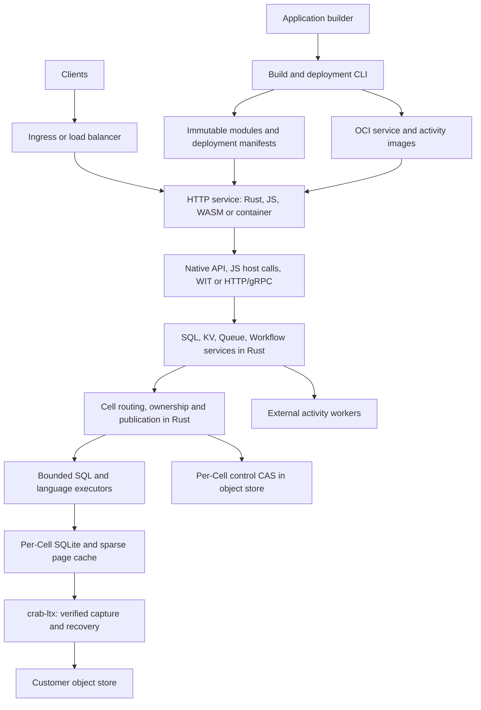

# Crab platform: Rust core and multi-language services

Status: proposed technical design, 2026-09-13. Source baseline:
`996cde6911e9ab519c4200df0c977366377f16bd`. This document set defines a new,
self-hosted application platform built on `crab-ltx`. The platform binary,
language SDKs, service APIs, commands and manifests below are proposed; they
are not available packages or implemented CLI commands.

## Outcome

Application builders write HTTP services, stateful Cells and background workers,
then deploy them to their own Kubernetes or VM fleet. Rust owns persistence,
routing, resource admission, scheduling and the SQL/KV/Queue/Workflow services.
Applications use native Rust, embedded JavaScript, qualified WASM components,
or ordinary containers calling a language-neutral API.

A Cell is a stable identity with one SQLite database and a serialized command
executor. One current owner may publish its state. SQLite commits become
externally durable when verified immutable recovery data is uploaded and an
authoritative record conditionally publishes its root. Local SSD holds the
recoverable working set. Object storage holds acknowledged state.

The design deliberately separates language access from language execution:
Python can use every primitive through an SDK and deploy as a container before
Python has any embedded runtime support. JavaScript Cell handlers execute on
the database owner when application logic needs an interactive transaction.

## Reading guide

| Document | Contract owned here |
| --- | --- |
| [Runtime and durability](runtime.md) | Identity, ownership, publication, recovery, consistency, LTX changes and executor model |
| [SQL, KV, Queue and Workflow](primitives.md) | Schemas, transactions, delivery, retries, scheduling and cross-Cell effects |
| [Languages and application development](languages.md) | Rust/JS/HTTP/WASM boundaries, typed wire values, examples and execution restrictions |
| [Deployment and operations](deployment.md) | Fleet topology, artifacts, upgrades, security, resource budgets, retention and disaster recovery |
| [Delivery and qualification](delivery.md) | Source evidence, implementation slices, acceptance tests and open qualification decisions |

## Architecture

Ingress chooses an entry node. Cell routing chooses the current owner. Placement
chooses a candidate owner using capacity and locality. Only a successful control
CAS grants publication authority. Adding nodes increases aggregate capacity
across Cells; it does not parallelize the writer of one hot SQLite database.

The initial supported fleet occupies one region with a qualified object-store
endpoint. Cross-region clients can call it, but asynchronous object replication
does not establish an active-active fleet or preserve zero-loss regional failover.

## Principal decisions

| Area | Decision |
| --- | --- |
| Durable unit | One Cell, one SQLite database, one current publisher |
| Atomicity | One Cell transaction; cross-Cell effects use durable outbox/inbox delivery |
| Durability | Upload immutable dependencies, then CAS one owner/root record before success |
| Ownership | Conditional origin writes; placement and membership are advisory |
| State recovery | Exact published root, never latest-object listing or unacknowledged WAL |
| Rust execution | Trusted modules linked into the runtime build |
| JavaScript execution | Versioned embedded JS host API; TypeScript compiled during build |
| Other languages | HTTP/gRPC clients and OCI workers first; tested WASM components later |
| Primitive semantics | One Rust implementation shared by every adapter |
| Workflows | Explicit persisted state machine first; replay-style async syntax later |
| Deployment | Immutable artifacts, validated capabilities, per-Cell code/schema transitions |
| Scale qualification | 1K–10K active DBs/node and 1,000 aggregate TPS are targets, not proven capacities |

Object storage supplies conditional-update serialization and durable storage.
The baseline therefore requires neither a separate SQL cluster nor an additional
consensus service. Its availability still depends on those object-store contracts.
An unavailable authority stops new acknowledgements and ownership acquisition.

## Scope and boundaries

The first platform includes SQL, KV, Queue, Workflow, immutable blob references,
HTTP services, scheduled work, authentication, local development and fleet
deployment. A full S3-compatible object API, Cloudflare compatibility, globally
atomic transactions, general workflow stack serialization and peer-disk-only
acknowledgement are subsequent products or protocols.

Celld informs the composition: runtime and primitives share Cells, and Cells
share SQLite replication and ownership. Its [source README](https://github.com/denoland/celld/blob/10cb1303dac710dcb3b557e318e08c855261f68b/README.md)
also describes peer-log acknowledgement. Crab's baseline waits for object-store
publication; adopting that faster acknowledgement mode would require a new
recovery and fencing proof, including loss of the original owner and its bucket
upload backlog. Copying LTX mechanics alone cannot supply that guarantee.

## Relationship to current Crab

The [HTTP next architecture](../../../../crates/crab-http-server/next-architecture/README.md)
remains the repository application's design. This platform generalizes its Cell
substrate. `crab-http-server` becomes a native Rust consumer with
`CellId = application / repository-namespace / repository-UUID`; issues, comments
and collaboration data share repository transactions. Existing Git/Xet and LFS
storage remain under their current owners. Git mutations and SQL changes still
need reconciliation through an outbox because they are separate commit domains.

The accepted HTTP hard cutover remains valid: stop old application writes,
import and verify collaboration data, then start the SQLite/LTX fleet. This is
not permission to erase persistent data or make ongoing application upgrades
silently incompatible. Platform format changes also need explicit maintenance
and verified migration when compatibility is not supported.

The general platform does not turn Crab's serverless Git remote helper into a
mandatory platform client. It is an optional server product. Existing
`crab-sdk` remains the Git SDK, and existing `crab-workflow` remains the Git/DVC
workflow subsystem. New platform contracts must use distinct names.

## Module ownership

Start with cohesive modules and split crates when a real dependency boundary
or second consumer requires it. This is a target ownership map, not a request
to scaffold one empty crate per row.

| Proposed owner | Responsibility |
| --- | --- |
| Existing `crab-storage` | Provider construction contracts, conditional writes, ranges and transport |
| Existing `crab-ltx` | SQLite capture, authenticated recovery graph, hydration, compaction and storage admission hooks |
| `crab-cell-runtime` | Cell identity, authority, routing, SQL scheduling, activation, publication and durable effects |
| `crab-platform` service modules | SQL/KV/Queue/Workflow contracts, schemas and primitive handlers |
| `crab-platform-protocol` | Versioned wire schemas, structured errors and generated transport bindings |
| Runtime adapter modules | Native Rust, embedded JS and later WASM host bindings |
| `crab-platform-server` | Listeners, auth, fleet composition, artifacts and operations |
| Platform client/CLI packages | Application SDKs, builds, provisioning and deployment commands |

Dependency direction runs from composition to primitives to Cell runtime to
LTX/storage. `crab-ltx` must not import a JS engine, protocol server, workflow
schema, identity provider or Kubernetes client.

## Guarantees exposed to builders

1. Successful mutations survive loss of the owner and its entire local disk,
   subject to the qualified object store's durability contract.
2. An owner change cannot publish an old owner's later tentative state.
3. Request IDs provide deduplication within an explicit retention period;
   replay with different operation bytes fails as an identity conflict.
4. A SQL transaction and its durable effect intentions are atomic within a Cell.
5. Queue deliveries and workflow activities can repeat. External effects require
   idempotency at their destination.
6. Read consistency, schema versions, runtime capabilities and resource limits
   are explicit parts of the service contract.
7. Every language receives the same success, conflict and indeterminate-outcome
   semantics. An SDK cannot turn a timeout into proof of rollback.

See [delivery gates](delivery.md) for the evidence required before advertising
these guarantees as supported behavior.
