# Embedded Rust Cell runtime: low-level implementation specification

Status: implementation in progress. Revision: 2026-09-14. Existing-code baseline:
`ec20643073a`. SQL and peer contracts are implementation inputs. The initial
identity/control/schema foundation and native-cut immutable root preparation now
exist in `crab-cell-runtime` and `crab-ltx`; exact roots support lazy,
authenticated page reads, and the local executor now persists request outcomes
while retaining pending cuts/results until an exact prepared root is confirmed.
The publication coordinator also resolves a lost CAS response when origin names
that exact root and refreshes through pure lease renewals. The node-wide runtime
dispatcher now combines the fixed SQL workers with per-Cell request/byte
mailboxes, node byte admission, FIFO single-flight publication, cancellation-safe
accepted work, bounded retry backoff, structured unknown outcomes and drain.
Catalog immutable pages/CAS heads and proof-before-control activation are now
implemented. Exact authoritative roots now prepare an authenticated checksum
index, open a fresh sparse writable SQLite file on the assigned SQL worker,
verify persisted identity/position/schema/sequence, and continue publication
after complete local source loss and a new owner session. New Cells are now
exclusively created on their assigned SQL worker: runtime and application schema
installation commit together, the initial cut is captured, and root publication
completes before a handle becomes visible. The previous caller-opened runtime
activation path has been removed. FIFO Resolve now distinguishes authoritative
stored outcomes, absence, expiry and fenced/in-flight uncertainty, including
after a successor restores a later root. Normal drain and orphaned activation
close the SQL worker before conditionally releasing control ownership to `Idle`.
Node-wide terminal shutdown is also implemented: it closes node and Cell
admission, drains every message accepted before the shutdown marker through
ordinary publication, closes every active SQLite handle, and releases every
owned control before returning. This primitive is not yet wired into the HTTP
server's signal/readiness lifecycle. After all Cell deactivations settle it
explicitly closes the shared fixed pool and joins every SQL worker thread; other
runtime, pool or handle clones remain permanently closed.
The dispatcher now renews idle owners through one bounded node-level scanner;
strict CAS reconciliation accepts an exact lost response, and an observed
takeover fences the old executor. Long immutable-root preparation interleaves
the same renewals. Idle acquisition reserves local capacity before its owner CAS;
active takeover requires an exact control remain unchanged for 15 seconds, then
CASes the new owner before downloading and restoring the root. SQL/native
operations now have a 5-second wall watchdog: SQLite receives a cross-thread
interrupt, new admission is fenced immediately, and a timed-out mutation returns
unknown while its permits remain held until the callback exits. A native callback
that exits late cannot publish its tentative commit. Sparse page-I/O deadline
propagation and automatic fenced recovery,
streaming initial directory construction and directory-backed capture checksums,
shared directory caching, prepared compaction/bundles,
Workflow effect supervision, catalog-driven activity scheduling, scheduler
progress advertisement and remote/idle routing, private peer routing, HTTP
cutover and capacity qualification remain incomplete. The scoped
KV primitive now installs
the normative schema and implements atomic checks/mutations, incarnation/sequence
versions, logical TTL, bounded binary-prefix reads and cleanup through the same
runtime publication path. Its typed `KvNamespace` now derives the fixed shard
from scope, binds stable registered codecs, publishes atomic mutations through
`CellClient`, maps precondition failure to a durable rejection, and returns
receipted point/list reads using owner-sampled logical time. Queue now implements
producer dedup, bounded claims,
unpredictable lease tokens, published-token validation, ack/retry/extend, expired
lease reclamation, attempt limits and terminal cleanup. Dead-letter delivery
still depends on the remaining effect subsystem. Its typed `QueueNamespace`
derives send shards from producer IDs, requires consumers to select one fixed
shard, publishes claims before returning payloads, revalidates exact leases at a
minimum receipt and exposes token-bound ack/retry/extend commands. Shard counts
come only from the compiled registry. The application SQL boundary
now executes typed, bounded batches, classifies statements through SQLite,
materializes bounded results and installs a scoped native authorizer that denies
runtime/primitive access and connection, schema or transaction control. Its
typed `SqlCell` binds compile-time command/query IDs, accepts only an explicit
Cell target with the SQL role, publishes mutations through `CellClient`, and
returns receipted minimum-position reads. Integration coverage publishes a
batch, rejects a mutation on the query path, removes the first owner's local
database and verifies the same values after exact-root restoration.
The Workflow transition core now installs the normative schema and atomically
implements start, idempotent signal, cancellation and timer firing against a
pinned compiled definition digest. Each module names one current definition for
new runs and retains every older executable definition needed by stored runs;
signals and activity completions select the exact implementation from the
persisted digest. Deterministic action IDs, bounded decisions,
outstanding-task limits, terminal cancellation and exact-root restoration are
implemented. Activity claims, post-publication lease validation, heartbeat extension,
attempt-bound idempotent completion/failure, retry and terminal retention cleanup
are now implemented through the same publication path. The native
`ActivitySupervisor` claims one item through the actor, waits for that claim's
root to publish, validates its exact lease, runs only the statically bound Rust
future outside SQLite, heartbeats through durable commands and publishes its
completion or retry transition. Its mutation evidence survives unknown outcomes,
and dropping the supervisor cycle signals cooperative cancellation. Catalog-driven
shard polling, bounded multi-activity orchestration, effect actions and the due-Cell
scanner remain. A typed `WorkflowNamespace` now
binds each namespace and its current-plus-retained definition inventory to fixed
command/query IDs at startup, derives its shard only from the workflow ID and compiled registry,
and exposes receipted start, signal, cancel and state operations. Registry
freeze fails unless every declared definition and activity pair has an exact
statically linked binding. Unit coverage proves a run pinned by an old binary
continues through retained old transition code while new starts select the
current definition. Its integration path proves start, idempotent signal,
durable identity-conflict rejection, cancellation and minimum-receipt state
after exact-root restoration. The source effect ledger and target
inbox mechanics now derive immutable identities/digests, enforce command and
claim bounds, validate only published leases, retry with stable bytes, dedup
target execution, retain destination receipts beyond the sender horizon and
clean terminal rows in bounded batches. Private peer delivery and the node
effect supervisor still remain.
Bootstrap and every committed command now derive the earliest durable work or
retention deadline from SQLite inside the same transaction. The runtime binds
that summary to the pending LTX cut and publishes it in control; application
handlers can no longer omit or spoof scheduler state. A typed internal Tick now
rechecks the scanned root position, advances at most 128 ledger, expiry, lease,
timer or retention items through the normal actor and republishes the resulting
summary. It dispatches timer and terminal activity events through the run's
retained definition. Revision-pinned catalog iteration now verifies one immutable
256-entry page at a time; due filtering reads at most 32 controls per step, and
the preferred scanner is selected by order-independent rendezvous hashing.
Node-progress advertisements, 15-second fallback, remote/idle route orchestration
and retry supervision remain. `CellRuntime::local_handle` now resolves a due Cell
only when the dispatcher still owns the exact incarnation/code/schema under the
current session and the admission is neither fenced nor draining; it never
exposes the internal Cell map or SQLite handle.
The startup-only compiled registry now validates module names, exact migration
bytes/digests and contiguous schema ranges, command/query codec ranges and byte
limits, namespace topology/effect targets/DLQ cycles, workflow/activity
inventories, and exact descriptor-to-command/query/definition/activity binding
equality. It produces
order-independent canonical release bytes, module code digests and one release
digest, then exposes only immutable command/query dispatch through transaction-
scoped contexts. The canonical bounded `WireValue` codec and generic typed
`Command`/`Query` trampolines are implemented: inputs must decode completely
before handler entry, outputs use the declared limit, and invalid tags,
truncation, trailing bytes, non-finite/negative-zero floats and oversized values
fail closed. The local `CellClient` now derives the canonical operation digest,
validates namespace/module code/schema and incarnation before admission, maps
typed success or durable rejection to a receipt, preserves unknown mutation
identity, and executes minimum-receipt reads through the same FIFO actor and LTX
publication path. Private peer routing and server runtime composition remain;
KV, SQL, Queue and Workflow primitive handles are complete for local routing.
The server now compiles a canonical repository module descriptor and
its first migration, and `cells release inspect --json` emits those exact
registry bytes from the built binary. Runtime lifecycle composition, including
invoking the implemented terminal drain from server shutdown, and product route
cutover remain.

## Deliverable and contract precedence

Embed SQL, scoped KV, partitioned Queue and explicit state-machine Workflow
in the existing `crab-http-server` process. Crab application handlers and
activities are trusted Rust code compiled into that binary. One command changes
one SQLite Cell and is acknowledged only after its immutable LTX dependencies
and owner/root CAS are durable. A repository's collaboration data uses one Cell;
shared queue/KV/workflow namespaces use separate fixed shards where needed.

The SQL migrations and private Protobuf descriptor are normative. Prose supplies
validation, ordering and preconditions not expressible in those formats. Rust
signatures below are interfaces to implement unless their section explicitly
records an implementation in `crab-cell-runtime`.
This specification refines the shared runtime contracts in the earlier
[HTTP next architecture](../../../../crates/crab-http-server/next-architecture/README.md);
that design retains repository-specific data, Git and cutover requirements.
The directory name `platform/` is retained for documentation links, not a
standalone product or server.

## Accepted product decision: Rust code embedded in Crab

V1 is a Crab subsystem, not a general application-hosting product. The only
application extension boundary is reviewed Rust source compiled with
`crab-http-server`. A release is the ordinary Crab OCI image plus its canonical
compiled-registry descriptor; operators do not upload functions, modules or
language bundles at runtime.

The extension author is therefore a Crab contributor, not an independent
platform tenant. Adding a service operation changes the server source, its SQL
migration and codec fixtures in the same pull request. The operation becomes
available only after the resulting whole-server image passes qualification and
is rolled out. Repository owners can use the resulting product capability but
cannot choose code, dependencies, migrations or primitive permissions at
runtime.

This fixes the dependency and request path:

```mermaid
flowchart LR
    Browser[React client or Git client] --> Public[Crab public HTTP routes]
    Public --> Product[crab-http-server auth and repository policy]
    Product --> Registry[Statically linked Rust command registry]
    Registry --> Runtime[crab-cell-runtime]
    Runtime --> Ltx[crab-ltx managed SQLite and immutable roots]
    Ltx --> Storage[crab-storage object-store origin]
    Product -. owner is another node .-> Peer[Private authenticated peer route]
    Peer --> Remote[Another crab-http-server process]
    Remote --> Registry
```



The arrows are also the allowed policy direction. `crab-cell-runtime` defines
generic Cell mechanics and typed handler contracts but cannot import HTTP,
repository, auth or Git policy. `crab-http-server` owns the compiled module list,
maps product HTTP requests to typed commands, and adapts durable outcomes back
to existing product responses. `crab-ltx` and `crab-storage` remain unaware of
commands, users and repositories.

The browser is not a runtime language client: it continues to call Crab's
repository HTTP API. Native modules are not third-party untrusted code; adding
one is a Crab source change subject to the same review, tests, image signing and
fleet rollout as any other server change. Therefore V1 needs no guest sandbox,
FFI ABI, dynamic loader, per-language codec, workload-token issuer, public
primitive endpoint or separate platform control plane.

| Specification | Implementation input |
| --- | --- |
| [Runtime](runtime.md) | Ownership types, command loop, CAS predicates, executor lifecycle and failure actions |
| [Storage](storage.md) | Identity encoding, object keys, control/root formats, LTX API changes and activation |
| [Primitives](primitives.md) | SQL statements, leases, dedup, state transitions and scheduler procedures |
| [Rust API and peer protocol](rust-api.md) | Typed handlers, transaction lifetimes, internal forwarding and Crab integration |
| [Deployment](deployment.md) | Existing server configuration extensions, admission, compiled releases, migrations and operations |
| [Delivery](delivery.md) | Source changes, dependency order, named tests and executable contract validation |
| [Runtime migration](contracts/runtime.sql) | Install in every Cell |
| [KV migration](contracts/kv.sql) | Install in KV shard Cells |
| [Queue migration](contracts/queue.sql) | Install in Queue shard Cells |
| [Workflow migration](contracts/workflow.sql) | Install in Workflow shard Cells |
| [Private peer descriptor](contracts/peer.proto) | Protobuf messages for enrolled Crab nodes, not a public primitive service |

## Fixed v1 boundary

| Item | Implementation decision |
| --- | --- |
| Executable | Existing `crab-http-server`, one binary/container per node |
| Application model | Build-time Rust registry; typed synchronous commands/queries and asynchronous activities |
| Calls | In-process Rust calls for local owners; versioned private messages for remote owners |
| Durability | One object-store origin; immutable LTX preparation then owner/root CAS |
| Workflow | Explicit transition callback plus persisted activities/timers/signals; no stack replay |
| KV | Values up to 64 KiB; scoped atomic mutations and scope-local listing |
| Queue | Payloads up to 256 KiB; at-least-once, no FIFO guarantee |
| Git and blobs | Existing Git/Xet/LFS/release-asset owners; no second public object API |
| Upgrades | Compiled schema/definition versions; incompatible changes use maintenance |
| GC | Offline application-scoped collection; writers stopped and write access revoked |

No JS/V8/WASM execution, multi-language backend SDKs, generic public SQL/KV/RPC
listener, dynamic code loading, or service-bundle deployment system. The existing
React browser application remains a client of Crab's product HTTP API.
Cross-Cell transactions, online GC and peer-disk durability acknowledgements
are also outside v1. Native code is trusted, not a tenant sandbox.

The public compatibility contract remains Crab's product HTTP and Git surfaces.
`CellClient`, primitive handles, command codecs and the peer protocol are private
implementation contracts between code built into compatible Crab images. They
must not be exported as an application SDK or advertised as user-selectable
infrastructure.

This is a hard architecture boundary, not deferred optional work. Supporting
untrusted or independently deployed application code later would require a new
threat model, resource isolation contract and public protocol design; it must not
be introduced as an adapter around the V1 transaction API.

This decision supersedes the earlier standalone, multi-language platform
direction. Runtime abstractions must have a concrete in-tree Crab caller; do not
add guest-neutral manifests, public wire APIs, language-host lifecycle, or
deployment indirection solely to preserve a possible future non-Rust host.

## Source ownership and target files

Create one new crate, `crab-cell-runtime`, with its first working Crab caller.
Primitive modules share its transaction and publication owner; separate facade,
protocol, SDK and platform-server crates are unnecessary.

```text
crates/crab-http-server/src/
  server.rs, app.rs            lifecycle, auth/admission and existing HTTP routing
  cells.rs                    compiled repository registry and runtime composition
  peer.rs                     private authenticated forwarding on management listener
  cells/commands.rs           repository command/query types and handlers
  cells/activities.rs         native Git/outbox activity adapters
  cells/migrations/           repository SQL migrations

crates/crab-cell-runtime/src/
  identity.rs, authority.rs    Cell identity and owner/control CAS
  actor.rs, executor.rs        supervised commands and bounded SQL workers
  publication.rs              pending cut ownership and reconciliation
  catalog.rs, scheduler.rs     provision proof and transactional due summary (implemented), scanning/Tick
  registry.rs, api.rs          typed definitions, codecs and capability handles
  peer.rs                     private message codec, no listener/auth policy
  sql.rs, kv.rs, queue.rs,
  workflow.rs, effects.rs      primitive mechanics
  migrations/                 SQL copied from contracts/

crates/crab-ltx/src/
  replica/prepared.rs          immutable root preparation
  replica/root.rs              bounded root/page codec
  paged/directory.rs           authenticated page directory
  managed.rs                  transaction/read hooks

crates/crab-storage/src/       scoped layout and existing provider-neutral storage
```

Keep `crab-workflow` Git/DVC APIs and `crab-sdk` Git APIs unchanged.
The runtime owns no repository policy, HTTP listener or provider credentials.
Git/Xet/LFS keep their current publication owners; SQL coordinates with them
through durable intentions, not a cross-system atomic commit. Apply the accepted
[hard cutover](deployment.md#repository-application-cutover).

## Fixed initial operation limits

These are admission limits and implementation defaults, not benchmark claims.

| Limit | v1 value |
| --- | --- |
| Operation/result/state | 1 MiB each; SQL read at most 1,000 rows and 1 MiB |
| Peer envelope | Operation limit plus 16 KiB authenticated metadata |
| Batch | Up to 128 SQL statements or KV mutations |
| Request ID/incarnation | 16 bytes; digests and Cell IDs 32 bytes |
| Request validity | expires - issued <= 24h; issued at most 5 min in future |
| Request record retention | Through request expiry + 24h |
| Effect lifetime / inbox retention | 7 days / effect expiry + 7 days |
| Transport wait | Default 30 s, maximum 60 s |
| Native transaction wall budget | 5 s cooperative deadline; cannot forcibly preempt arbitrary Rust |
| Queue/activity lease | Default 30 s, allowed 5–300 s |
| Delivery margin | At least 1 s remaining before emitting a claimed task |
| Queue attempts / retention | 20 deliveries / 30 days from enqueue |
| Activity attempts / lifetime | 20 / 7 days from scheduling |
| Renewal / self-fence / takeover observation | 3 s / 10 s / 15 s |
| Scheduler scan pass | <= 5 s for the admitted catalog |

Capacity targets remain 1K–10K simultaneously open DBs and 1,000 user commands/s
aggregate per node. Hardware and qualification are in [deployment](deployment.md#resource-profiles-and-capacity-targets)
and [delivery](delivery.md#capacity-qualification). No profile is promised to
meet these targets without measurement.
