# Embedded Rust Cell runtime: low-level implementation specification

Status: implementation in progress. Revision: 2026-09-15. Existing-code baseline:
`ec20643073a`. SQL and peer contracts are implementation inputs. The initial
identity/control/schema foundation and native-cut immutable root preparation now
exist in `crab-cell-runtime` and `crab-ltx`; exact roots support lazy,
authenticated page reads, and the local executor now persists request outcomes
while retaining pending cuts/results until an exact prepared root is confirmed.
The publication coordinator also resolves a lost CAS response when origin names
that exact root and refreshes through pure lease renewals. The node-wide runtime
dispatcher now combines the fixed SQL workers with per-Cell request/byte
mailboxes, node byte admission, FIFO single-flight publication, cancellation-safe
accepted work, bounded retry backoff, structured unknown outcomes and drain.
Catalog immutable pages/CAS heads and proof-before-control activation are now
implemented. Exact authoritative roots now prepare an authenticated checksum
index, open a fresh sparse writable SQLite file on the assigned SQL worker,
verify persisted identity/position/schema/sequence, and continue publication
after complete local source loss and a new owner session. New Cells are now
exclusively created on their assigned SQL worker: runtime and application schema
installation commit together, the initial cut is captured, and root publication
completes before a handle becomes visible. The previous caller-opened runtime
activation path has been removed. FIFO Resolve now distinguishes authoritative
stored outcomes, absence, expiry and fenced/in-flight uncertainty, including
after a successor restores a later root. Normal drain and orphaned activation
close the SQL worker before conditionally releasing control ownership to `Idle`.
Node-wide terminal shutdown is also implemented: it closes node and Cell
admission, drains every message accepted before the shutdown marker through
ordinary publication, closes every active SQLite handle, and releases every
owned control before returning. The existing HTTP server now constructs this
runtime as part of `serve`, rejects readiness after its terminal drain starts,
and invokes the Cell drain after Axum, receives, transfers, and repository
maintenance have drained. After all Cell deactivations settle it
explicitly closes the shared fixed pool and joins every SQL worker thread; other
runtime, pool or handle clones remain permanently closed.
The dispatcher now renews idle owners through one bounded node-level scanner;
strict CAS reconciliation accepts an exact lost response, and an observed
takeover fences the old executor. Long immutable-root preparation interleaves
the same renewals. Idle acquisition reserves local capacity before its owner CAS;
active takeover requires an exact control remain unchanged for 15 seconds, then
CASes the new owner before downloading and restoring the root. SQL/native
operations now have a 5-second wall watchdog: SQLite receives a cross-thread
interrupt, new admission is fenced immediately, and a timed-out mutation returns
unknown while its permits remain held until the callback exits. The same absolute
deadline reaches the SQL worker and bounds both the blocking sparse VFS wait and
its asynchronous object-store read; a recovered VFS deadline source fences the
connection and preserves mutation/query/Resolve outcome semantics. A native
callback panic is now caught at the fixed worker boundary: its transaction
unwinds, only that Cell is fenced, the worker continues serving its other Cells,
and an accepted mutation returns outcome-unknown rather than a false rollback or
business rejection. Bootstrap panics release admission and leave control
unpublished. A callback that exits late cannot publish its tentative commit. After the accepted
callback exits, fenced recovery removes and closes the worker-owned SQLite handle,
reloads authority, and releases only the newest control still held by the same
owner and epoch. Local tentative state remains quarantined; a changed owner is
left untouched. The next idle acquisition reopens the exact authoritative root,
so it cannot publish a late tentative commit. Initial directory construction now
k-way merges ordered authenticated index streams, removes locators invalidated by
later truncation, uploads each 256-page leaf immediately and retains only radix
node summaries. Writable activation now streams authenticated checksums to a
local fixed-width file; capture keeps only changed checksums resident, updates
the aggregate incrementally and persists them after sealing the LTX cut.
Cell range/full compaction now externally merges authenticated index streams,
uses bounded frame reads and uploads scratch-backed output without whole-LTX
buffers. The owner publication path now schedules eight-input level promotions
and performs an emergency full compaction before segment or graph-byte admission
would reject the next append. Representation-only roots publish through the same
owner CAS while preserving application sequence, schema, due summary and exact
database endpoint. Bootstrap, command and migration confirmation then reverify
and prune only their exact local captured files, so a long-lived writer does not
exhaust its local retained-cut budget. Sparse activation uses a page-I/O worker independent of the fixed SQL
pool; a two-Cell test saturates both SQL workers on delayed authenticated page
faults and proves both activations complete. Remaining HTTP domain cutovers and capacity qualification remain
incomplete. The scoped
KV primitive now installs
the normative schema and implements atomic checks/mutations, incarnation/sequence
versions, logical TTL, bounded binary-prefix reads and cleanup through the same
runtime publication path. Its typed `KvNamespace` now derives the fixed shard
from scope, binds stable registered codecs, publishes atomic mutations through
`CellClient`, maps precondition failure to a durable rejection, and returns
receipted point/list reads using owner-sampled logical time. Queue now implements
producer dedup, bounded claims,
unpredictable lease tokens, published-token validation, ack/retry/extend, expired
lease reclamation, attempt limits and terminal cleanup. A configured dead-letter
transition atomically inserts a stable typed Queue-send effect, links it from
the dead row and retains the payload while that effect is pending. Claim-time
reclamation and the registered Tick use the same adapter. Its typed `QueueNamespace`
derives send shards from producer IDs, requires consumers to select one fixed
shard, publishes claims before returning payloads, revalidates exact leases at a
minimum receipt and exposes token-bound ack/retry/extend commands. Shard counts
come only from the compiled registry. The application SQL boundary
now executes typed, bounded batches, classifies statements through SQLite,
materializes bounded results and installs a scoped native authorizer that denies
runtime/primitive access and connection, schema or transaction control. Its
typed `SqlCell` binds compile-time command/query IDs, accepts only an explicit
Cell target with the SQL role, publishes mutations through `CellClient`, and
returns receipted minimum-position reads. Integration coverage publishes a
batch, rejects a mutation on the query path, removes the first owner's local
database and verifies the same values after exact-root restoration.
The Workflow transition core now installs the normative schema and atomically
implements start, idempotent signal, cancellation and timer firing against a
pinned compiled definition digest. Each module names one current definition for
new runs and retains every older executable definition needed by stored runs;
signals and activity completions select the exact implementation from the
persisted digest. Deterministic action IDs, bounded decisions,
outstanding-task limits, terminal cancellation and exact-root restoration are
implemented. Activity claims, post-publication lease validation, heartbeat extension,
attempt-bound idempotent completion/failure, retry and terminal retention cleanup
are now implemented through the same publication path. The native
`ActivitySupervisor` claims one item through the actor, waits for that claim's
root to publish, validates its exact lease, runs only the statically bound Rust
future outside SQLite, heartbeats through durable commands and publishes its
completion or retry transition. Its mutation evidence survives unknown outcomes,
and dropping the supervisor cycle signals cooperative cancellation. Registration
now also installs one type-erased runner per compiled Workflow namespace. The
server scheduler may therefore execute a statically bound activity without
knowing the module's Rust type. It bounds concurrent activity jobs by available
CPU, caps them at 16 per node and one per Cell, and keeps catalog scanning
independent of a long-running activity. The per-Cell reservation prevents an
earlier temporary activation from draining while another activity still uses
the same local actor. Modules may separately register synchronous blocking Rust
handlers. Registry freeze records every Workflow namespace containing one, and
the scheduler reserves a slot in a dedicated fixed OS-thread pool before it
claims any durable activity from that namespace. The submitted callback owns
that slot until it actually exits, even if its Tokio supervisor is cancelled;
shutdown drains submitted callbacks and joins every pool thread. Handler panic
is converted to an activity failure without killing the worker. A typed `WorkflowNamespace` now
binds each namespace and its current-plus-retained definition inventory to fixed
command/query IDs at startup, derives its shard only from the workflow ID and compiled registry,
and exposes receipted start, signal, cancel and state operations. Registry
freeze fails unless every declared definition and activity pair has an exact
statically linked binding. Unit coverage proves a run pinned by an old binary
continues through retained old transition code while new starts select the
current definition. Each definition declares its effect-target namespace set;
registry freeze requires their union to equal the Workflow namespace descriptor.
Effects carry only typed Cell commands, inherit the source tenant/application,
and are rejected before writes if their target is cross-tenant or undeclared.
Its integration path proves start, idempotent signal,
durable identity-conflict rejection, cancellation and minimum-receipt state
after exact-root restoration. The source effect ledger and target
inbox mechanics now derive immutable identities/digests, enforce command and
claim bounds, validate only published leases, retry with stable bytes, dedup
target execution, retain destination receipts beyond the sender horizon and
clean terminal rows in bounded batches. Destination delivery now enters the
same bounded Cell actor as commands, records `sys_inbox`, advances `sys_meta`,
captures LTX and waits for the exact control root before success. A cancelled
caller does not cancel accepted work; stable retries return the stored outcome,
and private Resolve reads the inbox after exact-root restoration. The strict
signed peer protocol now carries generic compiled Cell-command effects and
effect Resolve, verifies the source-derived identity, freshly described
destination incarnation and stable operation digest, and exposes a typed
source-side `EffectPeerClient`. Durable typed requests store an empty destination
incarnation; delivery and Resolve describe the current owner generation and fill
that field only in the transient signed request. Destination inbox hashing clears
it again, so takeover does not change effect identity.
`EffectModule` now binds source claim/lease/validation operations into the
compiled registry, and `EffectSource` publishes every claim, acknowledgement
and retry through `CellClient`. `EffectSupervisor` claims one published
intention, revalidates its exact lease at the claim receipt, delivers or
resolves it through the signed peer client, and then publishes the matching
source acknowledgement or retry. Workflow transitions now atomically insert
owner-independent typed command effects through one source-target-bound
`EffectBatch`; terminal
decisions may emit effects while still rejecting new local work. The batch uses
the Cell commit sequence and assigns ordinals across every transition in one
scheduler Tick, so different runs cannot collide in `sys_effects`. Queue
dead-letter insertion and generic compiled-namespace effect polling are
implemented.
Bootstrap and every committed command now derive the earliest durable work or
retention deadline from SQLite inside the same transaction. The runtime binds
that summary to the pending LTX cut and publishes it in control; application
handlers can no longer omit or spoof scheduler state. A typed internal Tick now
rechecks the scanned root position, advances at most 128 ledger, expiry, lease,
timer or retention items through the normal actor and republishes the resulting
summary. It dispatches timer and terminal activity events through the run's
retained definition. Revision-pinned catalog iteration now verifies one immutable
256-entry page at a time; due filtering reads at most 32 controls per step, and
the preferred scanner is selected by order-independent rendezvous hashing.
`crab-http-server` now runs the Cell scanner once per second. A cycle
enumerates the exact live fleet, rendezvous-assigns all 256 shards, processes at
most 128 due Cells, routes Tick to an existing local or authenticated remote
owner, or temporarily acquires an idle/stale-owner Cell from its exact root. A
temporary local activation drains back to `Idle` after processing. When Tick
reports no maintenance item, the registry identifies whether the due namespace
has an activity or effect runner. Activity work runs in a CPU-derived bounded
`JoinSet`. Before claiming durable work, it reserves the maximum 256 KiB input
plus 256 KiB output from the same node-wide byte budget used by Cell commands;
capacity exhaustion leaves the activity unclaimed for a later scan. Effects run
after the activity or inline when no activity is admitted.
The scanner never waits for the activity future. Tick, activity and effect peer
operations use exact registered operation IDs/codecs and fleet/session-bound
internal grants, not a browser principal. Scheduler shutdown aborts and joins
all activity jobs; dropping their supervisor futures signals cooperative
cancellation before runtime drain. Each completed cycle advances a shared
boot-session progress counter. Heartbeats publish that counter while allowing unchanged progress, and
every scheduler tracks the last observed change per live session. A node with no
advertised progress for 15 seconds is removed from rendezvous assignment until
it advances again. A live session advertising zero free memory, free disk or job
credits is likewise excluded until a later signed refresh restores capacity;
local admission remains authoritative. Its own readiness stays closed until the
first complete cycle and fails again on the same deadline. Prometheus
exports scheduler health, progress and lag. The transactional Tick now reserves
work for every installed maintenance class and passes unused capacity forward,
so request retention cannot starve Queue or Workflow deadlines. The scanner
keeps one revision-pinned cursor per assigned shard across cycles, gives each
shard one attempt before filling unused capacity, rotates the first shard and
never discards the tail of a bounded control batch. A failed Cell remains due in
its published control and is retried after the cursor completes and reloads the
latest shard head, so a hot Cell or namespace cannot pin the catalog prefix.
Cross-session activity recovery is now integration-proven through unchanged-owner
takeover, source-volume loss, exact-root restore, expired-lease reclaim and
attempt-two completion. Real multi-Pod process/network fault qualification and
dirty-job admission remain.
`CellRuntime::local_handle` now resolves a due Cell
only when the dispatcher still owns the exact incarnation/code/schema under the
current session and the admission is neither fenced nor draining; it never
exposes the internal Cell map or SQLite handle.
The startup-only compiled registry now validates module names, exact migration
bytes/digests and contiguous schema ranges, command/query codec ranges and byte
limits, namespace topology/effect targets/DLQ cycles, exact Queue bindings and
DLQ module/namespace/shard/send-codec equality, exact compiled Workflow
effect-target unions, workflow/activity
inventories, and exact descriptor-to-command/query/definition/activity binding
equality. It produces
order-independent canonical release bytes, module code digests and one release
digest, then exposes only immutable command/query dispatch through transaction-
scoped contexts. The canonical bounded `WireValue` codec and generic typed
`Command`/`Query` trampolines are implemented: inputs must decode completely
before handler entry, outputs use the declared limit, and invalid tags,
truncation, trailing bytes, non-finite/negative-zero floats and oversized values
fail closed. `CellClient` now derives the canonical operation digest,
validates namespace/module code/schema and incarnation before admission, maps
typed success or durable rejection to a receipt, preserves unknown mutation
identity, and executes minimum-receipt reads through the same FIFO actor and LTX
publication path. Its authenticated peer constructor uses the same typed API,
signs bounded private requests, strictly decodes replies, and preserves the
original mutation identity and digest for unknown outcomes. `PeerDispatcher`
rechecks product authorization, resolves only an active local owner, and then
reuses the canonical local transport rather than opening a second SQL execution
path. The server composition root now owns one process-session
`CellRuntime`, validates the compiled registry before admission, publishes its
signed node session, serves its management router through mandatory fleet mTLS,
and supervises the repository due scanner until cancellation. Shutdown joins the
scanner before draining the runtime. The server-side peer
round trip now reloads authoritative ownership, requires the owner endpoint to
match a live signed node advertisement, pins CA/hostname/leaf/SPKI through mTLS,
reuses a bounded client pool and retries only definitely-not-started failures
once within the original deadline. The server-owned repository router now
serializes activation, reuses an exact local handle, selects the authenticated
remote peer, acquires an idle Cell by restoring its exact root, and takes over a
published active owner only when its canonical node session is absent or expired
and the exact control then remains unchanged for 15 seconds. Malformed or foreign
node records fail closed. Explicit
`repository create` now provisions and publishes an empty Cell before marking
the catalog application ready; `repository adopt` performs the same empty-Cell
publication for an existing canonical Git repository. Serving fails before
listener bind when any cataloged repository is pending initialization or lacks a published root,
and request routing never authorizes an empty bootstrap. The complete public
issue/comment/label/status/check route group now uses typed Cell commands and queries. The runtime
now declares bounded predecessor-code compatibility in the compiled Rust
registry. It can execute typed local and peer operations for those declared
code/schema pairs, publish either one verified `N→N+1` SQL migration or one
same-schema code-only system transaction, and replace the old capability only
after the new LTX root/schema/code control transition is authoritative.
Fleet-wide catalog migration orchestration now walks rendezvous-assigned shards,
routes each transition through local or authenticated peer ownership, caps work
at 16 concurrent Cells per node, and conditionally stores monotonic terminal
progress for the activating release. Native task/actor and dirty-job admission
remain. Label create/edit/delete/list, issue-label validation, commit-status
create/list and versioned check-run create/update/list plus Pull merge requirements now use the same Cell; the hard cut has
no legacy importer, while the remaining collaboration-domain route cuts remain;
effective-memory and free-volume startup
floors, a resource-derived node mailbox and page-cache/file-descriptor-derived
active-Cell admission are implemented. A single 110-second absolute shutdown
deadline now covers listener drain, background supervisors, accepted transfers,
maintenance, Cell publication/close and SQL-worker join. KV, SQL, Queue and
Workflow primitive handles are complete for local routing.
The object-store node directory now strict-creates and conditionally refreshes
canonical, short-lived advertisements. Each record binds one nonzero boot
session, HTTPS endpoint, fleet and certificate digests, compiled release,
Ed25519 peer key, sorted module/peer-version inventory, monotonic progress and
capacity hints under a signed canonical encoding. Loads verify the signature,
scope, time and exact session path before returning an ETag-bearing observation;
ambiguous creates/refreshes adopt only the exact published record. Fleet scans
stream the complete directory, ignore only canonically verified expired sessions,
sort live sessions deterministically and fail on misplaced, foreign or excessive
live records. The rendezvous owner for catalog shard zero also runs bounded
minute-level stale-record collection. It retains records through the complete
advertisement lifetime plus maximum admitted clock skew, then conditionally
replaces the exact expired ETag with a canonical tombstone before deletion; a
concurrent heartbeat therefore either wins intact or loses its old ETag before
deletion. Explicit compatible release activation now requires an operator-chosen
1–10,000 live-node quorum for the exact fleet/image/release and compiled module
inventory before entering the activation state machine. Maintenance activation
is also operation-bound and resumable: it selects `maintenance` by release CAS,
causes every serving binary to self-drain, and waits for the complete unfenced
session inventory rather than treating heartbeat expiry as shutdown proof. The
command then acquires a signed, zero-capacity executor lease at the operation's
fixed node-session path and starts one local-only, single-worker maintenance
runtime. It scans all 256 catalog shards sequentially, restores each
non-tombstoned Cell from its authoritative root, executes every
registry-supported adjacent-schema or same-schema code migration, drains that
runtime, and—for a descriptor that removes or narrows a predecessor contract—
reads every migrated Cell's persisted-work inventory through its FIFO actor.
Any retained request outcome, effect inbox result, source effect, Queue message,
Queue producer identity or Workflow run blocks publication and leaves the
operation in `maintenance`. After the runtime drains, the command requires the
node directory to contain only its executor lease, checks the current Cell
inventory, and only then CASes the same operation to `ready`. The executor
withdraws its exact ETag after publication. Arbitrary transforms whose source
code is absent from the candidate and namespace removal still require explicit
maintenance implementations. The peer
pre-decoder can extract the structurally valid but explicitly untrusted session
claim for that lookup. The server now loads only CA-trusted Ed25519 PKCS#8
identities, proves the leaf certificate covers its advertised host and both TLS
roles, binds its SHA-256 and public key to enrollment, measures current memory,
volume and CPU hints, strict-publishes before readiness and refreshes every three
seconds. A failed refresh retries while the current advertisement remains safely
valid; approaching its expiry withdraws readiness and drains the process. Once
drain begins, the process refreshes a zero-capacity advertisement until HTTP,
background work and SQLite runtimes close, then conditionally tombstones and
deletes its latest observation. A stale collector may instead ETag-fence that
expired record; expiry by itself is never sufficient maintenance evidence. A
successor heartbeat that won the ETag race is retained rather than deleted.
`crab-http-server` now retains repository UUIDs in its live catalog index and
implements the receiving product boundary: it accepts only the repository
namespace, maps the target partition to the stable repository UUID, rechecks the
current OIDC issuer/subject membership and exact read or mutation action, and
rejects revoked membership before dispatch. A mutation capability may perform
only the runtime `Describe` preflight needed to bind incarnation/code/schema; it
does not gain product query authority. Its production startup also builds
one `LocalCellResolver` from the authoritative application identity/layout. The
resolver reloads the verified Cell catalog entry and control, then returns a
handle only when the process runtime still owns the exact published
incarnation/code/schema. `POST /internal/cells/v1/forward` is registered only on
the mTLS management listener, requires the exact Protobuf media type and bounded
body, authenticates the live node session before dispatch, and returns a strict
Protobuf reply. A stale receiving node can reauthorize and forward those same
signed operation bytes once more, with a reduced deadline and maximum hop count
of two. The outbound client never follows redirects or trusts a control-record
endpoint without the matching live advertisement. The issue/comment/label/status/check product
routes construct this capability, acquire idle Cells through exact-root restore
and preserve the public browser JSON contract. A two-node acceptance test starts
the public listener on an ingress node and the mandatory mTLS management listener
on a distinct owner node, creates an issue and label through the ingress, assigns
the label, reads both back through the public API, and proves that the owner advanced the published LTX
root. Other product domains do not yet use it. The server now compiles and binds
the internal issue/comment/label/status/check operation set: create and update commands plus
get and bounded list queries for discussions, and create/update/delete/list
operations for labels. Stable codecs include issue label and assignee selections;
SQLite owns repository identity, sequences, issues, comments, active labels,
label tombstones, immutable commit-status events, immutable check-run versions and permanent create/update
submission ledgers. The ledgers preserve browser idempotency beyond bounded
runtime request retention. Integration tests execute all discussion operations
through `CellClient` and the Label HTTP contract through the same router, prove
exact runtime replay, later same-submission replay, payload conflict rejection and durable
missing-resource/author rejection, then delete the first owner's complete local
database and read the published detail and list results after exact-root
restoration by a new owner.
`cells release inspect --json`
emits those exact registry bytes from the built binary. `cells release prepare` now strict-creates
or adopts the root's canonical tenant/application identity, uploads the exact
digest-addressed descriptor, and conditionally publishes a canonical prepared
release; `cells release status` reads that checked state, and `cells release
migrations [--after CELL_ID] [--limit N]` returns a bounded cursor page of
pending and failed Cells. `cells release activate
--strategy compatible --minimum-eligible-nodes K` now verifies the exact compiled
descriptor and the immutable descriptor selected by `current`. Before a candidate
process serves or activation begins, its registry must retain every predecessor
module code/schema range, command/query codec and limit, migration digest,
Workflow definition, activity type and exact namespace routing contract. A
breaking removal therefore cannot masquerade as a compatible rollout; it must
use the maintenance path. Activation then CASes the
operation-bound release through `prepared → activating → ready`, scans all 256
catalog shards, checks every live control or bootstrap pair against the compiled
namespace/role/code/schema inventory, rechecks the live quorum immediately before
the ready CAS, rejects an unstable catalog snapshot and
resumes exact retries without a new operation. The initial empty/exact-compatible
activation path is proven against real RustFS. `ReleaseStore::provision` now admits
only the exact compiled descriptor selected by `ready.current` or
`activating.desired` and requires the entry's initial pair to be that module's
current code and maximum schema. It publishes the catalog entry, then reloads the
same release operation before returning its proof. It accepts only the exact
activation-to-ready successor, so a late catalog publication cannot introduce a
retained or unsupported initial pair across the activator's final scan. The first-install
`cells release bootstrap --image DIGEST` command uses a deterministic operation
identity, so concurrent pods converge on one exact descriptor and image. It
resumes activation only for the operation it created; an operator-prepared
upgrade is admitted without stealing activation ownership. `serve` verifies the
selected descriptor bytes and complete Cell inventory before binding either
listener. A candidate binary is eligible while its exact digest is `prepared` or
`activating`; a steady server requires its exact `ready.current`. Compose, Helm
and the ECS evaluation task execute bootstrap before first start. The server
constructs one repository router before readiness; every public issue/comment/label/status/check
route now invokes it.
`cells release activate --strategy maintenance --expected-revision N` verifies
this binary's prepared descriptor, CASes only that operation from `prepared` to
`maintenance`, and waits up to 125 seconds for all advertised sessions in the
fleet to be gracefully withdrawn or ETag-fenced as stale. Every server polls
release state once per second; `maintenance`, `failed`, or a completed `ready`
release that excludes its compiled digest starts normal server drain. Draining
nodes keep zero-capacity advertisements until accepted HTTP and Git work,
schedulers, activities, maintenance jobs, Cell publication, SQLite close and
worker joins have settled. The command then strict-creates a signed,
zero-capacity maintenance executor advertisement at the operation-derived
session path. A random progress value makes concurrent holders' canonical bytes
distinct, so only one create-only write can win. While that lease refreshes every
three seconds, a local-only Cell runtime with one SQL worker and one active-Cell
slot migrates the complete catalog sequentially. Its peer transport fails
closed. After runtime shutdown it requires the directory to contain exactly its
own executor session, reloads every catalog/control pair and CASes `maintenance
→ ready` only when every non-tombstoned Cell is on the compiled current code
and maximum schema; it then conditionally withdraws the executor advertisement.
Lease loss prevents publication and drains the runtime. Retrying with the
original prepared revision adopts either the same maintenance operation or its
exact Ready successor; an abandoned executor is recoverable only after the
existing node-advertisement expiry, clock-skew retention and ETag-tombstone fence.
Before entering maintenance, the candidate compares its descriptor with
`release.current`. A rolling-compatible candidate needs no extra work scan. A
candidate that removes or narrows a code/schema, codec, migration, Workflow,
activity or namespace contract enables conservative persisted-work admission.
After migrating each Cell, the maintenance actor executes bounded `EXISTS`
queries over `sys_requests`, `sys_inbox` and `sys_effects`; Queue Cells also
check `queue_messages` and `queue_dedup`, and Workflow Cells check
`workflow_runs`. One matching row fails the command, keeps the release in
`maintenance`, and prevents the final Ready CAS. The check intentionally does
not infer payload compatibility: operators must let retention cleanup complete,
drain the primitive, or provide a purpose-built transform before removing the
old binding.
The hard cut contains no application-data importer. Catalog schema v1 is
rejected; operators stop every old writer, manually delete retired `app/v1`
application keys and the old catalog, then run `repository adopt` for each
retained Git repository. Create and adopt both publish and verify a new empty
Cell before marking it ready.
Single-Cell migration now covers current or explicitly retained predecessor code,
adjacent schema SQL, and same-schema code-only rollover. The code-only path is
proven through an authoritative LTX/control publication, while the schema path is
also proven through exact-root restoration. Release activation now treats a
retained pair as executable but not complete, and refuses its final `ready` CAS
until every non-tombstoned Cell uses the target code and maximum schema. During
`activating`, the ordinary server scheduler migrates catalog Cells through the
same local/remote/idle/takeover router. Its signed peer request carries only the
exact source and successor versions; the owner derives trusted SQL from its own
frozen registry. Per-operation terminal progress uses conditional writes and
cannot regress from completed to failed. Remaining collaboration-domain
adapters, real multi-Pod fault proof and capacity qualification remain.
Issue/comment/status HTTP reads and mutations now enter
through the authenticated repository router and typed Cell API; legacy issue
objects are ignored by serving code and manually deleted during cutover.

## Deliverable and contract precedence

Embed SQL, scoped KV, partitioned Queue and explicit state-machine Workflow
in the existing `crab-http-server` process. Crab application handlers and
activities are trusted Rust code compiled into that binary. One command changes
one SQLite Cell and is acknowledged only after its immutable LTX dependencies
and owner/root CAS are durable. A repository's collaboration data uses one Cell;
shared queue/KV/workflow namespaces use separate fixed shards where needed.

The SQL migrations and private Protobuf descriptor are normative. Prose supplies
validation, ordering and preconditions not expressible in those formats. Rust
signatures below are interfaces to implement unless their section explicitly
records an implementation in `crab-cell-runtime`.
This specification refines the shared runtime contracts in the earlier
[HTTP next architecture](../../../../crates/crab-http-server/next-architecture/README.md);
that design retains repository-specific data, Git and cutover requirements.
The directory name `platform/` is retained for documentation links, not a
standalone product or server.

## Accepted product decision: Rust code embedded in Crab

V1 is a Crab subsystem, not a general application-hosting product. The only
application extension boundary is reviewed Rust source compiled with
`crab-http-server`. A release is the ordinary Crab OCI image plus its canonical
compiled-registry descriptor; operators do not upload functions, modules or
language bundles at runtime.

There is no application sidecar, guest ABI, dynamic module loader or independent
TypeScript/JavaScript service runtime. The React and Git clients remain protocol
consumers of Crab's public routes; they never execute inside a Cell. Supporting
another application language later requires a new architecture decision rather
than an adapter hidden behind the Rust API.

The extension author is therefore a Crab contributor, not an independent
platform tenant. Adding a service operation changes the server source, its SQL
migration and codec fixtures in the same pull request. The operation becomes
available only after the resulting whole-server image passes qualification and
is rolled out. Repository owners can use the resulting product capability but
cannot choose code, dependencies, migrations or primitive permissions at
runtime.

The Rust-first boundary has these concrete consequences:

| Concern | Accepted contract |
| --- | --- |
| Service source | Reviewed Rust code in this workspace; a larger domain may use a private Rust library crate, but `crab-http-server` remains its only composition root |
| Execution | Statically linked handlers run in the owning Crab process; asynchronous side effects run as registered native activities |
| Public API | Product-specific authenticated HTTP and Git endpoints; SQL, KV, Queue, Workflow and `CellClient` are private Rust capabilities |
| Persistence | The handler receives only bounded transaction-scoped capabilities; it cannot select a database file, object prefix or storage provider |
| Release artifact | One signed `crab-http-server` image and the canonical registry descriptor derived from that exact binary |
| Deployment | Roll the whole Crab fleet to a compatible image; there is no per-service scheduler, sidecar, uploaded bundle or module-only rollback |
| Extension by another team | Contribute or maintain a Crab source fork, compile its modules into the server, qualify the image and deploy that image to the team's own fleet |

Splitting native domain code into another workspace crate is ordinary Rust
source organization, not a plugin boundary. Such a crate has no listener,
deployment manifest, runtime registration endpoint or direct object-store
authority. The server still owns authentication, target selection, admission,
registry construction and lifecycle.

This fixes the dependency and request path:

```mermaid
flowchart LR
    Browser[React client or Git client] --> Public[Crab public HTTP routes]
    Public --> Product[crab-http-server auth and repository policy]
    Product --> Registry[Statically linked Rust command registry]
    Registry --> Runtime[crab-cell-runtime]
    Runtime --> Ltx[crab-ltx managed SQLite and immutable roots]
    Ltx --> Storage[crab-storage object-store origin]
    Product -. owner is another node .-> Peer[Private authenticated peer route]
    Peer --> Remote[Another crab-http-server process]
    Remote --> Registry
```



The arrows are also the allowed policy direction. `crab-cell-runtime` defines
generic Cell mechanics and typed handler contracts but cannot import HTTP,
repository, auth or Git policy. `crab-http-server` owns the compiled module list,
maps product HTTP requests to typed commands, and adapts durable outcomes back
to existing product responses. `crab-ltx` and `crab-storage` remain unaware of
commands, users and repositories.

The browser is not a runtime language client: it continues to call Crab's
repository HTTP API. Native modules are not third-party untrusted code; adding
one is a Crab source change subject to the same review, tests, image signing and
fleet rollout as any other server change. Therefore V1 needs no guest sandbox,
FFI ABI, dynamic loader, per-language codec, workload-token issuer, public
primitive endpoint or separate platform control plane.

| Specification | Implementation input |
| --- | --- |
| [Runtime](runtime.md) | Ownership types, command loop, CAS predicates, executor lifecycle and failure actions |
| [Storage](storage.md) | Identity encoding, object keys, control/root formats, LTX API changes and activation |
| [Primitives](primitives.md) | SQL statements, leases, dedup, state transitions and scheduler procedures |
| [Rust API and peer protocol](rust-api.md) | Typed handlers, transaction lifetimes, internal forwarding and Crab integration |
| [Deployment](deployment.md) | Existing server configuration extensions, admission, compiled releases, migrations and operations |
| [Delivery](delivery.md) | Source changes, dependency order, named tests and executable contract validation |
| [Runtime migration](contracts/runtime.sql) | Install in every Cell |
| [KV migration](contracts/kv.sql) | Install in KV shard Cells |
| [Queue migration](contracts/queue.sql) | Install in Queue shard Cells |
| [Workflow migration](contracts/workflow.sql) | Install in Workflow shard Cells |
| [Private peer descriptor](contracts/peer.proto) | Protobuf messages for enrolled Crab nodes, not a public primitive service |

## Fixed v1 boundary

| Item | Implementation decision |
| --- | --- |
| Executable | Existing `crab-http-server`, one binary/container per node |
| Application model | Build-time Rust registry; typed synchronous commands/queries and asynchronous activities |
| Calls | In-process Rust calls for local owners; versioned private messages for remote owners |
| Durability | One object-store origin; immutable LTX preparation then owner/root CAS |
| Workflow | Explicit transition callback plus persisted activities/timers/signals; no stack replay |
| KV | Values up to 64 KiB; scoped atomic mutations and scope-local listing |
| Queue | Payloads up to 256 KiB; at-least-once, no FIFO guarantee |
| Git and blobs | Existing Git/Xet/LFS/release-asset owners; no second public object API |
| Upgrades | Compiled schema/definition versions; incompatible changes use maintenance |
| GC | Offline application-scoped collection; writers stopped and write access revoked |

No JS/V8/WASM execution, multi-language backend SDKs, generic public SQL/KV/RPC
listener, dynamic code loading, or service-bundle deployment system. The existing
React browser application remains a client of Crab's product HTTP API.
Cross-Cell transactions, online GC and peer-disk durability acknowledgements
are also outside v1. Native code is trusted, not a tenant sandbox.

The public compatibility contract remains Crab's product HTTP and Git surfaces.
`CellClient`, primitive handles, command codecs and the peer protocol are private
implementation contracts between code built into compatible Crab images. They
must not be exported as an application SDK or advertised as user-selectable
infrastructure.

This is a hard architecture boundary, not deferred optional work. Supporting
untrusted or independently deployed application code later would require a new
threat model, resource isolation contract and public protocol design; it must not
be introduced as an adapter around the V1 transaction API.

This decision supersedes the earlier standalone, multi-language platform
direction. Runtime abstractions must have a concrete in-tree Crab caller; do not
add guest-neutral manifests, public wire APIs, language-host lifecycle, or
deployment indirection solely to preserve a possible future non-Rust host.

For a new native feature, the complete change is one reviewable vertical slice:

1. Add the Rust command/query or activity types and stable `WireValue` codec.
2. Add the SQLite migration and its checked digest to the static module descriptor.
3. Bind the implementation through `RegistryBuilder` in `cells.rs`; no runtime
   string lookup or module loading is permitted.
4. Map an authenticated product route to the typed `CellClient`; primitive and
   peer endpoints remain private.
5. Add publication, replay/conflict, source-loss restore and route tests.
6. Build one complete image, inspect/prepare its canonical descriptor, roll that
   image through the compatible release gate, and migrate every cataloged Cell
   before the final `ready` CAS.

This is the only supported application programming and deployment model in V1.

## Source ownership and target files

Keep reusable Cell mechanics in the existing `crab-cell-runtime` crate and keep
its working product caller in `crab-http-server`. Primitive modules share its
transaction and publication owner; separate facade, protocol, SDK and
platform-server crates are unnecessary.

```text
crates/crab-http-server/src/
  server.rs, app.rs            lifecycle, auth/admission and existing HTTP routing
  cells.rs                    compiled repository registry and runtime composition
  peer.rs                     private authenticated forwarding on management listener
  cells/repository.rs         repository command/query types and handlers
  cells/activities.rs         native Git/outbox activity adapters
  cells/migrations/           repository SQL migrations

crates/crab-cell-runtime/src/
  identity.rs, authority.rs    Cell identity and owner/control CAS
  actor.rs, executor.rs        supervised commands and bounded SQL workers
  activity_pool.rs            joined fixed pool for native blocking activities
  publication.rs              pending cut ownership and reconciliation
  catalog.rs, scheduler.rs     provision proof and transactional due summary (implemented), scanning/Tick
  registry.rs                  typed definitions, codecs, compatibility gate and capability handles
  peer.rs                     private codec, client transport and local dispatcher
  sql.rs, kv.rs, queue.rs,
  workflow.rs, effects.rs      primitive mechanics
  migrations/                 SQL copied from contracts/

crates/crab-ltx/src/
  replica/prepared.rs          immutable root preparation
  replica/root.rs              bounded root/page codec
  paged/directory.rs           authenticated page directory
  managed.rs                  transaction/read hooks

crates/crab-storage/src/       scoped layout and existing provider-neutral storage
```

Keep `crab-workflow` Git/DVC APIs and `crab-sdk` Git APIs unchanged.
The runtime owns no repository policy, HTTP listener or provider credentials.
Git/Xet/LFS keep their current publication owners; SQL coordinates with them
through durable intentions, not a cross-system atomic commit. Apply the accepted
[hard cutover](deployment.md#repository-application-cutover).

## Fixed initial operation limits

These are admission limits and implementation defaults, not benchmark claims.

| Limit | v1 value |
| --- | --- |
| Operation/result/state | 1 MiB each; SQL read at most 1,000 rows and 1 MiB |
| Peer envelope | Operation limit plus 16 KiB authenticated metadata |
| Batch | Up to 128 SQL statements or KV mutations |
| Request ID/incarnation | 16 bytes; digests and Cell IDs 32 bytes |
| Request validity | expires - issued <= 24h; issued at most 5 min in future |
| Request record retention | Through request expiry + 24h |
| Effect lifetime / inbox retention | 7 days / effect expiry + 7 days |
| Transport wait | Default 30 s, maximum 60 s |
| Native transaction wall budget | 5 s cooperative deadline; cannot forcibly preempt arbitrary Rust |
| Queue/activity lease | Default 30 s, allowed 5–300 s |
| Delivery margin | At least 1 s remaining before emitting a claimed task |
| Queue attempts / retention | 20 deliveries / 30 days from enqueue |
| Activity attempts / lifetime | 20 / 7 days from scheduling |
| Renewal / self-fence / takeover observation | 3 s / 10 s / 15 s |
| Scheduler scan pass | <= 5 s for the admitted catalog |

Capacity targets remain 1K–10K simultaneously open DBs and 1,000 user commands/s
aggregate per node. Hardware and qualification are in [deployment](deployment.md#resource-profiles-and-capacity-targets)
and [delivery](delivery.md#capacity-qualification). No profile is promised to
meet these targets without measurement.
