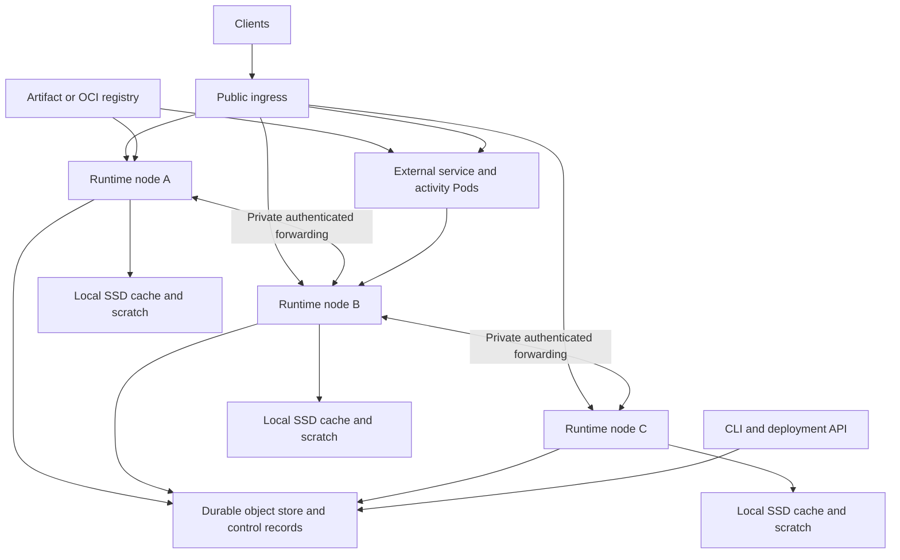

# Deployment, capacity and operations

[Design index](README.md). This document specifies the target operational model;
examples are not existing binaries, images or supported configuration.

## Fleet topology

Run one Rust runtime process per Pod or VM, with a unique boot session identity,
private local working directory, authenticated peer endpoint and the same
qualified origin store. Kubernetes performs process placement and restarts;
the platform control CAS determines Cell ownership.



One runtime node is enough for functional development and can recover from
object storage after restart. Two or more nodes enable failover; three nodes
are a useful production starting topology with rolling-maintenance capacity,
not a requirement of a three-voter consensus protocol. Object-store deployment
has its own redundancy requirements. One disposable RustFS process does not
establish a highly available storage backend.

A minimal fleet needs runtime nodes, durable object storage and an ingress
endpoint. TLS/identity and artifact storage can use existing customer systems.
It needs no continuously running central placement leader. Deployment API and
scheduler roles initially run in the runtime binary. External application
containers add Pods according to the application's needs.

Kubernetes uses a Deployment for replaceable runtimes, a public Service for
entry traffic and direct private Pod endpoints for peer traffic. Mount a private
ephemeral/PVC-backed cache on each Pod; never share one writable SQLite directory
between Pods. A StatefulSet/PVC can improve cache reuse but is not an ownership
mechanism. On VMs, systemd or another supervisor starts the same process.

## Building and deploying applications

The proposed manifest declares executable units, bindings and required
capabilities. Values below illustrate shape; they are not capacity defaults:

```toml
name = "order-service"
manifest_version = 1

[[services]]
name = "api"
runtime = "javascript"
entry = "src/http.ts"

[[cells]]
name = "inventory"
runtime = "javascript"
entry = "src/cells/inventory.ts"
contract = "contracts/inventory.json"
migrations = "migrations/inventory"
partition = "explicit-key"

[[kv]]
name = "settings"
partition = "scoped"
virtual_shards = 256

[[queues]]
name = "invoice-jobs"
virtual_shards = 64

[[workflows]]
name = "fulfillment"
entry = "src/workflows/fulfillment.ts"
runtime = "javascript"
virtual_shards = 64

[[workers]]
name = "invoice-renderer"
runtime = "container"
image = "registry.example.com/orders/invoice@sha256:<build-digest>"
activities = ["render-invoice"]

[[routes]]
host = "orders.example.com"
service = "api"
```

Bindings have provisioned immutable namespace IDs; changing a name does not
implicitly create or delete data. The deployment compiler checks references,
schemas, runtime support and permissions. Node resource policies are operator
configuration, while application requirements declare admission needs.
Secrets are references resolved at runtime, never manifest values or bundles.

Proposed workflow:

```sh
crab-platform dev
crab-platform build
crab-platform deploy --fleet staging
crab-platform deployment status --fleet staging
crab-platform deploy --fleet production
```

Build emits a deterministic inventory of JS bundles or WASM components,
contract/migration digests, static assets, OCI image references and required
host/format capabilities. Native Rust applications build an operator-owned
runtime image containing registered modules. Container applications build their
ordinary OCI images and link to the platform through workload credentials.

Deployment proceeds as follows:

1. Authenticate a deployer and validate the manifest, artifacts and capacity.
2. Upload immutable artifacts; verify digests, size limits and provenance.
3. Strict-create namespace/catalog entries for new bindings. Conflicts require
   compatible existing identities rather than accidental replacement.
4. For container units, submit generated Kubernetes resources using the chosen
   cluster adapter, then wait for readiness. VMs use the operator's container
   supervisor and publish readiness through the deployment API.
5. Warm required language modules on eligible nodes and run readiness probes.
6. CAS the application's desired deployment pointer; ready ingress nodes route
   new invocations using that version's binding map.
7. Report desired, ready and active version counts and any Cells requiring
   migration, instead of declaring all state changed at pointer publication.

An OCI registry remains the source of container image bytes. The platform stores
their immutable digests and deployment intent; it does not need to copy image
layers into the Cell object graph.

## Code and schema upgrades

A desired deployment update does not atomically migrate every database. A
Cell's published control records its active code/schema version. Route commands
to a compatible owner/module. To upgrade a Cell: drain accepted commands,
acquire/retain valid ownership, validate migration prerequisites, execute the
bounded migration and publish its root with the new code/schema identity in
the same control CAS. Only then accept new-version commands for that Cell.

Schema migration failure leaves the old published root authoritative. A local
commit followed by failed publication enters reconciliation as any command does.
Large migrations use an explicit maintenance/copy protocol with progress roots,
capacity reservation and a final cutover; do not exceed transaction budgets by
calling every schema change a small migration.

Compatible app rollouts can coexist by deployment digest. Incompatible changes
require a maintenance cutover: gate new commands, drain old ones, migrate and
verify affected Cells, then switch routing. Every native module build and guest
runtime declares which schema/host versions it can serve. A lagging node must
reject an unsupported version before mutation.

Workflow instances pin their definition and deployment for their lifetime.
Retain those modules and compatible workers until runs finish or undergo an
explicit state migration. Shared workflow-shard schemas must support the pinned
definitions; updating shard storage cannot discard fields old runs require.
Queue messages similarly carry the handler contract version, with compatible
consumers or a controlled message migration.

Rollback of routing is safe only when the old code can read the current schema
and effect contracts. Otherwise perform a forward fix or approved data restore
into a new incarnation. Restoring a snapshot can lose later acknowledged writes
and does not reverse external activities; it is not a routine code rollback.

## Authentication and tenant isolation

Authenticate public requests before provisioning or activating Cells. Bind
application identities to tenant/namespace/action permissions, including separate
deployment, migration and administrative rights. Private peers use mTLS and
authenticated forwarded principal context; reject caller-supplied owner headers.
Lease tokens are opaque capabilities and must be scoped and redacted in logs.

Guest imports grant only declared bindings, with no ambient bucket credentials.
External services obtain short-lived workload credentials. Operator storage
credentials use the existing Crab provider/credential construction path. Raw
control traffic bypasses read caches, staging and asynchronous storage replicas.

Sandbox untrusted code in qualified JS/WASM workers with resource limits and
restricted host imports. For mutually untrusted tenants needing stronger fault
isolation, use separate processes/Pods or dedicated node pools. Native Rust
modules are trusted operator extensions and do not provide a tenant sandbox.

Store secrets outside deployment artifacts and redact SQL parameters, message
bodies, tokens and blob URLs from telemetry. TLS and provider encryption are
baseline requirements; per-tenant application encryption/key rotation is a
separate retention and restore contract to qualify before advertising support.

## Resource profiles and capacity targets

The requested hardware envelopes and write target are:

| Profile | vCPU | RAM | SSD |
| --- | --- | --- | --- |
| Small | 1–2 | 2–4 GB | 50–100 GB |
| Medium | 4–8 | 8–16 GB | 100–200 GB |
| Large | 16 | 32–64 GB | 500–1,000 GB |

The workload target is 1,000 TPS **aggregate per node**, with 1K–10K active
databases, typically 100–5,000 MB each. These are workload and hardware inputs,
not evidence that each small node can sustain the largest target. Measure the
feasible envelope independently per profile and reject overload visibly.

Report `registered`, `owned`, `open` and `executing` database counts separately.
For the stated active-DB target, measure simultaneously open databases; do not
substitute 10K dormant identities for 10K active sessions. A practical fleet can
own more Cells than it keeps open, but that is a separate benchmark.

At 10K databases the logical volume spans 1–50 TB. The local SSD need hold only
the working set plus WAL, staging and recovery scratch. At 4 KiB pages, 5,000 MB
has about 1.22 million pages; a 60-byte-per-page index costs about 73 MB for one
full index before in-memory structures. Ten thousand such indexes are about
732 GB. Therefore bounded authenticated metadata and streaming maintenance
are prerequisites for this target, not optional optimizations.

Memory admission must satisfy:

```text
runtime baseline + guest heaps + open SQLite caches + resident metadata
  + in-flight capture/recovery/network buffers + queued requests
  + safety reserve <= node or cgroup memory limit

cached pages + WAL + pending cuts + scratch + active upload pins
  + safety reserve <= local SSD budget
```

Reserve CPU and memory for replication/renewal under load; do not let a saturated
guest pool prevent ownership progress. Use byte-weighted admission, tenant
fairness, bounded mailboxes and gradual recovery. Reject new activation before
allocating unbounded metadata. Large-database policy must explicitly raise the
current LTX 256 MiB default only after the new budgets admit the operation.

Object-store latency is in the command acknowledgement path. With one outstanding
publication per Cell, throughput for one hot Cell is bounded by its serialized
SQL/capture/upload/CAS cycle. For example, an illustrative 20 ms cycle permits
roughly 50 publications/s per Cell; reaching 1,000 aggregate TPS needs enough
independent Cells/concurrency or future qualified group publication. This is
arithmetic, not a latency forecast. Track logical commands separately from SQL
transactions, LTX cuts, object PUTs and queue lease mutations.

Account for ownership traffic separately: 10K owned Cells renewed every three
seconds would require roughly 3,333 control updates/s before user commits.
Successful commits can carry renewal progress, and idle ownership can be released,
but neither removes the need to measure this cost for the simultaneous-active
target. A node-level lease optimization would change the authority protocol and
needs its own fencing proof; do not assume it is supplied by node heartbeats.

Batching multiple cuts into a shared object can reduce PUT cost but does not
remove per-Cell control CAS. Node-wide shared-bundle ownership and GC require
additional cross-Cell reachability rules before enablement.

## Retention, backups and garbage collection

Retained roots include current Cell roots, explicit backups, active read pins,
published blob references, pending upload pins and workflow/deployment versions.
A root must expose all transitive LTX and application blob dependencies. Leases
and timestamps alone cannot prove an object unreachable.

The initial destructive GC procedure uses a scoped maintenance barrier: stop
new publication, restore/pin changes and blob uploads for the application;
drain accepted work; then enumerate its complete durable catalog and roots,
mark dependencies and delete only unmarked objects outside grace. Keep the
barrier active through deletion and verify that no publisher can bypass it.
The first implementation may satisfy this with an offline procedure: stop all
application writers/schedulers, remove their storage write access, settle
in-flight requests, and collect with a separate scoped maintenance identity.
A serving online barrier requires persisted admission and per-Cell fencing,
including catalog, deployment and pin writers; a process-local pause is insufficient.
Do not run a naive concurrent mark/sweep while new roots can reference an old
unmarked object. Online GC needs a publication/pin epoch protocol and race proof
before it becomes a supported scalable maintenance path.

Backups pin each Cell's incarnation and exact root. A manifest containing many
roots is a collection of per-Cell snapshots; a globally consistent application
backup needs a write/effect barrier. Restore verifies the graph before starting
writers. Restore to an isolated application by default so timers, queues and
outbox rows cannot unexpectedly repeat production side effects during inspection.
Promoting a restored application requires an explicit effect/redrive decision.

## Lifecycle and observability

Readiness requires supported artifacts, usable origin control, local capacity
and functioning executors. Liveness tests process health; transient bucket
failure should not cause a fleet-wide restart storm. Drain stops new ownership
and commands, resolves accepted publication, hands off or releases Cells, closes
SQLite and joins supervised workers. If reconciliation cannot finish by process
shutdown, retain diagnostic state and let the next owner resolve published data.

Export command latency split into admission, SQL, capture, upload and CAS;
unknown outcomes; active/open Cells; memory/SSD reservations; hydration bytes;
compaction debt; owner changes; wakeup lag; queue age/lease expiry; workflow
retries; and artifact/version readiness. Avoid unbounded Cell IDs in metric
labels; use sampled traces and scoped inspection for per-Cell diagnosis.

Runbooks must cover origin outage, full SSD, ownership churn, oversized hot
Cells, unsupported deployment, stuck effect delivery and restoration. Publish
per-profile latency/capacity evidence only after the [qualification plan](delivery.md)
passes with the actual provider and filesystem.
