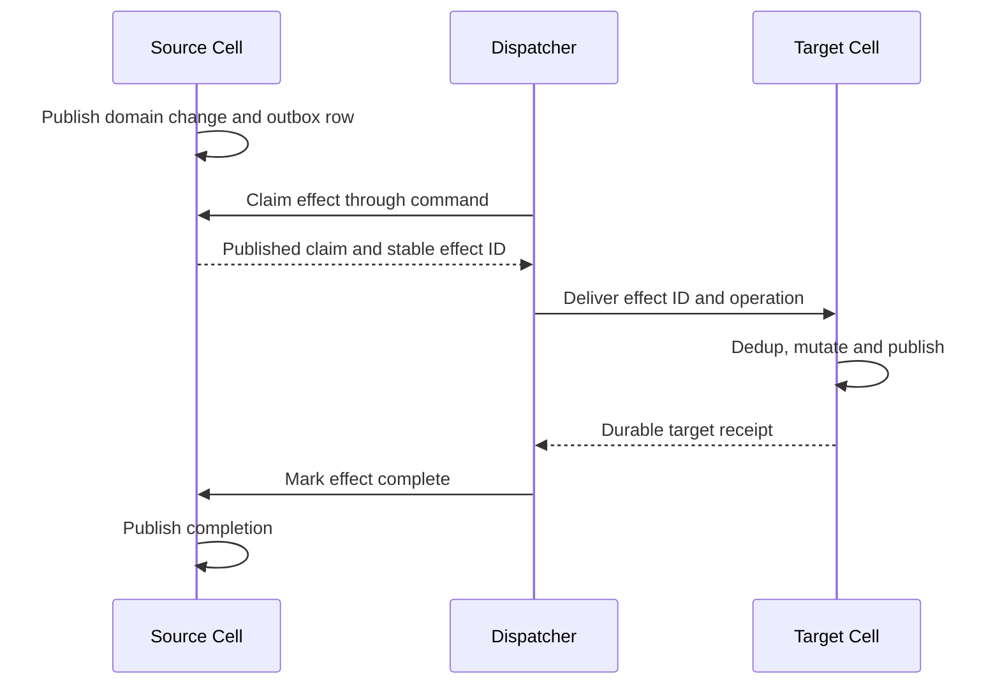

# SQL, KV, Queue and Workflow primitives

[Design index](README.md). All APIs and schemas here are proposed. The schemas
show necessary invariants, not complete executable migrations.

## One implementation, shared durability

Rust primitive handlers receive an authorized binding, resolved Cell identity,
validated operation and transaction capability from the Cell runtime. The same
handler serves native Rust, JS host calls, WASM imports and HTTP/gRPC requests.
Transport adapters validate representation; handlers own domain semantics;
the runtime owns transaction/publication ordering.

| Primitive | Cell partition | Atomic operations | External work |
| --- | --- | --- | --- |
| SQL | Named DB or explicit application partition | One command or atomic batch | Durable outbox |
| KV | Fixed virtual shard or explicit colocated scope | Conditional mutations within one shard | Large blob uploads before reference publication |
| Queue | Fixed queue shard or explicit ordering group | Enqueue, claim, ack, retry, lease change | Consumer execution after published claim |
| Workflow | Fixed workflow shard containing many instances | One event, state transition and effect intents | Leased activity workers |

Namespace manifests freeze shard count, partition algorithm and encoding.
Length-prefix components before hashing. In ordinary KV mode, partition by key;
in scoped mode, partition by scope alone and store the complete key within it.
Including the key in the scoped hash would break multi-key colocation.
Increasing node count moves ownership, not keys. Changing virtual partitioning
requires an explicit data migration and new partition-map version.

## SQL

Expose `query`, `execute` and `batch`; a batch is always atomic within one Cell.
Avoid a mode flag that makes otherwise identical calls partially commit.
Return column descriptors and ordered arrays of typed values, preserving
duplicate column names and SQL NULL. An empty result still carries column types
where the driver can provide them; unknown dynamic types remain explicit.

SQLite serializes writers and supports read snapshots; see the upstream
[isolation contract](https://www.sqlite.org/isolation.html). Platform replication
adds the publication barrier defined in [runtime](runtime.md). SQLite COMMIT by
itself does not establish the platform's remote-durability receipt.

Native Rust and embedded guest commands can branch using a transaction handle:

```rust,ignore
fn reserve(tx: &mut CellTransaction, input: Reserve) -> Result<Reservation> {
    let changed = tx.execute(
        "UPDATE inventory SET available = available - ?1
          WHERE sku = ?2 AND available >= ?1",
        &[input.quantity.into(), input.sku.clone().into()],
    )?;
    if changed != 1 {
        return Err(ServiceError::InsufficientInventory);
    }
    tx.outbox().enqueue("fulfillment", input.reservation_id, &input)?;
    Ok(Reservation { id: input.reservation_id })
}
```

The runtime supplies the transaction and stores the result/idempotency record.
The callback returns a decision to commit; only the runtime can publish and
acknowledge it. A remote SDK instead submits an atomic batch or invokes a
deployed command. It does not hold BEGIN/COMMIT open across client requests.

Application SQL cannot modify system tables. Use SQLite authorization hooks
and a capability-restricted connection path; table-name conventions alone are
insufficient. Reject transaction-control SQL, ATTACH, extension loading and
pager/VFS PRAGMAs that bypass runtime ownership. Apply statement, row, returned
byte, execution time, changed-page and database-size limits. Migrations run
through a separate authorized deployment operation under Cell ownership.

## Transactional inbox and outbox

All primitives share these runtime-owned concepts:

```sql
CREATE TABLE sys_requests (
    incarnation BLOB NOT NULL,
    request_id BLOB NOT NULL,
    operation_digest BLOB NOT NULL,
    result BLOB NOT NULL,
    commit_sequence INTEGER NOT NULL,
    retain_until_ms INTEGER NOT NULL,
    PRIMARY KEY (incarnation, request_id)
);

CREATE TABLE sys_effects (
    effect_id BLOB PRIMARY KEY,
    destination BLOB NOT NULL,
    operation BLOB NOT NULL,
    created_sequence INTEGER NOT NULL,
    state TEXT NOT NULL,
    attempt INTEGER NOT NULL DEFAULT 0,
    next_attempt_ms INTEGER NOT NULL,
    lease_token BLOB,
    lease_deadline_ms INTEGER
);
CREATE INDEX sys_effects_due ON sys_effects(state, next_attempt_ms);
```

An outbox dispatcher obtains work through Cell commands; it does not read a
writer's tentative SQLite tables directly. Publish the claim before dispatch.
The target stores the effect ID in its inbox in the same transaction as its
business mutation, and publishes before replying. The source then publishes
completion. Crash anywhere between target commit and source completion causes
redelivery with the same effect ID.

This makes the source mutation atomic with the intention to deliver, not with
the destination's state change. Destination dedup retention must cover the
source's maximum delivery/retry/redrive horizon. Expired effects require an
explicit redrive decision with a new identity; silently deleting inbox records
while old effects can retry would repeat business effects.



## KV

A KV namespace uses multiple shard databases. Millions of keys do not imply
millions of SQLite files. Partition configuration is provisioned durably before
accepting writes; each shard is a schedulable Cell.

```sql
CREATE TABLE kv_entries (
    key BLOB PRIMARY KEY,
    version BLOB NOT NULL,
    inline_value BLOB,
    object_digest BLOB,
    size_bytes INTEGER NOT NULL,
    expires_at_ms INTEGER,
    metadata BLOB,
    CHECK ((inline_value IS NOT NULL AND object_digest IS NULL)
        OR (inline_value IS NULL AND object_digest IS NOT NULL))
);
CREATE INDEX kv_expiration ON kv_entries(expires_at_ms)
    WHERE expires_at_ms IS NOT NULL;
```

Use opaque versions that do not repeat after delete/recreate. Derive them from
the Cell incarnation and monotonic mutation sequence, or allocate equivalent
nonreusable tokens. Restarting a row counter at one creates an ABA bug in CAS.

Operations are `get`, `put`, `delete`, `list(scope)` and
`atomic(scope, checks, mutations)`. A conditional mutation checks version or
absence and changes all selected rows within one transaction. Expired entries
are logically absent according to owner-supplied time even before cleanup.
The same logical expiration rule applies to `get`, checks, delete and list.
Use one sampled time per operation; record chosen absolute expiry in its command.

For large values, stream an immutable blob upload, validate its digest and size,
then publish the SQLite reference. Upload admission and temporary reachability
pins precede upload. The reference and root must preserve the blob dependency
for backup/GC. A failed conditional mutation can leave an unreferenced object;
it is collected only through the retention protocol. The inline threshold is a
measured storage policy, not a new caller-visible correctness mode.

Scope-local listing is ordered by key with a cursor tied to query, scope,
snapshot and expiry. Namespace-wide listing over hashed shards fans out and
merges bounded pages; its contract is a set of per-shard snapshots, not one
global instant. A cursor encodes bounded server-held snapshot state or references
it by token. Do not promise a global atomic prefix scan from hashed partitioning.

## Queue

Each shard owns messages and their leases. Default queues are at-least-once
with no global FIFO promise. An ordering group maps to one shard; strict group
ordering, if exposed, permits one in-flight message per group and constrains
throughput. A shard hot spot requires application repartitioning or migration.

```sql
CREATE TABLE queue_messages (
    message_id BLOB PRIMARY KEY,
    payload BLOB NOT NULL,
    state TEXT NOT NULL,
    attempts INTEGER NOT NULL DEFAULT 0,
    available_at_ms INTEGER NOT NULL,
    lease_token BLOB,
    lease_deadline_ms INTEGER,
    created_sequence INTEGER NOT NULL
);
CREATE INDEX queue_ready ON queue_messages(state, available_at_ms);
CREATE INDEX queue_leases ON queue_messages(state, lease_deadline_ms);

CREATE TABLE queue_dedup (
    producer_key BLOB PRIMARY KEY,
    payload_digest BLOB NOT NULL,
    message_id BLOB NOT NULL,
    retain_until_ms INTEGER NOT NULL
);
```

Dedup records are separate from live messages so acknowledgement cannot erase
producer dedup immediately. Reject reuse with a different payload. Large message
bodies may use immutable blob references under the same retention rules as KV.

`send` publishes insertion. `receive` is a mutating command: reclaim expired
leases, select a bounded ready batch and install new unpredictable lease tokens
inside one transaction. Publish before returning payloads. Scope every row
mutation to its queue/shard and complete message identity.

`ack`, `retry` and `extend_lease` validate the current token, message state and
deadline. A stale worker cannot acknowledge or extend a replacement delivery.
Publish changes before success. If lease publication consumes most of its
duration, renew or suppress delivery; never hand out an already expired lease.
Queue deadlines use a qualified wall-clock policy with bounded skew and clock
jump handling. Fencing tokens prevent stale acknowledgements even when timing
causes an extra delivery; exactly-once external execution is not implied.

Cross-Cell dead-letter delivery uses an outbox. Mark the source `dead_lettering`
and create the delivery intent atomically, keeping its payload reachable. Retire
it after the destination's deduplicated publication. A single atomic MOVE across
two queue databases is not available.

Long polling waits outside SQLite. Notifications wake waiters but are hints;
the durable `receive` command decides what can be delivered. Polling deadlines,
consumer credits and maximum bytes bound buffering. When a disconnected receive
may have published leases, redelivery follows lease recovery rather than an
unbounded transport replay of the original payload batch.

## Workflow

Workflow orchestration is a Rust state machine over sharded SQLite databases.
Many workflow instances share each shard. Bind every instance to a unique
`run_id`, definition version and deployment digest; reusing a business workflow
ID for a new run must not accept completions from the old run.

```sql
CREATE TABLE workflow_instances (
    workflow_id BLOB PRIMARY KEY,
    run_id BLOB NOT NULL UNIQUE,
    definition_digest BLOB NOT NULL,
    deployment_digest BLOB NOT NULL,
    status TEXT NOT NULL,
    state BLOB NOT NULL,
    revision INTEGER NOT NULL,
    result BLOB
);
CREATE TABLE workflow_events (
    run_id BLOB NOT NULL,
    sequence INTEGER NOT NULL,
    event_id BLOB NOT NULL,
    payload BLOB NOT NULL,
    PRIMARY KEY (run_id, sequence),
    UNIQUE (run_id, event_id)
);
CREATE TABLE workflow_activities (
    run_id BLOB NOT NULL,
    activity_id BLOB NOT NULL,
    attempt INTEGER NOT NULL,
    state TEXT NOT NULL,
    input BLOB NOT NULL,
    lease_token BLOB,
    lease_deadline_ms INTEGER,
    available_at_ms INTEGER NOT NULL,
    PRIMARY KEY (run_id, activity_id)
);
CREATE INDEX activities_ready
    ON workflow_activities(state, available_at_ms);
CREATE TABLE workflow_timers (
    run_id BLOB NOT NULL,
    timer_id BLOB NOT NULL,
    due_at_ms INTEGER NOT NULL,
    state TEXT NOT NULL,
    PRIMARY KEY (run_id, timer_id)
);
CREATE INDEX timers_due ON workflow_timers(state, due_at_ms);
```

A transition receives serialized state, one validated event and deterministic
context, then returns new state and effect descriptions. Persist event dedup,
state, activities/timers and result in one transaction and publish it. Rust,
JS or qualified WASM can implement the transition. No network or arbitrary time
read is available to it. A state-machine implementation does not need to replay
all history on every activation; history supports audit/debugging and explicit
versioned replay where implemented.

```text
Pending + Started
  → Building + ScheduleActivity(build, stable activity ID)

Building + ActivityCompleted(build, current attempt/token)
  → Completed + StoreResult(artifact reference)

Building + ActivityFailed(build, retryable)
  → Building + ScheduleRetry(existing activity ID, next attempt)
```

An activity claim is a published mutation, with the same lease discipline as
Queue. Workers may run in any language. Completion includes run ID, activity ID,
attempt and lease token; duplicate accepted completions return the stored result,
while stale attempts cannot advance the workflow. External idempotency keys use
the stable run/activity identity across retries. Attempt numbers alone would
allow duplicate payment or provisioning effects.

Signals are events with stable dedup IDs. Timers fire through commands that
check the persisted timer ID/status and atomically record delivery. Cancellation
is also an event: it suppresses future scheduling and rejects stale completions
according to the definition, but cannot undo external work already in progress.
Compensation is explicit workflow logic, never an automatic distributed rollback.

Persist large activity results as immutable blobs and include them in retention
roots. Bound event/state size and history growth. Pruning completed runs observes
the configured event, dedup, activity-redelivery and deployment retention horizons.

The convenient `await step(...)` API is a later layer. It needs deterministic
replay, stable step IDs, recorded nondeterministic results, versioning and replay
tests. It cannot be implemented by serializing JS promises, stack frames or Rust
futures. The explicit transition API is sufficient for the first implementation.

## Waking cold Cells

Process-local timers are wake hints, not durable scheduling authority. Every Cell
with outbox work, queue leases/retries or workflow timers publishes a conservative
`next_due_time` in its control record in the same CAS as its database root.
Derive the summary from that committed state. A summary may wake too early;
it must never hide earlier durable work.

Scheduler workers divide the application's durable catalog into bounded scan
ranges using placement hints. They inspect control summaries, request Cell
activation when due, and submit idempotent scheduling commands. Multiple workers
can race safely: Cell ownership and row tokens decide. Workers periodically
rescan all assigned catalog ranges, redistributing after node loss. Notifications
accelerate this scan but losing one cannot permanently strand a cold workflow.

The baseline cost is proportional to catalog/control records, not database
pages. Measure scan period and read cost at 10K Cells. Hierarchical due-work
indexes can be introduced only with an outbox-backed registration and repair
protocol that cannot lose wakeups across their separate Cell transactions.

## Blob primitive and consistency limits

Provide verified immutable `upload`, `read`, `pin` and `release` handles for KV,
queue/workflow payloads and application artifacts. Logical object names can live
in a dedicated SQL Cell. Reference publication follows upload completion.
This is enough for the first four primitives; multipart namespace semantics and
an R2/S3-compatible API require a separate design and qualification.

The host maintains a system blob-reference table within each Cell transaction.
Publishing a blob handle inserts its digest/length and logical owner; removing
the last logical reference retires that row. Initial backup/GC opens each pinned
SQLite root read-only and enumerates this table as well as its LTX dependencies.
That can be expensive but is exact. Later authenticated reference sidecars may
accelerate traversal only if publication verifies equivalence to the transaction's
reference state. A digest stored as arbitrary application text is not a managed
blob reference and does not implicitly pin an object.

None of these primitives gives a cross-Cell snapshot or global transaction.
For example, debit in account A plus credit in B requires a transfer workflow
with reservations, idempotent effects and compensation. If both must change in
one SQLite transaction, choose a partition that deliberately colocates them.
