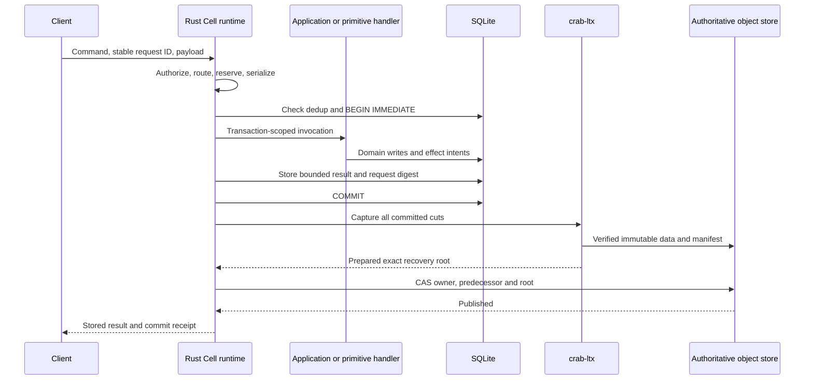

# Cell runtime and durability

[Design index](README.md). Proposed contracts; source baseline in the index.

## Identity and persisted authority

Resolve a binding to an authorized namespace before routing. A Cell identity
contains tenant ID, application ID, namespace ID and partition bytes. Encode
components with length prefixes and domain separation before hashing; ambiguous
concatenation of namespace and key bytes must not alias two Cells. Public names
resolve to stable IDs, so renaming a service does not move its databases.

Keep these counters distinct:

| Field | Meaning |
| --- | --- |
| `incarnation` | Database replacement/restore lineage; changes on deliberate reset |
| `owner_epoch` | Monotonic fencing number; changes on every acquisition |
| `control_revision` | Increases for every conditional control update |
| `commit_sequence` | Logical committed operation sequence within an incarnation |
| `ltx_position` | Exact LTX TXID and database checksum; may advance during maintenance |
| `deployment_digest` | Code and binding version admitted for this Cell |
| `schema_version` | Transactionally installed application schema |

Illustrative control record:

```text
Control {
  cell_id, incarnation, owner_epoch, control_revision,
  state: recovering | serving | draining | idle | tombstoned,
  owner: { session_id, private_endpoint, progress_sequence } | absent,
  published: { root_digest, commit_sequence, ltx_position },
  deployment_digest, schema_version, format_capabilities,
  next_due_time: optional conservative scheduler wake time
}
```

The opaque provider update token accompanies the read; it is not a content
checksum. Owner changes, renewals, user commits and maintenance roots all update
this same control key. A coordinator serializes those transitions per Cell.
Checksums validate data integrity against a trusted root; they do not authenticate
an attacker who can replace both data and authority. IAM protects authority.

Proposed physical namespace, independent of repository Git paths:

```text
platform/v1/apps/<app-id>/catalog-root
platform/v1/apps/<app-id>/deployments/<digest>
platform/v1/apps/<app-id>/cells/<cell-id>/control
platform/v1/apps/<app-id>/cells/<cell-id>/objects/<digest>
platform/v1/apps/<app-id>/pins/<pin-id>
platform/v1/nodes/<session-id>
```

The application catalog uses bounded immutable pages behind a conditional root.
Provision a Cell/namespace entry before accepting its first operation. Concurrent
provisioning can leave empty catalog entries, which are safe. The catalog lets
schedulers and backup tools enumerate durable work without trusting LIST to be
complete. Dynamic Cell creation is rate-limited and catalog updates may batch.

## Placement and ownership

Use capacity-weighted rendezvous placement as a preference over eligible nodes.
Eligibility includes memory/SSD reservations, runtime and format support,
tenant policy and deployment availability. A node must reserve activation
capacity before attempting acquisition. Placement is sticky while an owner is
healthy, with hysteresis to limit churn as capacity reports change.

An entry node authenticates the caller, resolves binding/Cell identity, then
uses a cached owner hint. It either submits locally, proxies directly to that
session's private endpoint, or refreshes origin authority. Each invocation has
a bounded forwarding hop count and deadline. The public load balancer is not
used for owner-specific forwarding.

Unowned Cells can be acquired with CAS. For a suspected dead owner, observe an
unchanged progress sequence for a full takeover interval using local monotonic
time, then CAS the observed record. Any progress restarts the observation.
The owner self-fences on a conservative renewal deadline; delayed responses
cannot revive a fenced activation. Foreign wall-clock expiry is not ownership
proof. This follows the [HTTP lease contract](../../../../crates/crab-http-server/next-architecture/ownership-and-load-balancing.md).

An acquisition increments the epoch and preserves the published root exactly.
Open that root in a fresh exclusive local session, validate formats/schema,
and enable serving only after any required continuation or migration root is
published. No new full database snapshot is required merely to activate a
verified sparse continuation. That optimizes the HTTP design's initial full
restore/snapshot path only after integration and recovery tests prove it.

## Command execution and publication



The runtime owns the transaction boundary. Handler success requests a commit;
it does not independently acknowledge durability. Application mutations, inbox
dedup rows, result bytes and outbox rows enter one SQLite transaction. Encode
and size-check the response before COMMIT so encoding failure can roll back.

First release: one pending publication per Cell. Later requests wait in a bounded
mailbox or receive overload. Unpublished state cannot feed a read response,
an error containing application data, an activity payload, or a network call.
Compaction/checkpoint work also transfers every generated cut to the coordinator.
No maintenance operation may silently consume pending user cuts.

The successful control CAS is the mutation's linearization point. If takeover
wins first, the stale publication fails. If publication wins first, takeover
must inherit its root. A delayed success response remains valid after takeover
when it proves the already published operation.

## Cancellation, crashes and retries

Acceptance creates a supervised runtime operation independent of the caller's
wait future. Before SQL commit, cancellation requests interruption and rollback;
a request that may already have committed is treated as indeterminate. After
commit, retain ownership of the batch and reconcile publication even if the
client disconnects. Never free job reservations while blocking work still runs.

Pending local state records the expected predecessor, request identities,
captured segment metadata and publication attempt. It improves retry and
diagnostics, but local files alone cannot establish remote durability. The
currently implemented `ManagedDb::resume` restores an exact verified plan into
a fresh session; it is not crash reopening of an arbitrary surviving WAL.

On restart, recover the authoritative published root. If unpublished work was
lost with the node, it is allowed to be absent: no success was returned. A retry
with the same request ID can execute against the published lineage after the
new owner proves no durable result exists. Never merge a former owner's
tentative WAL into a successor. Future warm reopening needs an additional
verified checkpoint protocol before it can reuse local files.

| Observed outcome | Action |
| --- | --- |
| Immutable upload times out | Retry the same content identity with integrity checks |
| CAS response is lost | Pause dependent work; reread origin and reconcile |
| Same predecessor and valid ownership | Retry the same prepared transition with validated token |
| Published root or verified successor includes the request | Return stored durable result |
| Successor owner is present | Ask it to resolve the request in its published database |
| Authority cannot be read | Return `OUTCOME_UNKNOWN`, retaining the operation ID |
| Source disk disappears | Restore only acknowledged remote state; retry unknown commands safely |

Dedup identity is `(cell incarnation, request ID)` plus a canonical operation
digest. Payload mismatch is a conflict. TTL/retention is advertised to clients;
an expired dedup record cannot support an unlimited exactly-once promise.
Long-lived business identities, such as payment IDs, should be persisted by the
application independently of transport dedup retention.

## Read consistency

Offer two explicit modes initially:

- `current`: read origin control during the request and materialize that pinned
  root, or serialize behind publication on the owner and validate origin state
  for the chosen snapshot. The origin observation establishes a point within
  the request interval; a later concurrent commit does not invalidate it.
- `snapshot(receipt)`: read an explicitly pinned published root. This can be
  historical and requires a retention pin or returns `SNAPSHOT_EXPIRED`.

A minimum-position request waits for a published descendant containing that
receipt or rejects incompatible incarnations. Numeric TXID comparison alone
cannot prove ancestry. Initially return bounded materialized SQL results. Later
streaming can hold a retained immutable snapshot and release database locks;
each page carries snapshot identity and expires predictably.

## Rust execution and guest transactions

SQL handles belong to a bounded executor shard. Many inactive Cell handles may
share a shard; one database does not imply one thread. Execute synchronous native
transaction callbacks there. Embedded JS/WASM Cell invocations use worker slots
that own the guest and transaction scope; local host calls can run SQL without
a remote round trip. A slot can block on a sparse page fault, so the page I/O
driver must progress independently of the SQL/guest worker pool.

A transaction capability is valid only for the current invocation and Cell.
The runtime invalidates it at commit, rollback, trap or deadline. Commands have
CPU, wall-time, changed-page, response-byte and outbox-byte limits. Restrict
transaction host imports to local SQL, deterministic context and effect intent
creation. No fetch, arbitrary filesystem, timer wait or remote Cell invocation
is available while the transaction is open.

Trusted native Rust code is an operator trust boundary; it cannot be securely
sandboxed by API convention. An uncooperative native callback may require
process termination. Guest CPU termination also does not automatically cancel
already dispatched host I/O; Rust supervises its completion and cleans up the
transaction before releasing capacity.

## Required LTX evolution

Current [replica source](../../../../crates/crab-ltx/src/replica.rs) exposes
`replicate`, which both uploads data and CASes a per-epoch head. It does not
expose the immutable-only preparation interface required below. Proposed types:

```rust,ignore
// API shape only; these platform interfaces do not exist yet.
struct RecoveryRoot { /* cell/storage scope, digest, position, format */ }
struct PreparedRoot { /* predecessor, root, dependency closure */ }

impl ReplicaStore {
    async fn prepare_append(
        &self,
        predecessor: &RecoveryRoot,
        cuts: &CaptureBatch,
    ) -> Result<PreparedRoot>;

    async fn open_exact(&self, root: &RecoveryRoot) -> Result<VerifiedView>;
}

impl CellAuthority {
    async fn publish(
        &self,
        expected: &OwnedControl,
        prepared: &PreparedRoot,
    ) -> Result<PublishedReceipt>;
}
```

Preparation validates the predecessor and every new cut, uploads immutable
objects and returns an exact root without changing mutable authority. Bind
roots to storage scope and Cell identity so a root cannot be replayed against
an unrelated bucket. First creation, epoch inheritance, bundles and compaction
must share this preparation path. A historical receipt never grants ownership.

Use one authoritative publication route for the new platform. Whether the
existing standalone per-epoch-head convenience API remains is a separate
consumer/release-contract decision; it must not become a second authority in
the platform. Hard cutover allows replacing unreleased internal formats after
inventory and qualification, not silently weakening checksum or manifest checks.

Other required work includes authenticated block-addressable metadata, bounded
streaming capture/recovery/compaction, host-level memory estimates, a controlled
read API, and maintenance that produces prepared roots. The current
[scalability audit](../../../../crates/crab-ltx/SCALABILITY.md) documents why sparse
page data alone does not bound page-locator memory.

## Maintenance and resource ownership

Runtime reservations cover guest heaps, SQLite caches, dirty/WAL pages, capture
buffers, metadata, network buffers, local scratch, FDs and queued payloads.
Acquire byte and job budgets before reads/allocations; count semaphores alone
cannot constrain memory. Use tenant fairness and separate foreground/recovery/
maintenance pools with explicit nonzero maintenance capacity.

State transitions are `cold → activating → serving → draining → warm/cold`,
with `publishing`, `blocked` and terminal `fenced` substates. Eviction drains
accepted work and closes SQLite before releasing the owner. Initially local
files are disposable and reopening uses exact remote recovery. Warm reuse is
enabled only after checkpoint verification is implemented.

Compaction prepares a replacement graph at the same logical state and CASes it
only against its predecessor. A racing commit either wins or causes a rebuild;
maintenance cannot rewind the head. Publication success makes old inputs
eligible for retention analysis, not immediate deletion.
