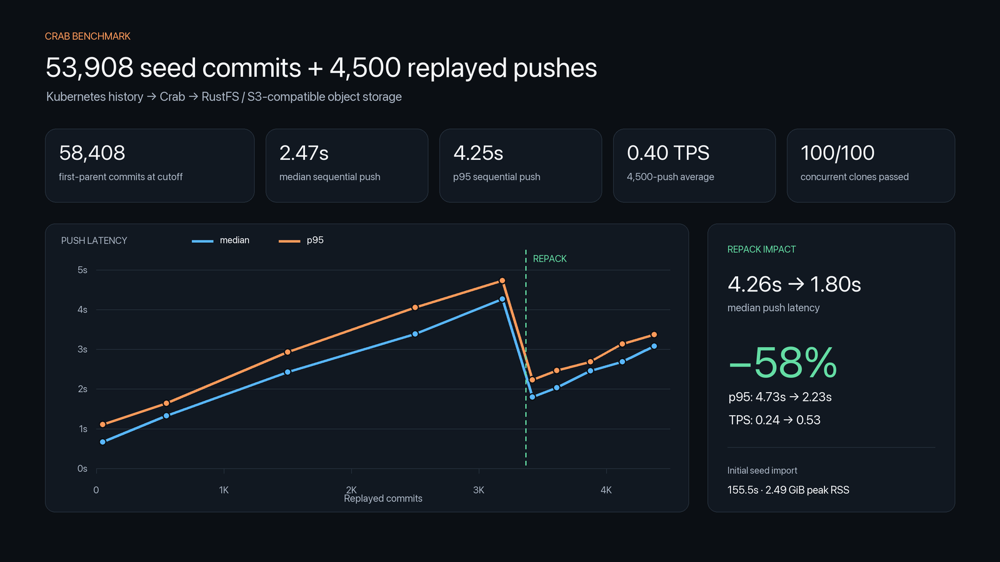
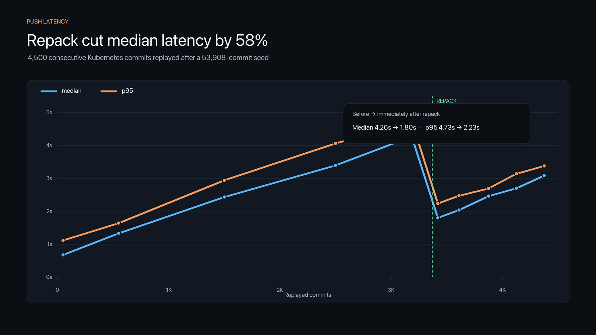
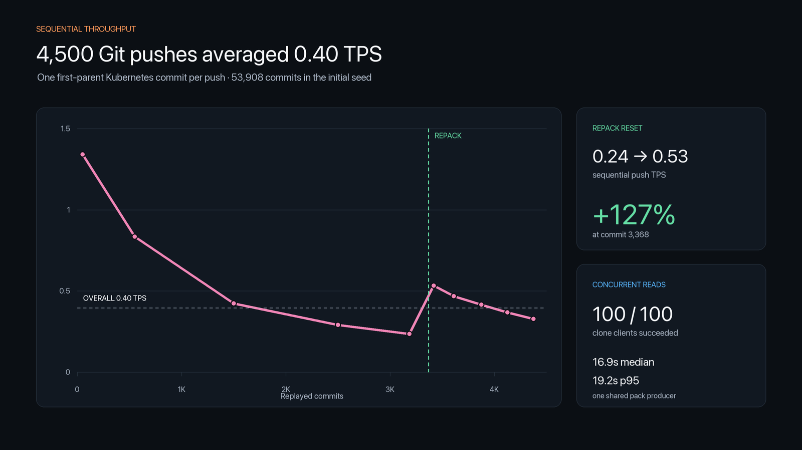

# Kubernetes 4,500-commit RustFS benchmark

Crab accepted a large Kubernetes seed and 4,500 consecutive first-parent
updates into a local RustFS-backed remote. The 4,500 replay pushes completed
at 2.470 s median, 4.252 s p95, and 4.524 s p99 latency. Their measured
command time was 3 h 9 m 21.214 s, equivalent to 23.77 sequential pushes per
minute. The initial 53,908-commit seed import took 155.539 s separately.

This is a scoped push-performance and intermediate-read benchmark. It is not
a production-provider result or a complete release qualification. Records
after replay ordinal 4,500 are excluded from every calculation and conclusion
in this report.

## Environment and method

| Item | Value |
|---|---|
| Dataset | Kubernetes first-parent history |
| Seed history | 53,908 first-parent commits |
| Seed revision | `bd55d18c75f4648b934ad0b548c017c523dd705b` |
| Replay | Ordinals 1–4,500, continuous; one commit per push |
| Cutoff revision | `b1206c60632c0588ea753f3f4bdd97a1cacc90b1` |
| History represented at cutoff | 58,408 first-parent commits |
| Push records | 4,501: one seed import plus 4,500 replay pushes |
| Destination | Isolated repository prefix in local RustFS |
| Storage path | S3-compatible API at `127.0.0.1:9000` |
| RustFS build | External deployment; exact version was not captured |
| Host | MacBook Pro, Apple M5 Pro, 18-core CPU, 24 GB unified memory |
| Platform | macOS 26.6.2, arm64 |
| Crab build | Version `1.0.1`, Git revision `4b1856c905bdd60ac568d919ca3eb74ad7d20d1b` |
| Crab binary SHA-256 | `e09b78493c26572f52695c045e828d457e1caee38390baa48dd00840781196e3` |
| Git | `2.50.1 (Apple Git-155)` |

The harness imported the seed once, then advanced the same `main` ref through
4,500 source commits in first-parent order. Each replay record measures the
complete Git push command. Sequential rate is calculated from the sum of
those command durations, excluding harness/report-writing and maintenance
time.

The exact machine model and installed memory are operator-recorded. Platform,
CPU count, tool versions, object-store endpoint, binary identity, source
revision, and individual command measurements are captured in the retained
qualification reports. The missing RustFS version prevents exact environment
reproduction and should be captured by future runs.

## Push results

| Workload | Count | Mean | Median | p95 | p99 | Max | Command time | Sequential rate |
|---|---:|---:|---:|---:|---:|---:|---:|---:|
| Initial seed import | 1 | 155.539 s | 155.539 s | 155.539 s | 155.539 s | 155.539 s | 155.539 s | 0.39/min |
| Replay 1–4,500 | 4,500 | 2.525 s | 2.470 s | 4.252 s | 4.524 s | 10.552 s | 3:09:21.214 | 23.77/min |
| Before maintenance, 1–3,368 | 3,368 | 2.532 s | 2.483 s | 4.279 s | 4.705 s | 10.552 s | 2:22:06.246 | 23.70/min |
| After maintenance, 3,369–4,500 | 1,132 | 2.504 s | 2.466 s | 3.148 s | 3.390 s | 4.921 s | 0:47:14.968 | 23.96/min |

The full replay averaged 0.396 completed sequential push transactions per
second, rounded to 0.40 TPS. Here, TPS means Git push transactions per second;
it is not the commit count contained in a batched push.

### Latency progression

| Ordinals | Pushes | Median | p95 | p99 | Max | Sequential rate |
|---|---:|---:|---:|---:|---:|---:|
| 1–100 | 100 | 0.671 s | 1.111 s | 1.556 s | 1.970 s | 80.44/min |
| 101–1,000 | 900 | 1.327 s | 1.640 s | 1.818 s | 2.226 s | 50.03/min |
| 1,001–2,000 | 1,000 | 2.430 s | 2.934 s | 3.428 s | 4.213 s | 25.38/min |
| 2,001–3,000 | 1,000 | 3.386 s | 4.055 s | 4.822 s | 10.376 s | 17.43/min |
| 3,001–3,368 | 368 | 4.263 s | 4.728 s | 5.743 s | 10.552 s | 14.10/min |
| 3,369–3,468 | 100 | 1.797 s | 2.232 s | 2.243 s | 2.247 s | 31.99/min |
| 3,469–3,750 | 282 | 2.033 s | 2.465 s | 2.526 s | 2.924 s | 28.09/min |
| 3,751–4,000 | 250 | 2.457 s | 2.687 s | 2.915 s | 3.360 s | 24.94/min |
| 4,001–4,250 | 250 | 2.691 s | 3.133 s | 3.449 s | 4.921 s | 22.05/min |
| 4,251–4,500 | 250 | 3.079 s | 3.369 s | 3.781 s | 4.484 s | 19.65/min |

The reset-and-regrowth shape indicates that pack/catalog accumulation was the
dominant scaling signal in this run. Before maintenance, the 3,001–3,368
window reached 4.263 s median and 4.728 s p95. After maintenance converged to
two active packs, the next 100 pushes measured 1.797 s median and 2.232 s p95:
a 57.8% median and 52.8% p95 reduction. Window throughput rose from 14.10 to
31.99 pushes per minute, a 126.9% increase.

Latency then accumulated gradually again, reaching 3.079 s median and 3.369 s
p95 in the 4,251–4,500 window. The result supports automated catalog admission
and geometric repack scheduling as requirements for predictable long-running
team latency.

## Repack and metadata maintenance

At ordinal 3,368, the advertised `HEAD` and `refs/heads/main` values were
captured before and after the explicit repack. Both remained
`03d1c996c7d8e08651bc554a95285f8e19b3bcbf`.

| Operation | Result |
|---|---:|
| Standalone `crab repack` wall time | 228 ms |
| Published active packs before → after | 2 → 2 |
| Published active bytes before → after | 1,097,185,730 → 1,097,185,730 |
| Standalone bytes read/written | 0 / 0 |
| Generation-owner passes to convergence | 85 |
| Generation-owner wall time | 754.415 s |
| Maintenance bytes read | 395,865,648 |
| Maintenance bytes written | 161,120,618 |
| Maintenance peak process-tree RSS | 1,154,465,792 bytes |
| Final maintenance action | `none` |
| Final active/geometric candidates | 2 / 0 |

The standalone command found the already-published two-pack manifest and did
not rewrite it. The object-store snapshot still contained 3,371 physical pack
objects totaling 1,386,477,136 bytes, including catalog-pending and historical
packs. The generation owner subsequently advanced catalog visibility and ran
bounded geometric repacks. This distinction matters operationally: published
active packs and pending catalog debt need to be exposed together.

After convergence, acceleration diagnosis reported a current manifest and
generation receipt, complete ref registry, current locator and visibility
indexes with matching pack-index hashes, a current two-layer commit graph, and
`repair_required=false`.

## Resource profile

| Replay scope | Median peak RSS | p95 peak RSS | Max peak RSS | User CPU | System CPU |
|---|---:|---:|---:|---:|---:|
| All 4,500 pushes | 127.2 MiB | 224.6 MiB | 429.2 MiB | 1,605.970 s | 2,107.180 s |
| Before maintenance | 114.6 MiB | 208.5 MiB | 317.4 MiB | 1,301.980 s | 1,590.120 s |
| After maintenance | 166.9 MiB | 241.4 MiB | 429.2 MiB | 303.990 s | 517.060 s |

The seed import peaked at 2,669,117,440 bytes, or 2.49 GiB. Capacity planning
should treat initial import and ongoing single-commit pushes as separate
workload classes.

## Concurrent read checkpoint

At replay checkpoint 100, 100 concurrent no-checkout clone clients ran against
the same RustFS-backed Crab remote.

| Metric | Result |
|---|---:|
| Successful clients | 100 / 100 |
| Fanout wall time | 19.508 s |
| Median client | 16.877 s |
| p95 client | 19.153 s |
| p99 client | 19.341 s |
| Shared pack producers | 1 |
| Cache hits / misses | 55 / 45 |
| Origin requests | 2,346 |

This proves concurrent reads only at the 100-replay checkpoint. It is not a
100-client measurement of the ordinal-4,500 state.

## Correctness evidence

The scoped evidence proves:

- all seed and replay push records through ordinal 4,500 succeeded;
- the replay ordinals are contiguous and follow the source's first-parent
  sequence;
- incremental fetch tips matched at ordinals 1, 10, and 100;
- repack preserved the advertised ref map at ordinal 3,368;
- the metadata owner converged and the acceleration checks passed after
  maintenance; and
- all 100 concurrent clone clients passed at ordinal 100.

The source checkout remained a read-only input. Its starting clean-status
digest was SHA-256
`e3b0c44298fc1c149afbf4c8996fb92427ae41e4649b934ca495991b7852b855`.

This cutoff does not prove:

- cold full, warm, blobless, and shallow clone coverage at ordinal 4,500;
- full `git fsck` and deterministic byte-identity sampling at ordinal 4,500;
- the final concurrent-fetch and concurrent-push matrix at ordinal 4,500; or
- behavior on production S3, GCS, or Azure providers.

The result therefore supports the sequential-push path at this scale and the
intermediate read checkpoint. It does not establish complete production
qualification for the terminal repository state.

## Product conclusions

1. Validate an automated maintenance trigger before latency doubles. This run
   suggests evaluating a threshold around 600–800 new single-commit packs
   after convergence for a p95 target near 3 s.
2. Show published packs and catalog debt together. One operator surface should
   report active packs, pending catalog packs, obsolete physical packs,
   estimated work, and convergence status.
3. Reduce maintenance amplification. Eighty-five owner passes and 12.6 minutes
   are too expensive as a manual recovery cycle; maintenance needs adaptive
   batching or continuous scheduling.
4. Expose latency and debt telemetry through `crab status` or `crab doctor` so
   teams can act before p95 regresses.
5. Add an explicit cutoff qualification that runs the clone, fsck,
   byte-sampling, and team-contention matrix at a chosen replay ordinal.

## Evidence provenance

- Original qualification report SHA-256:
  `b451465c4e16555126c124e5d13224c568caf0e565197b91e1667ca74752360e`
- Continuation report SHA-256:
  `eaf31b65c606578228e992ba26af6c0a3cba88d6afd67fafa8e31927518ce2fe`
- Machine-readable scoped calculations:
  [`kubernetes-4500-rustfs-summary.json`](kubernetes-4500-rustfs-summary.json)
- Harness SHA-256:
  `ee8a2f9f055bfdf704be7af787df08d82d8c422562192288dcc8764773a1f3dc`
- Verifier SHA-256:
  `6ce2dd8ba1c54594463e561ecd8b0369da61036dffe6dd11b93c707f21d5b488`

The retained raw reports and logs were not rewritten to produce this scoped
benchmark. The summary selects only the successful prefix through ordinal
4,500; later records are not included.
