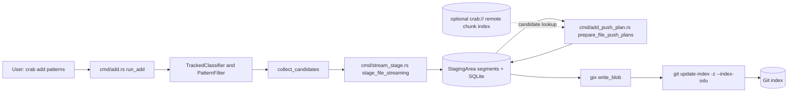
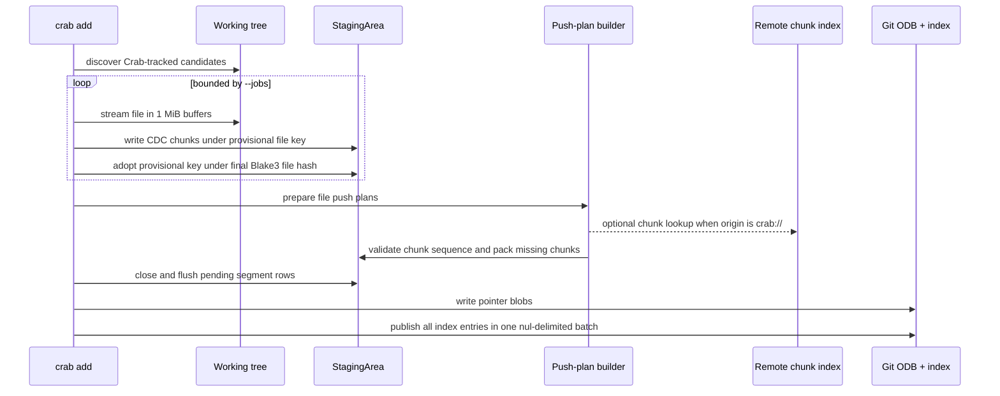
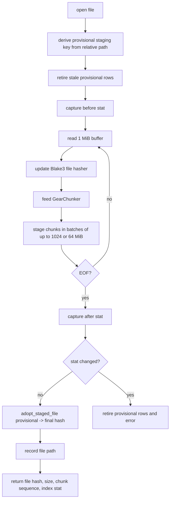
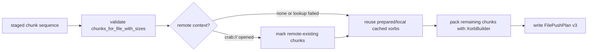
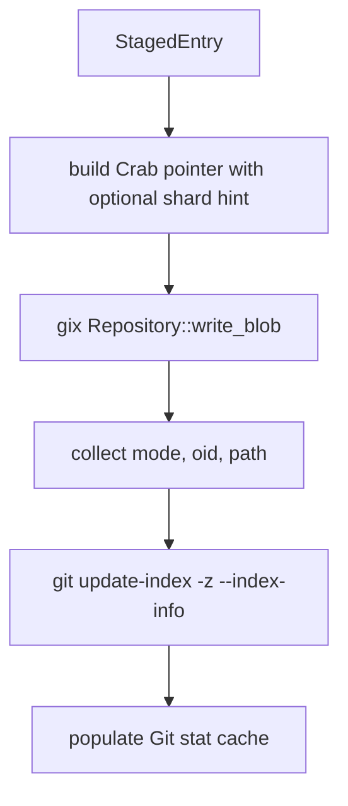

# Crab Add Operation

`crab add` stages Crab-tracked working-tree files without sending the large
file bytes through Git's clean-filter protocol. It streams each file into the
local staging area, builds add-time push plans from the staged chunk rows, then
writes small Crab pointer blobs into Git's object database and index.

## Current Architecture

The important ownership boundaries are:

| Surface | Responsibility |
| --- | --- |
| `crab/src/cmd/add.rs` | CLI orchestration, candidate discovery, progress, rollback, pointer publication |
| `crab/src/cmd/stream_stage.rs` | Bounded file streaming, Blake3 hashing, CDC chunking, provisional staging adoption |
| `crates/crab-staging/src/lib.rs` | Segment writes, SQLite rows, flush/promotion, staged-file adoption and retirement |
| `crates/crab-staging/src/add_push_plan.rs` | Add-time push-plan construction from staged chunk rows |
| `crates/crab-staging/src/push_plan.rs` | Add-time plan model, prepared-xorb payload helpers, and diagnostics |
| `crab/src/git/push.rs` | Push-time adoption of add-time plans |

## Operation Flow

## Candidate Discovery

`run_add` resolves the current worktree through
`crab/src/git/worktree.rs`, opens a `TrackedClassifier`, builds the user's
path filter, then walks the worktree.

The classifier has two modes:

- With `gix-pathmatch`, it delegates path matching to
  `crab/src/core/attrs.rs`, which reads root and nested `.gitattributes`
  using `gix_attributes`.
- Without `gix-pathmatch`, it uses the legacy root `.gitattributes`
  suffix matcher in `crab/src/cmd/add.rs`.

The empty-classifier branch exists so a repository with no Crab filter patterns
can auto-track large files before scanning again. In `gix-pathmatch` builds,
`TrackedClassifier::is_empty` separately scans root and nested `.gitattributes`
for any `filter=crab` assignment because the path matcher itself answers
per-path questions, not "are there any configured Crab patterns?"

The walker skips Git/Crab internals, non-files, paths outside the user filter,
paths not marked `filter=crab`, and files that already contain a valid Crab
pointer.

## Streaming and Staging Algorithm

`crab/src/cmd/stream_stage.rs` is the bounded-memory file path shared by
`crab add` and `crab adopt`.

The chunker and file hasher are fed from the same read loop. CDC chunks are
flushed to staging in bounded batches, and progress counters are updated from
the same stream. The staging schema keys rows by file hash, so the stream first
writes under a provisional key and then calls `StagingArea::adopt_staged_file`
once the final Blake3 file hash is known.
Because the provisional key is retired before streaming begins, the stream uses
the retired-file staging path to avoid a redundant pending-position probe for
each flush batch while keeping the general `stage_chunks_batch` stale-position
guard for shared callers.

Rollback rules:

- If streaming or staging fails, provisional rows are retired.
- If the file's verified stat changes during staging, provisional rows are
  retired and the command returns `FileChangedDuringStaging`.
- If adoption fails, provisional rows are retired.
- If path recording fails after adoption, final rows are retired.
- If any file in the batch fails before Git index publication, all unpublished
  staged entries from the batch are retired.

The provisional key is internal staging state. It is not written to pointer
blobs or committed to Git.

## Add-Time Push Plan

For repositories with a default `crab://` push remote, streaming can emit
prepared xorbs from the same verified chunks written to staging. After file
streaming succeeds and before pointer publication, add writes per-file plans for
those prepared xorbs when they cover the staged chunk sequence. If stream-built
coverage is unavailable, add falls back to `prepare_file_push_plans_with_progress`
and packs from authoritative staging rows. Repositories without a Crab remote
skip add-time push-plan preparation; push can still fall back to the staging rows
and pack from them later.

Remote behavior is opportunistic:

- If the default push remote is a valid `crab://` URL and a metadata guard can
  be opened quickly, planning checks the remote chunk index under a short
  opportunistic timeout and marks matching chunks as existing candidates.
- Small batches below the configured minimum xorb size skip the remote chunk
  index lookup entirely; the possible upload saving is too small to justify
  adding remote metadata latency to `crab add`.
- If there is no Crab remote, planning is skipped to keep `crab add` from
  writing both staging segments and speculative prepared xorbs.
- If the Crab remote URL cannot be parsed, the store cannot be opened, or the
  chunk-index lookup fails or times out, planning continues with no remote
  candidates and treats those chunks as new for this add-time plan.
- This fallback changes only prepacking work. It does not publish data and does
  not make `crab add` a push.

The plan builder no longer reconstructs original contents to prepare the plan. It
uses the `chunk_pairs` produced by streaming, verifies those pairs against
the staged file rows, carries each row's segment locator into the packing
reader, reuses prepared/local xorb cache entries when safe, and reads only
chunks that still need packing. Carrying locators avoids a second
hash-to-segment SQLite lookup during planning.

Before staging, same-size candidates with matching bounded
head/middle/tail fingerprints are grouped as possible duplicates. A later path
is fully Blake3-hashed, and only if its final hash and size match the
representative does `crab add` reuse the representative's staged chunk layout.
Duplicate candidates are queued behind only their representative, so they can
start as soon as the representative finishes instead of waiting for unrelated
files. Fingerprints are scheduling hints, not identity proof.

Normal Crab-remote adds prefer stream-built prepared xorbs when they cover the
verified staged chunk sequence. Plan writing still validates segment rows before
writing or adopting a plan, and plan loading revalidates the current staged rows
before returning indexed plan data. A verified plan is promoted into the
staging SQLite index as the authoritative add-time push plan. Prepared xorb
candidates are indexed by chunk hash so a later `crab add` can ask SQLite for
only the candidates that intersect the new file instead of scanning sidecar
files. Candidate reuse also requires the source file's indexed plan to still
revalidate against its current staged chunk rows and include the candidate
prepared xorb in the plan body. A prepared xorb may contain sibling-file chunks
from a multi-file packing batch, but it must cover at least one chunk from the
file whose plan indexes it.

The segment files are still required even when add-time prepared xorbs exist.
They are the durable staged chunk payloads for reconstruction, rollback,
verification, status, and fallback push packing. Push may adopt a verified
add-time plan when the plan still matches the staged chunk rows and the prepared
xorb files still validate. If the plan is missing, stale, corrupt, or only
partially useful, push can reread the segment-backed chunks and pack from the
authoritative staging rows. Retiring, unregistering, or adopting a staged file
removes indexed plan rows and prepared-xorb candidates so stale prepared xorbs
do not survive the file lifecycle. Replacing a file's plan also prunes
prepared-xorb payload files that are no longer referenced by the new plan.

For multi-file adds, the builder performs one remote-candidate lookup for the
batch even when prepared-cache candidates are present. When no prepared cache is
available, it also packs uncovered chunks globally so a single prepared xorb can
cover chunks from multiple files.

## Progress and JSONL

The text progress bar has four command phases:

| Phase | What moves the counter |
| --- | --- |
| `Streaming` | per-file read and CDC counters |
| `Planning` | files whose add-time push plan is prepared, plus chunks, cached xorbs, prepared xorbs, prepared bytes, and remote lookup state |
| `Flushing` | staging segment fsync and pending-row promotion |
| `Indexing` | pointer blobs staged into Git's index |

JSONL mode emits:

- `file_done` after each staged file.
- `progress` with `operation: "staging"` during file streaming.
- `progress` with `operation: "push-plan"` while preparing add-time plans.
- final `result` with `AddSummary`.

The JSONL `push-plan` event reports completed files as `current`, total files as
`total`, prepared xorb bytes as `bytes`, and prepared xorb count as
`xorbs_produced`. Because progress events are rate-limited, the terminal
`AddSummary` also carries `staging_duration_ms`, `planning_duration_ms`,
`flushing_duration_ms`, and `indexing_duration_ms` for performance analysis.

## Git Pointer Publication

`write_pointers_to_git_index` publishes only after staging and plan preparation
succeed.

Pointer blob creation is native: Crab opens the repository with `gix`, writes
the pointer payload through `Repository::write_blob`, and uses the repository's
configured object hash. The index update remains one nul-delimited
`update-index --index-info` subprocess for the whole batch.

The stat-cache population step matters because entries inserted through
`update-index --index-info` do not automatically receive the normal worktree
stat fields. Crab updates those fields after publication so a later
`git status` can avoid rehashing large files through the clean filter.

## Algorithms

### Single-pass stream stage

1. Compute a provisional staging key from the repo-relative path.
2. Retire stale rows under that provisional key.
3. Register the provisional file row.
4. Stream the file in `READ_BUF_SIZE` buffers.
5. For each buffer, update the Blake3 hasher and feed `GearChunker`.
6. Stage emitted chunks in batches capped by `STAGE_BATCH_CHUNKS` or
   `STAGE_BATCH_TARGET_BYTES`, whichever comes first.
7. On EOF, finalize the chunker and file hash.
8. Compare before/after verified stat.
9. Adopt provisional staged rows under the final file hash.
10. Record the path and return the file hash, size, chunk count, chunk sequence,
    and optional stat snapshot.

### Push-plan preparation

1. Build the wanted chunk set from streamed `chunk_pairs`.
2. Load prepared xorb cache entries and local xorb cache candidates for those
   chunks.
3. Optionally open a Crab remote metadata guard.
4. For multi-file adds, query the remote chunk index once for the whole batch.
5. For each file, validate staged chunk rows against the streamed sequence.
6. Mark size-matching remote refs as existing chunks.
7. Prefer prepared/local cached xorbs that cover file chunks still needed.
8. Read only remaining new chunks from staging in bounded batches.
9. Pack those chunks with `XorbBuilder`.
10. Write the file push plan and prepared xorb records.

### Pointer index publication

1. Build a pointer from file hash, size, and shard-hint cache.
2. Write the pointer payload as a Git blob.
3. Build a nul-delimited index-info entry with mode, blob id, and path bytes.
4. Publish all index-info entries in one Git subprocess.
5. Refresh stat-cache fields for the published paths.

## Invariants

- Git index publication happens only after the chunks referenced by every
  pointer are staged and flushable.
- Rollback retires unpublished staging rows on file errors, cancellation before
  publication, and push-plan preparation errors.
- Push plans are validated against the exact staged chunk sequence before a
  plan is promoted.
- Add-time remote lookup is an optimization, not a correctness dependency.
- The clean-filter path remains independently correct for normal `git add`.

## Authoritative Xorb Staging

Prepared xorbs can become the authoritative staging store, but only after they
replace the complete segment contract rather than only the push-plan packing
path.

| Current segment contract | Xorb-backed replacement needed |
| --- | --- |
| `chunks` and `pending_chunks` rows locate bytes by `segment_id`, `segment_offset`, and size | Chunk rows locate bytes by durable xorb id plus placement metadata |
| `get_chunk`, `get_chunks_batch`, and `get_located_chunks_batch` read framed bytes from segment files | The same readers can fetch, verify, and decompress chunk payloads from xorb files |
| `chunks_for_file_with_sizes` and `chunks_for_file_with_locators` prove ordered file coverage before push | Ordered file coverage is verified from xorb-backed rows with no segment fallback |
| Recovery truncates the current segment to a durable SQLite byte boundary and deletes torn pending rows | Recovery removes torn temp xorbs, validates committed xorb manifests, and drops rows for missing or corrupt payloads |
| `retire_file`, `sweep_orphans`, and push-inflight markers keep segment bytes alive until all readers finish | The same lifecycle protects xorb files while local pushes may still read them |
| Push rejects stale or corrupt prepared plans by falling back to segment reads | If xorbs are authoritative, stale/corrupt xorb rows are staging corruption unless another authoritative row covers the chunk |

That migration is worth doing when benchmarks show push-enabled adds are still
dominated by segment write plus add-time xorb packing. It should land as a new
staging layout with a reader abstraction and crash-recovery tests before any
segment write is removed from `crab add`.

## Improvement Ideas

1. **Stronger mutation detection.** The current single-pass path compares
   before/after verified stat. A malicious or unusual writer that preserves the
   same stat fields could evade that check. A stronger path could combine file
   descriptor metadata, platform generation fields where available, or an
   optional verification mode.
2. **Plan progress inside large single files.** The planning phase reports per
   completed file. If one file packs many chunks, an additional per-batch
   callback from `prepare_one_file_plan` would make `push-plan` progress more
   granular.
3. **Remote lookup policy surface.** The current policy is opportunistic and
   quiet except for progress/logging. If users need strictly local `crab add`,
   add an explicit product-level policy rather than another hidden fallback.
4. **Prepared-plan compaction.** Prepared xorb cache reuse can grow local
   staging metadata. A future maintenance pass could retire old prepared plans
   once a push has verified their chunks in the remote index.
5. **Authoritative xorb staging.** Add-time prepared xorbs are currently a
   verified push-plan payload cache, not the staging source of truth. Replacing
   segment bytes needs a transactional xorb manifest that serves
   `chunks_for_file_with_sizes`, chunk reads that resolve
   `(xorb_hash, chunk_index)` placements, crash recovery for partially written
   xorbs and manifests, and retire/clean accounting for xorb files. Until those
   surfaces exist, segment rows remain the authoritative staging store.
6. **Eliminate double local writes.** For push-enabled adds, the current
   architecture can write segment bytes and stream-built prepared xorb bytes for
   the same chunks. The next structural speedup is a xorb-backed staging mode
   that can serve every staging reader directly from prepared-xorb manifests,
   removing segment writes for add-owned data instead of only removing planning
   rereads and post-stream packing.

## Source Map

| Topic | Source |
| --- | --- |
| CLI orchestration and progress | `crab/src/cmd/add.rs` |
| Stream staging | `crab/src/cmd/stream_stage.rs` |
| Add-time push plans | `crates/crab-staging/src/add_push_plan.rs` |
| Staging storage | `crates/crab-staging/src/lib.rs` |
| Push-plan storage format | `crates/crab-staging/src/push_plan.rs` |
| Pointer format | `crab/src/git/pointer.rs` |
| Push-time plan adoption | `crab/src/git/push.rs` |
