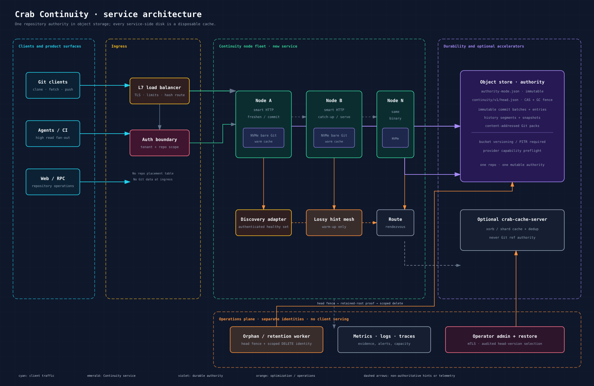
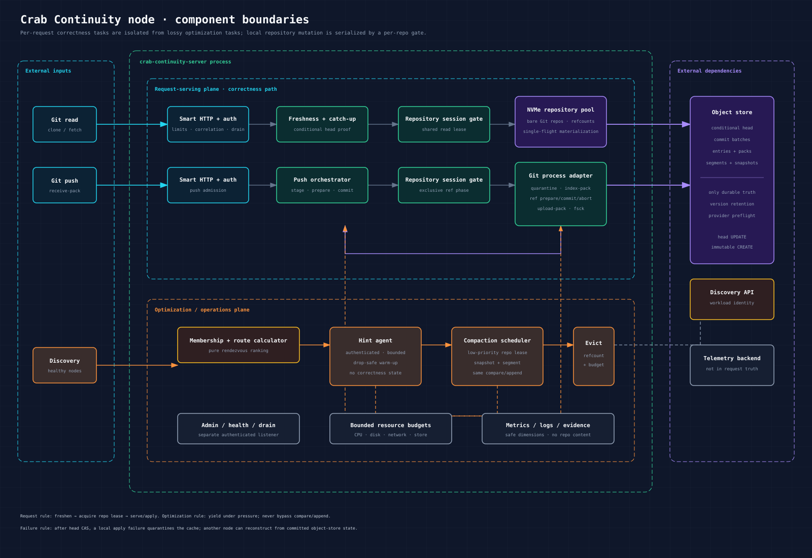
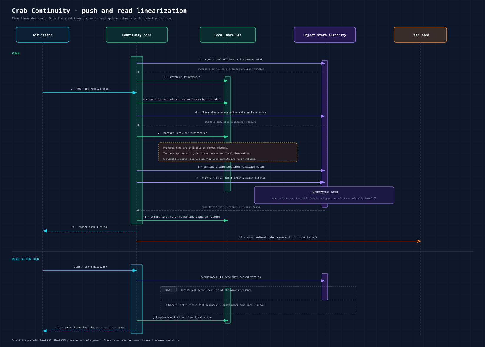

# Crab Continuity: Managed Git Storage With an Object-Store Commit Log

**A proposed managed Git service for Crab, informed by Cursor's published
Continuity architecture in [Git at any scale](https://cursor.com/blog/git-at-any-scale)
(Vicent Martí, Aug 2026). It complements Crab's serverless object-store remote;
it does not replace it.**

-----

## Document Metadata

| Field        | Value                                                                    |
|--------------|--------------------------------------------------------------------------|
| Project      | crab                                                                     |
| Scope        | Optional managed Git fleet: object-store commit log, NVMe warm caches, CAS-linearized pushes, hint-assisted replication, preferred-writer compaction |
| Status       | Proposed; architecture re-audited, prerequisite spikes and live proof pending |
| Companion to | `push.md`, `technical-design.md`, `../architecture/storage-layer.md`, `../architecture/coordination-consistency.md` |
| Inspiration  | https://cursor.com/blog/git-at-any-scale                                 |
| Version      | 1.2                                                                      |

-----

## Table of Contents

- [1. Overview](#1-overview)
- [2. Parity Traceability Matrix](#2-parity-traceability-matrix)
- [3. Background: Why Git Hosting Resists Distribution](#3-background-why-git-hosting-resists-distribution)
- [4. Architecture Overview](#4-architecture-overview)
- [5. Object Storage Layout](#5-object-storage-layout)
- [6. Write-Ahead Log Design](#6-write-ahead-log-design)
- [7. Push Path](#7-push-path)
- [8. Reference Transactions](#8-reference-transactions)
- [9. Read Path](#9-read-path)
- [10. Replication and Gossip](#10-replication-and-gossip)
- [11. Routing and Membership](#11-routing-and-membership)
- [12. Primaries and Consensus-Free Linearization](#12-primaries-and-consensus-free-linearization)
- [13. Compaction](#13-compaction)
- [14. Materialization and Eviction](#14-materialization-and-eviction)
- [15. Failure Modes, Recovery, and Provenance](#15-failure-modes-recovery-and-provenance)
- [16. Observability and Operations](#16-observability-and-operations)
- [17. Performance Targets](#17-performance-targets)
- [18. Security](#18-security)
- [19. Crab Layering: Serverless Now, Fleet Later](#19-crab-layering-serverless-now-fleet-later)
- [20. Implementation Mapping](#20-implementation-mapping)
- [21. Phased Delivery and Test Strategy](#21-phased-delivery-and-test-strategy)
- [22. Explicit Unknowns and Documented Deviations](#22-explicit-unknowns-and-documented-deviations)
- [23. Service Decomposition and Component Architecture](#23-service-decomposition-and-component-architecture)
- [24. Data Model and Storage Schema](#24-data-model-and-storage-schema)
- [25. API Design](#25-api-design)
- [26. End-to-End Data Flows](#26-end-to-end-data-flows)
- [27. Frontend Service, Plane Partitioning, and Fleet Scale](#27-frontend-service-plane-partitioning-and-fleet-scale)
- [28. Audit Decision and Delivery Checklist](#28-audit-decision-and-delivery-checklist)

-----

## 1. Overview

Continuity is Cursor's Git storage system. Its published architecture rests on
one idea: **a write-ahead log in S3-compatible object storage is the source of
truth for a Git repository; on-disk repositories are warm caches**. The
published consistency and elasticity claims follow from moving authority away
from individual disks.

This document specifies a Crab architecture with the same target properties,
not an assertion of parity. Cursor has not published its schemas, Git
integration, batching algorithm, membership protocol, recovery records, or
provider qualification. Those details are design inputs that Crab must prove
independently. [Section 2](#2-parity-traceability-matrix) is therefore source
traceability; [Section 28](#28-audit-decision-and-delivery-checklist) is the
actual delivery gate.

### 1.1 The invariant

Everything in this design serves one sentence, stated twice in the source
material:

> **Always correct when degraded, always fast when healthy.**

Concretely:

- **Correctness floor (degraded mode).** A lost gossip datagram, a failed-over
  node, a cold cache, or a partition must never produce a stale read, a lost
  push, or an inconsistent view. All correctness derives from the qualified
  object store. A node that cannot reach it fails closed.
- **Performance ceiling (healthy mode).** When nothing is wrong, gossip makes
  replicas proactive, rendezvous routing keeps repos hot on the right nodes,
  batching amortizes object-store latency, and pushes target disk-bound ingest.
  Degradations cost performance, never correctness.

### 1.2 Goals

1. Linearizable pushes: every push is totally ordered, acknowledged only after
   full durability in the WAL, and visible atomically.
2. Linearizable repository reads: each read establishes a freshness point in
   object storage before serving from a local repository. Cursor's reported
   sub-10ms probe is a benchmark reference, not a Crab SLO until measured.
3. Horizontal scalability targets in both directions: hundreds of replicas for a busy
   monorepo, one replica (or zero — pure rematerialization-on-demand) for idle
   agent-created repositories.
4. No repository-placement database, consensus protocol, or elected per-repo
   primary in Continuity mode. Fleet membership and identity still require an
   infrastructure-owned discovery source, but that source is never in the
   correctness path.
5. Full provenance: every push and every repack is recorded; operator tooling
   can reconstruct a replica at a prior committed state, identify a faulty
   operation, and recover through a reviewed compensating commit or head restore.
6. Off-the-shelf Git everywhere: all Git operations run against normal
   repositories on local disks using upstream tooling. No forked Git, no
   custom object formats reachable by clients.
7. Traceable implementation of every published Continuity property, with each
   guarantee promoted from `target` to `proven` only after its proof gate runs.

### 1.3 Non-goals

1. Wire/format compatibility with Cursor's production deployment. Their
   internal protobuf schemas, gossip cadence, and batch tuning are not public;
   we define our own equivalents ([Section 22](#22-explicit-unknowns-and-documented-deviations)).
2. Replacing Git's client-facing protocol. Clients speak ordinary Git; packs go
   over the wire exactly as Git demands. Only server-side storage changes.
3. Distributed filesystems, distributed hash tables, or any design that puts
   Git's DAG walk on the network hop-by-hop. The prior-art postmortems in
   [Section 3](#3-background-why-git-hosting-resists-distribution) close these doors.
4. A relational database for refs or anything else (the Azure DevOps trade-off;
   see [Section 3.4](#34-prior-art-azure-devops-packfiles-in-blobs-refs-in-a-rdbms)).
5. Cross-provider transactionality. The WAL lives in one bucket per
   deployment; multi-bucket replication is out of scope.
6. Transparent migration of existing Crab repositories. Continuity is a
   separate repository mode until a one-authority cutover protocol is designed
   and qualified; dual publication is forbidden.

### 1.4 Relationship to existing Crab surfaces

Crab already ships several primitives this design builds on rather than
replaces:

| Existing primitive | Location | Role in Continuity |
|---|---|---|
| `Store::{put, create_strict, update, get_with_etag}` and `cas_update` | `crates/crab-storage/src/store.rs`, `crates/crab-storage/src/cas.rs` | Building blocks for immutable writes, genesis creation, and a dedicated commit-head compare/append operation; the existing generic closure API is not sufficient by itself |
| `RefJournalTransaction` / `RefJournalHead` prepare–publish | `crates/crab-metadata/src/ref_journal.rs` | Existing serverless authority and useful audit vocabulary; its parent semantics are deliberately not reused for Continuity refs |
| Provider-neutral `Store` + `StoreLayout` | `crates/crab-storage` | All object-store access, path routing, error classification |
| Staging, chunking, dedup data plane | `crates/crab-staging`, `crates/crab-xet` | Unchanged; orthogonal to repository truth |
| Lock-then-push and active-active coordination | `crates/crab-coordination` | Existing authority models that remain separate from Continuity mode; they are not silently downgraded to optional accelerators |

Continuity mode introduces a different publication root. The current manifest,
ref-journal, and managed active-active coordinator remain authoritative for
their existing modes. One repository must have exactly one mutable authority;
see [Section 19](#19-crab-layering-serverless-now-fleet-later).

### 1.5 Re-audit verdict

The architectural idea is sound for a **managed, high-throughput Git fleet**,
but the previous draft was not implementation-ready. The re-audit found five
load-bearing gaps:

1. Sequence-named entry objects could not be written safely before the CAS
   that assigns their sequence. Entries are now content-addressed, carry a
   deterministic operation fingerprint, and receive order from the commit head.
2. A generic JSON mutation loop cannot validate expected refs, construct a
   batch, and return idempotent per-operation outcomes. Continuity needs a
   domain-specific compare/append API.
3. Crab does not yet expose conditional reads as a typed storage operation.
   `object_store` 0.14.1 supports `GetOptions::if_none_match`, but
   `crab-storage` must add and qualify the wrapper for S3, GCS, and Azure.
4. Crab's current serverless manifest/ref journal and managed active-active
   coordinator are real authority models. A Continuity commit head cannot run
   beside either one without split-brain risk.
5. The local Git reference-transaction bridge is unpublished by Cursor and is
   not implemented in Crab. A phase-zero spike must prove receive-pack
   quarantine, prepare, commit, abort, and crash behavior using off-the-shelf
   Git before the service design is approved.

Recommendation: retain Crab's current serverless architecture as the default;
build Continuity as an opt-in managed mode for hot standard-Git workloads only
after the Section 28 gates pass.

-----

## 2. Parity Traceability Matrix

Every architecture decision and guarantee stated in the source blog, mapped to
the section where Crab specifies a corresponding target. This matrix proves
coverage of the published material; it does **not** prove that Crab implements
or meets the claim. Delivery evidence is tracked separately in Section 28.

| # | Published Cursor claim | Crab design target |
|---|---|---|
| 1 | Packfiles are the irreducible network unit; within the server "Linus is not going to come over and check" | §3.1, §5 |
| 2 | Prior art: JGit DHT fails (DAG round-trips), GitHub NFS/GFS/DRBD fail (FS semantics), Spokes succeeds then hits 3PC ceiling/floor | §3.2–3.5 |
| 3 | Spokes' three optimal choices retained: don't distribute Git itself; real Git repos on NVMe; replicate with consistency | §4.3, §7, §10 |
| 4 | A push has two components: packfile + reference transaction; commits invisible until a ref points at them | §6.2, §7, §8 |
| 5 | Pack fan-out is unsynchronized; only the small ref transaction synchronizes — against one local repo, not a quorum | §7.2 |
| 6 | **Never acknowledge a push until fully persisted to the WAL** | §6.4, §7.2 steps 4, 7, and 9 |
| 7 | Each push is stored as its own WAL entry; pushed packfile written to disk and uploaded to S3 simultaneously | §6.2, §7.2 steps 3–5 |
| 8 | Visibility gate: successful local ref-transaction prepare followed by a pointer recorded in the WAL head → forces linearizability of all pushes | §6.4, §7.2 steps 5–7, §8 |
| 9 | Not one S3 write per push; tuned batching avoids the PUT-latency throughput cap; ingest as fast as disk allows | §6.5, §17 |
| 10 | Repositories live "anywhere"; treated like a warm cache; system stateless; no routing tables, no relational DB | §11.1 |
| 11 | Rendezvous hashing maps repo ID → ranked node list; all routing state is repo ID + healthy-node set | §11.2 |
| 12 | No elections, no consensus for primaries; any server can act as primary; S3 atomic CAS serializes; preferred primary = rendezvous rank 1; CAS retries delay pushes but stay correct | §12 |
| 13 | Optimistic replication via UDP gossip; unreliable transport irrelevant; packets carry only catch-up hints | §10.2 |
| 14 | Replica freshness: conditional GET with cached ETag; 304 (metadata-only, <10ms) → serve immediately; 200 → catch up from WAL, then serve | §9.2 |
| 15 | Everything built on top (agents, web UI, RPC surfaces) sees a globally consistent view | §9.1, §17.2 |
| 16 | Elasticity both directions: monorepos across hundreds of replicas; millions of agent repos at one replica; idle repos garbage-collected and rematerialized on demand | §10.4, §14 |
| 17 | Primary-only compaction applying to on-disk repo **and** WAL; replicas follow compaction events through the WAL; replicas download compacted packs instead of repacking (bandwidth for CPU); compaction frontier; no Spokes-style maintenance failovers | §13 |
| 18 | Linear read scaling to ≥100 replicas without push regression; ~120 pushes/s on S3 Standard; >300 pushes/s on S3 Express One Zone; compaction becomes the ceiling; future disk-layout work must not relax durability/consistency | §17 |
| 19 | Full provenance: track every fundamental operation; rewind and fast-forward every replica; pinpoint and revert Git bugs | §15.4 |
| 20 | "Always correct when degraded, always fast when healthy" | §1.1, §15 |
| 21 | Agent-era load: giant enterprise monorepos *and* vast numbers of tiny throwaway repos motivate bidirectional elasticity | §3.5, §16.1, §19 |

Auditor's note: rows 6, 8, 12, and 14 are load-bearing. Until live and
failure-injection proof exists, their status is `target`, not `parity`.

-----

## 3. Background: Why Git Hosting Resists Distribution

This section condenses the published reasoning because every Continuity
mechanism exists to dodge one of these walls. Readers who know the history can
skip to [Section 4](#4-architecture-overview).

### 3.1 Packfiles: the irreducible unit

Git stores objects (blobs, trees, commits, tags) content-addressed by SHA-1,
compressed into **packfiles**. Two properties dominate everything:

1. **Packfiles are both storage and networking.** The Git protocol transfers
   packs on push and fetch regardless of how a server stores data internally.
   You cannot change the wire format without changing every client.
2. **Packfile physical layout is adversarial to random access.** Objects are
   placed by a size-minimizing heuristic, mostly stored as deltas on top of
   other objects, with no correlation to DAG topology. Reading one object =
   logical hops through the graph *plus* physical hops through delta chains in
   the pack. Every nontrivial Git operation is a random walk across gigabytes.

Within your own server you may store anything however you like — but the wire
speaks packs, and whatever you store must eventually become packs cheaply.
Continuity therefore keeps packs as its data plane end-to-end: pushed packs are
stored as-is, replicated as-is, and repacked only at controlled points.

### 3.2 Prior art: distributing Git itself (object-level KV)

Git's content-addressed store maps naturally onto a distributed key-value
store: key = SHA-1, value = object. It does not work. The repository is a
directed acyclic graph; every operation walks it pointer-by-pointer, and the
value of the next pointer is unknown until the previous object is fetched. Put
that behind a network round trip per hop and trivial operations collapse.

Shawn Pearce's JGit DHT backend at Google proved the point empirically: the
system worked for normal operations, but `git clone` performance — forced
through pack generation over the DHT — was bad enough to discard the design.

**Decision:** no object-level distribution. The unit of storage and transfer is
the packfile, never the individual object.

### 3.3 Prior art: GitHub and distributed filesystems

GitHub's early scaling attempts kept the Rails monolith unchanged and tried to
make the *filesystem* distributed: NFS (fastest failure), GFS2 (short-lived),
DRBD (longer-lived, still terrible). Root cause: Git assumes local-filesystem
semantics — locking, tearing, syncing, fsync ordering — tuned for a laptop,
with no attention to network behavior. Combined with §3.1's random-access
pattern, networked filesystems crawl unless the whole pack set is locally
cached, and at six-figure repository counts caching everything is impossible.

GitHub ultimately moved repositories onto dedicated fileservers behind an RPC
layer, then solved replication with Spokes.

**Decision:** never put Git's working set on a networked/block filesystem.
Local NVMe or bust for the managed fleet. Crab's separate serverless mode
serves pinned immutable data directly from object storage and does not
materialize this Continuity repository format.

### 3.4 Prior art: Azure DevOps — packfiles in blobs, refs in a RDBMS

Azure DevOps stores packfiles in blob storage and references in Microsoft SQL
Server. It works and scales. The trade-off is operational: a relational
database becomes a hard dependency for every reference transaction — another
stateful system to run, back up, and fail over. Cursor rejected this because
Git-data consistency outweighs the convenience, and Continuity inherits that
rejection.

**Decision:** no external database anywhere in the truth path. The only
linearization point is a conditional write (CAS) on one object-storage key.

### 3.5 Prior art: Spokes, and why its two flaws matter here

Spokes (~2013, GitHub) became the industry pattern: application-level
replication of whole Git repositories onto NVMe disks, kept fully consistent.
Its three choices were proven optimal and Continuity retains all of them:

1. Don't distribute Git itself; operate at the packfile level.
2. Store plain Git repositories on local NVMe.
3. Replicate data, but keep all copies consistently in sync — because Git
   clients, CI fleets, and humans genuinely cannot tolerate eventual
   consistency (push-then-fetch misses, CI runners cloning stale trees).

Consistency was bought with **three-phase commit** on each push's reference
transaction: fan out packs unsynchronized (invisible until refs update), then
run 3PC on the small, cheap ref update. Elegant — and, thirteen years later,
doubly flawed:

- **Ceiling too low.** 3PC latency is bound by the slowest participant (the
  tail at scale). More replicas → worse push throughput. Enterprise monorepos
  now need dozens-to-hundreds of replicas for CI traffic. Three-phase commit
  cannot get there.
- **Floor too high.** Agents create vast numbers of tiny, barely-touched,
  often-throwaway repositories. 3PC forces ≥3 live replicas for each, forever,
  because dropping below quorum would risk data loss.
- **Operational tax (pets, not cattle).** On-disk copies are the source of
  truth, so every copy is precious: a routing database maps every repo to
  every replica, checksums are continuously maintained, repairs are urgent,
  and two corrupt copies out of three freeze pushes entirely (no quorum).

Continuity's answer is structural, not incremental: move the source of truth
out of the disks into the object store, and consistency stops being something
you manufacture with consensus — it falls out of the WAL.

-----

## 4. Architecture Overview

### 4.1 Components



The deployable topology has one semantic node type. A *preferred writer* is
the first healthy node in a repository's rendezvous ranking; any qualified
node may attempt the same commit-head CAS after freshening. Every node keeps an
NVMe-backed bare Git repository as a **warm cache** of committed log state.

The edge load balancer, identity provider, membership discovery, and
observability backend are deployable services, but none stores repository
truth. The object store owns immutable packs, transaction records, snapshots,
archive segments, and the one mutable commit head. The optional existing
`crab-cache-server` remains a cache for Crab xorbs/shards; it is not a Git ref
authority and is not required by Continuity correctness.

### 4.2 Data flow summary

- **Push:** client speaks Git to a node → receive pack into quarantine →
  upload content-addressed packs and a content-addressed transaction entry
  record → prepare the local Git ref transaction → append a committed entry
  reference to the commit head by CAS → publish locally → ack. Never acked
  before immutable payload durability and commit-head inclusion
  ([Section 7](#7-push-path)).
- **Read:** node probes freshness with a conditional GET on the commit head (cached
  ETag) → 304 means serve from disk; 200 means apply new WAL entries, then
  serve ([Section 9](#9-read-path)).
- **Replication:** gossip datagrams hint "repo R is at seq N" so replicas can
  pull proactively instead of lazily; loss changes timing, never outcomes ([Section 10](#10-replication-and-gossip)).
- **Compaction:** the preferred writer normally runs geometric repack and
  produces new packs + a
  snapshot + a compaction event in the WAL; replicas consume it like any other
  entry ([Section 13](#13-compaction)).

### 4.3 What is deliberately inherited from Spokes

Plain Git repositories on NVMe, operated with upstream tooling. This buys:

- Upstream Git performance improvements remain available without a fork.
- No forked object formats, no custom readers on the client path.
- Product effort goes to features, not to maintaining weird repositories.

### 4.4 What replaces Spokes

| Concern | Spokes | Continuity |
|---|---|---|
| Source of truth | On-disk replicas | WAL in object storage |
| Consensus | 3PC per push | Single-object CAS per batch |
| Primary election | Required | None; any node, CAS resolves races |
| Routing | External DB table | Rendezvous hashing, stateless |
| Corruption handling | Repair race against quorum loss | Evict local copy, rematerialize |
| Min replicas per repo | 3 (quorum) | 0 (pure rematerialization is valid) |
| Max replicas per repo | Tail-bound (~3–few) | Policy/capacity-bound, not a correctness quorum |

-----

## 5. Object Storage Layout

All keys are relative to a deployment bucket and a `{repo}` prefix (repository
ID assigned at creation). Layout paths are owned by `crab-storage`'s
`StoreLayout` boundary, extended with WAL paths; callers never format these strings.

```text
{repo}/continuity/v1/head.json                    mutable commit head; the linearization point
{repo}/continuity/v1/entries/{entry_id}.json      immutable push/compaction intent
{repo}/continuity/v1/batches/{batch_id}.json      immutable candidate/winning CAS batch
{repo}/continuity/v1/segments/{segment_id}.json   immutable ordered history segment
{repo}/continuity/v1/snapshots/{snapshot_id}.json immutable materialization snapshot
{repo}/authority-mode.json                        immutable repo/mode/object-format identity
{repo}/packs/pack-{pack_id}.pack                  existing immutable Git pack family
```

Existing `.idx`, `.rev`, `.meta`, origin-receipt, and visibility-proof
sidecars remain available to current Crab modes. Continuity's minimum durable
Git dependency is the verified pack body plus committed `PackManifestEntry`;
local `index-pack` regenerates Git indexes during catch-up/materialization.
A deployment may reuse verified sidecars as acceleration, but a missing
derivable sidecar is never repository-data loss and no sidecar is mutable ref
authority.

Rules:

1. **Immutability.** Entries, commit batches, segments, snapshots, and packs are write-once.
   Their keys are derived from exact content identities, so writers
   can upload before sequence assignment without racing for a sequence-named
   key. Nothing rewrites a persisted immutable object.
2. **Sequence space.** Dense `u64` sequence numbers exist only in committed
   entry references inside `head.json` and immutable history segments. The
   winning head CAS assigns order.
3. **Digest discipline.** Every immutable object records or is named by a
   Blake3 digest. A chain digest over committed entry references binds
   sequence, entry ID, and predecessor. Verification is mandatory at every
   materialization and catch-up.
4. **No directories, no listings on the hot path.** Reads are driven by the
   head and immutable pointers; nothing enumerates prefixes during push/fetch. Listing happens only
   in offline GC tooling.
5. **Encoding.** Version 1 uses deterministic struct serialization and Blake3
   over the exact stored bytes. Map fields use ordered maps. The design does
   not claim Cursor's unpublished encoding or wire compatibility.

### 5.1 Why the mutable head is small

The head holds the last committed batch pointer, chain tip, snapshot frontier,
and history-segment frontier. Each candidate batch is immutable and points to
the prior committed batch. Compaction seals older batch chains into immutable
history segments. Full provenance remains reachable while the mutable CAS
payload remains constant-size.

### 5.2 Repository initialization

Version 1 creates new Continuity repositories only; migration is §19.4 future
work. Under an operator creation gate:

1. Strict-create `authority-mode.json` with repository ID, tenant scope,
   `mode = "continuity"`, schema version, and Git object format. If the key
   exists, byte-equivalent content is an idempotent retry; any other content or
   legacy authority keys fail with `continuity_authority_conflict`.
2. Strict-create canonical generation-zero `head.json`: sequence 0, genesis
   chain digest, null last batch/history/compaction/fence. Existing exact bytes
   are an idempotent retry; any difference is an integrity incident.
3. Ingress serves only after both objects reread and validate. A crash between
   creates leaves an unservable partial repository that the same creation
   workflow can resume; it never guesses or silently adopts another mode.

Every current write entry point must learn to reject a repository whose mode
descriptor names a different authority before Continuity can ship. Until that
cross-mode guard is implemented and tested, Continuity repositories must use
credentials and prefixes unreachable by current direct writers.

-----

## 6. Write-Ahead Log Design

### 6.1 The core primitive

A repository's history is an append-only log of **entries** in object storage.
The log is authoritative: if an operation is not in the WAL, it did not
happen; if it is in the WAL, every reader will eventually — and after one
freshness probe, immediately — see it.

Two immutable object kinds are staged per push:

1. Existing content-addressed Git pack objects.
2. A content-addressed entry intent carrying a deterministic operation
   fingerprint and a push transaction, compaction record, or fenced-GC
   maintenance record, but no sequence number.

Before CAS, the writer also stores an immutable candidate `CommitBatch` that
assigns sequences relative to the head version it observed. One mutable
object, `head.json`, selects exactly one candidate as the next committed batch.
Losing candidates are unreachable orphans. Immutable segments preserve older
ordered entry references after compaction.

### 6.2 Entry format

```jsonc
// {repo}/continuity/v1/entries/{blake3-of-these-bytes}.json
{
  "version": 1,
  "operation_fingerprint": "blake3:0195…", // repo + actor + edits + dependencies
  "payload": {
    "type": "push",
    "transaction": {
      "version": 1,
      "edits": [
        {
          "ref_name": "refs/heads/main",
          "old_oid": "<expected Git OID or null>",
          "new_oid": "<new Git OID or null>"
        }
      ],
      "head": null,
      "packs": [ /* existing PackManifestEntry values */ ],
      "shards": []
    }
  },
  "actor_subject": "tenant-scoped:7f3a…",
  "writer_node": "node-7f3a",
  "written_at": "2026-08-21T09:15:04.112Z"
}
```

Design points:

- **One entry per logical operation** (push, compaction, or GC-fence event),
  matching the source model where each push is its own object. Outside rare
  maintenance, idle repositories therefore accrue one committed entry per
  successful push; candidate-batch count depends on group-commit fill and CAS
  contention.
- **Order is not stored in the staged entry.** A `CommittedEntryRef` created
  by the winning head CAS supplies `sequence`, `entry_id`, and
  `previous_chain_digest`. This removes the allocate-before-CAS race.
- **Each edit's `old_oid` is the expected-old Git value.** OID parsing follows
  the repository's qualified Git object format; it is not hard-coded to SHA-1.
  This is what makes CAS-based linearization equivalent to the
  prepare-lock-with-expected-value check ([Section 8](#8-reference-transactions)).
- **Compaction events** use `payload.type = "compaction"` with cutoff,
  snapshot/segment references, new pack metadata, and superseded pack IDs.
  They contain no fake ref transaction and replay through the same entry log
  ([Section 13](#13-compaction)).

### 6.3 Commit-head format

```jsonc
// {repo}/continuity/v1/head.json
{
  "version": 1,
  "generation": 18,
  "head_sequence": 42,
  "head_chain_digest": "blake3:6ac0…",
  "last_batch_id": "blake3:1fe2…",
  "last_batch_key": "{repo}/continuity/v1/batches/1fe2….json",
  "history": {
    "last_segment_id": "blake3:51d4…",
    "last_segment_sequence": 31
  },
  "compaction_frontier": {
    "sequence": 31,
    "snapshot_id": "blake3:8a02…",
    "snapshot_key": "{repo}/continuity/v1/snapshots/8a02….json"
  },
  "gc_fence": null
}
```

The referenced immutable commit batch contains the expected prior head
generation/digest, prior batch ID, and an ordered list of
`CommittedEntryRef { sequence, operation_fingerprint, entry_id, entry_key }`. Its
`batch_id` is the Blake3 digest of the exact serialized bytes. This object is
written before CAS; the head update is valid only if those expected prior
fields still match. After an ambiguous write result, the writer rereads the
head. A matching `last_batch_id` proves immediate success. If later batches
already advanced the head, the writer resolves the batch at the attempted
generation through the batch chain or sealed segment: its candidate ID proves
success; a different selected candidate proves loss. An unchanged generation
permits a bounded retry. Merely seeing a newer `last_batch_id` never proves
loss because this writer may have won and then been followed by another.

The head is the **only mutable truth object** and the **linearization
point**: an entry exists logically iff its committed reference is reachable
from a successfully committed head version. Its provider version token is the
cluster-wide
freshness token used by reads (§9.2) and gossip hints (§10.2).

### 6.4 Linearizability argument

Target claim: pushes to a repository are linearizable; readers observe prefixes
of the same total order at their per-request freshness points.

1. Each head update is one conditional write keyed on the exact provider
   version returned by the preceding read. `Store::update` supplies the
   low-level primitive; a new domain-specific `compare_append` operation owns
   validation and ambiguous-write recovery. Provider support is a deployment
   capability gate, not an assumption.
   A returned conflict is not by itself proof of loss: the storage retry layer
   may have committed an earlier attempt and then lost its response, so every
   non-definitive update result runs the batch-at-generation resolution in §6.3.
2. Therefore successful head versions form a total order, and each accepted batch of
   entries occupies a contiguous sequence range in exactly one head version.
3. A push becomes visible at the moment its reference lands in the committed
   head — atomically for every observer, because visibility is defined *as*
   reachability from the head, not as local disk state.
4. Expected-old verification happens against that same order: a push prepared
   against stale refs fails its expected-old check at commit time. The append
   attempt may be revalidated against the new head, but user commits are never
   rewritten ([Section 12](#12-primaries-and-consensus-free-linearization)).
5. Durability precedes visibility: entry objects and pack blobs are fully
   uploaded and verified before any head CAS can reference them, so a visible entry is
   always fully persisted. Hence **ack ⇒ durable**, and durable-but-invisible
   is possible while the reverse is not.

This is the Crab target derived from the published guarantees: never ack
before full persistence, serialize pushes through one head, and freshen before
serving. It remains a design claim until the evidence gates in §28 pass.

### 6.5 Batching (group commit)

Per-push cost on the critical path would otherwise be one sequential PUT round
trip — on busy repositories, PUT latency caps throughput exactly as the source
warns. Continuity batches:

```
push A ─┐
push B ─┼─► concurrent work: upload A.pack/B.pack/A.entry/B.entry ─┐
push C ─┘                                                          │
                     ┌─────────────────────────────────────────────┘
                     ▼
        ONE head CAS appending committed refs for A, B, C together
                     │
                     ▼
        ack A, ack B, ack C  (each only after ITS OWN entry was durable)
```

Rules:

- Group commit is node-local: one node batches only the prepared push sessions
  it owns. Nodes never coordinate a batch with peers; cross-node writers race
  through the same head CAS.
- Version 1 batches push payloads only. Compaction and GC maintenance entries
  use singleton batches so frontier/fence transitions cannot be hidden inside
  unrelated client outcomes.
- The batching window is bounded and selected by measurement. Version 1 has no
  normative default; a lone push may bypass the window when no peer is queued.
- Entries and packs are uploaded concurrently during the window; the window
  delays *commit*, never durability bookkeeping.
- A push's ack waits for: its own pack+entry durability **and** inclusion in a
  committed head version. Nothing else.
- A batch contains only operations whose expected-old ref sets remain valid in
  its chosen order. Ref-disjoint operations may share a CAS. Same-ref
  operations serialize; the loser is revalidated against the new head and is
  rejected with ordinary non-fast-forward semantics if its expected old OID no
  longer matches. The server never rewrites or rebases user commits.
- CAS contention resolves by read/revalidate/retry with a bounded policy.
  Blindly rerunning the generic `cas_update` closure is forbidden: the retry
  must re-evaluate ref preconditions and idempotency against the new head.
- Entries already uploaded are never rewritten. The winning head CAS assigns
  their sequence numbers, so a loser leaves only content-addressed orphan
  intents eligible for grace-period GC.
- Ingest rate target: bounded by local disk speed and Git compaction, not by
  object-store latency ([Section 17](#17-performance-targets)).

### 6.6 What batching must never do

- Never let one push's failure fail unrelated pushes in the same batch
  individually — a failed push simply does not appear in the next CAS attempt;
  others proceed.
- Never publish a partial batch: a committed head version covers whole
  ranges; there is no such thing as half an append.
- Never reorder within a batch: sequences are allocated contiguously in the
  single winning CAS.

-----

## 7. Push Path

### 7.1 Entry conditions

The pushing party is a Continuity storage node receiving Git smart-HTTP
traffic. Crab's existing direct-to-bucket remote helper remains on its current
manifest/ref-journal path. Shared immutable pack and transaction types are
reused where contracts match, but the two modes do not share a mutable head.

### 7.2 State machine

```
 git push
    │
    ▼
[1] FRESHEN      establish the current committed head; catch the local bare
    │            repository up before advertising or accepting ref commands
    ▼
[2] RECEIVE      git receive-pack into NVMe bare repo (quarantine active);
    │            thin-pack fixup; new objects land in quarantine dirs
    ▼
[3] EXTRACT      compute closure delta → PackManifestEntry list;
    │            build ContinuityRefTransaction (edits with expected-old OIDs)
    ▼
[4] UPLOAD       flush referenced xorbs/shards; upload ──┐
    │            content-addressed packs and             │
    │            content-addressed entry intent          │
    │            (`Store::put`; same-byte retry-safe)    │ concurrent with
    ▼                                                 ▼
[5] PREPARE     prepare the local Git reference transaction against the
    │           fresh materialized repository; refs remain invisible
    ▼
[6] REVALIDATE  read the commit head used for CAS. If it advanced, abort the
    │ + BATCH   local prepare, catch up, re-check expected-old OIDs, and
    │           re-prove/re-upload immutable dependencies (GC may have run).
    │           Select a compatible node-local group and content-create its
    │           immutable candidate batch.
    ▼
[7] COMMIT      ONE head CAS selects the candidate and appends this push's
    │           committed entry ref. Conflict → abort local prepare,
    │           refetch/revalidate, retry when still valid.
    ▼
[8] PUBLISH     commit the prepared local Git ref transaction. If local
    │           commit fails after head CAS, discard/rematerialize the cache.
    ▼
[9] ACK         respond to git client. Only now. Never earlier.
    │
    ▼
[10] HINT       hint emission (async, best-effort): "repo R head=N token=V"
```

Notes on individual steps:

- **Step 2 quarantine:** upstream `git receive-pack` quarantines incoming
  objects until refs accept them; we rely on that rather than invent
  staging semantics, keeping step 7 rollback trivial (drop quarantine dir).
- **Step 5 vs Step 7 ordering:** preparing locally before the global commit
  means the committing node's own repo is ready to publish when the head
  moves; it also means expected-old failures surface before we spend the CAS.
- **Steps 1 and 6 are mandatory even on the preferred writer.** Local state is a
  cache; correctness demands checking the truth before committing. On a quiet
  repo the expected result is an unchanged metadata response; Cursor's
  reported sub-10ms figure remains comparison data, not a Crab promise.
- **Step 7 conflict loop** implements the published race shape, but "rebase"
  means rebase the append attempt on a newer commit-head version. It never
  means rewriting Git history. A changed expected-old OID is rejected.
- **Steps 4–5 concurrency:** the pack upload overlaps local preparation; on
  healthy networks the window is dominated by receive-pack itself.
- **Git integration gate:** the exact bridge between `receive-pack` quarantine
  and a held reference transaction is a phase-zero deliverable. The likely
  implementation is an upstream Git hook/plumbing adapter with daemon session
  IPC; the service cannot be approved until prepare/commit/abort and process
  death are demonstrated against the pinned Git versions.

### 7.3 Crash windows

| Crash after | Node/object-store residue | Recovery action | Client sees |
|---|---|---|---|
| [2] mid-receive | Partial quarantine dir | Drop quarantine on next touch; nothing leaked | Push failed, retry |
| [4] partial immutable upload | No head reference; completed objects are unreachable | Retry content-addressed writes; same bytes coalesce and fenced GC reclaims other losers after grace | Push failed, retry |
| [5] prepared, not committed | Complete immutable dependencies plus invisible local Git prepare | Abort transaction; discard quarantine; fenced GC handles unreferenced store objects | Push failed, retry |
| [6] candidate stored, pre-CAS | Complete immutable dependencies plus unreachable candidate batch | Abort local prepare; retry may reuse matching content; fenced GC eventually reclaims losers | Push failed, retry |
| [7] CAS outcome unknown | Entry may or may not be reachable from head | Re-read head; resolve the selected batch at the attempted generation through the batch chain/segment and compare its ID; never infer loss from a newer tip | Ack withheld until resolved |
| [7] CAS succeeded, node died pre-[8] | **Push is committed globally** | Any node catches up; failed cache is discarded/rematerialized | Ack lost; retry freshens and recognizes the same fingerprint only when requested new refs are still current |
| [8] applied, died pre-[9] | Committed globally and locally | Nothing to do | Ack lost; retry returns prior committed outcome |

The load-bearing rows are the ambiguous-CAS and post-CAS rows: once the CAS
wins, the push is real
everywhere forever, regardless of what the crashing node did afterward. This
is the practical meaning of "the WAL is the truth".

### 7.4 Cancellation and cleanup

Every acquired lock, quarantine directory, open segment buffer, and staged
upload handle is released on success, error, cancellation, and timeout — the
workspace-wide invariant. Concretely: receive-pack child processes are killed
and reaped; a pre-CAS prepared Git hook is released with abort/non-zero status;
quarantine directories are removed; and `Store::put` retries are idempotent
only when existing bytes match the content address. After a won head CAS,
cleanup never pretends to abort global truth: it quarantines the local cache
for catch-up/rematerialization. No dropped session leaves a repository gate or
child process behind.

-----

## 8. Reference Transactions

### 8.1 Reusing journal vocabulary without reusing the wrong contract

Crab's ref journal (`crates/crab-metadata/src/ref_journal.rs`) is an
object-store publication protocol, not the node-local Git reference
transaction. Its `parents` values are prior visible **transaction IDs**, while
Continuity must validate expected Git OIDs against one committed head. Its
transaction also requires non-empty edits, so it cannot encode compaction.
Continuity therefore reuses only vocabulary and pack metadata whose contracts
match:

| Journal concept | Continuity role |
|---|---|
| Canonical ref names and `old_oid` / `new_oid` edit semantics | Dedicated `ContinuityRefEdit`, validated against the repository's Git object format |
| `PackManifestEntry` | Reused for immutable Git pack metadata after its current validation contract passes P0 |
| `RefJournalTransaction { parents, edits, ... }` | Existing serverless-mode state only; not serialized into Continuity entries |
| `RefJournalHead { committed_transaction, prepared_transaction }` | Existing serverless-mode state only; not written in Continuity mode |
| Local Git ref prepare/commit/abort | New `GitRepositoryAdapter` contract, proven against upstream Git in phase zero |

`ContinuityRefTransaction` is deliberately narrow: sorted non-empty edits,
optional HEAD retarget, packs, and shards. `old_oid` is the single
expected-state source. Compaction uses a different tagged payload rather than
weakening this invariant with empty or synthetic edits.

### 8.2 Two-level visibility

There are two visibility domains and they must never be confused:

1. **Global (truth):** commit-head reachability. Once a committed head version
   contains an entry reference, the push is visible to every correct observer,
   forever. This level has no locks — only the CAS.
2. **Local (cache):** refs in the materialized bare Git repository. A node
   publishes locally after global commit (step 8) or during catch-up. Local
   refs can lag truth arbitrarily; they can never lead it,
   because prepare happens against freshened state and publish follows a won
   CAS.

Consequence: a stale node is *slow*, not *wrong*. Serving rules enforce this
(§9.2) so lag is never observable.

### 8.3 Multi-ref atomicity

A transaction touching N refs commits atomically globally (one committed entry
reference in one head version) and must apply through one upstream Git
reference transaction locally. Phase-zero qualification must prove that a
crash cannot expose a subset of those refs. HEAD retargets ride the same
transaction.

### 8.4 Relationship to lock-then-push

The workspace invariant "lock-then-push serialization per ref" exists to
prevent lost updates across racing writers. Under Continuity:

- Correctness no longer depends on external locks: expected-old OIDs +
  single-CAS commit provide serialization.
- Existing object-store locks could be evaluated later as a contention
  reducer, but version 1 has one canonical commit-head path and no second lock
  protocol. Managed active-active coordinators are a different authority mode,
  not an optional Continuity component.

This mirrors the source model: Spokes needed its quorum machinery for
correctness; Continuity needs only the qualified object-store authority.

-----

## 9. Read Path

### 9.1 The consistency contract

Every read linearizes at its object-store freshness operation. Concurrent
reads may legitimately observe consecutive head versions; a read that starts
after a successful push acknowledgement must observe that push or a later
version. No surface may serve from local state without proving that the local
sequence corresponds to the version token returned by its freshness
operation.

### 9.2 Freshness probe

Each replica caches `(head_sequence, head_version_token)` from its last contact
with the commit head. On any read request:

```
replica                        object store
   │  GET continuity/v1/head.json  │
   │  If-None-Match: <cached etag> │
   │ ─────────────────────────────►│
   │                               │
   │  Unchanged (for example, 304) │   ← metadata-only
   │ ◄─────────────────────────────│      no payload transfer
   │  → serve read from NVMe       │
```

```
   │  GET continuity/v1/head.json  │
   │  If-None-Match: <stale etag>  │
   │ ─────────────────────────────►│
   │  200 OK + new head + new token│
   │ ◄─────────────────────────────│
   │ → catch up (§10.3), then serve│
```

Rules:

- **304/unchanged path is the fast path** and should dominate in healthy clusters because
  gossip keeps replicas proactive (§10.2); the probe merely proves it.
- **200 path cost is proportional to actual lag**, which gossip minimizes;
  correctness does not depend on gossip having fired.
- The probe is unconditional per read request. There is no trust interval, no
  "probably fresh" window, no lease arithmetic — that is what makes eventual
  consistency impossible here rather than merely rare.
- Probe failure (object store unavailable) fails closed: the node serves a typed
  unavailability error rather than unverified local state. Degraded mode is
  honest about degradation.
- `crab-storage` must expose `conditional_get` with
  `Unchanged | Modified { body, version }`. S3, GCS, and Azure deployments
  require live capability tests. A provider lacking conditional GET may use a
  strongly consistent HEAD plus version-matched GET loop, but only after that
  fallback is specified and qualified; it is not silently assumed.

### 9.3 Clone vs fetch

Both funnel through the same catch-up-then-serve pipeline. Clones additionally
benefit from snapshots (§13.3): a clone materializing from a frontier snapshot
downloads one consolidated pack set plus tail entries rather than replaying
every historical pack.

### 9.4 Why building on top becomes trivial

Agents, CI schedulers, web UIs, and REST services read through this same
pipeline, so they inherit the global order without bespoke cache-coherence
code: after a successful push response, a subsequent read on *any* node
returns a view containing that push. This is precisely the property the source
credits for making upstream infrastructure easy.

-----

## 10. Replication and Gossip

### 10.1 The model: optimistic, self-verifying

Replication is *optimistic*: nodes tell each other "repo R moved" and everyone
verifies everything against the store anyway. There is no replication
protocol whose correctness matters — only timing optimization whose failure
is free.

### 10.2 Gossip datagrams (managed fleet)

```
UDP, cluster-scoped, fire-and-forget:

GossipDatagram {
  cluster_epoch: u64,          // bumps on membership-affecting config change
  node_id: NodeId,
  membership_version: u64,     // sender's view counter
  hints: [ { repo_id, head_sequence, head_version } ] // bounded batch
}
```

Properties and rules:

- **Unreliable by design and by transport.** UDP datagrams may be lost,
  duplicated, reordered, or delivered to nodes that no longer care. All four
  are harmless: a hint only says "you might want to look at R"; every consumer
  re-proves freshness via §9.2 before serving.
- **Loss changes latency, never correctness.** A replica that misses every
  hint still serves correctly on demand (probe → 200 → catch up), just with a
  colder cache.
- **No acks, no retries, no sequencing** at the gossip layer. If it were
  reliable, it would be a consensus protocol — which is exactly what this
  design exists to avoid.
- Correctness does not require trusted hints, but availability and repository
  confidentiality do. Peers authenticate through the deployment mesh (or a
  versioned keyed envelope), hints carry opaque repository IDs, and receivers
  enforce per-peer/global rate limits. Invalid hints are dropped before any
  object-store work.
- Emission is async post-ack ([Section 7](#7-push-path) step 10) so hints
  never sits on the push critical path.

### 10.3 Catch-up protocol

A replica learning of `head_sequence = N` for repo R (via hint, via its own
§9.2 probe returning 200, or lazily on first touch):

1. Fetch committed head and any required history segments; identify entries in
   `(local_head, N]`.
2. Fetch each entry object + referenced pack blobs not present locally;
   verify blake3 digests and the entry chain.
3. Apply transactions in sequence order through the qualified local Git
   adapter (prepare → commit per transaction; multi-ref atomic).
4. Persist a local applied marker only after refs and objects are durable; then
   publish `(head_sequence, version_token)` in memory.

Catch-up is idempotent and resumable: partially applied ranges simply replay;
digest verification makes replays safe.

### 10.4 Elasticity both directions

Because replicas pull independently from the qualified object store:

- **Up:** point N extra read-hungry nodes at a hot monorepo; each starts
  catching up independently; read throughput grows linearly until NIC/disk
  limits (verified to ≥100 replicas upstream; acceptance target §17).
- **Down:** a repository with no traffic needs **zero** replicas: its disk
  copies are evicted (§14.2) and rematerialized from WAL on next touch.
  Availability is decoupled from replica count because truth never lives on
  disks. This is what kills Spokes' "three idle replicas forever" floor for
  agent-created repositories.

-----

## 11. Routing and Membership

### 11.1 Stateless routing

Where does repository R live? **Anywhere.** Any node asked about any repository
can serve it: probe freshness, catch up if needed, serve. Routing therefore
answers a different question — not "where must R go" but "where will R
*probably already be*, so we skip a cold materialization":

> Rendezvous hashing over `(repo_id, healthy_node_set)` produces a ranked node
> list; pushes prefer rank 1; reads try ranks in order before falling back to
> any healthy node.

All persistent routing state is: the repo ID and the current healthy-node set.
There is no routing database, exactly as published ("no relational database to
operate").

### 11.2 Rendezvous hashing

```
score(node, repo) = blake3(node_id || repo_id)   // fixed seed order
ranked_list(repo) = sort_desc(healthy_nodes, by score)
preferred_writer(repo) = ranked_list[0]           // soft preference only
```

Properties we rely on:

- **Stable under churn:** adding/removing one node relocates only the repos
  whose top-ranked node changed — minimal reshuffling on deploy/failover.
- **Deterministic everywhere:** every node computes the same ranking from the
  same two inputs; no coordination needed to agree on placement.
- **Degradation-safe:** if views of the healthy set disagree transiently, the
  worst case is an extra materialization on a non-preferred node — wasted
  work, zero incorrectness.

Replica-count policy per repository (how far down the ranking to pre-place):
a small class hint stored in `{repo}/meta/repo.json` (`class: monorepo |
default | ephemeral`) chosen by operator tooling or automatic size heuristics;
monorepos target wide placement, ephemeral repos target 1. The hint tunes
*economics only*; correctness is identical at any count, including zero.

### 11.3 Membership (managed fleet)

The healthy-node set comes from the deployment platform's authenticated
service discovery and health checks (for example, Kubernetes EndpointSlices
or an equivalent cloud registry). Hints may accelerate convergence but do not
authenticate membership. Split views are acceptable for correctness:
disagreement can cause duplicate warming, CAS contention, or duplicate
compaction work, never a divergent commit. Discovery requirements and maximum
staleness are deployment contracts to qualify, not hard-coded protocol
constants.

-----

## 12. Primaries and Consensus-Free Linearization

### 12.1 There is no election

The question "which server is the primary for repo R?" has the published
answer: **it doesn't matter for correctness.** No Crab lease, ballot, or term
owns the repository. Any authorized node can run the push state machine; the
object store serializes conditional updates to the commit head.

### 12.2 Why CAS suffices where 3PC was used

Spokes needed multi-node agreement because *replicas were the truth*: a
commit required N disks to agree. Continuity commits against one key whose
store guarantees compare-and-swap atomicity:

- Concurrent pushes race on one head version; exactly one batch wins per
  version. Losers refetch, revalidate, and retry only if expected-old OIDs
  remain valid (§7.2 step 7). Total order follows from provider-qualified
  conditional updates, not from the existing generic CAS helper alone.
- An active GC fence is part of the observed head contract. Push and
  compaction candidates are rejected retryably; only the matching GC exit
  maintenance entry may advance it (§14.3).
- The "quorum" is conceptually of size 1: the store. Its availability and
  durability are the deployment's existing object-storage SLA.

### 12.3 The preferred writer is an optimization

Rank-1-in-rendezvous is *preferred* for pushes because it minimizes cold
materializations, not because it holds authority. During deploys, failovers,
or network blips, any healthy node takes pushes; correctness is unchanged;
only locality suffers (CAS retries may tick up under split preferences).
Healthy steady state = fast; degraded = correct — the standing invariant.

### 12.4 Contention behavior

| Scenario | Behavior |
|---|---|
| Two nodes push different changes to same ref concurrently | Both prepare locally; one CAS wins; loser aborts its local prepare and returns non-fast-forward when expected-old no longer matches |
| Same logical push retried after a lost ack | Freshen first; when the matching fingerprint is committed and every requested new ref is still current, return the prior outcome without appending |
| Batch collision during group commit | Losing operations are revalidated individually; valid ref-disjoint operations may form a new batch; no partial append is possible |
| CAS attempts exhausted | Typed conflict error to client; standard Git retry UX; no silent drop |

-----

## 13. Compaction

### 13.1 Two compaction problems, one mechanism

1. **WAL-side:** unbounded logs make full restores ever-costlier; consumed
   segments should fold away.
2. **Git-side:** every push adds a packfile; per-pack index lookups multiply
   until operations crawl; Git's incremental geometric compaction helps but
   eventually a real repack is due.

Continuity solves both with **one event type**, because the WAL already
carries everything: a compaction event is just another entry.

### 13.2 Preferred-writer execution

```
preferred writer (rank-1 node)                follower caches
     │
     ├─ choose cutoff seq C (all committed ≤ C)
     ├─ git repack geometric over packs ≤ C     │  (pushes keep flowing past C)
     ├─ upload consolidated pack(s) + content-addressed snapshot
     ├─ emit compaction entry {C, new_packs, superseded, segment_fold}
     └─ ONE head CAS: append entry + move compaction_frontier
                                                   │
                                                   ▼
                                    catch-up sees compaction entry:
                                    download new packs once,
                                    apply frontier,
                                    delete superseded local packs
                                    (bandwidth-for-CPU trade — never repack)
```

Rules:

- **Only the preferred writer schedules compaction in steady state.** During a
  split membership view, two nodes may compute the same cutoff. Outputs are
  content-addressed and only one compatible frontier advance wins the head
  CAS; the loser discards its local work. Correctness never depends on exactly
  one scheduler running.
- **Cutoff semantics:** the event consolidates strictly `≤ C`. Pushes landing
  after C continue appending normally; nothing about live traffic pauses.
- **Follower caches never repack.** They consume compacted outputs through the normal
  catch-up path. CPU is spent once, bandwidth is spent N times — the explicit
  published trade.
- **Idempotency:** replaying a compaction event twice is a no-op (frontier
  monotonicity + digest checks).

### 13.3 Snapshots (the frontier shortcut)

The content-addressed snapshot records fully materialized state at C: refs, HEAD, the
consolidated pack manifest, and the folded segment range. Uses:

- Fast materialization: nearest-snapshot + tail replay instead of genesis
  replay (§14.1).
- Fast clones: consolidated packs serve most of the closure.
- Provenance anchor: snapshots name exactly which entries they absorb
  (§15.4).

### 13.4 Triggers

Compaction fires from measured pack-count, tail-length, byte, and latency
pressure, or an explicit operator command. Thresholds are deployment policy
derived from benchmarks; this design does not invent production defaults. All
triggers converge on the same event path.

-----

## 14. Materialization and Eviction

### 14.1 Materialization (replay)

A node needing repo R without a local copy:

```
1. GET continuity/v1/head.json (§9.2)   → head H, frontier F
2. GET snapshot at/below F               → base state (or genesis if none)
3. fetch entries (F, H]; verify chain digests + pack blake3s
4. apply transactions in order through the local Git adapter
5. assert refs, HEAD, object closure, chain digest, and `git fsck` proof
   → mismatch is a hard error; never serve an unverified reconstruction
6. mark warm; serve
```

Logical repository reconstruction is exact or errors: refs, reachable Git
objects, and Crab pointer targets match the committed state. Packfiles may be
byte-different after a valid Git repack, so byte identity is not claimed for
the local `.git` directory. Verification happens before any request is served.

### 14.2 Eviction

Idle repositories are evicted from a node's disk after a measured,
deployment-configured TTL with capacity-pressure eviction as a second trigger.
Version 1 defines no normative TTL.
Eviction is safe because disks hold only cache:

- The WAL retains everything needed to rebuild.
- In-flight reads finish before deletion (refcounted open sessions).
- Next touch rematerializes transparently (§14.1).

This lets cold repositories consume no steady-state node disk while remaining
durable. Cold-start latency is real and must be measured; "instantly
available" is not a valid claim for an evicted repository.

### 14.3 Fenced orphan collection

Artifacts that can outlive their usefulness include immutable packs, entry
intents, and candidate batches never selected by a committed head, plus local
quarantine directories from crashed receives. A grace period plus a mark pass
is not sufficient: a writer could otherwise commit an old candidate between
the final mark and deletion. Version 1 therefore uses a per-repository fence
inside the canonical log:

1. The GC identity appends a `gc_fence_enter { scan_id }` maintenance entry
   through the same head CAS. Writers seeing the active fence fail retryably;
   reads continue.
2. A writer racing the enter CAS either commits first (forcing GC to restart
   from the newer head) or loses and cannot publish while fenced. After exit,
   a losing writer must revalidate and re-upload any now-missing immutable
   dependency before constructing a candidate against the new head.
3. GC marks every retained head version, batch chain, segment, snapshot, entry,
   and pack. It deletes only unmarked objects older than the configured Crab
   grace period. Version 1 defines no new numeric grace default.
4. GC appends `gc_fence_exit { scan_id }`. A crashed job leaves a visible,
   fail-closed fence; the same scan resumes, or an audited operator clears it
   only after a fresh retained-root proof.

Enter and exit are immutable maintenance entries, so every head CAS still
selects a batch and advances the sequence. Committed history is never an
orphan and is never reclaimed by this job. Local quarantine cleanup uses the
repository session gate but needs no global fence because those bytes were
never store authority.

-----

## 15. Failure Modes, Recovery, and Provenance

### 15.1 Failure matrix

| Failure | Immediate effect | Correctness impact | Recovery |
|---|---|---|---|
| Gossip datagram lost/dup/reordered | Replica colder than it could be | None (probe verifies; §9.2) | Automatic on next probe/hint |
| Node crash mid-push | See §7.3 window table | None; CAS boundary defines reality | Client retry; orphan GC |
| Node disk corruption (repo bytes) | Local copy unusable | None — evict + rematerialize from WAL | Self-healing on next touch |
| All replicas of a repo lost simultaneously | Cold repo | None — truth in object storage | Rematerialize anywhere |
| Object-store brief unavailability | Pushes/reads fail closed with typed errors | No stale serves possible | Retry when store returns |
| Membership disagreement (split view) | Misrouting → extra materializations | None (any-node-serves) | Converges via membership_version |
| CAS attempt exhaustion under extreme contention | Push rejected with conflict | None; nothing half-applied | Client retry UX |
| GC worker dies with active fence | Reads continue; pushes fail retryably | No writer/delete race | Resume the same `scan_id`, or audited clear after fresh mark proof |
| Commit head corrupt or deleted | Decode/digest/version validation fails | Fail closed | Restore an exact object version; versioning/PITR is a deployment prerequisite |
| Structurally invalid pushed pack | `index-pack`/`fsck` or digest verification fails before service | Entry is not committed | Reject push; retain safe diagnostic correlation only |
| Upstream Git bug produces a logically bad but valid result | May pass structural checks | Operator incident, not automatic corruption detection | Identify sequence from provenance; append compensating transaction or restore a reviewed head version |

Compare Spokes' worst case — two of three disk copies corrupt ⇒ quorum gone ⇒
pushes frozen until manual repair. Here the same physical disaster costs one
rematerialization.

### 15.2 Why "correct when degraded" holds structurally

Every correctness claim reduces to one sentence: *truth is an immutable,
hash-linked log behind one CAS'd pointer, and every reader re-proves freshness
against it.*
There is no protocol state whose loss could fork history: no leases to expire
wrongly, no quorum to lose, no routing table to go stale dangerously.
Degradations convert into latency (cold probes, catch-ups, retries) — never
into divergence.

### 15.3 Cancel-safety obligations

All async tasks (gossip listener, batch windows, compaction, catch-up, GC) must
be cancellation-safe per workspace rules: dropped futures leave no held locks,
no half-published journal state, no un-reaped children. Group-commit windows
in particular must treat task cancellation as "this push exits the batch",
never as "batch aborts".
GC cancellation intentionally leaves its sequenced fence active and resumable;
it never clears the fence from a drop handler.

### 15.4 Provenance (full operation history)

Because every push and every repack is an immutable, sequenced, hash-chained
entry:

- **Audit:** for any sequence N, exactly what changed, who wrote it, when.
- **Rewind/fast-forward:** any replica can be pointed at any retained prior
  sequence and rebuilt deterministically (snapshots make this cheap near
  frontiers).
- **Bug pinpointing:** when upstream Git misbehaves, the offending entry is
  identified by sequence; revert = append a compensating transaction, keeping
  history append-only even for repairs.
- **Compaction does not destroy provenance:** folded commit batches and entries
  remain reachable through immutable history segments. Version 1 retains
  committed history indefinitely. A future retention/tombstone policy is a
  separate public data-contract decision and may narrow the rewind horizon.

-----

## 16. Observability and Operations

### 16.1 Structured events (tracing)

Following workspace conventions (`tracing` at boundaries, structured fields):

```text
push_committed   { repo_id, seq_start, seq_end, attempts, batch_size, duration_ms }
cas_retry        { repo_id, operation_kind, attempt, delay_ms }
freshness_probe  { repo_id, result: "unchanged"|"advanced", latency_ms }
catch_up         { repo_id, from_seq, to_seq, packs_fetched, bytes }
materialize      { repo_id, base_snapshot, replayed_entries, state_digest_ok: true }
compaction       { repo_id, cutoff, packs_in, packs_out, bytes_saved }
evict            { repo_id, idle_days }
gossip_hint_rx   { repo_id, hint_head, local_head }      // debug level
gc_fence         { repo_id, scan_id, action: "enter"|"exit", duration_ms }
gc_sweep         { repo_id, scan_id, marked, deleted, bytes_deleted }
```

Error paths log once at the boundary with source-preserved errors — never
stringified-and-discarded, never per-layer spam.

### 16.2 Health signals

- **Freshness lag** per replica: `head_sequence(store) − head_sequence(local)`
  (should be ~0 under gossip; spikes diagnose gossip or catch-up trouble).
- **CAS conflict rate** per repo (sustained elevation ⇒ hot-ref contention).
- **Probe p50/p95/p99** per provider and region; Cursor's reported <10 ms
  average is comparison data, not a Crab SLO.
- **Materialization rate**: sustained non-zero on steady traffic means routing
  is mis-tuned (class hints or membership churn).
- **Active GC fence age**: any fence older than the scan deadline pages the
  operator because repository writes are intentionally fail-closed.

Repository IDs belong in access-controlled logs/traces, not unbounded metrics
labels. Metrics aggregate by provider, region, operation class, and bounded
result code; sampled exemplars may carry an opaque correlation ID.

### 16.3 Deployment topologies

| Mode | Store | Notes |
|---|---|---|
| Standard | S3 Standard | First qualification target |
| Low-latency | S3 Express One Zone | Separate durability/topology review; never inferred equivalent to multi-AZ S3 Standard |
| Multi-cloud providers | GCS or Azure via `crab-storage` | Separate capability and failure qualification for version tokens, conditional reads/writes, ambiguous outcomes, and strong read semantics |
| Existing serverless Crab | Any supported store | Separate manifest/ref-journal architecture; not a Continuity deployment topology |

Operational runbook deltas vs today: no new repository database, but the
commit-head key requires bucket versioning/PITR, retention, restore drills,
IAM separation, and alarms. Rematerialization replaces peer repair. Orphan GC
is a new offline job and has no authority to delete committed history.

-----

## 17. Performance Targets

Cursor's published numbers are comparison baselines. Crab sets release SLOs
only from reproducible measurements on its own repository corpus, Git version,
node shape, provider, region, and durability configuration.

### 17.1 Push throughput

| Deployment | Cursor-reported figure | Crab qualification |
|---|---|---|
| S3 Standard | up to ~120 pushes/s while compacting + replicating | Measure sustained throughput and tail latency; no fixed target before phase-zero Git bridge and provider tests |
| S3 Express One Zone | >300 pushes/s, Git-compaction bound | Measure separately and report the availability/durability trade-off beside throughput |

Bottleneck honesty: when compaction binds, that is the published end-state;
future disk-layout work may raise it but must not relax durability or
consistency guarantees (explicit source commitment adopted here).

### 17.2 Read scaling

- Synthetic stress at 1, 3, 10, 30, and 100 replicas: publish scaling
  efficiency, saturation point, and push-throughput impact.
- Publish freshness-probe distributions in-region for each qualified provider.
- Post-push-read consistency: a read issued after an ack on any node observes
  the pushed refs (tested as a cross-node property, not per-node).

### 17.3 Latency decomposition (healthy steady state)

| Operation | Dominant terms to measure |
|---|---|
| Fetch/clone serve after unchanged probe | Local NVMe speed (Git-bound) |
| Catch-up of K missed entries | K × (entry fetch + apply), parallelized across pack fetches |
| Cold materialization (snapshot present) | Snapshot download + tail replay |
| Push overhead beyond receive-pack | One freshness probe + amortized CAS share + async upload overlap |

### 17.4 Load-shape coverage

Test matrix includes both published regimes: single giant monorepo (wide
replica placement, CI-scale fetch storms) and vast fleets of tiny ephemeral
repos (one-or-zero replicas each, churn-heavy create/idle/evict cycles).

-----

## 18. Security

1. **Credentials:** object-store credentials live only in workload identity or
   storage-provider
   config paths that already exist (`crab-auth`, `crab-auth-store`). WAL
   entries, snapshots, logs, traces, and cache keys never contain credentials,
   tokens, or bucket-signing material — existing workspace rule, extended to
   all new objects and hint envelopes. Hints use opaque IDs and still count as
   tenant metadata; they stay inside the authenticated cluster mesh.
2. **Integrity:** blake3 at every boundary — entry chain digests, pack
   content digests, snapshot state digests, transaction body hashes.
   Verification precedes service everywhere (§14.1 step 5).
3. **Tamper evidence:** hash chaining detects rewriting only relative to a
   trusted head/checkpoint. Bucket version retention and exported signed audit
   checkpoints prevent an attacker with current-head write access from
   replacing both data and anchor without evidence. Hashes alone are not an
   authorization mechanism.
4. **Least privilege:** nodes have read/create/head-update permissions only for
   authorized tenant prefixes and no delete. GC uses a separate identity.
   That identity may enter/exit a GC fence through the same head suffix and
   delete only within its assigned repository prefixes. Provider policy should
   restrict every mutable update to the exact head suffix.
5. **Transport:** client↔node uses TLS plus repository authorization;
   node↔store uses provider TLS/workload identity; admin traffic uses a
   separate authenticated listener; hints are authenticated and rate-limited.
6. **Lockfile/dependency discipline:** new dependencies (any UDP/socket
   crates) follow the explicit-approval rule; nothing here requires new
   crypto primitives — blake3 and provider SDKs suffice.

-----

## 19. Crab Layering: Serverless Now, Fleet Later

Continuity is not a layer hidden under every Crab repository. It is a third,
explicit authority mode beside the two modes Crab already implements. Keeping
the modes explicit prevents two mutable systems from both believing they own
the same refs.

### 19.1 Current serverless mode

Crab clients talk directly to object storage. `{repo}/manifest`, immutable
manifest generations, and the ref journal are the repository authority. Local
worktrees and `crab-remote-git` provide client-side and filesystem-free reads.
This mode has no Git-serving node fleet, no NVMe replica set, and no Continuity
commit head. It remains the default for lowest operational cost and broad
S3/GCS/Azure portability.

### 19.2 Current managed active-active mode

`crab-coordination::WriteCoordinator` owns mutable ref authority, writer
admission, epochs, transaction state, and failover fencing. Regional manifests
are projections. Its manual fence/repair/resume contract in
`crab/docs/design/replica-active-active-failover.md` remains unchanged.
Continuity's object-store CAS cannot bypass or race this coordinator.

### 19.3 Proposed Continuity fleet mode

Continuity mode serves ordinary Git smart HTTP from NVMe-backed nodes. Its
commit head is the sole mutable ref authority. Object storage contains the
immutable log and packs; membership, routing, hints, local repositories, and
cache services are disposable accelerators.

| Capability | Serverless | Managed active-active | Continuity fleet |
|---|---|---|---|
| Mutable authority | manifest + ref journal | `WriteCoordinator` | Continuity commit head |
| Client path | remote helper → object store | managed prepare/finalize | smart HTTP → Continuity node |
| Local Git repository required on service | no | finalize helper may materialize | yes, NVMe warm cache |
| Cross-region write fencing | no coordinator | explicit epoch/fence protocol | out of scope for v1 |
| Scale-to-zero service compute | yes | control service remains | cold repos use zero node disk; fleet remains |
| Hot standard-Git read fan-out | client-side/object-store reads | regional projections | horizontal NVMe nodes |

### 19.4 Migration framing

A repository records one authority mode in an immutable, operator-controlled
mode descriptor. Serving code fails closed if it observes keys from multiple
authority modes without a completed migration receipt. Migration requires a
separate design with these minimum stages: freeze old writes, capture and
verify one source snapshot, allocate a new Continuity repository
identity/prefix (or design a separately versioned cutover pointer), seed
immutable objects, create its mode descriptor and commit head exactly once,
switch ingress, verify read-after-cutover, and retain a rollback boundary.
Version 1 never rewrites `authority-mode.json` in place. Dual-write migration
is rejected because two successful publication points cannot provide one
linearizable history.

### 19.5 Invariant reconciliation

Existing workspace invariants remain binding:

1. SlateDB lifecycles remain explicit on all exit paths.
2. Existing serverless and active-active writes keep lock/coordinator
   serialization. Continuity's separate mode proves the same lost-update
   property through expected-old validation and one head CAS.
3. GC never deletes reachable or in-grace objects; Continuity adds batch,
   segment, snapshot, and retained-head reachability roots.
4. Xet reconstruction remains byte-identical or errors. Git cache
   materialization separately proves identical refs/reachable objects and may
   legitimately produce different pack bytes after repack.
5. Staged xorbs flush before any transaction that references them becomes
   reachable from the Continuity head.
6. Shard-term coverage and `chunks_for_file` completeness are unchanged.

-----

## 20. Implementation Mapping

### 20.1 Crate placement

Per `crates/AGENTS.md` ownership rules — reusable mechanics in shared crates,
product wiring in binaries, server crates as top-level composition boundaries:

```text
crab-types ──► crab-storage ───────────────┐
                    ▲                      │
                    │                      ▼
              crab-metadata ──► crab-continuity-server
              crab-git ───────►     library + daemon binary
              crab-auth ──────►

optional sibling, never authority:
crab-cache-server  (existing xorb/shard cache service)
```

Dependency rules honored:

- `crab-storage` adds only the provider-neutral conditional-read primitive and
  typed `Unchanged` result; it owns no Continuity policy.
- `PackManifestEntry` remains owned by `crab-metadata`; Continuity reuses it.
  Continuity ref edits stay private to the server crate because the existing
  ref-journal parent contract is different.
- `crab-git` may own a reusable upstream-Git process/transaction adapter only
  if a second caller needs it. The phase-zero spike starts local to the server
  crate to avoid a speculative public API.
- `crab-continuity-server` is the composition boundary, following the
  long-running `crab-cache-server` lifecycle precedent. It owns sockets,
  supervision, local NVMe policy, commit-log mechanics, and service APIs.
- No current CLI or remote-helper path imports the new server crate.

### 20.2 Module sketch — `crates/crab-continuity-server`

```text
src/
  lib.rs              // narrow testable server composition API
  config.rs           // explicit node/store/listener/resource budgets
  entry.rs            // entry, commit-batch, segment, and head codecs
  commit.rs           // compare_append + ambiguous-outcome resolution
  git_repository.rs   // receive quarantine and ref prepare/commit/abort adapter
  push.rs             // push session state machine (§7.2)
  freshness.rs        // conditional probe + provider fallback contract
  catch_up.rs          // committed-batch traversal and local application
  materialize.rs       // snapshot + history + tail reconstruction
  repository_pool.rs   // NVMe repo lifecycle, single-flight, refcounts
  compaction.rs        // cutoff, Git repack, snapshot/segment emission
  routing.rs           // pure rendezvous ranking
  membership.rs        // deployment discovery adapter
  hints.rs             // lossy hint transport; UDP is one implementation
  http.rs              // Git smart HTTP, health, metrics, admin routes
  server.rs            // bind, supervision, drain, graceful shutdown
  error.rs             // thiserror sources and safe boundary mapping
src/bin/crab-continuity-server.rs
```

### 20.3 Type sketches

Shapes only — canonical JSON via serde, version constants, no panics outside
tests, mirroring `ref_journal.rs` conventions:

```rust
pub const CONTINUITY_ENTRY_VERSION: u32 = 1;
pub const CONTINUITY_HEAD_VERSION: u32 = 1;

#[derive(Debug, Clone, Serialize, Deserialize, PartialEq, Eq)]
#[serde(deny_unknown_fields)]
pub struct WalEntry {
    pub version: u32,
    pub operation_fingerprint: String,
    pub payload: WalEntryPayload,
    pub actor_subject: String,
    pub writer_node: String,
    pub written_at: DateTime<Utc>,
}

#[derive(Debug, Clone, Serialize, Deserialize, PartialEq, Eq)]
#[serde(tag = "type", rename_all = "snake_case", deny_unknown_fields)]
pub enum WalEntryPayload {
    Push { transaction: ContinuityRefTransaction },
    Compaction { record: CompactionRecord },
    Maintenance { record: MaintenanceRecord },
}

pub struct ContinuityRefTransaction {
    pub version: u32,
    pub edits: Vec<ContinuityRefEdit>,
    pub head: Option<String>,
    pub packs: Vec<PackManifestEntry>,
    pub shards: Vec<String>,
}

pub struct ContinuityRefEdit {
    pub ref_name: String,
    pub old_oid: Option<String>,
    pub new_oid: Option<String>,
}

pub struct CompactionRecord {
    pub cutoff_sequence: u64,
    pub cutoff_chain_digest: String,
    pub snapshot_id: String,
    pub history_segment_id: String,
    pub new_packs: Vec<PackManifestEntry>,
    pub superseded_pack_ids: Vec<String>,
}

pub enum MaintenanceRecord {
    GcFenceEnter { scan_id: String },
    GcFenceExit { scan_id: String },
}

pub struct GcFence {
    pub scan_id: String,
    pub entered_sequence: u64,
}

#[derive(Debug, Clone, Serialize, Deserialize, PartialEq, Eq)]
#[serde(deny_unknown_fields)]
pub struct CommitHead {
    pub version: u32,
    pub generation: u64,
    pub head_sequence: u64,
    pub head_chain_digest: String,
    pub last_batch_id: Option<String>,
    pub last_batch_key: Option<String>,
    pub history: Option<HistoryFrontier>,
    #[serde(default, skip_serializing_if = "Option::is_none")]
    pub compaction_frontier: Option<CompactionFrontier>,
    #[serde(default, skip_serializing_if = "Option::is_none")]
    pub gc_fence: Option<GcFence>,
}

pub struct CommitBatch {
    pub version: u32,
    pub expected_generation: u64,
    pub expected_chain_digest: String,
    pub previous_batch_id: Option<String>,
    pub entries: Vec<CommittedEntryRef>,
}
```

Key functions (signatures convey contracts; bodies per referenced sections):

```rust
/// Validates operations against one observed head and selects an immutable
/// candidate batch with one conditional head update.
pub async fn compare_append(
    store: &Store,
    layout: &StoreLayout<Store>,
    repo: &RepoId,
    operations: PreparedOperations<'_>,
) -> Result<CommitOutcome, ContinuityError>;

/// Conditional GET against cached ETag. 304-equivalent => Ok(Unchanged).
pub async fn probe_freshness(
    store: &Store,
    layout: &StoreLayout<Store>,
    repo: &RepoId,
    cached: CachedHead<'_>,
) -> Result<Freshness, ContinuityError>;

/// Snapshot + history/tail replay with exact refs and object closure or error.
pub async fn materialize(
    store: &Store,
    layout: &StoreLayout<Store>,
    repo: &RepoId,
    target: MaterialTarget<'_>,   // Head | Sequence(u64) for rewind
) -> Result<MaterializedRepo, ContinuityError>;
```

`probe_freshness` requires one `crab-storage` extension: a conditional GET
passing `If-None-Match` through to `object_store::GetOptions`, with
`object_store::Error::NotModified` mapped to a typed `Unchanged` outcome. The
current `map_object_store_error` intentionally does not provide that domain
result.

### 20.4 Runtime composition

The daemon binary parses configuration, constructs provider/auth/discovery
adapters, prepares the repository pool, then starts two supervised task trees:
request-serving tasks and optimization/control tasks. Graceful drain stops new
Git sessions, lets bounded in-flight sessions finish, cancels background work,
closes local metadata handles, and only then exits. The process model follows
`crab-cache-server::server`, while Git-specific state stays in this crate.

### 20.5 What deliberately does not get built

No routing database, no consensus library, no lease manager, no replication
queue, no custom pack format, no forked Git. Every one of those is a
component the architecture exists to avoid; adding any back would be a
regression to Spokes' cost structure.

-----

## 21. Phased Delivery and Test Strategy

### 21.1 Phases

| Phase | Deliverable | Proof gate |
|---|---|---|
| P0 | Upstream Git transaction spike + provider capability matrix | Real `receive-pack` prepare/commit/abort/crash proof; live S3/GCS/Azure conditional read/write and ambiguous-outcome proof |
| P1 | Entry/batch/head/segment codecs, compare/append, idempotency, replay | Model/property tests plus a linearizability history checker; corrupt/truncated chain rejected |
| P2 | Single-node smart-HTTP push/fetch service | User action → real Git process → object-store commit → fresh clone; every §7.3 crash window injected |
| P3 | Materialization, eviction, snapshots, compaction, and fenced orphan GC | Ref/object-closure equivalence before/after repack; `git fsck`; committed history retained; GC writer-race/crash recovery and grace proven |
| P4 | Multi-node routing, discovery, hints, and drain | Fleet-in-a-box tests with lost/duplicated/reordered hints, split membership views, node death, and duplicate compaction |
| P5 | Security, scale, chaos, restore, and operational qualification | Threat-model review, bucket head-version restore drill, workload report, SLO proposal, and release evidence |

No phase is a shipped Continuity product before P2 reaches Level 3 E2E. No
provider is advertised before its P0 live proof. P5 is required for production.

### 21.2 Test conventions

Property tests named for the invariant they protect (workspace style):

```text
replay_preserves_refs_and_reachable_objects_across_replica_orders
concurrent_pushes_serialize_into_contiguous_total_order
lost_duplicated_reordered_gossip_hints_cannot_stale_serve
compaction_event_preserves_visibility_of_all_prior_commits
evicted_repo_rematerializes_identical_refs_and_object_closure
cas_exhaustion_surfaces_conflict_without_partial_publication
entry_chain_detects_truncation_splice_and_reorder
ambiguous_head_update_resolves_by_committed_batch_identity
same_operation_retry_returns_the_original_commit
```

Crash-window tests inject failure at each §7.3 row boundary and assert both
residue correctness and client-visible semantics. Concurrency suites use
multi-thread tokio runtime per workspace convention. Snapshot fixtures are
never edited to silence failures.

### 21.3 Verification commands

Narrow-first, per scoped guidance:

```bash
CARGO_TARGET_DIR=/Volumes/Workspace/crabbuild-target/crab-main \
  cargo test -p crab-continuity-server --locked
CARGO_TARGET_DIR=/Volumes/Workspace/crabbuild-target/crab-main \
  cargo clippy -p crab-continuity-server --all-targets -- -D warnings
```

Broad workspace, live-provider, and fleet-scale proof runs in CI or the
dedicated environment once narrow gates pass.

-----

## 22. Explicit Unknowns and Documented Deviations

Cursor published the architecture, not the internals. Where this design had
to decide, it decided — visibly.

### 22.1 Deliberate deviations from visible Cursor choices

| Choice | Cursor (as published/inferred) | Crab decision | Rationale |
|---|---|---|---|
| Serialization format | Unpublished | Deterministic versioned JSON initially; exact stored bytes are hashed | Reuses current serde contracts and keeps phase-one inspection simple; benchmark before freezing |
| Ref machinery | Unpublished | Dedicated Continuity ref transaction plus a qualified local Git adapter; reuse only current pack metadata | Ref-journal parents are transaction IDs and its heads are object-store publication state, not local Git refs |
| Serverless integration | Not discussed | Separate authority mode, no transparent reuse | Avoids dual publication and preserves shipped Crab semantics |

### 22.2 Internals we specified without upstream reference

| Internal | Our spec | Marked because |
|---|---|---|
| Batch window | Measurement-selected, lone-push bypass allowed (§6.5) | Cursor states batching exists, not its algorithm or window |
| Segment/compaction policy | Pressure-based, no normative thresholds (§13.4) | Unpublished and workload-dependent |
| Hint transport/cadence | Lossy bounded hints; UDP is one candidate (§10.2) | Cursor publishes UDP, not its wire format or cadence |
| Membership | Deployment discovery is authoritative for identity; hints only accelerate (§11.3) | Cursor publishes healthy-node-set routing, not membership security |
| Replica placement | Rendezvous ranking plus measured policy | Cursor describes elasticity extremes, not class heuristics |
| Eviction and GC timing | Existing configured grace plus measured cache policy | No Cursor values are published |

These choices can affect performance and operations, so they remain explicit
qualification inputs. Correctness claims depend only on the head CAS,
immutable dependency closure, expected-old validation, local atomic ref apply,
and per-request freshness proof.

### 22.3 Open questions for implementation start

1. Stable repository identity and tenant namespace — interacts with auth,
   rendezvous stability, deletion, and migration.
2. Whether `meta/repo.json` class hints are operator-managed or auto-derived
   from observed traffic initially (recommend auto-derive first, override
   second).
3. Express One Zone topology: single-zone risk accepted at which durability
   tier? (Deployment policy, not code.)
4. Migration plan sequencing for existing repos (per §19.4), including the
   authority-mode descriptor and rollback boundary.
5. Exact upstream Git integration mechanism and minimum supported Git version.
6. Retained-history policy and customer-visible rewind horizon after v1.

-----

## 23. Service Decomposition and Component Architecture

This section expands §4 into an implementable component blueprint: what runs
where, which crate owns it, what state it may hold, and how it dies safely.

### 23.1 Decomposition principles

1. **One truth, many caches.** Every durable fact lives in object storage
   (§24). A component either computes over the log or caches with a declared
   rebuild path. Anything else is a defect.
2. **Every component answers: "what happens if I die right now?"** Acceptable
   answers: "nothing" (stateless) or "a cache cold-starts" (rebuildable).
   Unacceptable: "history forks" or "a lock leaks".
3. **Ownership per `crates/AGENTS.md`:** provider primitives stay in
   `crab-storage`, shared transaction DTOs stay in `crab-metadata`, and all
   Continuity policy starts in the server composition crate. Extract a lower
   crate only after a real second consumer exists.
4. **One process type, role by current ranking.** No separate "primary" binary:
   preferred work is decided per-repository by rendezvous rank (§12), not by
   deployment or a persisted role.

### 23.2 Deployable services

| Service | Deployment unit | Correctness role | Durable state |
|---|---|---|---|
| Edge load balancer / reverse proxy | Existing infrastructure | TLS, request limits, node health routing only | None |
| Identity and authorization service | Existing managed Crab integration | Issues tenant/repository/scoped operation identity; nodes enforce it | Outside this design; never repository refs |
| Continuity node fleet | New `crab-continuity-server` daemon set | Git protocol, freshness, push commit, catch-up, materialization | None locally; NVMe is disposable |
| Membership discovery | Kubernetes/cloud service discovery adapter | Supplies authenticated healthy node IDs for rendezvous | No repository mapping |
| Hint mesh | Node-integrated UDP or equivalent | Proactive warming only | None |
| Object store | Existing `crab-storage` providers | **Only Continuity repository authority and durability boundary** | Head, batches, entries, segments, snapshots, packs |
| Orphan/retention worker | New offline command/job | Fences one repository through the head, then deletes only proven-unreachable, out-of-grace objects | Scan checkpoints are operational; enter/exit entries are repository history |
| Observability backend | Existing metrics/log/trace stack | Alerting and evidence only | Telemetry |
| `crab-cache-server` | Existing optional service | Xorb/shard cache and dedup; never Git ref authority | Rebuildable cache |

### 23.3 Node component inventory



| # | Component | Crate / module | Responsibility | State owned | Rebuild story |
|---|---|---|---|---|---|
| 1 | Transport Frontend | `http` | Terminate Git smart HTTP; enforce auth/admission; stream packs | None | Restart |
| 2 | Push Orchestrator | `push`, `commit` | Run §7.2 steps 1–10; own session and group-commit participation | Quarantine + transient session | Crash table §7.3 |
| 3 | Read/Catch-up Engine | `freshness`, `catch_up` | Per-request freshness proof; apply `(local, head]`; serve upload-pack | In-memory applied token | Re-probe |
| 4 | Replay/Materializer | `materialize` | Snapshot+history+tail rebuild; refs/object closure verification | Scratch directory | Delete scratch, retry |
| 5 | Warm Cache Manager | `repository_pool` | NVMe bare repos as LRU+refcount pool; eviction ledger; in-flight protection | Eviction ledger + refcounts | Scan disk + probe store |
| 6 | Compaction Scheduler | `compaction` | Preferred-writer trigger, cutoff, repack, compatible head CAS | None persistent | Reread head |
| 7 | Hint Agent | `hints` | Emit/receive bounded lossy warm-up hints | None | Loss is free |
| 8 | Membership Adapter | `membership` | Validate discovery identities and publish healthy-set snapshots | In-memory view | Reload discovery |
| 9 | Route Calculator | `routing` | Pure `(repo_id, healthy_set) → ranked nodes` | Derived only | Recompute |
| 10 | Orphan GC | offline command/job | Head-fenced grace-period reclamation with complete retained-root proof | Optional resumable scan cursor | Resume active `scan_id` or audited clear |
| 11 | Admin/Ops endpoint | server crate ops routes | healthz/readyz/metrics/drain/admin triggers (§25.2) | None | Restart |

### 23.4 Reuse of current Crab components

| Existing component | Continuity use |
|---|---|
| `crab-storage::Store` / `StoreLayout` | Provider access, retries, paths, create/update/version tokens; extended with conditional read |
| `crab-metadata::PackManifestEntry` | Validated content-addressed Git pack metadata |
| `crab-metadata::RefJournalTransaction` | Not reused; its prior-transaction parent contract remains serverless-only |
| `crab-git` pack/ref validation | Reuse only through public contracts proven suitable by P0 |
| `crab-auth` / managed service contracts | Ingress identity and repository authorization composition |
| `crab-cache-server` | Optional large-file cache; deliberately outside Git truth path |
| `crab-coordination::WriteCoordinator` | **Not used in Continuity mode**; remains active-active authority elsewhere |

### 23.5 Concurrency model

- Single tokio multi-thread runtime per process; components are tasks with
  explicit cancel-safety obligations (§15.3): dropping any task releases its
  locks, quarantines, refcounts, and child processes.
- Each repository has a local async session gate. Reads hold shared leases;
  quarantine ingest may run concurrently; catch-up, compaction, and eviction
  take exclusive phases. A node-local group commit holds one publication gate
  from the first local ref prepare until every selected local transaction has
  committed or its cache is quarantined. Git's per-ref locks reject overlapping
  prepares while ref-disjoint sessions may join the group. This is the P0
  behavior the Git bridge must prove. There is no fleet-global mutex and a
  repository gate never spans unrelated repository work.
- Git child processes (`git receive-pack`, `git upload-pack`, `index-pack`,
  `git fsck`) are owned by a supervised process adapter; every spawn is
  joined or killed and reaped on cancellation.
- Bounded channels between Transport Frontend and Orchestrators provide
  backpressure; a full channel sheds load with typed 503s rather than
  queueing unbounded memory.

### 23.6 Component interaction rules

1. Push Orchestrator, Compaction, and fenced Orphan GC are the only candidate
   writers; all attempt head CAS through the same `compare_append`
   implementation. GC uses a separate identity and only maintenance payloads.
2. Read/Catch-up is the only publisher of newer committed state into a local
   Git cache; the push post-CAS path calls the same apply primitive.
3. Compaction Scheduler never mutates repos directly; it produces a compaction
   *entry* and lets the standard apply path do the work everywhere.
4. Gossip carries facts about the store, never instructions whose loss matters.

-----

## 24. Data Model and Storage Schema

The system's answer to "which repository database?" is **none** — deliberately
(§3.4). All durable state is a small catalog of immutable object-store
records plus exactly one mutable key. This section specifies that catalog at
implementation precision: schemas, writers, lifecycles, growth, and the local
(non-durable) state each component may hold.

### 24.1 Durable object catalog

| Kind | Key template | Mutability | Writers | Growth profile | Primary consumers |
|---|---|---|---|---|---|
| Authority mode | `{repo}/authority-mode.json` | Immutable in v1 | repository creation only | O(1) | every write entry point, ingress, admin |
| Pack blob | existing `{repo}/packs/pack-{pack_id}.pack` layout | Immutable | push and compaction | proportional to retained Git history | replay, catch-up, Git serving |
| Entry intent | `{repo}/continuity/v1/entries/{entry_id}.json` | Immutable | push/compaction before CAS | one per attempted operation; losers become orphans | commit, replay, audit |
| Commit batch | `{repo}/continuity/v1/batches/{batch_id}.json` | Immutable | compare/append before CAS | one per CAS candidate | head traversal, idempotency, audit |
| Commit head | `{repo}/continuity/v1/head.json` | **CAS-only mutable** | `compare_append` and compatible frontier advance | O(1) | every read/write |
| History segment | `{repo}/continuity/v1/segments/{segment_id}.json` | Immutable | compaction | one per sealed batch range | replay, provenance |
| Snapshot | `{repo}/continuity/v1/snapshots/{snapshot_id}.json` | Immutable | compaction | one per committed compaction | materialization, Git serving |

### 24.2 Field-level schemas

Versioned deterministic JSON; struct field order is fixed, maps are ordered,
and Blake3 identities cover the exact stored bytes. A `version` field exists
on every object (policy in §25.6).

#### WalEntry (`entries/{entry_id}.json`)

| Field | Type | Req | Notes |
|---|---|---|---|
| version | u32 | ✓ | `CONTINUITY_ENTRY_VERSION = 1` |
| operation_fingerprint | string | ✓ | deterministic hash of repository identity, authenticated subject, canonical edits, HEAD change, and immutable dependency IDs |
| payload | tagged `push \| compaction \| maintenance` | ✓ | push carries `ContinuityRefTransaction`; compaction carries `CompactionRecord`; maintenance carries fenced-GC enter/exit (§8.1, §13.2, §14.3) |
| actor_subject | string | ✓ | opaque tenant-scoped identity authorized for this operation; compaction uses its workload identity |
| writer_node | string | ✓ | diagnostic identity, never authoritative |
| written_at | RFC3339 UTC | ✓ | diagnostic timestamp only; sequence defines order |

#### ContinuityRefTransaction

| Field | Type | Req | Notes |
|---|---|---|---|
| version | u32 | ✓ | Continuity transaction schema version |
| edits | []ContinuityRefEdit | ✓ | sorted, non-empty; each edit has ref name and nullable expected `old_oid` / desired `new_oid` |
| head | string? | – | symbolic HEAD retarget only |
| packs | []PackManifestEntry | ✓ | existing validated Crab pack metadata; keys derive through `StoreLayout::pack_path` |
| shards | []string | ✓ | immutable shard hashes made visible by the push |

Git OIDs are validated against the repository's declared object format.
`old_oid` is the only expected-ref source; there is no second `parents` map to
disagree with it.

#### CompactionRecord

Carries cutoff sequence and chain digest, snapshot and history-segment object
references, new `PackManifestEntry` values, and superseded pack IDs. It carries
no ref edits. Applying it verifies that the cutoff/frontier still match the
committed prefix before changing the local pack set.

#### MaintenanceRecord

Version 1 permits only `gc_fence_enter { scan_id }` and
`gc_fence_exit { scan_id }`. Enter requires no active fence; exit must name the
active scan. Both are sequenced entries, and neither changes Git refs or pack
visibility. Unknown maintenance kinds fail decoding rather than becoming
implicit no-ops.

#### CommitBatch (`batches/{batch_id}.json`)

| Field | Type | Req | Notes |
|---|---|---|---|
| version | u32 | ✓ | commit-batch schema version |
| expected_generation | u64 | ✓ | generation read before building candidate |
| expected_chain_digest | string | ✓ | prevents attaching to a different history |
| previous_batch_id | string? | ✓ | null only for genesis |
| entries | []CommittedEntryRef | ✓ | ordered, non-empty, bounded batch |

`entry_id` and `batch_id` are external identities computed from the exact
serialized bytes and verified against their object keys; they are not embedded
inside the bytes they hash.

`CommittedEntryRef` carries dense sequence, operation fingerprint, entry
ID/key, and the resulting chain digest. Fingerprints may recur after later
inverse operations; sequence plus entry ID identifies the committed occurrence.

#### CommitHead (`head.json`)

| Field | Type | Req | Notes |
|---|---|---|---|
| version | u32 | ✓ | `CONTINUITY_HEAD_VERSION = 1` |
| generation | u64 | ✓ | increments once per successful head CAS |
| head_sequence | u64 | ✓ | highest committed entry sequence |
| head_chain_digest | string | ✓ | commits the complete logical history |
| last_batch_id / key | string? | – | null only for an empty generation-zero repository; otherwise exact immutable batch selected by latest CAS |
| history | HistoryFrontier? | – | null before the first sealed segment |
| compaction_frontier | CompactionFrontier? | – | snapshot committed through sequence C |
| gc_fence | GcFence? | – | active offline orphan scan; while present, reads continue and pushes fail retryably |

Segment and frontier shapes:

```jsonc
HistoryFrontier     { "last_segment_id": "blake3:…", "last_segment_sequence": 31 }
CompactionFrontier  { "sequence": 31, "snapshot_id": "blake3:…", "snapshot_key": "…" }
```

#### SnapshotManifest (`snapshots/{snapshot_id}.json`)

| Field | Type | Notes |
|---|---|---|
| version | u32 | snapshot schema version |
| sequence | u64 | frontier C this snapshot realizes |
| history_frontier | HistoryFrontier | exact committed history represented |
| refs | map<string,string> | visible ref → OID at C |
| peeled_refs | map<string,string> | annotated-tag peeling where applicable |
| head | string | HEAD target at C |
| packs | []PackManifestEntry | consolidated pack set replacing absorbed history |
| state_digest | string | binds refs, HEAD, pack inventory, and history frontier |

#### HistorySegment (`segments/{segment_id}.json`)

A segment contains one contiguous range of committed batch/entry references,
the previous segment ID, first/last chain digests, and its exact-byte digest.
Sealing a segment never makes its entries or packs unreachable; it shortens
catch-up traversal and preserves provenance.

### 24.3 Local (non-durable) node state

Nothing below is authoritative; losing it costs performance only.

| Cache | Holder | Contents | Rebuild procedure |
|---|---|---|---|
| FreshnessCache | Read/Catch-up Engine | repo → (head_sequence, head_version_token) | one conditional GET per repo on demand |
| MembershipView | Membership Adapter | authenticated node snapshot from discovery | reload discovery |
| RankedRoutes | Route Calculator | derived rankings | pure recompute |
| EvictionLedger | Warm Cache Manager | repo → last_touch, open refcounts | disk scan + conservative TTL when absent |
| SessionRegistry | Orchestrator/Transport | live push sessions (locks held, quarantine paths) | crash ⇒ §7.3 residue handling |

Node hosts are cattle, but "no database" does not mean "no backup runbook."
Operators must enable and drill exact-version restore for the mutable head,
protect immutable history with retention/IAM, and export enough evidence to
prove which head version was restored.

### 24.4 Size and lifecycle accounting

- Head size is O(1). Commit batches are bounded by operation count and encoded
  bytes; large groups split before upload.
- Committed entries, batches, segments, and packs grow with retained history.
  Version 1 keeps them indefinitely to honor full provenance. Capacity and
  request-cost forecasts are a P5 release artifact, not hand-waved away by
  compaction.
- Losing candidates and unreferenced packs are reclaimable only after a full
  retained-root reachability proof and configured grace period.
- Snapshots accumulate with compaction. Deleting a snapshot is safe only when
  no retained head/frontier names it and replay remains possible from an older
  retained snapshot or genesis.

### 24.5 Cross-model invariants

1. `Store::put` for every content-addressed immutable kind; `create_strict` for
   initial authority/head objects; exact-version `Store::update` for later head
   mutations. Same-key/different-bytes is always corruption or conflict.
2. Sequence contiguity: committed batches and segments tile `[1, head]`
   without gaps or overlap;
   violations are hard verification failures (`wal_sequence_gap`).
3. Frontier monotonicity: snapshots only move forward; rewind uses explicit
   target sequences against retained history, never frontier edits.
4. Digest closure: `head_chain_digest` chains through every committed batch
   and entry; pack
   digests cover every byte; snapshot `state_digest` covers the fold point.
5. Readers recompute each operation fingerprint from its canonical payload,
   actor, dependencies, and repository scope before using it for retry matching.
6. Candidate batch identity resolves an ambiguous head update. Lost-ack retries
   are recognized only after freshening and matching both the operation
   fingerprint and the currently visible requested ref results.
7. Xet byte reconstruction remains independently byte-identical or errors;
   Git cache verification proves refs and reachable object closure.
8. Orphan deletion is legal only while the same repository's head names the
   GC worker's active `scan_id`; compare/append rejects push payloads until the
   matching exit entry commits.

### 24.6 Where conventional tables would have gone

For completeness — the relational tables a Spokes/Azure-style design needs,
and their Continuity disposition:

| Conventional table | Continuity disposition |
|---|---|
| repositories | repo prefix + immutable `authority-mode.json`; identity/billing catalog remains outside repository truth |
| replicas / placements | rendezvous ranking (computed, not stored) |
| routing table | none (§11.1) |
| replica checksums | entry chain + pack digests inside the log itself |
| leases / elections | none (CAS, §12) |
| replication queues | gossip hints (lossy, §10.2) + pull-based catch-up |

-----

## 25. API Design

Four surfaces: Git transport (client-facing, wire-standard), operational HTTP,
internal server-library APIs, and the store-access contract. Hint encoding is
versioned but not a correctness contract.

### 25.1 Git transport endpoints (Continuity nodes)

Smart HTTP passthrough — request/response bodies are unmodified Git protocol:

| Method and path | Purpose | Server behavior |
|---|---|---|
| `GET /{repo}.git/info/refs?service=git-upload-pack` | fetch/clone discovery | probe freshness (§9.2); catch up if needed; advertise refs |
| `POST /{repo}.git/git-upload-pack` | fetch/clone | serve pack stream from warm cache (snapshot-accelerated when thin) |
| `GET /{repo}.git/info/refs?service=git-receive-pack` | push discovery | probe; return current refs (the values pushes will verify against) |
| `POST /{repo}.git/git-receive-pack` | push | invoke Push Orchestrator; report success only after §7.2 step 9 |

Rules:

- Materialization is single-flight per repository. Discovery waits within a
  configured request deadline; overload or deadline expiration returns a
  protocol-compatible HTTP failure. JSON control-plane envelopes never leak
  into a Git pack stream, and Git clients are not assumed to honor
  `Retry-After` automatically.
- Phase one passes `Git-Protocol` through to pinned upstream Git: upload-pack
  uses protocol v2 when negotiated, while receive-pack uses the protocol that
  the supported Git version actually advertises. Fetch fallback and push are
  qualified with the supported client/version matrix; the service does not
  invent a v2 push command. SSH is out of scope until it maps to the same
  orchestrator without a second publication path.
- Ingress authentication validates tenant and repository authorization before
  materialization. Existing `crab-auth` types and managed contracts are reused
  where suitable, but a service-side issuer/verifier and threat model are P5
  requirements.

### 25.2 Control plane (JSON over HTTP; axum per cache-service precedent)

| Method and path | Purpose | Auth |
|---|---|---|
| `GET /healthz` | liveness | internal |
| `GET /readyz` | data-plane readiness: store/auth/Git/NVMe admission | internal |
| `GET /v1/health/optimization` | discovery/hint/compaction health; never gates data correctness | internal |
| `GET /metrics` | Prometheus exposition of §16.2 signals | internal |
| `POST /v1/repos` | create a new Continuity repository through §5.2; requires canonical repository ID and Git object format | admin |
| `GET /v1/repos/{id}/state` | `{head_sequence, generation, frontier, warm}` with authorized tenant scope | operator |
| `POST /v1/repos/{id}/compact` | admin trigger (still cutoff+event path, §13) | admin |
| `POST /v1/repos/{id}/evict` | drop local copy honoring refcounts | admin |
| `POST /v1/admin/drain` | stop admitting sessions; finish in-flight; report | admin |

Error envelope for all non-2xx responses:

```jsonc
{
  "error": {
    "code": "wal_freshness_store_unavailable",
    "message": "<human-readable summary>",
    "retryable": true
  }
}
```

The admin listener binds separately from client traffic and requires operator
mTLS or an equivalently strong workload identity. It never accepts bucket
credentials in request bodies.

### 25.3 Internal server library API

Public contracts (async, tokio-only; errors preserve sources via `#[source]`):

```rust
pub type Result<T> = std::result::Result<T, ContinuityError>;

/// One pusher's unit of work from freshen through local apply (§7.2).
pub struct PushSession { /* ... */ }

impl PushSession {
    pub async fn begin(layout: &StoreLayout<Store>, repo: &RepoId) -> Result<Self>;
    /// Uploads one content-addressed pack and returns validated metadata.
    pub async fn stage_pack(&mut self, pack: PackInput<'_>) -> Result<PackManifestEntry>;
    /// Holds an invisible local Git reference transaction.
    pub async fn prepare(&mut self, tx: ContinuityRefTransaction) -> Result<PreparedRefs>;
    /// Joins compare/append; resolves ambiguous outcomes by candidate batch ID.
    pub async fn commit(self) -> Result<CommitOutcome>;
}

/// Conditional GET against cached ETag (§9.2).
pub async fn probe_freshness(
    layout: &StoreLayout<Store>,
    repo: &RepoId,
    cached: CachedHead<'_>,
) -> Result<Freshness>; // Unchanged | Advanced { head: Arc<CommitHead>, version }

/// Apply (local_head, target] locally with verification; used by replicas
/// and by the push post-CAS path alike.
pub async fn catch_up(
    layout: &StoreLayout<Store>,
    repo: &RepoId,
    target: SequenceTarget<'_>,
) -> Result<AppliedRange>;

/// Snapshot+history+tail materialization; rewind by retained sequence (§14.1).
pub async fn materialize(
    layout: &StoreLayout<Store>,
    repo: &RepoId,
    target: MaterialTarget<'_>,
) -> Result<MaterializedRepo>;

/// Compaction planning + emission (preferred-writer callers only, §13.2).
pub async fn plan_compaction(
    layout: &StoreLayout<Store>,
    repo: &RepoId,
    policy: CompactionPolicy<'_>,
) -> Result<Option<CompactionPlan>>;
```

Supporting enums include `MaterialTarget::{Head, Sequence(u64)}`,
`Freshness::{Unchanged, Advanced}`, and `CommitOutcome::{Committed,
AlreadyCommitted, Rejected}`. `CachedHead` carries head sequence plus the full
opaque provider version token, not an assumed MD5 ETag.

### 25.4 Store verb matrix

Proof surface for "one mutable key" — every flow crossed with every store verb:

| Flow | GET | GET If-None-Match | PUT immutable create | PUT update(if-match) | DELETE |
|---|---|---|---|---|---|
| Push [1]–[7] | head/batches on retry | freshness probe | packs, entry intent, candidate batch | **head only** | – |
| Read/catch-up | head, batches/segments, entries, packs | probe | – | – | – |
| Materialize | snapshot, segments, batches, entries, packs | probe first | scratch is local only | – | – |
| Compaction | committed history/packs ≤ C | probe | new packs, snapshot, segment, entry, batch | **head only** | – |
| Orphan GC | list + retained roots | – | fence entry/batch + optional scan checkpoint | **head enter/exit fence** | proven-unreachable objects past grace while fenced |

Exactly one column performs mutation-by-CAS; deletes exist solely in offline
reclamation. This matrix is testable: an integration suite asserts it through
a recording store wrapper.

### 25.5 Error taxonomy

Typed codes surfaced across library and control plane; sources always
preserved across boundaries:

| Code | Meaning | Retryable | Typical source |
|---|---|---|---|
| `continuity_conflict_retry_exhausted` | valid append repeatedly lost head CAS | client may retry the same logical push | `StorageError::StateConflict` |
| `continuity_commit_outcome_unknown` | head outcome still unresolved after bounded rereads | yes; retry must freshen and revalidate | transient provider errors |
| `continuity_freshness_unavailable` | probe/store unreachable | yes | provider errors |
| `continuity_provider_unsupported` | required conditional/version contract absent | no; deployment misconfiguration | `StorageError::NotSupported` |
| `continuity_dependency_missing` | head/batch references missing immutable object | no; integrity incident | `StorageError::NotFound` |
| `continuity_object_corrupt` | schema/digest/chain invalid | no | decode or verification failure |
| `continuity_sequence_gap` | committed batch/segment tiling violated | no | structural validation |
| `continuity_authority_conflict` | repository exposes incompatible authority-mode state | no | mode guard |
| `continuity_gc_fenced` | offline orphan scan currently blocks repository writes | yes | active head fence |
| `continuity_local_apply_failed` | global commit won but local Git cache failed to apply | request retryable on another node; cache quarantined | Git adapter |
| `repo_cold_materializing` | request during cold build | yes (`Retry-After`) | cache manager |
| `git_receive_failed` | upstream receive-pack rejection | no (Git semantics) | git stderr mapping |

### 25.6 Versioning and compatibility

Version 1 uses `deny_unknown_fields`; therefore even an added field requires a
new object version unless it was explicitly reserved and optional in the
original schema. Readers dispatch by version and reject unknown versions.
Migration may dual-read old and new immutable formats, but there is never a
dual-write mutable authority. Head-format migration requires the freeze/cutover
protocol in §19.4.

-----

## 26. End-to-End Data Flows

Concrete traces through components (§23) and APIs (§25). Each trace ends at
the user-visible result that proves working behavior.

### 26.1 Push and read paths



Visible push result: `git push` reports success only after immutable packs,
entry intent, and candidate batch are durable, the commit head selects the
batch, and the serving node has applied or safely quarantined its local cache.
Any read that begins after the acknowledgement freshens against the head and
observes that operation or a later one.

### 26.2 Push — conflict path (two racing writers)

```
A: prepare(main@oid1) ──► CAS(head g1→g2) WIN
B: prepare(main@oid1) ──► CAS(head g1→?)  CONFLICT
B: abort local prepare → refetch g2 → expected old no longer matches → reject
```

Only A lands. B is rejected with ordinary non-fast-forward semantics; the
server does not rewrite B's commits. If A and B edit disjoint refs, B may
revalidate and append at the next generation.

### 26.3 Fetch / clone

- Fresh replica: unchanged probe → serve from NVMe.
- Stale replica: advanced probe → `catch_up(local→head)` → serve. User-visible lag
  equals catch-up time, minimized by gossip warmth, correct regardless.
- Cold node: single-flight `materialize` (snapshot + history + tail) → verify →
  mark warm → serve. Requests wait within their deadline; overload/deadline
  failure uses Git-compatible HTTP status and diagnostics.

### 26.4 Compaction cycle end-to-end

Scheduler (rank-1) picks C → geometric repack ≤C → upload consolidated packs +
snapshot/segment/entry/candidate batch → head CAS moves frontier → replicas' next
probes return 200 → each catches up once: downloads consolidated packs, drops
superseded locals → subsequent serves/clones use the compacted set. Pushes
beyond C were never paused (§13.2 cutoff semantics).

### 26.5 Preferred-writer failure (no election)

Rank-1 node dies mid-fleet. Membership marks it unhealthy; rendezvous rankings
recompute deterministically everywhere; the next-ranked node accepts pushes.
The dead node's uncommitted sessions evaporate per §7.3; anything committed
was already in the store. Users may see a failed/lost-ack push and colder
reads; they never see divergent committed histories.

### 26.6 Existing serverless push

The existing remote helper does **not** execute this trace. It continues to
publish through Crab's manifest/ref-journal authority described in
`crab/docs/design/push.md`. Shared immutable pack/storage contracts may be
reused, but a serverless request never mutates the Continuity head.

-----

## 27. Frontend Service, Plane Partitioning, and Fleet Scale

Three operational questions the blueprint must answer explicitly: what faces
Git clients, how data and control responsibilities are separated, and what
happens at millions-of-repositories scale.

### 27.1 The Git frontend service

Every Continuity node runs the same authenticated smart-HTTP frontend. The
default topology is `L7 load balancer → Continuity nodes`; there is no custom
Git gateway service in version 1. The load balancer should use consistent
hashing on the canonical tenant/repository identity when supported. Random
spreading is correct but increases cold materializations.

The property that makes this tier trivially scalable:

> The frontend never proxies a fetch to "the node that has the repository."
> The receiving node *makes itself have it* — probe (§9.2), catch-up (§10.3),
> materialize if cold (§14.1) — then serves locally.

If load-balancer and node membership views disagree, the selected node serves
the request itself after freshening; it does not bounce clients between nodes.
Phase one supports smart HTTP with upload-pack v2 when negotiated and the
pinned upstream receive-pack protocol for pushes. The client/version matrix
includes fetch fallback. SSH is not promised by this design.

### 27.2 Data plane vs control plane

§23's components partition into two planes with different latency tolerance
and failure semantics:

| Plane | Components | SLO posture |
|---|---|---|
| **Data plane** | Transport Frontend, Push Orchestrator, Read/Catch-up Engine, freshness probe client, Warm Cache Manager serving paths, Replay/Materializer | per-request latency budgets (§17.3); never blocks on cluster management |
| **Optimization/control plane** | Hint Agent, Membership Adapter, Route Calculator, Compaction Scheduler, Eviction Reaper, Admin/Ops endpoint, metrics | may lag or shed without stale service |

Isolation mechanisms, defense in depth:

1. **Task isolation.** Planes run as separate supervised task trees. Hint,
   membership, and metrics tasks cannot cancel request tasks. Compaction and
   eviction use explicit low-priority repository leases because they do touch
   local repos; live admission wins and background work yields.
2. **Resource budgets.** Each plane gets dedicated bounded channels and store
   connection pools. Compaction uploads and catch-up fetches run under
   token-bucket bandwidth caps so background work never starves live pack
   streams.
3. **Network separation.** Control endpoints bind a distinct port; operators
   restrict it to internal CIDRs while the data port faces clients.
4. **Store role separation.** Node workload identity reads its authorized
   repository prefixes and can create immutable objects/update Continuity
   heads; it cannot delete. The offline GC identity can delete only within its
   assigned prefixes. End-user credentials never reach nodes or log objects.
5. **Blast-radius rule.** Membership flaps, gossip storms, compaction
   backlogs, or admin mistakes degrade performance only. §9.2's unconditional
   per-read probe keeps data-plane answers correct regardless of control-plane
   health — the planes are coupled by optimization, never by correctness.

The reverse coupling is asynchronous only: data-plane pressure signals (queue
depths, cache miss rates) inform control-plane scaling decisions through
metrics, never through blocking calls.

### 27.3 Millions of repositories

The published target regime (§2 rows 16 and 18). Why the architecture absorbs it:

**(a) No fleet placement row per repository.** Identity/billing systems may
legitimately catalog repositories, but Continuity routing does not query that
catalog. Nodes create in-memory repository state lazily and bound it by TTL and
capacity; cold inventory must not become process memory.

**(b) Independent contention domains.** Each repository has its own head key,
so unrelated repositories do not CAS against one another. Total push capacity
can scale with busy repositories and nodes; one hot repository remains bounded
by its Git prepare/compaction work and head-update path. Provider prefix/request
limits must be measured rather than assumed.

**(c) Working-set capacity.** Required fleet NVMe is approximately the sum of
warm repository bytes multiplied by desired warm-copy count, plus compaction,
quarantine, and safety headroom. Cold inventory consumes object-store capacity,
not node disk. Admission must reserve scratch space before materialization or
receive so churn becomes bounded misses instead of disk exhaustion.

**(d) Gossip fan-out — the one real hazard, engineered away.** Naive hints for
millions of repos would flood any UDP mesh. Rules:

- **Rendezvous-scoped delivery:** a hint for repo R goes only toward the
  current desired warm set. Fan-out is bounded by configured warm-copy count,
  not total fleet size.
- Bounded batches with fair queuing per destination; drop-oldest under
  pressure (loss is free, §10.2).
- Cold repositories generate no gossip at all; their path is the on-demand
  probe.
- Optional aggregate watermarks serve dashboards only, never correctness.

**(e) Membership scale.** Discovery cardinality, update rate, endpoint payload
size, and route-recompute CPU are benchmark dimensions. No SWIM threshold or
hierarchical topology is claimed without a chosen discovery implementation.

**(f) Compaction fairness.** Work is activity/pressure-based and globally
bounded per node. A fair queue prevents one monorepo from consuming every CPU,
I/O, and object-store permit. Backlog age is an admission/scaling signal.

**(g) API hygiene.** List/state surfaces paginate by repo-ID cursor; orphan GC
shards by prefix and runs offline; no online full-fleet scans.

Qualification matrix:

| Dimension | Required test points | Primary limits to report |
|---|---|---|
| Cold repository count | 10³, 10⁵, 10⁶ metadata fixtures | node RSS, discovery/catalog calls, admin pagination, object count/cost |
| Warm repositories per node | increase to NVMe high watermark | bytes, inodes, open files, eviction churn, cold-start tail |
| Nodes | 1, 3, 10, 30, 100 | discovery payload/update cost, route CPU, hint bandwidth |
| Hot-repo pushes | single ref and disjoint refs | Git prepare, batch fill, head CAS, compaction debt |
| Hot-repo reads | clone/fetch/RPC mix | Git CPU, NVMe, NIC, freshness-store request rate |
| Repository churn | create/touch/evict/rematerialize | scratch admission, orphan rate, GC listing cost |

The architecture makes cold repository count cheap relative to a fixed
three-replica system; only qualification can establish how cheap for a chosen
provider and deployment.

-----

## 28. Audit Decision and Delivery Checklist

### 28.1 Which Crab architecture should be used?

| Workload / requirement | Best fit | Reason |
|---|---|---|
| Serverless, customer-owned buckets, minimum operations, large-file range reads | Current Crab serverless mode | No always-on Git fleet; provider-neutral direct object-store design |
| Cross-region active-active writes with explicit fencing and operator failover | Current managed active-active mode | `WriteCoordinator` epochs and fail-closed promotion already own this contract |
| Hosted standard Git, high repeated clone/fetch load, hot monorepos, elastic NVMe replicas | Proposed Continuity fleet | Local upstream Git performance with object-store authority and disposable replicas |
| One product supporting all three | Explicit per-repository mode, shared immutable/storage contracts | A single blended mutable authority would be harder to reason about and easier to split-brain |

No architecture is universally better. Continuity has the strongest scale-out
shape for hot hosted Git reads, but it adds a stateful service fleet, NVMe
capacity, Git process supervision, compaction, discovery, and restore
operations. Crab's current origin architecture remains better for scale-to-zero
operations and large-file object access. The recommended product architecture
is explicit modes, not replacement.

### 28.2 Evidence map from this audit

| Surface | Current evidence | Gap before approval |
|---|---|---|
| Publication authority | `{repo}/manifest`, ref journal, and active-active coordinator exist in current code | Continuity mode descriptor and one-authority cutover do not exist |
| Storage CAS | `Store::put`, `Store::create_strict`, `Store::update`, opaque `ETag`, and generic `cas_update` exist | typed conditional read, `compare_append`, ambiguous-outcome recovery, live provider matrix |
| Ref transactions | `RefJournalTransaction` and object-store prepare/publish tests exist | local upstream-Git prepare/commit/abort bridge |
| Reads | `crab-read` replica readiness and `crab-remote-git` generation-pinned reads exist | Continuity per-request head probe and NVMe catch-up path |
| Service runtime | `crab-cache-server` proves Axum/TLS/drain/eviction composition patterns | Continuity daemon, auth, admission, repository pool, Git child supervision |
| Failover | managed manual fence/repair/resume contract exists | Continuity v1 intentionally has no cross-region write failover contract |
| Tests | storage/metadata/coordination unit and integration suites exist | model checking, real Git E2E, crash injection, chaos, scale, restore evidence |

### 28.3 Approval gates

- [ ] P0 Git reference-transaction spike passes on every supported Git version.
- [ ] S3, GCS, and Azure capability results are recorded; unsupported providers fail preflight.
- [ ] Candidate batch IDs resolve ambiguous CAS; fresh ref results plus operation fingerprints resolve lost-ack retries without suppressing a later legitimate replay.
- [ ] Every acknowledged push has immutable dependency closure plus committed head proof.
- [ ] Every read performs a freshness operation and cross-node post-ack reads pass.
- [ ] Compaction preserves refs/reachable objects and duplicate schedulers remain safe.
- [ ] GC fence blocks writer/delete races, survives worker death fail-closed, proves full retained-root reachability, and never deletes committed or in-grace objects.
- [ ] Head versioning/PITR restore drill succeeds with an auditable chosen version.
- [ ] Authority-mode conflict and attempted dual publication fail closed.
- [ ] Threat model, workload report, SLOs, capacity model, and on-call runbooks are reviewed.
- [ ] Level 3 E2E passes before beta; P5 evidence passes before production.

Until every relevant gate is checked with retained evidence, the status of
this document remains **Proposed**.

### 28.4 Normative and audit references

- Cursor, [Git at any scale](https://cursor.com/blog/git-at-any-scale) —
  published Continuity claims and reported benchmarks.
- Git, [reference-transaction hook](https://git-scm.com/docs/githooks#_reference_transaction)
  and [`git update-ref --stdin`](https://git-scm.com/docs/git-update-ref) —
  prepare/commit/abort behavior to qualify in P0. The local repository session
  gate is still required because concurrent filesystem readers can otherwise
  observe a multi-ref update in progress.
- Git, [HTTP protocol](https://git-scm.com/docs/http-protocol) and
  [protocol v2](https://git-scm.com/docs/protocol-v2) — smart-HTTP request,
  response, cache-control, and capability contracts.
- AWS, [S3 consistency model](https://docs.aws.amazon.com/AmazonS3/latest/userguide/Welcome.html#ConsistencyModel),
  [conditional requests](https://docs.aws.amazon.com/AmazonS3/latest/userguide/conditional-requests.html),
  and [conditional writes](https://docs.aws.amazon.com/AmazonS3/latest/userguide/conditional-writes.html).
- Google Cloud, [Cloud Storage consistency](https://cloud.google.com/storage/docs/consistency)
  and [request preconditions](https://cloud.google.com/storage/docs/request-preconditions).
- Microsoft, [Azure Blob conditional headers](https://learn.microsoft.com/rest/api/storageservices/specifying-conditional-headers-for-blob-service-operations).
- `object_store` 0.14.1,
  [`GetOptions`](https://docs.rs/object_store/0.14.1/object_store/struct.GetOptions.html) —
  dependency support for `if_none_match`; Crab's typed wrapper remains to be
  implemented and live-qualified.
- Current Crab contracts: `crates/crab-storage/src/store.rs`,
  `crates/crab-storage/src/cas.rs`,
  `crates/crab-metadata/src/ref_journal.rs`,
  `crates/crab-coordination/src/write_coordinator.rs`,
  `crates/crab-read/src/selection.rs`, and
  `crates/crab-remote-git/README.md`.

-----

*End of design. Source claims are traced to
https://cursor.com/blog/git-at-any-scale; Section 28 records the Crab decision
and the evidence still required for delivery.*
