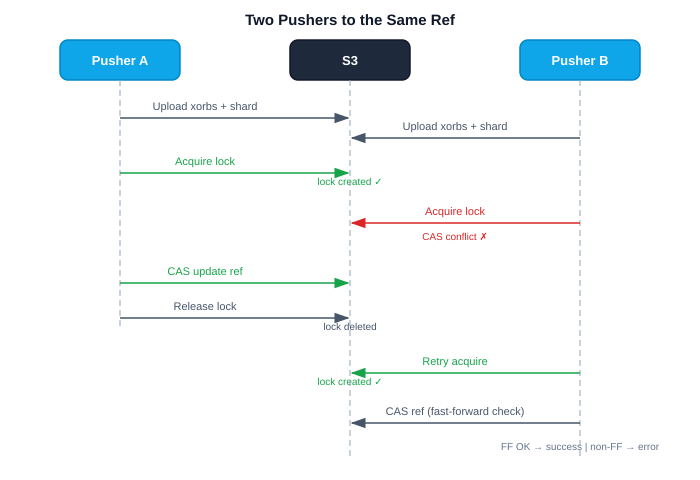

# Coordination & Consistency

## Overview

Crab achieves consistency on object storage without any server or database.
The coordination module implements distributed locking, compare-and-swap (CAS)
loops, heartbeat renewal, and pipelined commit — all using only S3 conditional
write primitives.

Source: `crab/src/coordination/`

## Design Principle: Immutable Data, Mutable Pointers

Every byte of content is content-addressed and write-once. Only a small set of
pointer objects mutate (refs, manifests, locks), and those mutations use CAS.
This confines all concurrency complexity to a handful of tiny objects.

## S3 Conditional Write Primitives

AWS S3 supports two conditional write headers:

| Header | Behavior | Use Case |
|--------|----------|----------|
| `If-None-Match: *` | Succeed only if object does not exist | Lock creation |
| `If-Match: <etag>` | Succeed only if current ETag matches | Atomic updates |

Both return HTTP 412 Precondition Failed on mismatch. The `object_store` crate
abstracts these as `PutMode::Create` and `PutMode::Update(UpdateVersion)`.

## Push Locks

Push locks serialize concurrent pushes to the same ref. They are short-TTL
leases stored in S3:

```
Path:    locks/refs/{ref_name}/lock
Content: { "holder": "{uuid}", "expires_at": <unix_timestamp> }
```

### Lock Lifecycle

```
1. Acquire:
   PUT locks/refs/main/lock (PutMode::Create)
   Body: { "holder": "uuid-abc", "expires_at": now + TTL }
   
   If object exists and not expired → CasConflict (another push in progress)
   If object exists and expired → delete stale lock, retry create

2. Hold:
   Heartbeat task renews the lock periodically (see below)

3. Release:
   DELETE locks/refs/main/lock (conditional on holder match)
   
4. Expiry:
   If holder crashes without releasing, the lock expires after TTL.
   Next pusher detects the expired lock and reclaims it.
```

### Lock TTL

Default: `operation_timeout` from config (typically 5 minutes). The TTL must
be long enough to cover the upload phase but short enough that a crashed
pusher's lock doesn't block others for too long.

Source: `crab/src/coordination/push_lock.rs`

## Heartbeat

The heartbeat module renews push locks periodically to prevent expiry during
long uploads:

```
Every {interval} seconds:
  GET lock → verify holder matches our UUID
  PUT lock with extended expires_at (CAS via If-Match)
  
  If holder doesn't match → lock was stolen → abort push
```

The heartbeat interval is computed as a fraction of the lock TTL:
- Minimum: 5 seconds
- Maximum: TTL / 3
- If TTL is too short for meaningful heartbeat → no heartbeat (rely on TTL)

Source: `crab/src/coordination/heartbeat.rs`

## CAS (Compare-and-Swap) Loop

The generic CAS loop is used for all mutable object updates (manifests, refs):

```
for attempt in 0..MAX_ATTEMPTS:
  1. GET {path} → (current_value, etag)
     (or default if not found)
  
  2. mutate(&mut current_value)
  
  3. Conditional PUT with If-Match: {etag}
     ├── 200 OK → done
     └── 412 Precondition Failed (CAS conflict)
         → jittered backoff (50ms base, 500ms cap)
         → retry from step 1

After MAX_ATTEMPTS → return CasConflict error
```

### CAS Parameters

| Parameter | Default | Description |
|-----------|---------|-------------|
| Max attempts | 10 | Maximum retry count |
| Base delay | 50ms | Initial backoff delay |
| Max delay | 500ms | Backoff cap |
| Jitter | Random | Prevents thundering herd |

Source: `crab/src/coordination/cas.rs`

## Pipelined Commit

The pipelined commit module orchestrates the atomic commit phase of a push:

```
1. CAS update pack-list manifest (add new pack entry)
2. CAS update shard-list manifest (add new shard entry)
3. CAS update commit-graph summary (append new commits)
4. Acquire push lock for each ref
5. CAS update each ref (fast-forward check)
6. Release push locks
```

Steps 1-3 can be retried independently (manifests are append-only). Steps 4-6
are serialized per ref via the push lock.

### Failure Handling

| Failure Point | Recovery |
|---------------|----------|
| Manifest CAS conflict | Retry with fresh read |
| Lock acquisition fails | Return error to user (another push in progress) |
| Ref CAS fails (non-fast-forward) | Return error to user |
| Ref CAS fails (stale ETag) | Retry with fresh read |
| Crash after manifest update, before ref update | Orphaned manifest entries (harmless, cleaned by GC) |
| Crash after ref update | Success (data is durable) |

Source: `crab/src/coordination/pipelined_commit.rs`

## Concurrency Scenarios

### Two Pushers to the Same Ref



### Push to Different Refs (No Contention)

Pushes to different refs use different lock paths and never contend. Manifest
CAS may conflict (both append to pack-list), but the retry loop handles this
transparently.

### Pusher Crashes Mid-Upload

Orphaned xorbs and shards are left in the store. The push lock expires after
TTL. The next pusher can proceed. GC cleans up orphaned objects after the
grace period.
