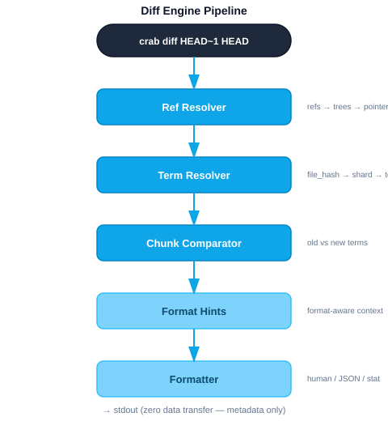

# Chunk-Level Diff Engine

## Overview

The diff engine compares crab-tracked files between git refs using only
metadata (file-index + shards). It produces per-file reports of which segments
changed, bytes affected, and dedup ratio — all with zero data transfer. No
actual file content is downloaded.

Source: `crab/src/diff/`

## Architecture



## Components

### Ref Resolver (`ref_resolver.rs`)

Resolves git refs to lists of crab pointer files:

1. Parse ref strings (branch, tag, SHA, `HEAD~N`)
2. Resolve to commit objects via gitoxide
3. Walk both trees to find crab-tracked files
4. Diff the two pointer lists to identify changed files

### Term Resolver (`term_resolver.rs`)

For each changed file, resolves the pointer's file hash to reconstruction
terms:

1. Extract `(file_hash, shard_hint)` from the pointer
2. Look up file-index: `file_hash → shard_hash`
3. Download shard (from cache or remote)
4. Parse shard to extract reconstruction terms for this file

The resolver processes files in batches with configurable download concurrency
to minimize latency.

### Chunk Comparator (`chunk_comparator.rs`)

Compares two sets of reconstruction terms to produce a diff report:

```
Old terms: [xorb_A:0..47, xorb_B:0..12, xorb_A:47..94]
New terms: [xorb_A:0..47, xorb_C:0..20, xorb_A:47..94]

Result:
  Shared:  xorb_A:0..47 (3.0 MiB), xorb_A:47..94 (3.0 MiB)
  Removed: xorb_B:0..12 (0.8 MiB)
  Added:   xorb_C:0..20 (1.3 MiB)
  
  Segments changed: 2 (+1 added, -1 removed)
  Delta bytes: +500 KiB
  Dedup ratio: 75%
```

The comparison operates on reconstruction terms (xorb hash + chunk range),
not on actual chunk data. Two terms are "equal" if they reference the same
xorb hash and chunk range.

### Format Hints (`format_hint.rs`)

Provides format-aware annotations for diff output. For known file formats
(SafeTensors, ONNX, HDF5), the diff can annotate which logical section of
the file changed (e.g., "tensor weights layer 12" vs "metadata header").

Disabled with `--no-annotations`.

### Formatter (`formatter.rs`)

Renders diff output in multiple modes:

| Mode | Flag | Description |
|------|------|-------------|
| Human | (default) | Colored, formatted with chunk counts and sizes |
| Stat | `--stat` | One-line-per-file summary |
| Name-only | `--name-only` | Just file paths |
| Verbose | `--verbose` | Full segment detail with xorb hashes |
| JSON | `--json` | Machine-readable for CI/tooling |

### Types (`types.rs`)

Core data types:

```rust
struct FileDiffReport {
    path: String,
    old_size: u64,
    new_size: u64,
    added_segments: usize,
    removed_segments: usize,
    shared_segments: usize,
    delta_bytes: i64,
    dedup_ratio: f64,
    // Optional: per-segment detail, byte ranges
}

struct DiffSummary {
    files_changed: usize,
    total_segments_changed: usize,
    total_delta_bytes: i64,
}

enum OutputMode { Human, Json, Stat, NameOnly }
```

## Performance

The diff engine's key performance property is that it never downloads file
content. All comparisons operate on metadata (shards and file-index entries),
which are typically kilobytes to megabytes even for terabyte-scale files.

| Operation | Data Transfer |
|-----------|--------------|
| Resolve refs | None (local git) |
| Fetch file-index entries | ~40 bytes per changed file |
| Fetch shards | ~1-10 KiB per shard |
| Compare terms | None (in-memory) |

A diff of two versions of a 100 GB file downloads ~10 KiB of metadata.

## Diff Driver Integration

The `crab diff-driver` command implements git's external diff driver protocol,
enabling `git diff` to automatically use chunk-level comparison for
crab-tracked files. It uses the same term resolver and chunk comparator
internally.

Source: `crab/src/cmd/diff_driver.rs`
