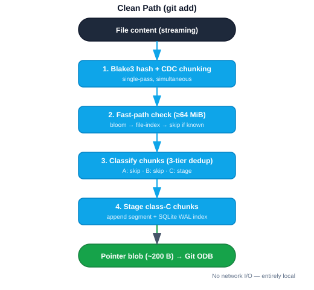
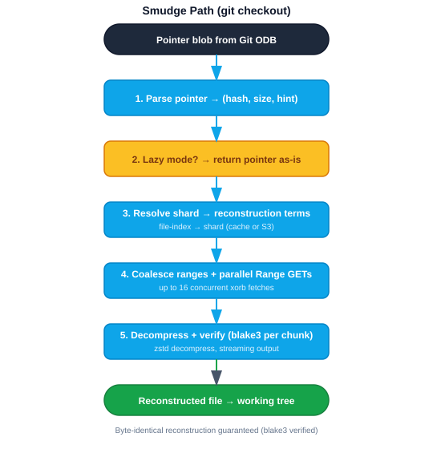
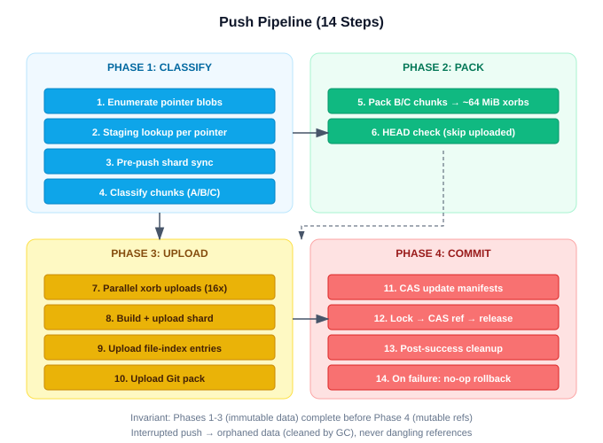

# Git Integration

## Overview

Crab plugs into Git through two extension mechanisms: the remote helper
protocol (for push/fetch) and the filter driver protocol (for clean/smudge).
Everything else — commits, branches, merges, diffs, blame — works natively
on pointer blobs without crab involvement.

Source: `crab/src/git/`

## Remote Helper Protocol

When Git encounters a `crab://` URL, it spawns `git-remote-crab` as a
subprocess. The binary detects this mode via `argv[0]`:

```
argv[0] == "git-remote-crab"  →  remote helper mode
argv[0] == "crab"             →  CLI mode
```

### Protocol Exchange

```
git → helper:  capabilities
helper → git:  fetch\npush\noption\n\n

git → helper:  list [for-push]
helper → git:  {sha} refs/heads/main\n...\n\n

git → helper:  fetch {sha} {ref}\n...\n\n
helper:        (downloads packs, writes to local ODB)
helper → git:  \n

git → helper:  push {src}:{dst}\n...\n\n
helper:        (executes 14-step push pipeline)
helper → git:  ok {ref}\n...\n\n
```

Source: `crab/src/git/remote_helper.rs`

## Filter Driver (Long-Running Process)

Git's filter driver mechanism transforms file content at two points:
- **Clean** (working tree → Git ODB): runs at `git add` time
- **Smudge** (Git ODB → working tree): runs at `git checkout` time

Crab uses the long-running filter protocol v2, where a single persistent
process handles all clean/smudge operations in a session.

### Registration

```ini
[filter "crab"]
    process = crab filter-process
    clean = crab filter-process
    smudge = crab filter-process
    required = true
```

Activated per file pattern in `.gitattributes`:

```
*.safetensors filter=crab diff=crab merge=crab -text
```

Source: `crab/src/git/filter_process.rs`

## Clean Path (git add)

When `git add model.safetensors` runs:



Key properties:
- **No network I/O.** Clean is entirely local.
- **Streaming.** File never fully buffered in memory.
- **Deterministic.** Same content → same pointer.
- **Small files pass through.** Files below the chunk threshold (default 1 MiB)
  are not processed by the filter.

Source: `crab/src/git/clean.rs`

## Smudge Path (git checkout)

When Git checks out a file with `filter=crab`:



### Delayed Smudge

Git's filter protocol v2 supports a "delay" capability. The filter can tell
Git "I'm not done yet; give me the next file." This allows crab to queue
multiple smudge requests and satisfy them in parallel, dramatically speeding
up checkouts of repos with many large files.

Source: `crab/src/git/smudge.rs`

## Push Pipeline (14 Steps)

The push pipeline is the core of `git push`, implemented as `PushPipeline`
in `push.rs`:



### Critical Ordering Invariant

Steps 7-10 (immutable data uploads) must complete before steps 11-12
(mutable manifest/ref updates). This ensures the fail-forward property:
an interrupted push may leave orphaned immutable data (cleaned by GC) but
never creates dangling references.

Source: `crab/src/git/push.rs`, `crab/src/git/push_manifest.rs`,
`crab/src/git/push_state.rs`

## Fetch Pipeline

When Git fetches from a crab remote:

```
1. GET HEAD, list refs/ from S3 → return ref SHAs to Git
2. GET pack-list manifest
3. Diff against local .git/objects/pack/
4. Download missing packs in parallel (with SHA1 verification)
5. Opportunistic shard sync in background (warm ChunkIndex)
6. Write packs to .git/objects/pack/
```

Git then updates local refs and checks out the working tree, triggering
the smudge filter for changed pointer files.

Source: `crab/src/git/fetch.rs`

## Pack Generation

The `pack_gen` module generates standard Git packfiles for upload. It shells
out to `git pack-objects` to produce packs containing commits, trees, and
pointer blobs that need to be pushed.

Source: `crab/src/git/pack_gen.rs`

## Tree Walking

The `walk` module traverses commit and tree objects using gitoxide:

- `walk_reachable()`: Walk all reachable commits and blobs from tip SHAs
- Pointer detection: blobs ≤256 bytes are tested with `Pointer::parse()`

The `incremental_walk` module optimizes this by using the commit graph
summary to skip already-processed commits.

Source: `crab/src/git/walk.rs`, `crab/src/git/incremental_walk.rs`

## URL Parsing

The `url` module parses `crab://bucket/repo-path` URLs into structured
`CrabUrl` types with `bucket` and `repo_path` fields.

Source: `crab/src/git/url.rs`

## Shallow Clone Support

The `shallow` module handles shallow clone semantics, ensuring that
shallow-cloned repositories work correctly with crab's push and fetch
pipelines.

Source: `crab/src/git/shallow.rs`
