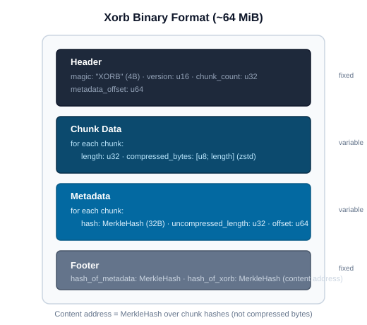

# Storage Layer

## Overview

The storage layer provides a unified abstraction over cloud object stores
(S3, GCS, Azure, R2, MinIO) and implements the binary formats, retry logic,
and upload strategies that all higher-level modules depend on.

Source: `crab/src/storage/`

## Store Abstraction

The `Store` struct wraps the `object_store` crate's trait object, adding
crab-specific conveniences:

```
Store
├── inner: Arc<dyn ObjectStore>     ← S3/GCS/Azure backend
├── get(path) → Bytes               ← download object
├── get_with_etag(path) → (Bytes, ETag)
├── put(path, bytes)                 ← upload object
├── put_opts(path, bytes, PutMode)   ← conditional write (CAS)
├── head(path) → ObjectMeta          ← existence + metadata check
├── list(prefix) → Stream<ObjectMeta> ← enumerate objects
└── delete(path)                     ← remove object
```

The `Store` is created once per CLI invocation from the parsed
`crab://bucket/repo` URL and reused for all operations.

## Remote Bucket Layout

```
s3://{bucket}/{repo-path}/
├── config                              Repo config JSON
├── HEAD                                Symref target
├── refs/                               Mutable refs (CAS-updated)
│   ├── heads/{branch}                  Branch refs (40-byte SHA hex)
│   └── tags/{tag}                      Tag refs
├── packs/                              Immutable Git packfiles
│   ├── pack-{hash}.pack                Standard Git pack format
│   ├── pack-{hash}.idx                 Pack index
│   └── pack-{hash}.meta                Pack metadata sidecar (JSON)
├── manifests/                          Mutable manifests (CAS-updated)
│   ├── pack-list                       Pack manifest
│   └── shard-list                      Shard manifest
├── locks/                              Push locks (short-TTL)
│   └── refs/{ref}/lock                 Per-ref lock record
├── xorbs/{hash}                        Immutable chunk aggregates
├── shards/{hash}                       Immutable reconstruction metadata
├── file-index/{hash}                   File → shard mapping
└── lfs/
    ├── objects/{h[:2]}/{h[2:4]}/{h}   LFS objects (SHA-256 keyed)
    └── locks/{blake3(path)}            Advisory file locks
```

### Path Layout Notes

Xorbs, shards, and file-index entries live directly under the repo prefix
(e.g. `{repo-path}/xorbs/{hash}`, `{repo-path}/shards/{hash}`,
`{repo-path}/file-index/{hash}`). They do **not** use a `xet/` prefix or
two-character hash sharding.

Manifests (`pack-list`, `shard-list`) live under `{repo-path}/manifests/`.

LFS objects use two-level sharding: `{oid[:2]}/{oid[2:4]}/{oid}` for
compatibility with the standard LFS layout.

### Object Mutability

| Object | Mutable | Update Mechanism |
|--------|---------|------------------|
| xorbs, shards, file-index, packs | No | Content-addressed, write-once |
| refs, HEAD | Yes | CAS via `If-Match` ETag |
| pack-list, shard-list | Yes | CAS via `If-Match` ETag |
| push locks | Yes | CAS create + TTL expiry |
| LFS locks | Yes | CAS create/delete |
| config | Yes (rarely) | CAS |

## Xorb Binary Format

Xorbs aggregate chunks into ~64 MiB content-addressed blobs:



Key properties:
- Chunks are compressed individually with zstd (level 3 default), enabling
  Range GETs to extract specific chunks without decompressing the whole xorb.
- The xorb's content address is a MerkleHash over chunk hashes, not over
  compressed bytes. Same logical content → same hash regardless of compression
  level.
- Compatible with xet-core's xorb format.

Source: `crab/src/storage/xorb/`

## Retry Policy

The retry module classifies errors and applies exponential backoff:

| Error Class | Retry? | Examples |
|-------------|--------|----------|
| Transient | Yes | Network timeout, 5xx, throttle (429) |
| Permanent | No | 404 Not Found, 403 Access Denied |
| CAS conflict | Caller decides | 412 Precondition Failed |

Retry parameters:
- Base delay: 50ms
- Max delay: 500ms (capped)
- Max attempts: configurable (default 10 for CAS, 3 for data operations)
- Jitter: randomized to avoid thundering herd

Source: `crab/src/storage/retry.rs`

## Multipart Upload

Objects larger than 8 MiB use S3 multipart upload:
- Part size: 8 MiB
- Concurrent part uploads via `put_multipart` from `object_store`
- Partial state persisted in `MultipartRegistry` (SQLite) for resume across
  process restarts
- Abandoned multipart uploads detected by `crab fsck` and aborted

Source: `crab/src/storage/multipart_resume.rs`

## Batched HEAD Requests

The `head_batch` module provides concurrent HEAD requests for existence
checking. Used during push (step 6) to skip already-uploaded xorbs and
during LFS push to identify missing objects.

Source: `crab/src/storage/head_batch.rs`

## Error Mapping

The `error_map` module translates `object_store::Error` variants into
`CrabError` variants, preserving the original error as a source chain.
It also classifies authentication errors separately for better user-facing
messages.

Source: `crab/src/storage/error_map.rs`
