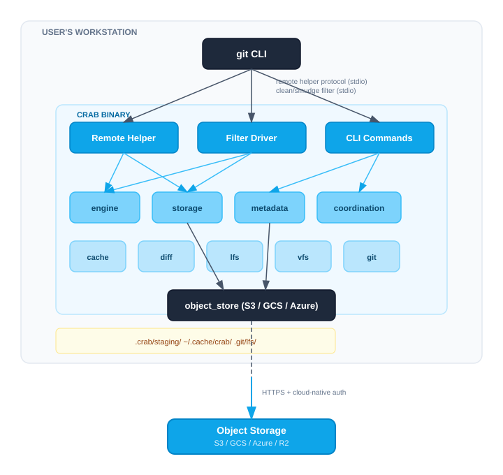

# System Overview

## What Crab Is

Crab is a single Rust binary that acts as both a Git remote helper and a Git
filter driver. It enables standard Git commands to work with repositories stored
entirely in cloud object storage (S3, GCS, Azure) with no servers, databases, or
LFS endpoints. Large files are content-defined chunked, deduplicated, and stored
as compressed xorbs in the object store, while Git sees only lightweight pointer
blobs.

## Component Diagram



## Module Map

The `crab/src/` directory is organized into eleven top-level modules across
five architectural layers. Dependencies flow downward; cross-cutting concerns
(`core/`) are available to all layers.


### Layer Breakdown

| Layer | Modules | Responsibility |
|-------|---------|----------------|
| **Entry** | `main.rs`, `lib.rs` | Binary dispatch, crate re-exports |
| **Interface** | `cmd/`, `git/remote_helper`, `git/filter_process` | User-facing entry points (CLI, git protocols) |
| **Core** | `engine/`, `metadata/`, `coordination/` | Chunking, dedup, staging, shard/index management, distributed locking |
| **Domain** | `diff/`, `lfs/`, `vfs/`, `cache/` | Feature-specific logic (chunk diff, LFS compat, FUSE mount, local cache) |
| **Infrastructure** | `storage/`, `object_store` | Object store abstraction, retry, xorb format |
| **Cross-cutting** | `core/` | Config, error types, metrics, tracing, patterns |

<details>
<summary>Full file listing</summary>

```
crab/src/
├── main.rs              Binary entry point: CLI dispatch + remote helper detection
├── lib.rs               Crate root: re-exports all modules
│
├── core/                Cross-cutting concerns
│   ├── config.rs        Four-layer configuration resolution
│   ├── context.rs       AppContext: config + cancellation token
│   ├── error.rs         CrabError enum (thiserror), Result alias
│   ├── error_catalog.rs Human-readable error code explanations
│   ├── metrics.rs       Atomic performance counters (MetricsSummary)
│   ├── pattern.rs       Glob pattern matching for include/exclude
│   └── tracing_init.rs  Tracing subscriber setup
│
├── engine/              Chunking, dedup, and staging
│   ├── chunker.rs       Gearhash CDC implementation
│   ├── cdc_xorb.rs      Combined CDC + xorb builder pipeline
│   ├── dedup.rs          Three-tier dedup classification
│   ├── packer.rs         Xorb packing strategy
│   ├── stream_packer.rs  Streaming xorb packer for push pipeline
│   ├── pointer.rs        Pointer blob parse/serialize
│   ├── chunk_file.rs     Chunk-to-file mapping
│   ├── adaptive_threshold.rs  Dynamic chunk size threshold
│   └── staging/          Local staging area (segments + SQLite index)
│       ├── mod.rs        StagingArea, StagingAreaReadOnly
│       └── index.rs      SQLite WAL-mode chunk index
│
├── storage/             Object store abstraction
│   ├── store.rs         Store wrapper over object_store trait
│   ├── retry.rs         Retry policy with exponential backoff
│   ├── error_map.rs     Map object_store errors to CrabError
│   ├── head_batch.rs    Batched HEAD requests for existence checks
│   ├── multipart_resume.rs  Resumable multipart upload registry
│   └── xorb/            Xorb binary format (builder + reader)
│
├── metadata/            Chunk, file, and ref stores
│   ├── shard.rs         MDB shard read/write (xet-core format)
│   ├── shard_bloom.rs   Bloom filter per shard for fast lookup
│   ├── shard_sync.rs    Remote shard sync for ChunkIndex refresh
│   ├── chunk_index.rs   In-memory chunk → xorb location map
│   ├── persistent_chunk_index.rs  On-disk chunk index (redb)
│   ├── file_index.rs    file_hash → shard_hash mapping
│   ├── refs.rs          Remote ref read/write
│   ├── manifests.rs     Pack-list and shard-list manifest types
│   ├── commit_graph.rs  Commit graph summary for incremental walk
│   └── pack_metadata.rs Pack metadata sidecar files
│
├── coordination/        Distributed locking and consistency
│   ├── push_lock.rs     Per-ref push locks with TTL
│   ├── heartbeat.rs     Lock heartbeat renewal
│   ├── cas.rs           Generic CAS (compare-and-swap) loop
│   └── pipelined_commit.rs  Pipelined manifest + ref commit
│
├── git/                 Git protocol integration
│   ├── remote_helper.rs Remote helper protocol loop
│   ├── filter_process.rs Long-running filter process (v2 protocol)
│   ├── clean.rs         Clean filter: content → pointer + staging
│   ├── smudge.rs        Smudge filter: pointer → content
│   ├── push.rs          14-step push pipeline orchestrator
│   ├── push_native.rs   Native push (non-helper) entry point
│   ├── push_manifest.rs Manifest update during push
│   ├── push_state.rs    Push state tracking
│   ├── fetch.rs         Fetch pipeline: download packs + shards
│   ├── pack_gen.rs      Git pack generation for upload
│   ├── walk.rs          Commit/tree traversal
│   ├── incremental_walk.rs  Incremental walk using commit graph
│   ├── connectivity.rs  Ref connectivity checks
│   ├── shallow.rs       Shallow clone support
│   ├── discover.rs      Repository discovery
│   ├── url.rs           crab:// URL parsing
│   └── progress.rs      Progress reporting for long operations
│
├── cache/               Local disk cache
│   ├── chunks.rs        ChunkCache: hash-verified chunk storage
│   └── local_cache.rs   LocalCache: LRU eviction, stats, verify
│
├── diff/                Chunk-level diff engine
│   ├── chunk_comparator.rs  Compare reconstruction terms
│   ├── term_resolver.rs     Resolve file hashes to terms via shards
│   ├── ref_resolver.rs      Resolve git refs to pointer lists
│   ├── formatter.rs         Human/JSON/stat output formatting
│   ├── format_hint.rs       Format-aware annotations
│   └── types.rs             DiffSummary, FileDiffEntry, OutputMode
│
├── lfs/                 Git LFS compatibility
│   ├── pointer.rs       LFS pointer parse/serialize
│   ├── detect.rs        Dual pointer detection (LFS vs crab)
│   ├── object_store.rs  LFS object storage (SHA-256 keyed)
│   ├── transfer_agent.rs Standalone LFS transfer agent
│   ├── batch.rs         Batch resolver for push/fetch
│   ├── lock.rs          Advisory file locking via CAS
│   ├── migrate.rs       History rewrite (import/export)
│   ├── prune.rs         Unreferenced LFS object cleanup
│   ├── config.rs        LFS configuration resolution
│   ├── track.rs         LFS pattern tracking
│   └── status.rs        LFS file status
│
├── vfs/                 FUSE virtual filesystem
│   ├── fuse.rs          FUSE filesystem implementation
│   ├── mount.rs         Mount/unmount lifecycle
│   ├── engine.rs        VFS engine: tree resolution + I/O dispatch
│   ├── overlay.rs       Write overlay for local modifications
│   ├── snapshot.rs      Point-in-time tree snapshot
│   ├── hydration.rs     On-demand chunk download for reads
│   ├── resolver.rs      Path → inode resolution
│   ├── refresh.rs       Periodic ref refresh for live mounts
│   └── daemon.rs        Multi-repo daemon management
│
└── cmd/                 CLI subcommand implementations
    ├── mod.rs           Module declarations
    ├── add.rs           Parallel file staging
    ├── clone.rs         One-step clone with filter setup
    ├── hydrate.rs       Selective file materialization
    ├── dehydrate.rs     Replace files with pointers
    ├── diff.rs          Chunk-level diff between refs
    ├── gc/              Remote garbage collection
    ├── fsck.rs          Repository integrity check
    ├── repack.rs        Remote pack consolidation
    ├── lfs/             LFS subcommand dispatch
    └── ...              (30+ subcommand modules)
```

</details>

## Data Flow Summary

| User Action | Git Mechanism | Crab Involvement | Network I/O |
|-------------|---------------|-------------------|-------------|
| `git add` | Clean filter | CDC chunk + stage locally | None |
| `git commit` | Git ODB write | None | None |
| `git push` | Remote helper | 14-step push pipeline | Upload xorbs, shards, packs, update refs |
| `git clone/pull` | Remote helper | Download packs + shards | Download packs, xorbs on checkout |
| `git checkout` | Smudge filter | Reconstruct from chunks | Download missing xorbs |
| `git log/diff/blame` | Native Git | None (operates on pointers) | None |
| `crab hydrate` | CLI command | Selective file reconstruction | Download xorbs |
| `crab mount` | CLI + FUSE | On-demand chunk fetch | Per-read download |

## Key Invariants

1. All immutable data is durable before any ref moves (fail-forward property).
2. All SlateDB/staging instances are closed on every exit path.
3. Lock-then-push serialization per ref; every acquired lock is released.
4. GC never deletes referenced xorbs or anything inside the grace period.
5. Reconstruction is byte-identical to original or returns an error.
6. Staged xorbs must flush before any bundle push.

## Technology Stack

| Component | Technology | Purpose |
|-----------|-----------|---------|
| Language | Rust 2024 | Performance, safety, single binary |
| Async runtime | tokio | Concurrent I/O |
| Object store | `object_store` crate | Unified S3/GCS/Azure abstraction |
| Git primitives | gitoxide (`gix-*`) | Pack format, object model, traversal |
| Chunking/dedup | xet-core | CDC, MerkleHash, shard format |
| Hashing | Blake3 | File hashing (fast, secure) |
| Errors | thiserror | Structured error types |
| Logging | tracing | Structured, leveled logging |
| CLI | clap | Argument parsing |
| Serialization | serde + serde_json + toml | Config, manifests, lock records |
