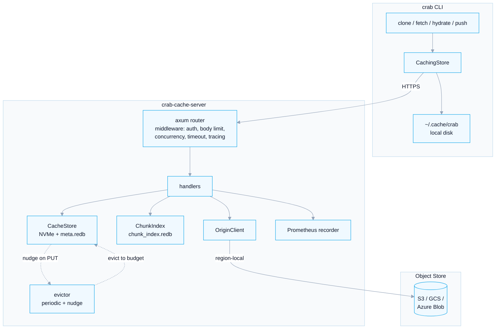
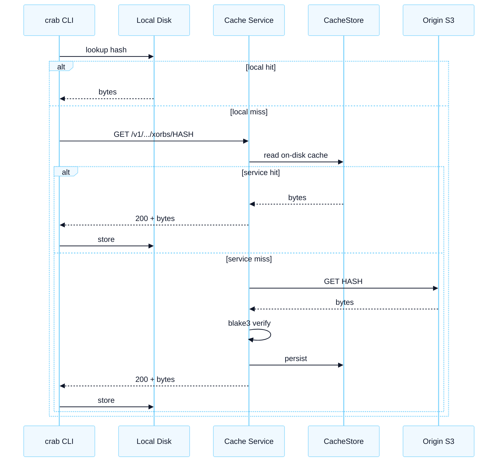

# Architecture

The cache service is a single Rust binary (`crab-cache-server`) that fronts a cloud object store. It exposes a small HTTP/1.1 API, persists immutable objects to local disk, and tracks per-object access metadata in [redb](https://www.redb.org/) for LRU eviction.

This page explains how the pieces fit together. If you're trying to deploy quickly, skip to [Deployment](/docs/cli/cache-service/deployment) and come back when you want the details.

## Component Diagram



## Read Path

A `crab clone`, `crab fetch`, or `crab hydrate` issues GETs for immutable objects. The path traversal is:

1. **Local disk cache** (`~/.cache/crab`) — if present, return immediately.
2. **Cache service** — `GET /v1/.crab/xorbs/{first-two-hex}/{hash}` or another immutable object-store key.
3. **Origin object store** — only on cache miss or service unavailability.



Every cache-service hit is a single TCP round trip against an in-region NVMe-backed server. The service stores xorb, shard, and file-index objects by their Crab object identity. Those identities are production content IDs, not necessarily `blake3(body)`, so integrity is enforced by the Crab object formats and downstream parsers rather than by recomputing a raw body hash at the cache boundary.

If the cache service is unreachable, `CachingStore` logs a warning and falls back to the origin transparently. Clones never wedge on a sick cache.

## Write Path (Push Warming)

A `crab push` does **not** route uploads through the cache service — that would add a hop to the upload critical path. Instead, the push pipeline warms the cache as a side effect of the upload it would have done anyway:

1. **Step 4 — dedup query.** Before staging any chunks, push asks the cache `POST /v1/dedup/query` with up to 100,000 chunk hashes. The cache responds with `known` chunks (already deduped, with their xorb location) and `unknown` chunks. Known chunks are skipped entirely — no upload, no storage cost.
2. **Shard warming.** After newly generated shards are uploaded to origin, they are `PUT` into the cache at `.crab/shards/{first-two-hex}/{hash}`. This triggers `ChunkIndex::ingest_shard`, which adds the shard's chunk locations to the dedup index. Future pushes from any teammate can see those chunks as `known`.
3. **Xorb warming.** After the xorb upload to origin succeeds, every uploaded xorb is `PUT` into the cache at `.crab/xorbs/{first-two-hex}/{hash}` via `warm_remote_only`. Now a clone or hydrate can read the xorb from the cache instead of taking the cold origin path.

Warming is best-effort: a failure in any of these steps logs a warning and proceeds. A push never blocks on the cache service.

## Storage Layout

The on-disk layout is straightforward enough to inspect by hand:

```text
{cache_root}/                  # default: /data/crab-cache
├── meta.redb                  # per-object metadata (size, last_access, count)
├── chunk_index.redb           # chunk → xorb dedup index
├── xorbs/{xx}/{hash}          # binary xorb payloads
├── shards/{xx}/{hash}         # shard files
├── file-index/{xx}/{hash}     # per-file index entries
└── packs/{xx}/{internal-id}    # pack and pack-index payloads
```

`{xx}` is the first two hex digits of the canonical storage ID. For xorbs, shards, and file-index entries, the storage ID is the 64-hex object identity from the path. For pack files and indexes, the storage ID is derived from the object type plus the URL pack name so non-hex pack names such as `pack-abc.pack` are supported and evict cleanly.

Object writes are atomic: the server writes to a `tempfile::NamedTempFile` in the same directory and `persist()`s it once the bytes are flushed. There's no window where a partial file is visible to readers.

## Metadata: Why redb?

Two persistent stores back the cache:

- **`meta.redb`** — one row per cached object: `(type_byte, storage_id_32) → (size, last_access, access_count, cached_at)`. Used for LRU eviction. Total storage overhead is roughly 65 bytes per object.
- **`chunk_index.redb`** — one row per known chunk: `chunk_hash → (xorb_hash, offset, length)`. Used for cross-repo dedup queries. Storage scales with deduped chunk count, not file count.

[redb](https://www.redb.org/) was chosen for three reasons: ACID with crash safety, no separate process to manage, and simple key-value semantics (this isn't a query problem). The trade-off is that redb is single-writer per database — write throughput is bounded by transaction serialization. For typical team workloads this is invisible; for write-heavy fleet operations, see [Operations: Scaling](/docs/cli/cache-service/operations#scaling).

If a redb file is corrupt at startup (rare; usually crash-mid-fsync on a power loss), the server logs a warning, deletes it, and recreates an empty database. The chunk index is then rebuilt recursively from cached shards on disk.

## Eviction

The cache enforces a configurable byte budget (`cache.max_bytes`, default 1 TiB). Eviction runs in three contexts:

1. **Startup eviction** — if `current_bytes > max_bytes` when the server boots (cache root larger than configured budget), the server immediately runs `evict_to_budget`.
2. **Periodic background eviction** — a tokio task wakes every 60 seconds, checks fill ratio, and evicts to the low-water mark if over the high-water mark.
3. **Nudged eviction** — every PUT that pushes utilization past the high-water mark fires a `Notify::notify_one` against the evictor task, which wakes immediately instead of waiting for the next tick.

The eviction policy is **weighted LRU**:

- **Sort key:** `(last_access ASC, type_weight ASC)`. Oldest objects evict first; ties broken by type weight.
- **Type weights** (lower = evict sooner): `xorbs = 0`, `packs = 1`, `file-index = 2`, `shards = 3`. Shards evict last because they hold the dedup index — losing a shard re-introduces chunks that would otherwise dedup.

In addition, an emergency eviction path runs when a write fails with `ENOSPC`: it forcibly evicts the oldest 10% of objects by count (regardless of last-access age) and retries the write once.

Default thresholds (tunable per-deployment):

- `eviction.high_water_ratio = 0.95` — start evicting when 95% full
- `eviction.low_water_ratio = 0.90` — evict down to 90% full

## Authentication & Authorization

The server supports three auth mechanisms. All non-public routes (`/v1/*` except health/metrics) run through `auth_middleware`, which extracts a `ClientIdentity` from the request and stores it in extensions for handlers to consult.

| Mechanism | Header | Identity source | Recommended for |
|-----------|--------|-----------------|-----------------|
| **PSK** | `X-Cache-PSK: <key>` | `psk-client` | private single-team networks |
| **Bearer** | `Authorization: Bearer <token>` | the token string | environments with a token issuer |
| **mTLS** | `X-Client-CN` from trusted TLS terminator | validated certificate subject | hardened production with proxy or service mesh |

PSK comparison is constant-time over a blake3 hash. Bearer tokens are accepted as-is — see [Authentication](/docs/cli/cache-service/authentication) for the security caveats.
PSK-authenticated clients use the principal `psk-client`.

An optional YAML policy file (`server.policy_path`) layers per-action authorization on top:

```yaml
rules:
  - principal: "ci-runner-prod"
    repos: ["my-org/*", ".crab"]
    actions: ["read", "dedup"]
  - principal: "deployer"
    repos: ["my-org/release"]
    actions: ["read", "write", "dedup", "admin"]
```

Repo names are matched with simple glob prefixes; global `.crab/*` objects use `.crab` as the repo path for policy checks. Actions are checked per handler. The policy is loaded once at startup; restart the server to pick up changes.

## Endpoints

| Method | Path | Auth | Purpose |
|--------|------|------|---------|
| `GET` | `/v1/health` | none | Readiness probe (cached origin HEAD, 5s TTL) |
| `GET` | `/health` | none | Compatibility alias for readiness |
| `GET` | `/v1/health/live` | none | Liveness probe (always 200) |
| `GET` | `/health/live` | none | Compatibility alias for liveness |
| `GET` | `/v1/metrics` | none | Prometheus exposition |
| `GET` | `/v1/{path}` | yes | Read object (supports `Range:` header) |
| `PUT` | `/v1/{path}` | yes | Write object (push warming) |
| `POST` | `/v1/dedup/query` | yes | Batch chunk lookup |
| `GET` | `/v1/admin/stats` | yes (admin) | Cache statistics |
| `POST` | `/v1/admin/evict` | yes (admin) | Manual eviction |

The wildcard `/v1/{path}` treats `{path}` as the object-store key. It accepts canonical `.crab/{xorbs|shards|file-index}/{hash}` paths, legacy `.../xet/{xorbs|shards|file-index}/{hash}` paths, and `.../packs/{name}.pack|.idx` paths. Anything that does not classify as immutable returns HTTP 400 in strict mode, or is proxied without caching in transparent mode.

## Middleware Stack

Every request flows through:

1. **Concurrency limit** — at most 200 simultaneous requests in flight; excess returns HTTP 429.
2. **Request timeout** — 300 seconds; expiry returns HTTP 408.
3. **Body size limit** — 256 MiB on PUT; excess returns HTTP 413.
4. **Tracing** — per-request span with method, path, status, latency.
5. **Auth middleware** (authenticated routes only) — extracts `ClientIdentity` or returns 401.

These limits are compiled in. For different values, file an issue or fork — they're documented at the call sites in `crab/src/cache_service/state.rs` and were chosen to be conservative defaults for a single 4-vCPU pod.

## Lifecycle

On startup, the server:

1. Loads the TOML config and applies environment overrides.
2. Opens (or recreates) `meta.redb` and `chunk_index.redb`.
3. Computes `current_bytes` by scanning the metadata table.
4. Rebuilds the chunk index from cached shards on disk.
5. Runs startup eviction if over budget.
6. Starts the background evictor task.
7. Binds the listener and begins serving.

On `SIGTERM`:

1. The serve future enters drain mode — no new connections accepted.
2. In-flight requests are allowed to complete, bounded by `server.drain_timeout_secs` for the TLS path.
3. After serve returns, the evictor task is aborted and joined.
4. redb files are flushed and closed.

The default drain timeout is 30 seconds, which matches typical Kubernetes `terminationGracePeriodSeconds` and lets long PUTs finish.
