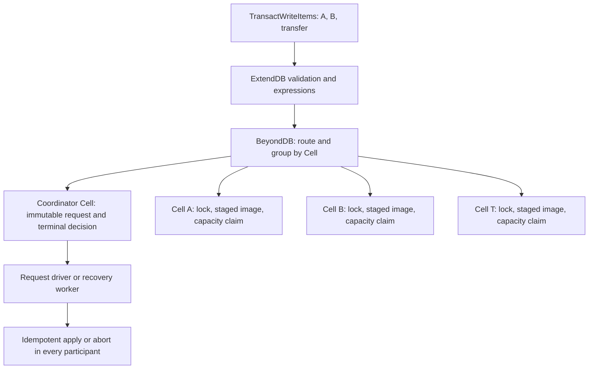
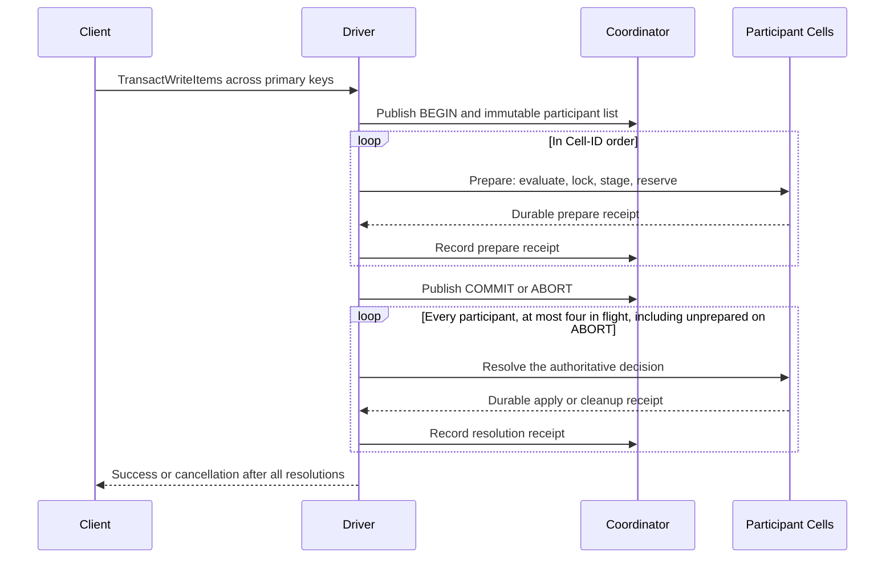

# Cross-Cell transaction protocol

## Foundation assessment for multiple primary keys

Initially reviewed against implementation `b68e6486620`, the pinned ExtendDB
storage contract, and the AWS transaction references below; the bounded
resolution change documented at the end updates the scheduling assessment.
The foundation is durable
two-phase commit with shared/exclusive item locks. It implements cross-Cell
transactions; production compatibility, bounded resource use, and the
10,000-Cell, multi-TB target remain qualification gates.

### One transaction, three independent keys

Consider a transfer that updates `Accounts/A`, updates `Accounts/B`, and
creates `Transfers/request-id`. Assume these keys route to three data Cells.
The coordinator is a fourth Cell, selected independently of those table routes.
Conditions such as sufficient balance are evaluated during participant prepare,
under the same local command that captures the proposed image and acquires its
lock. A separate preflight read cannot establish that condition.



If all three prepares succeed, the coordinator durably changes BEGIN to COMMIT.
If a condition definitively fails while it is still BEGIN, it changes to ABORT.
COMMIT and ABORT are immutable. A timeout provides neither decision. Success is
returned only after all three participants have durably applied COMMIT and their
resolution receipts have been recorded. Two keys in the same Cell share one
prepare and one resolution; the public adapter currently uses this protocol
even when every key belongs to one Cell.

### Atomicity includes what concurrent readers can observe

Suppose COMMIT is durable and Cell A has applied, but Cell B has not. The live
SQLite files temporarily differ in their progress. Cell B still holds its
exclusive intent, so a public read must resolve the decision and re-read, or
return a retryable error. It must not return B's old image. The lock check and
item read occur inside one Cell query, including when the item does not yet
exist. The coordinator's durable COMMIT is the logical write serialization point.

`TransactGetItems` prepares shared locks and immutable read images in every
participant. Once the last shared prepare succeeds, all captured keys remain
locked and those images coexist; this supplies its serialization point. Read
resolution releases locks but preserves the saved images for response assembly.
Re-reading live rows after releasing locks would lose that guarantee.

Two separate `GetItem` calls can straddle a transaction and see different
committed versions. Use `TransactGetItems` for an atomic multi-key view.
`Query`, `Scan`, and batch reads do not promise a whole-response snapshot; their
barriers must still cover prepared creates and deletes absent from live rows.
These distinctions follow the [AWS isolation contract](https://docs.aws.amazon.com/amazondynamodb/latest/developerguide/transaction-apis.html).

### Evidence map and trust boundary

| Boundary | Owner and code | Evidence or remaining limit |
| --- | --- | --- |
| Public request | ExtendDB engine → `src/backend/data.rs` → `src/backend/admission.rs` | Account-scoped token lookup precedes data routing; immutable participants preserve replay across route changes. Engine table metadata validation still precedes this backend call. |
| Prepare | `src/items/transaction.rs`, `src/partition/transaction.rs`, `src/partition/transaction/participant.rs` → `src/participant.rs` | Conditions, images, locks, saved reads, and page claims share one command. Account and data participants use the same phase record. |
| Decision | `src/backend/transaction.rs` → `src/transaction_coordinator/phase.rs` | COMMIT requires every recorded prepare; the state cannot change to its opposite. Receipts are assertions from the trusted driver. |
| Durability | Cell command → runtime executor and actor → LTX publication | Runtime success requires durability proof. BeyondDB relies on owner fencing and recovery of that proof; a local SQLite commit alone is insufficient. |
| Resolution | `src/backend/recovery.rs` → participant wrappers → `src/participant.rs` | Apply/discard, lock release, capacity release, and terminal marker are atomic locally. Replays preserve newer writes. |
| Other access paths | Keyed CRUD, range queries, scan, TTL, table deletion, split sealing | They consult the same locks. Split sealing refuses prepared work; recovery retains the original participant identity. |
| Recovery admission | `src/provision/transactions.rs` → the same driver/resolver | Decided healthy participants progress after another admission fails; startup still fails readiness when recovery is incomplete. |
| Baseline | `origin/main` has no BeyondDB subtree | This is an unreleased implementation in the draft PR, not qualification of an existing production service. |

The trust boundary is explicit: `ResolveTransactionInput` carries a coordinator
identity and a boolean decision. A participant does not independently read the
coordinator or verify a decision certificate. The authenticated internal driver
must supply the actual durable decision; crash and retry safety do not imply
tolerance of a faulty or compromised driver. Changing that boundary requires
decision evidence tied to the transaction, participant set, and fenced authority.

### What must scale next

| Priority | Current bound | Required work and acceptance evidence |
| --- | --- | --- |
| Safety qualification | Deterministic failure tests cover selected schedules | Exercise concurrent transfers, conditional write skew, read transactions, owner replacement, and lost replies with a recorded-history checker. Check conservation, serializability, and no duplicate effects at every injected phase cut. |
| Bounded history | Completed decisions, participant markers, and committed read images are retained | Design an acknowledged retirement boundary that rejects late phase messages before deleting tombstones; include split/backup pins and outstanding read fetches. Ten-minute client token expiry alone cannot authorize deletion. Prove storage reaches a steady state under a soak workload. |
| Admission | A 100-operation participant reserves about 278 MiB at 4-KiB pages, plus payload allowance | Qualify the allocation bound and contention cost; add WAL, disk, and heap admission. Coordinator progress also needs capacity to record decisions and receipts. Never reclaim an unresolved participant's claim on timeout. |
| Latency | Sequential prepare; up to four terminal resolutions in flight per call; at least `5P + 3` durable commands for single-chunk inputs | Measure publication and RPC time by participant count. Evaluate prepare parallelism and batched coordinator progress with renewed crash/concurrency proof before changing those phases. |
| Fleet recovery | 4,096 fixed coordinator shards per account; the worker selects one shard per 250-ms tick | Integrate placement and recovery scheduling with bounded concurrency and backlog metrics. A nominal pass over 4,096 known shards already takes about 17 minutes before slow work; this is arithmetic, not measured RTO. |
| Data distribution | HASH-key siblings share one Cell with a finite database budget | Qualify skew, hot keys, split headroom, and oversized item collections. More Cells do not distribute one key's lock or split a single HASH group in the current layout. |
| API completion | Secondary indexes and Streams remain unsupported; aggregate evaluated Update-size semantics remain unqualified | Maintain local index and stream effects within participant resolution, use durable asynchronous propagation where the contract permits it, and qualify size/error semantics against AWS before claiming compatibility. |

With 10,000 data Cells at a 256-MiB live-data split target, the arithmetic storage
envelope is about 2.44 TiB. This excludes metadata, retained history, claims,
skew, and availability headroom; it is not a demonstrated capacity. Total fleet
size must also include account, credential, and coordinator Cells. The former
single-account 64-MiB ceiling has been replaced by routed data Cells, but finite
Cell budgets and the operational limits above remain.

**Is this the best foundation?** Retain two-phase commit and the common lock
boundary for the current single-writer Cell architecture. They fit the required
cross-key contract and existing durable commands. Optimize after bounding history,
establishing recovery capacity, and measuring contention. Adopting distributed
MVCC would require a separate version-visibility and reclamation design; no
measurement in this review justifies that replacement yet.

Review verification: the existing `elastic_cells` suite passed all 24 tests in
67.04 seconds on this implementation. It covers local/peer transaction paths,
read barriers, replay, split fences, capacity exhaustion, and owner recovery.
This review changes documentation only. The previously recorded signed
SDK/RustFS process smoke at the same implementation passed in 358.24 seconds;
it was not rerun for this documentation update. Neither run qualifies 10,000
active Cells or multi-TB storage. Detailed failure reproductions follow below.

## Contract and current boundary

This document describes the implemented write and read protocols and the
remaining recovery and scale qualification work. Public `TransactWriteItems`
now routes Put, Delete, Update, and ConditionCheck through a durable coordinator, including requests
confined to one Cell. Account and data Cells prepare, lock, and resolve their
operations. The adapter returns success only after every participant apply is
published. Token lookup precedes current table routing and uses that same
coordinator authority. The earlier account claims and local token receipts
have been removed.

`TransactGetItems` uses the same durable coordinator for every request, with
shared key locks and immutable participant images. Saved images are fetched
individually, including when all requested keys share one Cell. Account and data reads reject unresolved
write intents instead of returning images that could predate a published
commit. Full DynamoDB compatibility and fleet-scale qualification remain open.

Each coordinator now indexes records with unresolved participants and exposes
bounded cursor pages. A new owner can discover both undecided and decided
work after restoring its published Cell state. An internal resolver can now
finish a terminal decision across account and data Cell participants, using participant
state after an ambiguous reply and recording each resolution durably. A
transaction driver can also resume a published `BEGIN`: it reads the
immutable participant payloads, prepares in Cell order, records receipts,
publishes one decision, and finishes resolution before returning that decision.
Concurrent resumes and lost prepare/decision replies use durable state as the
authority. Definitive condition, lock, or routing failures request an abort;
an already-published terminal decision wins. Transport uncertainty leaves
recoverable work and never becomes cancellation. Shard admission now registers a fixed shard number in the account Cell before it
returns to a caller. On startup, the server pages that account-owned registry,
recovers idle shards and shards whose owner lease expired, including when the
replacement uses a different endpoint, then aborts unfinished
`BEGIN` records and completes terminal decisions before accepting traffic.
It first reacquires the participants named by those records, including retained
split sources absent from the current table route. Participant payloads are
stored separately, so target discovery does not read item images.
The private peer listener is available during resolution so recovering nodes
can reach one another; the public DynamoDB listener starts after recovery.
After startup, a supervised serving worker revisits locally admitted coordinators
and pages the durable registry for configured accounts, including shards created
remotely after the worker starts. It fences expired coordinator and participant
owners, resumes BEGIN using the same immutable driver as requests, and finishes
COMMIT/ABORT resolution. General fleet placement and recovery of Cells outside
this configured-account transaction discovery remain open.

The ExtendDB `DataEngine` contract requires all writes, the account-scoped
client token, and stream capture to commit together. Its engine validates up
to 100 unique items and a request-side 4-MiB estimate across tables before
calling the backend. That estimate does not establish an aggregate bound on
evaluated Update images; see the review findings below.
BeyondDB currently rejects transaction writes with stream capture, so that
separate gap must be closed before claiming full compatibility. The target
is atomic writes and serializable `TransactGetItems` relative to transactional
writes and individual `GetItem`/`PutItem`/`UpdateItem`/`DeleteItem` calls.
`Query`, `Scan`, and batch operations need per-item read-committed visibility;
they need not expose one snapshot for the whole response.
These targets follow the [DynamoDB transaction isolation contract](https://docs.aws.amazon.com/amazondynamodb/latest/developerguide/transaction-apis.html)
and its [100-item, 4-MiB, ten-minute token limits](https://docs.aws.amazon.com/amazondynamodb/latest/APIReference/API_TransactWriteItems.html).

## Why this protocol

**Is this the best fix for the current architecture?** Reusing the durable
coordinator and participant state machine is the bounded choice for the
existing single-writer SQLite Cells. Local commands already atomically stage
images, locks, and phase records; object-store publication and owner fencing
provide the durable execution boundary. Shared read locks add a common
serialization point without a second recovery authority.

Independent per-Cell transactions cannot provide cross-key atomicity. A saga
would expose intermediate changes and require compensation, which does not
meet the requested contract. Distributed MVCC could reduce reader/writer
conflicts, but would require version retention, globally comparable visibility
boundaries, and recovery/collection rules that the current Cell model does not
provide. It remains a future architectural option if measured contention
justifies that cost.

The tradeoffs are explicit: this is blocking two-phase commit. An unavailable
decision owner can hold affected keys until recovery. Prepare visits participants
sequentially; terminal resolution keeps up to four participants in flight per
call and replenishes the window as any attempt finishes. Latency still depends
on participant count and publication/network latency. A shared read also publishes durable
state; it costs more than independent Get calls. Hot-key contention does not
disappear by adding Cells. Coordinator sharding spreads independent requests,
but activation, placement, retained history, and recovery throughput must also
scale before 10,000 Cells is a service-level claim.

### Cost of a transaction

Let `P` be the number of participant Cells, rather than the number of keys.
In an uncontended first attempt, the current driver issues `4P + 2` successful
durable phase commands: one BEGIN, `P` prepares, `P` prepare-receipt records, one
decision, `P` resolutions, and `P` resolution-receipt records. Registration,
queries, activation, retries, and concurrent recovery add work. This is a
command count, not an object-store request count; the runtime owns publication.
Input transport adds one durable upload command per 256-KiB piece of BEGIN and
each prepare input. If their serialized lengths are `B` and `S_i`, add
`ceil(B / 256 KiB) + sum(ceil(S_i / 256 KiB))`. Recovery fetches coordinator
operations one bounded piece at a time. When each input fits one chunk, the
minimum total is `5P + 3`: eight commands for one participant, thirteen for two,
and 503 for 100, before registration and retries.

The coordinator itself serializes `2P + 2` of those commands. Two participant
Cells therefore need ten phase commands; 100 participants need 402. Multiple
keys in one Cell share one prepare and resolution, so partition distribution
matters as much as item count. Independent transactions can use different
coordinator shards. Within one transaction, prepare remains sequential and
terminal resolution has a four-participant window. Coordinator progress writes
remain serialized by their Cell owner.

All transactional reads pay the same phase cost and persist their captured
images; assembly additionally queries each saved item. A same-Cell read therefore
requires six phase commands, at least two upload commands, and result queries. Before optimizing the protocol, measure publication latency,
participant count, hot-key conflicts, recovery competition, and retained bytes.
Terminal resolution now overlaps independent participants after a durable
decision. Batching coordinator progress or parallelizing prepare requires new
failure/concurrency proof; neither optimization is implemented here.

## Ownership and durable records

Use a deterministic, account-scoped coordinator Cell chosen from the client
token, or from a generated transaction ID if no token was supplied. Its Cell
target is fixed when the transaction begins and independent of table range
splits. Spread coordinator targets across admitted Cells; routing every
transaction through the account directory Cell would retain its single-writer
bottleneck. A participant is one table range data Cell, or the account Cell
for an unrouted table. Sort participants by stable Cell ID before preparing.
Each participant owns all keys for its range, including their local index,
TTL, and stream effects. The coordinator stores the bounded request payload
or enough immutable per-participant input to recover it; a digest alone does
not permit recovery after the original HTTP handler disappears.

Coordinator durable record:

| Field | Purpose |
| --- | --- |
| Transaction ID, account ID, token, request fingerprint | Stable identity and token mismatch/replay detection. |
| Ordered operation references and participant Cell targets/epochs | Recovery uses the original ownership, not current routing. |
| State: `BEGIN`, `COMMIT`, or `ABORT` | One monotonic, authoritative decision. `BEGIN` is published before any prepare. |
| Prepare receipts, failure reason, decision receipt | Prove every participant prepared before `COMMIT`; return ordered cancellation reasons. |
| Creation, decision, and retention times | Bound admission and token replay without expiring undecided intents. |

Participant durable record:

| Field | Purpose |
| --- | --- |
| Transaction ID, coordinator target, request digest, route epoch | Match a prepare to its immutable decision authority. |
| Locked table ID, canonical item keys, and lock mode | Shared reads exclude writes; exclusive writes exclude other transactions. |
| Proposed write images or captured read images and local positions | Prepare evaluates conditions against one serialized local state; apply needs no expression re-evaluation. The coordinator retains the original operations and request indexes. |
| `PREPARED`, `COMMITTED`, or `ABORTED` and coordinator identity | Make resolution idempotent across retries and owner recovery. The trusted driver reads the decision; participants do not store or independently verify a decision certificate. An `ABORTED` tombstone also fences a delayed prepare. |

Account locks have primary key `(table_id, item_key, transaction_id)`; data
locks use `(item_key, transaction_id)`. A mode distinguishes shared reads from
exclusive writes and ConditionCheck. Conflict checks and insertion execute in
one serialized command, so incompatible owners cannot both prepare. Repeated
reads within one request share one lock while retaining separate result slots.
A prepared record, captured read images, and all its locks publish in **one**
participant command. Proposed images are separate from live item rows. No
ordinary read, TTL sweep, index writer, or stream reader may expose them before
commit. A commit-resolution command applies base items, existing local indexes,
TTL metadata, and the applied marker together. Future stream capture must
join that same command. An abort-resolution
command removes intent and locks together. It records `ABORTED` even if the
prepare has not arrived, so a delayed prepare cannot acquire locks after
recovery declares the participant resolved. A rejected command cannot leave a
partial prepare: the runtime rolls its application savepoint back while
recording the rejection.

## Bounded SQL payloads

Coordinator participant operations, cancellation decisions, and participant
staged images now use `ddb_transaction_payloads`, addressed by transaction,
position, and chunk. Each chunk is at most 256 KiB. The owning record stores
the chunk count, and reads require every named chunk. Participant positions
are nonnegative; the coordinator reserves position -1 for its terminal abort
reason, which can contain a large old item. A missing chunk is an error.

Every chunk is written inside the original BEGIN, prepare, or decision command.
These durable phase payloads are distinct from the temporary wire-upload rows
described below. Locks, chunk counts, and phase payload rows commit or roll back
together. Participant resolution reads its chunks into memory, deletes the
staged rows to reclaim their pages, applies images, releases locks, and sets
its terminal marker inside one command. A failed apply rolls back the deletion
as well as any partial image writes. Coordinator history remains retained as before;
SQL chunking does not implement history collection or add decision phases.

Large individual items also need bounded SQL, even below DynamoDB's item limit:
JSON escapes can make their encoded images exceed 1 MiB. The shared
`src/item_storage.rs` path clears the old image, allocates its exact encoded
size with `zeroblob`, and writes 256-KiB slices through
`CommandContext::write_sql_blob` inside the command that updates indexes and TTL
metadata. Incremental writes reuse allocated pages rather than repeatedly
copying a growing BLOB. These item columns have no SQL triggers, CHECK
constraints, or indexes; the application maintains the separate index and TTL
columns in the same command. Reads use
byte-based `substr` on BLOBs under the same serialized command/query context.
This keeps the existing item JSON format and prevents prepare from succeeding
only to hit the SQL parameter limit when applying its image after COMMIT.
The same path serves account/data mutations, saved transactional read images,
Get, Query, Scan/export, TTL backfill, and TTL candidate reads.
Query and TTL select bounded key batches before fetching item images; they no
longer place several large images in one SQL result.

The shared SDK fixture exercises ten 380-KiB items grouped into two participants,
then Updates, full TransactGet, and token replay after owner replacement. A
second case includes control characters and UTF-8 characters: each item fits
DynamoDB's item limit while its JSON exceeds the SQL limit. It also checks
Query, Scan, and cancellation with `ALL_OLD`. The process smoke exercises the
same requests across a hard restart. The mixed account/data host fixture drops
BEGIN, prepare, decision, and apply replies for large payloads, then confirms
replay cannot recreate subsequently deleted items.

The expanded process fixture surfaced intermittent `ServiceUnavailable` during
table recreation after its transaction/restart assertions. A focused host test
reproduced coordinator movement-budget exhaustion: admitting four data ranges
on a full node needed more than the runtime's two releases per one-second
window. The provisioner now waits one window and retries a capacity-refused
release once. Generation and settled-work checks still run at the runtime
boundary; persistent pressure still fails retryably. This addresses that
admission pattern, not all overload or owner-availability failures.

The transaction payload schema is unshipped and replaces the former blob
columns directly; no compatibility reader is retained. Item BLOB encoding and
external APIs are unchanged. Bounded wire uploads now transfer BEGIN and prepare
inputs that exceed one Cell RPC. Aggregate evaluated Update size, WAL/disk/memory
admission, and history collection remain separate gaps. SQLite page reservations
are described in the final section below.

## Cell wire payloads and transactional reads

The runtime bounds a command or query payload at 4 MiB + 64 KiB, including its
codec framing. BeyondDB's `Json<T>` serializes ExtendDB attribute values as
DynamoDB JSON. Binary values become base64; control characters can expand to
six JSON bytes per source byte. SQL chunking does not change that outer limit.

The former same-Cell read optimization returned every requested image in one
query. A host reproduction stored ten 380-KiB binary values successfully, then
failed `TransactGetItems` with `Cell wire codec failed`. The aggregate raw
payload was 3,891,200 bytes, below 4 MiB; its base64 alone was 5,188,280 bytes.
The signed SDK reproduction against a remote data owner returned HTTP 503.
Neither failure demonstrates partial writes: both occurred during a read.

All transactional reads now use shared prepare, durable decision, resolution,
and individual saved-image retrieval. The account and data aggregate snapshot
queries and the adapter's route-dependent branch are removed. The public API
retains one ordered, serializable result; HTTP response assembly happens above
the Cell wire boundary. A saved image remains immutable after lock release,
so fetching its siblings later cannot mix newer live versions into the result.
The adapter and participant still enforce the raw 4-MiB read limit.

**Is this the best fix here?** Reusing the existing prepare/resolve and saved-image
lifecycle removes the failing path without adding a separate snapshot retention
protocol. It deliberately trades the former optimization for one recovery path.

**Cost:** same-Cell reads publish six phase commands plus input uploads and retain recovery/image
records. They depend on coordinator availability and contend with writes during
prepare. This is a correctness tradeoff, not a read performance optimization.
A future fast path needs a bounded snapshot handle and explicit retention and
recovery rules; repeatedly reading live pages would violate the transaction.

`tests/account_cell.rs` covers ten binary images on an account participant.
The shared signed SDK fixture covers ten 380-KiB binary values and four 380-KiB
control-character strings, each group deliberately routed to one data Cell.
It checks every byte in reversed request order and repeats reads after owner
replacement and hard process restart. Existing conflict, absent-image,
projection, and cross-Cell tests exercise the same read protocol. The expanded
`scripts/probe-transaction-size.py` also ran both read cases against the verified
DynamoDB Local 3.3.1 reference: both succeeded, all returned images matched, and
the temporary table was deleted. This supplements the
[DynamoDB transactional read contract](https://docs.aws.amazon.com/amazondynamodb/latest/APIReference/API_TransactGetItems.html);
it does not qualify all cloud behavior.

### Bounded transaction input transport

BEGIN, account prepare, and data prepare use the same upload protocol. Each
phase receives a small reference containing a unique upload-attempt ID, the
serialized length, Blake3 digest, and expiration time. Distinct drivers own
distinct temporary inputs even when bytes and millisecond deadlines match;
sealing one cannot consume the other. Its input arrives first as immutable 256-KiB pieces in
`ddb_transaction_uploads`. Chunk bytes use binary wire framing; the upload's
small acknowledgment and bounded recovery-query result have matching registry
limits, avoiding a 4-MiB result reservation for every chunk.

The receiving command checks the index and exact expected chunk length. A
retry accepts identical bytes and rejects changed bytes. Each input and the
aggregate temporary payload per Cell are capped at 32 MiB. This bounds serialized
transport; it does not change DynamoDB's item/request limits. A sealing handler
assembles the complete serialized input in memory, so per-worker peak memory
still needs measurement and admission proof before fleet qualification. The
adapter gives upload references a 60-second absolute deadline. The receiver
allows deadlines up to six minutes ahead of its logical clock, accounting for
the runtime's five-minute sender-clock tolerance. Already expired references
are rejected. Each arriving chunk collects at most eight expired
rows; the deadline is part of the identity, so a delayed expired upload cannot
recreate collected input. Collection is demand-driven, not a background history
collector.

BEGIN or prepare assembles every piece, checks total length and digest, and
decodes the complete input inside its original application savepoint. It consumes
the temporary rows atomically with the phase. Failure or rejection rolls this
consumption back. BEGIN still validates participants and claims the client token;
prepare still validates the coordinator and routing, evaluates conditions, locks
keys, and saves images in one published command. Chunk arrival never counts as a
prepare vote, claims a token, or creates a transaction decision.

After successful sealing, coordinator operations and participant images belong
to the durable transaction record and do not expire with the upload. Recovery
reads coordinator operations through bounded chunk queries, then uses the same
participant upload/prepare path. Lost upload replies can repeat the immutable
chunk; lost phase replies still use the original coordinator/participant outcome
rules. Expired input can be uploaded again under a fresh reference while the
published transaction identity and decision remain unchanged.

The host regression covers duplicate, conflicting, incomplete, expired,
excessively future, and forged input, then resumes an unsealed upload on a
replacement owner. Its sender clock is 30 seconds ahead: this reproduced a
first-chunk rejection before the receiver's deadline bound included runtime
clock tolerance. It also
seals two independent uploads with identical bytes and deadlines; both converge
on the same durable transaction. The mixed
account/data fixture drops upload and phase replies. Signed SDK fixtures include
ten 380-KiB binary values and four 380-KiB control-character strings grouped into
one participant, with Put, Update, saved reads, and token replay after restart.
The two-node fixture has also exposed retryable coordinator movement-budget
exhaustion under its eight-Cell admission cap; this is an availability boundary,
not evidence of a conflicting transaction decision.

Peer admission is another independent availability boundary. A reproduced
large-transaction credential lookup failed after two immediate peer retries
both encountered an occupied codec slot. The HTTP transport had reported these
503 responses as `CellNotActive`. The receiver now supplies `Retry-After: 1`;
the shared transport waits within the original deadline before its one retry,
reloads ownership, and reports capacity if admission remains full. Unknown
mutation outcomes are still never retried at this layer. A real-slot regression
holds peer admission during a remote credential lookup and releases it before
the paced retry. Separate assertions exercise deadline exhaustion and persistent
capacity. This addresses transient admission contention; it does not provide
owner activation or unlimited admission under sustained load.

A second host regression publishes and resolves ABORT after both an account
participant and a data participant receive their first input chunk. It then
delivers the remaining chunks and delayed prepares. Both prepares reject with
`Aborted`; no staged item becomes visible, ordinary writes succeed, and the
coordinator retains ABORT with both resolution receipts. This covers the shared
upload path and both participant tombstone checks.

Remaining transport qualification includes sustained temporary-capacity
pressure and clocks at the tolerance boundary or moving during transfer.
WAL/disk/memory admission and retained transaction history need separate
work; the final section describes the implemented SQLite page claim. The pinned ExtendDB HTTP router also imposes a
16-MiB request body limit; the internal 32-MiB transfer ceiling does not remove it.
Individual item RPCs still need qualification for all encoded attribute shapes.

The runtime Blob capability does not directly provide this atomic SQL handoff:
it uses a Blob-role namespace with asynchronous hydration, while application
handlers expose synchronous bounded SQL. This transport keeps ownership inside
the existing phase savepoint and adds no second decision authority.

## Write state machine



The diagram omits multipart upload commands; the command counts above include
them. A prepare rejection skips remaining prepares and requests ABORT. Recovery
uses the same durable participant list and terminal decision after driver loss.

```text
validate request / authenticate / route and group by participant
  -> upload bounded coordinator input pieces (no token or locks)
  -> atomically seal input and publish BEGIN (participants and fingerprint)
  -> upload and prepare each participant in Cell-ID order
       conflict or failed condition -> publish ABORT -> resolve all prepares
       all prepared and published -> publish COMMIT
  -> resolve all participants from the durable decision
  -> return success only after every apply is published
```

The coordinator never publishes `COMMIT` from a count of sent requests: it
requires each participant's published prepare receipt. It can publish
`ABORT` only while still at `BEGIN`. `COMMIT` and `ABORT` are terminal and
mutually exclusive. `ABORT` resolution targets the entire immutable
participant set, including participants that have not yet prepared. Persist
the original operation indexes so a failure maps
to ExtendDB's ordered `CancellationReason` vector, including old item values
only when requested. A client timeout or lost HTTP connection does not change
the decision. A coordinator recovery worker resumes `BEGIN` by durably
aborting and resolving the entire participant set, or by completing prepares
under a fenced coordinator owner; it
resumes `COMMIT`/`ABORT` by driving all resolutions. A participant resolver
queries the coordinator when its intent is old. It may **never** infer abort
from elapsed time or coordinator unavailability. The durable `BEGIN` record
is the authority even after the original host is gone.

Each dispatched command has a `MutationIdentity`; retrying that exact
invocation must preserve its identity and input. `InvocationError::Pending`
must be resolved, or the participant or coordinator state queried, before
selecting a new mutation identity. The internal driver reads durable phase
state before repeating prepare, and revalidates the immutable payload through
the participant's stored request digest. The runtime request ledger is
time-bounded; the transaction records, rather than
that ledger, are the long-lived recovery evidence. Coordinator commands run
through one generation-fenced Cell owner, so concurrent drivers compete for
the same immutable decision.
An uncertain decision must stop the request with a retryable error and leave
the resolver running; it must never be reported as a clean cancellation.

Acquire all participant prepares in a stable order and fail or back off on
lock conflict. Do not wait while holding one participant's locks for another
conflicting transaction to release its locks. This avoids a distributed wait
cycle. Conditions and updates are evaluated in the same serialized command
as conflict checking and lock acquisition; preflight evaluation is advisory. Single-item writes,
same-Cell transactions, TTL deletion, and table deletion must consult the
same lock table. A separate prepare path without those sibling changes is
unsafe.

A stale routing epoch or sealed participant before prepare forces a durable
abort of this transaction. Retargeting its published participant set would
undermine decision recovery; a client can submit a new transaction after
refreshing routes.

| Failure point | Durable evidence | Recovery action |
| --- | --- | --- |
| Before `BEGIN` publishes | No transaction record or intent | Retry may start with the same token. |
| After `BEGIN`, before all prepares | Immutable participant set, zero or more prepared intents | Fence the coordinator worker, publish `ABORT` or finish preparing, then resolve every participant. |
| Prepare reply lost | Participant command receipt or pending mutation identity | Resolve/query the participant before deciding; never count a sent request as prepared. |
| `COMMIT` reply lost | Coordinator's terminal record or pending mutation identity | Resolve/query the coordinator; never publish an opposing `ABORT`. |
| During commit apply | `COMMIT` plus participant `PREPARED`/`COMMITTED` records | Reissue idempotent resolution until all effects publish. |
| Abort races a delayed prepare | `ABORT` plus participant `ABORTED` tombstone | The later prepare rejects; keep the tombstone until its identity cannot arrive. |
| Coordinator unreachable | Prepared intent with unknown decision | Hold locks and fail affected requests retryably; recover the owner. |

The client token maps to one coordinator record for its account and
fingerprint. `ReadCoordinatorToken` now resolves that identity before any table
routing. A matching token/fingerprint in `BeginCrossCellTransaction` returns
the original record even when a retry proposes different partition epochs or
Cell targets; its stored participant set is never rewritten. The fingerprint
is supplied by ExtendDB, computed from `TransactItems` independently of data
Cell routing. Replay reads the terminal decision and returns the existing
outcome without reapplying writes. A mismatched fingerprint fails. Retain the
successful token outcome for the external ten-minute replay window measured
from completion; retain undecided records and participant resolution evidence
until every participant is resolved, regardless of age. After the replay
window, safe garbage collection requires a terminal decision, all-resolution
proof, and no split or backup pin. Reuse after expiry starts a new transaction.

The coordinator records `completed_at_ms` atomically when the last unresolved
participant receipt is recorded. Repeated resolution receipts do not move it.
Token lookup and admission retain every unresolved record, regardless of age.
After ten minutes from successful completion, admission may unlink the old
token slot and bind a new transaction/fingerprint. A fully resolved `ABORT`
unlinks its token immediately: ExtendDB's SQLite backend rolls token storage
back with canceled writes, so a corrected condition or released lock must
allow the same request to retry. Releasing before all aborts resolve could
leave two attempts competing with unfinished intents.

Both cases keep the old decision and participant rows, so delayed phase
requests retain their original identity. History garbage collection is still
outstanding. Signed cross-Cell replay across a live split remains a qualification
gate; host tests already verify route-independent token replay.

## Visibility and transactional reads

The coordinator `COMMIT` publication is the logical write linearization
point. Before it, prepared values are invisible. After it, a strong keyed
read that encounters an intent must fetch the decision and make that
participant resolve before returning. If the decision is unavailable, it
waits within its request budget or fails retryably; it cannot return the old
item after a known commit. This rule also applies when a prepared write
creates or deletes an item. `Query` and `Scan` need to check intents for each
returned key and for range positions affected by prepared creates/deletes;
otherwise a row absent from the live index could be silently skipped.
Those APIs may mix committed versions across the response, consistent with
their read-committed contract, but must never expose a prepared value.

The implemented barrier fails closed until a participant resolves. `GetItem`
checks its canonical key; transactional read prepare checks every requested
key and returns an ordered `TransactionConflict` cancellation reason.
`Query` probes an intent index using the same HASH key, numeric sort bounds,
direction, and continuation as its live-row query. `Scan` checks locks after
its continuation. Both detect pending creates even when no live row exists.
The lock check and item reads execute in one serialized Cell query. Ordinary
read conflicts map through ExtendDB to retryable `ServiceUnavailable` errors.

These range barriers are conservative: they check the remaining range before
applying the page limit, and compound RANGE predicates may fence extra keys
within the same HASH group. Unrelated keyed reads and disjoint indexed query
ranges remain available. Get, Query, and Scan now return the blocking
transaction identity and immutable coordinator routing key to the storage
adapter. The adapter validates the coordinator identity, admits/restores it
when provisioning is configured, and queries its durable decision. COMMIT or
ABORT is finished through the same participant resolver before the full read
is repeated. BEGIN remains a retryable conflict; a read does not decide an
unfinished transaction. An unreachable or missing decision never permits an
old-value fallback.

Each Cell query helps at most one transaction, bounded by the existing
100-participant limit. A routed Scan can help once per Cell query/page, so the
whole request may resolve multiple transactions. Another blocker or a new concurrent writer remains a
retryable conflict on the repeated read. BatchGet inherits the keyed path;
transactional read prepares retain their ordered
transaction-conflict cancellation behavior. They do not independently help
blocking writes. Shared read locks do not block ordinary reads.

The routing key is published with the participant prepare and included in its
immutable request digest. It cannot be reconstructed from the transaction ID
when a client token selected the shard. Conflict metadata is read with the
lock in the same serialized Cell query, including absent prepared creates.
Abort tombstones have no locks and do not need a routing key. These are
unshipped schema/wire changes; there is no compatibility reader.
Read barriers ignore shared read locks; writes, TTL deletion, table deletion,
route activation, and split sealing continue to respect every lock.

Running independent queries is insufficient: a write can commit between them
and produce a mixed result. Every transactional read uses this protocol:

```text
publish BEGIN with original keys, operation indexes, and participant targets
  -> prepare each participant in Cell-ID order
       reject conflicting write locks
       capture existing OR absent images and acquire shared locks atomically
  -> publish COMMIT only after all published prepare receipts
  -> resolve every participant, releasing shared locks
  -> fetch saved images by original participant and operation position
  -> restore request order and return the complete response
```

**Serialization argument:** each captured key remains unchanged from its
prepare until the first committed resolution. All those intervals overlap
once the final prepare publishes. COMMIT occurs inside that common interval.
An overlapping write either precedes the capture, conflicts, or follows lock
release. Saved images remain immutable after release, so subsequent writes
cannot change a response that is still being assembled. Missing items require
locks too: otherwise a concurrent create could invalidate the snapshot.

Read images live in `ddb_transaction_reads`, keyed by transaction ID and local
position. They become queryable only after participant COMMIT and a matching
coordinator identity. ABORT deletes them with lock release. Each image is read
through one bounded Cell query, preserving missing items and repeated keys
without forcing the entire response through one RPC. The storage contract
preserves repeated positions; ExtendDB rejects duplicate keys at the public
HTTP boundary. Participant preparation and final assembly enforce the 4-MiB
aggregate item limit.

Readers can coexist. Releasing one reader deletes only its own locks; an
ordinary write still conflicts until every reader releases. Query and Scan
ignore shared read locks because no staged mutation needs hiding.

The existing durable coordinator owns read lifetime; no host-memory lock owner
or independent expiring read lease is introduced. Lost replies, abandoned
requests, and serving/startup recovery use the same driver as writes. A
prepare conflict or stale route aborts the whole read. Coordinator uncertainty
remains retryable and cannot be interpreted as a successful snapshot.

Committed read images are currently retained indefinitely. Safe bounded
collection requires a completion/response-retention contract that also fences
late fetches and recovery. This is an explicit capacity gap, especially for
read-heavy workloads; it must be closed before production scale claims.

## Splits, recovery, and capacity

The current split seals a source, exports live item rows, then opens children.
It does not export intents or locks. Therefore `SealPartition` must reject a
source with unresolved prepared writes or read locks, and the split controller
must retry after resolution. A committed token replay may still address the
retained old Cell until the token window ends. The route switch and old-Cell
retention policy must account for both transaction records and token receipts.
Moving an active intent to children is a later protocol change that needs an
atomic handoff and coordinator participant rewrite; it is not implied by the
current item-copy split.

Admit a transaction only if coordinator, every participant, and their
prepared images fit their Cell budgets. The external request limit is 4 MiB,
but staging, old images, locks, receipts, and LTX capture consume additional
space. Bound concurrent prepares per Cell and the total unresolved age; shed
load before a Cell reaches its capture or database limit. Distribute recovery
workers by coordinator Cell and scan bounded due indexes rather than walking
all accounts or 10,000 data Cells per tick. Track prepared count, oldest
intent age, decision-to-resolution lag, conflict rate, retries, and capacity
rejections. A permanently unavailable coordinator is an availability issue,
not permission to discard a prepared transaction.

## Driver evidence and limits

`CellStorage::resume_cross_cell_transaction` starts from an already-published
coordinator record. It never reroutes participant keys or reconstructs the
request from an HTTP retry. It reads one participant payload at a time and
prepares them in their persisted Cell-ID order. Participant-local failures
map back to the original operation index before the abort decision is stored.
The same indexed conflict outcome feeds single-Cell public requests and
returns `TransactionCanceled` with ordered reasons instead of the single-item
`TransactionConflictException`.

`tests/elastic_cells/transaction_driver.rs` drives two real data Cells through
commit, replay, a prepare without a recorded receipt, concurrent resumes,
condition failure, competing locks, and stale routing. The signed peer
transport drops replies after a published prepare and commit decision; the
driver still completes from durable state. Aborted transactions release their
locks and preserve both original item images. The SDK test checks ordered
write cancellation and rollback alongside transactional read cancellation.

`tests/elastic_cells/public_transactions.rs` exercises the public storage
adapter against mixed account/data participants. It drops replies after BEGIN,
prepare, decision, and resolution; verifies durable recovery, token replay and
mismatch; and retries a canceled token after its condition becomes satisfiable.
The read path also drops all four phase replies and checks ordered existing,
missing, and repeated-key results. `transaction_reads.rs` prepares two shared
readers over account/data participants, proves writes remain blocked after
only one resolves, and verifies saved images after later live writes.
`tests/server_binary.rs` sends signed AWS SDK writes to two primary keys in
different data Cells through the serving binary against RustFS, then checks
replay and both values after a hard kill and restart. It also checks cross-Cell
TransactGet with projections and a missing item before and after restart. The two-owner mTLS test
also checks transactions, transactional reads, and token replay through a
replacement frontend.
The read-resolution matrix checks account/data Get and Scan against BEGIN,
COMMIT, and ABORT without a worker. Range Query resolves a committed create
absent from live rows. The two-owner mTLS test also sends a signed Get against
an abandoned partial commit before installing its serving recovery worker,
then checks every participant resolution receipt. These tests do not establish
fleet-scale qualification.

Coordinator token tests restore historical BEGIN, partially resolved COMMIT,
and completed COMMIT snapshots. They verify indefinite pinning of unresolved
work, a fresh replay window after delayed completion, mismatch rejection,
route-independent replay, and reuse with a new fingerprint after expiry.
The owner-restart test discovers the pending token, then verifies its release
after fenced recovery resolves every abort.
SQL query plans use the token and transaction-ID indexes rather than scanning
coordinator history.

## Serving-time recovery

`CellInitialPartitionProvisioner::install_transaction_recovery_loop` installs
one retained task after startup recovery and before the public listener. The
provisioner's successful admission, restoration, and takeover paths register
local coordinator targets. Startup rebuilds this in-memory schedule from the
account registry; the transaction records remain the recovery authority.

Every 250 ms, with missed ticks skipped, discovery reads one registered shard
from one configured account. Accounts rotate even after failed lookups; each
account's cursor advances before owner activation and wraps to find later
registrations. Live remote owners stay in place. Idle or expired owners use the
same catalog validation, node fencing, and Cell authority CAS as startup.
A cached empty-work receipt skips an Idle shard only when its incarnation and
published commit sequence match. Unknown or changed roots must be inspected;
completed history must not continuously churn the active-Cell pool. This cache
is an in-memory optimization bounded by the configured accounts' registries.
Discovery errors do not suppress that tick's local transaction recovery.

The worker then selects the next local coordinator
by Cell ID and reads at most one pending record through the existing indexed
cursor query. An indexed reverse lookup captures the highest pending
`(created_at_ms, transaction_id)` at the start of each pass. The worker advances
before attempting resolution, so failed participants do not monopolize a shard.
Empty pages or records beyond that fixed boundary restart the pass, allowing
earlier failures to retry despite new arrivals. The boundary comes from durable
records, so a Cell's logical clock being ahead of wall time cannot hide work. Each selected request
is bounded by the protocol's 100-operation/participant limit; its wall time
still depends on the normal Cell invocation deadlines and participant latency.

Before driving a selected record, recovery reads its unresolved original targets
and reacquires Idle or expired participant owners. It never substitutes current
table routes for those targets, including retained split sources. Account and
data participants share this restoration path with startup.

Serving-time recovery resumes BEGIN rather than inferring an abort from age.
It may race the original request; prepare identity, terminal decisions, and
participant resolution remain idempotent. Startup's fenced recovery retains
its explicit abort policy. Cancellation drops the worker's current driver
future before the node drains its Cell owners; already-accepted commands
remain governed by durable transaction state.

`tests/elastic_cells/transaction_recovery.rs` exercises an unavailable participant
before a partially prepared healthy transaction in the same shard. The worker
finishes healthy work, retains the unavailable BEGIN, then completes it when
connectivity returns without a client retry. A newly admitted shard's prepared
ABORT is also resolved without exposing its staged image. The two-owner mTLS
test abandons a published COMMIT after one apply, then verifies worker completion
and signed SDK reads across owner replacement. It also starts discovery on the
survivor before creating a new remote shard, verifies that the live owner stays
in place, stops that owner, and waits for resolution without another mutation
or a survivor restart. Signed SDK reads then verify both recovered images.

This is one serial worker per serving node. At one discovery per 250 ms, a full
4,096-shard registry needs over 17 minutes even before I/O, activation, multiple
accounts, and transaction work. Discovery of an expired owner is therefore not
a recovery-time guarantee. Its backlog drain rate and worst-case latency at
10,000 Cells remain unmeasured. The configured account must stay reachable and
the survivor must have capacity for recovered participants. Fleet placement,
general data/account/credential activation, data-only-node startup, active node
log recovery, and history collection remain separate requirements.

## Coordinator residency

Registration records that a shard exists; it does not promise a resident
actor. Public admission now checks current authority even for registered
shards, restores Idle roots, and preserves any active remote owner. A registered
shard without published authority fails closed rather than bootstrapping an
empty transaction history.

When local Cell activation reaches the active-Cell limit, admission
inspects runtime-settled candidates in least-recently-used order, checks the
indexed pending-transaction boundary, and requests release of at most one
coordinator with no observed pending work. This provisioner does not select
account, data, or credential Cells for reclamation. The runtime's independent
pressure policy can shed other settled Cells; general on-demand reactivation
remains a product availability gap. The runtime rechecks the exact generation and
settled-work gate, closes SQLite, publishes Idle ownership, and releases its
reservation. Local Cell activations are serialized; cross-node ownership
still uses authority CAS. A capacity-refused release waits one second for the
runtime's movement window and retries once with the same generation. The
admission mutex remains held; runtime fencing and settled-work checks remain
authoritative. Persistent capacity or busy-owner failures are retryable.
The account capacity worker retains its cursor and durable split plan on
transient pressure and retries on its next tick, preserving node readiness.
Other task failures still stop serving; shutdown exposes their source error.

The pending-work check is not a distributed transaction lease: a BEGIN can
race it. After release, admission compares the published root with the empty-work
query receipt. Only an Idle owner with matching incarnation and commit
sequence proves that no intervening BEGIN appeared; that shard leaves the
local recovery schedule. The admission mutex protects retirement against
local reactivation, which registers the shard again. Unproven releases stay
scheduled. The worker reactivates an Idle shard before scanning, then resumes
any durable work. It drops local scheduling when another node has acquired the shard. A request
interrupted by release can retry; no timeout or release implies ABORT.

Startup pages the registry and completes each local shard's fenced recovery
before moving to the next. The private peer listener is already available;
public admission remains closed. Runtime activation receives a fresh database
path inside a Cell-specific directory, so resume lookup cannot consume another
Cell's saved image.

`coordinator_residency.rs` runs twelve distinct shards through a three-slot
host, admits a new data Cell by reclaiming completed coordinators, verifies
concurrent replay without reverting a newer value, and recovers a prepared
shared read after coordinator release. The serving-process test exercises seventy distinct shards through signed SDK
writes, then hard restart and token replay. These tests bound residency;
they do not establish fleet throughput. Startup still visits the historical
registry. Its cost, movement limits, data-owner activation, and history collection remain production work.
A full eight-slot host regression fills seven slots with idle coordinators, then
creates a four-range table. It reproduces movement-budget refusal without the
bounded wait and verifies the complete active route after the fix.
A two-slot host regression also exhausts split admission and checks that the
capacity worker preserves readiness and its pending split across retries.

## Account participant boundary

`src/participant.rs` owns the shared durable phase state machine and schema for
both participant types: immutable prepare identity, replay/mismatch, abort
before prepare, terminal decision conflicts, and staged-image retention.
Account and data wrappers own their image format, local index updates, and
lock release. Their completion callbacks and terminal marker run in the same
Cell command savepoint. This replaces the data-only phase implementation;
there is no second account decision protocol.

Account prepares and account-local TransactWrite share staging and validation
in `src/items/transaction.rs`. Put, Delete, Update, and ConditionCheck each
lock `(table_id, item_key)`, including absent items. DeleteTable and initial
route activation check the table's lock prefix: otherwise a prepared create
could commit into a deleted table or an obsolete account destination. Table
updates do not change primary-key schemas; tags and TTL configuration do not
mutate account item images. Data Cell split and TTL write fences are unchanged.

`tests/elastic_cells/account_participant.rs` runs a mixed account/data driver,
restores all three Cell owners from their object-store roots with an account
prepare pending, then races two resumes through COMMIT. It verifies staged
Put/Delete/Update/ConditionCheck behavior, table-scoped conflicts, ordinary
read/write and same-Cell transaction rejection, scan continuation, deletion
and empty-table route fences, replay/mismatch, abort tombstones, prepared
abort cleanup, and an account condition failure rolling back the data write.
Existing data driver and read-barrier tests exercise the shared state machine
through the other wrapper. This is host-level proof, not a signed public
cross-Cell DynamoDB API acceptance test.

## Read-barrier evidence and limits

The visibility policy belongs in the account and data Cell query handlers, where the
lock lookup and item lookup share the serialized SQLite execution. The runtime
executor refuses queries while its logical head is unpublished
(`crates/crab-cell-runtime/src/cell/executor.rs`, `CellExecutor::query`).
Checking only in the HTTP adapter would leave direct/peer Cell calls exposed
and introduce a check/read race.

| Surface | Entry and enforcement | Evidence |
| --- | --- | --- |
| Keyed read | `CellStorage::get_item` → `PartitionGet` → canonical lock lookup | Two-Cell commit with only the first participant applied; the other returns a transient error. |
| Transactional read | `CellStorage::transact_get_items` → shared participant prepare | Ordered cancellation through a signed AWS SDK request, then successful read after abort resolution. |
| Query | `PartitionQuery` probes the intent range index before live rows | Pending create/delete, numeric equivalence, forward/reverse cursors, unrelated HASH and sort ranges. |
| Scan | `PartitionScan` probes unvisited intent keys | Pending create without a live row, continuation past locks, and restored locks after owner restart. |
| Split export | `SealPartition` refuses locks; `PartitionExport` requires sealed state | Existing seal, export, split, and recovery checks exercise this boundary. |

These checks run in `tests/elastic_cells.rs` and its
`elastic_cells/transaction_visibility.rs` module. Account Get (also used
by hash-only Query) and Scan apply the same lock barrier, keyed by table ID and
canonical item key. Account transactional reads enforce it during shared prepare. Account Scan conservatively fences the
unvisited range, including pending creates without live rows. The account
participant test checks these barriers and their persistence across owner
restart; SQLite query plans use covering primary-key lookups for item, range,
and table fences and an owner index for lock cleanup. Shared read modes use
partial indexes for exclusive-intent lookup. TTL candidate reads are internal hints; deletion still uses the
lock-aware item command. Usage/statistics queries do not expose item images.

The prior branch behavior returned live images without checking intents.
`origin/main` has no BeyondDB transaction implementation. The new barrier
addresses that unsafe visibility path, while the following API and recovery
gates remain necessary.

## Foundation review

Historical review baseline: `88d06d986c9`. The SQL payload finding below is
resolved by the bounded storage path above. Aggregate-size semantics need cloud-reference qualification; retention and
fleet-availability findings remain open.
`origin/main` has no BeyondDB implementation to serve as a production baseline.

### Evidence map

| Boundary | Entry, owner, and dependency | Existing proof and remaining gap |
| --- | --- | --- |
| Public admission | ExtendDB `handle_transact_write_items` → `backend/data.rs` → `backend/admission.rs` → coordinator BEGIN | Signed SDK writes, token mismatch/replay, dropped BEGIN reply; evaluated aggregate write size remains unchecked. |
| Prepare | `backend/transaction.rs` → account/data wrappers → shared `participant::record_prepare` | Mixed participants, conditions, absent-key locks, owner restart; the reproduced SQL payload limit is now addressed by bounded storage. |
| Decision | Driver → `RecordParticipantPrepare` → `DecideCrossCellTransaction` | COMMIT requires every recorded prepare; terminal decisions cannot change. Receipts are trusted driver assertions, not independently verified certificates. |
| Apply | `backend/recovery.rs` → account/data resolver → `participant::resolve` | Repeated resolution, abort-before-prepare tombstones, partial apply recovery, and a near-full account/data regression; durable SQLite page claims now protect apply from unrelated writes; WAL/disk/memory admission remains separate. |
| Reads | Get/Query/Scan barriers and `backend/transaction_read.rs` | Pending creates, partial COMMIT, shared snapshots, saved images; full concurrent-history/fault matrix remains open. |
| Sibling writers | Ordinary item commands, conditional TTL delete, split seal, account table deletion | Key and split fences exist. TTL excludes prepared locks before candidate selection and defers conflicts acquired before deletion; the regression covers later-item/table progress and deletion after ABORT. Routed table deletion needs its own lifecycle qualification, beyond the account lock test. |
| Durability | Cell command savepoint → runtime publication → owner authority | `Committed<T>` releases after publication; `CellExecutor::query` refuses an unpublished head. Restart/peer tests exercise this dependency. |
| Recovery discovery | Account shard registry → provisioner → serving/startup resolver | Changed-endpoint startup and serving discovery for configured accounts, live-owner isolation, and coordinator reactivation; fleet placement and measured recovery capacity remain missing. |

BeyondDB source paths in the table are relative to `crates/beyonddb/src/`.
Read the driver, both participant wrappers, coordinator, and provisioner
together with the named tests above. Runtime contracts are in
`crates/crab-cell-runtime/src/client.rs`,
`crates/crab-cell-runtime/src/publication.rs`,
`crates/crab-cell-runtime/src/cell/executor.rs`, and
`crates/crab-cell-runtime/src/primitives/sql.rs`.
ExtendDB source was checked at the Cargo-pinned revision
`bdb7b3df4ace3b80a6e928f144036d056aec0327`, including its transaction engine,
request-size helper, storage trait, and SQLite transaction implementation.

### Safety argument and trust boundary

For a transfer between keys A and B in different Cells:

1. BEGIN fixes both participants and the request before either locks a key.
2. Each prepare evaluates the condition/update and persists its proposed image
   plus exclusive lock in one local command. A failed command leaves neither.
3. COMMIT can publish only after both prepare receipts are recorded. From that
   moment, recovery must finish the transfer; a timeout cannot turn it into ABORT.
4. Each apply atomically installs its image, records its terminal state, and
   releases its lock. A retry cannot apply the same transfer twice.
5. During partial apply, an ordinary read of the unresolved key encounters its
   lock and resolves the decision or fails retryably. A transactional read
   cannot assemble one old and one new value: its shared locks must coexist
   across every captured key, or the whole read is canceled.

Independent Get calls can straddle the transaction. Applications requiring a
multi-key snapshot must use TransactGetItems. Reading two balances and later
writing unconditional replacements is also insufficient: the write must include
conditions on the observed versions, or evaluate its arithmetic and conditions
inside the transaction. TransactGetItems is not an interactive transaction whose
locks remain held for a later client call.

This is a crash/omission failure protocol with trusted fleet code. The
participant resolution input contains a coordinator Cell ID and a `commit`
boolean. `participant::resolve` checks identity and phase consistency but does
not contact the coordinator or verify a signed decision certificate. Likewise,
prepare progress stores a participant Cell ID and sequence supplied by the
driver. The private listener authenticates fleet peers, and the driver reads
published state before issuing these commands. That is the current authority
boundary; it must not be described as Byzantine fault tolerance or proof against
an arbitrary faulty/compromised fleet caller.

### Confirmed payload limit below the public contract

The runtime SQL primitive caps each input batch and result at **1 MiB**.
`CommandContext::sql` uses that primitive. At the review baseline, BeyondDB stored all of a participant's staged images
in one `ddb_transactions.staged` blob, then read that blob for resolution.
The coordinator also stored each participant's operations in one blob. Those
layouts imposed a smaller limit than the public transaction contract,
independently of the 512-MiB database and 64-MiB capture budgets.

A temporary host-level probe extended the mixed account/data integration
fixture with six items, each carrying a 360-KiB string. Three items belonged to
the account participant and three to the data participant. A transaction set a
small Boolean attribute on all six. The preexisting images totaled 2,211,966
bytes, below 4 MiB, and each individual image was below 400 KiB. A new token
was routed to an already active coordinator to exclude admission pressure.
The local runtime path returned:

```text
Transient("Cell invocation did not start: invalid Cell command: SQL batch exceeds 1 MiB")
```

The six flags remained absent. This reproduces a compatibility failure, not
partial application. The probe was removed after diagnosis; the existing
integration fixture was restored. It was not a signed SDK acceptance test.
A separate remote attempt surfaced only a generic peer rejection, so that
response alone did not establish the source of the failure.

At that baseline, a valid large Put group could fail while recording BEGIN.
A small Update request could publish BEGIN and then fail while recording its
much larger prepared image. The serving driver treated that failure as retryable; it has no rule
that changes this deterministic size error into a durable ABORT. Earlier
participants, if any prepared, can therefore retain locks while recovery keeps
retrying. This latter failure schedule follows the code; the probe did not
establish earlier-participant lock retention.

The implemented fix changes BeyondDB's payload layout to bounded chunks while
keeping the complete local prepare/apply inside one Cell command savepoint.
It covers account and data participants, coordinator admission/recovery reads,
and item/saved-read SQL transfers. Increasing the database limit alone would
not fix this failure. JSON/peer
encoding also needs explicit qualification: encoded bytes may exceed DynamoDB
item bytes, especially for binary values and escaped strings.

### Recovery after a peer endpoint changes

The startup path previously filtered data ranges and coordinator/participant
owners by exact endpoint equality. A replacement could recover its configured
account and credentials but leave data and transaction authority pointing at the
expired session. The network regression replaced manual per-Cell takeover with
startup discovery and failed because a data range still named the former owner.

`recover_registered_partitions` and the coordinator/participant discovery paths
now share `recover_discovered_owner`. A live remote session is left in place.
An expired session reaches the existing `takeover_expired` path, which rechecks
the current Cell owner, obtains a fenced node takeover proof, restores the
published root, and changes authority through the runtime's CAS. A missing or
invalid node record cannot authorize takeover. An active unpublished node log
still requires fleet log recovery. Same-endpoint startup retains its bounded
wait for the previous lease to expire.

The signed network fixture leaves a COMMIT on the failed owner after one
participant apply but before recording that apply receipt. A replacement at a
new endpoint discovers the ranges and registered coordinator, completes the
original decision, and exposes both items through SDK reads. A second live
owner retains its ranges. The separate process fixture changes the peer address
after killing the server and checks SDK data, transaction reads, and token replay
through the replacement.

**Is this the best fix here?** Owner recovery belongs in the provisioner, where
catalog identity, capacity admission, node fencing, and Cell authority already
meet. Sharing that path removes the divergent endpoint filter without adding a
routing alias, weakening peer authentication, or changing the transaction state
machine. The runtime's node directory and takeover implementation remain the
authority; no dependency or persisted schema changes are needed.

Verification: the network regression failed before the fix (50.19 seconds)
and passed afterward (86.15 seconds). All 19 account/elastic tests and strict
all-target Clippy passed. The separate SDK/RustFS process smoke passed in
368.03 seconds, including changed-address hard restart, token replay, and an
existing-item read after graceful restart from Idle authority. Format and diff
checks passed; no binary rebuild occurred during the process smoke.

This startup path requires capacity for the recovered ranges; no placement
policy distributes them among other nodes. The serving discovery described
above adds recurring transaction recovery for configured accounts. Data-only
node discovery and recovery throughput at 10,000 Cells remain separate work.
Startup scans still resolve coordinator shards sequentially before public admission.

### Apply capacity after a durable COMMIT

`tests/elastic_cells/transaction_capacity.rs` reproduced a post-COMMIT failure:
account and data participants each prepared four 380-KiB items in 2-MiB SQLite
Cells, accepted an unrelated 100-KiB write, then could not resolve the committed
transaction. Both prepare receipts and the coordinator COMMIT were already
published. A temporary probe located `SQLITE_FULL` inside item application.
These smaller budgets exercise the actual compiled handlers through the raw
runtime; production Cell declarations remain 512 MiB.

There were two allocation problems. Resolution retained staged rows while
creating live images. Deleting the staged rows first was insufficient: each
SQL concatenation of the growing item still needed replacement BLOB pages.
Resolution now releases staged rows after loading them, and item storage uses
fixed-size incremental writes. Both operations remain inside the application
savepoint. The same account/data regression now resolves COMMIT and verifies
every item byte through the storage adapter.

The runtime SQL integration fixture verifies a BLOB larger than 1 MiB, bounded
writes, protected-table denial, out-of-range writes, rollback after partial
writes on both rejection and handler error, and publication/owner restore.
The method exposes no raw handle and closes its handle before returning.
SQLite incremental I/O bypasses SQL authorizers, triggers, and CHECK evaluation;
the runtime explicitly denies protected table names and documents the caller's
application-invariant obligations. SQLite additionally rejects writable indexed
columns and unsupported table types. The source contract was checked in the
pinned rusqlite 0.34 and bundled SQLite implementation.

**Is this the best fix here?** Reusing the existing item BLOB and SQLite's
fixed-size I/O removes the measured duplicate allocation without changing
persisted item encoding, the SQL batch limit, or transaction decision phases.
Account items, partition items, and saved transactional read images share the
same write path. The runtime owns the generic bounded I/O; BeyondDB owns image
allocation, staged-payload release, and index consistency.

Verification passed: all 20 targeted account/elastic/peer tests, six runtime
SQL capability tests, strict all-target Clippy for both crates, and the separate
signed SDK/RustFS hard-restart smoke (368.85 seconds). The process binary stayed
fixed across restart. Format, diff, and Cell/LTX layout checks also passed.

This is not yet an eventual-apply capacity proof for every workload. B-tree
pages, index growth, runtime receipts, retained history, local WAL/disk admission,
and peak heap allocations still need a prepare-time budget or a demonstrated
bound. COMMIT remains irrevocable if one of those resources is unavailable;
recovery must finish apply rather than return a cancellation or change to ABORT.

### Aggregate Update accounting needs cloud-contract qualification

ExtendDB's `PreparedOp::item_size` counts a Put image, but estimates Update from
its key and expression values. BeyondDB validates each evaluated image, yet
neither participant nor coordinator sums those images across the transaction.
The pinned SQLite backend also lacks an aggregate post-evaluation check. This
is a source observation, not proof that the cloud service rejects that workload.

A live reference probe against **DynamoDB Local 3.3.1** changes the next step.
The probe seeds twelve items with 380-KiB ASCII payloads (more than 4 MiB in
aggregate), performs each transaction, then checks every item with a consistent
Get. Each case starts from a fresh seed.

| Operation over all twelve keys | Local result |
| --- | --- |
| Update a small Boolean attribute | Accepted; all twelve updates visible. |
| Delete existing items | Accepted; all twelve absent. |
| ConditionCheck `attribute_exists(id)` | Accepted; all twelve unchanged. |
| Put small replacements | Accepted; large attributes removed. |
| Update removing the large attribute | Accepted; large attributes removed. |
| Put twelve 380-KiB payloads in the request | `ValidationException`: transaction payload exceeds 4 MB; seed unchanged. |

The artifact came from the download linked by the
[AWS local setup guide](https://docs.aws.amazon.com/amazondynamodb/latest/developerguide/DynamoDBLocal.DownloadingAndRunning.html),
verified against its published SHA-256:
`f80bcec477f85f57e2c77f8d54aa6b672a8403fceff0c450560aee1cf6c21163`.
The [cloud API contract](https://docs.aws.amazon.com/amazondynamodb/latest/APIReference/API_TransactWriteItems.html)
states a 4-MiB aggregate limit, but does not distinguish request-side data from
old or evaluated images precisely enough to resolve this observed difference.
Local acceptance is not cloud parity proof. Rejecting these operations now
would deliberately diverge from the available executable reference.

`scripts/probe-transaction-size.py` reproduces the matrix through the AWS CLI,
verifies all affected items, and deletes its uniquely named temporary table.
Use an explicit local endpoint, or a designated AWS test profile and region:

```sh
python3 crates/beyonddb/scripts/probe-transaction-size.py --endpoint-url http://127.0.0.1:8000
python3 crates/beyonddb/scripts/probe-transaction-size.py --profile TEST_PROFILE --region TEST_REGION
```

A cloud run is still required before changing this rejection policy. If it
requires evaluated accounting, participant prepare must durably record the
required byte count and replay it after ambiguous replies; the coordinator
must decide ABORT before any apply when the aggregate exceeds the bound.
Delete, ConditionCheck, shrinking Update, and replacement Put must use the
same reference-backed convention. Apply headroom remains necessary regardless
of which bytes the public API counts.

### Availability and scale constraints

- **Blocking decision authority.** An unreachable coordinator preserves safety
  by retaining locks. Startup now recovers configured accounts at a changed
  endpoint, and serving discovery recovers transaction owners through configured
  accounts. General fleet placement and bounded recovery latency remain required
  for service availability.
- **Recovery throughput.** One worker selects one coordinator and at most one
  pending transaction per 250-ms tick. With negligible work this is nominally
  four selections per second. A pass over 4,096 tracked local shards takes
  about 17 minutes; real resolution adds latency. This is scheduler arithmetic,
  not a benchmark. Data Cell count and tracked coordinator count are different.
- **Retained history.** Completed coordinator payloads, participant tombstones,
  and committed read images have no collection protocol. Coordinator shards
  are fixed at 4,096 per account and also have finite database budgets. A safe
  collector must fence delayed prepare/resolve/fetch operations before deleting
  their evidence; token expiry alone is insufficient.
- **Apply headroom.** Prepare reserves a conservative SQLite page budget and
  the runtime protects it against unrelated writes and receipts. WAL, host disk,
  and peak memory are not reserved by this mechanism. The final section records
  its bound, evidence, concurrency cost, and remaining qualification gaps.
- **TTL fairness addressed.** Candidate selection excludes shared and exclusive
  locks before its two-item limit. A prepare racing that read can still make
  conditional deletion return `TransactionConflict`; the sweep defers that key
  and advances through unrelated items and tables. The expiry entry is retained
  for later passes after resolution. `tests/elastic_cells/ttl_transactions.rs`
  reproduces both failures, then verifies progress and deletion after durable
  ABORT. Existing expiry and lock indexes serve the selection query; no new
  index or persisted cursor is introduced.

### Implementation and qualification order

1. SQL chunking and bounded BEGIN/prepare/recovery transport are implemented,
   including large binary and escaped inputs. Complete HTTP-body, deadline,
   orphan-capacity, and in-flight abort qualification, plus Updates that expand
   their stored images.
2. Qualify aggregate size semantics against the cloud reference before adding
   evaluated-image rejection; reserve or otherwise prove sufficient apply/recovery
   headroom. Test both account and data participants.
3. Add systematic concurrent histories and crash cuts at BEGIN, each prepare,
   receipt, decision, apply, and final receipt. Assert no mixed successful
   TransactGet, no double apply, no opposing terminal decisions, and eventual
   lock release after recoverable failures.
4. Add bounded history collection and recurring fleet-wide failover. Then
   parallelize prepare/recovery work with explicit concurrency limits and
   the same failure tests; preserve one durable decision authority.
5. Measure p50/p95/p99 latency by participant count, conflict rate, retained
   bytes, recovery backlog age/drain rate, and owner-replacement time at 1,000
   and 10,000 active Cells with multi-TB data.

**Is this the best fix?** Keep the existing two-phase commit and shared-lock
foundation for the single-writer Cell architecture. Correct its bounded payload
layout, admission accounting, and recovery lifecycle before optimizing phase
parallelism. The current evidence supports those mechanisms under tested
failures; it does not justify production readiness or unlimited scaling.

## Remaining implementation and proof

1. Add fleet placement and general data-owner activation. Changed-endpoint
   startup takeover and recurring transaction-owner discovery are implemented
   for configured accounts. Measure historical startup scans and the
   movement/admission backlog. Coordinator reclamation now lets history exceed
   active slots, but does not qualify the 10,000-Cell, multi-TB target.
2. Qualify pending read-owner recovery and concurrent read/write histories
   across each failure boundary; shared
   lock and saved-image tests do not establish the full distributed matrix.
3. Integrate ExtendDB stream and index effects with participant commit. The
   current public adapter rejects unsupported capture/index behavior.
4. Qualify signed token replay across live splits, restart at each split
   boundary, and coordinator loss before/after each decision and apply. Host
   tests cover immutable participants, split fences, and dropped replies;
   signed process tests cover two-Cell writes and hard restart. These are
   complementary evidence, not the complete distributed failure matrix.
5. Bound retained coordinator/participant history without removing evidence
   needed by delayed invocations, saved read responses, splits, or backups. Measure distribution,
   recovery backlog, throughput and latency at 1,000 and 10,000 active Cells
   with multi-TB data.

Public writes must continue to wait for all participant resolutions: success after the decision alone could expose partial application;
cancellation after an ambiguous decision could hide a committed transaction.


## Recovery while the survivor keeps serving

A network regression left a durable COMMIT with one participant applied and its
resolution receipt unrecorded. Its coordinator was registered on a remote owner
after the survivor's worker started. The old worker never discovered the shard;
resolution timed out after 45 seconds following owner failure.

The serving loop now combines bounded account-registry discovery with its local
pending-record cursor. Startup and serving recovery share original-participant
restoration and the existing fenced owner acquisition. A live foreign lease
still prevents takeover; missing or foreign node records and active unpublished
node logs still fail closed in the runtime. Serving BEGIN recovery uses the
normal driver, so no new timeout-based abort rule is introduced.

**Is this the best fix here?** The provisioner already owns catalog validation,
local capacity, activation, and node fencing. Extending its discovery loop keeps
ownership recovery at that boundary and shares participant restoration with
startup. The transaction driver and participant decision protocol need no second
implementation. The added registry cursor and exact-root empty-work cache let
historical shards exceed resident capacity without continual reacquisition.

| Evidence surface | Entry, boundary, and proof |
| --- | --- |
| Serving wiring | Binary supplies its existing configured accounts, peer client, and NodeDirectory to the retained task. |
| Discovery | Account `ListCoordinatorShards` uses an ordered SQL cursor; at most one registered target is inspected each tick. |
| Ownership | Provisioner delegates expired-session fencing to NodeDirectory and exact authority takeover to CellRuntime. |
| Participants | Startup and serving both query `ReadUnresolvedCoordinatorParticipants`; account/data targets come from immutable records. |
| Decision | Existing `resume_cross_cell_transaction` drives BEGIN and terminal resolution; COMMIT cannot become ABORT. |
| Capacity sibling | Foreground coordinator admission still reclaims only proven settled work; discovery skips only a matching empty Idle root. |
| Tests | Two-owner signed SDK failover, local failed-participant cursor fairness, released read recovery, history exceeding three resident slots, and process restart. |
| Main | Current `origin/main` has no BeyondDB implementation; this remains a draft feature branch. |

Verification: the network regression passed in 89.06 seconds after the
45-second failure-window timeout reproduced the gap. The 19 account/elastic
tests and strict all-target Clippy passed. Disabling the empty-root cache made
the residency test fail from continuous reacquisition; with the cache restored
it passed in 20.37 seconds. The separate signed SDK/RustFS process smoke passed
in 415.02 seconds, including 70 historical coordinator shards, changed-address
hard restart, token replay, and graceful restart. Its previous run took 368.03
seconds; this fixture duration is not a throughput benchmark, and the added
discovery/activation cost still needs scale measurement. No binary rebuild
occurred during that smoke. Format and diff checks passed.

This closes configured-account transaction discovery during serving. It does
not qualify 10,000 Cells, multi-TB storage, fleet placement, or bounded recovery
time. Beyond the SQLite page claim described below, WAL/disk/memory admission
and transaction/read-history collection remain required.


## Capacity refusal must leave prepared participants recoverable

The exhausted-capacity regression prepares four 380-KiB writes in each of an
account Cell and a data Cell with 2-MiB database budgets. It then submits
unrelated 8-KiB writes until each Cell refuses more, publishes the coordinator's
COMMIT, resolves it, and verifies all committed item bytes. The original
near-full regression remains as a separate workload.

Before the fix, the account stopped serving after 26 accepted filler writes.
SQLite had automatically rolled back the full transaction, but LTX issued a
second ROLLBACK. Its failure (`no transaction is active`) replaced the original
SQLITE_FULL error and fenced the writer. The test could no longer look up the
second table, even though the previous published root was intact.

The correction belongs in `crab-ltx::Db::transaction_with`: on callback error,
an active transaction still requires explicit rollback. If SQLite already
restored autocommit and the WAL observer saw no commit, rollback is proven and
the original error is returned as `TransactionError::Operation`. An observed
commit or rollback failure retains the fencing path. The source contract was
checked against pinned rusqlite 0.34 and bundled SQLite, and SQLite's
[autocommit documentation](https://www.sqlite.org/c3ref/get_autocommit.html).
No dependency version, public API, or storage format changes are needed.

**Is this the best fix here?** All managed writes cross this LTX boundary,
including Cell commands, effect delivery, bootstrap, and migrations. Handling
SQLite's completed rollback once preserves the existing proven-rollback
contract for every caller. A BeyondDB retry or synthetic takeover would mask
the false fencing and leave sibling users broken.

Tests cover FULL and ROLLBACK-constraint failures, preservation of a previous
uncaptured commit, exact LTX restore before and after a later successful write,
refund of disk admission, and fencing if a callback illegally commits before
returning an error. The runtime test verifies a refused write leaves the same
owner usable and the next successful command advances sequence from zero to
one. The account/data regression now refuses filler writes, finishes the
irrevocable COMMIT, and reads every item successfully.

Verification: 21 BeyondDB account/elastic/signed-peer tests, five runtime
handler lifecycle tests, ten minimal LTX capture tests, and fourteen replica
capture tests passed. The updated disk-accounting assertions also passed in the
minimal build. Strict all-target Clippy passed for LTX, Cell runtime, and
BeyondDB with production replica features. The separate SDK/RustFS process smoke
passed in 402.83 seconds, including changed-address hard restart, large
transactions, token replay across 70 historical shards, and graceful restart.
The binary stayed fixed during the smoke. Format, diff, and Cell/LTX layout
checks passed. Minimal LTX builds retain existing dead-code warnings in unchanged
capture/pages methods; this change adds no warning suppression.

This removes a concrete capacity-triggered loss of the participant owner. It
does not supply a universal prepare-time reservation for B-tree/index growth,
request receipts, retained history, WAL, or peak memory. Those requirements and
the 10,000-Cell/multi-TB qualification remain open.

## Dense exhaustion reproduced before page reservation

This section records the failure and delete-result fix at `cc2f7fab467`. The
following section describes the current admission fix.

The 8-KiB filler refusal left enough slack for the previous capacity regression.
Continuing with empty-payload items consumed that slack. Both four 380-KiB
writes and fifty small writes per participant then reproduced `SQLITE_FULL`
during item application after the coordinator published COMMIT. Temporary
probes located the failure inside `write_item`; releasing lock rows before
apply did not cure it. Those probes and the ineffective reordering were removed.
The later dense tests subsume the original near-full and 8-KiB-exhaustion cases.

Before the page-reservation change below, the dense cases verified failure behavior: a retryable result,
an unchanged durable COMMIT, and a raw participant read that still reports the
transaction lock. Reclaiming an unrelated item in each blocked participant lets
the same decision finish and every prepared item is read back byte-for-byte.
The current version requires resolution without reclaim, using the page
reservation introduced below. The earlier version allowed either outcome.
This is recovery after resource relief, not a guarantee of autonomous progress
at full capacity.

The reclaim attempt exposed a second allocation problem. Account and data
`DeleteItem` handlers always returned the old image, so the runtime copied it
into `sys_requests` even when the storage caller requested no image. At full
capacity this could fail or provide no useful space for transaction resolution.
Both handlers now carry the existing `return_old` choice through to their
durable successful result. The adapter no longer discards that image only after
publication. Conditional failures still carry the old image; transactional
Delete keeps its existing compact success outcome.

The pinned ExtendDB engine requests an old image for `ALL_OLD`, Streams, or
consumed-capacity accounting. That boolean is preserved, including capacity
requests whose public response has no attributes. Streams remain unsupported.
The SQLite reference backend likewise returns an old image only when requested.
The new Cell input field is required, with all repository callers updated;
BeyondDB is unpublished and absent from current main, so there is no shipped
wire format requiring a fallback reader. No dependency or SQL schema changed.

**Is this the best fix here?** Successful result selection belongs in the
handler, before the runtime persists it. Changing receipt retention or raising
the Cell size would leave unwanted image copies in place. Put and Update also
return internal images, but neither is used to reclaim space in these tests;
their result selection needs separate follow-up. A delete requesting an old
image can still require extra capacity, as its durable receipt must retain it.

Evidence map: SDK/ExtendDB delete → `backend/data.rs` → account `DeleteItem` or
data `PartitionDelete` → runtime `CellExecutor::execute`/`sys_requests`.
`backend/recovery.rs` resolves the fixed participant list; `participant::resolve`
and both item apply implementations share the command transaction. The
capacity suite exercises both participant kinds; existing account/elastic
coverage checks conditions, old-image returns, and transaction operations.
Current main has no BeyondDB implementation; the comparison is against the
preceding draft-PR commit.

A split cannot rescue this condition automatically: `SealPartition` rejects
outstanding transaction locks because its copy protocol moves live rows only.
The participant retains those locks until resolution. Moving ownership also
preserves the database and its budget, so takeover alone supplies no new space.
This makes apply admission a prerequisite for unattended scaling, rather than
an issue that the split or recovery worker can simply retry away.

This reproduction motivated prepare-time admission that protects
apply and terminal-receipt space from unrelated writes, or a storage layout
that installs indexed versions during prepare and resolves by a bounded state
change. Payload reuse alone has now been disproved as a sufficient guarantee.
Any reservation needs bounds for B-tree/index changes, receipts, WAL/local disk,
and peak memory, plus tests across item/key sizes, concurrent prepares, owner
restart, and split barriers. The 10,000-Cell/multi-TB target remains unqualified.

Verification for this update: 22 account/elastic tests passed, including both
dense exhaustion/reclaim cases. Strict all-target Clippy, formatting, diff, and
Cell/LTX layout checks passed. The separate signed SDK/RustFS process smoke
passed in 430.21 seconds: `NONE`, `ALL_OLD`, and consumed-capacity delete
responses, deleted-item absence after changed-address hard restart, large
transactions/reads, historical token replay, and graceful restart. The binary
remained fixed throughout that process test. Production growth is seven net
lines for the existing result-selection contract; the additional test fixture
covers the newly reproduced shortage and its recovery boundary.


## Durable page admission for participant resolution

The earlier dense-exhaustion reproduction showed why freeing staged images is
insufficient: after PREPARE, unrelated writes could consume the remaining space
and leave an irrevocable COMMIT unable to apply. Prepare now records a durable
SQLite page claim in the runtime capacity primitive alongside images and locks.
Both account and data participants use the same rule. If the claim cannot fit,
the prepare command rolls back without prepared state or locks.

The runtime checks occupied pages plus held pages against `max_page_count` after
all application, receipt, and metadata writes. Commands, rejected-command
receipts, effect inboxes, bootstrap, and migrations share this boundary. The
primitive maintains a running total, avoiding a scan of every transaction per
commit. Claims are small ledger rows, not large zero-filled allocations.
Resolution releases its own claim in the same SQLite transaction as apply,
lock cleanup, and the terminal marker. Failure restores the claim; other held
claims remain protected. Claims never expire on age or owner change.

### Allocation bound and cost

For `n` local operations, `c` staged chunks, `s` serialized staged bytes, and
SQLite page size `p`, the participant reserves:

`(44 * (16*n + c + 16) + 2) * p + 2*s` bytes, rounded up to pages.

The pinned SQLite 3.49.1 source (libsqlite3-sys 0.32.0) defines
`BTCURSOR_MAX_DEPTH = 20`. `balance_nonroot` adds at most two siblings while
reusing old pages, and `balance_deeper` accounts for root expansion. The 44-page
allowance covers that structural growth per tree edit. The per-operation bound
covers eight item/index edits, five lock-tree deletions, two saved-read tree
deletions on ABORT, and a spare edit. One tree edit per staged chunk covers
its WITHOUT ROWID payload deletion. Sixteen fixed edits cover the reservation
ledger/total, participant phase, request receipt/index, and runtime metadata,
including delete/insert forms of updates. The payload allowance covers new item
and key overflow allocations without relying on reclaiming staged bytes.

This accounting follows `items::transaction::apply`,
`partition::transaction::apply_staged`, both `write_item` implementations,
`StoredItem::write`, participant cleanup, and the runtime receipt schemas.
Incremental BLOB writes do not grow an already allocated image. The current
schemas have no application triggers and use the default `auto_vacuum=NONE`.
Any change to SQLite, these schemas,
indexes, or resolve writes requires re-auditing the bound.

At 4-KiB pages, 100 small local operations claim about 278 MiB before payload
allowance. This is intentionally conservative and reduces concurrency within a
512-MiB Cell. It is not an efficient packing or 10,000-Cell throughput result.
A two-MiB Cell cannot admit even the four-operation regression under this rule;
that refusal is explicitly tested. Production limits remain unchanged.

`PartitionUsage.database_bytes` now counts occupied pages, excluding the
freelist, so reusable pages do not cause artificial split pressure. Ordinary
splitting still refuses prepared locks; a split does not move reservations or
unresolved intents to child Cells.

### Evidence and remaining boundaries

The runtime tests exercise a large receipt refused despite a tiny handler
write, effect-inbox refusal and retry, release rollback for errors and durable
rejections, recovery from the published root in a new runtime/session/address,
and bootstrap/migration refusal before publication. Protected SQL and BLOB
paths reject capacity-ledger access. Participant tests fill account and data
Cells with successively smaller unrelated items until refusal, assert the
reservation boundary, publish COMMIT, and verify every prepared image without
manual reclamation. They also assert claims are released after resolution.

**Is this the best fix for the reproduced failure?** The runtime owns receipt,
inbox, and migration allocations, so an application-only limit cannot protect
the promise. A durable runtime claim enforces it across those sibling paths
without replicating padding bytes. The application owns its apply-size bound.
Current main has no BeyondDB; its runtime lacks this optional primitive. This
unshipped application installs the new primitive directly and needs no legacy
reader or root-schema migration.

The claim covers database pages, not WAL, capture, disk, or peak heap. Those
resources can still delay a decided transaction. Coordinator capacity/history
collection, cloud aggregate-size semantics, systematic concurrency/crash-cut
qualification, and the 10,000-Cell/multi-TB target remain open. COMMIT remains
irrevocable; resource errors must never turn it into ABORT.


Verification for page admission: four runtime boundary tests and six SQL
capability tests passed. All 22 account/elastic/peer-network tests passed,
including the three current capacity regressions. The 20-test elastic suite
completed in 65.70 seconds and the signed two-owner network case in 97.22 seconds.
Strict all-target Clippy passed for BeyondDB and runtime with `test-support`;
format, diff, and Cell/LTX layout checks passed. The change adds one 108-line
runtime primitive and its small optional schema, plus application accounting and
four executor checks. That production growth provides the common enforcement
boundary; it does not introduce a second transaction protocol or padding I/O.

The separate signed SDK/RustFS process smoke passed in 374.95 seconds, including
large cross-Cell writes/reads, historical token replay, changed-address hard
restart, restored item/deletion state, and graceful restart. The server binary
remained fixed throughout the process test. This is end-to-end functional proof,
not a scale or throughput benchmark.

## Capacity refusal before the decision must terminate BEGIN

After page reservation was installed, a two-MiB participant rejected a prepare
whose required claim exceeded the entire Cell budget. The coordinator stayed at
BEGIN and the driver returned `StorageError::Transient`; repeating the immutable
request could never make that prepare fit. Earlier participants could retain
locks and claims while this transaction waited for an impossible admission.
The regression failed at `69817c292a6` with the typed runtime capacity refusal.

The phase transport now preserves `InvocationError::NotStarted(Error::Capacity)`
through both input upload and prepare. The driver proposes an authoritative
ABORT with `TransactionFailure::Throttled` at the first original request index
in that participant. It uses the existing coordinator decision command and
participant resolver. A cancellation is returned only after every resolution
receipt is recorded; a failed decision or cleanup remains retryable. An ABORT
slot releases its token only after all participants finish, as before.

A competing driver can win COMMIT before this refusal reaches the caller. The
coordinator CAS then rejects ABORT, and the driver completes and returns COMMIT.
No capacity failure can replace a terminal decision. `Pending` remains ambiguous
even if its nested transport cause is a capacity error. Timeouts, generic errors,
and owner unavailability are not converted into cancellation by this rule.
Capacity during BEGIN upload remains a retryable admission error: no participant
was admitted by that upload. Capacity during resolution of an existing COMMIT
also remains retryable.

Both public transaction APIs expose the new reason as `ThrottlingError` inside
ordered `TransactionCanceledException.CancellationReasons`; unaffected positions
keep `None`. This uses the [DynamoDB cancellation reason contract](https://docs.aws.amazon.com/amazondynamodb/latest/APIReference/API_TransactWriteItems.html).
The message describes capacity exhaustion and retry with backoff, without
claiming that an autoscaler has already supplied more capacity. The pinned
ExtendDB engine forwards storage cancellation reasons unchanged; its SQLite
backend claims tokens inside the same SQL transaction and rolls them back on
cancellation. No dependency, runtime wire code, or SQL schema changed here.
The added serialized reason is in the unpublished BeyondDB application.

### Evidence map and decision

| Surface | Path and proof |
| --- | --- |
| Request | ExtendDB write/read engines → `backend/data.rs` / `backend/transaction_read.rs` → admission → shared transaction driver. |
| Owner boundary | Runtime `NotStarted(Capacity)` is distinct from `Pending`; peer conversion retains `ResourceExhausted` versus unknown outcomes. Phase transport preserves the distinction until the driver decides. |
| Decision and cleanup | `DecideCrossCellTransaction` permits only BEGIN → terminal; `finish_transaction` resolves the fixed participant list before returning. |
| Siblings | Account/data prepare, both phase uploads, transactional reads/writes, original-index cancellation order, and canceled-token reuse use the shared path. |
| Before change | Current main has no BeyondDB. The preceding draft commit returned a generic transient error for this capacity refusal and left BEGIN unresolved. |
| Native regression | Insufficient headroom leaves no prepared record or locks, then driver ABORT records both resolutions. |
| Race and ambiguity | Driver fixture refuses upload before submission, lets another driver commit before a prepare refusal arrives, and loses a published prepare reply with capacity as its nested cause. |
| Signed SDK | Three real prepared claims in the second data Cell leave too little capacity for another participant. Write and read cancellations report the correct original index; raw participant reads check lock cleanup without invoking public read-triggered recovery, unrelated holders stay prepared, and token reuse succeeds after releasing those holders. Retried values and replay are checked after owner replacement. |

**Is this the best fix?** A participant cannot safely turn every allocation
failure into a durable business rejection: that rejection itself needs receipt
space. The transaction driver already owns the authoritative decision and can
resolve both previously prepared participants and abort-before-prepare
tombstones. Preserving one typed error distinction at that boundary prevents
unbounded retry without adding another cancellation authority or matching error
strings. A generic transient error remains appropriate for unknown outcomes.

This does not reserve coordinator space, make an unreachable owner available,
or bound ABORT cleanup latency under sustained pressure. At this revision, raw
SQLite FULL still followed the existing retry/error path; the later SQLite FULL
section closes that command-path gap. Other errors without a proven refusal
continue through recovery. Post-COMMIT WAL/disk/memory admission, history
collection, and 10,000-Cell/multi-TB qualification remain open.


## Tenant catalog collision found during recovery qualification

The signed two-owner test exposed a second issue while admitting a coordinator:
`entry Cell digest mismatch`. It was intermittent because account/coordinator
and credential Cells use different tenants but share one application layout.
The catalog validated entries against its tenant, while its mutable head path
contained only the application and first Cell-ID byte. A cross-tenant shard
collision therefore mixed incompatible entries in one head. The deterministic
runtime regression reproduces the same failure with two tenants in one shard.

Catalog heads now include the tenant:
`cells/v1/apps/<app>/catalog/tenants/<tenant>/<shard>/head.json`.
Provision, lookup, scans, and pinned-shard restore all use this path. Immutable
pages remain content addressed, with digest and tenant identity validation
unchanged. Local routing and peer routing both use `CellCatalog`, so they inherit
one fix instead of separate adapters or relaxed validation.

**Is this the best fix?** The catalog is already tenant scoped; its mutable
storage authority must carry that scope too. Adding the missing identity to the
head path fixes the owning boundary. Changing account identities, suppressing
digest errors, or special-casing credentials would leave the shared invariant
broken. Cell control and LTX paths already contain the full Cell ID, whose hash
includes the tenant; immutable catalog page hashes include those Cell IDs.

This is a canonical layout change in unreleased Cell code. No release Git tag
contains its introduction (`765b12f7b04`); there is no compatibility reader.
Existing development roots require reprovisioning. The storage path contract,
all direct callers, page-tampering tests, and storage documentation change
together. The new regression reopens both catalogs and verifies each lookup and
scan sees only its own tenant, including absence for the other tenant's Cell.

This does not make application-wide release, backup, or garbage collection
multi-tenant. Those services retain their single-root identity contract;
BeyondDB does not expose them. Their use on a shared BeyondDB root requires a
separate design and proof before enabling them. Retention now rejects a root
containing another tenant's catalog before marking or deleting: otherwise its
application-wide sweep could delete objects omitted by its single-tenant scan.
A regression reproduced that deletion against in-memory storage before the
preflight guard and checks that the guarded collector leaves an orphan intact.
Single-tenant backup/restore and retention remain sibling validation gates.


### Verification of capacity cancellation and catalog isolation

The account, elastic-Cell, and peer-network suites passed all 22 tests; the
elastic suite took 57.13 seconds and the signed two-owner test 99.42 seconds.
Eleven catalog tests, one backup/restore test, and four retention tests passed.
The separate live RustFS retention test remains ignored; no live retention
qualification is claimed. The explicitly enabled signed SDK/RustFS process
smoke passed in 380.07 seconds, including hard restart and restored transaction
state. Its server binary remained fixed throughout execution.

Strict all-target Clippy passed for BeyondDB, Cell runtime, and LTX; format,
diff, and Cell/LTX layout checks passed. The production additions preserve typed
phase refusal through the existing driver and add catalog identity scoping plus
a pre-deletion retention check. This growth protects decision and tenant
boundaries without adding a second transaction protocol. These are functional
and failure-path checks, not 10,000-Cell or multi-TB performance qualification.


## SQLite FULL must preserve command refusal across peers

At `77d85519019`, an actual multipart participant upload into a one-MiB Cell
returned `InvocationError::NotStarted(Error::Sqlite(DiskFull))` locally. The
BeyondDB phase adapter flattened that into a generic transient error, leaving
BEGIN unresolved. Across a peer, the same verified rollback became
`INTERNAL` / `UNKNOWN`, so the client returned Pending instead of refusal.
Both failures were reproduced before the change.

The local phase adapter now recognizes only direct `NotStarted(Sqlite(FULL))`,
retaining the original SQLite cause in its capacity error. The peer typed-command
dispatcher maps direct FULL to the existing `RESOURCE_EXHAUSTED` / `NOT_STARTED`
wire contract. No enum, wire format, schema, dependency, or transaction-state
transition changes. The driver uses the existing durable ABORT and resolution
path; public cancellation still waits for every participant's cleanup. Existing
COMMIT resolution keeps retrying and cannot turn into ABORT.

FULL alone does not establish rollback. SQLite documents that some errors may
roll back a statement or a whole transaction, and applications must inspect the
transaction state. The actual proof here is the pinned managed writer contract:
`Db::transaction_with` returns `Operation` only after rollback, while commit,
rollback, and capture ambiguity fences the worker. Command execution inspects
worker state and wraps fenced failures in `OutcomeUnknown`. The peer mapping
never descends into that wrapper. See [SQLite transaction error handling](https://www.sqlite.org/lang_transaction.html)
and [SQLite result codes](https://www.sqlite.org/rescode.html#full).

### Evidence map and scope

| Boundary | Evidence |
| --- | --- |
| Dependency | Pinned rusqlite 0.34.0 exposes `sqlite_error_code()` only for `SqliteFailure`; libsqlite3-sys 0.32.0 maps SQLITE_FULL to `ErrorCode::DiskFull`. No message matching. |
| Local command | LTX verified rollback → runtime ready state → `NotStarted(Sqlite(FULL))` → phase capacity refusal. |
| Peer command | The same actor result → typed mutation dispatch → existing resource-exhausted wire outcome → `NotStarted(Capacity)` → the same driver. |
| Real refusal | Actual account/data upload allocations exceed one-MiB test Cells; no locks, prepared records, or reservations remain. The resumed coordinator reaches ABORT with two resolution receipts. Total requested item payload remains below four MiB. |
| Peer behavior | A registered SQL command overflows a real 512-KiB Cell both locally and over a signed loopback peer. Neither attempt creates a row or receipt; a subsequent peer write on the same owner succeeds at sequence one. |
| Ambiguity | Lost published prepare replies carry nested SQLite FULL; lost decision replies carry nested runtime capacity. Durable state still recovers COMMIT. |
| Siblings | Account/data upload and prepare share the phase adapter. Public transactional reads/writes share its driver. Effects and migrations retain their existing peer error mapping; migration does not use the command path's unknown-outcome wrapper. |
| Other consumer | Crab HTTP command adapters already preserve `NotStarted(Capacity)` as a Cell error; `app.rs` maps that existing variant to HTTP 429 with retry guidance. No new wire code or consumer branch is required. |
| Main | BeyondDB is absent from current main; its peer converter treats SQLite failures generically. |

**Is this the best fix?** Classification belongs at the boundaries that know
whether command execution was refused. Changing SQLite rollback, inventing a
new decision authority, or treating every SQLite error as capacity would widen
the change without proof. The shared peer error converter deliberately remains
unchanged: applying the command assumption to migration would misstate its
outcome. This adds thirteen production lines across the two relevant boundaries.

A completely full device can still prevent the coordinator decision or ABORT
tombstone from being written. In that case the client receives a retryable error
and recovery retains the work; cancellation is not reported prematurely. This
change is not a WAL/disk/heap reservation, orphan-upload collection, history GC,
or fleet-scale qualification. The full DynamoDB API objective remains open.


Verification: all 13 runtime protocol tests and two peer-migration tests passed.
The account, elastic-Cell, and signed peer-network suites passed all 23 tests;
the elastic suite took 58.48 seconds and the two-owner case 97.51 seconds.
The explicitly enabled signed SDK/RustFS server-process smoke passed in
370.04 seconds, including hard restart, transaction replay, and restored data.
Its binary remained fixed during the run. Strict all-target Clippy for BeyondDB
and runtime, format, diff, and Cell/LTX layout checks passed. The new FULL
regressions establish local/peer command refusal and driver cleanup; the process
smoke protects the deployed server path and does not simulate a full device.

## Resolution must progress past an unavailable participant

At `b03f83f71c2`, `finish_decided_cross_cell_transaction` returned on the first
participant-state, apply, or resolution-receipt error. With COMMIT already
durable, an unreachable first participant therefore left later healthy Cells
PREPARED. The signed loopback regression reproduced this before the fix.
ABORT had the same loop, unnecessarily retaining healthy participants' locks
and capacity claims.

Resolution now attempts every participant in the captured unresolved list,
retaining the first error for the caller. Each successful apply/cleanup and its
coordinator receipt remain durable progress. A retry reads only unresolved
participants; an apply whose receipt was lost is recognized through the
participant's terminal state. Neither an error nor partial progress changes
the coordinator decision. The caller still receives a retryable error for
transport uncertainty, and cannot report success or cancellation while work
remains unresolved. Even if a concurrent resolver finishes everything, an
observed error may conservatively require another retry.

The regression covers COMMIT and ABORT across mixed account/data participants,
with three cuts: the first participant state read, its apply command, and the
first coordinator resolution receipt. Each injected transport failure occurs
before dispatch but is reported as an unknown outcome, so the caller cannot
assume refusal. Raw participant queries establish that the healthy later Cell
resolved before any read helper runs. Its key accepts a newer write; completing
the original transaction afterward preserves that newer image. The lost-receipt
case also changes the first participant after its apply and verifies that
recovery recognizes its terminal record without applying again. The coordinator
keeps its original decision and one unresolved receipt until retry completes.

| Boundary | Evidence and remaining scope |
| --- | --- |
| Entry points | Request/replay driver, read helping, fenced recovery, and serving recovery use the same terminal resolver in `backend/recovery.rs`. |
| Authority | `DecideCrossCellTransaction` permits only BEGIN → COMMIT/ABORT; the resolver reads this decision before any participant action. |
| Participant ownership | Account and data resolution both use `participant::resolve`, which atomically applies/discards intents, releases reservations and locks, and records an idempotent terminal marker. |
| Receipt | `RecordParticipantResolution` records the matching participant's publication sequence and decrements unresolved count once; canceled tokens release only after the last receipt. |
| Public error contract | The admission driver propagates resolution errors. Pinned ExtendDB maps `StorageError::Transient` to `ServiceUnavailable`; transactional writes forward this mapping instead of returning cancellation or success. |
| Siblings | Transactional reads use the same resolution loop and retain immutable committed images. Prepare remains fail-closed: it cannot proceed past uncertainty to invent a terminal decision. Existing read, lost-reply, token, capacity, and owner-replacement tests cover these paths. |
| Admission boundary | The subsequent admission-progress change below lets already-decided work resolve healthy participants after another admission fails. Fenced takeover and startup readiness remain required. A live remote owner is left in place and reached through the peer client. |
| Previous behavior | Current main has no BeyondDB. The preceding draft returned immediately on the first resolution error; the regression observed the second participant still PREPARED. |

**Is this the best fix?** Keep per-participant completion in one helper and
retain the existing decision authority. A failed participant does not invalidate
another participant's instruction to resolve the already-published decision.
Continuing that bounded list improves recovery without introducing a second
protocol or changing the public completion contract. The production change
adds 23 net lines, primarily separating one participant's apply/receipt attempt
from the loop's progress policy.

At this revision the loop remained sequential and visited at most 100
participants. Progress required a failed attempt to return and the caller to
remain alive. The admission change below addressed owner discovery, and the
later bounded-resolution change removes waiting behind one slow RPC. Persistent
history collection and 10,000-Cell/multi-TB qualification remain separate work.
This earlier fix required no API, schema, wire format, dependency, or lockfile
changes.

Verification: 24 tests passed across the account, elastic-Cell, and signed
peer-network suites (22 elastic tests in 67.41 seconds; two-owner network test
in 94.30 seconds). The targeted six-cut regression also passed after adding
newer-write checks for the participant whose apply receipt was lost. The
explicitly enabled signed SDK/RustFS server-process smoke passed in 368.54
seconds, including hard restart and replay, with its binary fixed throughout.
The injected cuts run in the signed loopback regression; the process smoke
checks the deployed request/recovery path without those injected cuts. Strict
all-target Clippy, formatting, diff, and Cell/LTX layout checks passed. These
are functional proofs; they do not qualify full API coverage or fleet scale.


## Participant admission must not strand decided healthy work

At `b2452818e01`, the provisioner returned on the first participant owner-admission
error, before calling the terminal resolver. Continuing after participant RPC
errors therefore did not help when control-store reads, fencing, or activation
failed first. Startup additionally stopped its coordinator pass at the first
unresolved transaction, retaining healthy locks in later records.

Participant admission now visits the captured target list and retains the first
error. Only successful admission checks enter the page-local deduplication set;
a failed target remains eligible for a later attempt. This uses the original
immutable participants, including retained split sources, and does not derive
replacement owners from current table routes.

Serving recovery keeps BEGIN behind successful participant admission. For a
published COMMIT or ABORT, it attempts the existing terminal resolver even after
an admission error. The resolver rechecks the coordinator and uses ordinary
Cell routing and authority checks; it cannot command an unfenced replacement.
Healthy applies and receipts survive, while the admission error remains an error.

The binary starts private peer routing before registered data/coordinator
recovery. Both the binary and fault fixture call `recover_registered_account`,
which retains a routed-partition admission error while still attempting
coordinator recovery; a preceding table-range failure cannot skip this phase.
Capacity workers start only after that account's recovery succeeds; TTL
workers start after all configured accounts recover.

Startup owns a fenced coordinator and can durably abort BEGIN. It attempts
participant admission across its pending pages, then runs fenced resolution even
if admission reported an error. Resolution advances through later pending records
after a failed transaction. Both phases retain errors: startup readiness fails
until a subsequent pass completes successfully. Initial account-registry and
coordinator authority reads are still prerequisites; this does not make discovery
possible when those authorities are unavailable.

| Evidence boundary | Proof |
| --- | --- |
| Entry points | `bin/beyonddb.rs` starts private peer routing, then calls `recover_registered_account`; `provision/transactions.rs` owns registered-account startup and serving recovery. |
| Owner admission | `recover_discovered_owner` still requires exact control state, node-lease fencing, and normal activation; its ownership contract is unchanged. |
| Resolution | `backend/recovery.rs` uses one terminal resolver for foreground, read helping, serving, and startup. Startup's per-record helper preserves the existing fenced BEGIN-abort rule. |
| Siblings | Both account and data targets pass through the same admission loop. Existing mixed-participant resolution tests cover their shared apply/receipt contract; the new control-store outage fixture uses two routed data Cells so account-registry discovery remains available. |
| Regression | `tests/elastic_cells/recovery_admission.rs` covers startup and serving across BEGIN, COMMIT, and ABORT with the first participant's control reads blocked. Raw participant state checks avoid read-triggered helping. A later healthy record in the same shard also settles. |
| Completion | Startup still returns an error during the outage; serving leaves BEGIN undecided and does not prepare its unprepared healthy participant. After restoring reads, both paths finish. A newer write on a resolved participant survives retry. |
| Baseline | Main has no BeyondDB. The preceding draft exits before healthy resolution when owner admission fails. |

**Is this the best fix?** Keep admission and resolution owned by their existing
layers. Continuing bounded work and preserving errors closes this failure path
without a new authority, retry service, timeout-based decision, or wire format.
The per-record startup helper allows error retention across a page while
keeping decision handling in the backend. The registered-account entry point
owns the data-admission/coordinator-recovery ordering used by both the binary
and its fault fixture. The production change adds 76 net lines for this error
retention and lifecycle ordering. No production dependency or lockfile
changes are needed; tests enable the existing storage fault-instrumentation feature.

Progress still requires each failed attempt to return. Sequential phase latency,
startup stopping at an unsettled coordinator shard, fleet placement, durable
history collection, WAL/disk/heap admission, and 10,000-Cell/multi-TB qualification
remain open. This is a recovery availability improvement, not a new ACID proof
or a claim of complete DynamoDB compatibility.


Verification: both regressions failed on the preceding draft: startup observed
BEGIN with zero resolved participants; serving observed COMMIT with zero resolved
participants. With the fix, 26 tests passed across account, elastic-Cell, and
signed two-owner network suites (24 elastic tests in 120.69 seconds; peer test
in 94.25 seconds). After wiring the binary through registered-account recovery,
the two fault tests passed again in 8.89 seconds, covering all six scenarios.
The explicitly enabled signed SDK/RustFS server-process smoke passed on the final
binary in 358.24 seconds, including hard restart, replay, and TTL recovery.
The process smoke does not inject the control-store outage; that cut is covered
by the shared-entry-point fixture. Strict all-target Clippy, formatting, diff,
and Cell/LTX layout checks passed. API coverage and fleet scale remain unqualified.

## Bounded terminal resolution after a durable decision

The preceding fixes continued after returned errors, but a pending first RPC
still prevented every later participant from resolving. At `3320adc3186`, a
six-participant regression held that RPC open and observed no healthy progress
before its ten-second test deadline. The coordinator already contained COMMIT;
the other five participants had no reason to retain their locks behind that RPC.

`finish_decided_cross_cell_transaction` now polls up to four independent
participant resolutions concurrently. Each attempt still reads the participant,
applies or recognizes its terminal record, and records its coordinator receipt
in that order. As any attempt finishes, the window admits the next participant;
it does not wait for a whole batch. Returned errors are retained while other
attempts continue. The first observed error can depend on completion order;
the stored ABORT reason and its original operation index remain authoritative.
Overall success still requires every durable receipt.
Preparation and selection of the terminal decision keep their existing path.

This exposed a second admission problem: prepare and resolution receipts used
the global 4-MiB-plus-64-KiB output ceiling even though their result is a small
enum. Four simultaneous receipts exceeded the runtime's 16-MiB per-Cell mailbox.
Participant state queries and resolution commands had the same inflated
reservation, which also exhausted the node budget in the existing concurrent
driver regressions. All six small phase operations now share 4-KiB input/output
ceilings. Their input is bounded identity, position, and sequence: account and
routing key are each at most 128 bytes; even escaped JSON and integer arrays fit
within that ceiling. BEGIN, prepare, decision, and coordinator-status operations
retain their larger results because cancellation can carry an old item.
Runtime mailbox and node budgets are unchanged.

| Boundary | Evidence |
| --- | --- |
| Caller | Request/replay, read helping, startup recovery, and serving recovery all reach the same terminal resolver. |
| Decision owner | The resolver reads COMMIT/ABORT before constructing participant futures; `DecideCrossCellTransaction` still rejects opposing terminal decisions. |
| Callee and sibling participants | Account and data wrappers use `participant::resolve`; their state-query and resolve descriptors use the same small bounds. Shared transactional reads also use this loop and retain their immutable result images. |
| Coordinator receipt owner | `RecordParticipantResolution` serializes updates in one Cell command, marks each participant once, and decrements unresolved count only on its first receipt. Prepare receipts share the narrowed wire descriptor shape. |
| Dependency contract | Existing workspace `futures-util` 0.3.32 `buffer_unordered` caps its owned future queue and replenishes it on completion. Dropping that queue drops its futures; the implementation spawns no detached resolver tasks. |
| Regression | `tests/elastic_cells/transaction_resolution.rs` tests returned errors with two mixed account/data participants and paused RPCs with six participants, for COMMIT and ABORT at state-read, apply, and coordinator-receipt cuts. |
| Cancellation | At the paused receipt cut, the test writes newer images after healthy completion, cancels the caller, and resumes the original transaction. Its participant markers prevent duplicate apply or abort cleanup over newer data. |
| Baseline | Main has no BeyondDB. The previous draft waited sequentially; the paused-RPC test failed before the change. |

The tests inspect raw participant and coordinator state before public reads can
help recovery. All five healthy participants must finish while the first RPC
remains paused, which also proves progress beyond the initial four-attempt
window. New writes prove their locks were released, and retry preserves those
new images. Both the original two-owner fixture and the six-owner fixture run
with the original 16-MiB node budget. The binary defaults to 256 MiB. These tests
establish functional progress under those budgets, not a fleet memory-admission
guarantee.

**Is this the best fix?** A durable terminal decision permits independent apply.
Bounded futures reuse the existing idempotent resolution and receipt paths,
including their error handling. Tight receipt limits belong in the application
descriptor that knows their actual shape. No new worker, decision authority,
runtime fallback, or configuration surface is needed. Cargo only adds a direct
edge to the already locked workspace `futures-util`; no dependency version,
checksum, patch, or override changes.

The bound is per resolver call, not a node-wide concurrency quota. Four stalled
attempts can still fill its window; readiness and completion still depend on
deadlines, recovery, and available resources. A dropped request can leave an
already dispatched command durable, so the next resolver must continue reading
phase state before retrying. Owner admission and coordinator-shard scheduling
remain sequential and can delay entry to the terminal resolver. This change
does not reduce command count, parallelize prepare, collect history, or qualify
the 10,000-Cell/multi-TB target.

Verification: 27 account, elastic-Cell, and signed two-owner peer tests passed
on the final implementation (25 elastic tests in 59.10 seconds; peer test in
113.72 seconds). The explicitly enabled signed SDK/RustFS server-process smoke
passed in 363.50 seconds, including transactional writes and reads, token replay,
hard restart at a changed endpoint, and TTL recovery. The six-owner paused-RPC
cuts run through signed loopback peers; the process smoke verifies the public
API and persistence path without those injected pauses. Strict all-target
Clippy, formatting, diff, and Cell/LTX layout checks passed. The source change
adds 13 net production lines for bounded polling and the six shared descriptors.
