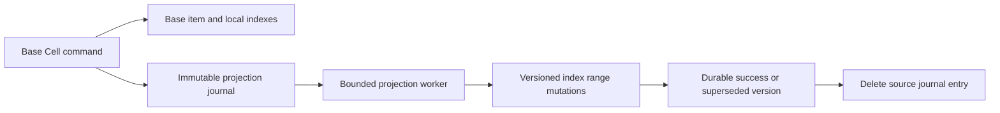

# Global secondary indexes

## Current implementation

CreateTable installs independent index range Cells before publishing the base
route. The table and each index have separate HASH distributions and range
identities. An index entry includes the base primary key, so duplicate index
keys do not overwrite one another. Missing index key attributes make an item
sparse. ALL, KEYS_ONLY, and INCLUDE projections are stored in the index Cell;
Query and Scan never fetch unprojected base attributes.

Index Query supports HASH-only indexes, ordered RANGE comparisons, forward and
reverse pagination, and continuation keys containing the union of base and
index keys. Scan uses the index directory and the index HASH distribution for
parallel segments. The pinned ExtendDB engine rejects strongly consistent GSI
reads and ALL_ATTRIBUTES on partial projections.

This is an initial-index implementation. Online Create/Delete/Update index
operations, automatic index range splits, index statistics, tombstone collection,
and fleet-scale recovery qualification remain unfinished. Each index range has
a 512-MiB database budget and a 64-MiB capture budget. Adding initial ranges is
not an unlimited scaling claim.

## Durable asynchronous maintenance

A base Put, Update, or Delete inserts its journal entry in the same command as
the data change. Transaction PREPARE stores no projection entry. COMMIT creates
entries while applying staged base images; ABORT discards the staged images
without emitting projection work. Prepare reserves space for journal metadata
and the old/new images in addition to the existing base/local-index claim.
The account and routed participant paths use the same journal representation.

One entry contains the table/index generation snapshot, old and new base images,
and the source range epoch plus actor sequence. It is shared across the table's
indexes. Payload reads use 128-KiB chunks, so large old/new pairs do not have to
fit one SQL result or peer response. An unchanged projection creates no work.

For each index, the worker removes the old entry when the canonical key changes,
then writes the new projected entry. A same-key replacement writes only the new
image. The source acknowledges the journal entry only after every required
mutation has a durable successful result. A lost reply, failed index owner, or
interrupted worker leaves the entry available for retry. Concurrent workers may
process the same entry safely.

Each index row retains a lexicographically ordered `(source_epoch, sequence)`
version, a content digest, and either its projected image or a tombstone.
Older versions are ignored, equal versions with identical content replay, and
equal versions with different content are rejected. A delayed old image cannot
resurrect a removed entry. Index identities include the base key, so versions
from different base items do not compete. This relies on the base routing
contract: a key has one owner and a split gives its successor a higher epoch.

GSI propagation is eventual. A successful base transaction does not imply that
all of its GSI changes are already visible, or that index readers observe them
atomically. This follows the [AWS propagation contract](https://docs.aws.amazon.com/amazondynamodb/latest/developerguide/transaction-apis.html).

## Splits and recovery

Base split sealing rejects pending projection entries as well as transaction
locks. Split imports therefore copy already-projected images and do not emit
new projection work. A later child mutation has a newer source epoch. The
seal check and state transition share one command, preventing a write from
slipping between the journal check and the source fence.

Startup discovers each index's published directory and restores Idle or expired
owners through the same fenced admission machinery as data ranges. The private
peer receiver accepts the index namespace. The supervised projection worker
then resumes the durable source journals.

The worker rotates configured accounts, pages table names, and visits at most
one base route page per iteration, with four source entries in flight. It
advances past failed sources so healthy sources can progress; failed entries
remain for a later sweep. Sweep cursors are transient and restart from the
beginning. Projection versions and journal contents are durable.

There is no independent index placement scheduler or serving-time index-owner
failure recovery guarantee. Startup restoration does not qualify fleet RTO.
A sustained write rate above projection capacity eventually consumes the finite
base Cell budget; steady-state throughput and journal admission need further
qualification.

## Evidence map

| Boundary | Source |
| --- | --- |
| API metadata and provisioning | `src/backend.rs`, `src/table.rs`, `src/provision.rs` |
| Base mutation and transaction apply | `src/items.rs`, `src/items/transaction.rs`, `src/partition.rs`, `src/partition/transaction.rs` |
| Durable source journal | `src/global_index/outbox.rs`, `src/global_index_outbox_schema.sql`, `src/item_storage.rs` |
| Routed replay and acknowledgement | `src/backend/global_index.rs` |
| Versioned index storage and reads | `src/global_index.rs`, `src/global_index/read.rs`, `src/global_index_schema.sql` |
| Index directory | `src/global_index/routing.rs`, `src/routing.rs`, `src/schema.sql` |
| Server worker and peer reachability | `src/bin/beyonddb.rs`, `src/server/peer_receiver.rs` |
| Focused recovery fixture | `tests/elastic_cells/global_indexes.rs` |
| Signed SDK process fixture | `tests/server_binary/global_indexes.rs` |

The focused fixture interrupts a key move after the old index entry is removed,
restores owners, and checks journal completion, duplicate apply, stale-image
suppression, split fencing, and chunked old/new images larger than 700 KiB.
The process fixture covers creation of all three projections, duplicate index
keys, sparse entries, Query/parallel Scan pagination, transaction key moves and
deletes, rejected strong reads, and replay after owner restart. The signed SDK/RustFS process fixture passed in 330.55 seconds before the
runtime read-replica rebase. The expanded elastic suite passed all 28 tests in
86.28 seconds, including partial-projection restart and binary prefix bounds.
The account and peer-owner tests passed in 3.41 and 99.12 seconds. These are
selected-path results; fleet throughput and recovery remain unqualified.

The new index metadata, journal schemas, and Cell namespace change the unreleased
storage format. Development roots from earlier builds require reprovisioning.
No dependency pin, override, or lockfile changes are required.
