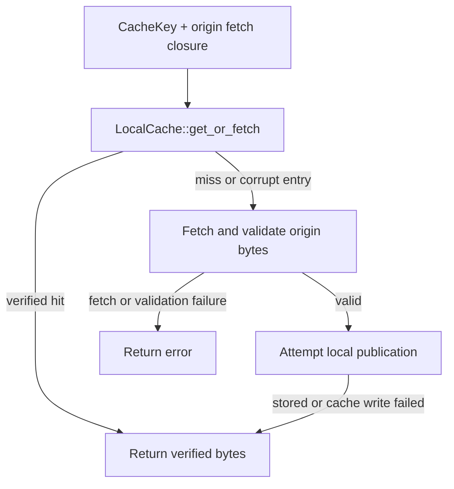

# crab-cache

Shared cache identities, local disk caching, and optional HTTP cache clients.
Use this crate for cache mechanics; use
[`crab-cache-store`](../crab-cache-store/README.md) to compose cache reads with an
origin store.

## Choose a feature

Default features are empty. Enable only the surface the caller needs:

| Feature | Surface |
| --- | --- |
| None | Cache keys, roots, path classification, service contracts |
| `local-cache` | Verified object cache, catalog, health inspection, cleanup, shard hints |
| `xet-chunk-cache` | Decoded-range cache and shared catalog/lifecycle support |
| `active-probe` | HTTP service probes |
| `remote-client` | HTTP cache client; includes `active-probe` |

[Cargo.toml](Cargo.toml) defines feature dependencies;
[src/lib.rs](src/lib.rs) shows their exported APIs.

## Read path



- Chunks, shards, and xorbs use content identities. Manifests use names and
  optional ETags; stage entries use logical keys.
- Read-through publication failures do not discard validated origin bytes.
  Fetch and validation failures still propagate. Explicit `put` calls are fallible.
- `LocalCache::new` has no disk cap. Bounded retention uses `Some(bytes)`, including
  zero; per-object validation limits still apply.
- Manifest body/ETag publication is not an atomic pair. Logical manifest and
  stage-content validation belongs to the caller.

## Usage

Enable local caching in a consuming Crab workspace member. This crate is not
published to the registry; the example below caches a verified chunk:

```toml
[dependencies]
crab-cache = { workspace = true, features = ["local-cache"] }
bytes = { workspace = true }
crab-xet = { workspace = true }
```

```rust
use bytes::Bytes;
use crab_cache::{CacheKey, LocalCache};
use crab_xet::hash::compute_data_hash;

async fn example() -> Result<(), Box<dyn std::error::Error>> {
    let cache = LocalCache::new(".cache/crab".into());
    let payload = Bytes::from_static(b"cached chunk");
    let hash = compute_data_hash(payload.as_ref());

    let result = cache
        .get_or_fetch(&CacheKey::Chunk(hash), || async {
            Ok::<_, crab_cache::CacheError>(payload.clone())
        })
        .await?;
    assert_eq!(result, payload);
    Ok(())
}
```

## Navigate the implementation

| Change | Start here | Follow through |
| --- | --- | --- |
| Key or route classification | [key.rs](src/key.rs), [path_class.rs](src/path_class.rs) | [cache-store adapter](../crab-cache-store/src/lib.rs) |
| Object fill or repair | [local_cache.rs](src/local_cache.rs) | [read-through tests](src/local_cache/tests/read_through.rs), [repair tests](src/local_cache/tests/read_repair.rs) |
| Budget and eviction | [catalog.rs](src/catalog.rs) | [removal.rs](src/catalog/removal.rs) |
| Disk cleanup | [clean.rs](src/clean.rs), [lifecycle.rs](src/lifecycle.rs) | [private_fs.rs](src/private_fs.rs) |
| Health reporting | [health.rs](src/health.rs) | [health tests](src/health/tests.rs) |
| Remote client | [cache_client.rs](src/cache_client.rs) | [service.rs](src/service.rs) |

## Persistence and service contracts

The [reference](REFERENCE.md) covers file identity, read repair, SQLite ownership,
capacity admission, advisory hints, and cleanup. It keeps platform and crash
qualification limits beside the relevant contract.

Directory guards coordinate cooperating local owners. Callers must join their
workers before dropping a guard. Cache contents remain disposable; cleanup
retains unknown state and does not authorize recursive deletion.

For remote caches, enable `remote-client`, configure `CacheClient` authentication,
and inspect health/capabilities before service-specific operations. Credential
values are omitted from diagnostic `Debug` output.

## Work on this crate

[AGENTS.md](AGENTS.md) maps ownership, invariants, and focused verification.
Local-cache and decoded-range features share filesystem/catalog code: changes
there need evidence for both enabled paths and the affected platform.

## Boundaries

- [`crab-cache-store`](../crab-cache-store/README.md) composes these cache
  primitives with an origin `Store` and owns fallback behavior.
- [`crab-storage`](../crab-storage/README.md) remains the source of truth;
  cache entries are disposable and must never weaken origin integrity checks.
- [`crab-read`](../crab-read/README.md) owns reconstruction and shard
  completeness, while this crate owns object reuse.

Private SQLite opens verify byte-lock exclusion through two independently opened
descriptors before reading or initializing the database generation. Filesystems
that accept OFD lock calls without enforcing exclusion are rejected as unsafe.
Shared-memory opens repeat this check on the actual side file before truncation
or mapping: a newly created side file can behave differently from a reopened
main file. The check protects live WAL mappings from another opener's reset.
The probe uses a byte beyond SQLite's lock region and releases its locks on both
success and failure; it does not modify database contents.
