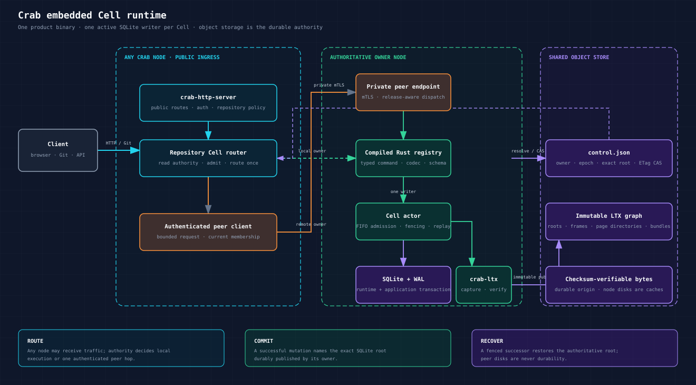
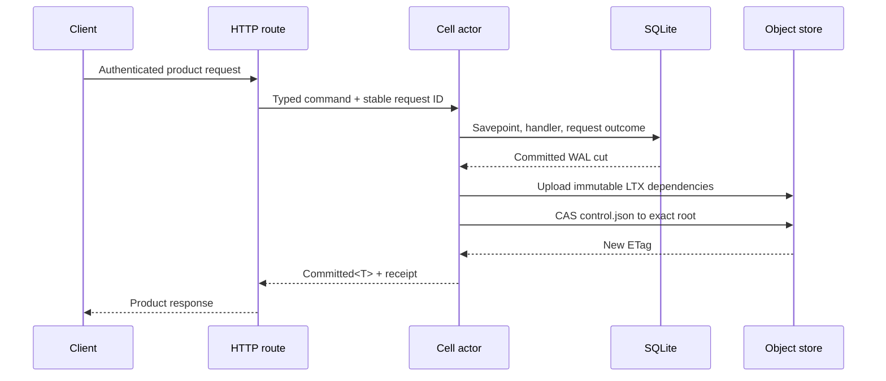
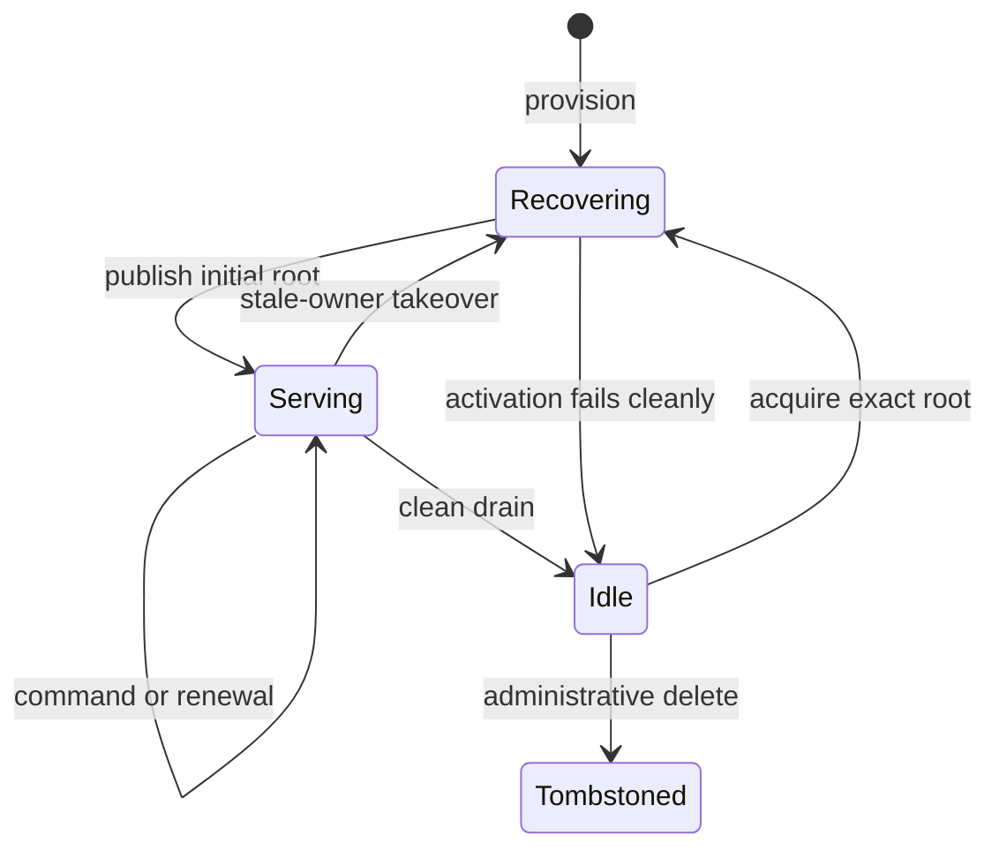
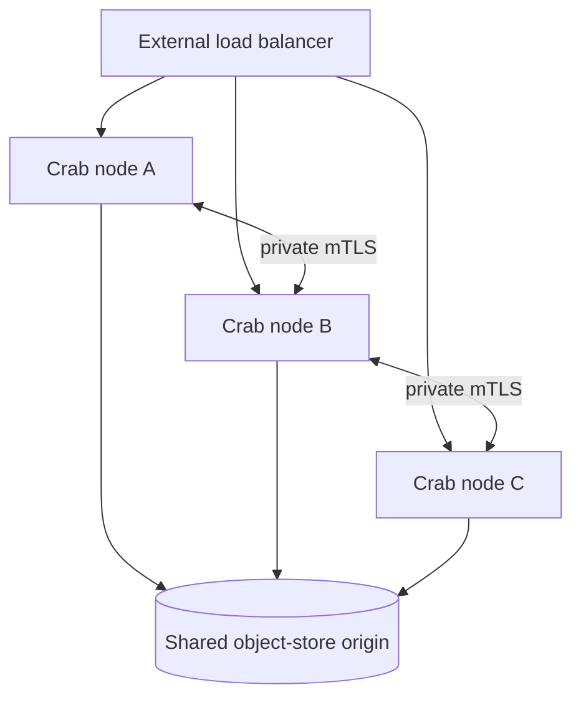

# Understand the embedded Cell runtime

Crab stores each repository's collaboration state in one SQLite **Cell**. A Cell has one active writer, publishes immutable Log Transaction (LTX) data to object storage, and can reopen on another Crab node. Product code stays in Rust and is compiled into `crab-http-server`.

| Document intent | Value |
| --- | --- |
| Content type | Conceptual landing page |
| Audience | Crab contributors and fleet operators |
| Goal | Explain the runtime boundary, request path, durability point, and reading order |
| Status | Implemented, with production capacity and multi-Pod fault qualification still required |

## See the system in one diagram

The public HTTP server owns authentication and repository policy. The runtime owns deterministic execution, SQLite state, publication, and takeover.



The direct green route is local execution. The orange route is the single authenticated peer hop when another node owns the Cell. Both converge on the same registry, actor, SQLite, and LTX publication path.

The dependency direction follows the same boundary:

```text
crab-storage <- crab-ltx <- crab-cell-runtime <- crab-http-server
```

Lower crates never import HTTP, Git, repository authorization, or provider configuration.

## Follow one mutation

A successful mutation response means its SQLite outcome is covered either by
the exact object-store root or by every selected follower's fsynced node-log
tail. Fleet-only outcomes are recovered before a successor serves the Cell;
object publication continues while later work stays queued on that Cell.



If the control compare-and-swap (CAS) result is unknown, the actor reloads authority. It accepts only the exact proposed successor. It never reruns the SQL callback to guess the result.

## Know what a Cell contains

Each Cell combines runtime metadata and one application schema in the same SQLite transaction.

| Layer | Stored data | Owner |
| --- | --- | --- |
| Runtime | Request outcomes, effects, inbox, sequence, due summary | `crab-cell-runtime` |
| Application | Repository collaboration rows or one primitive shard | Compiled Rust module |
| Local cache | SQLite main file, WAL, retained LTX, sparse pages | Current Crab node |
| Durable data | Immutable roots, LTX bodies, indexes, control record | Object store |
| External product data | Git, Xet, LFS, release assets | Existing Crab subsystems |

One command changes one Cell. Cross-Cell work uses durable effects and idempotent destination inboxes, not distributed SQL transactions.

## Understand the ownership model

The object-store control record is the authority for the Cell's owner and root.



The runtime applies these rules:

- **Single writer**: one owner session and epoch may publish the next root
- **Fencing**: an ownership mismatch closes admission before more SQL runs
- **Exact recovery**: takeover opens the root named by authoritative control
- **Disposable owner-local SQLite**: selected followers may durably fsync recent
  LTX tails, but the owner's mutable SQLite files remain disposable caches
- **Bounded work**: commands, results, queues, workers, memory, and disk have explicit limits

Read [runtime.md](runtime.md) for the actor and failure state machines. Read [storage.md](storage.md) for identity, control, root, and LTX formats.

## Build applications as native Rust modules

V1 is not a general code-hosting platform. A Crab contributor registers typed Rust handlers at build time.

```rust,ignore
impl Command for CreateIssue {
    const MODULE: &'static str = "repository";
    const ID: u32 = 1;
    const CODEC_VERSION: u32 = 1;

    type Input = CreateIssueInput;
    type Output = Issue;

    fn execute(
        context: &mut CommandContext<'_, '_>,
        input: Self::Input,
    ) -> Result<CommandResult<Self::Output>> {
        let rows = context.sql(&input.insert_batch())?;
        Ok(CommandResult::Success(Issue::decode(rows)?))
    }
}
```

Handlers receive bounded transaction capabilities. They don't receive raw storage credentials, database paths, or network access.

The runtime has no JavaScript host, WebAssembly host, dynamic library loader, or public primitive endpoint. Browsers continue to use Crab's product HTTP API.

Read [rust-api.md](rust-api.md) for module registration, typed commands, queries, activities, and peer routing.

## Choose a persistence primitive

The primitives share the same actor, transaction, publication, recovery, and admission path.

| Primitive | Use it for | Partition key | Delivery contract |
| --- | --- | --- | --- |
| SQL | Repository-local relational state | Explicit repository UUID | Serializable single-Cell command |
| KV | Scoped metadata and atomic checks | Scope hash | Atomic batch within one shard |
| Blob | Object-store parts and range reads | Object-key hash | SQLite manifest and content-addressed part references within one shard |
| Queue | Deferred work | Producer hash for send, explicit shard for claim | At least once |
| Cron | Recurring typed triggers | Schedule-ID hash | Atomic occurrence effect and schedule advance |
| Workflow | Durable state machines, timers, activities | Workflow ID hash | Deterministic transition plus retryable activity |

Read [primitives.md](primitives.md) for schemas, state transitions, limits, and examples.

## Deploy one Crab server per node

Each Kubernetes Pod or virtual machine runs one `crab-http-server` process. Every eligible node compiles the same registry and advertises its release, capacity, and scheduler progress.



The external load balancer may send a request to any node. That node resolves the authoritative Cell owner and either executes locally or forwards once over the authenticated management network.

Read [deployment.md](deployment.md) for node sizing, release activation, Kubernetes lifecycle, backup, and cutover.

## Apply the hard cutover contract

Cell data starts empty. Crab does not import, dual-read, dual-write, or fall back to the retired native-bucket collaboration format.

The operator performs this sequence:

1. Stop and fence every legacy writer
2. Manually delete retired `app/v1` collaboration keys and the old HTTP catalog
3. Keep canonical Git, Xet, LFS, and release-asset objects
4. Run repository adoption for each retained Git repository
5. Verify that adoption published a new empty Cell before enabling traffic

This rule removes compatibility branches from product code. It does not permit deletion of canonical Git objects.

## Use the documentation by task

| Task | Read |
| --- | --- |
| Design an application from entity, shard, workflow, and read-model Cells | [Application framework](application-framework.md) |
| Understand the actor, publication, timeout, or takeover path | [Runtime execution](runtime.md) |
| Design follower durability, response gating, and warm failover | [Follower durability and warm failover](failover-and-followers.md) |
| Complete canonical LTX scaling and decide standalone replication | [Canonical Cell LTX scaling](canonical-ltx-scaling.md) |
| Inspect persistent identities, paths, control JSON, or LTX roots | [Storage and recovery](storage.md) |
| Implement SQL, KV, Blob, Queue, Cron, Workflow, or effects | [Primitive contracts](primitives.md) |
| Add a native product feature | [Rust programming model](rust-api.md) |
| Size or operate a fleet | [Deployment and operations](deployment.md) |
| Verify implementation coverage and remaining gates | [Delivery and qualification](delivery.md) |
| Inspect normative schemas or peer messages | [`contracts/`](contracts/) |

## Treat these contracts as normative

Contract precedence is:

1. SQL and Protocol Buffers files in [`contracts/`](contracts/)
2. Rust types and validation in `crab-cell-runtime`
3. This documentation for ordering, ownership, and operational policy

The validation script checks SQL constraints, Protocol Buffers fixtures, Markdown links, and code fences:

```bash
node crates/crab-cell-runtime/docs/validate.mjs
```

## Respect the initial limits

These values are admission contracts, not benchmark results.

| Resource | Initial limit |
| --- | ---: |
| Command input, result, or workflow state | 1 MiB each |
| SQL batch | 128 statements |
| SQL query result | 1,000 rows and 1 MiB |
| KV atomic batch | 128 mutations |
| KV value | 64 KiB |
| Blob part / range read | 256 KiB / 512 KiB |
| Queue payload | 256 KiB |
| Cron payload / interval | 256 KiB / 1 second to 1 year |
| Queue or activity lease | 5s to 300s, 30s default |
| Native transaction wall budget | 5s |
| Public transport wait | 30s default, 60s maximum |
| Owner renewal | Every 3s |
| Self-fence threshold | 10s |
| Takeover observation | 15s unchanged control |
| Open Cells per node target | 1,000 to 10,000 |
| Aggregate command target | 1,000 commands/s per node |

Node profiles do not promise these targets without the qualification described in [delivery.md](delivery.md#capacity-qualification).
