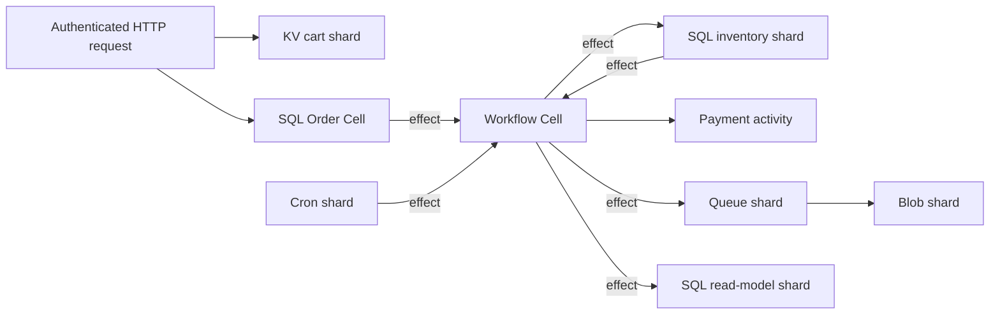

# Build a complete Commerce application

This example exercises the complete proposed application framework over the
Cell runtime: custom SQL entity and read-model Cells, KV, Blob, Queue, Cron,
Workflow, cross-Cell effects, external activities, generated clients, node
composition, authenticated HTTP adaptation, receipted reads, ambiguous-result
resolution, and owner-loss recovery.

| Document intent | Value |
| --- | --- |
| Content type | End-to-end target API example |
| Audience | Application owners and framework implementers |
| Goal | Make the proposed application framework concrete enough to implement and evaluate |
| Status | Mixed status: the handwritten `crab-cell-app` reference test registers SQL, KV, Blob, Queue, Cron, Workflow, Activity, and Effects through one descriptor, and `CellNode` is used by the server; the Commerce snippets below remain an illustrative target while generated clients, full operator ownership, and protected owner-loss evidence remain open |

[Back to the application framework design](application-framework.md)

The example is an executable design target, not a claim that every snippet
compiles today. Existing low-level contracts named here—`Command`, `Query`,
`CellClient`, primitive mechanics, receipts, effects, activities, exact roots,
and runtime publication—are implemented. The current `crab-cell-app` reference
test proves registration and one successful typed invocation for SQL, KV, Blob,
Queue, Cron, Workflow, Activity, and Effects through a bounded local multi-Cell
router, while
`crab-cell-host` and `crab-http-server` prove the initial node-facade adoption;
generated clients, complete operator ownership, and protected provider
qualification still require the remaining plans.

## Follow the application flow

The Commerce application uses every persistence and coordination primitive for
one coherent request:



1. A customer builds a cart in sharded KV.
2. `PlaceOrder` commits the order and a workflow-start effect in one Order Cell.
3. The Checkout workflow sends typed reservation effects to inventory shards.
4. Inventory shards deduplicate reservations and signal the workflow.
5. A payment activity calls the external provider with a stable idempotency key.
6. The workflow sends a fulfillment job and customer-index projection effects.
7. A worker claims the job, renders and stores an invoice through Blob, sends
   mail, and acknowledges the exact queue lease.
8. Cron starts the same workflow contract for subscription renewals.

There is no multi-Cell transaction. Each arrow is either a published command,
a durable effect with inbox deduplication, or a leased activity with an explicit
external idempotency contract.

## Organize the application crate

The application keeps domain code separate from node and transport policy:

```text
commerce/
├── Cargo.toml
├── migrations/
│   ├── orders/0001.sql
│   ├── inventory/0001.sql
│   └── customer_order_index/0001.sql
└── src/
    ├── lib.rs
    ├── ids.rs
    ├── values.rs
    ├── orders.rs
    ├── inventory.rs
    ├── carts.rs
    ├── invoices.rs
    ├── fulfillment.rs
    ├── renewals.rs
    ├── checkout.rs
    ├── customer_order_index.rs
    ├── activities.rs
    ├── worker.rs
    ├── http.rs
    └── main.rs
```

The generated module contributes `generated::CommerceClient`, descriptor
fixtures, typed namespace accessors, operation dispatch, and release bytes. It
does not contain application authorization or provider credentials.

## Declare stable values and identifiers

All values that cross the runtime boundary use a bounded canonical codec. The
derive is proposed syntax for generating the existing `WireValue` contract.

```rust,ignore
use crab_cell_app::CellValue;

#[derive(Clone, Copy, CellValue, PartialEq, Eq)]
pub struct OrderId(pub [u8; 16]);

#[derive(Clone, Copy, CellValue, PartialEq, Eq)]
pub struct CustomerId(pub [u8; 16]);

#[derive(Clone, CellValue, PartialEq, Eq)]
pub struct LineItem {
    #[cell(max_bytes = 64)]
    pub sku: String,
    pub quantity: u32,
    pub unit_price_cents: u64,
}

#[derive(Clone, CellValue, PartialEq, Eq)]
pub struct PlaceOrderInput {
    pub order_id: OrderId,
    pub customer_id: CustomerId,
    #[cell(max_items = 64)]
    pub lines: Vec<LineItem>,
}

#[derive(Clone, CellValue, PartialEq, Eq)]
pub enum PlaceOrderOutcome {
    Placed,
    AlreadyExists,
    Empty,
}
```

The application stores stable identifiers in source rather than deriving them
from names or registration order:

```rust,ignore
pub const ORDERS: NamespaceId = NamespaceId::from_bytes([0x01; 16]);
pub const INVENTORY: NamespaceId = NamespaceId::from_bytes([0x02; 16]);
pub const CARTS: NamespaceId = NamespaceId::from_bytes([0x03; 16]);
pub const INVOICES: NamespaceId = NamespaceId::from_bytes([0x04; 16]);
pub const FULFILLMENT: NamespaceId = NamespaceId::from_bytes([0x05; 16]);
pub const RENEWALS: NamespaceId = NamespaceId::from_bytes([0x06; 16]);
pub const CHECKOUTS: NamespaceId = NamespaceId::from_bytes([0x07; 16]);
pub const CUSTOMER_ORDER_INDEX: NamespaceId = NamespaceId::from_bytes([0x08; 16]);
```

Changing a constant creates a different namespace and therefore different Cell
IDs. A rename leaves the constant unchanged.

## Register the complete application

The application registry includes every target before a node becomes ready.
The builder verifies migrations, bindings, byte limits, effect targets,
workflow definitions, activities, primitive roles, and shard topology.

```rust,ignore
use crab_cell_app::{CellApplication, CellApplicationBuilder};

pub struct Commerce;

impl CellApplication for Commerce {
    const NAME: &'static str = "commerce";

    fn register(builder: &mut CellApplicationBuilder) -> Result<()> {
        builder.entity::<Orders>()?;
        builder.sharded_sql::<Inventory>()?;
        builder.kv::<ShoppingCarts>()?;
        builder.blob::<InvoiceDocuments>()?;
        builder.queue::<FulfillmentJobs>()?;
        builder.cron::<SubscriptionRenewals>()?;
        builder.workflow::<CheckoutRuns>()?;
        builder.read_model::<CustomerOrderIndex>()?;

        builder.activity::<ChargePayment>()?;
        builder.activity::<SendOrderEmail>()?;
        builder.finish_module::<CommerceModule>()
    }
}
```

The resulting generated client exposes only the declared capabilities:

```rust,ignore
pub struct CommerceClient {
    pub fn orders(&self, id: OrderId) -> OrderClient;
    pub fn inventory(&self, sku: &str) -> InventoryClient;
    pub fn shopping_carts(&self) -> KvNamespace<ShoppingCarts>;
    pub fn invoice_documents(&self) -> BlobNamespace<InvoiceDocuments>;
    pub fn fulfillment_jobs(&self) -> QueueNamespace<FulfillmentJobs>;
    pub fn subscription_renewals(&self) -> CronNamespace<SubscriptionRenewals>;
    pub fn checkout_runs(&self) -> WorkflowNamespace<CheckoutRuns>;
    pub fn customer_orders(&self, customer: CustomerId) -> CustomerOrderIndexClient;
}
```

## Store the Order aggregate in a SQL Cell

Each order is an entity Cell selected by `OrderId`. Its SQL migration is
application-owned and digest-checked:

```sql
CREATE TABLE orders (
    order_id BLOB PRIMARY KEY CHECK(length(order_id) = 16),
    customer_id BLOB NOT NULL CHECK(length(customer_id) = 16),
    status INTEGER NOT NULL,
    total_cents INTEGER NOT NULL,
    created_at_ms INTEGER NOT NULL
) STRICT;

CREATE TABLE order_lines (
    line_number INTEGER PRIMARY KEY,
    sku TEXT NOT NULL CHECK(length(sku) BETWEEN 1 AND 64),
    quantity INTEGER NOT NULL CHECK(quantity > 0),
    unit_price_cents INTEGER NOT NULL CHECK(unit_price_cents >= 0)
) STRICT;
```

The Cell type declares the persistent partition and effect targets:

```rust,ignore
pub struct Orders;

impl CellEntity for Orders {
    const MODULE: &'static str = "commerce.orders";
    const NAMESPACE: NamespaceId = ORDERS;
    const DATABASE_LIMIT_BYTES: u64 = 64 * MIB;
    const EFFECT_TARGETS: &'static [NamespaceId] = &[
        CHECKOUTS,
        CUSTOMER_ORDER_INDEX,
    ];

    type Key = OrderId;

    fn partition(id: &OrderId) -> EntityKey {
        EntityKey::new(&id.0)
    }

    fn register(registry: &mut RegistryBuilder) -> Result<()> {
        registry.migration(1, include_str!("../migrations/orders/0001.sql"))?;
        registry.bind_command::<PlaceOrder>()?;
        registry.bind_command::<SetOrderStatus>()?;
        registry.bind_query::<GetOrder>()?;
        Ok(())
    }
}
```

`PlaceOrder` changes only its Order Cell and records a typed workflow-start
effect in the same transaction:

```rust,ignore
pub struct PlaceOrder;

impl Command for PlaceOrder {
    const MODULE: &'static str = Orders::MODULE;
    const ID: u32 = 1;
    const CODEC_VERSION: u32 = 1;

    type Input = PlaceOrderInput;
    type Output = PlaceOrderOutcome;

    fn execute(
        context: &mut CommandContext<'_, '_>,
        input: Self::Input,
    ) -> Result<CommandResult<Self::Output>> {
        if input.lines.is_empty() {
            return Ok(CommandResult::Rejected(PlaceOrderOutcome::Empty));
        }
        if order_exists(context, input.order_id)? {
            return Ok(CommandResult::Rejected(
                PlaceOrderOutcome::AlreadyExists,
            ));
        }

        insert_order(context, &input)?;
        insert_lines(context, &input.lines)?;

        context.emit_effect(&CheckoutRuns::start_effect(
            input.order_id,
            CheckoutState::new(&input),
        )?)?;

        Ok(CommandResult::Success(PlaceOrderOutcome::Placed))
    }
}
```

The handler does not call the workflow Cell. It writes an effect row beside the
order so a crash can lose neither the order nor its workflow intent.

The query uses an optional write receipt supplied by the generated client:

```rust,ignore
pub struct GetOrder;

impl Query for GetOrder {
    const MODULE: &'static str = Orders::MODULE;
    const ID: u32 = 1;
    const CODEC_VERSION: u32 = 1;

    type Input = ();
    type Output = Option<Order>;

    fn execute(context: &mut QueryContext<'_>, _: ()) -> Result<Self::Output> {
        load_order_with_lines(context)
    }
}
```

## Store shopping carts in KV

Carts are small scoped records, so they share fixed KV shards rather than
opening one SQLite database per cart.

```rust,ignore
pub struct ShoppingCarts;

impl KvModule for ShoppingCarts {
    const MODULE: &'static str = "commerce.carts";
    const NAMESPACE: NamespaceId = CARTS;
    const SHARDS: u32 = 256;
    const ATOMIC_COMMAND_ID: u32 = 1;
    const GET_QUERY_ID: u32 = 1;
    const LIST_QUERY_ID: u32 = 2;
}
```

An HTTP command adds an item with optimistic concurrency:

```rust,ignore
let carts = commerce.shopping_carts();
let scope = customer_id.0.to_vec();

let updated = carts
    .atomic(
        request.mutation_identity()?,
        KvAtomicRequest {
            scope: scope.clone(),
            checks: vec![KvCheck {
                key: b"version".to_vec(),
                condition: KvCondition::Version(expected_version),
            }],
            mutations: vec![
                KvMutation::Put {
                    key: format!("line/{sku}").into_bytes(),
                    value: encode(&line)?,
                    expires_at_ms: Some(request.now_ms() + CART_LIFETIME_MS),
                },
                KvMutation::Put {
                    key: b"version".to_vec(),
                    value: next_version.to_be_bytes().to_vec(),
                    expires_at_ms: Some(request.now_ms() + CART_LIFETIME_MS),
                },
            ],
        },
    )
    .await?;
```

Both mutations and the version check execute in one KV shard transaction. The
fixed 256-shard count is part of the release topology.

## Reserve inventory in sharded SQL Cells

Inventory needs an atomic quantity invariant and therefore uses custom SQL.
The SKU hash selects one of 1,024 Cells.

```rust,ignore
pub struct Inventory;

impl ShardedSqlCell for Inventory {
    const MODULE: &'static str = "commerce.inventory";
    const NAMESPACE: NamespaceId = INVENTORY;
    const SHARDS: u32 = 1024;
    const EFFECT_TARGETS: &'static [NamespaceId] = &[CHECKOUTS];

    type Scope = String;

    fn shard(sku: &String) -> Result<u32> {
        shard_for_scope(Self::NAMESPACE, sku.as_bytes(), Self::SHARDS)
    }
}
```

The reservation command uses a stable reservation ID derived from the order and
line. A duplicate effect returns the first result:

```rust,ignore
impl Command for ReserveInventory {
    const MODULE: &'static str = Inventory::MODULE;
    const ID: u32 = 1;
    const CODEC_VERSION: u32 = 1;

    type Input = ReserveInventoryInput;
    type Output = ReserveInventoryOutcome;

    fn execute(
        context: &mut CommandContext<'_, '_>,
        input: Self::Input,
    ) -> Result<CommandResult<Self::Output>> {
        let outcome = reserve_if_available(context, &input)?;
        context.emit_effect(&CheckoutRuns::inventory_result_effect(
            input.order_id,
            input.line_number,
            outcome.clone(),
        )?)?;

        Ok(match outcome {
            ReserveInventoryOutcome::Reserved => CommandResult::Success(outcome),
            ReserveInventoryOutcome::Unavailable => CommandResult::Rejected(outcome),
        })
    }
}
```

Inventory and checkout do not commit atomically. The workflow retains the
pending-line set and compensates already reserved lines if another line fails.

## Coordinate checkout with Workflow

The workflow Cell is selected by `OrderId`. Its deterministic transition emits
effects and activities but performs no network I/O.

```rust,ignore
pub struct CheckoutRuns;

impl WorkflowModule for CheckoutRuns {
    const MODULE: &'static str = "commerce.checkout";
    const NAMESPACE: NamespaceId = CHECKOUTS;
    const SHARDS: u32 = 256;
    const START_COMMAND_ID: u32 = 1;
    const SIGNAL_COMMAND_ID: u32 = 2;
    const GET_QUERY_ID: u32 = 1;
}

pub struct CheckoutV1;

impl WorkflowDefinition for CheckoutV1 {
    fn digest(&self) -> Digest {
        CHECKOUT_V1_DIGEST
    }

    fn effect_targets(&self) -> &'static [NamespaceId] {
        &[INVENTORY, ORDERS, FULFILLMENT, CUSTOMER_ORDER_INDEX]
    }

    fn transition(
        &self,
        state: &[u8],
        event: &[u8],
        context: WorkflowContext,
    ) -> Result<WorkflowDecision> {
        let mut state = CheckoutState::decode(state)?;
        match CheckoutEvent::decode(event)? {
            CheckoutEvent::Started => {
                for line in &state.lines {
                    context.effect(Inventory::reserve_command(
                        line.sku.clone(),
                        state.order_id,
                        line,
                    )?)?;
                }
                state.phase = CheckoutPhase::Reserving;
                Ok(context.continue_with(state))
            }
            CheckoutEvent::InventoryResult { line, outcome } => {
                state.record_inventory(line, outcome)?;
                if state.has_failure() {
                    for reservation in state.successful_reservations() {
                        context.effect(Inventory::release_command(reservation)?)?;
                    }
                    context.effect(Orders::set_status_command(
                        state.order_id,
                        OrderStatus::InventoryFailed,
                    )?)?;
                    return Ok(context.complete(state.failed()));
                }
                if state.inventory_complete() {
                    context.activity::<ChargePayment>(state.payment_input())?;
                    state.phase = CheckoutPhase::Charging;
                }
                Ok(context.continue_with(state))
            }
            CheckoutEvent::PaymentCompleted(payment) => {
                context.effect(Orders::set_status_command(
                    state.order_id,
                    OrderStatus::Paid,
                )?)?;
                context.effect(FulfillmentJobs::send_command(
                    state.fulfillment_job(payment)?,
                )?)?;
                context.effect(CustomerOrderIndex::upsert_command(
                    state.customer_projection(OrderStatus::Paid),
                )?)?;
                Ok(context.complete(state.paid()))
            }
            CheckoutEvent::PaymentFailed(reason) => {
                for reservation in state.successful_reservations() {
                    context.effect(Inventory::release_command(reservation)?)?;
                }
                context.effect(Orders::set_status_command(
                    state.order_id,
                    OrderStatus::PaymentFailed,
                )?)?;
                Ok(context.complete(state.payment_failed(reason)))
            }
        }
    }
}
```

The workflow definition digest is pinned when a run starts. A rolling release
retains `CheckoutV1` while any stored run still names that digest.

## Charge through an external activity

The activity runs only after its claim root publishes. The payment provider
receives the stable activity attempt identity as its idempotency key.

```rust,ignore
pub struct ChargePayment;

impl Activity for ChargePayment {
    const TYPE: &'static str = "commerce.charge-payment";
    type Input = ChargePaymentInput;
    type Output = ChargePaymentOutput;

    async fn execute(
        context: ActivityContext,
        input: Self::Input,
    ) -> ActivityExecution<Self::Output> {
        let result = payment_provider()
            .charge(ChargeRequest {
                customer: input.customer,
                amount_cents: input.amount_cents,
                idempotency_key: context.idempotency_key(),
            })
            .await;

        match result {
            Ok(charge) => ActivityExecution::complete(
                ChargePaymentOutput::Paid { charge_id: charge.id },
            ),
            Err(error) if error.retryable() => {
                ActivityExecution::retry(error.retry_after())
            }
            Err(error) => ActivityExecution::fail(error.public_code()),
        }
    }
}
```

The supervisor publishes the completion event back into the workflow. Dropping
the worker future does not erase the durable claim or make an external charge
exactly once; provider idempotency closes that boundary.

## Project customer queries into a read-model Cell

Customer history is not queried by scanning Order Cells. A projection command
updates the customer's read-model shard after checkout changes state.

```rust,ignore
pub struct CustomerOrderIndex;

impl ReadModelCell for CustomerOrderIndex {
    const MODULE: &'static str = "commerce.customer-order-index";
    const NAMESPACE: NamespaceId = CUSTOMER_ORDER_INDEX;
    const SHARDS: u32 = 256;
    type Scope = CustomerId;
}

impl Command for UpsertCustomerOrder {
    const MODULE: &'static str = CustomerOrderIndex::MODULE;
    const ID: u32 = 1;
    const CODEC_VERSION: u32 = 1;
    type Input = CustomerOrderProjection;
    type Output = ();

    fn execute(
        context: &mut CommandContext<'_, '_>,
        projection: Self::Input,
    ) -> Result<CommandResult<()>> {
        upsert_projection(context, projection)?;
        Ok(CommandResult::Success(()))
    }
}
```

Projection identity derives from the source order and source commit sequence,
so repeated effect delivery is harmless. The API documents that this read model
is asynchronous and cannot satisfy an Order Cell receipt.

## Deliver fulfillment through Queue

Fulfillment is at least once. Producers hash by order ID; workers claim one
explicit shard at a time.

```rust,ignore
pub struct FulfillmentJobs;

impl QueueModule for FulfillmentJobs {
    const MODULE: &'static str = "commerce.fulfillment";
    const NAMESPACE: NamespaceId = FULFILLMENT;
    const SHARDS: u32 = 128;
    const SEND_COMMAND_ID: u32 = 1;
    const CLAIM_COMMAND_ID: u32 = 2;
    const LEASE_COMMAND_ID: u32 = 3;
    const VALIDATE_QUERY_ID: u32 = 1;
    const CONTROL_COMMAND_ID: u32 = 4;
    const INFO_QUERY_ID: u32 = 2;
}
```

The worker validates the published lease before external work, writes the
invoice, sends mail with an idempotency key, and then acknowledges the exact
lease token:

```rust,ignore
pub async fn run_fulfillment_shard(
    commerce: CommerceClient,
    shard: u32,
    cancellation: CancellationToken,
) -> Result<()> {
    while !cancellation.is_cancelled() {
        let claim = commerce
            .fulfillment_jobs()
            .claim(
                Request::new_random()?,
                shard,
                QueueClaimRequest {
                    limit: 16,
                    lease_ms: 30_000,
                },
            )
            .await?;

        let valid = commerce
            .fulfillment_jobs()
            .validate_claim(shard, claim.output.clone(), Some(claim.receipt))
            .await?;
        if !valid.output {
            continue;
        }

        for message in claim.output {
            match fulfill(&commerce, &message).await {
                Ok(()) => {
                    commerce
                        .fulfillment_jobs()
                        .ack(
                            Request::new_random()?,
                            shard,
                            message.message_id,
                            message.token,
                        )
                        .await?;
                }
                Err(error) if error.retryable() => {
                    commerce
                        .fulfillment_jobs()
                        .retry(
                            Request::new_random()?,
                            shard,
                            message.message_id,
                            message.token,
                            10_000,
                        )
                        .await?;
                }
                Err(error) => return Err(error),
            }
        }
    }
    Ok(())
}
```

The application supplies a stable request identity for every ack or retry. A
worker crash after external work but before ack repeats `fulfill`, so each
external destination must deduplicate by the job or order identity.

## Store invoices through Blob

Invoice bytes and their manifest live in one Blob shard transaction domain.
The worker uses multipart publication even though this example produces a small
document, keeping the same bounded path for larger invoices.

```rust,ignore
pub struct InvoiceDocuments;

impl BlobModule for InvoiceDocuments {
    const MODULE: &'static str = "commerce.invoices";
    const NAMESPACE: NamespaceId = INVOICES;
    const SHARDS: u32 = 128;
    const MUTATE_COMMAND_ID: u32 = 1;
    const QUERY_QUERY_ID: u32 = 1;
}

async fn store_invoice(
    commerce: &CommerceClient,
    order: OrderId,
    bytes: Vec<u8>,
) -> Result<BlobMetadata> {
    let blobs = commerce.invoice_documents();
    let key = format!("orders/{}/invoice.pdf", encode_hex(&order.0)).into_bytes();
    let upload = blobs
        .begin(Request::derived(order.0, b"invoice-begin"), key.clone())
        .await?;

    for (index, part) in bytes.chunks(256 * KIB).enumerate() {
        blobs
            .put_part(
                Request::derived(order.0, &(index as u32).to_be_bytes()),
                upload.output.upload_id,
                index as u32 + 1,
                part.to_vec(),
            )
            .await?;
    }

    let completed = blobs
        .complete(
            Request::derived(order.0, b"invoice-complete"),
            upload.output.upload_id,
            BlobCondition::CreateOnly,
        )
        .await?;
    Ok(completed.output)
}
```

Part digests are verified on write and range read. `complete` publishes the
manifest atomically with request outcome and Blob state. It does not expose a
separate uncommitted body path.

## Trigger subscription renewals through Cron

Cron stores the schedule and advances one occurrence in the same transaction
that records its workflow-start effect.

```rust,ignore
pub struct SubscriptionRenewals;

impl CronModule for SubscriptionRenewals {
    const MODULE: &'static str = "commerce.renewals";
    const NAMESPACE: NamespaceId = RENEWALS;
    const SHARDS: u32 = 64;
    const MUTATE_COMMAND_ID: u32 = 1;
    const QUERY_QUERY_ID: u32 = 1;
    type Target = CheckoutRuns;
}

let scheduled = commerce
    .subscription_renewals()
    .upsert(
        Request::new(request_id)?,
        SubscriptionId(subscription_id),
        CronSchedule::every(Duration::from_days(30))
            .starting_at(first_renewal_ms),
        RenewalInput {
            customer_id,
            subscription_id,
        },
    )
    .await?;
```

The registry verifies the Cron target command, codec, namespace, and input
limit before readiness. An owner crash cannot lose an occurrence after its
schedule advance publishes, and destination inbox deduplication prevents the
same occurrence from starting the workflow twice.

## Compose and start a Cell node

The service binary constructs one node. Application code never assembles
`CellRuntime`, `CellAuthority`, or `CellReplica` directly.

```rust,ignore
#[tokio::main]
async fn main() -> Result<()> {
    let config = Config::load()?;
    let provider = build_storage_provider(&config.storage).await?;
    let identity = load_application_identity(&provider, &config.root).await?;
    let registry = Commerce::compile(BuildDescriptor {
        source_revision: build_revision().to_owned(),
        cargo_lock_digest: cargo_lock_digest(),
    })?;

    let node = CellNode::builder()
        .identity(identity)
        .storage(provider, config.root)
        .data_directory(config.data_directory)
        .registry(registry)
        .resources(config.resources)
        .cluster(
            config.peer_transport()?,
            config.node_signer()?,
            config.private_endpoint,
        )
        .durability(Durability::FollowersOrObjectStore { followers: 2 })
        .telemetry(config.telemetry()?)
        .build()
        .await?;

    node.start().await?;
    let commerce = CommerceClient::new(node.application::<Commerce>()?);
    let workers = FulfillmentWorkers::start(commerce.clone(), node.resources())?;
    let http = serve_http(config.public_listener, commerce, node.readiness()).await?;

    shutdown_signal().await;
    http.close_admission();
    http.drain().await?;
    workers.stop().await?;
    node.drain(config.shutdown_deadline()).await?;
    node.shutdown().await
}
```

Provider construction, credentials, public listeners, authentication, and
process signals remain service concerns. The node owns Cell admission,
activation, peer routing, followers, publication, recovery, scheduling,
placement, eviction, backup integration, and ordered shutdown.

## Adapt an authenticated HTTP route

The external route authorizes the product action before calling the generated
application capability. It maps durable outcomes explicitly.

```rust,ignore
pub async fn place_order_route(
    State(state): State<HttpState>,
    Authenticated(principal): AuthenticatedPrincipal,
    Json(input): Json<PlaceOrderRequest>,
) -> HttpResult<Response> {
    state
        .authorizer
        .require(&principal, Action::PlaceOrder, input.customer_id)
        .await?;

    let request = Request::new(input.request_id)?
        .issued_at(input.issued_at_ms)
        .expires_at(input.expires_at_ms)
        .build()?;
    let order_id = OrderId(input.order_id);

    match state
        .commerce
        .orders(order_id)
        .create(order_id, request, input.into_domain())
        .await
    {
        Ok(committed) => Ok(created(committed.output, committed.receipt)),
        Err(ApplicationInvocationError::Rejected(rejection)) => {
            Ok(conflict(rejection.output, rejection.receipt))
        }
        Err(ApplicationInvocationError::Pending(pending)) => {
            Ok(accepted_for_resolution(pending))
        }
        Err(ApplicationInvocationError::Unavailable(error)) => Err(error.into()),
    }
}
```

The HTTP request ID is stable across client retries. A `Pending` response means
the mutation may have started and must be resolved; the adapter must not create
a new request ID and submit the business operation again.

## Resolve an ambiguous mutation

The generated pending token contains the target, incarnation, request identity,
operation digest, and result bound. It contains no storage credential or raw
SQL input.

```rust,ignore
pub async fn resolve_order(
    commerce: &CommerceClient,
    pending: PendingApplicationMutation<PlaceOrder>,
) -> Result<Resolution<PlaceOrderOutcome>> {
    loop {
        match commerce.resolve(&pending).await? {
            Resolution::Committed(result) => return Ok(result),
            Resolution::Absent => return Ok(Resolution::Absent),
            Resolution::Expired => return Ok(Resolution::Expired),
            Resolution::Unknown => tokio::time::sleep(RETRY_DELAY).await,
        }
    }
}
```

`Absent` means the authoritative current incarnation has no matching ledger
row. `Unknown` means the framework cannot yet prove absence or a committed
outcome. Incarnation change fails closed rather than searching stale local
state.

## Exercise the public application surface

An ordinary application test uses generated APIs and observes every primitive:

```rust,ignore
#[tokio::test]
async fn customer_checkout_reaches_a_queryable_invoice() -> Result<()> {
    let cluster = TestCluster::<Commerce>::new(3).await?;
    let commerce = cluster.client();
    let customer = CustomerId([1; 16]);
    let order = OrderId([2; 16]);

    commerce
        .shopping_carts()
        .atomic(cart_request(), add_line(customer, "sku-1", 2))
        .await?;

    let placed = commerce
        .orders(order)
        .create(order, place_request(), order_input(customer, order))
        .await?;

    let observed = commerce
        .orders(order)
        .get_order(ReadConsistency::After(placed.receipt))
        .await?;
    assert_eq!(observed.output.status, OrderStatus::Pending);

    cluster.activities().complete_next::<ChargePayment>(paid()).await?;
    cluster.workers().run_fulfillment_once().await?;

    let invoice = commerce
        .invoice_documents()
        .read_range(invoice_key(order), 0..4096, None)
        .await?;
    assert!(invoice.output.starts_with(b"%PDF"));

    let history = commerce
        .customer_orders(customer)
        .list(CurrentRead, first_page())
        .await?;
    assert_eq!(history.output.items[0].order_id, order);
    Ok(())
}
```

The test may poll workflow and projection state because those paths are
asynchronous. It uses the Order receipt only for an Order query, not for the
customer read model or Blob namespace.

## Prove owner loss and retry safety

The application qualification test kills the owner after the command is
accepted, loses its local directory, and verifies exact recovery through public
APIs:

```rust,ignore
#[tokio::test]
async fn acknowledged_order_survives_owner_and_local_disk_loss() -> Result<()> {
    let cluster = TestCluster::<Commerce>::new(3).await?;
    let commerce = cluster.client();
    let order = OrderId([7; 16]);
    let request = place_request();

    let committed = commerce
        .orders(order)
        .create(order, request.clone(), order_input(customer(), order))
        .await?;

    cluster
        .kill_owner_and_remove_local_state(committed.receipt.cell)
        .await?;

    let restored = commerce
        .orders(order)
        .get_order(ReadConsistency::After(committed.receipt))
        .await?;
    assert_eq!(restored.output.id, order);

    let replay = commerce
        .orders(order)
        .create(order, request, order_input(customer(), order))
        .await?;
    assert_eq!(replay.receipt.commit_sequence, committed.receipt.commit_sequence);

    cluster.assert_one_checkout_start(order).await?;
    Ok(())
}
```

Additional qualification injects:

- Lost control-CAS responses after publication
- Object-store timeout with follower proof available
- Follower loss with object-store proof available
- Duplicate inventory and projection effects
- Payment completion after activity lease expiry
- Fulfillment worker death after invoice publication but before queue ack
- Blob part corruption and range-read checksum failure
- Cron owner death between occurrence publication and delivery
- Workflow definition retention across rolling deployment
- Disk-full activation, capture, compaction, and hydration
- Pressure eviction followed by exact-root reacquisition

Every acknowledged order must remain queryable. Every duplicate request must
return the same durable decision or an explicit unresolved state. Corruption,
fencing, and incompatible releases fail closed.

## Understand what each primitive contributes

| Primitive | Commerce use | Boundary demonstrated |
| --- | --- | --- |
| Custom SQL | Order aggregate, inventory invariant, customer read model | Serializable state within one Cell |
| KV | Shopping carts | Atomic checks and mutations within one scope-derived shard |
| Blob | Invoice documents | Multipart data and manifest in one transactional shard |
| Queue | Fulfillment jobs | Published leases and at-least-once worker delivery |
| Cron | Subscription renewals | Failover-safe occurrence effect and schedule advance |
| Workflow | Checkout | Durable deterministic saga, timers, effects, and activities |
| Effects | Order, inventory, projection, and queue transitions | Transactional outbox and idempotent destination inbox |
| Activities | Payment and mail | Retryable external work after published claim |
| Receipts | Order create followed by Order query | Same-Cell read watermark |
| LTX and exact roots | All stateful primitives | Verified publication, source-loss recovery, and takeover |

The framework is successful when this application contains no object-store
path, owner election, peer message, LTX segment, control CAS, SQLite file,
runtime task, or recovery branch in its domain modules. Those mechanics remain
observable through outcomes and metrics but are owned by the node facade and
runtime.
