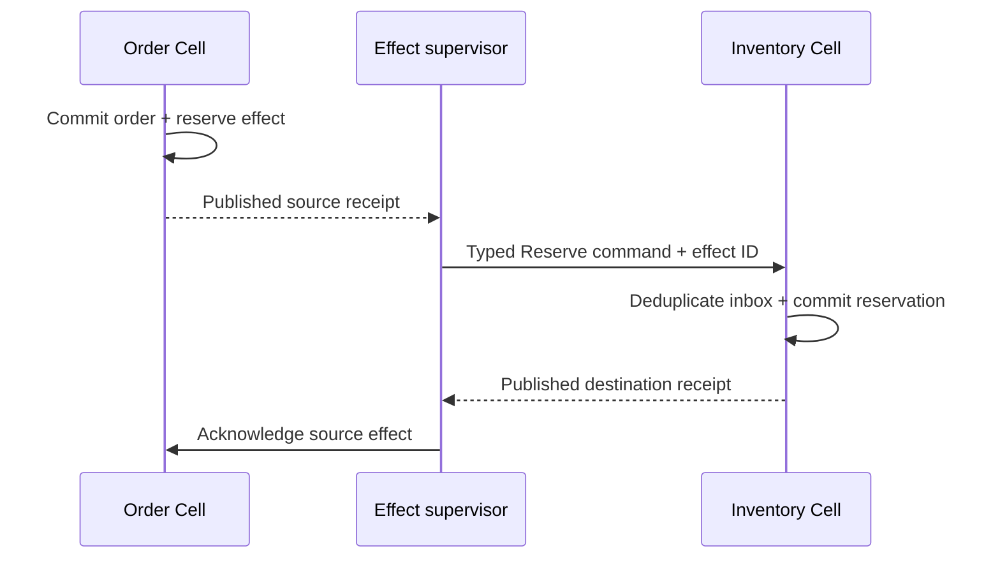

# Build large applications on the Cell runtime

Crab should expose an application framework above `crab-cell-runtime` so an
application owner defines durable Cell types, typed operations, partitioning,
and cross-Cell workflows without constructing catalogs, authority records,
LTX replicas, worker pools, or peer routes. The framework keeps the existing
single-writer and exact-root contracts; it does not turn Cells into a globally
distributed relational database.

| Document intent | Value |
| --- | --- |
| Content type | Target design with implemented boundary slice |
| Audience | Application framework, runtime, and product contributors |
| Goal | Define the application-owner programming model and the platform API needed to host it |
| Status | Boundary slice implemented: `crab-cell-app` supplies deterministic author compilation and a handwritten all-primitive reference application; `crab-cell-host` supplies the provider-neutral lifecycle shell and `crab-http-server` uses it for serving and offline maintenance. Code generation, full operator ownership, and protected qualification remain open |

[Back to the Cell runtime index](README.md)

[`crates/crab-cell-app/examples/authoring.rs`](../../crab-cell-app/examples/authoring.rs)
is the minimal compile-checked version of the flow below: one module with its
migration, one namespace, one cell type, and a finished `CompiledApplication`.
The prose snippets stay illustrative; the example is what CI compiles.

The [complete Commerce example](application-framework-example.md) remains the
target qualification shape for custom SQL Cells, KV, Blob, Queue, Cron,
Workflow, effects, activities, generated clients, node composition, HTTP
adaptation, and owner-loss qualification. It is not a production evidence
claim until the full-primitive workload and protected provider gates pass.

## Design for application owners

An application owner should make five durable decisions:

1. Which state must change atomically?
2. Which stable key selects that state?
3. Which commands and queries may access it?
4. Which operations cross a Cell boundary?
5. Which external work requires an idempotent activity?

The framework turns those decisions into compiled module descriptors, catalog
entries, typed clients, and release evidence. It owns the mechanics after the
application declares them.

```text
application source
  -> Cell type declarations
  -> commands, queries, workflows and activities
  -> compiled registry and typed client
  -> CellNode application host
  -> crab-cell-runtime
  -> crab-ltx
  -> crab-storage
```

Application code does not open SQLite files, select owners, publish LTX roots,
interpret peer messages, or retry ambiguous SQL mutations. Product adapters
continue to own authentication, authorization, HTTP or RPC policy, and mapping
external identities to application identities.

## Use four topology patterns

Large applications compose four Cell patterns. The application declares the
pattern for each namespace rather than treating every record as a separate
database.

| Pattern | Partition | Use | Main tradeoff |
| --- | --- | --- | --- |
| Entity Cell | Stable aggregate ID | Orders, repositories, projects, accounts, game sessions | Strong local invariants; one hot entity remains one writer |
| Shard Cell | Stable hash modulo fixed shard count | KV, queues, counters, rate limits, small records | Shares lifecycle overhead; shard contention must be sized |
| Workflow Cell | Workflow or business-process ID | Checkout, deployment, merge, provisioning | Durable orchestration; cross-Cell work is not one transaction |
| Read-model Cell | Query-domain shard | Search, dashboards, feeds, secondary indexes | Fast queries; updated asynchronously from source Cells |

State that must commit together belongs in one Cell. State that can be retried,
compensated, or projected may cross Cells through durable effects, workflows,
and activities.

The framework cannot transparently split a hot Cell because arbitrary SQLite
state has application-defined invariants. Repartitioning is a declared schema
and data migration with explicit source and destination ownership. Increasing a
namespace's shard count is therefore a release operation, not a live tuning
knob.

The implemented `CellType::with_entity_partitions` mode addresses distinct
entity Cells by a stable 33-byte partition digest under a namespace declared
with one shard. `CellType::entity_partition` derives the partition from the
entity identity, and `ApplicationHandle` checks its encoding. This provides
an application-validated target for an application's own split protocol; it
does not repartition or migrate data automatically.

## Separate the author and operator APIs

The public framework has two capability levels.

### Application author API

Application authors use:

- `CellApplication` to assemble modules into one release
- `CellType` to declare namespace, partitioning, schema, and limits
- `Command` and `Query` for deterministic in-Cell behavior
- typed primitive capabilities for KV, Queue, Blob, Cron, and Workflow
- `EffectContext` for typed cross-Cell commands
- `Activity` for external asynchronous work
- generated application clients for targeting and invocation

These APIs never expose `CellAuthority`, `CellReplica`, `PreparedRoot`, object
store credentials, database paths, or peer signing material.

### Platform operator API

Platform operators use:

- `CellNodeBuilder` to compose storage, local paths, runtime resources, and the registry
- one cluster transport for authenticated peer requests
- node identity, lease, follower, and placement configuration
- release activation and migration controls
- backup, retention, telemetry, and graceful shutdown controls

The operator API owns the current `CellCatalog`, `CellAuthority`, `CellRuntime`,
`CellReplica`, scheduler, supervisors, node durability, and routing composition.
It returns an application-bound client instead of exposing those parts
individually.

Binding an `ApplicationHandle` is fallible: its author type must name the
compiled application, and its `CellClient` must carry the same release digest
as the compiled registry. The host checks this before returning the handle,
so a client assembled with a different release cannot dispatch through an
application descriptor that validated a different set of operations.

## Declare one application

The initial framework remains statically linked Rust. Attributes reduce
descriptor boilerplate but do not introduce uploaded code, dynamic libraries,
JavaScript, WebAssembly, or subprocess handlers.

The following API is illustrative:

```rust,ignore
use crab_cell_app::{CellApplication, CellApplicationBuilder};

pub struct Commerce;

impl CellApplication for Commerce {
    const NAME: &'static str = "commerce";

    fn register(builder: &mut CellApplicationBuilder) -> crab_cell_app::Result<()> {
        builder.entity::<Orders>()?;
        builder.sharded::<Inventory>()?;
        builder.queue::<Fulfillment>()?;
        builder.workflow::<Checkout>()?;
        builder.read_model::<CustomerOrderIndex>()?;
        Ok(())
    }
}
```

The implemented `crab-cell-app::ApplicationBuilder::finish` produces the
existing canonical runtime registry plus an application topology descriptor.
Registration order does not change either digest, and every namespace in the
compiled registry must have exactly one matching `CellType` declaration;
undeclared runtime namespaces fail closed before the descriptor is emitted.

Every namespace declaration contains:

- Stable 16-byte namespace ID
- Human-readable name
- Topology pattern
- Partition codec and version
- Fixed shard count when sharded
- Initial schema and ordered migration digests
- Commands, queries, workflows, activities, and effect targets
- Input, output, state, database, and capture limits
- Provisioning policy
- Retained code and codec versions required for rolling rollout

Names are diagnostic. IDs, partition bytes, operation IDs, codec versions, and
migration digests are persistent contracts.

## Declare an entity Cell

An entity Cell co-locates one aggregate's transactional state. The application
declares its stable partition encoding and installs its schema through checked
migrations.

```rust,ignore
use crab_cell_app::{CellEntity, EntityKey};

pub struct Orders;

impl CellEntity for Orders {
    const MODULE: &'static str = "orders";
    const NAMESPACE: NamespaceId = NamespaceId::from_bytes(*b"commerce-orders1");
    const DATABASE_LIMIT_BYTES: u64 = 64 * 1024 * 1024;

    type Key = OrderId;

    fn partition(key: &Self::Key) -> EntityKey {
        EntityKey::new(key.as_bytes())
    }

    fn register(registry: &mut RegistryBuilder) -> Result<()> {
        registry.bind_command::<PlaceOrder>()?;
        registry.bind_command::<ConfirmOrder>()?;
        registry.bind_query::<GetOrder>()?;
        Ok(())
    }
}
```

Partition encoders must be canonical, bounded, and covered by byte fixtures.
Changing an entity key's encoding requires a new namespace or an explicit
repartitioning migration. The implemented entity mode stores a domain-separated
digest of the scope as its partition bytes. The application retains the mapping
from logical entity ID to target; the catalog retains the target bytes needed
for routing and recovery.

## Write deterministic commands

The framework reuses the current typed `Command` contract. Attributes may
generate descriptor entries, but operation IDs and codec versions remain
explicit in source so renaming or reordering code cannot change stored work.

```rust,ignore
#[cell_command(id = 1, codec = 1, input_limit = "64KiB", output_limit = "64KiB")]
pub struct PlaceOrder;

impl Command for PlaceOrder {
    const MODULE: &'static str = Orders::MODULE;
    const ID: u32 = 1;
    const CODEC_VERSION: u32 = 1;

    type Input = PlaceOrderInput;
    type Output = PlaceOrderOutcome;

    fn execute(
        context: &mut CommandContext<'_, '_>,
        input: Self::Input,
    ) -> Result<CommandResult<Self::Output>> {
        let existing = load_order(context, input.order_id)?;
        if existing.is_some() {
            return Ok(CommandResult::Rejected(
                PlaceOrderOutcome::AlreadyExists,
            ));
        }

        insert_order(context, &input)?;
        context.emit_effect(&Inventory::reserve_effect(input.inventory_request())?)?;

        Ok(CommandResult::Success(PlaceOrderOutcome::Placed))
    }
}
```

A command may:

- Read and mutate its current Cell through bounded authorized SQL
- Use the runtime's sampled logical time
- Allocate deterministic transition-local identities
- Insert typed cross-Cell effects
- Start or signal a workflow in the same Cell
- Return a durable success or durable business rejection

A command may not perform network I/O, call object storage, spawn work, read the
system clock directly, commit or roll back the transaction, change SQLite
configuration, or access another Cell synchronously.

The handler's application savepoint and the runtime request ledger commit in
one SQLite transaction. A business rejection rolls back application writes but
still records and publishes its typed outcome.

## Write receipted queries

Queries are typed, bounded, and read-only. Generated clients expose consistency
as an input instead of making callers manually reconstruct receipt checks.

```rust,ignore
let placed = commerce
    .orders(order_id)
    .place_order(request, input)
    .await?;

let observed = commerce
    .orders(order_id)
    .get_order(ReadConsistency::After(placed.receipt), order_id)
    .await?;
```

The initial consistency choices are:

```rust,ignore
pub enum ReadConsistency {
    CurrentOwner,
    After(Receipt),
}
```

`CurrentOwner` uses the current owner and its actor-ordered query path.
`After(receipt)` additionally requires the same Cell and incarnation and a
commit sequence at or beyond the receipt. The framework does not expose an
unfenced local-file read or a global timestamp spanning Cells.

## Generate an application client

The generated client binds tenant, application, registry, and routing once.
Each namespace accessor accepts only its declared key type.

The current Rust `crab_cell_app::cell_client!` binding generates namespace
accessors and typed command, prepare, query, and resolution methods from
explicit stable IDs. Construction checks the compiled registry and operation
traits; each accessor accepts a declared `CellKey` whose canonical bytes feed
the compiled `CellType` shard contract. The
reference application's independent descriptor-byte test, compile-fail
examples, and three-node `CellNode` suite cover this initial binding. The
rollout test overlaps two release identities with unchanged module contracts;
additive code rollout remains unqualified. A general schema-driven generator
and generated transport adapters remain open.

```rust,ignore
let commerce = CommerceClient::new(node.application::<Commerce>()?);

let order = commerce.orders(order_id);
let result = order
    .place_order(
        Request::new(request_id).expires_in(Duration::from_minutes(5))?,
        PlaceOrderInput {
            order_id,
            customer_id,
            lines,
        },
    )
    .await;

match result {
    Ok(committed) => return_order(committed.output, committed.receipt),
    Err(ApplicationInvocationError::Rejected(rejection)) => {
        return_conflict(rejection.output, rejection.receipt)
    }
    Err(ApplicationInvocationError::Pending(pending)) => {
        enqueue_resolution(pending)
    }
    Err(ApplicationInvocationError::Unavailable(error)) => return_unavailable(error),
}
```

The client:

1. Canonically encodes the entity or shard key.
2. Constructs the deterministic `CellTarget`.
3. Validates the operation against the compiled registry.
4. Routes to a resident local actor or one authenticated peer.
5. Activates from exact authority when no usable owner exists.
6. Preserves the caller's request identity across transport retries.
7. Converts an ambiguous started mutation into `Pending`, never a blind replay.
8. Resolves a pending outcome through the durable request ledger.

Generated clients are internal application capabilities. They do not generate
a public HTTP authorization model. A product may add generated Axum, tonic, or
other transport adapters later, but those adapters must require an explicit
authorization function before constructing an application invocation.

## Make provisioning explicit

Queries never create state. A mutating API chooses one of two declared
provisioning modes:

| Mode | Behavior | Intended use |
| --- | --- | --- |
| Explicit | An administrator or trusted workflow provisions the target before use | Repositories, projects, regulated entities |
| Create command | One named command may provision an absent target and execute after the empty root publishes | Orders, sessions, user-created entities |

The generated API keeps the distinction visible:

```rust,ignore
let orders = commerce.orders();
let order = orders
    .create(order_id, request, PlaceOrderInput { /* ... */ })
    .await?;

let existing = orders.open(order_id).await?;
```

Provisioning publishes the catalog entry before creating control, reserves node
resources before claiming ownership, installs runtime and application schemas,
publishes the initial root, and only then executes later mutations. Concurrent
create attempts adopt only the exact same catalog and control result.

## Compose built-in primitives

Applications should use primitive capabilities when their contract fits rather
than recreate queue, lease, expiry, or workflow state machines.

```rust,ignore
pub struct CommercePrimitives;

impl CellModule for CommercePrimitives {
    fn register(self, registry: &mut RegistryBuilder) -> Result<()> {
        register_kv::<ShoppingCarts>(registry)?;
        register_queue::<FulfillmentJobs>(registry)?;
        register_blob::<InvoiceDocuments>(registry)?;
        register_cron::<SubscriptionRenewals>(registry)?;
        register_workflow::<CheckoutRuns>(registry)?;
        Ok(())
    }
}
```

The application client exposes pre-bound typed capabilities:

```rust,ignore
let updated = commerce
    .shopping_carts()
    .atomic(request, cart_mutation)
    .await?;

let sent = commerce
    .fulfillment_jobs()
    .send(request, FulfillOrder { order_id })
    .await?;

let claim = commerce
    .fulfillment_jobs()
    .claim(claim_request, shard, 16, Duration::from_secs(30))
    .await?;
```

Primitive registration contributes its schema, maintenance work, operations,
and effect targets to the same application descriptor. It does not start a
second runtime or durability path.

## Coordinate across Cells

Cross-Cell effects use a transactional outbox and destination inbox:



This supplies durable at-least-once delivery and idempotent destination
execution. It does not supply an atomic transaction across Order and Inventory.
`EffectSource::status(effect_id, minimum_receipt)` reads the source state,
attempt, lease deadline, expiry, and recorded result through the typed host.
It reports whether a lease token exists without returning the token. A source
effect can be removed after its delivery horizon, so callers must treat an
absent status as unknown rather than proof that delivery never happened.

Application owners choose one of three outcomes:

- Accept asynchronous convergence for projections and notifications.
- Use a workflow to wait, retry, compensate, and expose business progress.
- Co-locate the state in one Cell when the invariant truly requires atomicity.

The registry rejects undeclared destination namespaces and cross-tenant effect
targets before writes.

## Run external work as activities

Activities are the only application extension that may call external systems.
The workflow or command first publishes an activity intent. A supervisor then
claims the exact lease, validates its published receipt, invokes the registered
activity, and publishes completion or retry.

```rust,ignore
#[cell_activity(name = "charge-payment", input_limit = "64KiB")]
impl Activity for ChargePayment {
    async fn execute(
        context: ActivityContext,
        input: ChargePaymentInput,
    ) -> ActivityExecution<ChargePaymentOutput> {
        payment_provider
            .charge(input, context.idempotency_key())
            .await
            .into_activity_result()
    }
}
```

The external destination must honor the supplied idempotency key when duplicate
execution is unacceptable. A Cell transaction cannot roll back an external
side effect, and activity lease expiry can cause another attempt.

## Host applications through one node facade

`CellNode` is the missing public composition boundary. It owns the current
runtime facilities and exposes application clients plus lifecycle operations.

```rust,ignore
let node = CellNode::builder()
    .identity(application_identity)
    .storage(store, root_prefix)
    .data_directory(data_directory)
    .registry(Commerce::compile(build_descriptor)?)
    .resources(NodeResources {
        memory_bytes,
        local_disk_bytes,
        file_descriptors,
        sql_workers,
        primitive_jobs,
    })
    .cluster(cluster_transport, node_signer, node_endpoint)
    .durability(Durability::FollowersOrObjectStore { followers: 2 })
    .telemetry(telemetry)
    .build()
    .await?;

node.start().await?;
let commerce = CommerceClient::new(node.application::<Commerce>()?);
```

The builder validates all process-wide facilities before readiness. It must
not provide partially configured modes that silently fall back to weaker
durability or unfenced local execution.

`CellNode` owns these operations:

```rust,ignore
impl CellNode {
    pub fn application<A: CellApplication>(&self) -> Result<ApplicationHandle<A>>;
    pub async fn provision<A: CellApplication, C: CellType>(
        &self,
        key: &C::Key,
    ) -> Result<CellReceipt>;
    pub async fn prepare_release(&self, release: ReleaseArtifact) -> Result<ReleasePlan>;
    pub async fn activate_release(&self, plan: ReleasePlan) -> Result<()>;
    pub async fn status(&self) -> NodeStatus;
    pub async fn drain(&self, deadline: Instant) -> Result<()>;
    pub async fn shutdown(self) -> Result<()>;
}
```

Application code cannot obtain the internal runtime handle from
`ApplicationHandle`. This prevents a generated client from bypassing namespace,
schema, codec, or authorization boundaries with an arbitrary closure.

## Keep deployment artifacts canonical

One application build produces:

| Artifact | Purpose |
| --- | --- |
| Release descriptor | Canonical modules, operations, codecs, schemas, workflows, activities, namespaces, and limits |
| Topology descriptor | Cell patterns, partition codecs, shard counts, and provisioning policies |
| Migration inventory | Ordered SQL and content digests |
| Compatibility inventory | Retained code, codec, workflow, and activity versions |
| Typed Rust client | Compile-time targeting and invocation |
| Qualification identity | Source revision, lockfile digest, image digest, and test evidence bindings |

The runtime persists and validates canonical descriptor bytes. A deployment is
rolling-compatible only when it can execute every code, schema, codec,
workflow, activity, and stored effect referenced by authoritative Cells.

An incompatible rollout uses maintenance activation and an explicit transform.
The framework does not retain aliases, fallback readers, or dual-write paths
for unreleased formats.

## Make local development representative

The framework supplies a single-process development host that uses the same
registry, actor, SQLite, LTX, control, and typed client path as production.

```rust,ignore
#[tokio::test]
async fn checkout_survives_owner_loss() -> Result<()> {
    let cluster = TestCluster::<Commerce>::new(3).await?;
    let client = cluster.client();

    let placed = client.orders(order_id).create(request, input).await?;
    cluster.kill_owner(placed.receipt.cell).await?;

    let restored = client
        .orders(order_id)
        .get_order(ReadConsistency::After(placed.receipt), order_id)
        .await?;

    assert_eq!(restored.output.status, OrderStatus::Pending);
    Ok(())
}
```

The test host supports deterministic failure points for:

- Cancellation before and after SQL begins
- Lost object-store CAS responses
- Owner fencing and takeover
- Source-directory loss
- Follower unavailability and recovery overlays
- Disk admission and filesystem failure
- Duplicate effects and activity attempts
- Rolling-compatible and incompatible releases

An in-memory object store is useful for fast tests but does not count as
provider, filesystem, process-loss, or power-loss qualification.

## Apply one resource model

Application declarations provide bounds, not separate resource schedulers. The
node converts declared maximums and observed local state into its existing
shared resource ledger.

Admission covers:

- Active Cells and SQLite connections
- Page-cache and fixed native state
- File descriptors
- Queued and executing commands
- Encoded inputs and results
- WAL, retained LTX, sparse pages, and directory cache
- Page faults and object-store I/O
- Hydration, compaction, recovery, and scratch disk
- Effect, activity, and maintenance jobs
- Follower node-log tails

Per-application or per-namespace quotas may reserve a share of the node-wide
envelope, but they cannot create capacity outside it. Admission failure happens
before a command handler starts whenever the runtime can know the required
capacity in advance.

Metrics aggregate by application, namespace, operation, role, and outcome.
They do not use Cell ID as an unbounded metric label. Traces and bounded debug
status may include a Cell ID when authorized.

## Preserve explicit consistency contracts

The application API documents these guarantees:

| Scope | Guarantee |
| --- | --- |
| One command | Application state, request outcome, effects, workflow intents, sequence, and due summary commit together |
| Command retry | Same request ID and operation digest resolves one stored outcome |
| Query after receipt | Same Cell/incarnation at the receipt's commit sequence or later |
| One Cell | Serialized accepted mutations through one actor and SQLite writer |
| Cross-Cell effect | Durable at-least-once delivery with destination inbox deduplication |
| Activity | Retryable leased execution; external idempotency remains destination-owned |
| Workflow | Deterministic durable transition plus retryable activities and effects |
| Failover | Successor opens exact authority and consumes any pinned recovery overlay before serving |

The API does not claim:

- Multi-Cell ACID transactions
- A global serial order or global receipt
- Exactly-once external side effects
- Transparent hot-key splitting
- Synchronous global secondary indexes
- Reads from stale local SQLite files
- Success after a local SQLite commit without a durability proof

## Keep security at the correct boundary

The application framework validates compiled capability relationships. The
product or service boundary authenticates users and authorizes actions.

```text
external request
  -> transport authentication
  -> application authorization
  -> bounded typed input
  -> generated application capability
  -> CellClient
  -> local actor or authenticated peer
```

Peer transport is private to compatible nodes. A peer accepts only signed,
bounded, registered operations for the same fleet and release compatibility
window. Application SQL, handler closures, credentials, and raw database paths
never cross that protocol.

Tenant and application IDs are bound into every target Cell ID. Generated
clients bind those IDs once and cannot construct a target for another tenant
without receiving a different authorized `ApplicationHandle`.

## Deliver in vertical slices

### Phase 1: stabilize the author surface

- Define `CellApplication`, `CellType`, entity and shard partition contracts.
- Generate descriptors and typed clients from explicit stable IDs.
- Reuse the existing `Command`, `Query`, `WireValue`, and primitive APIs.
- Add compile-fail and canonical-byte tests for generated bindings.
- Keep current server composition unchanged.

Completion proof: a small application uses only the author API after receiving
an existing `ApplicationHandle`; generated release bytes match an independently
constructed current `Registry`.

### Phase 2: add the node facade

- Introduce `CellNodeBuilder`, `CellNode`, and `ApplicationHandle`.
- Move current server assembly behind that facade without adding another runtime.
- Keep HTTP authentication and provider construction in the product boundary.
- Expose explicit provision, status, drain, and shutdown operations.

Completion proof: `crab-http-server` uses the facade, and architecture checks
reject direct production composition around it.

### Phase 3: complete application lifecycle

- Add explicit and create-command provisioning.
- Generate migration and compatibility inventories.
- Integrate effects, activities, scheduler work, backup, and retention through
  the application descriptor.
- Add a three-node deterministic test host.

Completion proof: an entity plus queue plus workflow application survives
source loss, owner loss, duplicate delivery, activity retry, and rolling
compatible deployment through only public framework APIs.

### Phase 4: qualify scale and operations

- Run entity-heavy, shard-heavy, workflow-heavy, and mixed workloads.
- Measure resident Cells, aggregate throughput, hot-key behavior, object-store
  operations, WAL/LTX amplification, local disk, RSS, file descriptors, and
  takeover latency.
- Exercise pressure shedding, paced movement, follower loss, disk-full,
  ambiguous CAS, compaction, backup, and restore under load.
- Bind signed evidence to source, image, provider, topology, and workload.

Completion proof: published limits describe measured profiles rather than the
current target envelope.

### Phase 5: publish a supported framework

- Make crate publication and semantic-versioning decisions.
- Freeze the supported author and operator contracts.
- Publish upgrade, rollback, migration, and deprecation policy.
- Retain low-level LTX and authority surfaces as implementation APIs unless a
  separate expert contract is explicitly approved.

## Reject convenient but unsafe shortcuts

- Do not expose `CellHandle::execute` as the normal application API.
- Do not let generated clients submit arbitrary SQL or operation IDs.
- Do not infer current state by listing local files or object prefixes.
- Do not acknowledge a command merely because SQLite committed locally.
- Do not retry a mutation after an ambiguous start without resolving its ledger entry.
- Do not hide shard-count changes behind configuration.
- Do not run network I/O inside command or workflow transition callbacks.
- Do not describe effects or activities as exactly once.
- Do not create a second primitive-specific durability or scheduler path.
- Do not make routing, placement, or cached metadata an ownership authority.
- Do not advertise target scale before the application workload matrix passes.

## Define success from the owner's perspective

The application framework is complete when an owner can:

1. Declare entity, shard, workflow, and read-model Cells with stable keys.
2. Implement typed commands and queries without touching runtime internals.
3. Compose built-in primitives through the same application client.
4. Coordinate Cells with typed effects and workflows whose delivery semantics
   are visible in the API.
5. Run external activities with framework-supplied durable identity and leases.
6. Test failover, ambiguity, retries, and rollout locally through public APIs.
7. Deploy one canonical artifact through a `CellNode` host.
8. Observe bounded application and namespace metrics without operating one
   SQLite service per Cell.
9. Scale by adding nodes and distributing Cells while preserving one-writer
   semantics for every individual Cell.
10. Diagnose a hot Cell as an application partitioning problem rather than have
    the framework silently weaken its invariants.

Until the node facade, generated author API, lifecycle tests, and capacity
qualification exist, application modules remain internal Crab integrations
rather than a supported general application platform.
