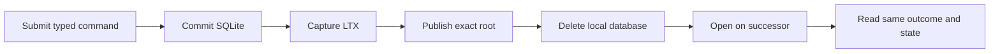
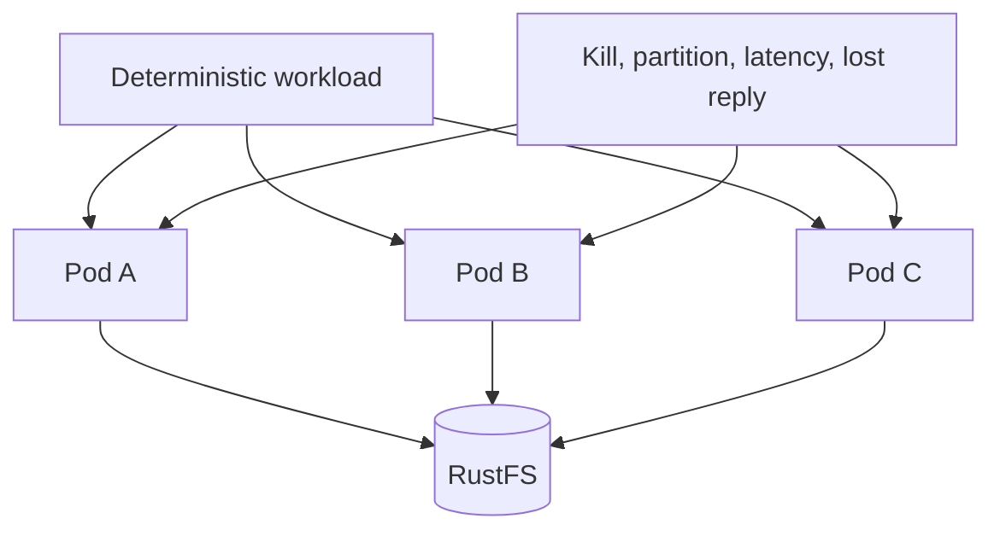

# Verify and qualify the Cell runtime

The runtime implementation covers identity, authority, SQLite execution, LTX publication, primitives, release control, private peers, and repository adapters. Production qualification still requires measured capacity and real multi-Pod network fault evidence.

| Document intent | Value |
| --- | --- |
| Content type | Verification plan |
| Audience | Implementers, reviewers, and release engineers |
| Goal | Map every runtime boundary to executable evidence and remaining release gates |

[Back to the Cell runtime index](README.md)

## Read the implementation map

Each layer has one owner and one primary evidence surface.

| Boundary | Primary source | Evidence |
| --- | --- | --- |
| Identity and Cell derivation | `src/identity.rs` | `tests/catalog.rs`, identity unit tests |
| Control CAS and transitions | `src/authority.rs`, `src/control.rs` | authority and actor tests |
| SQLite command ledger | `src/executor.rs`, `src/schema.rs` | `tests/actor.rs`, `tests/migration.rs` |
| Fixed SQL workers | `src/worker.rs` | `tests/workers.rs` |
| Publication and exact-root recovery | `src/publication.rs`, `crab-ltx` | `tests/publication.rs`, `crab-ltx/tests/cell_roots.rs` |
| Catalog | `src/catalog.rs` | `tests/catalog.rs` |
| Registry and codecs | `src/registry.rs`, `src/codec.rs` | `tests/registry.rs`, `tests/codec.rs` |
| Typed client and peer dispatch | `src/client.rs`, `src/peer.rs` | `tests/client.rs`, peer unit tests |
| SQL, KV, Queue, Workflow | `src/sql.rs`, `src/kv.rs`, `src/queue.rs`, `src/workflow.rs` | matching integration tests |
| Effects and activities | `src/effects.rs`, `src/activity_pool.rs` | `tests/effects.rs`, workflow tests |
| Scheduler | `src/scheduler.rs`, `src/maintenance.rs` | `tests/scheduler.rs` |
| Release control | `src/release.rs`, `src/release_progress.rs` | release unit tests and server command tests |
| Product composition | `crab-http-server/src/cells/` | server route, restore, and lifecycle tests |

Use the map during review. A change to one boundary needs caller, callee, sibling, and source-loss evidence where applicable.

## Run design-contract validation

The documentation keeps executable SQL and Protocol Buffers inputs beside the crate.

```bash
node crates/crab-cell-runtime/docs/validate.mjs
```

The script checks:

- Runtime, KV, Queue, and Workflow schemas load in SQLite
- Foreign keys, lease states, token lengths, and unique constraints reject invalid rows
- The peer descriptor compiles and round-trips representative messages
- The peer contract defines messages, not a public service
- Markdown links, anchors, fences, and trailing whitespace remain valid

This script validates contracts. It does not prove runtime behavior.

## Run crate-level proof

Set a worktree-specific external Cargo target directory before every Rust command.

```bash
CARGO_TARGET_DIR=$HOME/Workspace/crabbuild-target/crab-b347 \
  cargo test -p crab-cell-runtime

CARGO_TARGET_DIR=$HOME/Workspace/crabbuild-target/crab-b347 \
  cargo test -p crab-ltx --features replica

CARGO_TARGET_DIR=$HOME/Workspace/crabbuild-target/crab-b347 \
  cargo test -p crab-http-server
```

Run Clippy for all changed crates:

```bash
CARGO_TARGET_DIR=$HOME/Workspace/crabbuild-target/crab-b347-clippy \
  cargo clippy -p crab-ltx -p crab-cell-runtime \
  -p crab-http-server --all-targets -- -D warnings
```

Use the checkout's actual stable target suffix when it differs from `b347`.

## Prove the mutation contract

Mutation tests must cover the complete durability boundary.



Required cases are:

| Case | Expected proof |
| --- | --- |
| Replay | Same request ID and digest returns stored outcome without rerunning handler |
| Identity conflict | Same request ID with different digest is a durable rejection |
| Caller cancellation | Accepted command still publishes and later resolves |
| Lost CAS response | Exact successor is adopted; a different winner fences |
| Source loss | Successor restores exact database and outcome from object storage |
| Timeout | Admission closes; tentative local state never publishes |
| Panic | Affected Cell fences; worker thread remains usable |
| Drain | Accepted commands publish before SQLite close and authority release |

Mock-only tests do not satisfy source-loss or publication proof.

## Prove storage and LTX behavior

`crab-ltx` evidence must cover:

- Pending cuts stay owned until the exact root is confirmed
- Destination capacity is reserved before full restore downloads
- Sparse hydration verifies directory, frame, and page checksums
- Truncate and regrow cannot reuse invalid locators
- Incremental roots load only touched directory paths
- Full restore installs without replacing an existing destination
- Scheduled compaction promotes eligible singleton and multi-segment levels
- Compaction preserves transaction ID, checksum, sequence, and schema
- Injected filesystem and executor failures clean owned scratch state
- Cross-epoch continuation starts from the authoritative root

Repeat remote storage tests against real RustFS. In-memory object storage cannot prove provider ETag and streaming behavior.

The ignored qualification tests require one fresh bucket and a unique Cell prefix:

```bash
CRAB_LTX_TEST_BUCKET="$BUCKET" \
CRAB_LTX_TEST_ENDPOINT="$ENDPOINT" \
cargo test -p crab-ltx --features replica --test remote \
  rustfs_roundtrip -- --ignored --exact

CRAB_CELL_TEST_BUCKET="$BUCKET" \
CRAB_CELL_TEST_ENDPOINT="$ENDPOINT" \
CRAB_CELL_TEST_PREFIX="$UNIQUE_PREFIX" \
cargo test -p crab-cell-runtime --test actor \
  rustfs_source_loss_takeover_restores_exact_root_and_continues_publication \
  -- --ignored --exact
```

The Cell test publishes a command on one session, removes its local database,
takes over from a second session, resolves the original request from the exact
root, and publishes the next sequence. CI runs both tests against a pinned
RustFS image.

The same CI job also runs `crab-http-server` through public HTTP, private mTLS
forwarding to a remote owner, typed repository commands and LTX publication on
that RustFS origin. It then stops the owner endpoint, withdraws its advertisement,
publishes the authoritative fenced takeover, deletes the old local Cell directory,
restores the exact root on the ingress runtime and publishes the next command.
This combines the product network, source-loss and storage boundaries; it does
not replace the three-Pod kill and partition matrix below.

## Prove each primitive through recovery

Primitive tests require more than procedure-level SQL assertions.

| Primitive | Recovery evidence |
| --- | --- |
| SQL | Publish a batch, delete local DB, restore, query the same rows |
| KV | Apply checks and writes, restore, preserve versions and TTL behavior |
| Queue | Publish claim, restore, validate lease, reclaim expiry, complete attempt |
| Workflow | Pin definition, publish transition, restore, run retained definition |
| Activity | Publish claim, lose owner, take over, reclaim lease, complete next attempt |
| Effect | Publish source intent, deduplicate destination, resolve ambiguity, acknowledge source |

Also prove output, row, payload, attempt, lease, and retention bounds.

## Prove product integration

`crab-http-server` must show a user action, a real durable side effect, and a visible result.

The repository path needs these cases:

1. Start the server with real object storage
2. Create or adopt a repository and verify an empty Cell root
3. Exercise issue, comment, label, status, check, pull, release, and settings routes
4. Delete the owning node's local Cell files
5. Route the next request through another node
6. Verify the UI reads the restored state
7. Exercise public Git clone, fetch, and push independently of collaboration SQLite
8. Confirm shutdown drains both HTTP/Git work and Cell publication

The hard cut test must also prove that retired `app/v1` collaboration objects are never read.

## Run multi-Pod fault qualification

Unit and in-process integration tests don't prove network ownership behavior. Run at least three Pods against one RustFS origin.



Inject these faults while commands continue:

- Kill the current owner before and after SQLite commit
- Drop the control-CAS response after the origin accepts it
- Delay immutable uploads
- Partition one management endpoint
- Expire a node advertisement
- Exhaust local disk admission
- Restart with no local SQLite files
- Roll from one compatible image to another
- Enter maintenance with stored incompatible work

After each fault, verify one authoritative owner, monotonic sequence, stable replay, no false success, and no leaked activity or effect lease.

## Capacity qualification

The target workload is 1,000 to 10,000 active databases per node, 100 MB to 5,000 MB per database, and 1,000 aggregate transactions/s per node.

Qualify each node profile separately:

| Profile | Required matrix |
| --- | --- |
| Small | Minimum supported workload, admission behavior, drain under pressure |
| Medium | Mixed repository sizes, sustained command target, sparse takeover |
| Large | Maximum active-Cell target, 5,000 MB restore, compaction and renewal load |

Measure:

- Resident set size per active Cell and per workload class
- File descriptors per Cell and under HTTP/Git load
- Local bytes for main DB, WAL, retained LTX, sparse pages, and scratch
- Command p50, p95, and p99 latency
- Object-store requests and bytes per command
- Renewal updates per second
- Scheduler pass duration and due lag
- Takeover time with cold and warm directory caches
- Full restore and sparse first-read time
- Compaction throughput and peak scratch
- Graceful shutdown duration

Reject overload before SQLite or remote download starts. Qualification fails if the process swaps, exceeds its file-descriptor reserve, violates a five-second scheduler pass, or admits work beyond its shared disk budget.

## Apply the production gate

Production readiness requires all of these gates:

- Contract validation passes
- Runtime, LTX, and server tests pass
- Clippy and architecture guardrails pass
- Real RustFS source-loss recovery passes
- Three-Pod fault qualification passes
- Every supported node profile has measured admission envelopes
- Repository UI and Git operations pass end to end
- Backup and isolated-prefix restore pass
- Hard cutover rehearsal confirms no legacy collaboration reads

Until the last gate passes, describe the implementation as functionally complete but not production-qualified.
